# Billing & Subscriptions

<cite>
**Referenced Files in This Document**
- [03-subscriptions-paymongo.md](file://docs/superpowers/plans/monetization/03-subscriptions-paymongo.md)
- [billing.js](file://src/lib/billing.js)
- [entitlement.js](file://src/lib/entitlement.js)
- [pricing.js](file://src/lib/pricing.js)
- [create-checkout/index.ts](file://supabase/functions/create-checkout/index.ts)
- [paymongo-webhook/index.ts](file://supabase/functions/paymongo-webhook/index.ts)
- [paypal-webhook/index.ts](file://supabase/functions/paypal-webhook/index.ts)
- [create-paypal-order/index.ts](file://supabase/functions/create-paypal-order/index.ts)
- [capture-paypal-order/index.ts](file://supabase/functions/capture-paypal-order/index.ts)
- [cancel-subscription/index.ts](file://supabase/functions/cancel-subscription/index.ts)
- [entitlement.ts](file://supabase/functions/_shared/entitlement.ts)
- [paypal.ts](file://supabase/functions/_shared/paypal.ts)
- [paypal-runtime.ts](file://supabase/functions/_shared/paypal-runtime.ts)
- [http.ts](file://supabase/functions/_shared/http.ts)
- [001_schema.sql](file://supabase/migrations/001_schema.sql)
- [002_paypal_fulfillment.sql](file://supabase/migrations/002_paypal_fulfillment.sql)
</cite>

## Table of Contents
1. [Introduction](#introduction)
2. [Project Structure](#project-structure)
3. [Core Components](#core-components)
4. [Architecture Overview](#architecture-overview)
5. [Detailed Component Analysis](#detailed-component-analysis)
6. [Dependency Analysis](#dependency-analysis)
7. [Performance Considerations](#performance-considerations)
8. [Troubleshooting Guide](#troubleshooting-guide)
9. [Security and Compliance](#security-and-compliance)
10. [Conclusion](#conclusion)

## Introduction
This document explains the billing and subscription system for ApplyGuard PH, including dual payment processor integration with PayMongo and PayPal, checkout flows, webhook handling, subscription lifecycle management, plan tiers, entitlement calculations, error handling and retries, customer notifications, pricing configuration, promotional offers, refund processing, and security considerations.

## Project Structure
The billing and subscription features are implemented across:
- Frontend libraries for billing orchestration, entitlement evaluation, and pricing definitions
- Supabase Edge Functions for checkout creation, order capture, and webhook handlers
- Shared utilities for PayPal client runtime and HTTP helpers
- Database migrations for schema and fulfillment records

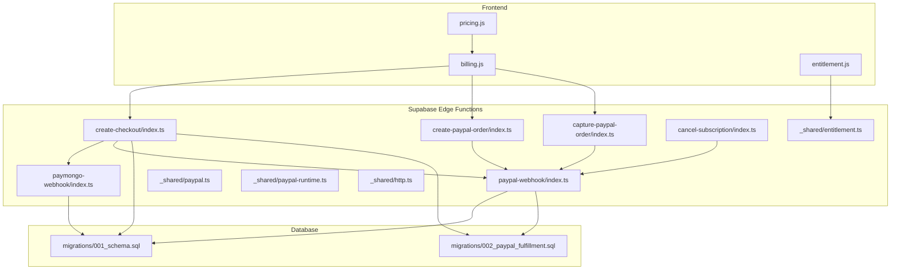

**Diagram sources**
- [billing.js](file://src/lib/billing.js)
- [entitlement.js](file://src/lib/entitlement.js)
- [pricing.js](file://src/lib/pricing.js)
- [create-checkout/index.ts](file://supabase/functions/create-checkout/index.ts)
- [paymongo-webhook/index.ts](file://supabase/functions/paymongo-webhook/index.ts)
- [paypal-webhook/index.ts](file://supabase/functions/paypal-webhook/index.ts)
- [create-paypal-order/index.ts](file://supabase/functions/create-paypal-order/index.ts)
- [capture-paypal-order/index.ts](file://supabase/functions/capture-paypal-order/index.ts)
- [cancel-subscription/index.ts](file://supabase/functions/cancel-subscription/index.ts)
- [entitlement.ts](file://supabase/functions/_shared/entitlement.ts)
- [paypal.ts](file://supabase/functions/_shared/paypal.ts)
- [paypal-runtime.ts](file://supabase/functions/_shared/paypal-runtime.ts)
- [http.ts](file://supabase/functions/_shared/http.ts)
- [001_schema.sql](file://supabase/migrations/001_schema.sql)
- [002_paypal_fulfillment.sql](file://supabase/migrations/002_paypal_fulfillment.sql)

**Section sources**
- [billing.js](file://src/lib/billing.js)
- [entitlement.js](file://src/lib/entitlement.js)
- [pricing.js](file://src/lib/pricing.js)
- [create-checkout/index.ts](file://supabase/functions/create-checkout/index.ts)
- [paymongo-webhook/index.ts](file://supabase/functions/paymongo-webhook/index.ts)
- [paypal-webhook/index.ts](file://supabase/functions/paypal-webhook/index.ts)
- [create-paypal-order/index.ts](file://supabase/functions/create-paypal-order/index.ts)
- [capture-paypal-order/index.ts](file://supabase/functions/capture-paypal-order/index.ts)
- [cancel-subscription/index.ts](file://supabase/functions/cancel-subscription/index.ts)
- [entitlement.ts](file://supabase/functions/_shared/entitlement.ts)
- [paypal.ts](file://supabase/functions/_shared/paypal.ts)
- [paypal-runtime.ts](file://supabase/functions/_shared/paypal-runtime.ts)
- [http.ts](file://supabase/functions/_shared/http.ts)
- [001_schema.sql](file://supabase/migrations/001_schema.sql)
- [002_paypal_fulfillment.sql](file://supabase/migrations/002_paypal_fulfillment.sql)

## Core Components
- Billing orchestration (frontend): Initiates checkout sessions, manages provider selection, and coordinates post-payment state updates.
- Entitlement engine (frontend and shared): Evaluates user access based on active subscriptions and plan features.
- Pricing catalog (frontend): Defines plan tiers, prices, and optional promotions.
- Checkout creation (Edge Function): Creates provider-specific checkout sessions or orders.
- Webhooks (Edge Functions): Process PayMongo and PayPal events to fulfill payments and update subscriptions.
- PayPal utilities (shared): Client runtime and helper functions for PayPal API calls.
- HTTP utilities (shared): Common HTTP request/response helpers used by functions.
- Database schema (migrations): Stores subscription records, fulfillment logs, and related metadata.

**Section sources**
- [billing.js](file://src/lib/billing.js)
- [entitlement.js](file://src/lib/entitlement.js)
- [pricing.js](file://src/lib/pricing.js)
- [create-checkout/index.ts](file://supabase/functions/create-checkout/index.ts)
- [paymongo-webhook/index.ts](file://supabase/functions/paymongo-webhook/index.ts)
- [paypal-webhook/index.ts](file://supabase/functions/paypal-webhook/index.ts)
- [entitlement.ts](file://supabase/functions/_shared/entitlement.ts)
- [paypal.ts](file://supabase/functions/_shared/paypal.ts)
- [paypal-runtime.ts](file://supabase/functions/_shared/paypal-runtime.ts)
- [http.ts](file://supabase/functions/_shared/http.ts)
- [001_schema.sql](file://supabase/migrations/001_schema.sql)
- [002_paypal_fulfillment.sql](file://supabase/migrations/002_paypal_fulfillment.sql)

## Architecture Overview
The system uses a dual-processor approach:
- PayMongo: Checkout session creation and webhook-driven fulfillment.
- PayPal: Order creation, capture, and webhook-driven fulfillment.

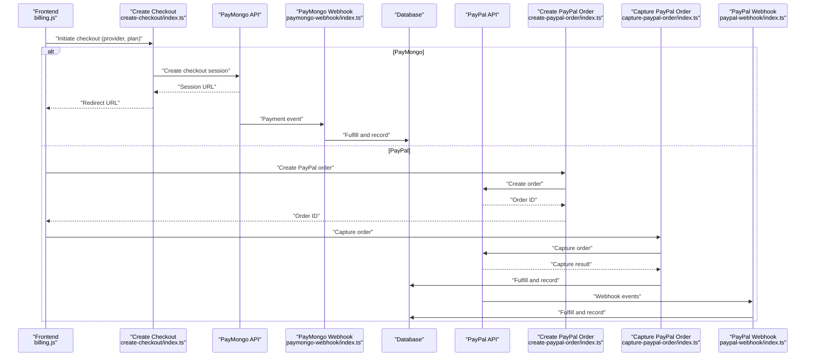

**Diagram sources**
- [billing.js](file://src/lib/billing.js)
- [create-checkout/index.ts](file://supabase/functions/create-checkout/index.ts)
- [paymongo-webhook/index.ts](file://supabase/functions/paymongo-webhook/index.ts)
- [create-paypal-order/index.ts](file://supabase/functions/create-paypal-order/index.ts)
- [capture-paypal-order/index.ts](file://supabase/functions/capture-paypal-order/index.ts)
- [paypal-webhook/index.ts](file://supabase/functions/paypal-webhook/index.ts)
- [001_schema.sql](file://supabase/migrations/001_schema.sql)
- [002_paypal_fulfillment.sql](file://supabase/migrations/002_paypal_fulfillment.sql)

## Detailed Component Analysis

### PayMongo Integration
- Checkout creation: The create-checkout function initializes a PayMongo session and returns a redirect URL to the frontend.
- Webhook handling: The paymongo-webhook function validates incoming events, verifies signatures, and fulfills payments by updating subscription records and entitlements.

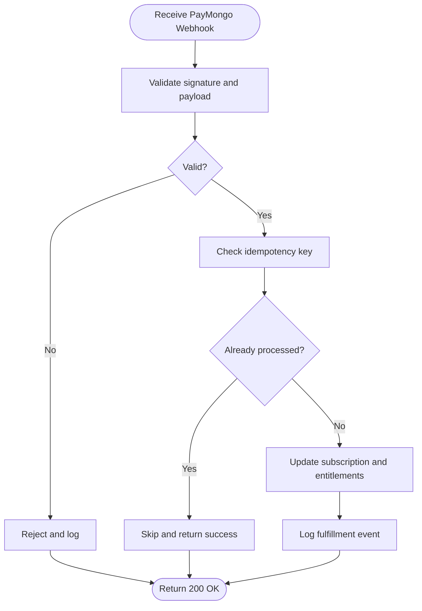

**Diagram sources**
- [paymongo-webhook/index.ts](file://supabase/functions/paymongo-webhook/index.ts)
- [001_schema.sql](file://supabase/migrations/001_schema.sql)
- [002_paypal_fulfillment.sql](file://supabase/migrations/002_paypal_fulfillment.sql)

**Section sources**
- [create-checkout/index.ts](file://supabase/functions/create-checkout/index.ts)
- [paymongo-webhook/index.ts](file://supabase/functions/paymongo-webhook/index.ts)
- [001_schema.sql](file://supabase/migrations/001_schema.sql)
- [002_paypal_fulfillment.sql](file://supabase/migrations/002_paypal_fulfillment.sql)

### PayPal Integration
- Order creation: The create-paypal-order function creates a PayPal order and returns an order ID for capture.
- Order capture: The capture-paypal-order function captures the order and fulfills the subscription.
- Webhook handling: The paypal-webhook function processes PayPal events (e.g., payment completed) and fulfills accordingly.

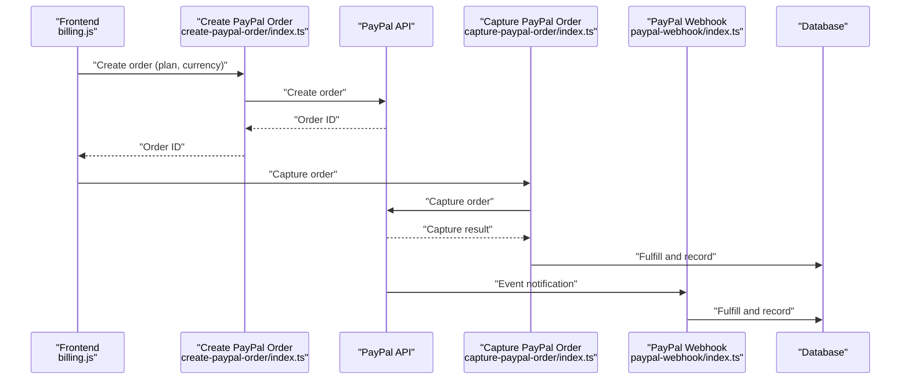

**Diagram sources**
- [create-paypal-order/index.ts](file://supabase/functions/create-paypal-order/index.ts)
- [capture-paypal-order/index.ts](file://supabase/functions/capture-paypal-order/index.ts)
- [paypal-webhook/index.ts](file://supabase/functions/paypal-webhook/index.ts)
- [paypal.ts](file://supabase/functions/_shared/paypal.ts)
- [paypal-runtime.ts](file://supabase/functions/_shared/paypal-runtime.ts)
- [001_schema.sql](file://supabase/migrations/001_schema.sql)
- [002_paypal_fulfillment.sql](file://supabase/migrations/002_paypal_fulfillment.sql)

**Section sources**
- [create-paypal-order/index.ts](file://supabase/functions/create-paypal-order/index.ts)
- [capture-paypal-order/index.ts](file://supabase/functions/capture-paypal-order/index.ts)
- [paypal-webhook/index.ts](file://supabase/functions/paypal-webhook/index.ts)
- [paypal.ts](file://supabase/functions/_shared/paypal.ts)
- [paypal-runtime.ts](file://supabase/functions/_shared/paypal-runtime.ts)
- [001_schema.sql](file://supabase/migrations/001_schema.sql)
- [002_paypal_fulfillment.sql](file://supabase/migrations/002_paypal_fulfillment.sql)

### Subscription Lifecycle Management
- Creation: Initiated via checkout; fulfilled upon successful payment through either provider.
- Renewal: Managed by providers; webhooks notify the system to extend subscription periods.
- Cancellation: Handled by cancel-subscription function, which updates status and notifies providers if needed.
- Expiration: Evaluated at runtime using current time and subscription end dates.

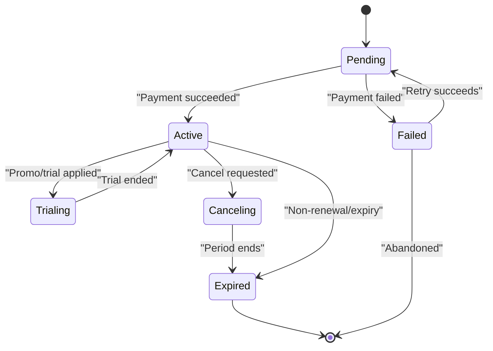

**Diagram sources**
- [cancel-subscription/index.ts](file://supabase/functions/cancel-subscription/index.ts)
- [001_schema.sql](file://supabase/migrations/001_schema.sql)
- [002_paypal_fulfillment.sql](file://supabase/migrations/002_paypal_fulfillment.sql)

**Section sources**
- [cancel-subscription/index.ts](file://supabase/functions/cancel-subscription/index.ts)
- [001_schema.sql](file://supabase/migrations/001_schema.sql)
- [002_paypal_fulfillment.sql](file://supabase/migrations/002_paypal_fulfillment.sql)

### Plan Tiers and Pricing Configuration
- Plan tiers are defined in the pricing module and consumed by billing orchestration.
- Prices, currencies, and plan identifiers are referenced during checkout creation.
- Promotional offers can adjust effective price or trial length before creating checkout sessions.

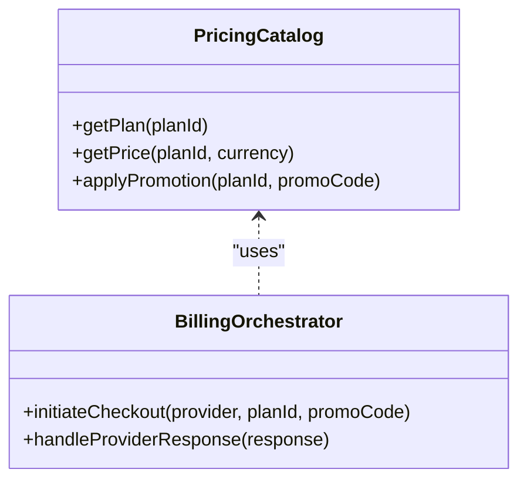

**Diagram sources**
- [pricing.js](file://src/lib/pricing.js)
- [billing.js](file://src/lib/billing.js)

**Section sources**
- [pricing.js](file://src/lib/pricing.js)
- [billing.js](file://src/lib/billing.js)

### Entitlement Calculations
- Frontend entitlement evaluation reads active subscriptions and applies feature flags.
- Shared entitlement logic ensures server-side consistency when fulfilling payments.

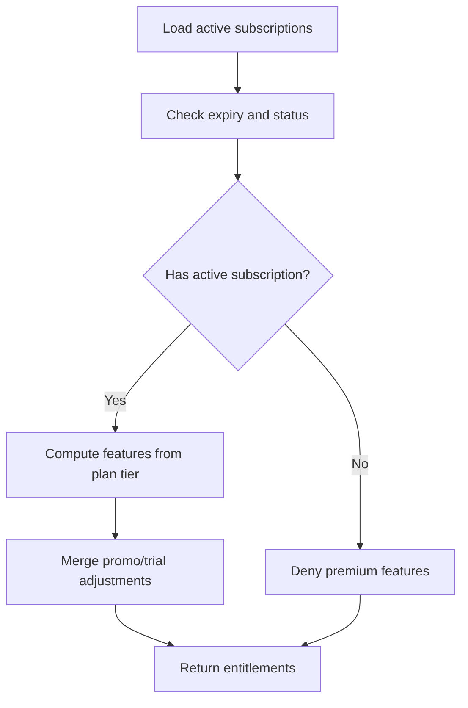

**Diagram sources**
- [entitlement.js](file://src/lib/entitlement.js)
- [entitlement.ts](file://supabase/functions/_shared/entitlement.ts)

**Section sources**
- [entitlement.js](file://src/lib/entitlement.js)
- [entitlement.ts](file://supabase/functions/_shared/entitlement.ts)

### Checkout Flow Implementation
- Frontend selects provider and plan, then calls the appropriate function to initiate checkout.
- For PayMongo, the frontend redirects to the returned session URL.
- For PayPal, the frontend creates an order and captures it after user approval.

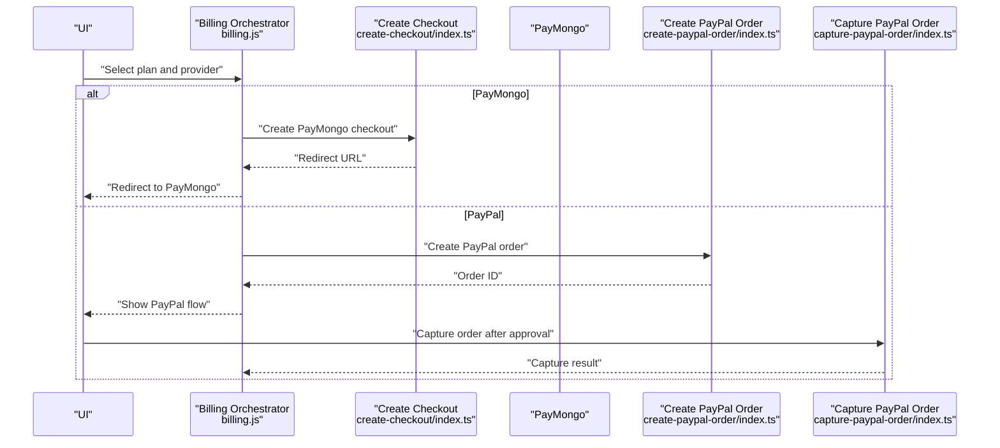

**Diagram sources**
- [billing.js](file://src/lib/billing.js)
- [create-checkout/index.ts](file://supabase/functions/create-checkout/index.ts)
- [create-paypal-order/index.ts](file://supabase/functions/create-paypal-order/index.ts)
- [capture-paypal-order/index.ts](file://supabase/functions/capture-paypal-order/index.ts)

**Section sources**
- [billing.js](file://src/lib/billing.js)
- [create-checkout/index.ts](file://supabase/functions/create-checkout/index.ts)
- [create-paypal-order/index.ts](file://supabase/functions/create-paypal-order/index.ts)
- [capture-paypal-order/index.ts](file://supabase/functions/capture-paypal-order/index.ts)

### Error Handling, Retries, and Notifications
- Payment failures: Webhooks and capture responses trigger failure states; retry mechanisms can be scheduled based on provider feedback.
- Idempotency: Webhook handlers should deduplicate events to prevent double fulfillment.
- Customer notifications: On success/failure, update UI state and optionally send email or in-app notifications.

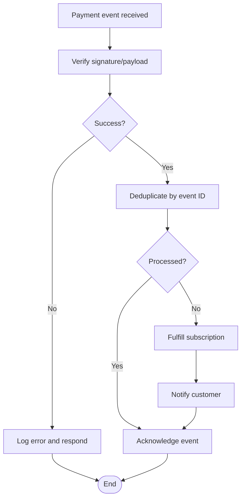

**Diagram sources**
- [paymongo-webhook/index.ts](file://supabase/functions/paymongo-webhook/index.ts)
- [paypal-webhook/index.ts](file://supabase/functions/paypal-webhook/index.ts)
- [http.ts](file://supabase/functions/_shared/http.ts)

**Section sources**
- [paymongo-webhook/index.ts](file://supabase/functions/paymongo-webhook/index.ts)
- [paypal-webhook/index.ts](file://supabase/functions/paypal-webhook/index.ts)
- [http.ts](file://supabase/functions/_shared/http.ts)

### Refund Processing
- Refunds are initiated by providers; webhooks should handle refund events to adjust subscription status and issue credits if applicable.
- Ensure idempotent refund processing and audit logging.

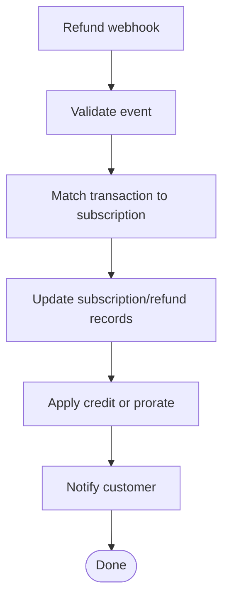

**Diagram sources**
- [paymongo-webhook/index.ts](file://supabase/functions/paymongo-webhook/index.ts)
- [paypal-webhook/index.ts](file://supabase/functions/paypal-webhook/index.ts)
- [001_schema.sql](file://supabase/migrations/001_schema.sql)
- [002_paypal_fulfillment.sql](file://supabase/migrations/002_paypal_fulfillment.sql)

**Section sources**
- [paymongo-webhook/index.ts](file://supabase/functions/paymongo-webhook/index.ts)
- [paypal-webhook/index.ts](file://supabase/functions/paypal-webhook/index.ts)
- [001_schema.sql](file://supabase/migrations/001_schema.sql)
- [002_paypal_fulfillment.sql](file://supabase/migrations/002_paypal_fulfillment.sql)

## Dependency Analysis
Key dependencies include:
- Frontend modules depend on pricing and billing orchestration.
- Edge functions depend on shared PayPal runtime and HTTP utilities.
- Webhooks depend on database schema for subscription and fulfillment records.

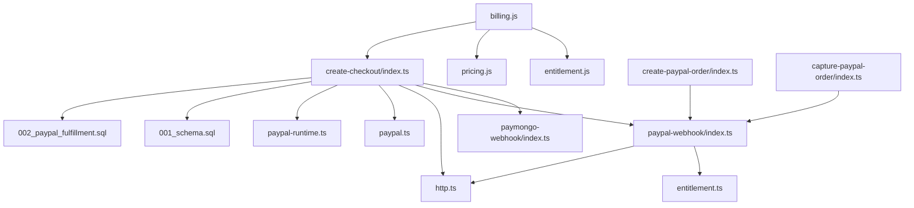

**Diagram sources**
- [billing.js](file://src/lib/billing.js)
- [entitlement.js](file://src/lib/entitlement.js)
- [pricing.js](file://src/lib/pricing.js)
- [create-checkout/index.ts](file://supabase/functions/create-checkout/index.ts)
- [paymongo-webhook/index.ts](file://supabase/functions/paymongo-webhook/index.ts)
- [paypal-webhook/index.ts](file://supabase/functions/paypal-webhook/index.ts)
- [create-paypal-order/index.ts](file://supabase/functions/create-paypal-order/index.ts)
- [capture-paypal-order/index.ts](file://supabase/functions/capture-paypal-order/index.ts)
- [entitlement.ts](file://supabase/functions/_shared/entitlement.ts)
- [paypal.ts](file://supabase/functions/_shared/paypal.ts)
- [paypal-runtime.ts](file://supabase/functions/_shared/paypal-runtime.ts)
- [http.ts](file://supabase/functions/_shared/http.ts)
- [001_schema.sql](file://supabase/migrations/001_schema.sql)
- [002_paypal_fulfillment.sql](file://supabase/migrations/002_paypal_fulfillment.sql)

**Section sources**
- [billing.js](file://src/lib/billing.js)
- [entitlement.js](file://src/lib/entitlement.js)
- [pricing.js](file://src/lib/pricing.js)
- [create-checkout/index.ts](file://supabase/functions/create-checkout/index.ts)
- [paymongo-webhook/index.ts](file://supabase/functions/paymongo-webhook/index.ts)
- [paypal-webhook/index.ts](file://supabase/functions/paypal-webhook/index.ts)
- [create-paypal-order/index.ts](file://supabase/functions/create-paypal-order/index.ts)
- [capture-paypal-order/index.ts](file://supabase/functions/capture-paypal-order/index.ts)
- [entitlement.ts](file://supabase/functions/_shared/entitlement.ts)
- [paypal.ts](file://supabase/functions/_shared/paypal.ts)
- [paypal-runtime.ts](file://supabase/functions/_shared/paypal-runtime.ts)
- [http.ts](file://supabase/functions/_shared/http.ts)
- [001_schema.sql](file://supabase/migrations/001_schema.sql)
- [002_paypal_fulfillment.sql](file://supabase/migrations/002_paypal_fulfillment.sql)

## Performance Considerations
- Use idempotency keys in webhooks to avoid duplicate processing.
- Cache plan and pricing data on the frontend to reduce repeated lookups.
- Minimize network calls by batching entitlement checks where possible.
- Implement exponential backoff for transient provider errors.

[No sources needed since this section provides general guidance]

## Troubleshooting Guide
Common issues and resolutions:
- Invalid webhook signature: Verify secret configuration and ensure payloads are not tampered with.
- Duplicate fulfillment: Confirm idempotency handling and deduplication logic.
- Capture failures: Inspect capture response codes and retry with backoff.
- Subscription not activating: Check database records and fulfillment logs for missing entries.

**Section sources**
- [paymongo-webhook/index.ts](file://supabase/functions/paymongo-webhook/index.ts)
- [paypal-webhook/index.ts](file://supabase/functions/paypal-webhook/index.ts)
- [capture-paypal-order/index.ts](file://supabase/functions/capture-paypal-order/index.ts)
- [001_schema.sql](file://supabase/migrations/001_schema.sql)
- [002_paypal_fulfillment.sql](file://supabase/migrations/002_paypal_fulfillment.sql)

## Security and Compliance
- Do not store raw payment card data; rely on provider-hosted checkout flows.
- Validate and sign all webhook requests; reject invalid payloads.
- Enforce least privilege for function secrets and environment variables.
- Maintain audit logs for all billing events and refunds.
- Follow PCI DSS requirements by avoiding direct handling of sensitive payment data.

[No sources needed since this section provides general guidance]

## Conclusion
ApplyGuard PH’s billing and subscription system integrates PayMongo and PayPal through robust checkout flows and webhook-driven fulfillment. With clear plan tiers, entitlement calculations, and strong error handling, the system supports reliable subscription lifecycle management while maintaining security and compliance best practices.