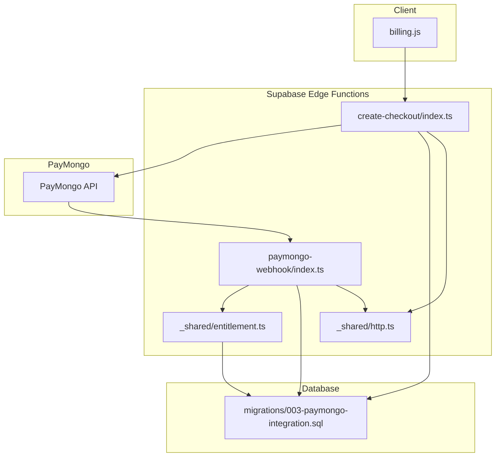
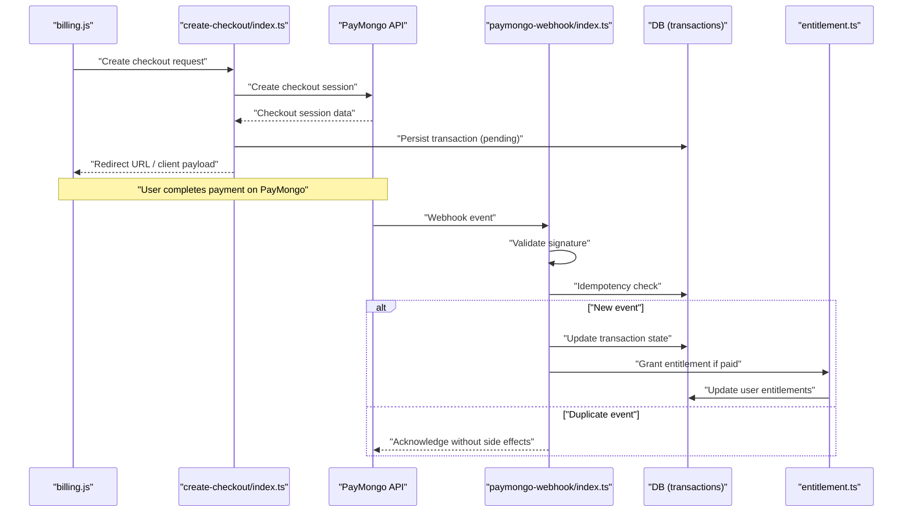
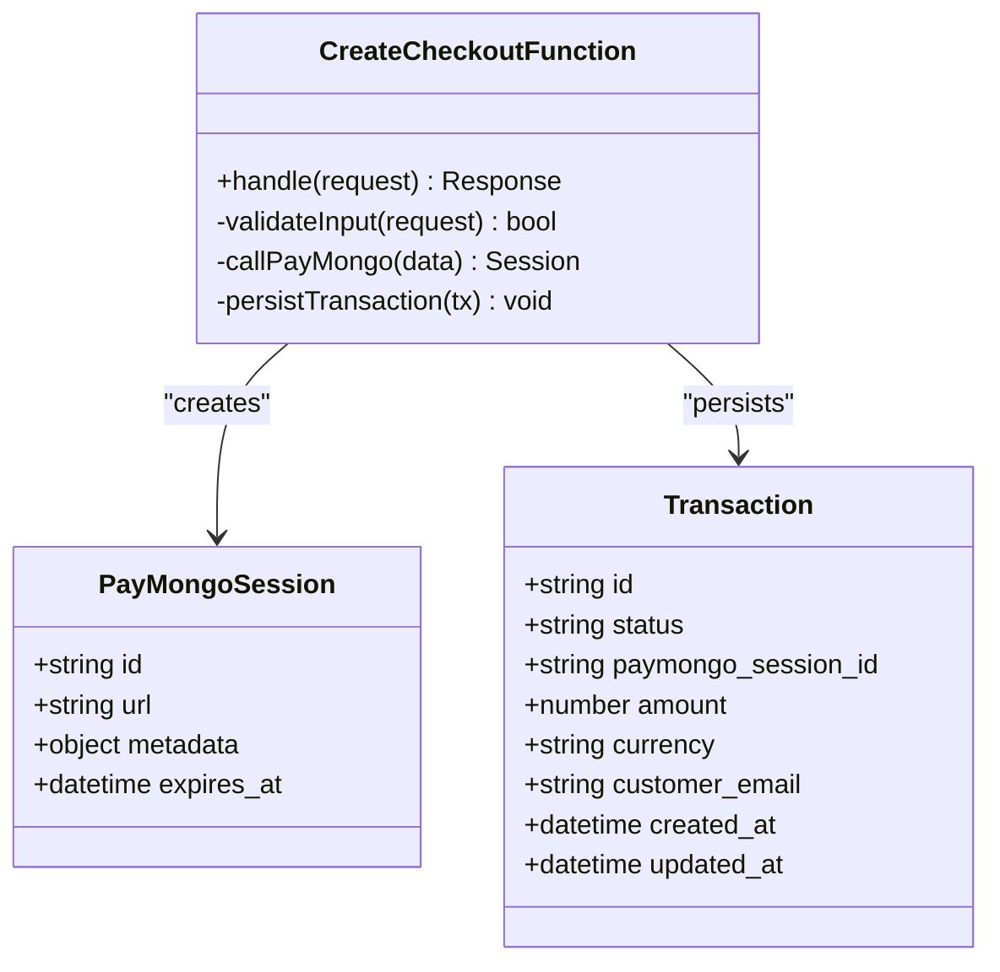
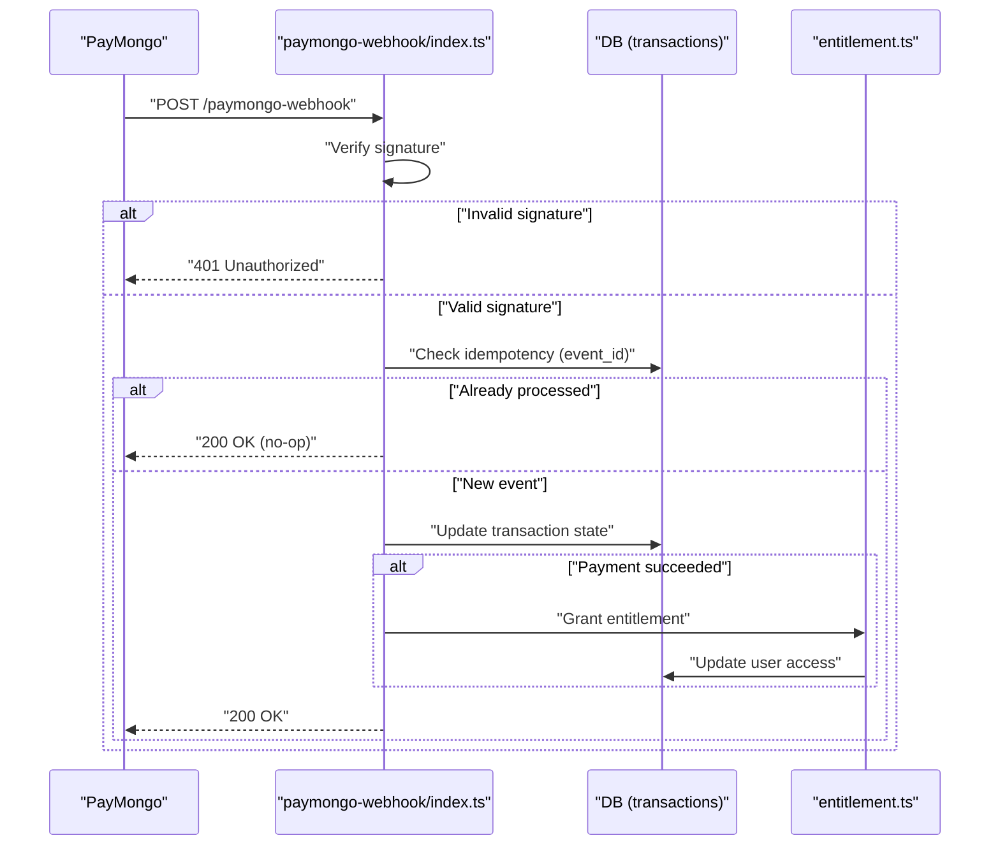
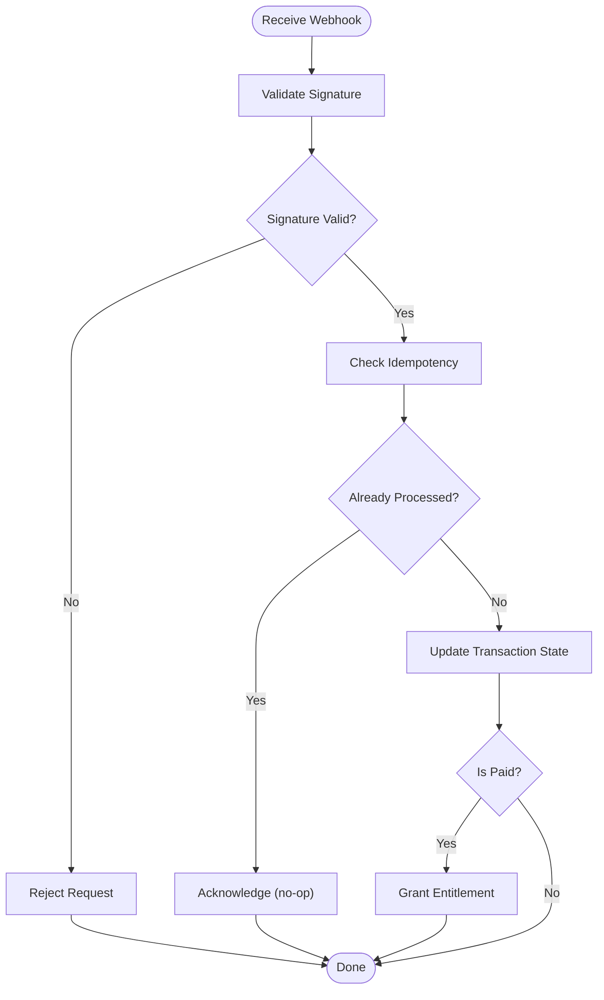
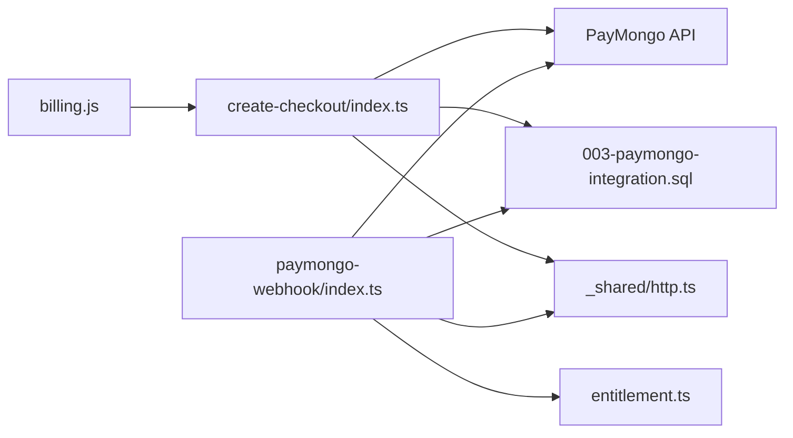

# PayMongo Integration

<cite>
**Referenced Files in This Document**
- [create-checkout/index.ts](file://supabase/functions/create-checkout/index.ts)
- [paymongo-webhook/index.ts](file://supabase/functions/paymongo-webhook/index.ts)
- [003-paymongo-integration.sql](file://supabase/migrations/003-paymongo-integration.sql)
- [billing.js](file://src/lib/billing.js)
- [entitlement.ts](file://supabase/functions/_shared/entitlement.ts)
- [http.ts](file://supabase/functions/_shared/http.ts)
</cite>

## Table of Contents
1. [Introduction](#introduction)
2. [Project Structure](#project-structure)
3. [Core Components](#core-components)
4. [Architecture Overview](#architecture-overview)
5. [Detailed Component Analysis](#detailed-component-analysis)
6. [Dependency Analysis](#dependency-analysis)
7. [Performance Considerations](#performance-considerations)
8. [Troubleshooting Guide](#troubleshooting-guide)
9. [Conclusion](#conclusion)
10. [Appendices](#appendices)

## Introduction
This document explains the PayMongo payment processor integration, focusing on:
- Checkout creation flow and request/response schemas
- Payment method handling and provider-specific API calls
- Webhook event processing, signature verification, and idempotency
- Transaction state management and entitlement updates
- Configuration requirements, security considerations, and troubleshooting

The implementation uses Supabase Edge Functions for server-side operations and a client library to orchestrate checkout sessions.

## Project Structure
Key files involved in the PayMongo integration:
- supabase/functions/create-checkout/index.ts: Creates PayMongo checkout sessions
- supabase/functions/paymongo-webhook/index.ts: Processes PayMongo webhook events
- supabase/migrations/003-paymongo-integration.sql: Database schema for transactions and related entities
- src/lib/billing.js: Client-side billing utilities that call create-checkout
- supabase/functions/_shared/entitlement.ts: Shared logic for updating user entitlements after successful payments
- supabase/functions/_shared/http.ts: HTTP helpers used by functions

**Diagram sources**
- [create-checkout/index.ts](file://supabase/functions/create-checkout/index.ts)
- [paymongo-webhook/index.ts](file://supabase/functions/paymongo-webhook/index.ts)
- [003-paymongo-integration.sql](file://supabase/migrations/003-paymongo-integration.sql)
- [billing.js](file://src/lib/billing.js)
- [entitlement.ts](file://supabase/functions/_shared/entitlement.ts)
- [http.ts](file://supabase/functions/_shared/http.ts)

**Section sources**
- [create-checkout/index.ts](file://supabase/functions/create-checkout/index.ts)
- [paymongo-webhook/index.ts](file://supabase/functions/paymongo-webhook/index.ts)
- [003-paymongo-integration.sql](file://supabase/migrations/003-paymongo-integration.sql)
- [billing.js](file://src/lib/billing.js)
- [entitlement.ts](file://supabase/functions/_shared/entitlement.ts)
- [http.ts](file://supabase/functions/_shared/http.ts)

## Core Components
- Create Checkout Function: Orchestrates session creation with PayMongo, persists transaction records, and returns a redirect URL or client payload.
- Webhook Handler: Validates incoming events, verifies signatures, applies idempotency, updates transaction states, and triggers entitlement updates.
- Billing Client: Calls the create-checkout function and handles UI flows based on responses.
- Entitlement Updater: Applies access changes after confirmed payments.
- HTTP Helpers: Encapsulate outbound/inbound HTTP interactions and error mapping.

**Section sources**
- [create-checkout/index.ts](file://supabase/functions/create-checkout/index.ts)
- [paymongo-webhook/index.ts](file://supabase/functions/paymongo-webhook/index.ts)
- [billing.js](file://src/lib/billing.js)
- [entitlement.ts](file://supabase/functions/_shared/entitlement.ts)
- [http.ts](file://supabase/functions/_shared/http.ts)

## Architecture Overview
High-level flow:
- Client requests a checkout via the create-checkout function.
- The function creates a PayMongo checkout session and stores a transaction record.
- The client redirects users to the PayMongo-hosted checkout page.
- After payment, PayMongo sends webhooks to the paymongo-webhook function.
- The webhook handler validates and processes events, updates transaction state, and grants entitlements.

**Diagram sources**
- [create-checkout/index.ts](file://supabase/functions/create-checkout/index.ts)
- [paymongo-webhook/index.ts](file://supabase/functions/paymongo-webhook/index.ts)
- [003-paymongo-integration.sql](file://supabase/migrations/003-paymongo-integration.sql)
- [billing.js](file://src/lib/billing.js)
- [entitlement.ts](file://supabase/functions/_shared/entitlement.ts)

## Detailed Component Analysis

### Create Checkout Flow
Responsibilities:
- Accept client input (e.g., plan, currency, metadata).
- Call PayMongo to create a checkout session.
- Persist a transaction record with initial pending state.
- Return a redirect URL or client payload for the hosted checkout.

Request/Response Schemas:
- Request fields typically include:
  - plan_id or item references
  - amount and currency
  - customer info (email, name)
  - metadata (order_id, user_id)
  - success/cancel URLs
- Response includes:
  - checkout_url for redirection
  - transaction_id for tracking
  - status and timestamps

Error Handling:
- Map PayMongo errors to standardized responses.
- Ensure partial failures do not leave inconsistent transaction states.

Transaction State Management:
- Initial state: pending
- Updated by webhook to paid, failed, or canceled
- Idempotent updates prevent duplicate state transitions

Provider-Specific API Calls:
- Uses PayMongo’s checkout/session endpoints to create sessions and retrieve details when needed.

Security Considerations:
- Validate and sanitize inputs.
- Use environment variables for secrets.
- Avoid logging sensitive payloads.

**Section sources**
- [create-checkout/index.ts](file://supabase/functions/create-checkout/index.ts)
- [003-paymongo-integration.sql](file://supabase/migrations/003-paymongo-integration.sql)
- [http.ts](file://supabase/functions/_shared/http.ts)

#### Class Diagram: Create Checkout Entities

**Diagram sources**
- [create-checkout/index.ts](file://supabase/functions/create-checkout/index.ts)
- [003-paymongo-integration.sql](file://supabase/migrations/003-paymongo-integration.sql)

### Webhook Event Processing
Responsibilities:
- Receive PayMongo webhook events.
- Verify event signature using configured secret.
- Enforce idempotency to avoid duplicate processing.
- Update transaction state based on event type.
- Trigger entitlement updates upon successful payments.

Event Validation and Signature Verification:
- Compute expected signature from payload and secret.
- Reject events with invalid or missing signatures.

Idempotency Patterns:
- Track processed event IDs.
- Skip processing if already handled.

State Transitions:
- pending -> paid
- pending -> failed
- pending -> canceled
- paid -> refunded (if applicable)

Entitlement Updates:
- On paid events, update user access according to plan rules.

**Section sources**
- [paymongo-webhook/index.ts](file://supabase/functions/paymongo-webhook/index.ts)
- [entitlement.ts](file://supabase/functions/_shared/entitlement.ts)
- [003-paymongo-integration.sql](file://supabase/migrations/003-paymongo-integration.sql)

#### Sequence Diagram: Webhook Processing

**Diagram sources**
- [paymongo-webhook/index.ts](file://supabase/functions/paymongo-webhook/index.ts)
- [entitlement.ts](file://supabase/functions/_shared/entitlement.ts)
- [003-paymongo-integration.sql](file://supabase/migrations/003-paymongo-integration.sql)

#### Flowchart: Webhook Decision Logic

**Diagram sources**
- [paymongo-webhook/index.ts](file://supabase/functions/paymongo-webhook/index.ts)
- [entitlement.ts](file://supabase/functions/_shared/entitlement.ts)

### Client Billing Utilities
Responsibilities:
- Call create-checkout with required parameters.
- Handle redirect to PayMongo checkout.
- Poll or listen for completion and update UI accordingly.

Integration Points:
- Uses environment configuration for function endpoints.
- Passes metadata linking to user accounts and orders.

**Section sources**
- [billing.js](file://src/lib/billing.js)
- [create-checkout/index.ts](file://supabase/functions/create-checkout/index.ts)

### Shared Utilities
HTTP Helpers:
- Provide consistent request/response handling.
- Centralize error mapping and retries where appropriate.

Entitlement Updater:
- Encapsulates business rules for granting access.
- Ensures atomic updates to user entitlements.

**Section sources**
- [http.ts](file://supabase/functions/_shared/http.ts)
- [entitlement.ts](file://supabase/functions/_shared/entitlement.ts)

## Dependency Analysis
Component relationships:
- billing.js depends on create-checkout function.
- create-checkout depends on PayMongo API and database schema.
- paymongo-webhook depends on PayMongo events, database schema, and entitlement updater.
- Both functions use shared http.ts for HTTP operations.

**Diagram sources**
- [billing.js](file://src/lib/billing.js)
- [create-checkout/index.ts](file://supabase/functions/create-checkout/index.ts)
- [paymongo-webhook/index.ts](file://supabase/functions/paymongo-webhook/index.ts)
- [003-paymongo-integration.sql](file://supabase/migrations/003-paymongo-integration.sql)
- [entitlement.ts](file://supabase/functions/_shared/entitlement.ts)
- [http.ts](file://supabase/functions/_shared/http.ts)

**Section sources**
- [billing.js](file://src/lib/billing.js)
- [create-checkout/index.ts](file://supabase/functions/create-checkout/index.ts)
- [paymongo-webhook/index.ts](file://supabase/functions/paymongo-webhook/index.ts)
- [003-paymongo-integration.sql](file://supabase/migrations/003-paymongo-integration.sql)
- [entitlement.ts](file://supabase/functions/_shared/entitlement.ts)
- [http.ts](file://supabase/functions/_shared/http.ts)

## Performance Considerations
- Minimize network calls by batching operations where possible.
- Cache non-sensitive configuration values at runtime.
- Use idempotency keys to reduce redundant processing.
- Keep webhook handlers fast; offload heavy work to background tasks if needed.
- Monitor latency and error rates for PayMongo API calls.

[No sources needed since this section provides general guidance]

## Troubleshooting Guide
Common issues and resolutions:
- Invalid webhook signature:
  - Ensure correct secret is configured and used for verification.
  - Confirm payload integrity and timestamp validation.
- Duplicate webhook events:
  - Verify idempotency checks are implemented and event IDs are tracked.
- Failed checkout creation:
  - Inspect PayMongo error codes and map them to user-friendly messages.
  - Validate request fields and amounts.
- Transaction state inconsistencies:
  - Reconcile transaction records with PayMongo session statuses.
  - Implement retry mechanisms for transient failures.
- Entitlement not granted:
  - Confirm paid events are processed and entitlement updater runs successfully.
  - Check database constraints and permissions.

Operational tips:
- Log structured events without sensitive data.
- Add health checks for external dependencies.
- Set up alerts for webhook failures and high error rates.

**Section sources**
- [paymongo-webhook/index.ts](file://supabase/functions/paymongo-webhook/index.ts)
- [create-checkout/index.ts](file://supabase/functions/create-checkout/index.ts)
- [entitlement.ts](file://supabase/functions/_shared/entitlement.ts)

## Conclusion
The PayMongo integration follows a robust pattern:
- Server-side checkout creation with clear transaction tracking
- Secure webhook processing with signature verification and idempotency
- Automatic entitlement updates upon successful payments
Adhering to the documented schemas, error handling strategies, and security practices ensures reliable and maintainable payment flows.

[No sources needed since this section summarizes without analyzing specific files]

## Appendices

### Configuration Requirements
- Environment variables:
  - PayMongo API keys (test/live)
  - Webhook signing secret
  - Function endpoints and base URLs
- Database schema:
  - Transactions table with status, identifiers, and timestamps
  - Optional indexes for query performance

**Section sources**
- [003-paymongo-integration.sql](file://supabase/migrations/003-paymongo-integration.sql)

### Security Considerations
- Never log sensitive payloads or tokens.
- Validate all inputs and enforce least privilege.
- Use HTTPS and secure headers for all endpoints.
- Rotate secrets regularly and restrict access to production credentials.

[No sources needed since this section provides general guidance]