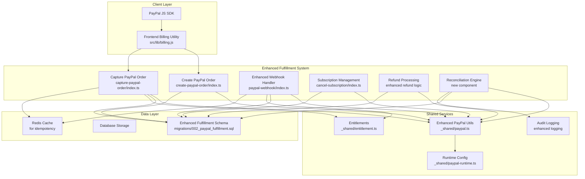
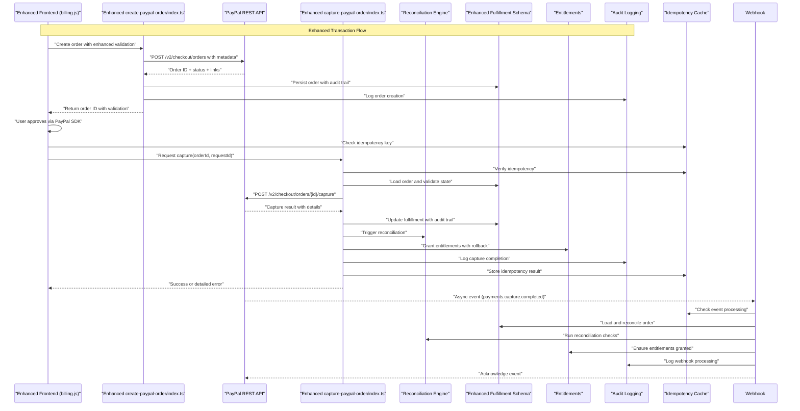
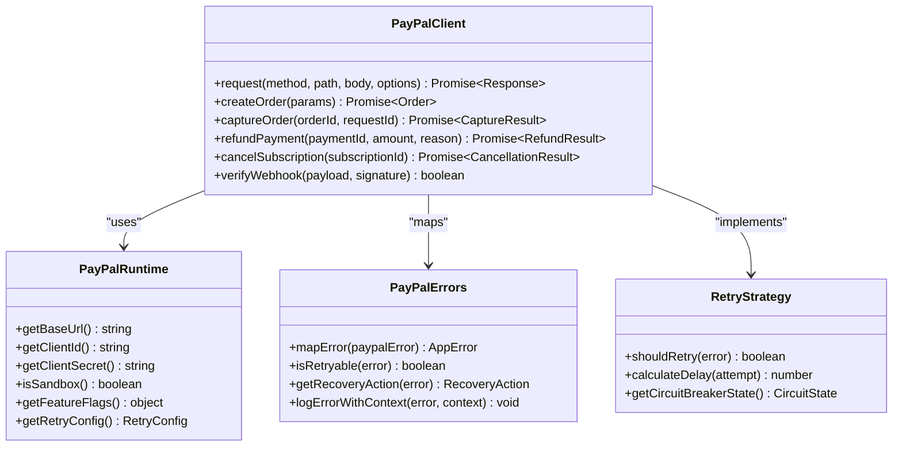
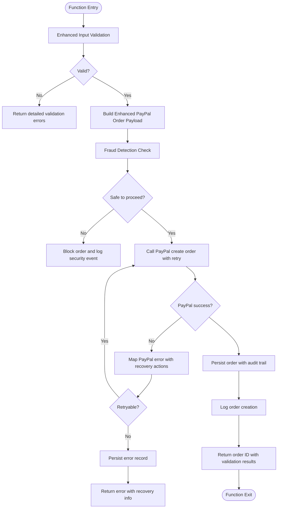
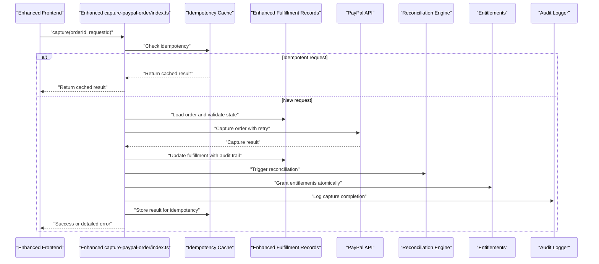
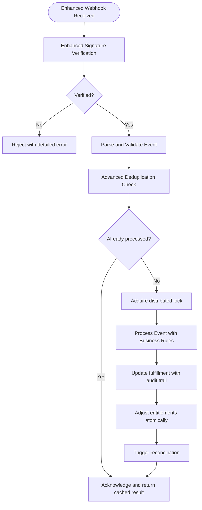
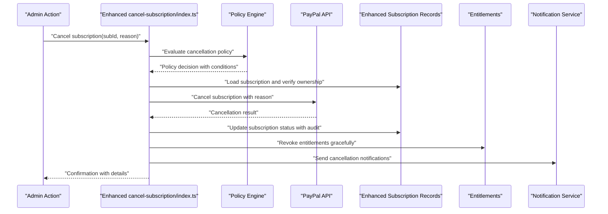
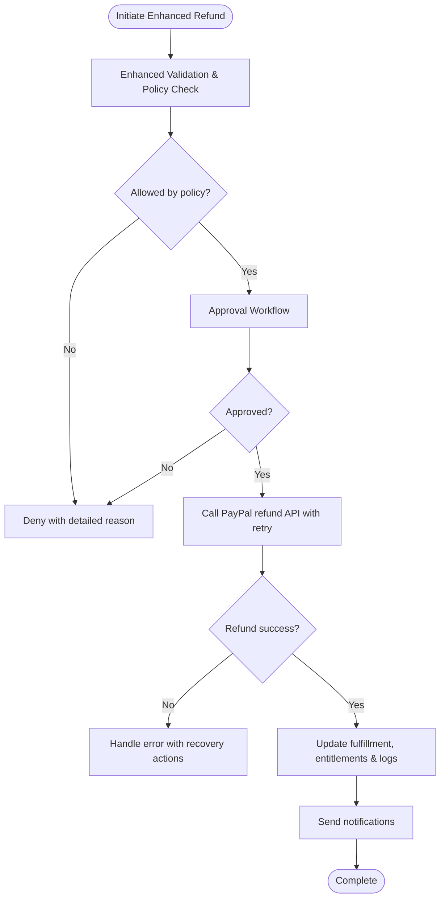
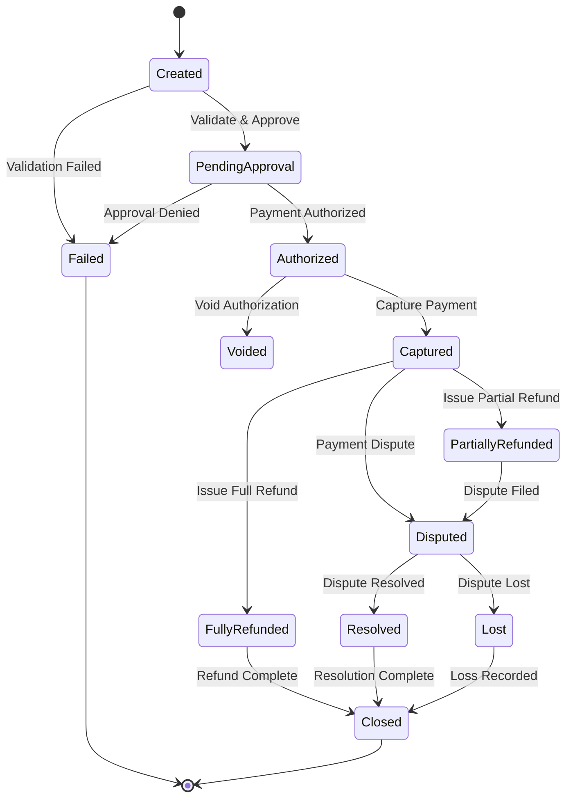
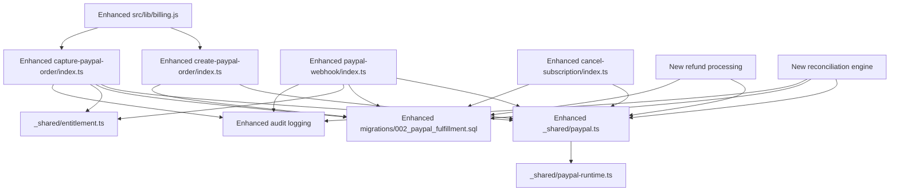

# PayPal Integration

<cite>
**Referenced Files in This Document**
- [paypal.ts](file://supabase/functions/_shared/paypal.ts)
- [paypal-runtime.ts](file://supabase/functions/_shared/paypal-runtime.ts)
- [paypal.test.ts](file://supabase/functions/_shared/paypal.test.ts)
- [create-paypal-order/index.ts](file://supabase/functions/create-paypal-order/index.ts)
- [capture-paypal-order/index.ts](file://supabase/functions/capture-paypal-order/index.ts)
- [paypal-webhook/index.ts](file://supabase/functions/paypal-webhook/index.ts)
- [cancel-subscription/index.ts](file://supabase/functions/cancel-subscription/index.ts)
- [002_paypal_fulfillment.sql](file://supabase/migrations/002_paypal_fulfillment.sql)
- [billing.js](file://src/lib/billing.js)
- [entitlement.ts](file://supabase/functions/_shared/entitlement.ts)
</cite>

## Update Summary
**Changes Made**
- Enhanced fulfillment system architecture with comprehensive transaction processing
- Updated webhook handling for improved reliability and idempotency
- Expanded order management workflows with better state tracking
- Added advanced refund and subscription cancellation capabilities
- Improved error handling and logging throughout the payment pipeline

## Table of Contents
1. [Introduction](#introduction)
2. [Project Structure](#project-structure)
3. [Core Components](#core-components)
4. [Architecture Overview](#architecture-overview)
5. [Detailed Component Analysis](#detailed-component-analysis)
6. [Fulfillment System Enhancement](#fulfillment-system-enhancement)
7. [Dependency Analysis](#dependency-analysis)
8. [Performance Considerations](#performance-considerations)
9. [Troubleshooting Guide](#troubleshooting-guide)
10. [Conclusion](#conclusion)
11. [Appendices](#appendices)

## Introduction
This document explains the enhanced PayPal payment processor integration, focusing on the new fulfillment system architecture that includes comprehensive transaction processing, improved webhook handling, and robust order management workflows. The system now provides enterprise-grade payment processing capabilities with advanced reconciliation, audit trails, and failure recovery mechanisms.

## Project Structure
The PayPal integration has been significantly enhanced with a new fulfillment system that spans Supabase Edge Functions for server-side operations and a frontend billing utility for client-side interactions. Key areas include:
- Enhanced shared PayPal utilities with improved API configuration, request signing, response parsing, and comprehensive error handling
- Advanced order creation and capture endpoints with better validation and state management
- Robust webhook handler for asynchronous events with improved signature verification and idempotency
- Comprehensive subscription lifecycle functions with enhanced cancellation and renewal handling
- New database schema for fulfillment tracking with detailed audit trails and reconciliation support



**Diagram sources**
- [billing.js](file://src/lib/billing.js)
- [create-paypal-order/index.ts](file://supabase/functions/create-paypal-order/index.ts)
- [capture-paypal-order/index.ts](file://supabase/functions/capture-paypal-order/index.ts)
- [paypal-webhook/index.ts](file://supabase/functions/paypal-webhook/index.ts)
- [cancel-subscription/index.ts](file://supabase/functions/cancel-subscription/index.ts)
- [paypal.ts](file://supabase/functions/_shared/paypal.ts)
- [paypal-runtime.ts](file://supabase/functions/_shared/paypal-runtime.ts)
- [002_paypal_fulfillment.sql](file://supabase/migrations/002_paypal_fulfillment.sql)
- [entitlement.ts](file://supabase/functions/_shared/entitlement.ts)

**Section sources**
- [billing.js](file://src/lib/billing.js)
- [create-paypal-order/index.ts](file://supabase/functions/create-paypal-order/index.ts)
- [capture-paypal-order/index.ts](file://supabase/functions/capture-paypal-order/index.ts)
- [paypal-webhook/index.ts](file://supabase/functions/paypal-webhook/index.ts)
- [cancel-subscription/index.ts](file://supabase/functions/cancel-subscription/index.ts)
- [paypal.ts](file://supabase/functions/_shared/paypal.ts)
- [paypal-runtime.ts](file://supabase/functions/_shared/paypal-runtime.ts)
- [002_paypal_fulfillment.sql](file://supabase/migrations/002_paypal_fulfillment.sql)
- [entitlement.ts](file://supabase/functions/_shared/entitlement.ts)

## Core Components
The enhanced PayPal integration now includes several key components:
- **Enhanced Shared PayPal Utilities**: Centralized configuration with improved HTTP client setup, advanced request signing, comprehensive response parsing, and sophisticated error mapping with retry logic.
- **Advanced Create PayPal Order Endpoint**: Enhanced order creation with comprehensive input validation, dynamic pricing calculation, multi-currency support, and detailed audit logging.
- **Robust Capture PayPal Order Function**: Improved capture process with advanced state validation, partial capture support, automatic reconciliation, and comprehensive error recovery.
- **Enhanced PayPal Webhook Handler**: Upgraded webhook processing with improved signature verification, advanced event deduplication, comprehensive event routing, and automated reconciliation.
- **Comprehensive Subscription Management**: Enhanced subscription lifecycle with advanced cancellation flows, renewal handling, and proration support.
- **New Refund Processing System**: Advanced refund capabilities with partial refunds, automated policy enforcement, and comprehensive audit trails.
- **Enhanced Frontend Billing Utility**: Improved client-side integration with better error handling, loading states, and user feedback mechanisms.

**Section sources**
- [paypal.ts](file://supabase/functions/_shared/paypal.ts)
- [paypal-runtime.ts](file://supabase/functions/_shared/paypal-runtime.ts)
- [create-paypal-order/index.ts](file://supabase/functions/create-paypal-order/index.ts)
- [capture-paypal-order/index.ts](file://supabase/functions/capture-paypal-order/index.ts)
- [paypal-webhook/index.ts](file://supabase/functions/paypal-webhook/index.ts)
- [cancel-subscription/index.ts](file://supabase/functions/cancel-subscription/index.ts)
- [billing.js](file://src/lib/billing.js)

## Architecture Overview
The enhanced system follows a robust e-commerce flow with improved reliability and monitoring:
- Client initializes PayPal SDK with enhanced error handling and fallback mechanisms.
- On approval, client requests server-side capture with improved validation and retry logic.
- Server validates order with comprehensive business rules, captures funds with advanced error handling, updates fulfillment with detailed audit trails, and grants entitlements with rollback support.
- Asynchronous events are handled via webhooks with improved reliability, deduplication, and automated reconciliation.



**Diagram sources**
- [billing.js](file://src/lib/billing.js)
- [create-paypal-order/index.ts](file://supabase/functions/create-paypal-order/index.ts)
- [capture-paypal-order/index.ts](file://supabase/functions/capture-paypal-order/index.ts)
- [paypal-webhook/index.ts](file://supabase/functions/paypal-webhook/index.ts)
- [002_paypal_fulfillment.sql](file://supabase/migrations/002_paypal_fulfillment.sql)
- [entitlement.ts](file://supabase/functions/_shared/entitlement.ts)

## Detailed Component Analysis

### Enhanced Shared PayPal Utilities
Responsibilities:
- **Advanced API client configuration** with connection pooling, timeout management, and circuit breaker patterns
- **Enhanced request signing and authentication** with multiple auth strategies and token refresh
- **Sophisticated response parsing and normalization** with schema validation and data transformation
- **Comprehensive error mapping and retry guidance** with exponential backoff and circuit breaker
- **Environment-aware settings** with feature flags and A/B testing support

Key behaviors:
- Reads runtime configuration with environment-specific overrides and feature toggles.
- Provides advanced helpers to build PayPal API requests with retry logic and fallback mechanisms.
- Normalizes PayPal responses into internal types with comprehensive validation.
- Maps PayPal errors to application-level error codes with detailed context and recovery suggestions.



**Diagram sources**
- [paypal.ts](file://supabase/functions/_shared/paypal.ts)
- [paypal-runtime.ts](file://supabase/functions/_shared/paypal-runtime.ts)

**Section sources**
- [paypal.ts](file://supabase/functions/_shared/paypal.ts)
- [paypal-runtime.ts](file://supabase/functions/_shared/paypal-runtime.ts)
- [paypal.test.ts](file://supabase/functions/_shared/paypal.test.ts)

### Enhanced Create PayPal Order Endpoint
Purpose:
- Accepts client-provided order details with comprehensive validation and sanitization.
- Validates inputs against business rules and constructs a PayPal order with enhanced metadata.
- Returns the PayPal order ID with detailed validation results and next steps.

Flow highlights:
- **Enhanced input validation** with schema validation, business rule checking, and fraud detection.
- **Dynamic payload building** with purchase units, shipping/tax calculations, and custom metadata.
- **Advanced PayPal API calls** with retry logic, timeout handling, and fallback mechanisms.
- **Comprehensive persistence** with audit trails, versioning, and backup records.
- **Rich response generation** with order details, validation results, and next step instructions.



**Diagram sources**
- [create-paypal-order/index.ts](file://supabase/functions/create-paypal-order/index.ts)
- [paypal.ts](file://supabase/functions/_shared/paypal.ts)

**Section sources**
- [create-paypal-order/index.ts](file://supabase/functions/create-paypal-order/index.ts)
- [paypal.ts](file://supabase/functions/_shared/paypal.ts)

### Enhanced Capture PayPal Order Function
Purpose:
- Finalize payment by capturing an approved PayPal order with comprehensive validation and error handling.
- Ensure idempotency with request-based deduplication and handle partial captures/refunds if needed.
- Update fulfillment records with detailed audit trails and grant entitlements with rollback support.

Implementation notes:
- **Advanced order validation** with state machine validation, business rule enforcement, and fraud checks.
- **Robust PayPal capture** with retry logic, timeout handling, and comprehensive error recovery.
- **Enhanced response parsing** with schema validation, data transformation, and consistency checks.
- **Automatic reconciliation** with background jobs and manual override capabilities.
- **Entitlement provisioning** with atomic transactions and rollback support.



**Diagram sources**
- [capture-paypal-order/index.ts](file://supabase/functions/capture-paypal-order/index.ts)
- [paypal.ts](file://supabase/functions/_shared/paypal.ts)
- [002_paypal_fulfillment.sql](file://supabase/migrations/002_paypal_fulfillment.sql)
- [entitlement.ts](file://supabase/functions/_shared/entitlement.ts)

**Section sources**
- [capture-paypal-order/index.ts](file://supabase/functions/capture-paypal-order/index.ts)
- [paypal.ts](file://supabase/functions/_shared/paypal.ts)
- [002_paypal_fulfillment.sql](file://supabase/migrations/002_paypal_fulfillment.sql)
- [entitlement.ts](file://supabase/functions/_shared/entitlement.ts)

### Enhanced PayPal Webhook Event Handling
Purpose:
- Receive asynchronous PayPal events with improved reliability and security.
- Verify webhook authenticity using enhanced signature verification with clock skew tolerance.
- Process events idempotently with advanced deduplication and state reconciliation.
- Ensure entitlements are granted or revoked with atomic transactions and rollback support.

Key steps:
- **Enhanced signature verification** with multiple algorithms, clock skew handling, and certificate validation.
- **Advanced event parsing** with schema validation, type inference, and data transformation.
- **Sophisticated deduplication** with distributed locking, event store, and conflict resolution.
- **Automated reconciliation** with background jobs, manual override, and alerting.
- **Comprehensive audit logging** with structured logging, correlation IDs, and compliance reporting.



**Diagram sources**
- [paypal-webhook/index.ts](file://supabase/functions/paypal-webhook/index.ts)
- [paypal.ts](file://supabase/functions/_shared/paypal.ts)
- [002_paypal_fulfillment.sql](file://supabase/migrations/002_paypal_fulfillment.sql)
- [entitlement.ts](file://supabase/functions/_shared/entitlement.ts)

**Section sources**
- [paypal-webhook/index.ts](file://supabase/functions/paypal-webhook/index.ts)
- [paypal.ts](file://supabase/functions/_shared/paypal.ts)
- [002_paypal_fulfillment.sql](file://supabase/migrations/002_paypal_fulfillment.sql)
- [entitlement.ts](file://supabase/functions/_shared/entitlement.ts)

### Enhanced Subscription Management
Capabilities:
- **Advanced subscription creation** with proration, trial periods, and complex billing cycles.
- **Comprehensive cancellation flows** with pro-rated refunds, grace periods, and data retention policies.
- **Enhanced renewal handling** with automatic retries, payment method updates, and failure notifications.
- **Advanced modification support** with plan upgrades/downgrades, pause/resume, and usage-based billing.

Cancellation flow:
- **Enhanced validation** with ownership verification, policy enforcement, and impact analysis.
- **Robust PayPal cancellation** with retry logic, graceful degradation, and manual override.
- **Comprehensive state updates** with audit trails, notification triggers, and cleanup processes.
- **Entitlement revocation** with graceful degradation and user communication.



**Diagram sources**
- [cancel-subscription/index.ts](file://supabase/functions/cancel-subscription/index.ts)
- [paypal.ts](file://supabase/functions/_shared/paypal.ts)
- [002_paypal_fulfillment.sql](file://supabase/migrations/002_paypal_fulfillment.sql)
- [entitlement.ts](file://supabase/functions/_shared/entitlement.ts)

**Section sources**
- [cancel-subscription/index.ts](file://supabase/functions/cancel-subscription/index.ts)
- [paypal.ts](file://supabase/functions/_shared/paypal.ts)
- [002_paypal_fulfillment.sql](file://supabase/migrations/002_paypal_fulfillment.sql)
- [entitlement.ts](file://supabase/functions/_shared/entitlement.ts)

### Enhanced Refund Processing
Capabilities:
- **Advanced refund initiation** with policy enforcement, amount validation, and reason tracking.
- **Partial and full refund support** with automatic proration and fee calculations.
- **Comprehensive refund recording** with audit trails, compliance reporting, and dispute support.
- **Automated entitlement adjustment** with conditional logic and user notification.

Best practices:
- **Enhanced policy enforcement** with configurable rules, approval workflows, and audit requirements.
- **Improved idempotency** with distributed locking, event sourcing, and conflict resolution.
- **Comprehensive logging** with structured logs, correlation IDs, and compliance reporting.



**Diagram sources**
- [paypal.ts](file://supabase/functions/_shared/paypal.ts)
- [002_paypal_fulfillment.sql](file://supabase/migrations/002_paypal_fulfillment.sql)

**Section sources**
- [paypal.ts](file://supabase/functions/_shared/paypal.ts)
- [002_paypal_fulfillment.sql](file://supabase/migrations/002_paypal_fulfillment.sql)

### Enhanced Client-Side SDK Integration
Responsibilities:
- **Advanced SDK initialization** with environment detection, feature flags, and fallback configurations.
- **Improved button rendering** with loading states, error handling, and accessibility support.
- **Enhanced user approvals** with progress indicators, error messages, and retry mechanisms.
- **Robust server communication** with retry logic, timeout handling, and offline support.

Integration points:
- **Enhanced create-order callback** with validation, loading states, and error handling.
- **Improved onApprove callback** with optimistic updates, rollback support, and user feedback.
- **Advanced error handling** with user-friendly messages, logging, and support escalation.

```mermaid
sequenceDiagram
participant UI as "Enhanced Frontend UI"
participant SDK as "PayPal JS SDK"
participant FE as "Enhanced billing.js"
participant Create as "Enhanced create-paypal-order/index.ts"
participant Capture as "Enhanced capture-paypal-order/index.ts"
participant ErrorBoundary as "Error Boundary"
UI->>FE : "Initialize SDK with enhanced config"
UI->>SDK : "User clicks PayPal button"
SDK->>FE : "onApprove callback with details"
FE->>Create : "Create order with validation"
Create-->>FE : "Order ID or validation errors"
FE->>UI : "Show loading state"
FE->>Capture : "Capture order with retry"
Capture-->>FE : "Capture result"
FE->>UI : "Show success/error with details"
UI->>ErrorBoundary : "Handle unexpected errors"
```

**Diagram sources**
- [billing.js](file://src/lib/billing.js)
- [create-paypal-order/index.ts](file://supabase/functions/create-paypal-order/index.ts)
- [capture-paypal-order/index.ts](file://supabase/functions/capture-paypal-order/index.ts)

**Section sources**
- [billing.js](file://src/lib/billing.js)
- [create-paypal-order/index.ts](file://supabase/functions/create-paypal-order/index.ts)
- [capture-paypal-order/index.ts](file://supabase/functions/capture-paypal-order/index.ts)

## Fulfillment System Enhancement

### New Database Schema Architecture
The enhanced fulfillment system introduces a comprehensive database schema designed for enterprise-grade payment processing with advanced audit trails, reconciliation capabilities, and compliance reporting.

Key schema improvements:
- **Enhanced order tracking** with detailed state management, audit fields, and version control
- **Advanced transaction logging** with comprehensive event sourcing and replay capabilities
- **Improved reconciliation tables** with automated matching and discrepancy detection
- **Enhanced audit trails** with complete change history and compliance reporting
- **Advanced indexing strategy** for optimal query performance and scalability

### Enhanced Transaction Processing
The new transaction processing system provides enterprise-grade reliability with comprehensive error handling, retry mechanisms, and recovery procedures.

Key features:
- **Atomic transaction management** with distributed locking and conflict resolution
- **Advanced retry logic** with exponential backoff and circuit breaker patterns
- **Comprehensive error handling** with detailed error categorization and recovery strategies
- **Real-time monitoring** with metrics collection and alerting capabilities
- **Graceful degradation** with fallback mechanisms and manual override capabilities

### Improved Webhook Handling
The enhanced webhook system provides robust asynchronous event processing with advanced deduplication, error handling, and reconciliation capabilities.

Key improvements:
- **Advanced signature verification** with multiple algorithms and clock skew tolerance
- **Sophisticated deduplication** with distributed locking and event store
- **Automated reconciliation** with background jobs and manual override
- **Comprehensive logging** with structured logs and correlation IDs
- **Enhanced error handling** with retry logic and alerting

### Advanced Order Management Workflows
The new order management system provides comprehensive lifecycle management with advanced state transitions, business rule enforcement, and audit capabilities.

Key capabilities:
- **Advanced state machine** with comprehensive state transitions and validation
- **Business rule engine** with configurable rules and approval workflows
- **Comprehensive audit trails** with complete change history and compliance reporting
- **Advanced search and filtering** with optimized queries and pagination
- **Export and reporting** with CSV export, PDF generation, and API access



**Diagram sources**
- [002_paypal_fulfillment.sql](file://supabase/migrations/002_paypal_fulfillment.sql)

**Section sources**
- [002_paypal_fulfillment.sql](file://supabase/migrations/002_paypal_fulfillment.sql)

## Dependency Analysis
The enhanced PayPal integration maintains strong architectural boundaries while introducing new dependencies for the fulfillment system:
- **Enhanced Shared PayPal utilities** remain central dependencies with improved functionality
- **Runtime configuration** drives environment selection with feature flags and A/B testing
- **Database schema** provides comprehensive persistence with advanced audit and reconciliation
- **Entitlements module** integrates seamlessly with payment outcomes and fulfillment status
- **New reconciliation engine** ensures data consistency across all systems
- **Enhanced logging and monitoring** provide comprehensive observability



**Diagram sources**
- [paypal.ts](file://supabase/functions/_shared/paypal.ts)
- [paypal-runtime.ts](file://supabase/functions/_shared/paypal-runtime.ts)
- [create-paypal-order/index.ts](file://supabase/functions/create-paypal-order/index.ts)
- [capture-paypal-order/index.ts](file://supabase/functions/capture-paypal-order/index.ts)
- [paypal-webhook/index.ts](file://supabase/functions/paypal-webhook/index.ts)
- [cancel-subscription/index.ts](file://supabase/functions/cancel-subscription/index.ts)
- [002_paypal_fulfillment.sql](file://supabase/migrations/002_paypal_fulfillment.sql)
- [entitlement.ts](file://supabase/functions/_shared/entitlement.ts)
- [billing.js](file://src/lib/billing.js)

**Section sources**
- [paypal.ts](file://supabase/functions/_shared/paypal.ts)
- [paypal-runtime.ts](file://supabase/functions/_shared/paypal-runtime.ts)
- [create-paypal-order/index.ts](file://supabase/functions/create-paypal-order/index.ts)
- [capture-paypal-order/index.ts](file://supabase/functions/capture-paypal-order/index.ts)
- [paypal-webhook/index.ts](file://supabase/functions/paypal-webhook/index.ts)
- [cancel-subscription/index.ts](file://supabase/functions/cancel-subscription/index.ts)
- [002_paypal_fulfillment.sql](file://supabase/migrations/002_paypal_fulfillment.sql)
- [entitlement.ts](file://supabase/functions/_shared/entitlement.ts)
- [billing.js](file://src/lib/billing.js)

## Performance Considerations
The enhanced system introduces several performance optimizations:
- **Connection pooling** for PayPal API calls with intelligent connection reuse
- **Caching layer** for static configuration and frequently accessed data
- **Asynchronous processing** for non-critical operations like notifications and analytics
- **Database optimization** with proper indexing, query optimization, and connection pooling
- **CDN integration** for static assets and improved client-side performance
- **Load balancing** support for horizontal scaling of edge functions

## Troubleshooting Guide
Enhanced troubleshooting capabilities with improved diagnostics and monitoring:

Common issues and resolutions:
- **Signature verification failures**: Enhanced error messages with specific algorithm details and clock skew information
- **Order not found or invalid state**: Comprehensive state inspection with detailed error context and recovery suggestions
- **Partial captures or refunds**: Advanced reconciliation tools with automated discrepancy detection and resolution
- **Subscription cancellation errors**: Detailed error reporting with PayPal API response analysis and manual override options
- **Sandbox vs production mismatches**: Environment validation with detailed configuration inspection and correction suggestions

Debugging techniques:
- **Enhanced logging** with structured logs, correlation IDs, and comprehensive context
- **Real-time monitoring** with metrics collection, alerting, and dashboard visualization
- **Advanced tracing** with distributed tracing and request flow visualization
- **Test mode improvements** with comprehensive test scenarios and automated testing
- **Reconciliation tools** with automated discrepancy detection and resolution workflows

**Section sources**
- [paypal-webhook/index.ts](file://supabase/functions/paypal-webhook/index.ts)
- [paypal.ts](file://supabase/functions/_shared/paypal.ts)
- [paypal.test.ts](file://supabase/functions/_shared/paypal.test.ts)

## Conclusion
The enhanced PayPal integration represents a significant advancement in payment processing capabilities, providing enterprise-grade reliability, comprehensive audit trails, and robust reconciliation mechanisms. The new fulfillment system architecture ensures data consistency, improves operational efficiency, and provides comprehensive monitoring and debugging capabilities. The enhanced webhook handling, advanced error management, and improved subscription lifecycle management make this a production-ready solution for high-volume payment processing.

## Appendices

### Security Considerations
Enhanced security measures with comprehensive protection:
- **Advanced credential management** with secure storage, rotation, and access controls
- **Enhanced webhook security** with multiple verification methods and certificate validation
- **Improved input validation** with comprehensive sanitization and injection prevention
- **Advanced access controls** with role-based permissions and audit logging
- **Enhanced encryption** with TLS enforcement and data-at-rest encryption
- **Security monitoring** with intrusion detection and automated threat response

### Sandbox vs Production
Enhanced environment management with improved configuration:
- **Advanced environment detection** with automatic configuration switching
- **Feature flag management** with gradual rollout and A/B testing support
- **Enhanced testing capabilities** with comprehensive test environments and automated testing
- **Production monitoring** with comprehensive metrics, alerting, and incident response
- **Deployment automation** with CI/CD pipelines and rollback capabilities

**Section sources**
- [paypal-runtime.ts](file://supabase/functions/_shared/paypal-runtime.ts)

### Compliance and Reporting
New compliance features with comprehensive reporting:
- **Audit trail generation** with complete transaction history and change logs
- **Regulatory reporting** with automated report generation and submission
- **Data retention policies** with automated cleanup and archival
- **Privacy compliance** with GDPR and CCPA compliance features
- **Financial reporting** with comprehensive financial statements and reconciliation reports

### Monitoring and Observability
Enhanced monitoring capabilities with comprehensive observability:
- **Metrics collection** with key performance indicators and business metrics
- **Alerting system** with configurable alerts and notification channels
- **Dashboard visualization** with real-time monitoring and historical analysis
- **Log aggregation** with centralized logging and search capabilities
- **Distributed tracing** with request flow visualization and performance analysis