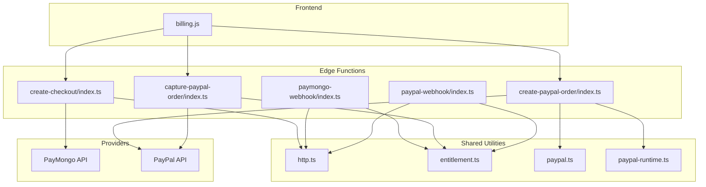
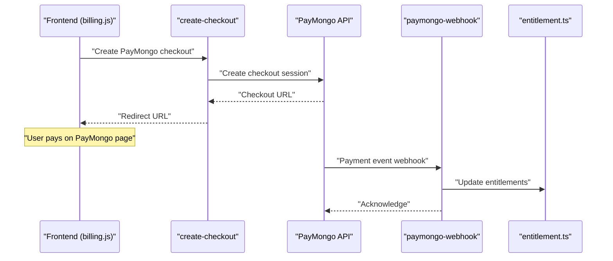
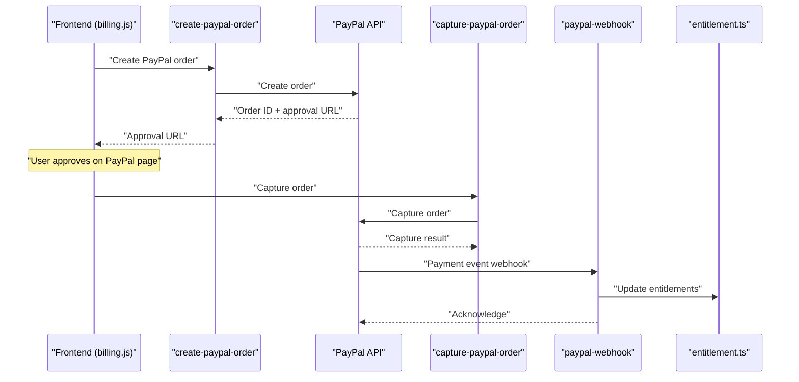
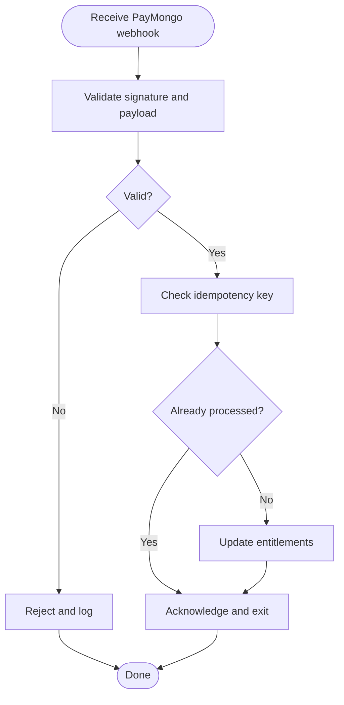
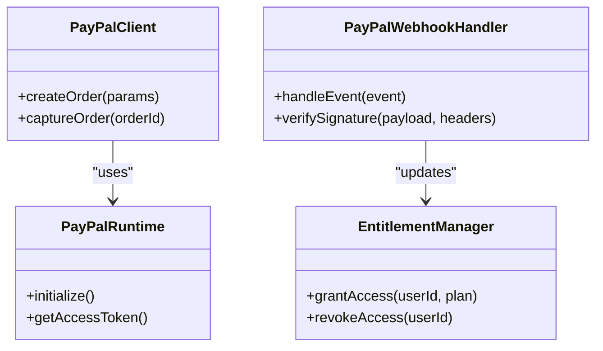
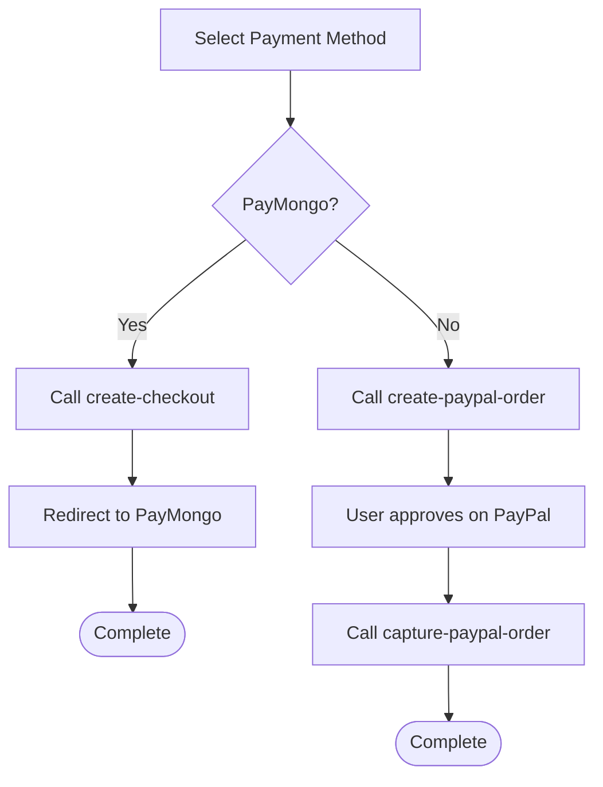
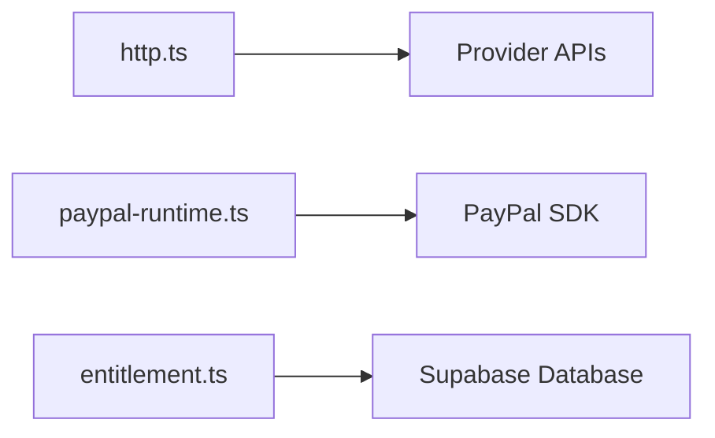
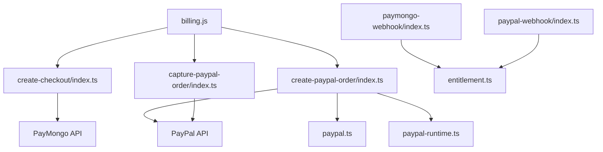

# Payment Processors

<cite>
**Referenced Files in This Document**
- [create-checkout/index.ts](file://supabase/functions/create-checkout/index.ts)
- [paymongo-webhook/index.ts](file://supabase/functions/paymongo-webhook/index.ts)
- [create-paypal-order/index.ts](file://supabase/functions/create-paypal-order/index.ts)
- [capture-paypal-order/index.ts](file://supabase/functions/capture-paypal-order/index.ts)
- [paypal-webhook/index.ts](file://supabase/functions/paypal-webhook/index.ts)
- [billing.js](file://src/lib/billing.js)
- [entitlement.ts](file://supabase/functions/_shared/entitlement.ts)
- [http.ts](file://supabase/functions/_shared/http.ts)
- [paypal.ts](file://supabase/functions/_shared/paypal.ts)
- [paypal-runtime.ts](file://supabase/functions/_shared/paypal-runtime.ts)
- [03-subscriptions-paymongo.md](file://docs/superpowers/plans/monetization/03-subscriptions-paymongo.md)
- [00-architecture.md](file://docs/superpowers/plans/monetization/00-architecture.md)
</cite>

## Table of Contents
1. [Introduction](#introduction)
2. [Project Structure](#project-structure)
3. [Core Components](#core-components)
4. [Architecture Overview](#architecture-overview)
5. [Detailed Component Analysis](#detailed-component-analysis)
6. [Dependency Analysis](#dependency-analysis)
7. [Performance Considerations](#performance-considerations)
8. [Troubleshooting Guide](#troubleshooting-guide)
9. [Conclusion](#conclusion)

## Introduction
This document explains the dual payment system architecture in ApplyGuard PH, supporting PayMongo and PayPal providers. It covers checkout flow implementation, payment method selection, transaction processing, webhook handling for payment events, order capture mechanisms, error recovery strategies, provider-specific configuration, API integration patterns, and security considerations for payment data handling. The goal is to provide both a high-level understanding and actionable details for developers integrating or maintaining payment flows.

## Project Structure
The payment system is implemented as a combination of:
- Edge functions (serverless endpoints) for creating checkouts/orders, capturing orders, and handling webhooks
- Shared utilities for HTTP calls and provider-specific logic
- Frontend billing helpers that orchestrate user interactions and call backend endpoints
- Documentation describing subscription and monetization design

**Diagram sources**
- [create-checkout/index.ts](file://supabase/functions/create-checkout/index.ts)
- [paymongo-webhook/index.ts](file://supabase/functions/paymongo-webhook/index.ts)
- [create-paypal-order/index.ts](file://supabase/functions/create-paypal-order/index.ts)
- [capture-paypal-order/index.ts](file://supabase/functions/capture-paypal-order/index.ts)
- [paypal-webhook/index.ts](file://supabase/functions/paypal-webhook/index.ts)
- [billing.js](file://src/lib/billing.js)
- [http.ts](file://supabase/functions/_shared/http.ts)
- [entitlement.ts](file://supabase/functions/_shared/entitlement.ts)
- [paypal.ts](file://supabase/functions/_shared/paypal.ts)
- [paypal-runtime.ts](file://supabase/functions/_shared/paypal-runtime.ts)

**Section sources**
- [00-architecture.md](file://docs/superpowers/plans/monetization/00-architecture.md)
- [03-subscriptions-paymongo.md](file://docs/superpowers/plans/monetization/03-subscriptions-paymongo.md)

## Core Components
- Checkout creation: A unified endpoint creates a PayMongo checkout session when the user selects PayMongo.
- PayPal order lifecycle: Separate endpoints create and capture PayPal orders; webhooks confirm fulfillment.
- Webhooks: Provider-specific endpoints receive asynchronous payment events and update entitlements.
- Shared utilities: HTTP client wrapper, PayPal SDK runtime setup, and entitlement management.
- Frontend billing helper: Orchestrates provider selection and redirects users to provider-hosted pages.

Key responsibilities:
- Provider abstraction via separate endpoints and shared utilities
- Idempotent fulfillment through webhooks
- Secure configuration access within serverless functions
- Clear separation between frontend orchestration and backend processing

**Section sources**
- [create-checkout/index.ts](file://supabase/functions/create-checkout/index.ts)
- [paymongo-webhook/index.ts](file://supabase/functions/paymongo-webhook/index.ts)
- [create-paypal-order/index.ts](file://supabase/functions/create-paypal-order/index.ts)
- [capture-paypal-order/index.ts](file://supabase/functions/capture-paypal-order/index.ts)
- [paypal-webhook/index.ts](file://supabase/functions/paypal-webhook/index.ts)
- [billing.js](file://src/lib/billing.js)
- [http.ts](file://supabase/functions/_shared/http.ts)
- [paypal.ts](file://supabase/functions/_shared/paypal.ts)
- [paypal-runtime.ts](file://supabase/functions/_shared/paypal-runtime.ts)
- [entitlement.ts](file://supabase/functions/_shared/entitlement.ts)

## Architecture Overview
The dual-provider architecture separates concerns by provider while sharing common patterns:
- Frontend chooses a provider and calls the appropriate backend endpoint
- Backend creates a hosted checkout/order with the provider
- User completes payment on the provider’s page
- Provider sends a webhook to the backend to finalize fulfillment
- Entitlements are updated based on successful payments

**Diagram sources**
- [billing.js](file://src/lib/billing.js)
- [create-checkout/index.ts](file://supabase/functions/create-checkout/index.ts)
- [paymongo-webhook/index.ts](file://supabase/functions/paymongo-webhook/index.ts)
- [entitlement.ts](file://supabase/functions/_shared/entitlement.ts)

**Diagram sources**
- [billing.js](file://src/lib/billing.js)
- [create-paypal-order/index.ts](file://supabase/functions/create-paypal-order/index.ts)
- [capture-paypal-order/index.ts](file://supabase/functions/capture-paypal-order/index.ts)
- [paypal-webhook/index.ts](file://supabase/functions/paypal-webhook/index.ts)
- [entitlement.ts](file://supabase/functions/_shared/entitlement.ts)

## Detailed Component Analysis

### PayMongo Integration
- Checkout creation: The PayMongo checkout endpoint constructs a checkout session using provider APIs and returns a redirect URL for the user to complete payment.
- Webhook handling: The PayMongo webhook endpoint validates incoming events, verifies signatures, and updates entitlements upon successful payment.
- Error handling: Retries and idempotency checks ensure consistent state even if webhooks are delivered multiple times.

**Diagram sources**
- [paymongo-webhook/index.ts](file://supabase/functions/paymongo-webhook/index.ts)
- [entitlement.ts](file://supabase/functions/_shared/entitlement.ts)

**Section sources**
- [create-checkout/index.ts](file://supabase/functions/create-checkout/index.ts)
- [paymongo-webhook/index.ts](file://supabase/functions/paymongo-webhook/index.ts)
- [03-subscriptions-paymongo.md](file://docs/superpowers/plans/monetization/03-subscriptions-paymongo.md)

### PayPal Integration
- Order creation: The PayPal order creation endpoint initializes an order with PayPal and returns an approval URL.
- Order capture: After user approval, the frontend calls the capture endpoint to finalize the transaction.
- Webhook handling: The PayPal webhook endpoint processes payment events and updates entitlements.

**Diagram sources**
- [paypal-runtime.ts](file://supabase/functions/_shared/paypal-runtime.ts)
- [paypal.ts](file://supabase/functions/_shared/paypal.ts)
- [paypal-webhook/index.ts](file://supabase/functions/paypal-webhook/index.ts)
- [entitlement.ts](file://supabase/functions/_shared/entitlement.ts)

**Section sources**
- [create-paypal-order/index.ts](file://supabase/functions/create-paypal-order/index.ts)
- [capture-paypal-order/index.ts](file://supabase/functions/capture-paypal-order/index.ts)
- [paypal-webhook/index.ts](file://supabase/functions/paypal-webhook/index.ts)
- [paypal.ts](file://supabase/functions/_shared/paypal.ts)
- [paypal-runtime.ts](file://supabase/functions/_shared/paypal-runtime.ts)
- [entitlement.ts](file://supabase/functions/_shared/entitlement.ts)

### Frontend Billing Orchestration
- Provider selection: The frontend exposes helpers to choose PayMongo or PayPal based on user preference or business rules.
- Flow control: For PayMongo, it redirects to the hosted checkout URL. For PayPal, it initiates order creation, shows approval, then captures the order.
- Error feedback: Displays user-friendly messages and retries where appropriate.

**Diagram sources**
- [billing.js](file://src/lib/billing.js)
- [create-checkout/index.ts](file://supabase/functions/create-checkout/index.ts)
- [create-paypal-order/index.ts](file://supabase/functions/create-paypal-order/index.ts)
- [capture-paypal-order/index.ts](file://supabase/functions/capture-paypal-order/index.ts)

**Section sources**
- [billing.js](file://src/lib/billing.js)

### Shared Utilities
- HTTP client: Provides a consistent interface for outbound requests with retry and timeout policies.
- PayPal runtime: Initializes provider SDK and manages tokens securely.
- Entitlement manager: Centralizes granting and revoking access based on payment outcomes.

**Diagram sources**
- [http.ts](file://supabase/functions/_shared/http.ts)
- [paypal-runtime.ts](file://supabase/functions/_shared/paypal-runtime.ts)
- [entitlement.ts](file://supabase/functions/_shared/entitlement.ts)

**Section sources**
- [http.ts](file://supabase/functions/_shared/http.ts)
- [paypal-runtime.ts](file://supabase/functions/_shared/paypal-runtime.ts)
- [entitlement.ts](file://supabase/functions/_shared/entitlement.ts)

## Dependency Analysis
- Frontend depends on backend endpoints for all payment operations.
- PayMongo path depends on the PayMongo API and webhook handler.
- PayPal path depends on PayPal API, order capture, and webhook handler.
- Shared utilities reduce duplication across providers and centralize concerns like HTTP and entitlements.

**Diagram sources**
- [billing.js](file://src/lib/billing.js)
- [create-checkout/index.ts](file://supabase/functions/create-checkout/index.ts)
- [paymongo-webhook/index.ts](file://supabase/functions/paymongo-webhook/index.ts)
- [create-paypal-order/index.ts](file://supabase/functions/create-paypal-order/index.ts)
- [capture-paypal-order/index.ts](file://supabase/functions/capture-paypal-order/index.ts)
- [paypal-webhook/index.ts](file://supabase/functions/paypal-webhook/index.ts)
- [entitlement.ts](file://supabase/functions/_shared/entitlement.ts)
- [paypal.ts](file://supabase/functions/_shared/paypal.ts)
- [paypal-runtime.ts](file://supabase/functions/_shared/paypal-runtime.ts)

**Section sources**
- [billing.js](file://src/lib/billing.js)
- [create-checkout/index.ts](file://supabase/functions/create-checkout/index.ts)
- [paymongo-webhook/index.ts](file://supabase/functions/paymongo-webhook/index.ts)
- [create-paypal-order/index.ts](file://supabase/functions/create-paypal-order/index.ts)
- [capture-paypal-order/index.ts](file://supabase/functions/capture-paypal-order/index.ts)
- [paypal-webhook/index.ts](file://supabase/functions/paypal-webhook/index.ts)
- [entitlement.ts](file://supabase/functions/_shared/entitlement.ts)
- [paypal.ts](file://supabase/functions/_shared/paypal.ts)
- [paypal-runtime.ts](file://supabase/functions/_shared/paypal-runtime.ts)

## Performance Considerations
- Prefer provider-hosted checkout pages to minimize frontend overhead and improve conversion rates.
- Use idempotency keys in webhooks to avoid duplicate fulfillments.
- Cache short-lived tokens (e.g., PayPal access tokens) within function execution boundaries to reduce API calls.
- Keep payloads minimal and validate early to fail fast.
- Monitor latency and errors at each provider boundary to identify bottlenecks.

[No sources needed since this section provides general guidance]

## Troubleshooting Guide
Common issues and resolutions:
- Invalid webhook signatures: Ensure secrets are configured correctly and verify signature algorithms match provider expectations.
- Duplicate webhook deliveries: Implement idempotency checks keyed by provider event IDs before updating entitlements.
- Failed order capture: Retry with exponential backoff and surface actionable errors to users.
- Missing entitlement updates: Log detailed context around webhook processing and reconciliation jobs.

Operational tips:
- Enable structured logging for all payment-related events.
- Add health checks for provider connectivity.
- Maintain a replay mechanism for failed webhooks using provider dashboards.

**Section sources**
- [paymongo-webhook/index.ts](file://supabase/functions/paymongo-webhook/index.ts)
- [paypal-webhook/index.ts](file://supabase/functions/paypal-webhook/index.ts)
- [capture-paypal-order/index.ts](file://supabase/functions/capture-paypal-order/index.ts)

## Conclusion
ApplyGuard PH implements a robust dual-provider payment system with clear separation between PayMongo and PayPal flows. The architecture leverages serverless endpoints for secure provider interactions, standardized shared utilities, and idempotent webhook processing to ensure reliable entitlement updates. By following the patterns outlined here—provider-specific endpoints, strong validation, and careful error handling—the system remains maintainable and extensible for future payment integrations.