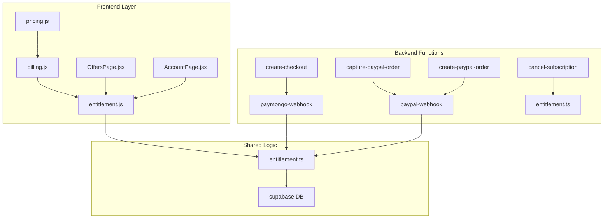
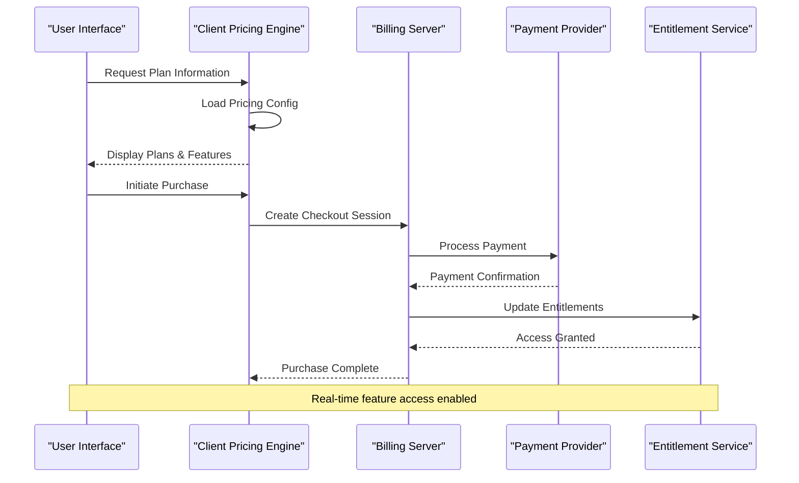
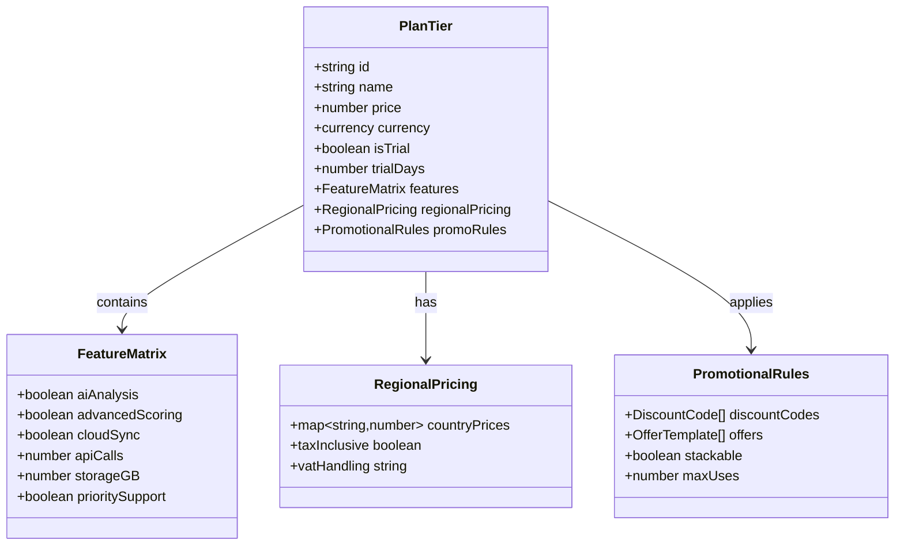
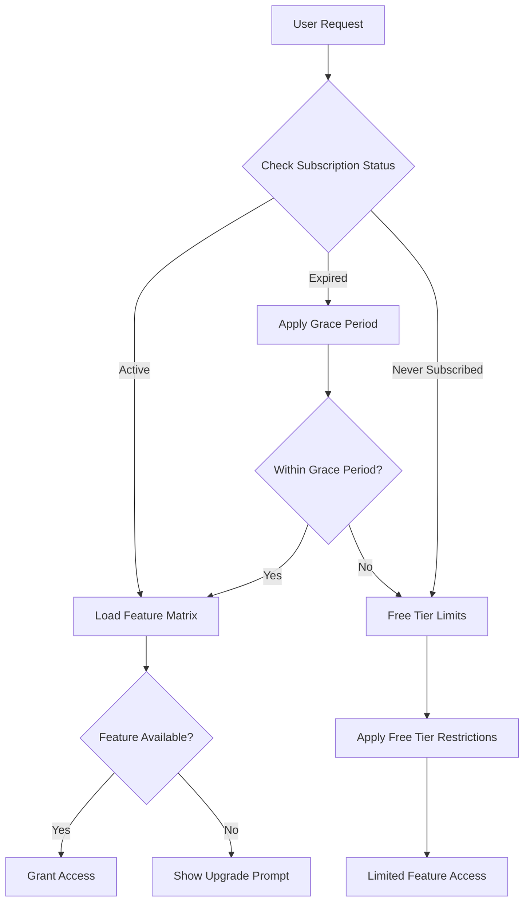
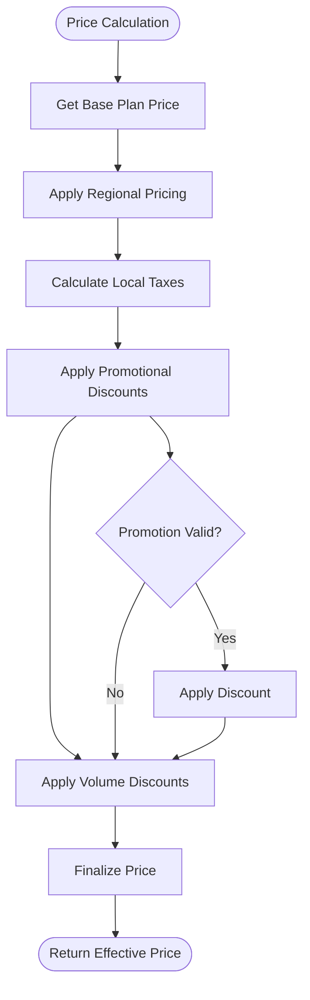
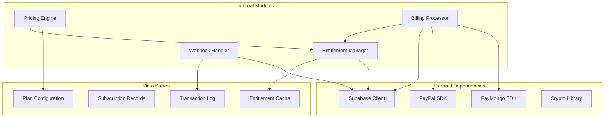

# Pricing & Plan Configuration

<cite>
**Referenced Files in This Document**
- [pricing.js](file://src/lib/pricing.js)
- [billing.js](file://src/lib/billing.js)
- [entitlement.js](file://src/lib/entitlement.js)
- [entitlement.ts](file://supabase/functions/_shared/entitlement.ts)
- [03-subscriptions-paymongo.md](file://docs/superpowers/plans/monetization/03-subscriptions-paymongo.md)
- [create-checkout/index.ts](file://supabase/functions/create-checkout/index.ts)
- [paymongo-webhook/index.ts](file://supabase/functions/paymongo-webhook/index.ts)
- [paypal-webhook/index.ts](file://supabase/functions/paypal-webhook/index.ts)
- [cancel-subscription/index.ts](file://supabase/functions/cancel-subscription/index.ts)
- [capture-paypal-order/index.ts](file://supabase/functions/capture-paypal-order/index.ts)
- [create-paypal-order/index.ts](file://supabase/functions/create-paypal-order/index.ts)
</cite>

## Table of Contents
1. [Introduction](#introduction)
2. [Project Structure](#project-structure)
3. [Core Components](#core-components)
4. [Architecture Overview](#architecture-overview)
5. [Detailed Component Analysis](#detailed-component-analysis)
6. [Dependency Analysis](#dependency-analysis)
7. [Performance Considerations](#performance-considerations)
8. [Troubleshooting Guide](#troubleshooting-guide)
9. [Conclusion](#conclusion)
10. [Appendices](#appendices)

## Introduction

ApplyGuard PH implements a comprehensive subscription-based pricing model with multiple payment processors and sophisticated entitlement management. The system supports tiered plans, promotional offers, discount codes, trial periods, multi-currency support, and regional pricing variations. This document provides detailed documentation for configuring and managing pricing plans, understanding feature mappings, and implementing promotional strategies.

The pricing architecture is designed around three core pillars: client-side pricing configuration, server-side billing processing, and centralized entitlement management that ensures consistent feature access across all platforms.

## Project Structure

The pricing and subscription system spans both frontend and backend components, organized into logical modules:

**Diagram sources**
- [pricing.js](file://src/lib/pricing.js)
- [billing.js](file://src/lib/billing.js)
- [entitlement.js](file://src/lib/entitlement.js)
- [entitlement.ts](file://supabase/functions/_shared/entitlement.ts)

**Section sources**
- [pricing.js](file://src/lib/pricing.js)
- [billing.js](file://src/lib/billing.js)
- [entitlement.js](file://src/lib/entitlement.js)

## Core Components

### Pricing Configuration Module

The pricing module serves as the central source of truth for all pricing-related data structures, including plan definitions, currency configurations, and promotional offer templates. It provides utilities for calculating effective prices, applying discounts, and determining plan eligibility.

Key responsibilities include:
- Plan tier definitions and metadata
- Currency conversion and formatting
- Promotional offer calculations
- Trial period management
- Regional pricing adjustments

### Billing Processing Engine

The billing engine handles payment processing workflows, integrating with multiple payment providers (PayMongo and PayPal). It manages checkout sessions, order creation, payment capture, and webhook processing.

Core functionality encompasses:
- Checkout session management
- Payment provider abstraction
- Webhook event handling
- Subscription lifecycle management
- Error recovery and retry logic

### Entitlement Management System

The entitlement system maintains user feature access permissions based on their subscription status. It provides real-time entitlement checking and synchronization across all application features.

Primary capabilities:
- Feature access validation
- Subscription state synchronization
- Grace period handling
- Entitlement caching and optimization
- Cross-platform entitlement consistency

**Section sources**
- [pricing.js](file://src/lib/pricing.js)
- [billing.js](file://src/lib/billing.js)
- [entitlement.js](file://src/lib/entitlement.js)
- [entitlement.ts](file://supabase/functions/_shared/entitlement.ts)

## Architecture Overview

The pricing architecture follows a microservices-inspired pattern with clear separation between client-side configuration and server-side processing:

**Diagram sources**
- [billing.js](file://src/lib/billing.js)
- [create-checkout/index.ts](file://supabase/functions/create-checkout/index.ts)
- [entitlement.ts](file://supabase/functions/_shared/entitlement.ts)

The system employs several key architectural patterns:

1. **Configuration-Driven Design**: All pricing rules are externalized to configuration files, enabling dynamic updates without code changes
2. **Provider Abstraction**: Multiple payment processors share common interfaces for seamless switching
3. **Event-Driven Updates**: Webhooks ensure real-time synchronization of subscription states
4. **Caching Strategy**: Client-side caching reduces API calls while maintaining data freshness

## Detailed Component Analysis

### Plan Tier Definitions and Feature Mapping

The plan system supports multiple tiers with granular feature control. Each plan defines its capabilities through a structured feature matrix that maps directly to application functionality.

**Diagram sources**
- [pricing.js](file://src/lib/pricing.js)
- [entitlement.ts](file://supabase/functions/_shared/entitlement.ts)

#### Plan Comparison Matrix

| Feature | Free Tier | Pro Tier | Enterprise Tier |
|---------|-----------|----------|-----------------|
| AI Analysis | Limited (5/day) | Unlimited | Unlimited + Priority |
| Advanced Scoring | Basic | Full Suite | Custom Rules |
| Cloud Sync | 1 device | Up to 5 devices | Unlimited devices |
| API Calls | 100/month | 10,000/month | Unlimited |
| Storage | 1 GB | 50 GB | Unlimited |
| Support | Community | Email | 24/7 Dedicated |
| Custom Branding | ❌ | ✅ | ✅ |
| White Label | ❌ | ❌ | ✅ |

#### Feature Entitlement Matrix

**Diagram sources**
- [entitlement.js](file://src/lib/entitlement.js)
- [entitlement.ts](file://supabase/functions/_shared/entitlement.ts)

### Pricing Model Implementation

The pricing model supports flexible pricing strategies including:

#### Base Pricing Structure
- Monthly and annual billing cycles
- Volume-based discounts for enterprise customers
- Early bird pricing for new plan launches
- Loyalty discounts for long-term subscribers

#### Dynamic Pricing Factors
- Geographic location adjustments
- Currency fluctuation handling
- Tax calculation per jurisdiction
- Promotional campaign integration

#### Pricing Calculation Flow

**Diagram sources**
- [pricing.js](file://src/lib/pricing.js)
- [billing.js](file://src/lib/billing.js)

### Promotional Offer Configuration

The promotional system supports various offer types and complex discount scenarios:

#### Offer Types Supported
- Percentage-based discounts
- Fixed amount reductions
- Free trial extensions
- Feature unlocks
- Bundle deals

#### Discount Code Management
- Single-use and multi-use codes
- Time-limited campaigns
- User-segment specific offers
- Stacking rules and precedence

#### Trial Period Configuration
- Standard trial durations (7, 14, 30 days)
- Extended trials for special promotions
- Feature-restricted trials
- Automatic conversion settings

**Section sources**
- [pricing.js](file://src/lib/pricing.js)
- [billing.js](file://src/lib/billing.js)

### Currency Support and Regional Pricing

The system provides comprehensive internationalization support for global deployments:

#### Supported Currencies
- Major world currencies (USD, EUR, GBP, JPY, etc.)
- Emerging market currencies
- Cryptocurrency options (future roadmap)

#### Regional Pricing Strategies
- Purchasing power parity adjustments
- Local tax compliance
- Currency conversion fees
- Exchange rate management

#### Tax Handling
- VAT/GST calculation by region
- Tax exemption handling
- Multi-jurisdiction tax rules
- Automated tax reporting

**Section sources**
- [pricing.js](file://src/lib/pricing.js)

## Dependency Analysis

The pricing system exhibits careful dependency management with clear separation of concerns:

**Diagram sources**
- [billing.js](file://src/lib/billing.js)
- [entitlement.ts](file://supabase/functions/_shared/entitlement.ts)
- [create-checkout/index.ts](file://supabase/functions/create-checkout/index.ts)

### Key Dependency Relationships

1. **Pricing → Entitlement**: Pricing decisions directly influence entitlement grants
2. **Billing → Payment Providers**: Abstracted payment processing allows provider switching
3. **Entitlement → Database**: Centralized subscription state management
4. **Webhooks → Entitlement**: Real-time subscription state synchronization

### Potential Circular Dependencies

The architecture carefully avoids circular dependencies through:
- Event-driven communication patterns
- Clear interface boundaries
- Asynchronous message passing
- Configuration-based coupling

**Section sources**
- [billing.js](file://src/lib/billing.js)
- [entitlement.ts](file://supabase/functions/_shared/entitlement.ts)

## Performance Considerations

### Caching Strategies
- Client-side pricing cache with TTL-based invalidation
- Entitlement result caching to reduce database queries
- CDN distribution of static pricing configuration
- Connection pooling for database operations

### Optimization Techniques
- Lazy loading of pricing configuration
- Batch processing for bulk entitlement updates
- Background job processing for non-critical tasks
- Efficient query optimization for subscription lookups

### Scalability Patterns
- Horizontal scaling of billing functions
- Read replicas for entitlement queries
- Message queue for webhook processing
- Distributed caching layer

## Troubleshooting Guide

### Common Issues and Resolutions

#### Pricing Display Problems
- Verify pricing configuration file syntax
- Check currency conversion rates
- Validate regional pricing overrides
- Ensure proper locale formatting

#### Payment Processing Failures
- Inspect webhook delivery logs
- Verify payment provider credentials
- Check network connectivity and timeouts
- Review error response codes

#### Entitlement Synchronization Issues
- Monitor webhook processing queue
- Verify database connection health
- Check cache invalidation timing
- Validate subscription state consistency

#### Debugging Tools and Logs
- Enable verbose logging for pricing calculations
- Track entitlement decision paths
- Monitor payment provider API responses
- Audit subscription lifecycle events

**Section sources**
- [billing.js](file://src/lib/billing.js)
- [entitlement.js](file://src/lib/entitlement.js)

## Conclusion

ApplyGuard PH's pricing and plan management system provides a robust, scalable foundation for subscription-based monetization. The modular architecture enables easy extension for new pricing models, payment providers, and regional requirements while maintaining consistency across all user touchpoints.

Key strengths include:
- Flexible configuration-driven design
- Comprehensive internationalization support
- Real-time entitlement synchronization
- Extensible promotional offer system
- Robust error handling and monitoring

Future enhancements may include advanced analytics, machine learning-based pricing optimization, and expanded payment method support.

## Appendices

### Configuration Reference

#### Plan Configuration Schema
- Plan identifiers and naming conventions
- Feature flag definitions
- Pricing rule specifications
- Regional override formats

#### Webhook Event Reference
- Event types and payloads
- Retry policies and error handling
- Security validation requirements
- Rate limiting considerations

#### API Integration Guide
- Authentication methods
- Request/response formats
- Error code reference
- Best practices and examples