# Subscription Lifecycle Management

<cite>
**Referenced Files in This Document**
- [03-subscriptions-paymongo.md](file://docs/superpowers/plans/monetization/03-subscriptions-paymongo.md)
- [entitlement.js](file://src/lib/entitlement.js)
- [entitlement.test.js](file://src/lib/entitlement.test.js)
- [billing.js](file://src/lib/billing.js)
- [pricing.js](file://src/lib/pricing.js)
- [supabase.js](file://src/lib/supabase.js)
- [store.jsx](file://src/store.jsx)
- [AccountPage.jsx](file://src/components/AccountPage.jsx)
- [index.ts (cancel-subscription)](file://supabase/functions/cancel-subscription/index.ts)
- [index.ts (create-checkout)](file://supabase/functions/create-checkout/index.ts)
- [index.ts (paymongo-webhook)](file://supabase/functions/paymongo-webhook/index.ts)
- [index.ts (paypal-webhook)](file://supabase/functions/paypal-webhook/index.ts)
- [index.ts (capture-paypal-order)](file://supabase/functions/capture-paypal-order/index.ts)
- [index.ts (create-paypal-order)](file://supabase/functions/create-paypal-order/index.ts)
- [entitlement.ts (shared)](file://supabase/functions/_shared/entitlement.ts)
- [http.ts (shared)](file://supabase/functions/_shared/http.ts)
- [paypal.ts (shared)](file://supabase/functions/_shared/paypal.ts)
- [00-architecture.md](file://docs/superpowers/plans/monetization/00-architecture.md)
- [01-backend-foundation.md](file://docs/superpowers/plans/monetization/01-backend-foundation.md)
- [02-accounts-and-sync.md](file://docs/superpowers/plans/monetization/02-accounts-and-sync.md)
- [04-ai-features.md](file://docs/superpowers/plans/monetization/04-ai-features.md)
</cite>

## Table of Contents
1. [Introduction](#introduction)
2. [Project Structure](#project-structure)
3. [Core Components](#core-components)
4. [Architecture Overview](#architecture-overview)
5. [Detailed Component Analysis](#detailed-component-analysis)
6. [Dependency Analysis](#dependency-analysis)
7. [Performance Considerations](#performance-considerations)
8. [Troubleshooting Guide](#troubleshooting-guide)
9. [Conclusion](#conclusion)
10. [Appendices](#appendices)

## Introduction
This document explains the subscription lifecycle management in ApplyGuard PH, covering creation, activation, renewal, cancellation, and termination. It details entitlement calculation logic, feature access control based on subscription status, plan tier definitions, state transitions, grace periods, automatic renewal handling, upgrade/downgrade flows, proration calculations, and customer notification systems. The goal is to provide a comprehensive reference for both technical and non-technical stakeholders.

## Project Structure
The subscription system spans client-side libraries, Supabase Edge Functions, webhooks, and documentation that defines architecture and monetization strategy. Key areas include:
- Client-side billing and entitlements
- Supabase functions for checkout, order capture, and webhook processing
- Shared utilities for entitlement computation and payment integrations
- Documentation describing architecture, backend foundation, accounts and sync, and AI features gating

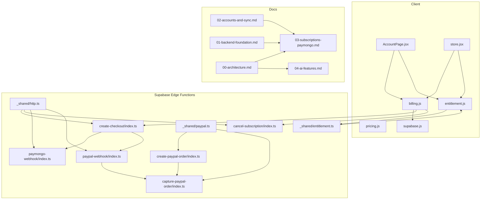

**Diagram sources**
- [AccountPage.jsx](file://src/components/AccountPage.jsx)
- [store.jsx](file://src/store.jsx)
- [billing.js](file://src/lib/billing.js)
- [entitlement.js](file://src/lib/entitlement.js)
- [pricing.js](file://src/lib/pricing.js)
- [supabase.js](file://src/lib/supabase.js)
- [index.ts (create-checkout)](file://supabase/functions/create-checkout/index.ts)
- [index.ts (cancel-subscription)](file://supabase/functions/cancel-subscription/index.ts)
- [index.ts (paymongo-webhook)](file://supabase/functions/paymongo-webhook/index.ts)
- [index.ts (paypal-webhook)](file://supabase/functions/paypal-webhook/index.ts)
- [index.ts (create-paypal-order)](file://supabase/functions/create-paypal-order/index.ts)
- [index.ts (capture-paypal-order)](file://supabase/functions/capture-paypal-order/index.ts)
- [entitlement.ts (shared)](file://supabase/functions/_shared/entitlement.ts)
- [http.ts (shared)](file://supabase/functions/_shared/http.ts)
- [paypal.ts (shared)](file://supabase/functions/_shared/paypal.ts)
- [00-architecture.md](file://docs/superpowers/plans/monetization/00-architecture.md)
- [01-backend-foundation.md](file://docs/superpowers/plans/monetization/01-backend-foundation.md)
- [02-accounts-and-sync.md](file://docs/superpowers/plans/monetization/02-accounts-and-sync.md)
- [03-subscriptions-paymongo.md](file://docs/superpowers/plans/monetization/03-subscriptions-paymongo.md)
- [04-ai-features.md](file://docs/superpowers/plans/monetization/04-ai-features.md)

**Section sources**
- [00-architecture.md](file://docs/superpowers/plans/monetization/00-architecture.md)
- [01-backend-foundation.md](file://docs/superpowers/plans/monetization/01-backend-foundation.md)
- [02-accounts-and-sync.md](file://docs/superpowers/plans/monetization/02-accounts-and-sync.md)
- [03-subscriptions-paymongo.md](file://docs/superpowers/plans/monetization/03-subscriptions-paymongo.md)
- [04-ai-features.md](file://docs/superpowers/plans/monetization/04-ai-features.md)

## Core Components
- Billing orchestration: coordinates checkout creation, order capture, and subscription actions.
- Entitlement engine: computes user entitlements from active subscriptions and plan definitions.
- Pricing catalog: defines plan tiers, features, and pricing rules.
- Webhook processors: handle payment provider events to update subscription state.
- UI integration: exposes subscription management and account settings to users.

Key responsibilities:
- Create checkout sessions and orders via payment providers.
- Process webhooks to activate, renew, or cancel subscriptions.
- Compute entitlements deterministically for feature access control.
- Provide consistent state across client and server.

**Section sources**
- [billing.js](file://src/lib/billing.js)
- [entitlement.js](file://src/lib/entitlement.js)
- [entitlement.test.js](file://src/lib/entitlement.test.js)
- [pricing.js](file://src/lib/pricing.js)
- [supabase.js](file://src/lib/supabase.js)
- [store.jsx](file://src/store.jsx)
- [AccountPage.jsx](file://src/components/AccountPage.jsx)
- [index.ts (create-checkout)](file://supabase/functions/create-checkout/index.ts)
- [index.ts (cancel-subscription)](file://supabase/functions/cancel-subscription/index.ts)
- [index.ts (paymongo-webhook)](file://supabase/functions/paymongo-webhook/index.ts)
- [index.ts (paypal-webhook)](file://supabase/functions/paypal-webhook/index.ts)
- [index.ts (create-paypal-order)](file://supabase/functions/create-paypal-order/index.ts)
- [index.ts (capture-paypal-order)](file://supabase/functions/capture-paypal-order/index.ts)
- [entitlement.ts (shared)](file://supabase/functions/_shared/entitlement.ts)
- [http.ts (shared)](file://supabase/functions/_shared/http.ts)
- [paypal.ts (shared)](file://supabase/functions/_shared/paypal.ts)

## Architecture Overview
The subscription lifecycle integrates client calls with Supabase Edge Functions and payment provider webhooks. The flow ensures idempotent updates and deterministic entitlement computation.

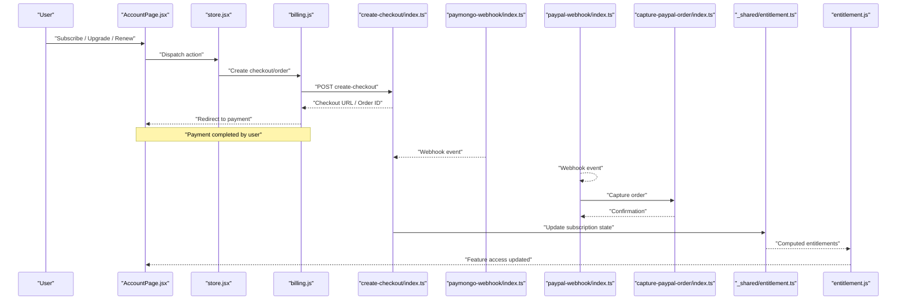

**Diagram sources**
- [AccountPage.jsx](file://src/components/AccountPage.jsx)
- [store.jsx](file://src/store.jsx)
- [billing.js](file://src/lib/billing.js)
- [index.ts (create-checkout)](file://supabase/functions/create-checkout/index.ts)
- [index.ts (paymongo-webhook)](file://supabase/functions/paymongo-webhook/index.ts)
- [index.ts (paypal-webhook)](file://supabase/functions/paypal-webhook/index.ts)
- [index.ts (capture-paypal-order)](file://supabase/functions/capture-paypal-order/index.ts)
- [entitlement.ts (shared)](file://supabase/functions/_shared/entitlement.ts)
- [entitlement.js](file://src/lib/entitlement.js)

## Detailed Component Analysis

### Subscription Creation Flow
- Entry points: Account page triggers billing actions; store dispatches to billing module.
- Checkout creation: Supabase function creates a checkout session or PayPal order.
- Payment completion: Webhooks notify the system to activate subscriptions.
- Post-payment: Entitlements are recalculated and applied to the user.

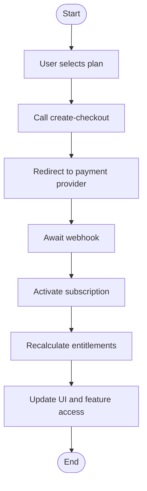

**Diagram sources**
- [AccountPage.jsx](file://src/components/AccountPage.jsx)
- [store.jsx](file://src/store.jsx)
- [billing.js](file://src/lib/billing.js)
- [index.ts (create-checkout)](file://supabase/functions/create-checkout/index.ts)
- [index.ts (paymongo-webhook)](file://supabase/functions/paymongo-webhook/index.ts)
- [index.ts (paypal-webhook)](file://supabase/functions/paypal-webhook/index.ts)
- [entitlement.js](file://src/lib/entitlement.js)

**Section sources**
- [AccountPage.jsx](file://src/components/AccountPage.jsx)
- [store.jsx](file://src/store.jsx)
- [billing.js](file://src/lib/billing.js)
- [index.ts (create-checkout)](file://supabase/functions/create-checkout/index.ts)
- [index.ts (paymongo-webhook)](file://supabase/functions/paymongo-webhook/index.ts)
- [index.ts (paypal-webhook)](file://supabase/functions/paypal-webhook/index.ts)
- [entitlement.js](file://src/lib/entitlement.js)

### Activation and Renewal Handling
- Activation: Triggered by successful payment confirmation via webhooks.
- Renewal: Automatic renewal handled by payment provider; webhook events update subscription period and status.
- Idempotency: Webhook handlers must be idempotent to prevent duplicate activations.

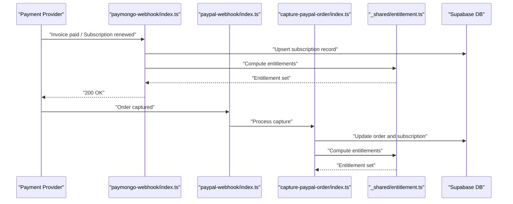

**Diagram sources**
- [index.ts (paymongo-webhook)](file://supabase/functions/paymongo-webhook/index.ts)
- [index.ts (paypal-webhook)](file://supabase/functions/paypal-webhook/index.ts)
- [index.ts (capture-paypal-order)](file://supabase/functions/capture-paypal-order/index.ts)
- [entitlement.ts (shared)](file://supabase/functions/_shared/entitlement.ts)

**Section sources**
- [index.ts (paymongo-webhook)](file://supabase/functions/paymongo-webhook/index.ts)
- [index.ts (paypal-webhook)](file://supabase/functions/paypal-webhook/index.ts)
- [index.ts (capture-paypal-order)](file://supabase/functions/capture-paypal-order/index.ts)
- [entitlement.ts (shared)](file://supabase/functions/_shared/entitlement.ts)

### Cancellation and Termination
- Cancellation: Initiated via cancel-subscription function; may apply grace period before termination.
- Termination: After grace period expires, subscription becomes inactive; entitlements are revoked accordingly.
- Notifications: System should send customer notifications upon cancellation and termination.

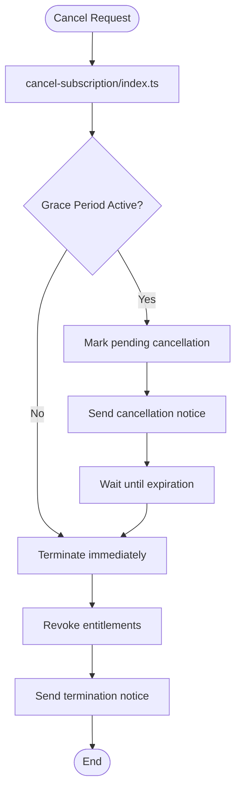

**Diagram sources**
- [index.ts (cancel-subscription)](file://supabase/functions/cancel-subscription/index.ts)
- [entitlement.js](file://src/lib/entitlement.js)

**Section sources**
- [index.ts (cancel-subscription)](file://supabase/functions/cancel-subscription/index.ts)
- [entitlement.js](file://src/lib/entitlement.js)

### Entitlement Calculation Logic
- Inputs: Active subscriptions, plan definitions, effective dates, and any grace period flags.
- Computation: Determine which features are enabled per plan tier; aggregate across multiple subscriptions if applicable.
- Output: Boolean feature flags used by UI and business logic to gate access.

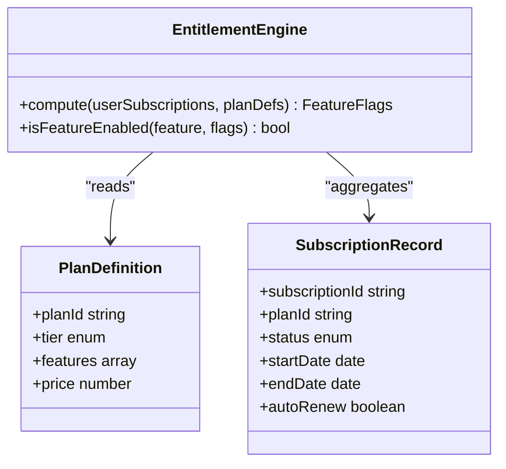

**Diagram sources**
- [entitlement.js](file://src/lib/entitlement.js)
- [entitlement.ts (shared)](file://supabase/functions/_shared/entitlement.ts)
- [pricing.js](file://src/lib/pricing.js)

**Section sources**
- [entitlement.js](file://src/lib/entitlement.js)
- [entitlement.test.js](file://src/lib/entitlement.test.js)
- [entitlement.ts (shared)](file://supabase/functions/_shared/entitlement.ts)
- [pricing.js](file://src/lib/pricing.js)

### Feature Access Control Based on Subscription Status
- Gate checks: Before enabling premium features, verify current entitlement flags.
- Real-time updates: On webhook events, recompute entitlements and propagate changes to the client.
- Defensive checks: Always validate entitlements server-side even if client indicates access.

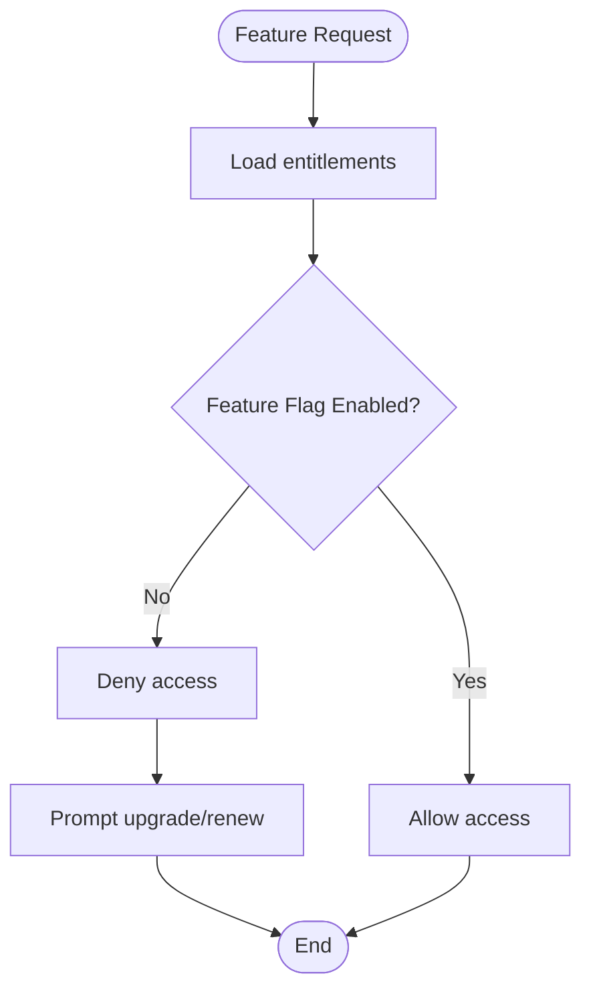

**Diagram sources**
- [entitlement.js](file://src/lib/entitlement.js)
- [AccountPage.jsx](file://src/components/AccountPage.jsx)

**Section sources**
- [entitlement.js](file://src/lib/entitlement.js)
- [AccountPage.jsx](file://src/components/AccountPage.jsx)

### Plan Tier Definitions
- Tiers: Define distinct plan levels with associated features and pricing.
- Catalog: Centralized pricing configuration used by both client and server.
- Evolution: Plans can evolve over time; versioning helps manage upgrades and historical data.

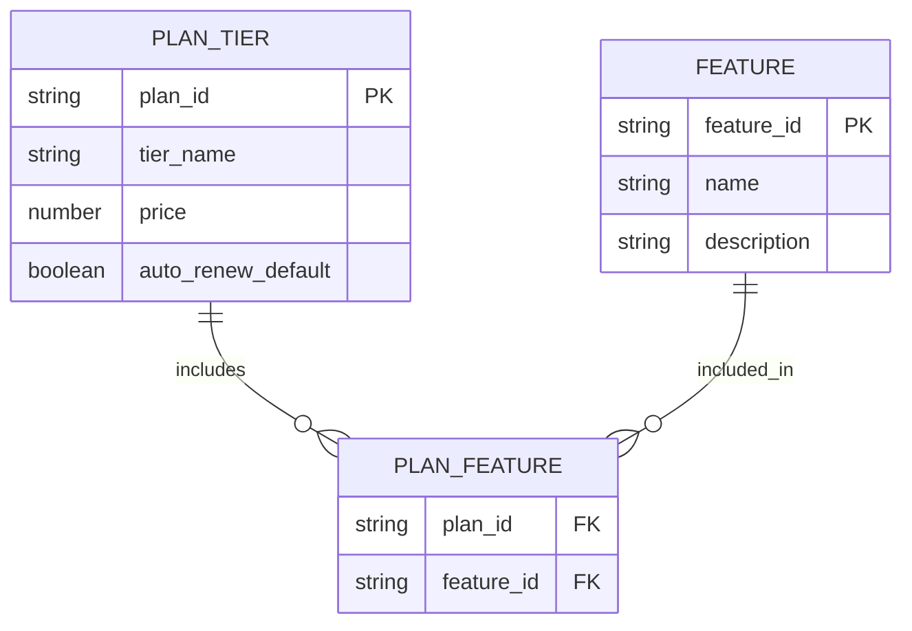

**Diagram sources**
- [pricing.js](file://src/lib/pricing.js)
- [03-subscriptions-paymongo.md](file://docs/superpowers/plans/monetization/03-subscriptions-paymongo.md)

**Section sources**
- [pricing.js](file://src/lib/pricing.js)
- [03-subscriptions-paymongo.md](file://docs/superpowers/plans/monetization/03-subscriptions-paymongo.md)

### State Transitions and Grace Periods
- States: Active, Pending Cancellation, Expired, Terminated.
- Transitions:
  - Active to Pending Cancellation: Upon cancellation request.
  - Pending Cancellation to Terminated: After grace period ends.
  - Expired to Active: Upon successful renewal.
- Grace Period: Allows continued access after cancellation until expiration.

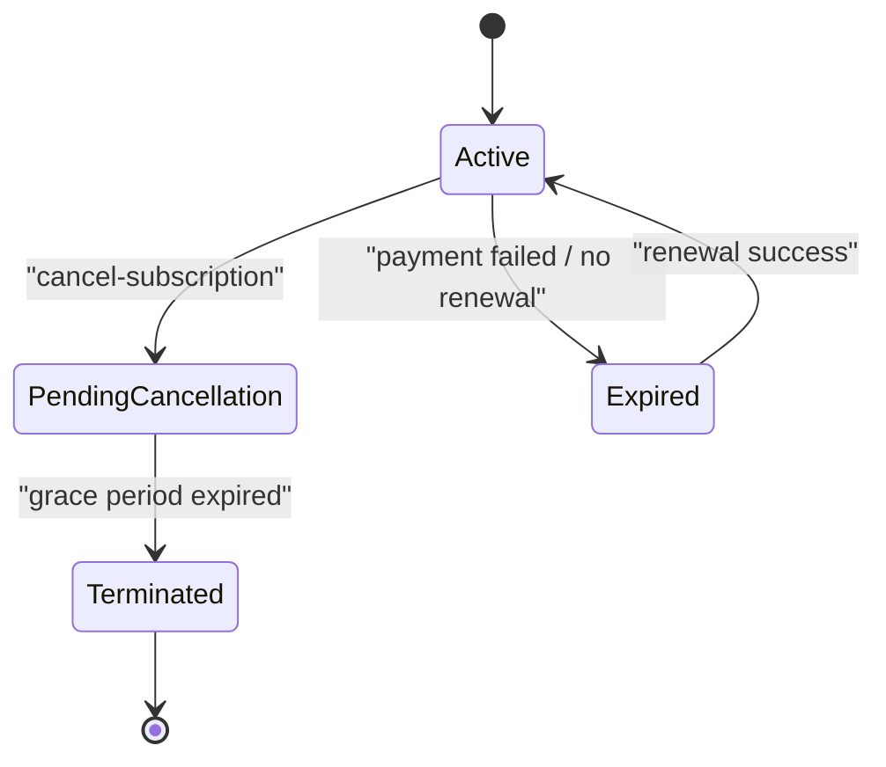

**Diagram sources**
- [index.ts (cancel-subscription)](file://supabase/functions/cancel-subscription/index.ts)
- [index.ts (paymongo-webhook)](file://supabase/functions/paymongo-webhook/index.ts)
- [index.ts (paypal-webhook)](file://supabase/functions/paypal-webhook/index.ts)

**Section sources**
- [index.ts (cancel-subscription)](file://supabase/functions/cancel-subscription/index.ts)
- [index.ts (paymongo-webhook)](file://supabase/functions/paymongo-webhook/index.ts)
- [index.ts (paypal-webhook)](file://supabase/functions/paypal-webhook/index.ts)

### Upgrade and Downgrade Flows with Proration
- Upgrade: Immediate effect with prorated charge for remaining period.
- Downgrade: Effective at next billing cycle; proration may credit or adjust future charges.
- Proration: Calculated based on plan prices and time remaining; ensure consistency between client and server.

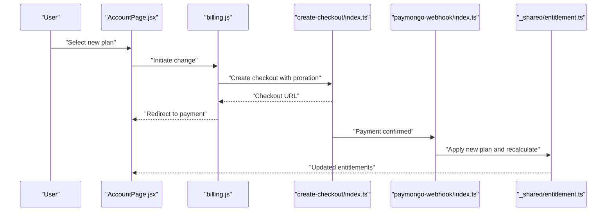

**Diagram sources**
- [AccountPage.jsx](file://src/components/AccountPage.jsx)
- [billing.js](file://src/lib/billing.js)
- [index.ts (create-checkout)](file://supabase/functions/create-checkout/index.ts)
- [index.ts (paymongo-webhook)](file://supabase/functions/paymongo-webhook/index.ts)
- [entitlement.ts (shared)](file://supabase/functions/_shared/entitlement.ts)

**Section sources**
- [AccountPage.jsx](file://src/components/AccountPage.jsx)
- [billing.js](file://src/lib/billing.js)
- [index.ts (create-checkout)](file://supabase/functions/create-checkout/index.ts)
- [index.ts (paymongo-webhook)](file://supabase/functions/paymongo-webhook/index.ts)
- [entitlement.ts (shared)](file://supabase/functions/_shared/entitlement.ts)

### Customer Notification Systems
- Triggers: Cancellation requests, grace period expiry, renewal successes/failures, plan changes.
- Channels: Email or in-app notifications; ensure reliable delivery and retry policies.
- Content: Clear explanations of status changes, deadlines, and next steps.

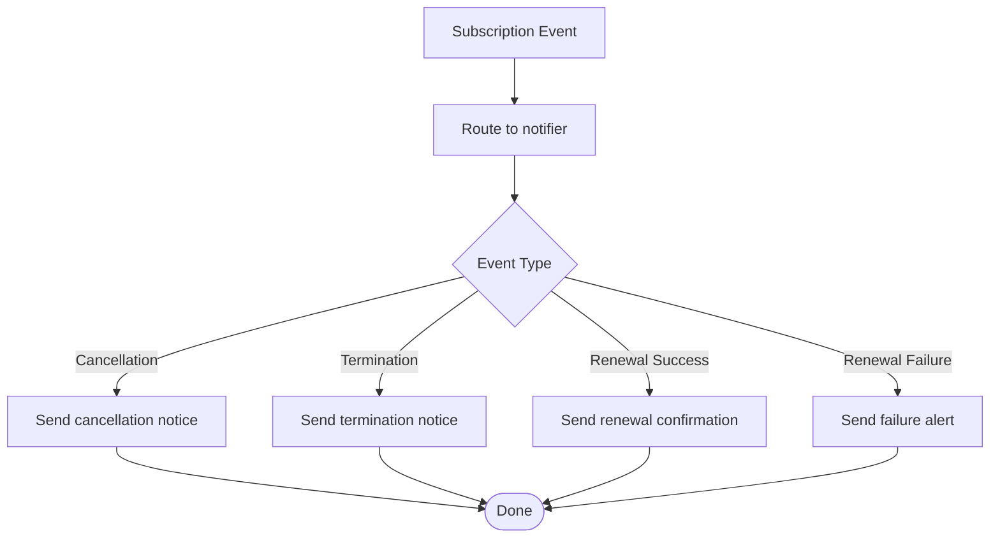

[No diagram sources since this section describes conceptual notification routing without mapping to specific files]

**Section sources**
- [index.ts (cancel-subscription)](file://supabase/functions/cancel-subscription/index.ts)
- [index.ts (paymongo-webhook)](file://supabase/functions/paymongo-webhook/index.ts)
- [index.ts (paypal-webhook)](file://supabase/functions/paypal-webhook/index.ts)

## Dependency Analysis
The subscription system relies on clear separation between client orchestration, server-side processing, and shared entitlement logic. External dependencies include payment providers and Supabase services.

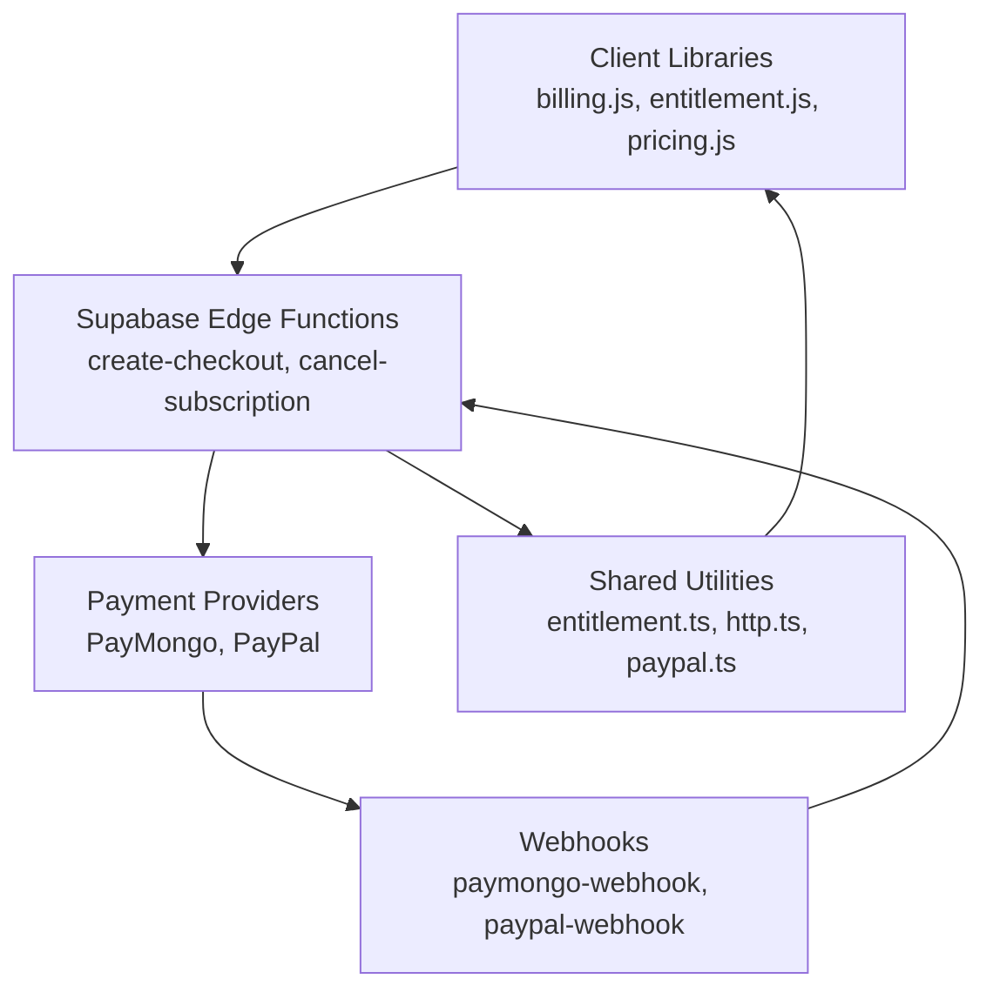

**Diagram sources**
- [billing.js](file://src/lib/billing.js)
- [entitlement.js](file://src/lib/entitlement.js)
- [pricing.js](file://src/lib/pricing.js)
- [index.ts (create-checkout)](file://supabase/functions/create-checkout/index.ts)
- [index.ts (cancel-subscription)](file://supabase/functions/cancel-subscription/index.ts)
- [index.ts (paymongo-webhook)](file://supabase/functions/paymongo-webhook/index.ts)
- [index.ts (paypal-webhook)](file://supabase/functions/paypal-webhook/index.ts)
- [entitlement.ts (shared)](file://supabase/functions/_shared/entitlement.ts)
- [http.ts (shared)](file://supabase/functions/_shared/http.ts)
- [paypal.ts (shared)](file://supabase/functions/_shared/paypal.ts)

**Section sources**
- [billing.js](file://src/lib/billing.js)
- [entitlement.js](file://src/lib/entitlement.js)
- [pricing.js](file://src/lib/pricing.js)
- [index.ts (create-checkout)](file://supabase/functions/create-checkout/index.ts)
- [index.ts (cancel-subscription)](file://supabase/functions/cancel-subscription/index.ts)
- [index.ts (paymongo-webhook)](file://supabase/functions/paymongo-webhook/index.ts)
- [index.ts (paypal-webhook)](file://supabase/functions/paypal-webhook/index.ts)
- [entitlement.ts (shared)](file://supabase/functions/_shared/entitlement.ts)
- [http.ts (shared)](file://supabase/functions/_shared/http.ts)
- [paypal.ts (shared)](file://supabase/functions/_shared/paypal.ts)

## Performance Considerations
- Cache entitlements on the client to reduce recomputation overhead.
- Ensure webhook handlers are fast and idempotent; avoid heavy operations within tight SLAs.
- Batch updates when possible to minimize database writes during high-volume events.
- Use efficient queries and indexes for subscription records and plan definitions.

[No sources needed since this section provides general guidance]

## Troubleshooting Guide
Common issues and resolutions:
- Duplicate activations: Verify webhook idempotency keys and deduplicate events.
- Stale entitlements: Force recomputation on client refresh or after webhook processing.
- Payment failures: Monitor webhook error logs and implement retries with backoff.
- Proration mismatches: Cross-check proration calculations between client and server; align on pricing catalog versions.

**Section sources**
- [index.ts (paymongo-webhook)](file://supabase/functions/paymongo-webhook/index.ts)
- [index.ts (paypal-webhook)](file://supabase/functions/paypal-webhook/index.ts)
- [entitlement.js](file://src/lib/entitlement.js)
- [entitlement.test.js](file://src/lib/entitlement.test.js)

## Conclusion
ApplyGuard PH’s subscription lifecycle integrates robust client-server coordination, deterministic entitlement computation, and resilient webhook processing. By adhering to idempotent updates, clear state transitions, and consistent proration logic, the system ensures reliable feature access control and a smooth user experience across subscription changes.

[No sources needed since this section summarizes without analyzing specific files]

## Appendices
- Architecture overview and monetization strategy references:
  - [00-architecture.md](file://docs/superpowers/plans/monetization/00-architecture.md)
  - [01-backend-foundation.md](file://docs/superpowers/plans/monetization/01-backend-foundation.md)
  - [02-accounts-and-sync.md](file://docs/superpowers/plans/monetization/02-accounts-and-sync.md)
  - [03-subscriptions-paymongo.md](file://docs/superpowers/plans/monetization/03-subscriptions-paymongo.md)
  - [04-ai-features.md](file://docs/superpowers/plans/monetization/04-ai-features.md)

**Section sources**
- [00-architecture.md](file://docs/superpowers/plans/monetization/00-architecture.md)
- [01-backend-foundation.md](file://docs/superpowers/plans/monetization/01-backend-foundation.md)
- [02-accounts-and-sync.md](file://docs/superpowers/plans/monetization/02-accounts-and-sync.md)
- [03-subscriptions-paymongo.md](file://docs/superpowers/plans/monetization/03-subscriptions-paymongo.md)
- [04-ai-features.md](file://docs/superpowers/plans/monetization/04-ai-features.md)