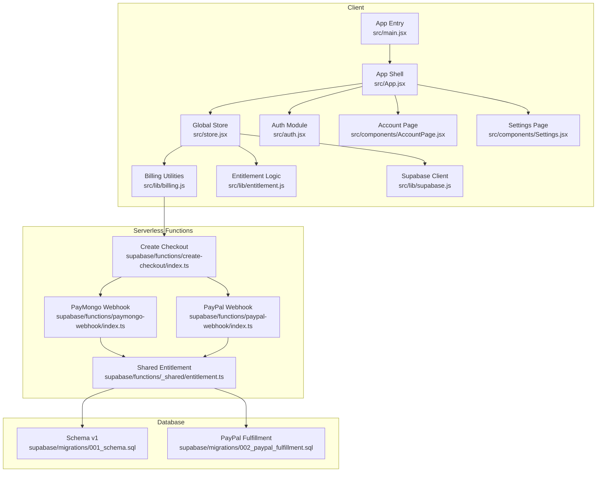
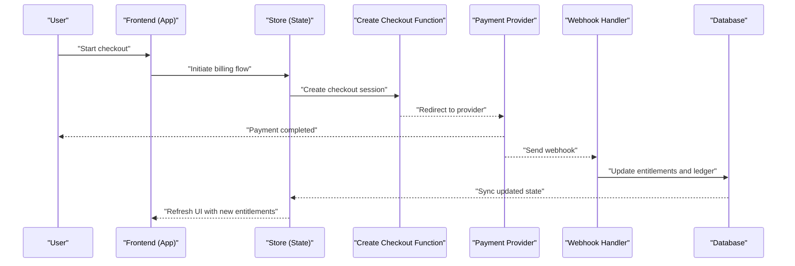
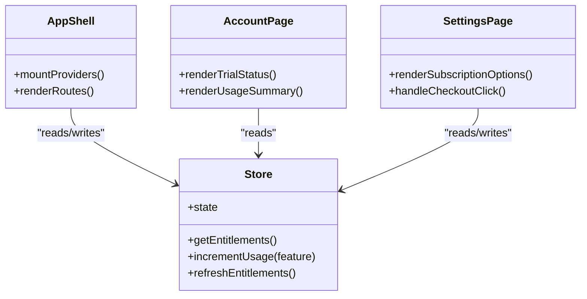
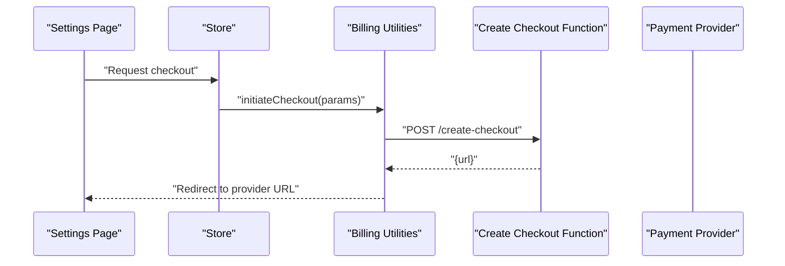
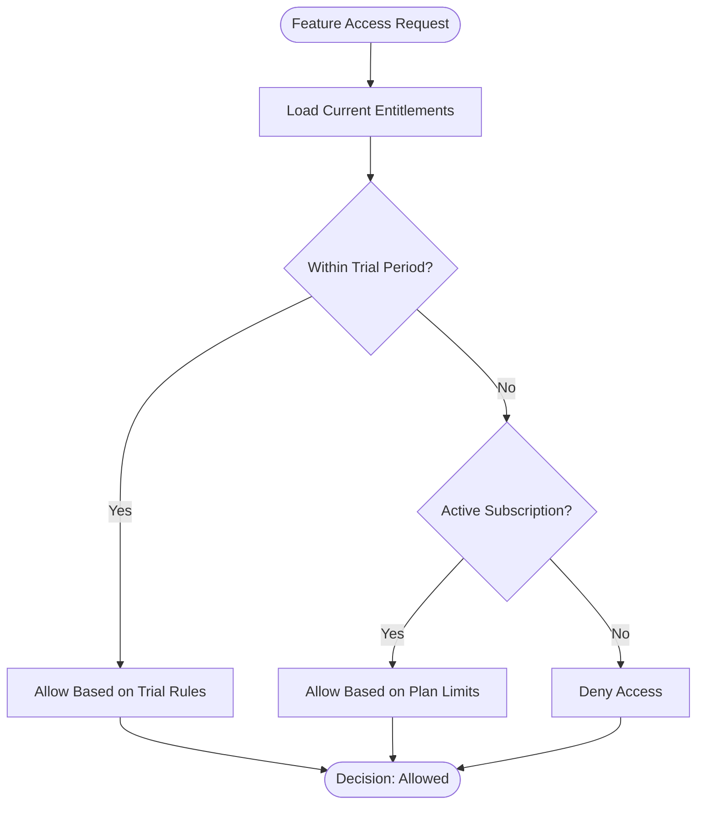
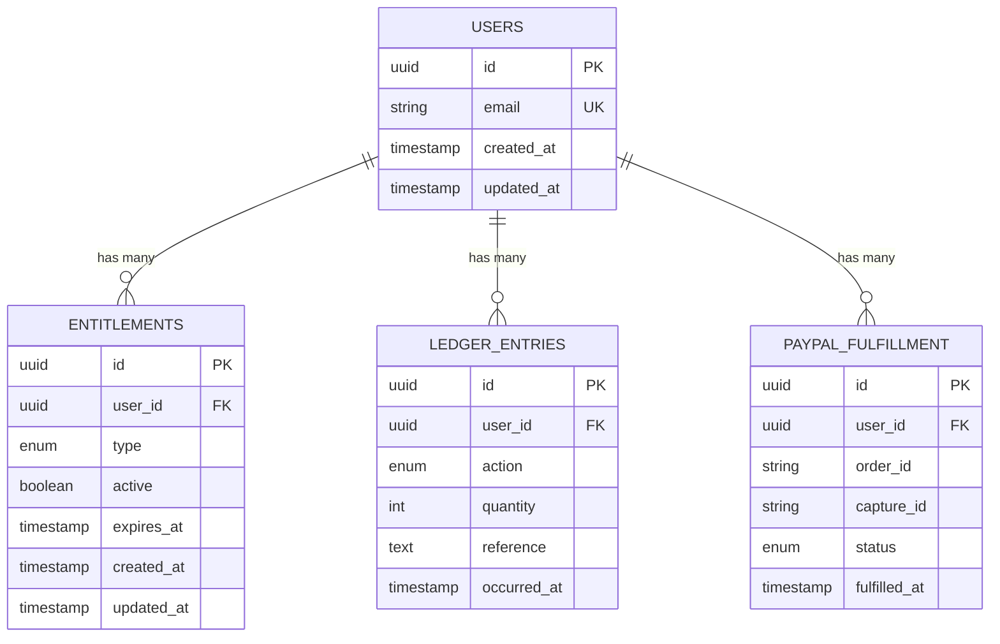
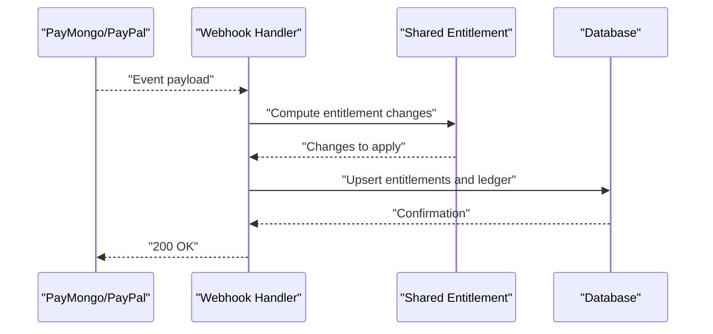
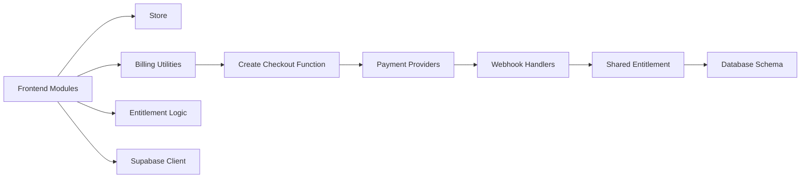

# Trial & Usage Ledger System

<cite>
**Referenced Files in This Document**
- [README.md](file://README.md)
- [package.json](file://package.json)
- [src/App.jsx](file://src/App.jsx)
- [src/main.jsx](file://src/main.jsx)
- [src/store.jsx](file://src/store.jsx)
- [src/auth.jsx](file://src/auth.jsx)
- [src/components/AccountPage.jsx](file://src/components/AccountPage.jsx)
- [src/components/Settings.jsx](file://src/components/Settings.jsx)
- [src/lib/billing.js](file://src/lib/billing.js)
- [src/lib/entitlement.js](file://src/lib/entitlement.js)
- [src/lib/supabase.js](file://src/lib/supabase.js)
- [supabase/functions/_shared/entitlement.ts](file://supabase/functions/_shared/entitlement.ts)
- [supabase/functions/create-checkout/index.ts](file://supabase/functions/create-checkout/index.ts)
- [supabase/functions/paymongo-webhook/index.ts](file://supabase/functions/paymongo-webhook/index.ts)
- [supabase/functions/paypal-webhook/index.ts](file://supabase/functions/paypal-webhook/index.ts)
- [supabase/migrations/001_schema.sql](file://supabase/migrations/001_schema.sql)
- [supabase/migrations/002_paypal_fulfillment.sql](file://supabase/migrations/002_paypal_fulfillment.sql)
</cite>

## Table of Contents
1. [Introduction](#introduction)
2. [Project Structure](#project-structure)
3. [Core Components](#core-components)
4. [Architecture Overview](#architecture-overview)
5. [Detailed Component Analysis](#detailed-component-analysis)
6. [Dependency Analysis](#dependency-analysis)
7. [Performance Considerations](#performance-considerations)
8. [Troubleshooting Guide](#troubleshooting-guide)
9. [Conclusion](#conclusion)

## Introduction
This document describes the Trial & Usage Ledger System that underpins trial management, usage accounting, and entitlement enforcement across the application. It explains how trials are granted and tracked, how usage is recorded and reconciled, and how billing integrations (PayMongo and PayPal) update entitlements and ledger state. The system spans client-side logic, serverless functions, and database migrations to provide a consistent, auditable record of user entitlements and usage.

## Project Structure
The project is a modern web app with:
- Client-side React UI and state management
- Serverless functions for billing and entitlement operations
- Supabase database schema and migrations
- Billing integrations via PayMongo and PayPal webhooks

**Diagram sources**
- [src/main.jsx](file://src/main.jsx)
- [src/App.jsx](file://src/App.jsx)
- [src/store.jsx](file://src/store.jsx)
- [src/auth.jsx](file://src/auth.jsx)
- [src/lib/billing.js](file://src/lib/billing.js)
- [src/lib/entitlement.js](file://src/lib/entitlement.js)
- [src/lib/supabase.js](file://src/lib/supabase.js)
- [src/components/AccountPage.jsx](file://src/components/AccountPage.jsx)
- [src/components/Settings.jsx](file://src/components/Settings.jsx)
- [supabase/functions/create-checkout/index.ts](file://supabase/functions/create-checkout/index.ts)
- [supabase/functions/paymongo-webhook/index.ts](file://supabase/functions/paymongo-webhook/index.ts)
- [supabase/functions/paypal-webhook/index.ts](file://supabase/functions/paypal-webhook/index.ts)
- [supabase/functions/_shared/entitlement.ts](file://supabase/functions/_shared/entitlement.ts)
- [supabase/migrations/001_schema.sql](file://supabase/migrations/001_schema.sql)
- [supabase/migrations/002_paypal_fulfillment.sql](file://supabase/migrations/002_paypal_fulfillment.sql)

**Section sources**
- [README.md](file://README.md)
- [package.json](file://package.json)

## Core Components
- App entry and shell: Initializes the application, mounts the root component, and wires up global providers and routing.
- Global store: Centralizes state for entitlements, trial status, and usage counters; exposes actions to update and persist state.
- Auth module: Manages authentication lifecycle and integrates with Supabase auth to scope entitlements per user.
- Billing utilities: Provides helpers to create checkouts and handle billing flows from the client.
- Entitlement logic: Encapsulates rules for trial eligibility, usage limits, and feature gating based on current entitlements.
- Supabase client: Configures the database client used by both client and serverless functions for reading/writing ledger data.
- Account and Settings pages: User-facing surfaces to view trial status, usage, and manage subscription settings.

Key responsibilities:
- Maintain a single source of truth for trial and usage state
- Enforce feature access based on entitlements
- Record usage events and reconcile them with billing outcomes
- Provide UI for users to inspect and control their trial and subscription

**Section sources**
- [src/main.jsx](file://src/main.jsx)
- [src/App.jsx](file://src/App.jsx)
- [src/store.jsx](file://src/store.jsx)
- [src/auth.jsx](file://src/auth.jsx)
- [src/lib/billing.js](file://src/lib/billing.js)
- [src/lib/entitlement.js](file://src/lib/entitlement.js)
- [src/lib/supabase.js](file://src/lib/supabase.js)
- [src/components/AccountPage.jsx](file://src/components/AccountPage.jsx)
- [src/components/Settings.jsx](file://src/components/Settings.jsx)

## Architecture Overview
The Trial & Usage Ledger System follows a client-server architecture with event-driven updates from payment providers:
- The client initializes auth and loads entitlements and usage from the database.
- Users initiate checkout flows through serverless functions.
- Payment providers send webhooks to update entitlements and ledger entries.
- Shared entitlement logic ensures consistency between client and server.

**Diagram sources**
- [src/App.jsx](file://src/App.jsx)
- [src/store.jsx](file://src/store.jsx)
- [src/lib/billing.js](file://src/lib/billing.js)
- [supabase/functions/create-checkout/index.ts](file://supabase/functions/create-checkout/index.ts)
- [supabase/functions/paymongo-webhook/index.ts](file://supabase/functions/paymongo-webhook/index.ts)
- [supabase/functions/paypal-webhook/index.ts](file://supabase/functions/paypal-webhook/index.ts)
- [supabase/migrations/001_schema.sql](file://supabase/migrations/001_schema.sql)
- [supabase/migrations/002_paypal_fulfillment.sql](file://supabase/migrations/002_paypal_fulfillment.sql)

## Detailed Component Analysis

### Client-Side State and UI
- App shell sets up providers and routes, ensuring entitlement-aware components render correctly.
- Global store holds trial metadata, usage counters, and entitlement flags; it exposes methods to increment usage and refresh entitlements.
- Account and Settings pages read from the store to display trial status, remaining usage, and allow users to manage subscriptions.

**Diagram sources**
- [src/App.jsx](file://src/App.jsx)
- [src/store.jsx](file://src/store.jsx)
- [src/components/AccountPage.jsx](file://src/components/AccountPage.jsx)
- [src/components/Settings.jsx](file://src/components/Settings.jsx)

**Section sources**
- [src/App.jsx](file://src/App.jsx)
- [src/store.jsx](file://src/store.jsx)
- [src/components/AccountPage.jsx](file://src/components/AccountPage.jsx)
- [src/components/Settings.jsx](file://src/components/Settings.jsx)

### Billing Utilities and Checkout Flow
- Billing utilities orchestrate checkout creation and redirect to payment providers.
- Create checkout function prepares sessions and returns URLs for the client to navigate.

**Diagram sources**
- [src/components/Settings.jsx](file://src/components/Settings.jsx)
- [src/store.jsx](file://src/store.jsx)
- [src/lib/billing.js](file://src/lib/billing.js)
- [supabase/functions/create-checkout/index.ts](file://supabase/functions/create-checkout/index.ts)

**Section sources**
- [src/lib/billing.js](file://src/lib/billing.js)
- [supabase/functions/create-checkout/index.ts](file://supabase/functions/create-checkout/index.ts)

### Entitlement Enforcement
- Client-side entitlement logic checks features against current entitlements derived from trial and subscription state.
- Server-side shared entitlement logic validates and computes entitlements consistently for webhooks and backend operations.

**Diagram sources**
- [src/lib/entitlement.js](file://src/lib/entitlement.js)
- [supabase/functions/_shared/entitlement.ts](file://supabase/functions/_shared/entitlement.ts)

**Section sources**
- [src/lib/entitlement.js](file://src/lib/entitlement.js)
- [supabase/functions/_shared/entitlement.ts](file://supabase/functions/_shared/entitlement.ts)

### Database Schema and Migrations
- Initial schema defines core tables for users, entitlements, and ledger entries.
- PayPal fulfillment migration adds structures to track PayPal-specific fulfillment records and reconciliation.

**Diagram sources**
- [supabase/migrations/001_schema.sql](file://supabase/migrations/001_schema.sql)
- [supabase/migrations/002_paypal_fulfillment.sql](file://supabase/migrations/002_paypal_fulfillment.sql)

**Section sources**
- [supabase/migrations/001_schema.sql](file://supabase/migrations/001_schema.sql)
- [supabase/migrations/002_paypal_fulfillment.sql](file://supabase/migrations/002_paypal_fulfillment.sql)

### Webhook Handlers and Reconciliation
- PayMongo webhook handler processes payment confirmations and updates entitlements and ledger entries accordingly.
- PayPal webhook handler performs similar reconciliation for PayPal orders and captures.

**Diagram sources**
- [supabase/functions/paymongo-webhook/index.ts](file://supabase/functions/paymongo-webhook/index.ts)
- [supabase/functions/paypal-webhook/index.ts](file://supabase/functions/paypal-webhook/index.ts)
- [supabase/functions/_shared/entitlement.ts](file://supabase/functions/_shared/entitlement.ts)

**Section sources**
- [supabase/functions/paymongo-webhook/index.ts](file://supabase/functions/paymongo-webhook/index.ts)
- [supabase/functions/paypal-webhook/index.ts](file://supabase/functions/paypal-webhook/index.ts)
- [supabase/functions/_shared/entitlement.ts](file://supabase/functions/_shared/entitlement.ts)

## Dependency Analysis
The Trial & Usage Ledger System has clear separation of concerns:
- Frontend depends on store, billing utilities, and entitlement logic to enforce access and present state.
- Serverless functions depend on shared entitlement logic and database schema to maintain consistency.
- Webhooks depend on provider payloads and shared entitlement computation to update state reliably.

**Diagram sources**
- [src/store.jsx](file://src/store.jsx)
- [src/lib/billing.js](file://src/lib/billing.js)
- [src/lib/entitlement.js](file://src/lib/entitlement.js)
- [src/lib/supabase.js](file://src/lib/supabase.js)
- [supabase/functions/create-checkout/index.ts](file://supabase/functions/create-checkout/index.ts)
- [supabase/functions/paymongo-webhook/index.ts](file://supabase/functions/paymongo-webhook/index.ts)
- [supabase/functions/paypal-webhook/index.ts](file://supabase/functions/paypal-webhook/index.ts)
- [supabase/functions/_shared/entitlement.ts](file://supabase/functions/_shared/entitlement.ts)
- [supabase/migrations/001_schema.sql](file://supabase/migrations/001_schema.sql)
- [supabase/migrations/002_paypal_fulfillment.sql](file://supabase/migrations/002_paypal_fulfillment.sql)

**Section sources**
- [src/store.jsx](file://src/store.jsx)
- [src/lib/billing.js](file://src/lib/billing.js)
- [src/lib/entitlement.js](file://src/lib/entitlement.js)
- [src/lib/supabase.js](file://src/lib/supabase.js)
- [supabase/functions/create-checkout/index.ts](file://supabase/functions/create-checkout/index.ts)
- [supabase/functions/paymongo-webhook/index.ts](file://supabase/functions/paymongo-webhook/index.ts)
- [supabase/functions/paypal-webhook/index.ts](file://supabase/functions/paypal-webhook/index.ts)
- [supabase/functions/_shared/entitlement.ts](file://supabase/functions/_shared/entitlement.ts)
- [supabase/migrations/001_schema.sql](file://supabase/migrations/001_schema.sql)
- [supabase/migrations/002_paypal_fulfillment.sql](file://supabase/migrations/002_paypal_fulfillment.sql)

## Performance Considerations
- Minimize redundant entitlement checks by caching results in the store and invalidating only when necessary.
- Batch usage increments where possible to reduce database writes during high-frequency interactions.
- Ensure webhook handlers are idempotent to avoid duplicate ledger entries on retries.
- Use efficient queries and indexes on frequently accessed fields such as user_id and timestamps.

## Troubleshooting Guide
Common issues and resolutions:
- Entitlement mismatch between client and server: Verify shared entitlement logic and ensure both client and server use the same rules.
- Webhook not updating state: Confirm provider signatures, payload parsing, and idempotency keys; check database constraints and transaction boundaries.
- Checkout failures: Validate environment configuration for payment providers and ensure correct return URLs and secret keys.
- Usage not reflected in UI: Ensure store refresh triggers after successful webhook processing and that UI components subscribe to store updates.

**Section sources**
- [src/lib/entitlement.js](file://src/lib/entitlement.js)
- [supabase/functions/_shared/entitlement.ts](file://supabase/functions/_shared/entitlement.ts)
- [supabase/functions/paymongo-webhook/index.ts](file://supabase/functions/paymongo-webhook/index.ts)
- [supabase/functions/paypal-webhook/index.ts](file://supabase/functions/paypal-webhook/index.ts)
- [src/store.jsx](file://src/store.jsx)

## Conclusion
The Trial & Usage Ledger System provides a robust foundation for managing trials, tracking usage, and enforcing entitlements across the application. By centralizing entitlement logic, maintaining an auditable ledger, and integrating securely with payment providers, the system ensures consistent behavior and reliable state synchronization between client and server.