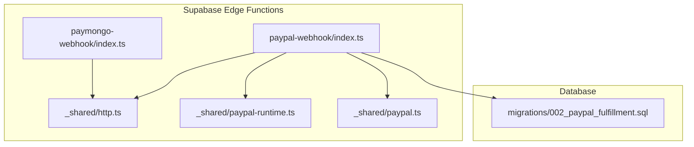
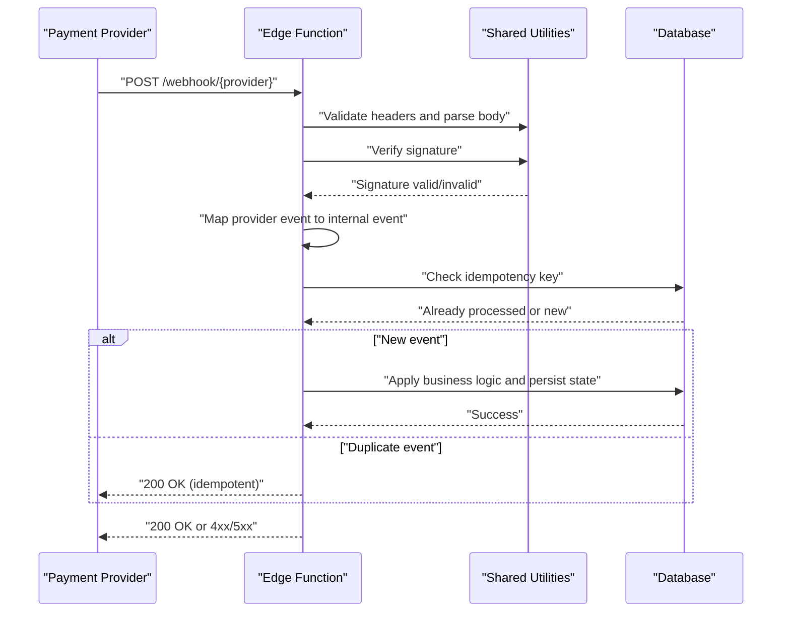
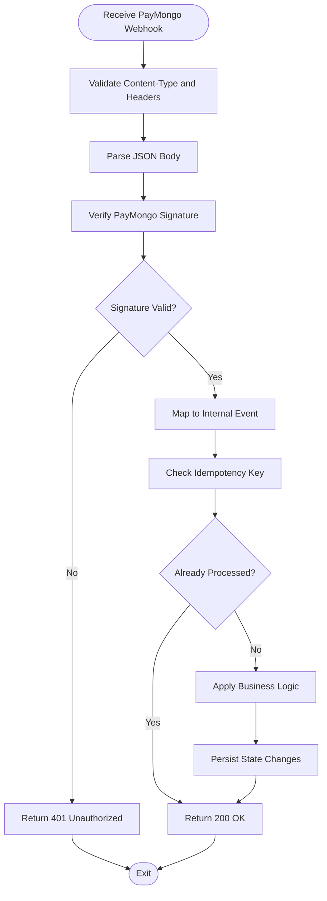
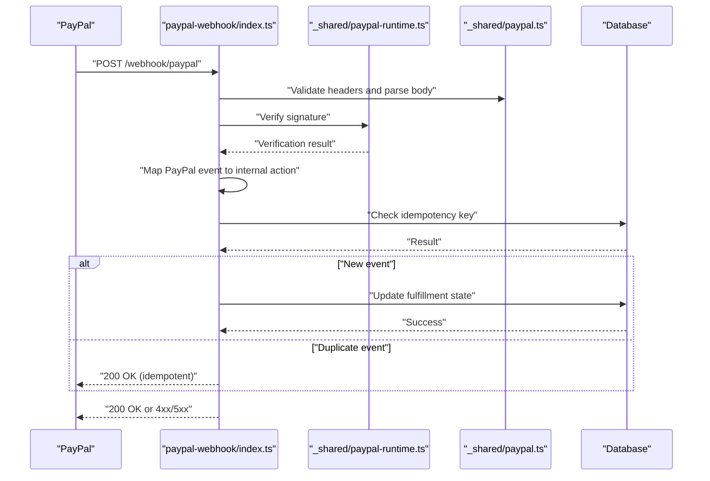
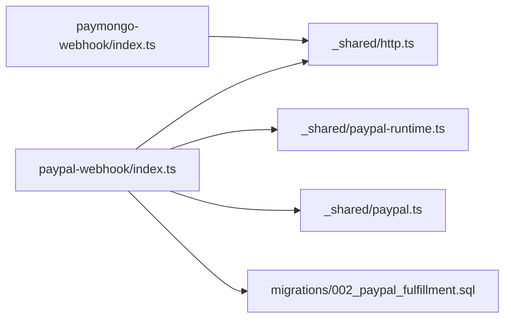

# Webhook Processing & Event Handling

<cite>
**Referenced Files in This Document**
- [paymongo-webhook/index.ts](file://supabase/functions/paymongo-webhook/index.ts)
- [paypal-webhook/index.ts](file://supabase/functions/paypal-webhook/index.ts)
- [shared/http.ts](file://supabase/functions/_shared/http.ts)
- [shared/paypal-runtime.ts](file://supabase/functions/_shared/paypal-runtime.ts)
- [shared/paypal.ts](file://supabase/functions/_shared/paypal.ts)
- [migrations/002_paypal_fulfillment.sql](file://supabase/migrations/002_paypal_fulfillment.sql)
</cite>

## Table of Contents
1. [Introduction](#introduction)
2. [Project Structure](#project-structure)
3. [Core Components](#core-components)
4. [Architecture Overview](#architecture-overview)
5. [Detailed Component Analysis](#detailed-component-analysis)
6. [Dependency Analysis](#dependency-analysis)
7. [Performance Considerations](#performance-considerations)
8. [Troubleshooting Guide](#troubleshooting-guide)
9. [Conclusion](#conclusion)
10. [Appendices](#appendices)

## Introduction
This document explains how ApplyGuard PH processes webhooks from PayMongo and PayPal, including endpoint implementations, request validation, signature verification, event handling, idempotency, retry behavior, error logging, monitoring, debugging techniques, security best practices, and payload transformation patterns. The goal is to provide a clear, actionable guide for developers and operators who maintain or extend webhook processing.

## Project Structure
Webhook endpoints are implemented as Supabase Edge Functions under supabase/functions. Shared utilities for HTTP handling and PayPal runtime logic live under supabase/functions/_shared. Database schema changes related to PayPal fulfillment are defined in migrations.

**Diagram sources**
- [paymongo-webhook/index.ts](file://supabase/functions/paymongo-webhook/index.ts)
- [paypal-webhook/index.ts](file://supabase/functions/paypal-webhook/index.ts)
- [shared/http.ts](file://supabase/functions/_shared/http.ts)
- [shared/paypal-runtime.ts](file://supabase/functions/_shared/paypal-runtime.ts)
- [shared/paypal.ts](file://supabase/functions/_shared/paypal.ts)
- [migrations/002_paypal_fulfillment.sql](file://supabase/migrations/002_paypal_fulfillment.sql)

**Section sources**
- [paymongo-webhook/index.ts](file://supabase/functions/paymongo-webhook/index.ts)
- [paypal-webhook/index.ts](file://supabase/functions/paypal-webhook/index.ts)
- [shared/http.ts](file://supabase/functions/_shared/http.ts)
- [shared/paypal-runtime.ts](file://supabase/functions/_shared/paypal-runtime.ts)
- [shared/paypal.ts](file://supabase/functions/_shared/paypal.ts)
- [migrations/002_paypal_fulfillment.sql](file://supabase/migrations/002_paypal_fulfillment.sql)

## Core Components
- PayMongo webhook handler: Receives events from PayMongo, validates the request, verifies signatures, transforms payloads into internal events, applies idempotency checks, persists state changes, and returns appropriate responses.
- PayPal webhook handler: Receives events from PayPal, validates headers and signatures using shared PayPal runtime utilities, maps PayPal events to internal actions, enforces idempotency, updates database records, and responds with success/failure semantics.
- Shared HTTP utilities: Provide common helpers for reading request bodies, parsing JSON, setting response headers, and returning standardized HTTP responses.
- Shared PayPal utilities: Implement PayPal-specific signature verification, event parsing, and helper functions used by the PayPal webhook handler.
- PayPal fulfillment migration: Defines database tables and constraints required for tracking PayPal order lifecycle and fulfillment state.

Key responsibilities across components:
- Request validation (headers, content type, body shape)
- Signature verification (PayMongo and PayPal)
- Event routing based on event types
- Idempotency enforcement via unique identifiers
- Error logging and metrics-friendly outputs
- Safe retries and backoff strategies at the platform level

**Section sources**
- [paymongo-webhook/index.ts](file://supabase/functions/paymongo-webhook/index.ts)
- [paypal-webhook/index.ts](file://supabase/functions/paypal-webhook/index.ts)
- [shared/http.ts](file://supabase/functions/_shared/http.ts)
- [shared/paypal-runtime.ts](file://supabase/functions/_shared/paypal-runtime.ts)
- [shared/paypal.ts](file://supabase/functions/_shared/paypal.ts)
- [migrations/002_paypal_fulfillment.sql](file://supabase/migrations/002_paypal_fulfillment.sql)

## Architecture Overview
The webhook architecture follows a simple, robust pattern:
- External provider sends an HTTP POST to the corresponding Edge Function.
- The function validates the request and verifies the signature.
- The payload is transformed into an internal event model.
- Idempotency is enforced using provider-supplied IDs.
- Business logic updates application state (e.g., subscription status).
- A consistent HTTP response is returned to signal success or failure.

[No sources needed since this diagram shows conceptual workflow, not actual code structure]

## Detailed Component Analysis

### PayMongo Webhook Handler
Responsibilities:
- Accepts PayMongo webhook requests.
- Validates content-type and parses JSON body.
- Verifies PayMongo signature using configured secret.
- Routes events by type (e.g., payment succeeded, failed, refunded).
- Enforces idempotency using PayMongo event ID.
- Persists outcome and returns appropriate HTTP status.

Security and validation:
- Requires correct content-type header.
- Uses HMAC-based signature verification against the raw request body.
- Rejects malformed or unsigned requests early.

Event handling:
- Maps PayMongo event types to internal actions.
- Updates subscription or entitlement state accordingly.

Idempotency:
- Uses provider event ID as idempotency key.
- Skips reprocessing if already recorded.

Error handling:
- Logs errors with context (event ID, type, partial payload).
- Returns non-200 status codes for failures to trigger provider retries.

**Diagram sources**
- [paymongo-webhook/index.ts](file://supabase/functions/paymongo-webhook/index.ts)
- [shared/http.ts](file://supabase/functions/_shared/http.ts)

**Section sources**
- [paymongo-webhook/index.ts](file://supabase/functions/paymongo-webhook/index.ts)
- [shared/http.ts](file://supabase/functions/_shared/http.ts)

### PayPal Webhook Handler
Responsibilities:
- Accepts PayPal webhook requests.
- Validates headers and parses JSON body.
- Verifies PayPal signature using shared PayPal runtime utilities.
- Routes events by PayPal event type (e.g., ORDER.CAPTURED, BILLING.SUBSCRIPTION.ACTIVATED).
- Enforces idempotency using PayPal event ID.
- Applies fulfillment logic and updates database records.
- Returns proper HTTP status codes.

Security and validation:
- Ensures required headers are present.
- Uses PayPal-provided signature verification flow.
- Rejects invalid or tampered payloads.

Event handling:
- Transforms PayPal events into internal actions.
- Triggers order capture or subscription activation flows.

Idempotency:
- Uses PayPal event ID to prevent duplicate processing.

Error handling:
- Logs detailed context for debugging.
- Returns non-200 statuses to prompt provider retries.

**Diagram sources**
- [paypal-webhook/index.ts](file://supabase/functions/paypal-webhook/index.ts)
- [shared/paypal-runtime.ts](file://supabase/functions/_shared/paypal-runtime.ts)
- [shared/paypal.ts](file://supabase/functions/_shared/paypal.ts)

**Section sources**
- [paypal-webhook/index.ts](file://supabase/functions/paypal-webhook/index.ts)
- [shared/paypal-runtime.ts](file://supabase/functions/_shared/paypal-runtime.ts)
- [shared/paypal.ts](file://supabase/functions/_shared/paypal.ts)

### Shared HTTP Utilities
Purpose:
- Standardize request parsing and response formatting.
- Provide helpers for reading raw body, parsing JSON, and setting headers.
- Centralize error response patterns for consistency.

Usage:
- Both PayMongo and PayPal handlers use these utilities to ensure uniform validation and response behavior.

**Section sources**
- [shared/http.ts](file://supabase/functions/_shared/http.ts)

### Shared PayPal Utilities
Purpose:
- Encapsulate PayPal-specific logic such as signature verification and event parsing helpers.
- Provide reusable functions for PayPal webhook processing.

Usage:
- PayPal webhook handler delegates signature verification and event mapping to these utilities.

**Section sources**
- [shared/paypal-runtime.ts](file://supabase/functions/_shared/paypal-runtime.ts)
- [shared/paypal.ts](file://supabase/functions/_shared/paypal.ts)

### PayPal Fulfillment Migration
Purpose:
- Define database schema for PayPal order lifecycle and fulfillment state.
- Ensure referential integrity and constraints for reliable processing.

Usage:
- PayPal webhook handler writes to and reads from these tables to track fulfillment progress.

**Section sources**
- [migrations/002_paypal_fulfillment.sql](file://supabase/migrations/002_paypal_fulfillment.sql)

## Dependency Analysis
The following diagram illustrates dependencies between webhook handlers and shared modules.

**Diagram sources**
- [paymongo-webhook/index.ts](file://supabase/functions/paymongo-webhook/index.ts)
- [paypal-webhook/index.ts](file://supabase/functions/paypal-webhook/index.ts)
- [shared/http.ts](file://supabase/functions/_shared/http.ts)
- [shared/paypal-runtime.ts](file://supabase/functions/_shared/paypal-runtime.ts)
- [shared/paypal.ts](file://supabase/functions/_shared/paypal.ts)
- [migrations/002_paypal_fulfillment.sql](file://supabase/migrations/002_paypal_fulfillment.sql)

**Section sources**
- [paymongo-webhook/index.ts](file://supabase/functions/paymongo-webhook/index.ts)
- [paypal-webhook/index.ts](file://supabase/functions/paypal-webhook/index.ts)
- [shared/http.ts](file://supabase/functions/_shared/http.ts)
- [shared/paypal-runtime.ts](file://supabase/functions/_shared/paypal-runtime.ts)
- [shared/paypal.ts](file://supabase/functions/_shared/paypal.ts)
- [migrations/002_paypal_fulfillment.sql](file://supabase/migrations/002_paypal_fulfillment.sql)

## Performance Considerations
- Keep webhook handlers fast and idempotent; avoid heavy computations inside the critical path.
- Use minimal I/O; batch operations where possible and prefer single transactions for state updates.
- Leverage provider retry semantics by responding promptly with correct status codes.
- Monitor latency and error rates; set alerts for anomalies.
- Avoid unnecessary logging of sensitive data; log only what is needed for debugging.

[No sources needed since this section provides general guidance]

## Troubleshooting Guide
Common issues and steps:
- Signature verification failures:
  - Confirm secrets are correctly configured and not rotated without updating providers.
  - Ensure raw body is used for signature computation.
  - Validate that content-type matches expectations.
- Duplicate processing:
  - Verify idempotency keys are derived from provider event IDs.
  - Check database constraints to prevent duplicates.
- Missing fields or malformed payloads:
  - Add defensive parsing and return 400-level errors with descriptive messages.
  - Log enough context to reproduce the issue without exposing secrets.
- Provider retries:
  - Non-200 responses will cause retries; investigate root causes and fix quickly.
  - For transient errors, consider short delays before finalizing responses.

Debugging techniques:
- Enable structured logging with correlation IDs (e.g., provider event ID).
- Capture request metadata (headers, timestamps) and sanitized payloads.
- Use database audit logs to trace state transitions.
- Reproduce locally with provider webhook simulators when available.

**Section sources**
- [paymongo-webhook/index.ts](file://supabase/functions/paymongo-webhook/index.ts)
- [paypal-webhook/index.ts](file://supabase/functions/paypal-webhook/index.ts)
- [shared/http.ts](file://supabase/functions/_shared/http.ts)
- [shared/paypal-runtime.ts](file://supabase/functions/_shared/paypal-runtime.ts)
- [shared/paypal.ts](file://supabase/functions/_shared/paypal.ts)

## Conclusion
ApplyGuard PH implements secure, idempotent webhook processing for PayMongo and PayPal using Supabase Edge Functions and shared utilities. By validating requests, verifying signatures, mapping events to internal models, enforcing idempotency, and returning appropriate HTTP statuses, the system ensures reliability and safety. Operators should monitor performance, log thoughtfully, and follow security best practices to maintain robust webhook pipelines.

[No sources needed since this section summarizes without analyzing specific files]

## Appendices

### Security Best Practices
- Always verify signatures using the raw request body and provider-provided secrets.
- Restrict access to webhook endpoints at the platform level (e.g., IP allowlists where supported).
- Never log secrets or sensitive payload fields.
- Use HTTPS-only endpoints and enforce TLS.
- Rotate secrets securely and update providers promptly.

[No sources needed since this section provides general guidance]

### Payload Transformation Patterns
- Normalize provider payloads into a unified internal event schema.
- Extract core identifiers (e.g., customer ID, order ID, event ID) consistently.
- Map provider-specific fields to internal enums and states.
- Preserve original payload for auditability while working with normalized structures.

[No sources needed since this section provides general guidance]

### Idempotency Requirements
- Use provider event IDs as idempotency keys.
- Store processed event IDs in the database with unique constraints.
- Skip processing for duplicates and return success to acknowledge receipt.

[No sources needed since this section provides general guidance]

### Retry Mechanisms
- Respond with non-200 status codes for failures to trigger provider retries.
- Implement exponential backoff at the provider side; avoid long-running operations in handlers.
- Track retry counts and escalate persistent failures.

[No sources needed since this section provides general guidance]

### Monitoring and Observability
- Instrument metrics for webhook volume, latency, and error rates.
- Set up alerts for spikes in failures or latency.
- Correlate logs with provider event IDs for end-to-end tracing.

[No sources needed since this section provides general guidance]