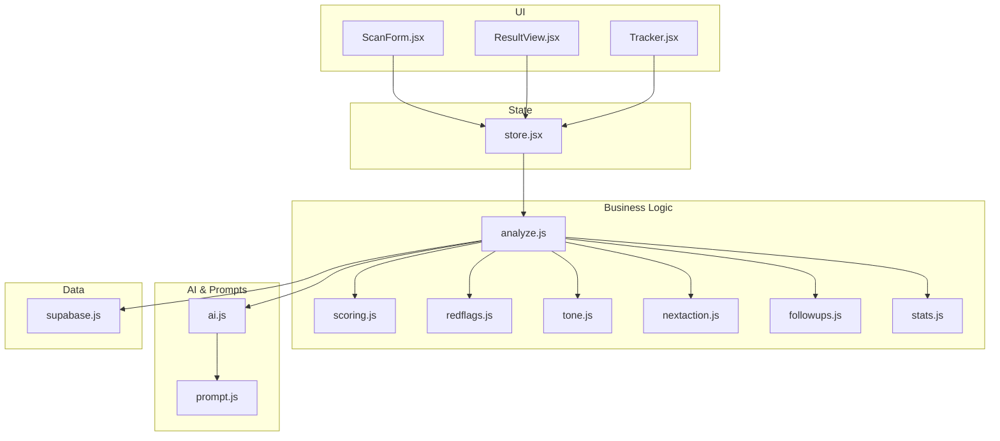
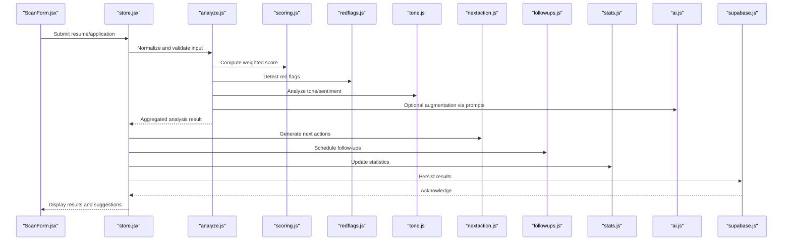
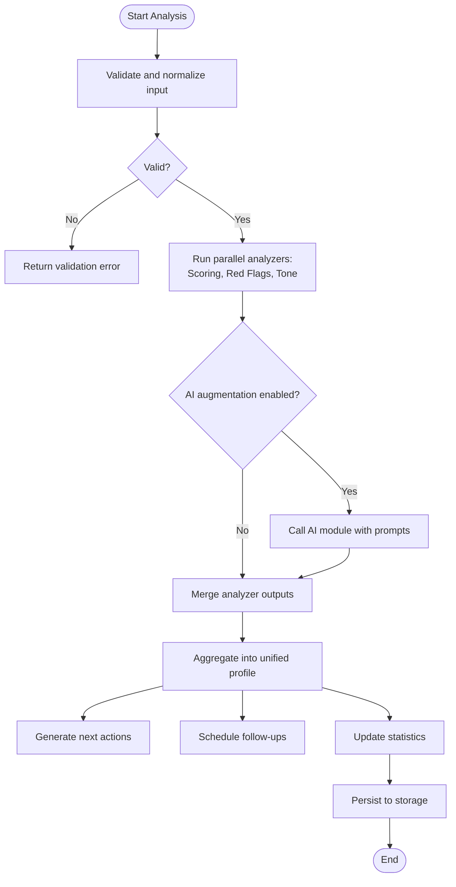
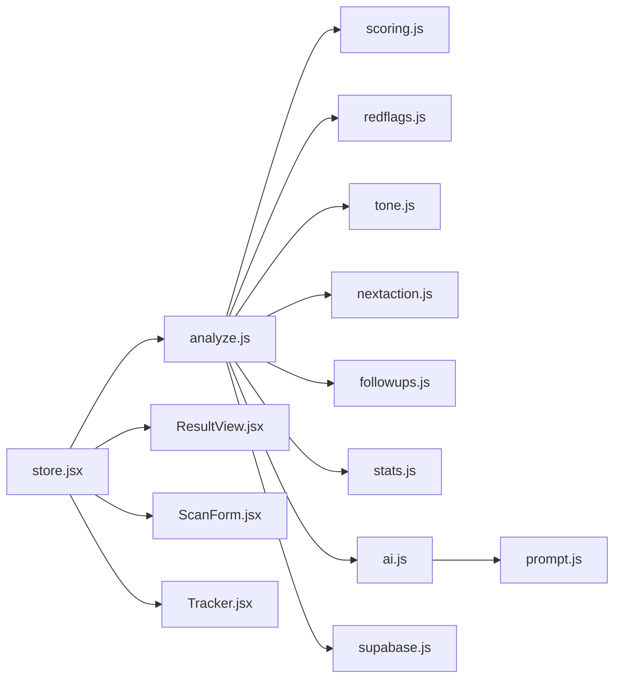

# Business Logic Layer

<cite>
**Referenced Files in This Document**
- [analyze.js](file://src/lib/analyze.js)
- [scoring.js](file://src/lib/scoring.js)
- [redflags.js](file://src/lib/redflags.js)
- [tone.js](file://src/lib/tone.js)
- [nextaction.js](file://src/lib/nextaction.js)
- [followups.js](file://src/lib/followups.js)
- [stats.js](file://src/lib/stats.js)
- [ai.js](file://src/lib/ai.js)
- [prompt.js](file://src/lib/prompt.js)
- [supabase.js](file://src/lib/supabase.js)
- [store.jsx](file://src/store.jsx)
- [ScanForm.jsx](file://src/components/ScanForm.jsx)
- [ResultView.jsx](file://src/components/ResultView.jsx)
- [Tracker.jsx](file://src/components/Tracker.jsx)
</cite>

## Table of Contents
1. [Introduction](#introduction)
2. [Project Structure](#project-structure)
3. [Core Components](#core-components)
4. [Architecture Overview](#architecture-overview)
5. [Detailed Component Analysis](#detailed-component-analysis)
6. [Dependency Analysis](#dependency-analysis)
7. [Performance Considerations](#performance-considerations)
8. [Troubleshooting Guide](#troubleshooting-guide)
9. [Conclusion](#conclusion)
10. [Appendices](#appendices)

## Introduction
This document explains the business logic layer of ApplyGuard PH, focusing on the analysis engine for resume scanning, scoring algorithms for job applications, follow-up automation, and statistics calculation. It also documents the red flag detection system, tone analysis algorithms, and next action suggestion engine. The goal is to provide a clear understanding of the decision trees, mathematical formulas, and configuration parameters that drive these features, enabling customization for different use cases.

## Project Structure
The business logic resides primarily under src/lib with supporting UI components and state management:
- Analysis pipeline: analyze.js orchestrates parsing, feature extraction, and aggregation.
- Scoring: scoring.js computes composite scores from weighted criteria.
- Red flags: redflags.js identifies risk signals and policy violations.
- Tone: tone.js evaluates communication tone and sentiment.
- Next actions: nextaction.js suggests actionable steps based on analysis outcomes.
- Follow-ups: followups.js automates reminders and scheduling rules.
- Statistics: stats.js aggregates metrics across applications and campaigns.
- AI integration: ai.js and prompt.js manage prompts and external model calls.
- Data persistence: supabase.js provides storage and sync utilities.
- State and UI: store.jsx manages application state; ScanForm.jsx, ResultView.jsx, Tracker.jsx implement user workflows.

**Diagram sources**
- [ScanForm.jsx](file://src/components/ScanForm.jsx)
- [ResultView.jsx](file://src/components/ResultView.jsx)
- [Tracker.jsx](file://src/components/Tracker.jsx)
- [store.jsx](file://src/store.jsx)
- [analyze.js](file://src/lib/analyze.js)
- [scoring.js](file://src/lib/scoring.js)
- [redflags.js](file://src/lib/redflags.js)
- [tone.js](file://src/lib/tone.js)
- [nextaction.js](file://src/lib/nextaction.js)
- [followups.js](file://src/lib/followups.js)
- [stats.js](file://src/lib/stats.js)
- [ai.js](file://src/lib/ai.js)
- [prompt.js](file://src/lib/prompt.js)
- [supabase.js](file://src/lib/supabase.js)

**Section sources**
- [analyze.js](file://src/lib/analyze.js)
- [scoring.js](file://src/lib/scoring.js)
- [redflags.js](file://src/lib/redflags.js)
- [tone.js](file://src/lib/tone.js)
- [nextaction.js](file://src/lib/nextaction.js)
- [followups.js](file://src/lib/followups.js)
- [stats.js](file://src/lib/stats.js)
- [ai.js](file://src/lib/ai.js)
- [prompt.js](file://src/lib/prompt.js)
- [supabase.js](file://src/lib/supabase.js)
- [store.jsx](file://src/store.jsx)
- [ScanForm.jsx](file://src/components/ScanForm.jsx)
- [ResultView.jsx](file://src/components/ResultView.jsx)
- [Tracker.jsx](file://src/components/Tracker.jsx)

## Core Components
- Analysis Engine (analyze.js): Orchestrates input normalization, feature extraction, and pipeline execution. It coordinates scoring, red flag detection, tone analysis, next action generation, and follow-up scheduling.
- Scoring Engine (scoring.js): Computes weighted scores across multiple dimensions such as experience relevance, skill match, education alignment, and formatting quality. Supports configurable weights and thresholds.
- Red Flag Detection (redflags.js): Identifies high-risk indicators like gaps, inconsistencies, or policy violations using rule-based checks and heuristics.
- Tone Analyzer (tone.js): Evaluates tone and sentiment of cover letters or messages, providing qualitative insights and numeric indicators.
- Next Action Suggestion (nextaction.js): Generates prioritized recommendations based on analysis results, red flags, and scoring outcomes.
- Follow-up Automation (followups.js): Manages reminder schedules, status transitions, and automated nudges based on application lifecycle events.
- Statistics Aggregation (stats.js): Calculates KPIs such as conversion rates, average scores, time-to-response, and campaign performance.

**Section sources**
- [analyze.js](file://src/lib/analyze.js)
- [scoring.js](file://src/lib/scoring.js)
- [redflags.js](file://src/lib/redflags.js)
- [tone.js](file://src/lib/tone.js)
- [nextaction.js](file://src/lib/nextaction.js)
- [followups.js](file://src/lib/followups.js)
- [stats.js](file://src/lib/stats.js)

## Architecture Overview
The business logic follows a modular pipeline architecture:
- Input normalization and validation occur first.
- Feature extraction feeds into parallel analyzers (scoring, red flags, tone).
- Results are aggregated by the analysis engine to produce a unified profile.
- Next actions and follow-ups are derived from the aggregated profile.
- Statistics are updated incrementally as new data arrives.
- AI modules can augment analysis via prompts and external models.

**Diagram sources**
- [ScanForm.jsx](file://src/components/ScanForm.jsx)
- [store.jsx](file://src/store.jsx)
- [analyze.js](file://src/lib/analyze.js)
- [scoring.js](file://src/lib/scoring.js)
- [redflags.js](file://src/lib/redflags.js)
- [tone.js](file://src/lib/tone.js)
- [nextaction.js](file://src/lib/nextaction.js)
- [followups.js](file://src/lib/followups.js)
- [stats.js](file://src/lib/stats.js)
- [ai.js](file://src/lib/ai.js)
- [supabase.js](file://src/lib/supabase.js)

## Detailed Component Analysis

### Analysis Engine (analyze.js)
Responsibilities:
- Input normalization and schema validation.
- Orchestration of scoring, red flag detection, tone analysis, and optional AI augmentation.
- Aggregation of results into a unified analysis object.
- Triggering downstream processes (next actions, follow-ups, statistics).

Key behaviors:
- Validates required fields and formats inputs consistently.
- Calls scoring, red flags, and tone analyzers concurrently where possible.
- Integrates AI outputs when enabled, merging them with rule-based results.
- Emits structured results consumed by UI and persistence layers.

**Diagram sources**
- [analyze.js](file://src/lib/analyze.js)
- [scoring.js](file://src/lib/scoring.js)
- [redflags.js](file://src/lib/redflags.js)
- [tone.js](file://src/lib/tone.js)
- [nextaction.js](file://src/lib/nextaction.js)
- [followups.js](file://src/lib/followups.js)
- [stats.js](file://src/lib/stats.js)
- [ai.js](file://src/lib/ai.js)

**Section sources**
- [analyze.js](file://src/lib/analyze.js)

### Scoring Engine (scoring.js)
Responsibilities:
- Compute composite scores from multiple weighted criteria.
- Support configurable weights, thresholds, and normalization strategies.

Mathematical model:
- Composite score S = Σ(w_i * s_i), where w_i are normalized weights (Σw_i = 1) and s_i are normalized sub-scores per criterion.
- Normalization may use min-max scaling or percentile ranking depending on data distribution.
- Thresholds determine categories (e.g., low, medium, high) and trigger downstream actions.

Decision tree:
- If S >= high_threshold → “Strong candidate”
- Else if S >= medium_threshold → “Moderate candidate”
- Else → “Needs improvement”

Configuration parameters:
- Weights per criterion (experience, skills, education, formatting).
- Threshold boundaries for categories.
- Normalization method selection.
- Penalty/bonus multipliers for specific signals.

**Section sources**
- [scoring.js](file://src/lib/scoring.js)

### Red Flag Detection (redflags.js)
Responsibilities:
- Identify risk indicators through rule-based checks and heuristics.
- Categorize flags by severity and domain (employment history, education, content consistency).

Rule examples:
- Employment gap > threshold → “Gap detected”
- Repeated job titles without progression → “Stagnation signal”
- Inconsistent dates or missing sections → “Inconsistency”

Severity scoring:
- Each flag has a severity weight; aggregate severity influences overall risk level.
- Risk levels guide next actions and follow-up urgency.

Decision flow:
- For each rule, evaluate conditions against normalized features.
- Accumulate flagged items with severity and context.
- Produce a summary risk score and detailed flag list.

**Section sources**
- [redflags.js](file://src/lib/redflags.js)

### Tone Analyzer (tone.js)
Responsibilities:
- Evaluate tone and sentiment of textual inputs (cover letters, messages).
- Provide qualitative labels (positive, neutral, negative) and numeric indicators.

Algorithm outline:
- Tokenize text and extract sentiment-bearing phrases.
- Apply lexicon-based scoring or lightweight ML model to compute sentiment score.
- Map score to tone categories and highlight key phrases.

Output:
- Numeric sentiment score within a defined range.
- Categorized tone label.
- Highlighted excerpts contributing to the assessment.

**Section sources**
- [tone.js](file://src/lib/tone.js)

### Next Action Suggestion (nextaction.js)
Responsibilities:
- Generate prioritized recommendations based on analysis results.
- Combine scoring outcomes, red flags, and tone insights to propose concrete steps.

Recommendation logic:
- If low score and specific weak criteria → suggest targeted improvements.
- If red flags present → propose remediation steps and verification.
- If positive tone but low score → emphasize content structure and keyword alignment.

Prioritization:
- Rank actions by impact and effort, considering urgency from red flags.
- Provide templates or links to resources where applicable.

**Section sources**
- [nextaction.js](file://src/lib/nextaction.js)

### Follow-up Automation (followups.js)
Responsibilities:
- Manage reminder schedules and status transitions.
- Automate nudges based on application lifecycle events.

Rules:
- After submission → schedule initial check-in.
- If no response after X days → send follow-up message.
- On status change (e.g., interview scheduled) → update timeline and next steps.

Scheduling:
- Use event-driven triggers and configurable intervals.
- Maintain audit trail of sent messages and responses.

**Section sources**
- [followups.js](file://src/lib/followups.js)

### Statistics Aggregation (stats.js)
Responsibilities:
- Calculate KPIs across applications and campaigns.
- Track conversion rates, average scores, time-to-response, and success metrics.

Metrics:
- Conversion rate = successful outcomes / total applications.
- Average score per category and overall.
- Time-to-response distributions and median values.
- Campaign-level performance comparisons.

Aggregation strategy:
- Incremental updates on new data.
- Rolling windows for trend analysis.
- Exportable summaries for reporting.

**Section sources**
- [stats.js](file://src/lib/stats.js)

### AI Integration (ai.js, prompt.js)
Responsibilities:
- Manage prompts and external model calls to augment analysis.
- Integrate AI outputs with rule-based results.

Workflow:
- Construct prompts based on current analysis context.
- Call AI service and parse responses.
- Merge AI insights into the unified profile, preserving confidence scores.

Configuration:
- Prompt templates and variables.
- Model selection and fallback behavior.
- Rate limiting and error handling.

**Section sources**
- [ai.js](file://src/lib/ai.js)
- [prompt.js](file://src/lib/prompt.js)

### Data Persistence (supabase.js)
Responsibilities:
- Provide storage and synchronization utilities.
- Persist analysis results, follow-up logs, and statistics.

Operations:
- Upsert records for applications and analysis profiles.
- Sync local state with remote storage.
- Handle conflicts and retries.

**Section sources**
- [supabase.js](file://src/lib/supabase.js)

### UI and State Management (store.jsx, ScanForm.jsx, ResultView.jsx, Tracker.jsx)
Responsibilities:
- Manage application state and user interactions.
- Present analysis results, suggestions, and tracking information.

Flow:
- ScanForm collects input and submits to store.
- Store invokes analysis engine and updates state.
- ResultView displays scores, flags, tone, and next actions.
- Tracker monitors follow-ups and status changes.

**Section sources**
- [store.jsx](file://src/store.jsx)
- [ScanForm.jsx](file://src/components/ScanForm.jsx)
- [ResultView.jsx](file://src/components/ResultView.jsx)
- [Tracker.jsx](file://src/components/Tracker.jsx)

## Dependency Analysis
The business logic modules have clear dependencies:
- analyze.js depends on scoring, redflags, tone, nextaction, followups, stats, ai, and supabase.
- UI components depend on store.jsx for state and side effects.
- AI modules depend on prompt templates and external services.

**Diagram sources**
- [analyze.js](file://src/lib/analyze.js)
- [scoring.js](file://src/lib/scoring.js)
- [redflags.js](file://src/lib/redflags.js)
- [tone.js](file://src/lib/tone.js)
- [nextaction.js](file://src/lib/nextaction.js)
- [followups.js](file://src/lib/followups.js)
- [stats.js](file://src/lib/stats.js)
- [ai.js](file://src/lib/ai.js)
- [prompt.js](file://src/lib/prompt.js)
- [supabase.js](file://src/lib/supabase.js)
- [store.jsx](file://src/store.jsx)
- [ResultView.jsx](file://src/components/ResultView.jsx)
- [ScanForm.jsx](file://src/components/ScanForm.jsx)
- [Tracker.jsx](file://src/components/Tracker.jsx)

**Section sources**
- [analyze.js](file://src/lib/analyze.js)
- [store.jsx](file://src/store.jsx)

## Performance Considerations
- Parallel execution: Run independent analyzers concurrently to reduce latency.
- Incremental updates: Update statistics and persisted records only when necessary.
- Caching: Cache repeated AI prompts and results where appropriate.
- Batching: Batch database writes to minimize network overhead.
- Memory management: Avoid large intermediate objects; stream processing where feasible.

[No sources needed since this section provides general guidance]

## Troubleshooting Guide
Common issues and resolutions:
- Validation errors: Ensure input schemas match expected formats; review normalize functions.
- Scoring anomalies: Check weight configurations and normalization methods; verify thresholds.
- Red flag false positives: Adjust rule thresholds and add exceptions for known patterns.
- Tone misclassification: Review lexicon or model inputs; refine prompt templates.
- AI failures: Implement fallbacks and retry logic; monitor rate limits and error codes.
- Persistence conflicts: Resolve upsert conflicts and ensure consistent IDs.

**Section sources**
- [analyze.js](file://src/lib/analyze.js)
- [scoring.js](file://src/lib/scoring.js)
- [redflags.js](file://src/lib/redflags.js)
- [tone.js](file://src/lib/tone.js)
- [ai.js](file://src/lib/ai.js)
- [supabase.js](file://src/lib/supabase.js)

## Conclusion
The business logic layer of ApplyGuard PH provides a robust, modular pipeline for resume analysis, scoring, red flag detection, tone evaluation, next action suggestions, follow-up automation, and statistics aggregation. With configurable parameters and clear decision flows, it supports customization for diverse use cases while maintaining performance and reliability.

[No sources needed since this section summarizes without analyzing specific files]

## Appendices
- Configuration reference: Weights, thresholds, and normalization options for scoring.
- Rule catalog: Red flag definitions and severity mappings.
- Prompt library: Templates used by AI augmentation.
- API contracts: Interfaces between modules and external services.

[No sources needed since this section provides general guidance]