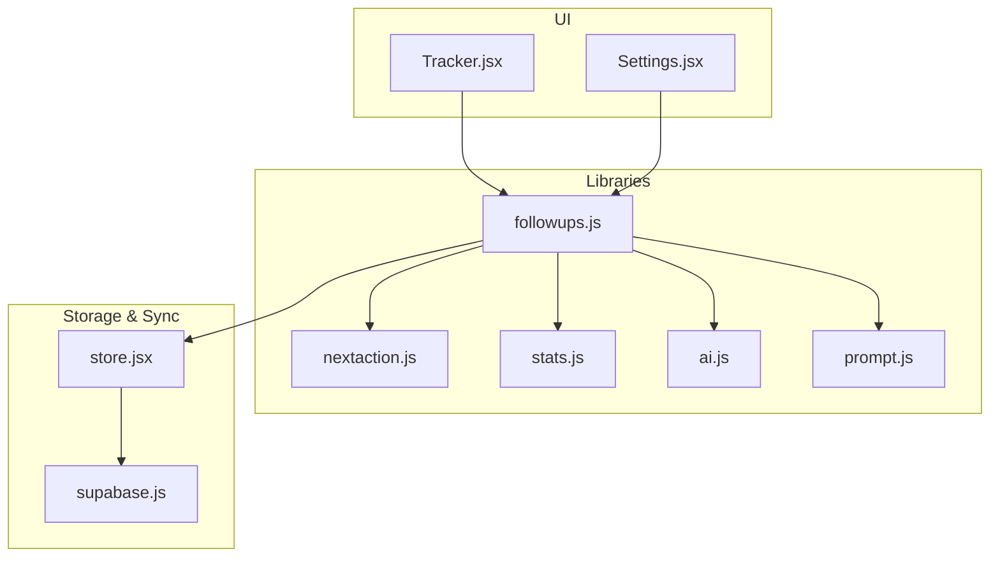
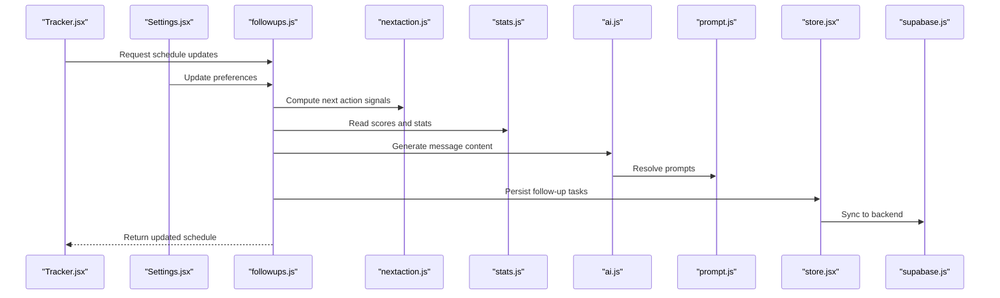
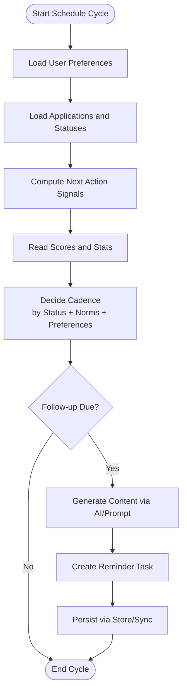
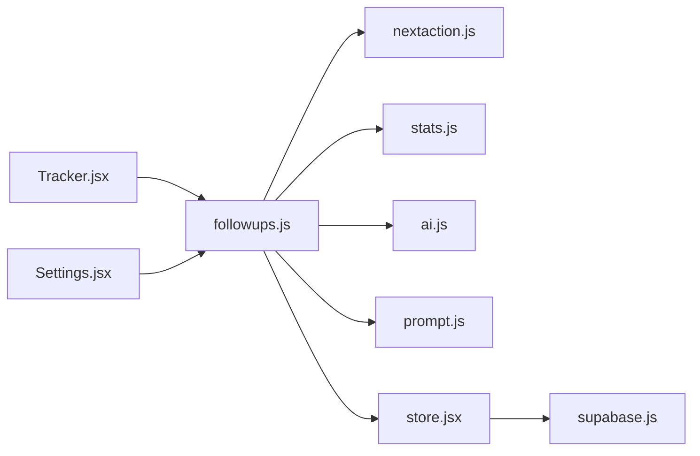
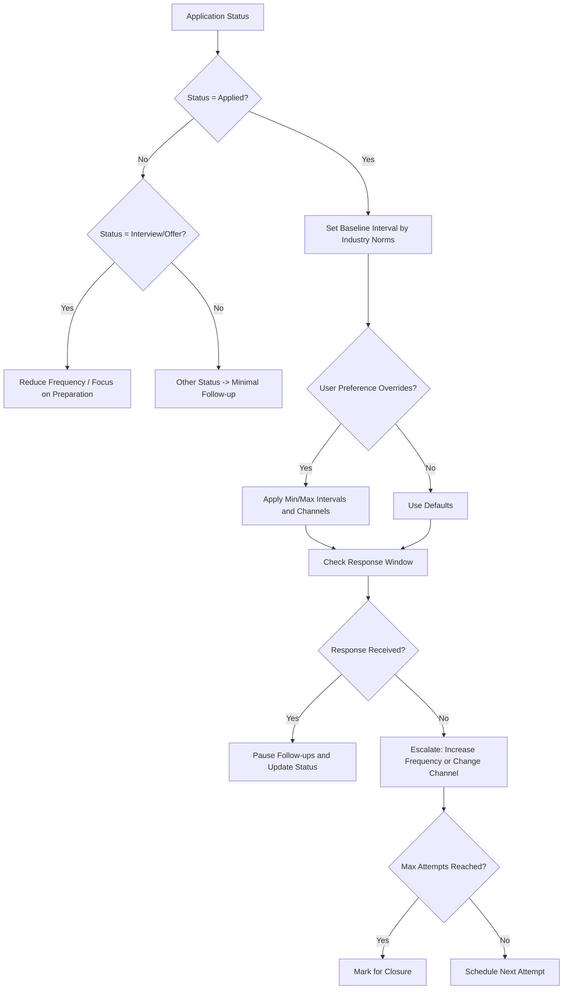

# Follow-up Management System

<cite>
**Referenced Files in This Document**
- [followups.js](file://src/lib/followups.js)
- [followups.test.js](file://src/lib/followups.test.js)
- [Tracker.jsx](file://src/components/Tracker.jsx)
- [Settings.jsx](file://src/components/Settings.jsx)
- [store.jsx](file://src/store.jsx)
- [supabase.js](file://src/lib/supabase.js)
- [nextaction.js](file://src/lib/nextaction.js)
- [stats.js](file://src/lib/stats.js)
- [ai.js](file://src/lib/ai.js)
- [prompt.js](file://src/lib/prompt.js)
</cite>

## Table of Contents
1. [Introduction](#introduction)
2. [Project Structure](#project-structure)
3. [Core Components](#core-components)
4. [Architecture Overview](#architecture-overview)
5. [Detailed Component Analysis](#detailed-component-analysis)
6. [Dependency Analysis](#dependency-analysis)
7. [Performance Considerations](#performance-considerations)
8. [Troubleshooting Guide](#troubleshooting-guide)
9. [Conclusion](#conclusion)
10. [Appendices](#appendices)

## Introduction
This document explains the follow-up automation system in ApplyGuard PH. It focuses on how the application schedules intelligent follow-ups, manages email templates and reminders, and orchestrates automated notifications based on application status, industry norms, and user preferences. It also covers decision trees for different scenarios, escalation rules, user interaction patterns, and integrations with calendar systems, email services, and notification channels. Examples of workflows and customization options are provided to help users tailor follow-up strategies to their job search approach.

## Project Structure
The follow-up system is implemented primarily in client-side JavaScript modules and React components:
- Scheduling logic and algorithms reside in a dedicated library module.
- UI components expose configuration and visualization of follow-ups.
- State management centralizes data access and persistence.
- Integrations leverage Supabase for storage and optional cloud functions.

**Diagram sources**
- [Tracker.jsx](file://src/components/Tracker.jsx)
- [Settings.jsx](file://src/components/Settings.jsx)
- [followups.js](file://src/lib/followups.js)
- [nextaction.js](file://src/lib/nextaction.js)
- [stats.js](file://src/lib/stats.js)
- [ai.js](file://src/lib/ai.js)
- [prompt.js](file://src/lib/prompt.js)
- [store.jsx](file://src/store.jsx)
- [supabase.js](file://src/lib/supabase.js)

**Section sources**
- [followups.js](file://src/lib/followups.js)
- [Tracker.jsx](file://src/components/Tracker.jsx)
- [Settings.jsx](file://src/components/Settings.jsx)
- [store.jsx](file://src/store.jsx)
- [supabase.js](file://src/lib/supabase.js)
- [nextaction.js](file://src/lib/nextaction.js)
- [stats.js](file://src/lib/stats.js)
- [ai.js](file://src/lib/ai.js)
- [prompt.js](file://src/lib/prompt.js)

## Core Components
- Intelligent scheduling engine: Computes optimal follow-up timing using application status, industry norms, and user preferences. It integrates scoring and next-action heuristics to determine when and how often to remind users.
- Email template system: Provides templating utilities and prompt-based generation to create personalized follow-up messages aligned with tone and context.
- Reminder triggers and notifications: Orchestrates periodic checks, evaluates due follow-ups, and dispatches reminders via available channels (in-app, email, calendar).
- Decision trees and escalation rules: Encodes scenario-specific logic for first contact, second touch, escalation, and closure paths.
- User interaction patterns: Exposes settings to customize cadence, preferred channels, and strategy presets.

Key responsibilities by file:
- Scheduling and decision logic: [followups.js](file://src/lib/followups.js), [nextaction.js](file://src/lib/nextaction.js)
- Scoring and statistics: [stats.js](file://src/lib/stats.js)
- Template and prompt generation: [ai.js](file://src/lib/ai.js), [prompt.js](file://src/lib/prompt.js)
- UI configuration and display: [Tracker.jsx](file://src/components/Tracker.jsx), [Settings.jsx](file://src/components/Settings.jsx)
- Data persistence and sync: [store.jsx](file://src/store.jsx), [supabase.js](file://src/lib/supabase.js)

**Section sources**
- [followups.js](file://src/lib/followups.js)
- [followups.test.js](file://src/lib/followups.test.js)
- [nextaction.js](file://src/lib/nextaction.js)
- [stats.js](file://src/lib/stats.js)
- [ai.js](file://src/lib/ai.js)
- [prompt.js](file://src/lib/prompt.js)
- [Tracker.jsx](file://src/components/Tracker.jsx)
- [Settings.jsx](file://src/components/Settings.jsx)
- [store.jsx](file://src/store.jsx)
- [supabase.js](file://src/lib/supabase.js)

## Architecture Overview
The follow-up system follows a modular architecture:
- The UI layer reads/writes user preferences and displays scheduled follow-ups.
- The scheduling engine consumes application state, scoring, and next-action signals to compute due dates and actions.
- Templates and prompts generate content for emails and notifications.
- Storage and sync persist follow-up records and settings.

**Diagram sources**
- [Tracker.jsx](file://src/components/Tracker.jsx)
- [Settings.jsx](file://src/components/Settings.jsx)
- [followups.js](file://src/lib/followups.js)
- [nextaction.js](file://src/lib/nextaction.js)
- [stats.js](file://src/lib/stats.js)
- [ai.js](file://src/lib/ai.js)
- [prompt.js](file://src/lib/prompt.js)
- [store.jsx](file://src/store.jsx)
- [supabase.js](file://src/lib/supabase.js)

## Detailed Component Analysis

### Scheduling Engine (followups.js)
Responsibilities:
- Determine optimal follow-up intervals based on application status, industry norms, and user preferences.
- Integrate next-action signals and scoring metrics to adjust cadence.
- Manage reminder triggers and escalation thresholds.
- Coordinate with template generation for message content.

Key behaviors:
- Status-driven cadence: Different statuses (e.g., applied, interview, offer) influence recommended intervals.
- Industry normalization: Adjusts baseline intervals according to sector characteristics.
- Preference overrides: Allows users to set minimum/maximum intervals and preferred channels.
- Escalation rules: Increases frequency or changes channel after non-response windows.

**Diagram sources**
- [followups.js](file://src/lib/followups.js)
- [nextaction.js](file://src/lib/nextaction.js)
- [stats.js](file://src/lib/stats.js)
- [ai.js](file://src/lib/ai.js)
- [prompt.js](file://src/lib/prompt.js)
- [store.jsx](file://src/store.jsx)
- [supabase.js](file://src/lib/supabase.js)

**Section sources**
- [followups.js](file://src/lib/followups.js)
- [followups.test.js](file://src/lib/followups.test.js)
- [nextaction.js](file://src/lib/nextaction.js)
- [stats.js](file://src/lib/stats.js)
- [ai.js](file://src/lib/ai.js)
- [prompt.js](file://src/lib/prompt.js)
- [store.jsx](file://src/store.jsx)
- [supabase.js](file://src/lib/supabase.js)

### Next Action Heuristics (nextaction.js)
Responsibilities:
- Provide signals that inform scheduling decisions (e.g., urgency, likelihood of response).
- Encode domain knowledge about typical hiring timelines and best practices.

Integration points:
- Consumed by the scheduling engine to refine cadence and escalation thresholds.

**Section sources**
- [nextaction.js](file://src/lib/nextaction.js)
- [followups.js](file://src/lib/followups.js)

### Scoring and Statistics (stats.js)
Responsibilities:
- Maintain application-level metrics used to personalize follow-up timing.
- Track historical response rates and conversion signals.

Integration points:
- Used by the scheduling engine to adapt intervals based on observed performance.

**Section sources**
- [stats.js](file://src/lib/stats.js)
- [followups.js](file://src/lib/followups.js)

### Template and Prompt Generation (ai.js, prompt.js)
Responsibilities:
- Generate personalized follow-up messages using AI capabilities.
- Resolve prompts to ensure consistent tone and structure.

Integration points:
- Called by the scheduling engine when creating new follow-up tasks.

**Section sources**
- [ai.js](file://src/lib/ai.js)
- [prompt.js](file://src/lib/prompt.js)
- [followups.js](file://src/lib/followups.js)

### UI Configuration and Display (Tracker.jsx, Settings.jsx)
Responsibilities:
- Display current follow-up schedule and allow manual adjustments.
- Capture user preferences such as cadence limits, preferred channels, and strategy presets.

Integration points:
- Reads from and writes to the store; triggers re-scheduling when preferences change.

**Section sources**
- [Tracker.jsx](file://src/components/Tracker.jsx)
- [Settings.jsx](file://src/components/Settings.jsx)
- [store.jsx](file://src/store.jsx)
- [followups.js](file://src/lib/followups.js)

### Data Persistence and Sync (store.jsx, supabase.js)
Responsibilities:
- Centralize state for applications, follow-ups, and preferences.
- Sync local state with Supabase for cross-device consistency.

Integration points:
- Used by the scheduling engine to persist generated tasks and read latest preferences.

**Section sources**
- [store.jsx](file://src/store.jsx)
- [supabase.js](file://src/lib/supabase.js)
- [followups.js](file://src/lib/followups.js)

## Dependency Analysis
The following diagram shows key dependencies among modules involved in follow-up automation:

**Diagram sources**
- [followups.js](file://src/lib/followups.js)
- [nextaction.js](file://src/lib/nextaction.js)
- [stats.js](file://src/lib/stats.js)
- [ai.js](file://src/lib/ai.js)
- [prompt.js](file://src/lib/prompt.js)
- [store.jsx](file://src/store.jsx)
- [supabase.js](file://src/lib/supabase.js)
- [Tracker.jsx](file://src/components/Tracker.jsx)
- [Settings.jsx](file://src/components/Settings.jsx)

**Section sources**
- [followups.js](file://src/lib/followups.js)
- [Tracker.jsx](file://src/components/Tracker.jsx)
- [Settings.jsx](file://src/components/Settings.jsx)
- [store.jsx](file://src/store.jsx)
- [supabase.js](file://src/lib/supabase.js)

## Performance Considerations
- Batch processing: Group follow-up computations to minimize repeated reads/writes.
- Lazy evaluation: Defer heavy operations like AI-generated content until needed.
- Caching: Cache industry norms and preference lookups to reduce recomputation.
- Throttling: Limit scheduling cycles to avoid excessive background work.
- Incremental updates: Only recompute affected applications when preferences change.

[No sources needed since this section provides general guidance]

## Troubleshooting Guide
Common issues and resolutions:
- Missing preferences: Ensure user preferences are initialized before scheduling runs.
- Stale data: Verify store synchronization with Supabase to prevent outdated follow-ups.
- Template errors: Validate prompt resolution and AI integration inputs.
- Duplicate tasks: Implement idempotency keys when persisting follow-up tasks.
- Channel failures: Log and fallback gracefully when email/calendar channels are unavailable.

**Section sources**
- [followups.js](file://src/lib/followups.js)
- [store.jsx](file://src/store.jsx)
- [supabase.js](file://src/lib/supabase.js)
- [ai.js](file://src/lib/ai.js)
- [prompt.js](file://src/lib/prompt.js)

## Conclusion
The follow-up automation system combines intelligent scheduling, templated messaging, and robust persistence to keep job seekers proactive and organized. By leveraging application status, industry norms, and user preferences, it delivers timely reminders and escalations while maintaining flexibility for diverse job search strategies.

[No sources needed since this section summarizes without analyzing specific files]

## Appendices

### Decision Trees for Follow-up Scenarios
- First contact: Initial interval based on industry norms and user preference; escalate if no response within threshold.
- Second touch: Shorter interval with adjusted tone; consider alternative channel if primary fails.
- Final attempt: Maximum frequency cap; mark for closure if still no response.
- Positive response: Pause follow-ups and update status accordingly.

[No sources needed since this diagram shows conceptual workflow, not actual code structure]

### Integration Points
- Calendar systems: Create events for upcoming follow-ups using platform APIs.
- Email services: Send templated messages through configured providers.
- Notification channels: In-app alerts, push notifications, or SMS depending on user preferences.

[No sources needed since this section provides general guidance]

### Customization Options for Job Search Strategies
- Aggressive strategy: Short intervals, frequent touches, multiple channels.
- Balanced strategy: Moderate intervals, primary channel focus, standard escalation.
- Conservative strategy: Longer intervals, minimal touches, low noise.

[No sources needed since this section provides general guidance]