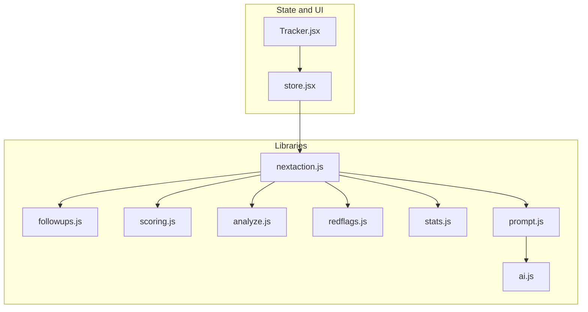
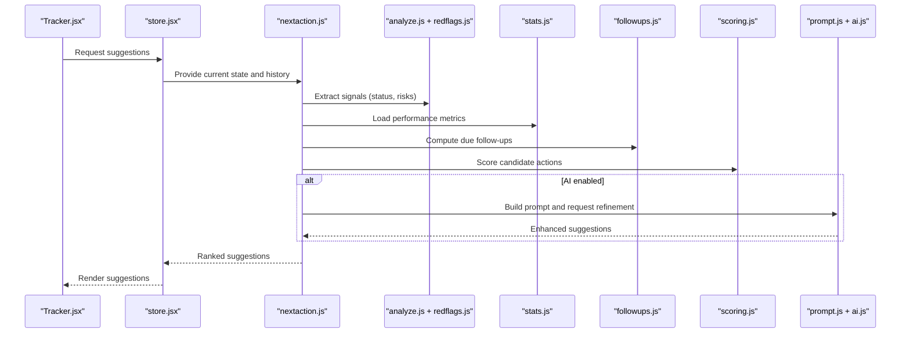
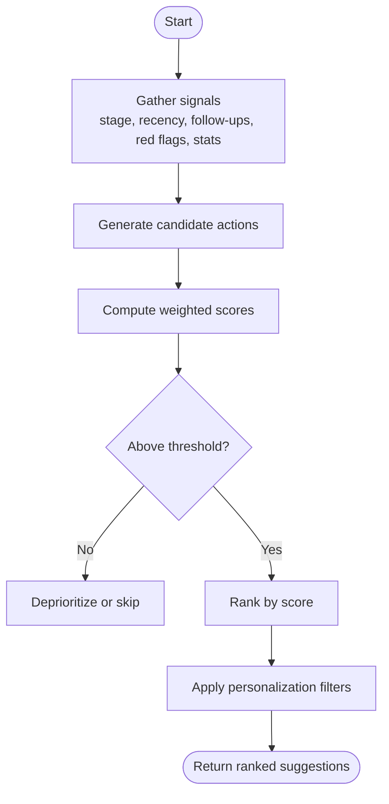
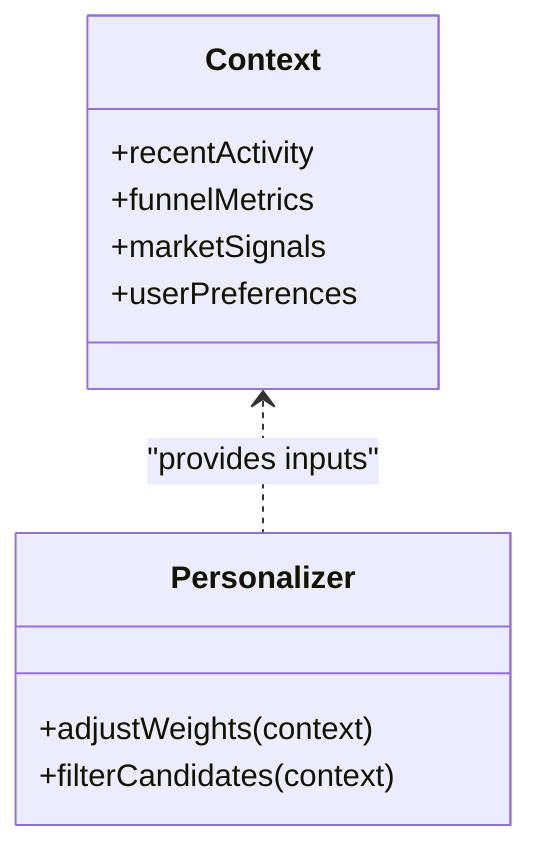
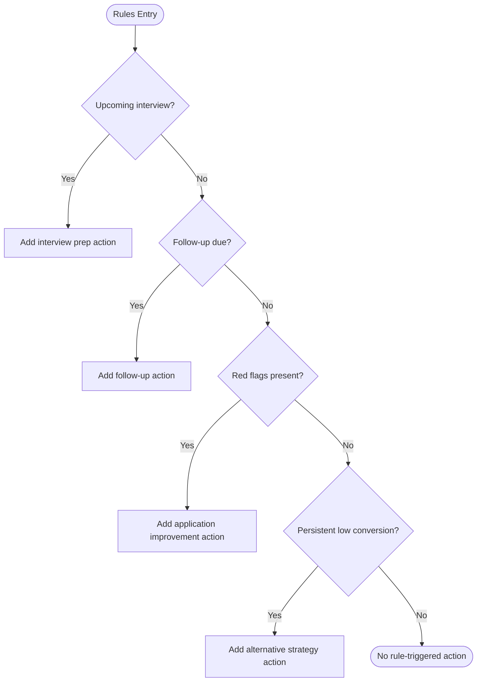
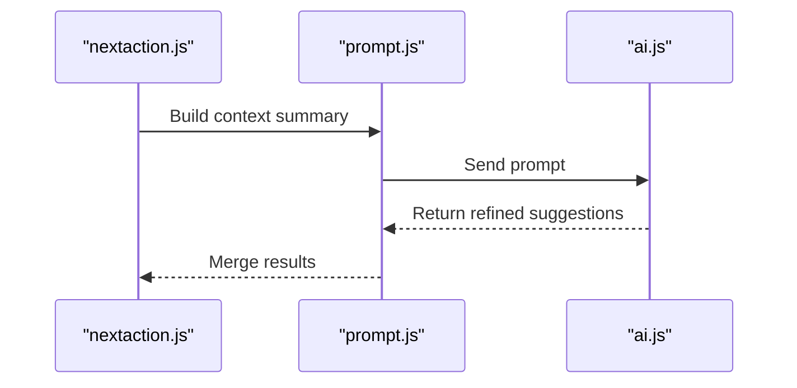
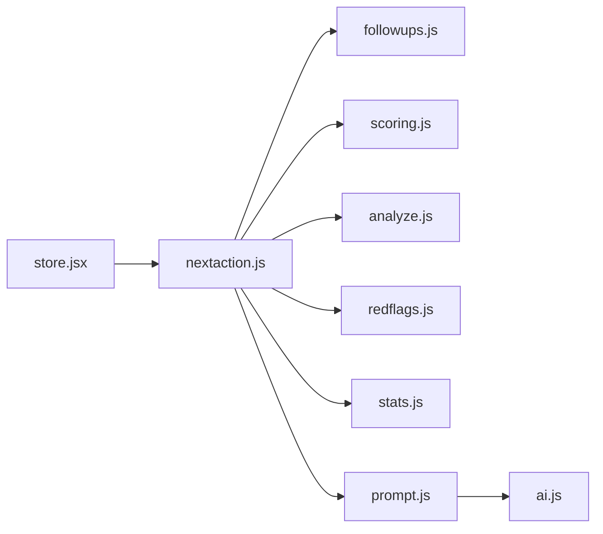

# Next Action Suggestion Engine

<cite>
**Referenced Files in This Document**
- [nextaction.js](file://src/lib/nextaction.js)
- [followups.js](file://src/lib/followups.js)
- [scoring.js](file://src/lib/scoring.js)
- [analyze.js](file://src/lib/analyze.js)
- [redflags.js](file://src/lib/redflags.js)
- [stats.js](file://src/lib/stats.js)
- [prompt.js](file://src/lib/prompt.js)
- [ai.js](file://src/lib/ai.js)
- [store.jsx](file://src/store.jsx)
- [Tracker.jsx](file://src/components/Tracker.jsx)
</cite>

## Table of Contents
1. [Introduction](#introduction)
2. [Project Structure](#project-structure)
3. [Core Components](#core-components)
4. [Architecture Overview](#architecture-overview)
5. [Detailed Component Analysis](#detailed-component-analysis)
6. [Dependency Analysis](#dependency-analysis)
7. [Performance Considerations](#performance-considerations)
8. [Troubleshooting Guide](#troubleshooting-guide)
9. [Conclusion](#conclusion)
10. [Appendices](#appendices)

## Introduction
This document explains the Next Action Suggestion Engine in ApplyGuard PH. It focuses on how the system analyzes application status, market conditions, and user behavior to recommend optimal next steps such as interview preparation, follow-up actions, application improvements, and alternative strategies. The engine combines rule-based logic with optional AI assistance, prioritizes actions using a scoring system, and personalizes recommendations based on user preferences and historical patterns.

## Project Structure
The suggestion engine is implemented primarily in client-side libraries under src/lib and integrates with UI components and global state:

- Recommendation algorithms and decision logic: nextaction.js, followups.js, scoring.js, analyze.js, redflags.js, stats.js
- Prompting and optional AI-assisted suggestions: prompt.js, ai.js
- State integration and UI rendering: store.jsx, Tracker.jsx

**Diagram sources**
- [nextaction.js](file://src/lib/nextaction.js)
- [followups.js](file://src/lib/followups.js)
- [scoring.js](file://src/lib/scoring.js)
- [analyze.js](file://src/lib/analyze.js)
- [redflags.js](file://src/lib/redflags.js)
- [stats.js](file://src/lib/stats.js)
- [prompt.js](file://src/lib/prompt.js)
- [ai.js](file://src/lib/ai.js)
- [store.jsx](file://src/store.jsx)
- [Tracker.jsx](file://src/components/Tracker.jsx)

**Section sources**
- [nextaction.js](file://src/lib/nextaction.js)
- [followups.js](file://src/lib/followups.js)
- [scoring.js](file://src/lib/scoring.js)
- [analyze.js](file://src/lib/analyze.js)
- [redflags.js](file://src/lib/redflags.js)
- [stats.js](file://src/lib/stats.js)
- [prompt.js](file://src/lib/prompt.js)
- [ai.js](file://src/lib/ai.js)
- [store.jsx](file://src/store.jsx)
- [Tracker.jsx](file://src/components/Tracker.jsx)

## Core Components
- Decision matrix and priority scoring: The engine evaluates multiple signals (application stage, recency, success rates, red flags, and performance metrics) to compute a composite score for candidate actions.
- Contextual awareness: Uses recent activity, conversion funnels, and failure points to tailor suggestions.
- Personalization: Adapts to user preferences, past responses, and chosen focus areas.
- Optional AI assistance: Augments rule-based outputs with contextual prompts and summaries when enabled.

Key responsibilities by module:
- nextaction.js: Orchestrates recommendation generation, merges signals, applies rules, and returns ranked suggestions.
- followups.js: Determines timely follow-ups based on application lifecycle and response windows.
- scoring.js: Computes action scores from weighted features and thresholds.
- analyze.js: Extracts insights from application data and funnel metrics.
- redflags.js: Identifies risk indicators that influence urgency and strategy shifts.
- stats.js: Aggregates performance statistics used for personalization and calibration.
- prompt.js and ai.js: Build prompts and optionally call AI services to refine or expand suggestions.

**Section sources**
- [nextaction.js](file://src/lib/nextaction.js)
- [followups.js](file://src/lib/followups.js)
- [scoring.js](file://src/lib/scoring.js)
- [analyze.js](file://src/lib/analyze.js)
- [redflags.js](file://src/lib/redflags.js)
- [stats.js](file://src/lib/stats.js)
- [prompt.js](file://src/lib/prompt.js)
- [ai.js](file://src/lib/ai.js)

## Architecture Overview
The engine follows a layered architecture:
- Data layer: Application records, user history, and aggregated stats.
- Signal extraction: Analyze and red-flag modules derive actionable signals.
- Scoring and ranking: Weighted scoring produces prioritized candidates.
- Policy and context: Follow-up timing and contextual rules adjust priorities.
- Output: Ranked list of suggested next actions with explanations and optional AI-enhanced details.

**Diagram sources**
- [Tracker.jsx](file://src/components/Tracker.jsx)
- [store.jsx](file://src/store.jsx)
- [nextaction.js](file://src/lib/nextaction.js)
- [analyze.js](file://src/lib/analyze.js)
- [redflags.js](file://src/lib/redflags.js)
- [stats.js](file://src/lib/stats.js)
- [followups.js](file://src/lib/followups.js)
- [scoring.js](file://src/lib/scoring.js)
- [prompt.js](file://src/lib/prompt.js)
- [ai.js](file://src/lib/ai.js)

## Detailed Component Analysis

### Decision Matrix and Priority Scoring
The engine builds a decision matrix from:
- Application stage and recency
- Response windows and overdue follow-ups
- Conversion rates and drop-off points
- Red flag severity
- User preference weights and focus areas

Scoring combines these factors into a composite score per candidate action. Higher scores indicate higher priority. Thresholds determine whether an action is recommended, deferred, or deprioritized.

**Diagram sources**
- [nextaction.js](file://src/lib/nextaction.js)
- [scoring.js](file://src/lib/scoring.js)
- [followups.js](file://src/lib/followups.js)
- [redflags.js](file://src/lib/redflags.js)
- [stats.js](file://src/lib/stats.js)

**Section sources**
- [nextaction.js](file://src/lib/nextaction.js)
- [scoring.js](file://src/lib/scoring.js)
- [followups.js](file://src/lib/followups.js)
- [redflags.js](file://src/lib/redflags.js)
- [stats.js](file://src/lib/stats.js)

### Contextual Awareness and Personalization
Contextual inputs include:
- Recent activity cadence and time since last update
- Funnel bottlenecks (e.g., low interview-to-offer conversion)
- Market signals inferred from application outcomes and feedback
- User-defined preferences (e.g., prioritize networking vs. application volume)

Personalization adjusts weights and filters to align with user goals and past behavior.

**Diagram sources**
- [nextaction.js](file://src/lib/nextaction.js)
- [stats.js](file://src/lib/stats.js)
- [store.jsx](file://src/store.jsx)

**Section sources**
- [nextaction.js](file://src/lib/nextaction.js)
- [stats.js](file://src/lib/stats.js)
- [store.jsx](file://src/store.jsx)

### Rule-Based Recommendations
Rule categories:
- Interview preparation: Triggered when upcoming interviews are detected or when historical interview performance indicates gaps.
- Follow-up actions: Based on elapsed time since submission or last contact; escalates if overdue.
- Application improvements: Activated when red flags or low conversion rates suggest resume/portfolio tweaks.
- Alternative strategies: Engaged when persistent failures occur across channels, prompting pivot tactics.

These rules are evaluated before scoring to shape candidate sets and initial weights.

**Diagram sources**
- [followups.js](file://src/lib/followups.js)
- [redflags.js](file://src/lib/redflags.js)
- [nextaction.js](file://src/lib/nextaction.js)

**Section sources**
- [followups.js](file://src/lib/followups.js)
- [redflags.js](file://src/lib/redflags.js)
- [nextaction.js](file://src/lib/nextaction.js)

### AI-Assisted Suggestions (Optional)
When enabled, the engine constructs a focused prompt summarizing current context and candidate actions, then requests AI refinement. Results are merged back into the ranked list with clear attribution.

**Diagram sources**
- [prompt.js](file://src/lib/prompt.js)
- [ai.js](file://src/lib/ai.js)
- [nextaction.js](file://src/lib/nextaction.js)

**Section sources**
- [prompt.js](file://src/lib/prompt.js)
- [ai.js](file://src/lib/ai.js)
- [nextaction.js](file://src/lib/nextaction.js)

### Example Scenarios and Customization
- Scenario A: Upcoming technical interview
  - Triggers: Interview detection, low mock interview scores
  - Actions: Targeted practice plan, common question review, portfolio polish
- Scenario B: No response after two weeks
  - Triggers: Follow-up window exceeded
  - Actions: Polite follow-up message, alternative channel outreach, role adjustment
- Scenario C: Low conversion across applications
  - Triggers: Red flags, declining funnel metrics
  - Actions: Resume rewrite, skill gap analysis, networking push, niche targeting
- Scenario D: High success rate in specific roles
  - Triggers: Positive stats for certain job types
  - Actions: Increase volume in high-yield segments, leverage referrals

Customization options:
- Preference weights for effort vs. speed
- Focus areas (e.g., remote-only, salary targets)
- Communication style for follow-ups
- Frequency of suggestions and notification settings

[No sources needed since this section provides general guidance]

## Dependency Analysis
The engine’s dependencies form a cohesive pipeline:

**Diagram sources**
- [store.jsx](file://src/store.jsx)
- [nextaction.js](file://src/lib/nextaction.js)
- [followups.js](file://src/lib/followups.js)
- [scoring.js](file://src/lib/scoring.js)
- [analyze.js](file://src/lib/analyze.js)
- [redflags.js](file://src/lib/redflags.js)
- [stats.js](file://src/lib/stats.js)
- [prompt.js](file://src/lib/prompt.js)
- [ai.js](file://src/lib/ai.js)

**Section sources**
- [store.jsx](file://src/store.jsx)
- [nextaction.js](file://src/lib/nextaction.js)
- [followups.js](file://src/lib/followups.js)
- [scoring.js](file://src/lib/scoring.js)
- [analyze.js](file://src/lib/analyze.js)
- [redflags.js](file://src/lib/redflags.js)
- [stats.js](file://src/lib/stats.js)
- [prompt.js](file://src/lib/prompt.js)
- [ai.js](file://src/lib/ai.js)

## Performance Considerations
- Keep signal computation lightweight; cache frequently accessed stats and funnel metrics.
- Defer AI calls to background tasks or user-initiated actions to avoid blocking UI.
- Use incremental updates for suggestions when only minor state changes occur.
- Limit the number of candidate actions to reduce scoring overhead.

[No sources needed since this section provides general guidance]

## Troubleshooting Guide
Common issues and resolutions:
- Missing data: Ensure application records and timestamps are complete; validate required fields before scoring.
- Stale suggestions: Refresh stats and funnel metrics when state changes; invalidate cached computations.
- Overly aggressive follow-ups: Adjust follow-up windows and escalation thresholds based on user feedback.
- AI errors: Handle network failures gracefully; fall back to rule-based suggestions when AI is unavailable.

**Section sources**
- [nextaction.js](file://src/lib/nextaction.js)
- [followups.js](file://src/lib/followups.js)
- [stats.js](file://src/lib/stats.js)
- [prompt.js](file://src/lib/prompt.js)
- [ai.js](file://src/lib/ai.js)

## Conclusion
The Next Action Suggestion Engine blends rule-based logic, contextual analytics, and optional AI enhancement to deliver personalized, prioritized recommendations. By combining application status, market signals, and user behavior, it guides users toward effective next steps—whether preparing for interviews, following up strategically, improving applications, or pivoting tactics. Its modular design supports customization and scalability while maintaining responsiveness and clarity.

[No sources needed since this section summarizes without analyzing specific files]

## Appendices
- Glossary:
  - Candidate action: A potential next step generated by the engine.
  - Composite score: Weighted aggregation of signals determining action priority.
  - Red flag: Risk indicator that may trigger urgent or alternative strategies.
- Configuration tips:
  - Tune weights in the scoring module to reflect user goals.
  - Adjust follow-up windows in the follow-ups module to match industry norms.
  - Enable AI assistance selectively to balance quality and latency.

[No sources needed since this section provides general guidance]