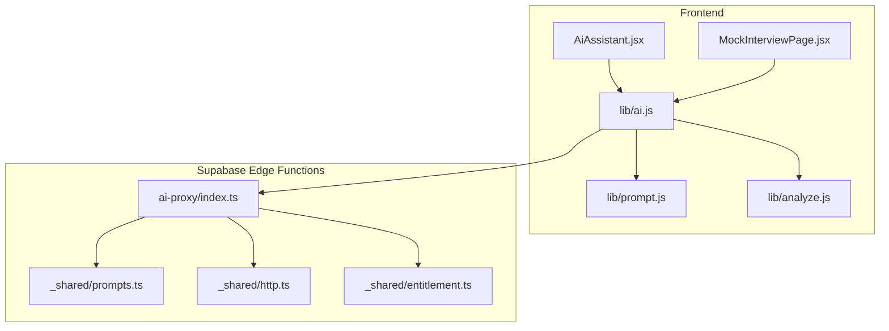
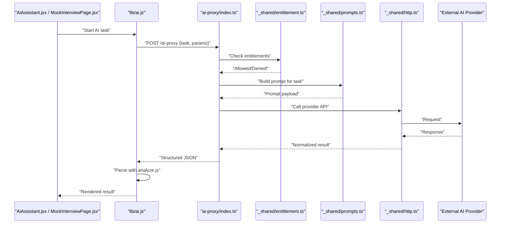
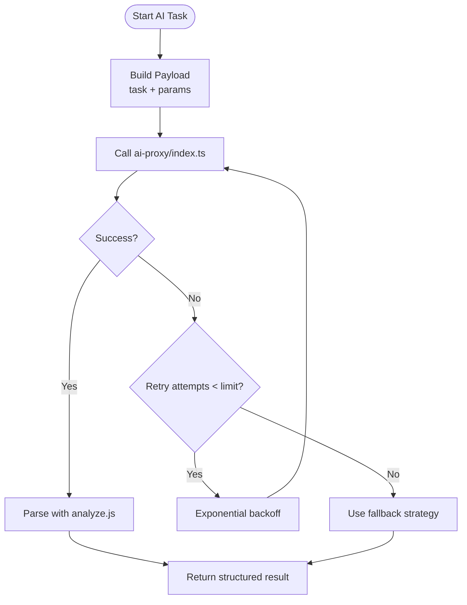
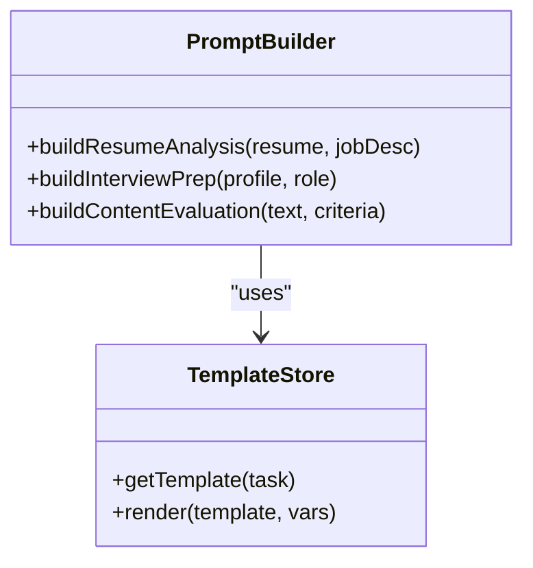
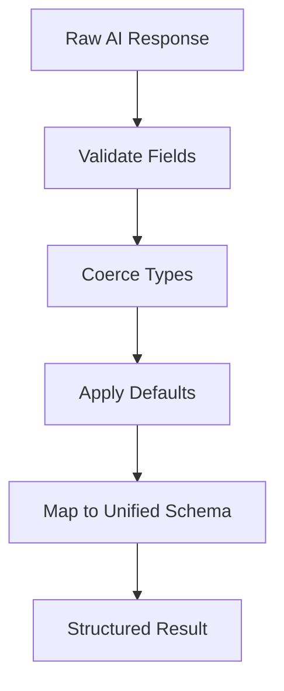
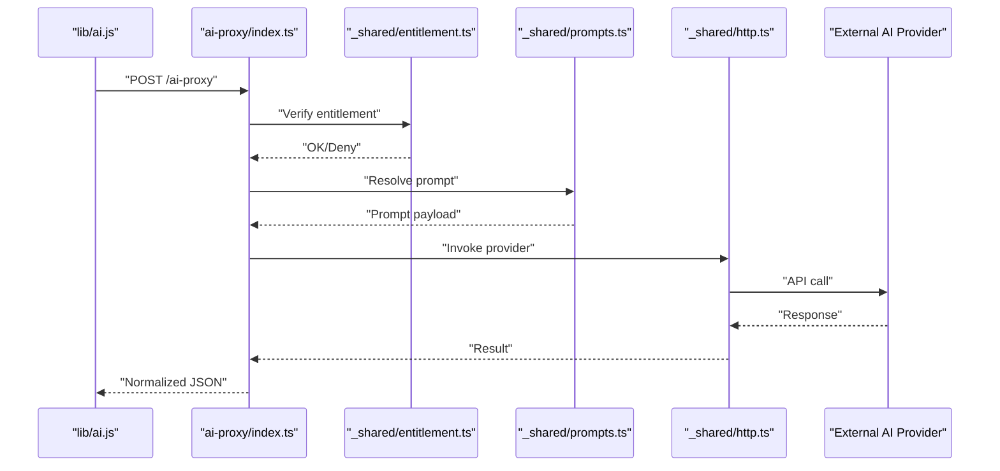
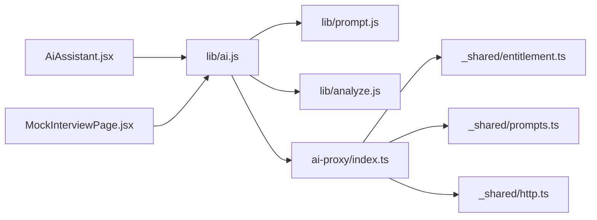

# AI Integration System

<cite>
**Referenced Files in This Document**
- [ai.js](file://src/lib/ai.js)
- [prompt.js](file://src/lib/prompt.js)
- [analyze.js](file://src/lib/analyze.js)
- [AiAssistant.jsx](file://src/components/AiAssistant.jsx)
- [MockInterviewPage.jsx](file://src/components/MockInterviewPage.jsx)
- [index.ts](file://supabase/functions/ai-proxy/index.ts)
- [prompts.ts](file://supabase/functions/_shared/prompts.ts)
- [http.ts](file://supabase/functions/_shared/http.ts)
- [entitlement.ts](file://supabase/functions/_shared/entitlement.ts)
</cite>

## Table of Contents
1. [Introduction](#introduction)
2. [Project Structure](#project-structure)
3. [Core Components](#core-components)
4. [Architecture Overview](#architecture-overview)
5. [Detailed Component Analysis](#detailed-component-analysis)
6. [Dependency Analysis](#dependency-analysis)
7. [Performance Considerations](#performance-considerations)
8. [Troubleshooting Guide](#troubleshooting-guide)
9. [Conclusion](#conclusion)
10. [Appendices](#appendices)

## Introduction
This document explains the AI integration system in ApplyGuard PH, focusing on how the frontend communicates with Supabase Edge Functions to perform AI processing via a proxy architecture. It covers request/response handling, prompt engineering strategies for resume analysis, interview preparation, and content evaluation, as well as error handling patterns, retry mechanisms, fallback strategies, configuration options for different models/providers, and examples of prompt templates and response parsing logic.

## Project Structure
The AI integration spans client-side libraries and components, and server-side Edge Functions:
- Client-side:
  - lib/ai.js: Orchestrates AI calls, retries, and fallbacks.
  - lib/prompt.js: Builds prompts for various tasks (resume analysis, interview prep, content evaluation).
  - lib/analyze.js: Parses and normalizes AI responses into structured data.
  - components/AiAssistant.jsx and components/MockInterviewPage.jsx: UI flows that trigger AI features.
- Server-side:
  - supabase/functions/ai-proxy/index.ts: Secure proxy to external AI providers.
  - supabase/functions/_shared/prompts.ts: Shared prompt templates and helpers.
  - supabase/functions/_shared/http.ts: HTTP utilities for provider requests.
  - supabase/functions/_shared/entitlement.ts: Entitlement checks before invoking AI.

**Diagram sources**
- [AiAssistant.jsx](file://src/components/AiAssistant.jsx)
- [MockInterviewPage.jsx](file://src/components/MockInterviewPage.jsx)
- [ai.js](file://src/lib/ai.js)
- [prompt.js](file://src/lib/prompt.js)
- [analyze.js](file://src/lib/analyze.js)
- [index.ts](file://supabase/functions/ai-proxy/index.ts)
- [prompts.ts](file://supabase/functions/_shared/prompts.ts)
- [http.ts](file://supabase/functions/_shared/http.ts)
- [entitlement.ts](file://supabase/functions/_shared/entitlement.ts)

**Section sources**
- [ai.js](file://src/lib/ai.js)
- [prompt.js](file://src/lib/prompt.js)
- [analyze.js](file://src/lib/analyze.js)
- [AiAssistant.jsx](file://src/components/AiAssistant.jsx)
- [MockInterviewPage.jsx](file://src/components/MockInterviewPage.jsx)
- [index.ts](file://supabase/functions/ai-proxy/index.ts)
- [prompts.ts](file://supabase/functions/_shared/prompts.ts)
- [http.ts](file://supabase/functions/_shared/http.ts)
- [entitlement.ts](file://supabase/functions/_shared/entitlement.ts)

## Core Components
- ai.js
  - Purpose: Central client orchestrator for AI operations. Handles building payloads, calling the Edge Function proxy, retrying transient failures, and parsing structured outputs.
  - Key responsibilities:
    - Construct request bodies with task type, context, and parameters.
    - Manage timeouts, retries, and backoff.
    - Normalize responses using analyze.js.
    - Surface user-friendly errors and fallback results when needed.
- prompt.js
  - Purpose: Composes prompts for specific tasks such as resume analysis, mock interview generation, and content evaluation.
  - Key responsibilities:
    - Select appropriate template based on task.
    - Inject dynamic variables (e.g., resume text, job description, candidate profile).
    - Enforce constraints like output format hints.
- analyze.js
  - Purpose: Parses raw AI outputs into consistent structures consumed by UI and downstream logic.
  - Key responsibilities:
    - Validate fields and coerce types.
    - Provide defaults or partial results when parsing fails.
    - Map provider-specific formats to a unified schema.
- AiAssistant.jsx and MockInterviewPage.jsx
  - Purpose: User-facing flows that initiate AI tasks and render results.
  - Key responsibilities:
    - Collect inputs and display progress.
    - Handle loading states, errors, and retry actions.
    - Render parsed results from analyze.js.
- ai-proxy/index.ts
  - Purpose: Secure server-side proxy that authenticates calls, enforces entitlements, and forwards requests to configured AI providers.
  - Key responsibilities:
    - Validate incoming requests and headers.
    - Check entitlements before proceeding.
    - Build provider-specific requests using http.ts and prompts.ts.
    - Stream or buffer responses and return normalized JSON.
- _shared/prompts.ts
  - Purpose: Centralized prompt templates and helpers used by the proxy.
- _shared/http.ts
  - Purpose: HTTP client utilities for making provider API calls with retries and timeouts.
- _shared/entitlement.ts
  - Purpose: Validates user entitlements (e.g., subscription status) before allowing AI usage.

**Section sources**
- [ai.js](file://src/lib/ai.js)
- [prompt.js](file://src/lib/prompt.js)
- [analyze.js](file://src/lib/analyze.js)
- [AiAssistant.jsx](file://src/components/AiAssistant.jsx)
- [MockInterviewPage.jsx](file://src/components/MockInterviewPage.jsx)
- [index.ts](file://supabase/functions/ai-proxy/index.ts)
- [prompts.ts](file://supabase/functions/_shared/prompts.ts)
- [http.ts](file://supabase/functions/_shared/http.ts)
- [entitlement.ts](file://supabase/functions/_shared/entitlement.ts)

## Architecture Overview
The system uses a secure proxy pattern:
- Frontend calls a Supabase Edge Function endpoint.
- The proxy validates entitlements, constructs provider requests, and returns structured responses.
- Prompt templates are centralized and reused across tasks.
- Response parsing is standardized on the client side.

**Diagram sources**
- [AiAssistant.jsx](file://src/components/AiAssistant.jsx)
- [MockInterviewPage.jsx](file://src/components/MockInterviewPage.jsx)
- [ai.js](file://src/lib/ai.js)
- [index.ts](file://supabase/functions/ai-proxy/index.ts)
- [entitlement.ts](file://supabase/functions/_shared/entitlement.ts)
- [prompts.ts](file://supabase/functions/_shared/prompts.ts)
- [http.ts](file://supabase/functions/_shared/http.ts)

## Detailed Component Analysis

### Client AI Orchestration (lib/ai.js)
- Responsibilities:
  - Build request payloads including task identifiers and parameters.
  - Call the Edge Function proxy with proper headers and timeouts.
  - Implement retry with exponential backoff for transient errors (network timeouts, rate limits).
  - Parse responses using analyze.js and provide fallbacks when parsing fails.
- Error handling:
  - Distinguish between network errors, provider errors, and parsing errors.
  - Surface actionable messages to users and log diagnostic details.
- Configuration:
  - Supports selecting different models/providers via parameters.
  - Allows tuning temperature, max tokens, and other model-specific options.

**Diagram sources**
- [ai.js](file://src/lib/ai.js)
- [analyze.js](file://src/lib/analyze.js)
- [index.ts](file://supabase/functions/ai-proxy/index.ts)

**Section sources**
- [ai.js](file://src/lib/ai.js)
- [analyze.js](file://src/lib/analyze.js)

### Prompt Engineering (lib/prompt.js and _shared/prompts.ts)
- Strategies:
  - Use task-specific templates for resume analysis, interview preparation, and content evaluation.
  - Include explicit instructions for output structure to simplify parsing.
  - Inject contextual variables (resume text, job description, candidate profile) safely.
- Templates:
  - Centralized in _shared/prompts.ts for reuse and consistency.
  - Parameterized to support multiple models/providers.
- Best practices:
  - Keep prompts concise and focused.
  - Provide examples within prompts where helpful.
  - Avoid leaking sensitive information; sanitize inputs.

**Diagram sources**
- [prompt.js](file://src/lib/prompt.js)
- [prompts.ts](file://supabase/functions/_shared/prompts.ts)

**Section sources**
- [prompt.js](file://src/lib/prompt.js)
- [prompts.ts](file://supabase/functions/_shared/prompts.ts)

### Response Parsing (lib/analyze.js)
- Responsibilities:
  - Validate and coerce fields to expected types.
  - Provide default values for missing fields.
  - Map provider-specific schemas to a unified internal format.
- Robustness:
  - Gracefully handle malformed responses.
  - Return partial results when possible and flag issues for logging.

**Diagram sources**
- [analyze.js](file://src/lib/analyze.js)

**Section sources**
- [analyze.js](file://src/lib/analyze.js)

### Edge Function Proxy (supabase/functions/ai-proxy/index.ts)
- Responsibilities:
  - Validate incoming requests and headers.
  - Check entitlements before proceeding.
  - Build provider-specific requests using shared modules.
  - Return normalized JSON responses.
- Security:
  - Enforce access control and rate limiting at the edge.
  - Sanitize inputs and avoid exposing secrets.

**Diagram sources**
- [index.ts](file://supabase/functions/ai-proxy/index.ts)
- [entitlement.ts](file://supabase/functions/_shared/entitlement.ts)
- [prompts.ts](file://supabase/functions/_shared/prompts.ts)
- [http.ts](file://supabase/functions/_shared/http.ts)

**Section sources**
- [index.ts](file://supabase/functions/ai-proxy/index.ts)
- [entitlement.ts](file://supabase/functions/_shared/entitlement.ts)
- [prompts.ts](file://supabase/functions/_shared/prompts.ts)
- [http.ts](file://supabase/functions/_shared/http.ts)

### UI Flows (components/AiAssistant.jsx and components/MockInterviewPage.jsx)
- Responsibilities:
  - Trigger AI tasks and manage UI state (loading, success, error).
  - Display parsed results and allow retry actions.
  - Collect user inputs and pass them to lib/ai.js.

**Section sources**
- [AiAssistant.jsx](file://src/components/AiAssistant.jsx)
- [MockInterviewPage.jsx](file://src/components/MockInterviewPage.jsx)

## Dependency Analysis
The following diagram shows key dependencies among core files:

**Diagram sources**
- [AiAssistant.jsx](file://src/components/AiAssistant.jsx)
- [MockInterviewPage.jsx](file://src/components/MockInterviewPage.jsx)
- [ai.js](file://src/lib/ai.js)
- [prompt.js](file://src/lib/prompt.js)
- [analyze.js](file://src/lib/analyze.js)
- [index.ts](file://supabase/functions/ai-proxy/index.ts)
- [entitlement.ts](file://supabase/functions/_shared/entitlement.ts)
- [prompts.ts](file://supabase/functions/_shared/prompts.ts)
- [http.ts](file://supabase/functions/_shared/http.ts)

**Section sources**
- [ai.js](file://src/lib/ai.js)
- [prompt.js](file://src/lib/prompt.js)
- [analyze.js](file://src/lib/analyze.js)
- [AiAssistant.jsx](file://src/components/AiAssistant.jsx)
- [MockInterviewPage.jsx](file://src/components/MockInterviewPage.jsx)
- [index.ts](file://supabase/functions/ai-proxy/index.ts)
- [entitlement.ts](file://supabase/functions/_shared/entitlement.ts)
- [prompts.ts](file://supabase/functions/_shared/prompts.ts)
- [http.ts](file://supabase/functions/_shared/http.ts)

## Performance Considerations
- Prefer streaming responses from providers when available to reduce perceived latency.
- Cache reusable prompt templates and frequently accessed metadata on the client.
- Tune retry backoff and maximum attempts to balance responsiveness and resilience.
- Limit input sizes to reduce token usage and costs.
- Use efficient parsing and avoid unnecessary re-renders in UI components.

## Troubleshooting Guide
Common issues and resolutions:
- Network timeouts or intermittent failures:
  - Verify retry settings and backoff intervals in lib/ai.js.
  - Check Edge Function logs for upstream provider errors.
- Rate limiting or quota exceeded:
  - Adjust concurrency and retry policies.
  - Monitor entitlements and usage quotas in _shared/entitlement.ts.
- Malformed responses:
  - Inspect parsing logic in lib/analyze.js and add robust defaults.
  - Log raw responses for diagnostics while avoiding sensitive data exposure.
- Prompt-related errors:
  - Validate prompt templates in _shared/prompts.ts and ensure all required variables are provided.
  - Test prompts with representative inputs to catch edge cases.

**Section sources**
- [ai.js](file://src/lib/ai.js)
- [analyze.js](file://src/lib/analyze.js)
- [prompts.ts](file://supabase/functions/_shared/prompts.ts)
- [entitlement.ts](file://supabase/functions/_shared/entitlement.ts)

## Conclusion
The AI integration in ApplyGuard PH leverages a secure proxy architecture to centralize provider interactions, enforce entitlements, and standardize prompt construction and response parsing. The client-side orchestration provides resilient retry and fallback mechanisms, while the server-side proxy ensures security and consistency. By centralizing prompt templates and response normalization, the system remains maintainable and adaptable to different AI models and providers.

## Appendices

### Example Prompt Templates
- Resume analysis:
  - Inputs: resume text, optional job description.
  - Output: structured feedback with strengths, gaps, and recommendations.
- Interview preparation:
  - Inputs: candidate profile, target role.
  - Output: tailored questions and suggested answers.
- Content evaluation:
  - Inputs: text to evaluate, evaluation criteria.
  - Output: scored assessment with explanations.

For concrete template definitions, see:
- [prompts.ts](file://supabase/functions/_shared/prompts.ts)

### Configuration Options
- Model/provider selection:
  - Configure via parameters passed to lib/ai.js and resolved in the proxy.
- Request tuning:
  - Temperature, max tokens, and other provider-specific options can be included in payloads.
- Retry and fallback:
  - Adjust retry counts, backoff multipliers, and fallback behaviors in lib/ai.js.

References:
- [ai.js](file://src/lib/ai.js)
- [index.ts](file://supabase/functions/ai-proxy/index.ts)