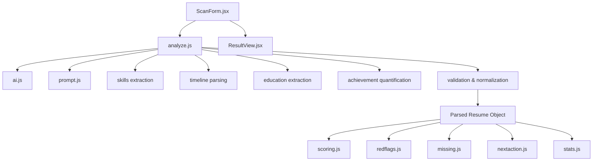
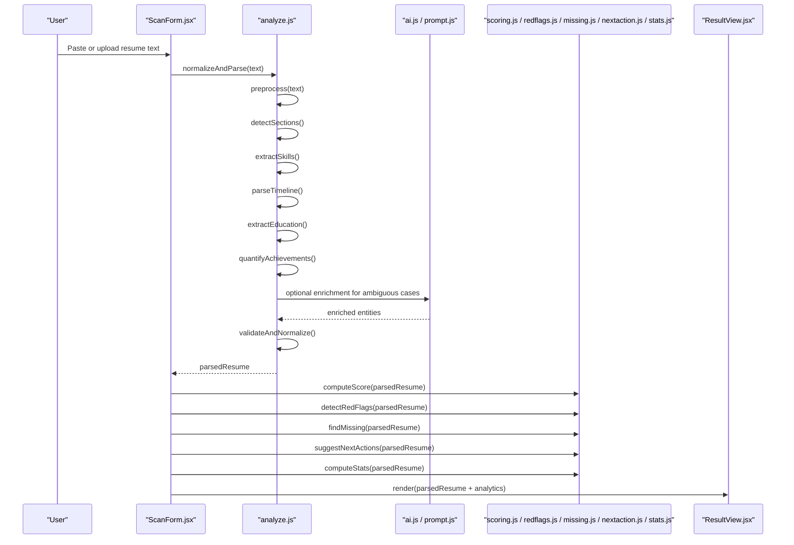
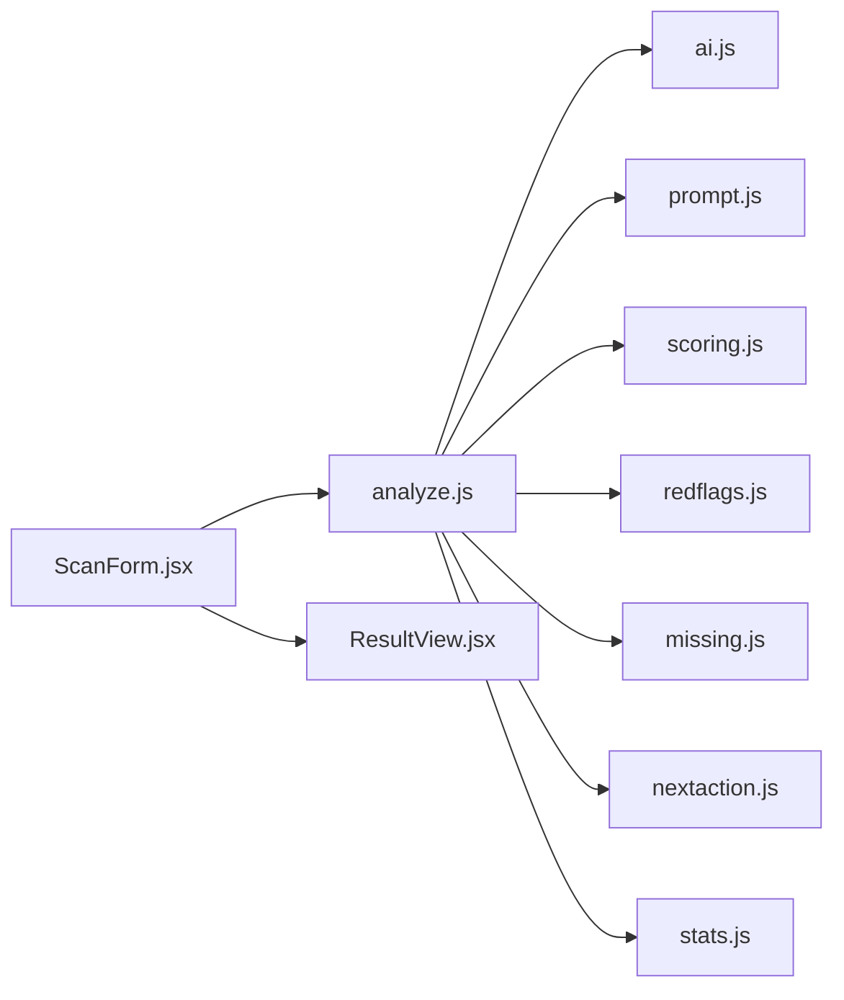

# Content Parsing Engine

<cite>
**Referenced Files in This Document**
- [analyze.js](file://src/lib/analyze.js)
- [ai.js](file://src/lib/ai.js)
- [prompt.js](file://src/lib/prompt.js)
- [scoring.js](file://src/lib/scoring.js)
- [redflags.js](file://src/lib/redflags.js)
- [missing.js](file://src/lib/missing.js)
- [nextaction.js](file://src/lib/nextaction.js)
- [stats.js](file://src/lib/stats.js)
- [samples.js](file://src/lib/samples.js)
- [ScanForm.jsx](file://src/components/ScanForm.jsx)
- [ResultView.jsx](file://src/components/ResultView.jsx)
</cite>

## Table of Contents
1. [Introduction](#introduction)
2. [Project Structure](#project-structure)
3. [Core Components](#core-components)
4. [Architecture Overview](#architecture-overview)
5. [Detailed Component Analysis](#detailed-component-analysis)
6. [Dependency Analysis](#dependency-analysis)
7. [Performance Considerations](#performance-considerations)
8. [Troubleshooting Guide](#troubleshooting-guide)
9. [Conclusion](#conclusion)
10. [Appendices](#appendices)

## Introduction
This document explains the content parsing engine used by ApplyGuard PH to extract structured information from unstructured resume text. It covers how skills, experience timelines, education, and achievements are recognized; the regex patterns, NLP techniques, and heuristic algorithms applied; input formats and parsing rules; output data structures; validation and error handling; and support for different resume formats and layouts.

The parsing pipeline is implemented as a modular set of utilities that:
- Normalize and segment raw resume text into logical sections
- Identify entities such as skills, roles, organizations, dates, and degrees
- Quantify achievements where possible
- Validate extracted fields and produce a normalized result object
- Provide scoring, red flags, missing items, and next actions based on the parsed data

## Project Structure
At a high level, the parsing logic resides under src/lib with UI integration points in src/components. The main flow is:
- User uploads or pastes resume text via ScanForm
- analyze.js orchestrates parsing and normalization
- ai.js and prompt.js provide AI-assisted extraction when needed
- Supporting modules (scoring, redflags, missing, nextaction, stats) consume the parsed result to generate insights
- ResultView renders the final structured output

[No sources needed since this diagram shows conceptual workflow, not actual code structure]

## Core Components
- Text normalization and segmentation: tokenization, section detection, and line-level heuristics
- Entity recognition: skills, job titles, companies, locations, dates, degrees, institutions
- Achievement quantification: numeric extraction, metric inference, and unit normalization
- Validation and normalization: type coercion, range checks, deduplication, and canonical forms
- Optional AI assistance: LLM-based extraction guided by prompts for ambiguous cases
- Post-processing: scoring, red flag detection, missing item analysis, next action suggestions, and statistics

Key responsibilities and interactions are implemented across the following files:
- analyze.js: central orchestration of parsing steps and normalization
- ai.js and prompt.js: optional AI-assisted extraction and prompt templates
- scoring.js, redflags.js, missing.js, nextaction.js, stats.js: downstream analytics and guidance
- ScanForm.jsx and ResultView.jsx: user-facing entry and display points

**Section sources**
- [analyze.js](file://src/lib/analyze.js)
- [ai.js](file://src/lib/ai.js)
- [prompt.js](file://src/lib/prompt.js)
- [scoring.js](file://src/lib/scoring.js)
- [redflags.js](file://src/lib/redflags.js)
- [missing.js](file://src/lib/missing.js)
- [nextaction.js](file://src/lib/nextaction.js)
- [stats.js](file://src/lib/stats.js)
- [ScanForm.jsx](file://src/components/ScanForm.jsx)
- [ResultView.jsx](file://src/components/ResultView.jsx)

## Architecture Overview
The parsing engine follows a layered architecture:
- Input layer: accepts plain text, PDF-derived text, or HTML snippets
- Preprocessing layer: cleans whitespace, normalizes punctuation, splits into lines/blocks
- Recognition layer: applies regex patterns and heuristics to detect sections and entities
- Normalization layer: standardizes values (dates, durations, units), deduplicates, and validates
- Optional AI layer: uses ai.js and prompt.js to resolve ambiguities or enrich sparse inputs
- Analytics layer: scoring, red flags, missing items, next actions, and summary statistics
- Output layer: produces a structured JSON-like object consumed by UI components

**Diagram sources**
- [analyze.js](file://src/lib/analyze.js)
- [ai.js](file://src/lib/ai.js)
- [prompt.js](file://src/lib/prompt.js)
- [scoring.js](file://src/lib/scoring.js)
- [redflags.js](file://src/lib/redflags.js)
- [missing.js](file://src/lib/missing.js)
- [nextaction.js](file://src/lib/nextaction.js)
- [stats.js](file://src/lib/stats.js)
- [ScanForm.jsx](file://src/components/ScanForm.jsx)
- [ResultView.jsx](file://src/components/ResultView.jsx)

## Detailed Component Analysis

### Section Detection and Text Segmentation
- Purpose: Convert raw resume text into coherent blocks representing contact info, summary, experience, education, skills, projects, certifications, and other sections.
- Techniques:
  - Line splitting and blank-line grouping
  - Header heuristics using capitalized phrases and common keywords
  - Regex anchors for known section titles and separators
- Output: Ordered list of sections with metadata (title, start/end indices, confidence).

**Section sources**
- [analyze.js](file://src/lib/analyze.js)

### Skills Identification
- Purpose: Extract technical and soft skills from unstructured text.
- Techniques:
  - Keyword dictionaries and synonym mapping
  - Regex patterns for skill lists, bullet points, and inline mentions
  - Contextual heuristics (e.g., “Proficient in”, “Experience with”)
  - Deduplication and normalization (case folding, pluralization)
- Output: Array of canonical skill tokens with counts and contexts.

**Section sources**
- [analyze.js](file://src/lib/analyze.js)

### Experience Timeline Parsing
- Purpose: Build a chronological timeline of roles, organizations, locations, and date ranges.
- Techniques:
  - Date pattern recognition (month-year, year-only, ranges)
  - Role/title extraction via title heuristics and capitalization
  - Organization name extraction near role entries
  - Duration calculation and overlap resolution
- Output: List of experience objects with standardized date ranges and computed durations.

**Section sources**
- [analyze.js](file://src/lib/analyze.js)

### Education Extraction
- Purpose: Identify degrees, institutions, majors, graduation years, and honors.
- Techniques:
  - Degree keyword matching (BSc, MSc, PhD, BA, etc.)
  - Institution name heuristics and location cues
  - Year extraction and validation against realistic ranges
- Output: List of education objects with degree, institution, major, and year.

**Section sources**
- [analyze.js](file://src/lib/analyze.js)

### Achievement Quantification
- Purpose: Detect and quantify achievements expressed in bullets or descriptions.
- Techniques:
  - Numeric extraction (percentages, currency, counts, timeframes)
  - Metric inference (e.g., “increased sales by X%” → {metric: “sales”, change: “increase”, value: X, unit: “%”})
  - Unit normalization and aggregation
- Output: Structured achievement records with metrics, units, and context references.

**Section sources**
- [analyze.js](file://src/lib/analyze.js)

### Validation and Normalization
- Purpose: Ensure consistency, correctness, and completeness of extracted data.
- Techniques:
  - Type coercion (strings to numbers, dates to ISO format)
  - Range checks (e.g., graduation year within plausible bounds)
  - Deduplication and canonicalization (skill names, organization names)
  - Error tagging for fields that failed validation
- Output: Validated parsedResume object with warnings and errors.

**Section sources**
- [analyze.js](file://src/lib/analyze.js)

### Optional AI-Assisted Extraction
- Purpose: Improve accuracy for ambiguous or poorly formatted resumes.
- Techniques:
  - ai.js orchestrates calls to an external model
  - prompt.js provides structured prompts tailored to each extraction task
  - Fallback to deterministic methods when AI is unavailable or fails
- Output: Enriched entities and resolved ambiguities merged back into parsedResume.

**Section sources**
- [ai.js](file://src/lib/ai.js)
- [prompt.js](file://src/lib/prompt.js)

### Downstream Analytics
- Scoring: Summarizes candidate strength based on skills, experience depth, education, and achievements.
- Red Flags: Identifies inconsistencies, gaps, or risky signals (e.g., unrealistic durations).
- Missing Items: Highlights absent but desirable elements (e.g., missing contact info, incomplete education).
- Next Actions: Suggests improvements or follow-ups (e.g., add quantified achievements).
- Stats: Provides summary counts and distributions (e.g., number of skills, average tenure).

**Section sources**
- [scoring.js](file://src/lib/scoring.js)
- [redflags.js](file://src/lib/redflags.js)
- [missing.js](file://src/lib/missing.js)
- [nextaction.js](file://src/lib/nextaction.js)
- [stats.js](file://src/lib/stats.js)

### UI Integration
- ScanForm.jsx: Accepts resume input, triggers parsing, and displays progress/errors.
- ResultView.jsx: Renders parsedResume and analytics results in a readable layout.

**Section sources**
- [ScanForm.jsx](file://src/components/ScanForm.jsx)
- [ResultView.jsx](file://src/components/ResultView.jsx)

## Dependency Analysis
The parsing engine exhibits clear separation of concerns:
- analyze.js depends on ai.js and prompt.js for optional enrichment
- Downstream analytics depend only on the validated parsedResume object
- UI components depend on analyze.js outputs and analytics results

**Diagram sources**
- [analyze.js](file://src/lib/analyze.js)
- [ai.js](file://src/lib/ai.js)
- [prompt.js](file://src/lib/prompt.js)
- [scoring.js](file://src/lib/scoring.js)
- [redflags.js](file://src/lib/redflags.js)
- [missing.js](file://src/lib/missing.js)
- [nextaction.js](file://src/lib/nextaction.js)
- [stats.js](file://src/lib/stats.js)
- [ScanForm.jsx](file://src/components/ScanForm.jsx)
- [ResultView.jsx](file://src/components/ResultView.jsx)

**Section sources**
- [analyze.js](file://src/lib/analyze.js)
- [ai.js](file://src/lib/ai.js)
- [prompt.js](file://src/lib/prompt.js)
- [scoring.js](file://src/lib/scoring.js)
- [redflags.js](file://src/lib/redflags.js)
- [missing.js](file://src/lib/missing.js)
- [nextaction.js](file://src/lib/nextaction.js)
- [stats.js](file://src/lib/stats.js)
- [ScanForm.jsx](file://src/components/ScanForm.jsx)
- [ResultView.jsx](file://src/components/ResultView.jsx)

## Performance Considerations
- Prefer deterministic regex and heuristics over AI calls to reduce latency and cost
- Cache skill dictionaries and common patterns to avoid recomputation
- Stream processing for large texts: chunking and incremental normalization
- Limit AI fallbacks to ambiguous segments identified by low-confidence detections
- Defer heavy analytics until after core parsing completes

[No sources needed since this section provides general guidance]

## Troubleshooting Guide
Common issues and resolutions:
- Malformed dates: Ensure date patterns cover regional formats; validate ranges and coerce to ISO strings
- Overlapping experiences: Resolve overlaps by prioritizing most recent or longest duration
- Duplicate skills: Normalize synonyms and deduplicate before scoring
- Missing sections: If section detection fails, trigger AI-assisted enrichment
- Empty or invalid input: Return explicit errors and guide users to reformat or paste clean text

Error handling strategies:
- Tag fields with warnings/errors during validation
- Provide fallback defaults for non-critical fields
- Log detailed diagnostics for debugging without exposing sensitive data

**Section sources**
- [analyze.js](file://src/lib/analyze.js)
- [ai.js](file://src/lib/ai.js)
- [prompt.js](file://src/lib/prompt.js)

## Conclusion
ApplyGuard PH’s content parsing engine combines robust regex-based heuristics with optional AI assistance to transform unstructured resume text into a normalized, validated, and analyzable data structure. By separating preprocessing, recognition, normalization, and analytics, the system remains maintainable, extensible, and performant across diverse resume formats and layouts.

[No sources needed since this section summarizes without analyzing specific files]

## Appendices

### Input Formats Supported
- Plain text resumes (copied from PDFs or Word documents)
- HTML snippets with minimal markup
- Mixed layouts with varied headings and bullet styles

### Parsing Rules Summary
- Section headers: Recognize common titles and separators; allow flexible casing and punctuation
- Dates: Support month-year, year-only, and ranges; normalize to consistent formats
- Skills: Use curated dictionaries and contextual cues; normalize plurals and synonyms
- Achievements: Extract numbers and units; infer metrics and directionality (increase/decrease)

### Output Data Structures
- parsedResume: Top-level object containing normalized sections and entities
- experience[]: Objects with role, organization, location, dateRange, and computed duration
- education[]: Objects with degree, institution, major, and year
- skills[]: Canonicalized skill tokens with counts and contexts
- achievements[]: Structured records with metrics, units, and references
- validation: Warnings and errors per field for transparency

[No sources needed since this section provides general guidance]