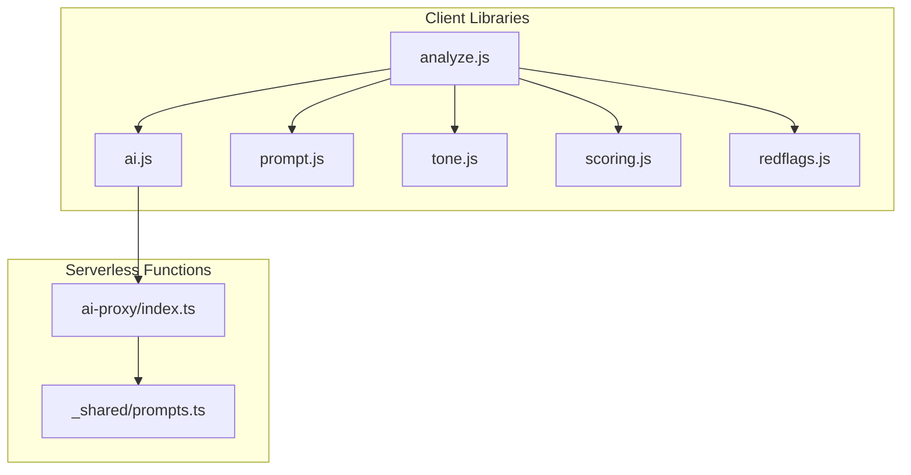
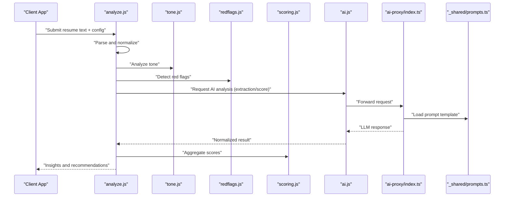
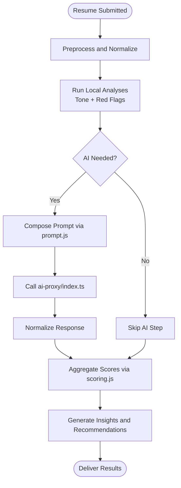
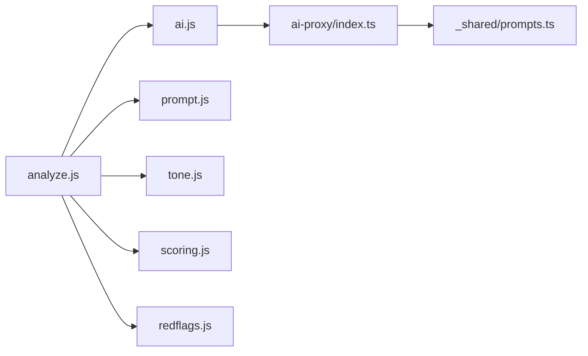

# Resume Analysis Engine

<cite>
**Referenced Files in This Document**
- [analyze.js](file://src/lib/analyze.js)
- [ai.js](file://src/lib/ai.js)
- [prompt.js](file://src/lib/prompt.js)
- [tone.js](file://src/lib/tone.js)
- [scoring.js](file://src/lib/scoring.js)
- [redflags.js](file://src/lib/redflags.js)
- [ai-proxy/index.ts](file://supabase/functions/ai-proxy/index.ts)
- [supabase/functions/_shared/prompts.ts](file://supabase/functions/_shared/prompts.ts)
</cite>

## Table of Contents
1. [Introduction](#introduction)
2. [Project Structure](#project-structure)
3. [Core Components](#core-components)
4. [Architecture Overview](#architecture-overview)
5. [Detailed Component Analysis](#detailed-component-analysis)
6. [Dependency Analysis](#dependency-analysis)
7. [Performance Considerations](#performance-considerations)
8. [Troubleshooting Guide](#troubleshooting-guide)
9. [Conclusion](#conclusion)
10. [Appendices](#appendices)

## Introduction
This document explains the resume analysis engine used by ApplyGuard PH to parse resumes, extract key information, evaluate content quality, and generate actionable insights. It covers:
- AI-powered scanning algorithms and orchestration
- Tone analysis system for communication style, confidence, and professional language patterns
- Content evaluation methods including scoring and red flag detection
- AI integration patterns (client-side orchestration and server proxy), prompt engineering approaches, and response processing
- Configuration options for different industries or job types and customization points for specific criteria

## Project Structure
The resume analysis engine is implemented primarily in client-side libraries with a server-side AI proxy for secure LLM calls. Key modules:
- Orchestration and parsing: src/lib/analyze.js
- AI orchestration and response handling: src/lib/ai.js
- Prompt composition and templates: src/lib/prompt.js
- Tone analysis: src/lib/tone.js
- Scoring and metrics: src/lib/scoring.js
- Red flag detection: src/lib/redflags.js
- Server-side AI proxy: supabase/functions/ai-proxy/index.ts
- Shared prompts on server: supabase/functions/_shared/prompts.ts

**Diagram sources**
- [analyze.js](file://src/lib/analyze.js)
- [ai.js](file://src/lib/ai.js)
- [prompt.js](file://src/lib/prompt.js)
- [tone.js](file://src/lib/tone.js)
- [scoring.js](file://src/lib/scoring.js)
- [redflags.js](file://src/lib/redflags.js)
- [ai-proxy/index.ts](file://supabase/functions/ai-proxy/index.ts)
- [supabase/functions/_shared/prompts.ts](file://supabase/functions/_shared/prompts.ts)

**Section sources**
- [analyze.js](file://src/lib/analyze.js)
- [ai.js](file://src/lib/ai.js)
- [prompt.js](file://src/lib/prompt.js)
- [tone.js](file://src/lib/tone.js)
- [scoring.js](file://src/lib/scoring.js)
- [redflags.js](file://src/lib/redflags.js)
- [ai-proxy/index.ts](file://supabase/functions/ai-proxy/index.ts)
- [supabase/functions/_shared/prompts.ts](file://supabase/functions/_shared/prompts.ts)

## Core Components
- analyze.js: Orchestrates resume ingestion, parsing, extraction, tone analysis, scoring, and insight generation. Coordinates between local heuristics and AI-driven steps.
- ai.js: Encapsulates AI invocation patterns, request shaping, retries, timeouts, and response normalization.
- prompt.js: Composes prompts for different analysis tasks (e.g., extraction, tone, scoring). Supports context injection such as industry or role type.
- tone.js: Implements tone analysis algorithms to detect communication style, confidence levels, and professional language patterns.
- scoring.js: Aggregates signals into scores and grades across dimensions like relevance, clarity, impact, and professionalism.
- redflags.js: Detects potential issues (e.g., inconsistencies, missing sections, overly generic statements) and flags them for review.
- ai-proxy/index.ts: Secure server-side proxy that forwards requests to the LLM provider, enforces policies, and returns structured responses.
- _shared/prompts.ts: Centralized prompt templates and constants used by both client and server components.

**Section sources**
- [analyze.js](file://src/lib/analyze.js)
- [ai.js](file://src/lib/ai.js)
- [prompt.js](file://src/lib/prompt.js)
- [tone.js](file://src/lib/tone.js)
- [scoring.js](file://src/lib/scoring.js)
- [redflags.js](file://src/lib/redflags.js)
- [ai-proxy/index.ts](file://supabase/functions/ai-proxy/index.ts)
- [supabase/functions/_shared/prompts.ts](file://supabase/functions/_shared/prompts.ts)

## Architecture Overview
High-level flow:
- The client composes prompts and prepares resume text.
- Local heuristics run first (parsing, tone, red flags).
- For AI-dependent steps, the client uses ai.js to call the server proxy.
- The server proxy invokes the LLM using shared prompts and returns normalized results.
- The client aggregates outputs into final insights and scores.

**Diagram sources**
- [analyze.js](file://src/lib/analyze.js)
- [tone.js](file://src/lib/tone.js)
- [redflags.js](file://src/lib/redflags.js)
- [scoring.js](file://src/lib/scoring.js)
- [ai.js](file://src/lib/ai.js)
- [ai-proxy/index.ts](file://supabase/functions/ai-proxy/index.ts)
- [supabase/functions/_shared/prompts.ts](file://supabase/functions/_shared/prompts.ts)

## Detailed Component Analysis

### Orchestration and Parsing (analyze.js)
Responsibilities:
- Ingest raw resume text and optional metadata (industry, target role).
- Normalize input (whitespace, encoding, section boundaries).
- Coordinate local analyses (tone, red flags) and AI calls.
- Merge AI outputs with heuristic results into a unified report.
- Provide configuration hooks for domain-specific behavior.

Key behaviors:
- Deterministic preprocessing before any AI call to reduce noise.
- Parallelization where safe (e.g., tone and red flags can run concurrently).
- Robust error handling and fallbacks when AI is unavailable.

**Section sources**
- [analyze.js](file://src/lib/analyze.js)

### AI Integration Patterns (ai.js)
Responsibilities:
- Build requests for AI tasks (extraction, evaluation, suggestions).
- Manage retries, timeouts, and backoff strategies.
- Normalize heterogeneous LLM responses into a consistent schema.
- Surface errors and partial results gracefully.

Patterns:
- Request shaping via prompt templates from prompt.js.
- Strict validation of returned structures to ensure downstream stability.
- Optional caching of repeated queries based on inputs.

**Section sources**
- [ai.js](file://src/lib/ai.js)

### Prompt Engineering (prompt.js and _shared/prompts.ts)
Responsibilities:
- Define reusable prompt templates for extraction, tone, scoring, and recommendations.
- Inject contextual variables (industry, role, experience level).
- Enforce output schemas to simplify parsing.

Approach:
- Template-based composition with placeholders for dynamic fields.
- Versioning and environment-aware overrides via shared prompts.
- Clear instructions for model behavior and constraints.

**Section sources**
- [prompt.js](file://src/lib/prompt.js)
- [supabase/functions/_shared/prompts.ts](file://supabase/functions/_shared/prompts.ts)

### Tone Analysis System (tone.js)
Algorithms:
- Communication style detection (formal vs informal, assertive vs tentative).
- Confidence level estimation based on linguistic markers and phrasing.
- Professional language pattern recognition (action verbs, quantified outcomes, jargon usage).
- Consistency checks across sections (summary vs experience bullets).

Outputs:
- Style profile and confidence score.
- Actionable tips to improve tone and professionalism.

**Section sources**
- [tone.js](file://src/lib/tone.js)

### Content Evaluation and Scoring (scoring.js)
Dimensions:
- Relevance to target role/industry.
- Clarity and structure.
- Impact and achievement orientation.
- Professionalism and tone alignment.

Mechanics:
- Weighted aggregation of signals from heuristics and AI.
- Normalization to consistent scales.
- Thresholds and grading bands for readability.

**Section sources**
- [scoring.js](file://src/lib/scoring.js)

### Red Flag Detection (redflags.js)
Checks:
- Missing critical sections (e.g., contact info, summary).
- Inconsistencies (dates, roles, locations).
- Overly generic statements without metrics.
- Formatting anomalies and excessive length.

Outputs:
- List of flagged items with severity and suggested fixes.

**Section sources**
- [redflags.js](file://src/lib/redflags.js)

### Server-Side AI Proxy (ai-proxy/index.ts)
Responsibilities:
- Receive client requests and validate payloads.
- Load appropriate prompt templates from shared prompts.
- Call the LLM provider securely and return normalized responses.
- Enforce rate limits and logging for observability.

Security and reliability:
- Input sanitization and size limits.
- Retry and timeout handling at the edge.
- Structured error responses for client consumption.

**Section sources**
- [ai-proxy/index.ts](file://supabase/functions/ai-proxy/index.ts)
- [supabase/functions/_shared/prompts.ts](file://supabase/functions/_shared/prompts.ts)

### End-to-End Flow Diagram

**Diagram sources**
- [analyze.js](file://src/lib/analyze.js)
- [prompt.js](file://src/lib/prompt.js)
- [ai.js](file://src/lib/ai.js)
- [ai-proxy/index.ts](file://supabase/functions/ai-proxy/index.ts)
- [scoring.js](file://src/lib/scoring.js)
- [tone.js](file://src/lib/tone.js)
- [redflags.js](file://src/lib/redflags.js)

## Dependency Analysis
Internal dependencies:
- analyze.js depends on ai.js, prompt.js, tone.js, scoring.js, and redflags.js.
- ai.js depends on prompt.js for request shaping and may rely on shared prompts via the proxy.
- ai-proxy/index.ts depends on _shared/prompts.ts for canonical templates.

External dependencies:
- LLM provider invoked through the server proxy.
- Network layer for client-server communication.

Potential risks:
- Tight coupling between prompt templates and response parsers; changes require coordinated updates.
- Reliance on network availability for AI steps; robust fallbacks are essential.

**Diagram sources**
- [analyze.js](file://src/lib/analyze.js)
- [ai.js](file://src/lib/ai.js)
- [prompt.js](file://src/lib/prompt.js)
- [tone.js](file://src/lib/tone.js)
- [scoring.js](file://src/lib/scoring.js)
- [redflags.js](file://src/lib/redflags.js)
- [ai-proxy/index.ts](file://supabase/functions/ai-proxy/index.ts)
- [supabase/functions/_shared/prompts.ts](file://supabase/functions/_shared/prompts.ts)

**Section sources**
- [analyze.js](file://src/lib/analyze.js)
- [ai.js](file://src/lib/ai.js)
- [prompt.js](file://src/lib/prompt.js)
- [tone.js](file://src/lib/tone.js)
- [scoring.js](file://src/lib/scoring.js)
- [redflags.js](file://src/lib/redflags.js)
- [ai-proxy/index.ts](file://supabase/functions/ai-proxy/index.ts)
- [supabase/functions/_shared/prompts.ts](file://supabase/functions/_shared/prompts.ts)

## Performance Considerations
- Prefer local heuristics (tone, red flags) to minimize costly AI calls.
- Batch or deduplicate identical AI requests where possible.
- Use streaming or chunked processing for large resumes if supported by the proxy.
- Cache frequent prompt templates and common configurations.
- Implement exponential backoff and circuit breakers for AI calls.

[No sources needed since this section provides general guidance]

## Troubleshooting Guide
Common issues and resolutions:
- AI call failures: Check proxy logs, verify prompt templates, and confirm network connectivity. Ensure retries and timeouts are configured appropriately.
- Malformed responses: Validate response schemas early in ai.js and add defensive parsing.
- Inconsistent tone scores: Review tone.js rules and adjust thresholds based on feedback.
- Excessive red flags: Tune redflags.js sensitivity and consider context-aware overrides.

Operational tips:
- Enable detailed logging around AI request/response cycles.
- Add unit tests for prompt variations and response shapes.
- Monitor latency and error rates at the proxy layer.

**Section sources**
- [ai.js](file://src/lib/ai.js)
- [ai-proxy/index.ts](file://supabase/functions/ai-proxy/index.ts)
- [tone.js](file://src/lib/tone.js)
- [redflags.js](file://src/lib/redflags.js)

## Conclusion
The resume analysis engine combines deterministic heuristics with AI-driven insights to deliver comprehensive evaluations. By separating concerns across parsing, tone analysis, red flag detection, scoring, and AI orchestration, the system remains maintainable and extensible. The server-side proxy centralizes prompt management and security, while client-side modules provide flexibility for customization and rapid iteration.

[No sources needed since this section summarizes without analyzing specific files]

## Appendices

### Configuration Options and Customization Points
- Industry and role targeting:
  - Provide industry and target role metadata to tailor prompts and scoring weights.
- Scoring weights:
  - Adjust dimension weights in scoring.js to emphasize certain qualities (e.g., impact over clarity).
- Tone thresholds:
  - Modify tone.js thresholds to align with organizational standards.
- Red flag rules:
  - Extend redflags.js with domain-specific checks (e.g., certifications required for regulated roles).
- Prompt templates:
  - Update prompt.js and _shared/prompts.ts to refine AI behavior and output schemas.

**Section sources**
- [prompt.js](file://src/lib/prompt.js)
- [supabase/functions/_shared/prompts.ts](file://supabase/functions/_shared/prompts.ts)
- [scoring.js](file://src/lib/scoring.js)
- [tone.js](file://src/lib/tone.js)
- [redflags.js](file://src/lib/redflags.js)