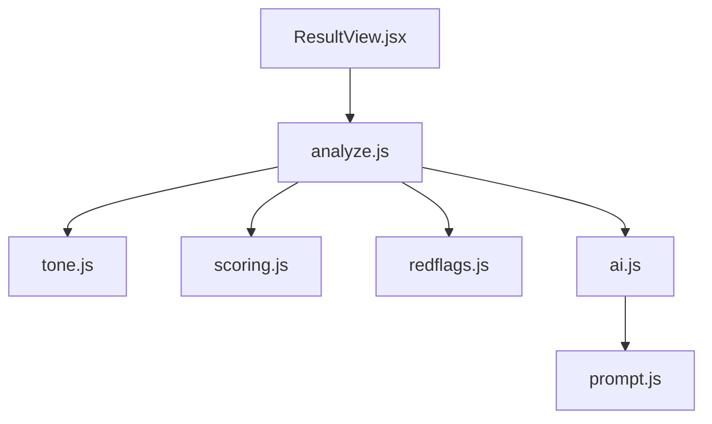
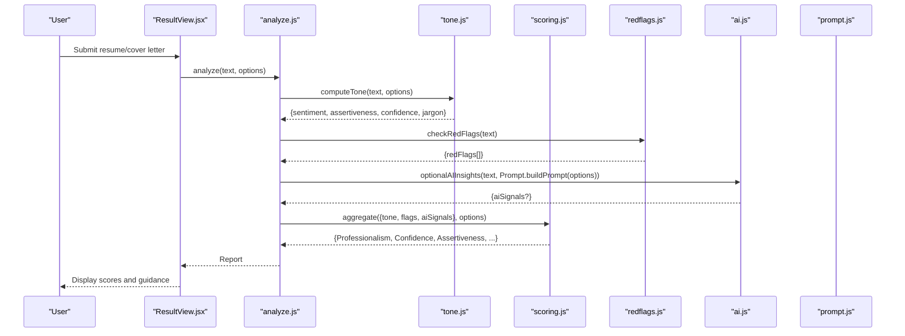
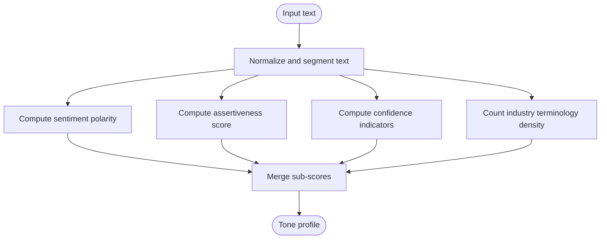
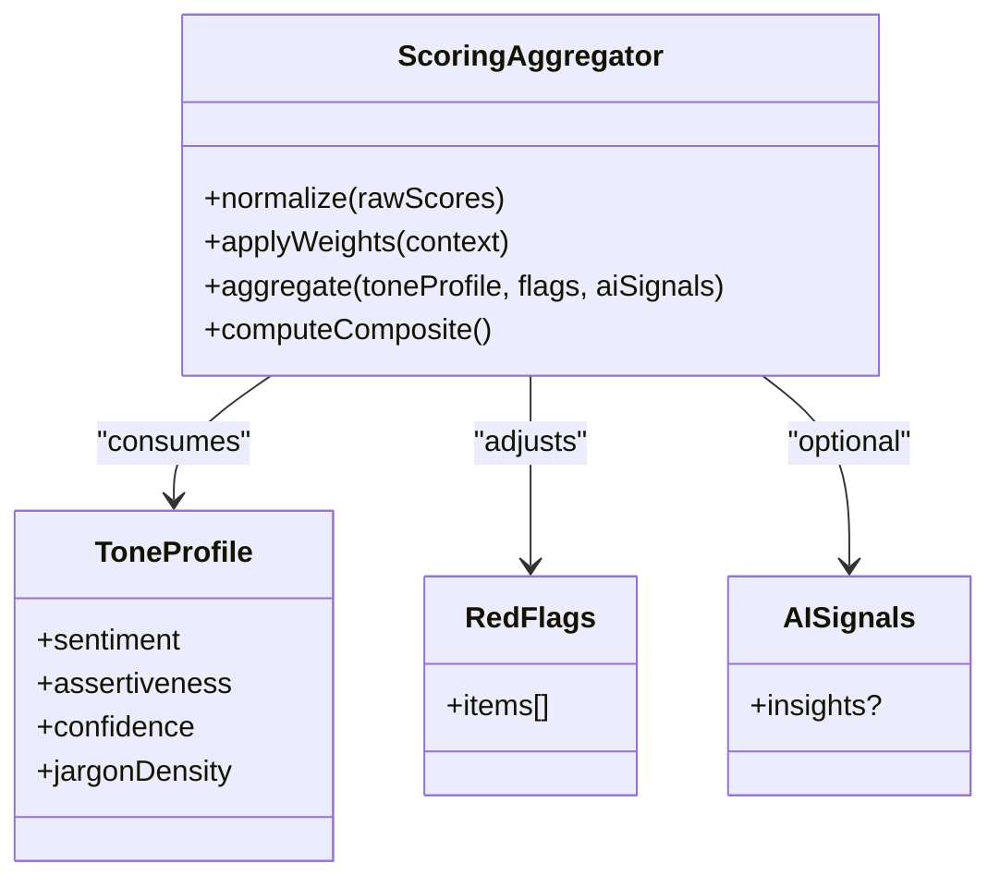
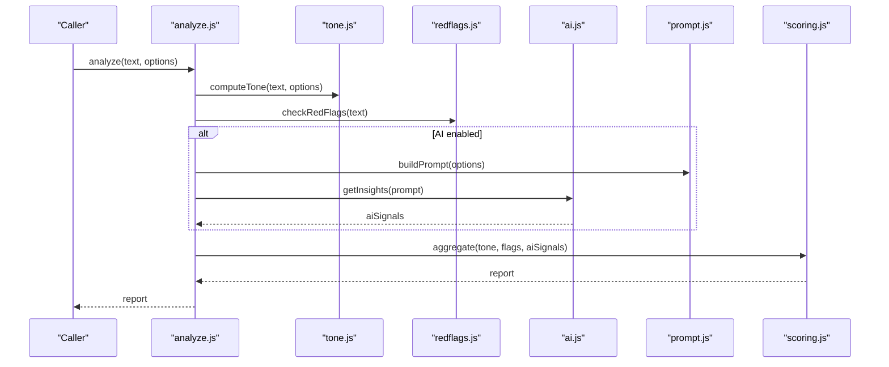
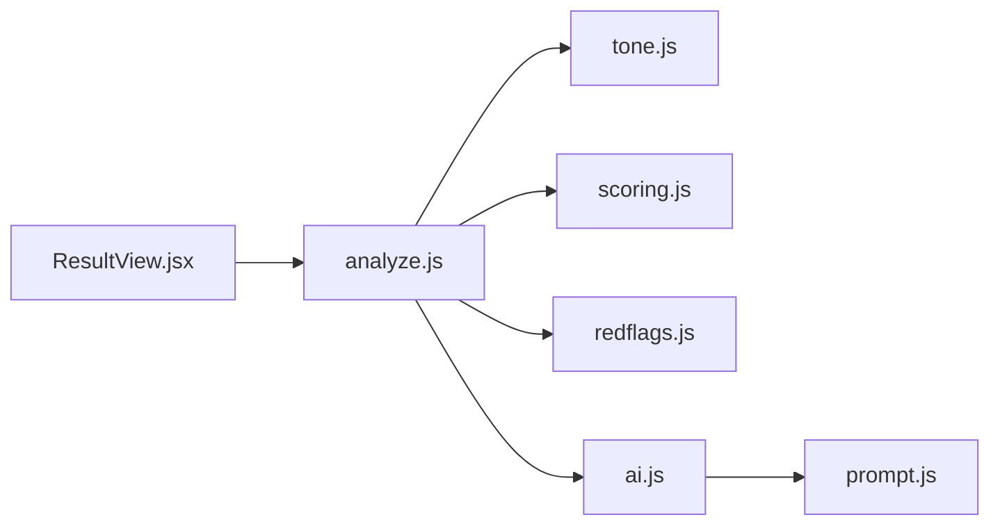

# Tone Analysis Algorithms

<cite>
**Referenced Files in This Document**
- [tone.js](file://src/lib/tone.js)
- [scoring.js](file://src/lib/scoring.js)
- [analyze.js](file://src/lib/analyze.js)
- [ai.js](file://src/lib/ai.js)
- [prompt.js](file://src/lib/prompt.js)
- [redflags.js](file://src/lib/redflags.js)
- [ResultView.jsx](file://src/components/ResultView.jsx)
</cite>

## Table of Contents
1. [Introduction](#introduction)
2. [Project Structure](#project-structure)
3. [Core Components](#core-components)
4. [Architecture Overview](#architecture-overview)
5. [Detailed Component Analysis](#detailed-component-analysis)
6. [Dependency Analysis](#dependency-analysis)
7. [Performance Considerations](#performance-considerations)
8. [Troubleshooting Guide](#troubleshooting-guide)
9. [Conclusion](#conclusion)
10. [Appendices](#appendices)

## Introduction
This document explains the tone analysis algorithms used by ApplyGuard PH to evaluate professional communication style, confidence levels, and language patterns in resumes and cover letters. It covers how positive/negative sentiment, assertiveness, and industry-specific terminology usage are scored, how results are interpreted, and how customization options adapt the analysis for different professional contexts. The document also describes how linguistic analysis integrates with the overall resume assessment pipeline.

## Project Structure
The tone analysis feature is implemented primarily within the frontend library layer and integrated into the result view:
- src/lib/tone.js: Core tone scoring logic (sentiment, assertiveness, confidence, jargon detection).
- src/lib/scoring.js: Aggregation and normalization of sub-scores into final metrics.
- src/lib/analyze.js: Orchestrates analysis steps and composes outputs.
- src/lib/ai.js and src/lib/prompt.js: Optional AI-assisted prompts and responses for advanced tone insights.
- src/lib/redflags.js: Heuristics that can influence tone-related flags.
- src/components/ResultView.jsx: Renders tone scores and guidance to users.

**Diagram sources**
- [analyze.js](file://src/lib/analyze.js)
- [tone.js](file://src/lib/tone.js)
- [scoring.js](file://src/lib/scoring.js)
- [redflags.js](file://src/lib/redflags.js)
- [ai.js](file://src/lib/ai.js)
- [prompt.js](file://src/lib/prompt.js)
- [ResultView.jsx](file://src/components/ResultView.jsx)

**Section sources**
- [tone.js](file://src/lib/tone.js)
- [scoring.js](file://src/lib/scoring.js)
- [analyze.js](file://src/lib/analyze.js)
- [ai.js](file://src/lib/ai.js)
- [prompt.js](file://src/lib/prompt.js)
- [redflags.js](file://src/lib/redflags.js)
- [ResultView.jsx](file://src/components/ResultView.jsx)

## Core Components
- Tone scorer (tone.js): Computes sub-scores for sentiment polarity, assertiveness, confidence, and domain terminology density. It tokenizes text, applies rule-based heuristics, and optionally leverages AI-generated signals via ai.js and prompt.js.
- Scoring aggregator (scoring.js): Normalizes raw signals, weights them according to context (e.g., role or industry), and produces composite metrics such as Professionalism, Confidence, and Assertiveness.
- Analysis orchestrator (analyze.js): Coordinates input parsing, runs tone analysis, merges red flag checks, and returns a structured report consumed by ResultView.jsx.
- Red flags (redflags.js): Identifies problematic phrasing or patterns that may reduce tone quality (e.g., overly negative language, excessive hedging).
- UI integration (ResultView.jsx): Displays tone scores, explanations, and actionable recommendations.

**Section sources**
- [tone.js](file://src/lib/tone.js)
- [scoring.js](file://src/lib/scoring.js)
- [analyze.js](file://src/lib/analyze.js)
- [redflags.js](file://src/lib/redflags.js)
- [ResultView.jsx](file://src/components/ResultView.jsx)

## Architecture Overview
The tone analysis pipeline processes resume or cover letter text through deterministic rules and optional AI assistance, then aggregates results into interpretable scores.

**Diagram sources**
- [analyze.js](file://src/lib/analyze.js)
- [tone.js](file://src/lib/tone.js)
- [scoring.js](file://src/lib/scoring.js)
- [redflags.js](file://src/lib/redflags.js)
- [ai.js](file://src/lib/ai.js)
- [prompt.js](file://src/lib/prompt.js)
- [ResultView.jsx](file://src/components/ResultView.jsx)

## Detailed Component Analysis

### Tone Scorer (tone.js)
Responsibilities:
- Sentiment polarity: Detects positive vs negative language using lexical cues and contextual modifiers.
- Assertiveness: Measures directness and certainty markers (e.g., strong verbs, quantifiers, definitive statements).
- Confidence: Evaluates self-referential strength, achievement framing, and avoidance of weak qualifiers.
- Industry terminology density: Counts domain-specific terms relative to total content length.

Processing logic:
- Text normalization and segmentation into sentences/phrases.
- Lexicon lookups and regex-based pattern matching for sentiment and assertiveness.
- Weighting adjustments based on context (role type, industry tags).
- Optional enrichment from AI-assisted prompts when enabled.

**Diagram sources**
- [tone.js](file://src/lib/tone.js)

**Section sources**
- [tone.js](file://src/lib/tone.js)

### Scoring Aggregator (scoring.js)
Responsibilities:
- Normalize raw sub-scores to consistent scales.
- Apply weighting per professional context (e.g., leadership roles emphasize assertiveness; technical roles emphasize clarity and terminology).
- Produce composite metrics: Professionalism, Confidence, Assertiveness, and optional Domain Fit.

Normalization and weighting:
- Min-max or z-score normalization depending on distribution characteristics.
- Context-aware weights configurable via options passed from analyze.js.
- Penalty/bonus adjustments for red flags detected by redflags.js.

**Diagram sources**
- [scoring.js](file://src/lib/scoring.js)

**Section sources**
- [scoring.js](file://src/lib/scoring.js)

### Analysis Orchestrator (analyze.js)
Responsibilities:
- Coordinate inputs, run tone analysis, integrate red flags, and optionally call AI services.
- Build a unified report structure for consumption by ResultView.jsx.
- Support customization options (industry, role level, desired tone profile).

Integration points:
- Calls tone.js for core linguistic analysis.
- Invokes redflags.js for heuristic checks.
- Uses ai.js and prompt.js for optional AI-enhanced insights.
- Delegates aggregation to scoring.js.

**Diagram sources**
- [analyze.js](file://src/lib/analyze.js)
- [tone.js](file://src/lib/tone.js)
- [redflags.js](file://src/lib/redflags.js)
- [ai.js](file://src/lib/ai.js)
- [prompt.js](file://src/lib/prompt.js)
- [scoring.js](file://src/lib/scoring.js)

**Section sources**
- [analyze.js](file://src/lib/analyze.js)

### Red Flags (redflags.js)
Responsibilities:
- Identify potentially detrimental language patterns (e.g., excessive hedging, negativity, vague claims).
- Provide structured flags that influence tone scores and recommendations.

Impact on scoring:
- Red flags can reduce Professionalism or Confidence scores.
- May trigger targeted suggestions in the UI.

**Section sources**
- [redflags.js](file://src/lib/redflags.js)

### AI-Assisted Insights (ai.js and prompt.js)
Responsibilities:
- Construct prompts tailored to the user’s context and goals.
- Retrieve optional AI-generated insights to enrich tone analysis.

Usage:
- Optional pathway invoked by analyze.js when AI features are enabled.
- Results merged into the final report alongside deterministic scores.

**Section sources**
- [ai.js](file://src/lib/ai.js)
- [prompt.js](file://src/lib/prompt.js)

### UI Integration (ResultView.jsx)
Responsibilities:
- Render tone scores, explanations, and recommendations.
- Allow users to adjust context options (industry, role level) to refine scoring.

Display elements:
- Composite scores (Professionalism, Confidence, Assertiveness).
- Sub-scores breakdown (sentiment, assertiveness, confidence, jargon density).
- Actionable tips derived from red flags and low-scoring areas.

**Section sources**
- [ResultView.jsx](file://src/components/ResultView.jsx)

## Dependency Analysis
The following diagram shows key dependencies among modules involved in tone analysis:

**Diagram sources**
- [ResultView.jsx](file://src/components/ResultView.jsx)
- [analyze.js](file://src/lib/analyze.js)
- [tone.js](file://src/lib/tone.js)
- [scoring.js](file://src/lib/scoring.js)
- [redflags.js](file://src/lib/redflags.js)
- [ai.js](file://src/lib/ai.js)
- [prompt.js](file://src/lib/prompt.js)

**Section sources**
- [analyze.js](file://src/lib/analyze.js)
- [tone.js](file://src/lib/tone.js)
- [scoring.js](file://src/lib/scoring.js)
- [redflags.js](file://src/lib/redflags.js)
- [ai.js](file://src/lib/ai.js)
- [prompt.js](file://src/lib/prompt.js)
- [ResultView.jsx](file://src/components/ResultView.jsx)

## Performance Considerations
- Deterministic scoring (tone.js, scoring.js, redflags.js) is lightweight and suitable for client-side execution.
- AI-assisted insights (ai.js) introduce network latency; consider caching or debouncing calls.
- Tokenization and lexicon lookups should be optimized for large documents; pre-segmentation and memoization can help.
- Avoid redundant re-analysis by caching results keyed on normalized input and options.

[No sources needed since this section provides general guidance]

## Troubleshooting Guide
Common issues and resolutions:
- Missing or empty text: Ensure input validation before calling analyze.js.
- Unexpectedly low scores: Check red flags and adjust context options (industry, role level).
- Inconsistent terminology detection: Verify industry term lists and update lexicons if necessary.
- AI insights not appearing: Confirm AI feature toggle and network connectivity; fallback to deterministic scores.

**Section sources**
- [analyze.js](file://src/lib/analyze.js)
- [redflags.js](file://src/lib/redflags.js)
- [ai.js](file://src/lib/ai.js)

## Conclusion
ApplyGuard PH’s tone analysis combines rule-based linguistic heuristics with optional AI assistance to deliver robust, interpretable scores for professional communication. By normalizing sub-scores and applying context-aware weights, the system produces meaningful metrics—Professionalism, Confidence, and Assertiveness—that guide users toward stronger resumes and cover letters. Customization options ensure relevance across industries and roles, while red flag detection and UI integration provide actionable feedback.

[No sources needed since this section summarizes without analyzing specific files]

## Appendices

### Example Tone Scores and Interpretation Guidelines
- Professionalism (0–100): Reflects overall appropriateness and polish of language. Higher values indicate clear, respectful, and goal-oriented phrasing.
- Confidence (0–100): Captures self-assured framing and achievement emphasis. Low scores suggest overuse of hedging or passive constructions.
- Assertiveness (0–100): Measures directness and decisiveness. Very high values may imply aggression; balance with professionalism.
- Sentiment Polarity (-1 to +1): Negative values indicate pessimistic or critical tone; positive values reflect constructive, forward-looking language.
- Industry Terminology Density (0–1): Proportion of domain-specific terms; higher values suggest strong alignment with target field.

Interpretation tips:
- Aim for balanced assertiveness paired with high professionalism.
- Use positive sentiment to convey enthusiasm without exaggeration.
- Increase terminology density only where relevant to the target role.

[No sources needed since this section provides general guidance]

### Customization Options
- Industry tag: Adjusts terminology detection and weightings for sector-specific vocabulary.
- Role level: Influences emphasis on leadership language and strategic framing.
- Desired tone profile: Allows prioritization of assertiveness vs. diplomacy.
- AI insights toggle: Enables optional AI-assisted commentary.

Configuration is typically passed via options to analyze.js and propagated to tone.js and scoring.js.

**Section sources**
- [analyze.js](file://src/lib/analyze.js)
- [tone.js](file://src/lib/tone.js)
- [scoring.js](file://src/lib/scoring.js)