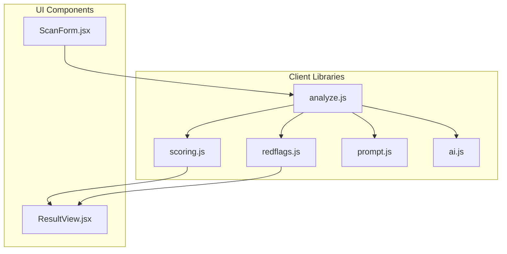
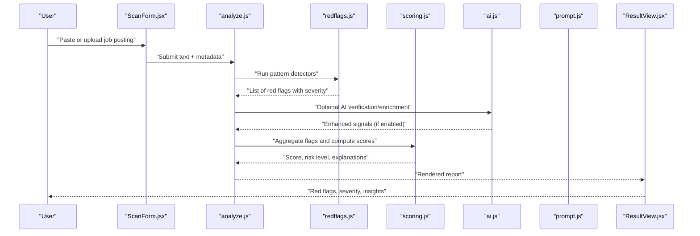
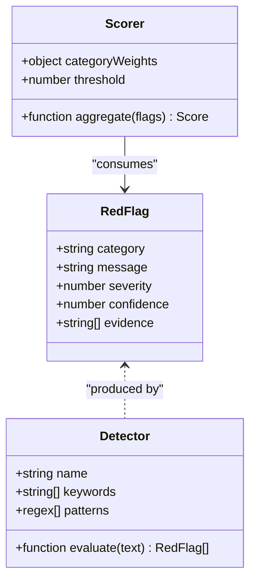
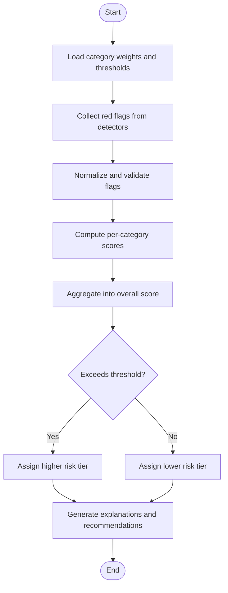
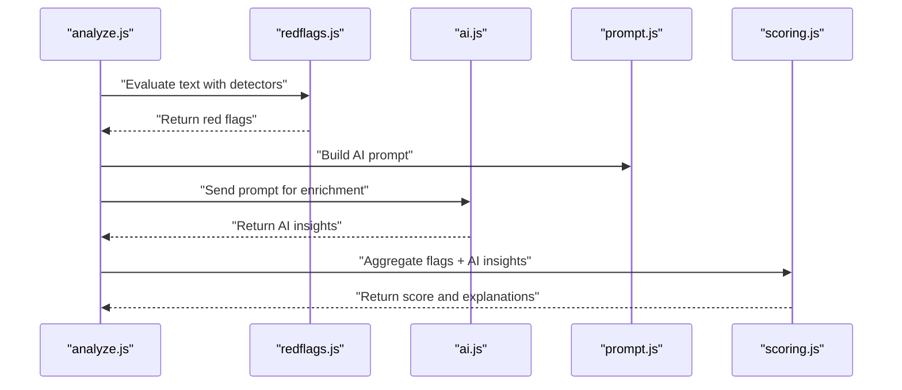
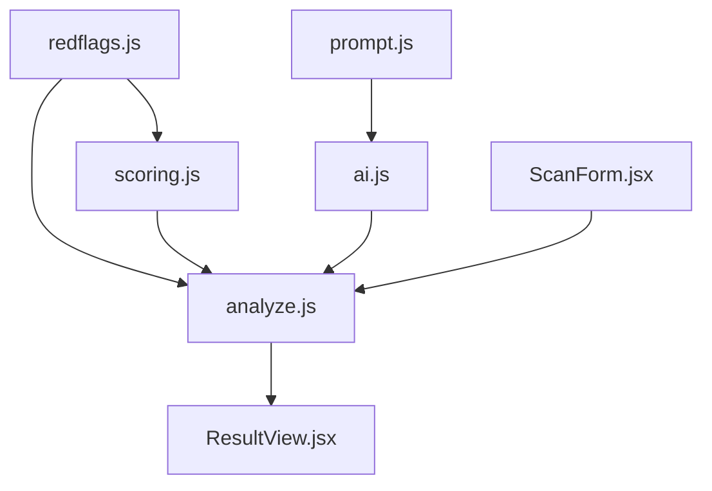

# Red Flag Detection System

<cite>
**Referenced Files in This Document**
- [redflags.js](file://src/lib/redflags.js)
- [redflags.test.js](file://src/lib/redflags.test.js)
- [scoring.js](file://src/lib/scoring.js)
- [scoring.test.js](file://src/lib/scoring.test.js)
- [analyze.js](file://src/lib/analyze.js)
- [prompt.js](file://src/lib/prompt.js)
- [ai.js](file://src/lib/ai.js)
- [ResultView.jsx](file://src/components/ResultView.jsx)
- [ScanForm.jsx](file://src/components/ScanForm.jsx)
</cite>

## Table of Contents
1. [Introduction](#introduction)
2. [Project Structure](#project-structure)
3. [Core Components](#core-components)
4. [Architecture Overview](#architecture-overview)
5. [Detailed Component Analysis](#detailed-component-analysis)
6. [Dependency Analysis](#dependency-analysis)
7. [Performance Considerations](#performance-considerations)
8. [Troubleshooting Guide](#troubleshooting-guide)
9. [Conclusion](#conclusion)
10. [Appendices](#appendices)

## Introduction
This document explains the red flag detection system in ApplyGuard PH, focusing on how job postings are analyzed to identify potential warning signs such as salary transparency issues, unrealistic expectations, poor culture indicators, and problematic employment terms. It details the pattern matching logic used to detect vague descriptions, excessive overtime requirements, lack of growth opportunities, and other concerning patterns. The document also covers severity classification, customization options for thresholds, integration with the overall scoring system, and actionable insights provided to job seekers.

## Project Structure
The red flag detection system is implemented primarily in client-side JavaScript modules under src/lib, with UI components that present results and accept input. Key files include:
- Pattern definitions and detection logic
- Severity classification and risk scoring
- Integration with analysis orchestration and AI features
- UI components for scanning and result display

**Diagram sources**
- [redflags.js](file://src/lib/redflags.js)
- [scoring.js](file://src/lib/scoring.js)
- [analyze.js](file://src/lib/analyze.js)
- [prompt.js](file://src/lib/prompt.js)
- [ai.js](file://src/lib/ai.js)
- [ResultView.jsx](file://src/components/ResultView.jsx)
- [ScanForm.jsx](file://src/components/ScanForm.jsx)

**Section sources**
- [redflags.js](file://src/lib/redflags.js)
- [scoring.js](file://src/lib/scoring.js)
- [analyze.js](file://src/lib/analyze.js)
- [prompt.js](file://src/lib/prompt.js)
- [ai.js](file://src/lib/ai.js)
- [ResultView.jsx](file://src/components/ResultView.jsx)
- [ScanForm.jsx](file://src/components/ScanForm.jsx)

## Core Components
- Red flag detectors: Define categories (e.g., compensation, workload, culture, growth), rules, and severity levels. They scan text fields from a job posting and return flagged items with context and confidence.
- Scoring engine: Aggregates red flags into an overall score, applies weights by category and severity, and produces a risk profile with explanations.
- Orchestration layer: Coordinates parsing, rule evaluation, optional AI-assisted checks, and final report generation.
- UI integration: Presents detected red flags, severity, and recommendations to users.

Key responsibilities:
- Pattern matching against structured and unstructured text
- Normalization and tokenization strategies
- Threshold-based activation and severity mapping
- Score aggregation and explanation generation
- User-facing summaries and next actions

**Section sources**
- [redflags.js](file://src/lib/redflags.js)
- [scoring.js](file://src/lib/scoring.js)
- [analyze.js](file://src/lib/analyze.js)
- [ResultView.jsx](file://src/components/ResultView.jsx)

## Architecture Overview
The red flag detection pipeline processes job posting content through deterministic rules and optional AI assistance, then aggregates findings into a unified risk assessment.

**Diagram sources**
- [ScanForm.jsx](file://src/components/ScanForm.jsx)
- [analyze.js](file://src/lib/analyze.js)
- [redflags.js](file://src/lib/redflags.js)
- [scoring.js](file://src/lib/scoring.js)
- [ai.js](file://src/lib/ai.js)
- [prompt.js](file://src/lib/prompt.js)
- [ResultView.jsx](file://src/components/ResultView.jsx)

## Detailed Component Analysis

### Red Flag Detectors
The detector module defines categories and rules to identify warning signs across multiple dimensions:
- Compensation and benefits: Missing salary ranges, ambiguous pay structures, unpaid trial periods, unclear bonus/commission terms.
- Workload and schedule: Excessive overtime expectations, weekend/holiday work without compensation, vague “flexible hours” implying long hours.
- Culture and environment: Language indicating high pressure, blame culture, lack of feedback mechanisms, discriminatory phrasing.
- Growth and development: No mention of training, mentorship, career paths, or skill development.
- Employment terms: Probationary traps, non-compete clauses, unilateral change rights, lack of leave policies.

Detection methods:
- Keyword and phrase matching with normalization (case-insensitive, punctuation handling).
- Regex patterns for numeric ranges, percentages, and time units.
- Contextual heuristics (e.g., absence of expected sections like “Compensation”).
- Confidence scoring based on match strength and contextual cues.

Severity classification:
- Critical: Immediate disqualifiers (e.g., illegal practices, explicit discrimination, unpaid mandatory work).
- High: Strong indicators of risk (e.g., no salary range, excessive overtime language).
- Medium: Moderate concerns (e.g., vague growth opportunities, weak benefits).
- Low: Minor observations (e.g., missing optional perks).

Customization options:
- Category weights to emphasize certain risks.
- Thresholds per category to tune sensitivity.
- Toggleable detectors (e.g., enable/disable AI-assisted checks).
- Custom keyword lists and regex patterns.

Examples of detected issues and risk levels:
- “Salary not disclosed” → High severity; contributes significantly to overall risk.
- “Must be willing to work weekends without extra pay” → Critical severity; strong negative signal.
- “No clear promotion path mentioned” → Medium severity; indicates limited growth visibility.
- “Flexible hours” without further detail → Low severity; may imply long hours depending on context.

Integration with scoring:
- Each red flag carries a weight derived from its severity and category importance.
- Scores are normalized to a consistent scale and combined into an overall risk score.
- Explanations link specific flags to their impact on the final score.

**Section sources**
- [redflags.js](file://src/lib/redflags.js)
- [redflags.test.js](file://src/lib/redflags.test.js)

#### Class Diagram: Detector Model

**Diagram sources**
- [redflags.js](file://src/lib/redflags.js)
- [scoring.js](file://src/lib/scoring.js)

### Scoring Engine
The scoring engine transforms raw red flags into a unified risk profile:
- Weighted aggregation: Applies category-specific weights and severity multipliers.
- Thresholding: Determines pass/fail or tiered risk levels based on configured thresholds.
- Explanation generation: Maps aggregated scores back to actionable insights and recommended next steps.
- Normalization: Ensures scores are comparable across different postings and configurations.

Configuration inputs:
- Category weights (e.g., compensation > culture > growth).
- Severity-to-weight mapping.
- Global thresholds for risk tiers.
- Optional AI enrichment factor if enabled.

Outputs:
- Overall score and risk tier.
- Category breakdowns.
- Top contributing red flags.
- Actionable recommendations for job seekers.

**Section sources**
- [scoring.js](file://src/lib/scoring.js)
- [scoring.test.js](file://src/lib/scoring.test.js)

#### Flowchart: Score Aggregation

**Diagram sources**
- [scoring.js](file://src/lib/scoring.js)

### Orchestration Layer
The analyzer coordinates the full pipeline:
- Input parsing: Extracts relevant fields (title, description, requirements, benefits, compensation).
- Rule execution: Invokes detectors and collects red flags.
- AI assistance: Optionally calls AI services for deeper semantic checks using prompts.
- Report assembly: Combines flags, scores, and explanations into a user-friendly report.

Integration points:
- Prompt templates for AI queries.
- AI service interface for asynchronous processing.
- UI components for input and output rendering.

**Section sources**
- [analyze.js](file://src/lib/analyze.js)
- [prompt.js](file://src/lib/prompt.js)
- [ai.js](file://src/lib/ai.js)

#### Sequence Diagram: Analysis Pipeline

**Diagram sources**
- [analyze.js](file://src/lib/analyze.js)
- [redflags.js](file://src/lib/redflags.js)
- [ai.js](file://src/lib/ai.js)
- [prompt.js](file://src/lib/prompt.js)
- [scoring.js](file://src/lib/scoring.js)

### UI Integration
- ScanForm accepts job posting text and triggers analysis.
- ResultView renders red flags, severity, and recommendations.
- Settings allow users to adjust thresholds and category weights.

User experience considerations:
- Clear labeling of severity levels.
- Concise explanations tied to specific parts of the posting.
- Actionable next steps (e.g., ask about salary range, clarify overtime policy).

**Section sources**
- [ScanForm.jsx](file://src/components/ScanForm.jsx)
- [ResultView.jsx](file://src/components/ResultView.jsx)

## Dependency Analysis
The red flag system depends on modular libraries for detection, scoring, and optional AI enhancement. UI components depend on the orchestration layer to produce reports.

**Diagram sources**
- [redflags.js](file://src/lib/redflags.js)
- [scoring.js](file://src/lib/scoring.js)
- [analyze.js](file://src/lib/analyze.js)
- [ai.js](file://src/lib/ai.js)
- [prompt.js](file://src/lib/prompt.js)
- [ResultView.jsx](file://src/components/ResultView.jsx)
- [ScanForm.jsx](file://src/components/ScanForm.jsx)

**Section sources**
- [redflags.js](file://src/lib/redflags.js)
- [scoring.js](file://src/lib/scoring.js)
- [analyze.js](file://src/lib/analyze.js)
- [ai.js](file://src/lib/ai.js)
- [prompt.js](file://src/lib/prompt.js)
- [ResultView.jsx](file://src/components/ResultView.jsx)
- [ScanForm.jsx](file://src/components/ScanForm.jsx)

## Performance Considerations
- Deterministic rule evaluation is lightweight and suitable for real-time scanning.
- AI-assisted checks should be optional and cached when possible to reduce latency.
- Preprocessing (normalization, tokenization) should minimize redundant operations.
- Batch processing can improve throughput when analyzing multiple postings.

[No sources needed since this section provides general guidance]

## Troubleshooting Guide
Common issues and resolutions:
- False positives due to generic phrases: Adjust thresholds or refine keyword lists.
- Missed detections: Expand regex patterns and add domain-specific terms.
- Inconsistent scores across runs: Ensure deterministic preprocessing and stable configuration.
- AI enrichment failures: Verify API availability and fallback to rule-only mode.

Validation resources:
- Unit tests for detectors and scoring logic help confirm behavior changes.

**Section sources**
- [redflags.test.js](file://src/lib/redflags.test.js)
- [scoring.test.js](file://src/lib/scoring.test.js)

## Conclusion
The red flag detection system combines robust pattern matching with configurable severity and scoring to provide job seekers with clear, actionable insights. By tuning thresholds and weights, teams can adapt the system to local labor norms and user preferences while maintaining reliable risk assessments. Optional AI assistance enhances semantic understanding without compromising performance when used judiciously.

[No sources needed since this section summarizes without analyzing specific files]

## Appendices

### Configuration Reference
- Category weights: Control influence of each risk category on the overall score.
- Severity mapping: Defines how critical/high/medium/low flags translate into numerical weights.
- Thresholds: Determine risk tiers and pass/fail boundaries.
- Custom keywords and patterns: Extend detection coverage for industry-specific terms.

**Section sources**
- [scoring.js](file://src/lib/scoring.js)
- [redflags.js](file://src/lib/redflags.js)