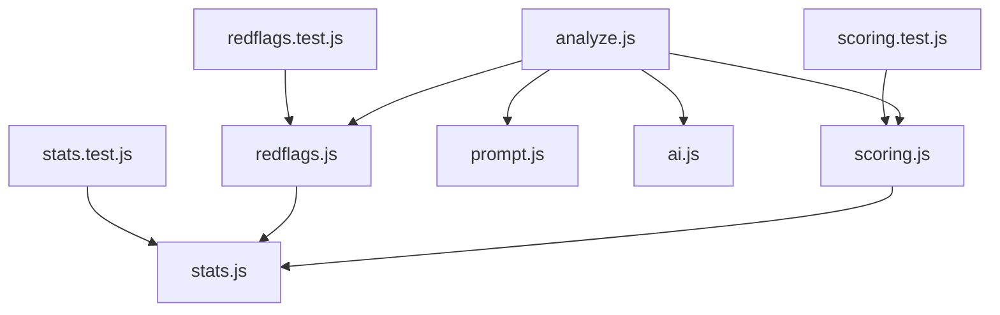
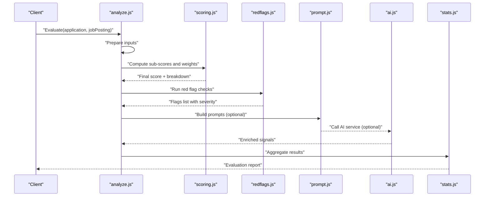
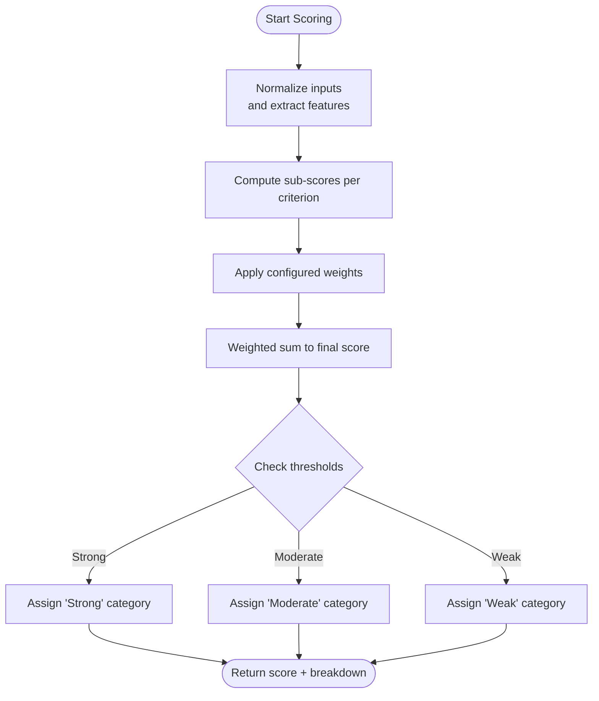
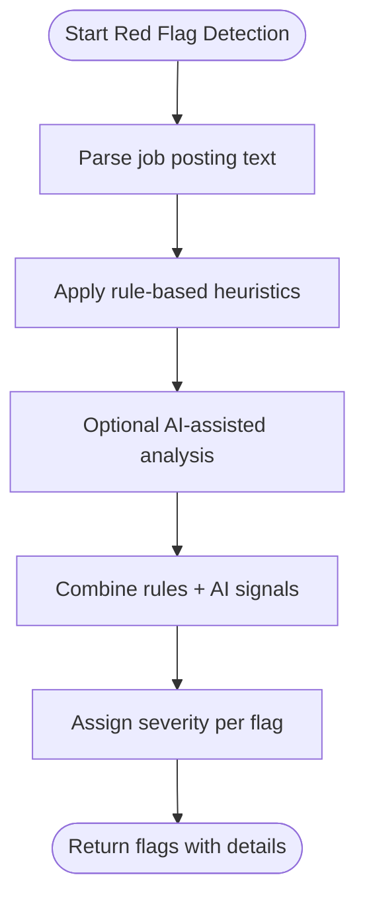
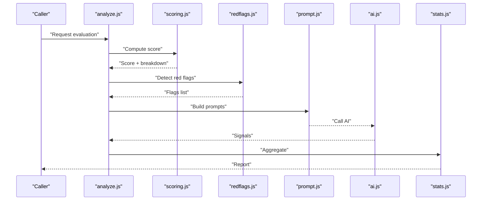
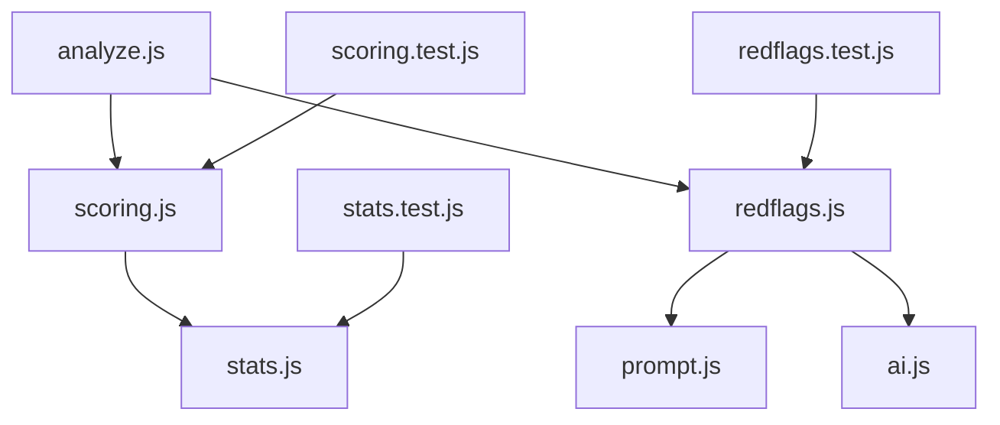

# Scoring & Evaluation System

<cite>
**Referenced Files in This Document**
- [scoring.js](file://src/lib/scoring.js)
- [scoring.test.js](file://src/lib/scoring.test.js)
- [redflags.js](file://src/lib/redflags.js)
- [redflags.test.js](file://src/lib/redflags.test.js)
- [analyze.js](file://src/lib/analyze.js)
- [prompt.js](file://src/lib/prompt.js)
- [ai.js](file://src/lib/ai.js)
- [stats.js](file://src/lib/stats.js)
- [stats.test.js](file://src/lib/stats.test.js)
</cite>

## Table of Contents
1. [Introduction](#introduction)
2. [Project Structure](#project-structure)
3. [Core Components](#core-components)
4. [Architecture Overview](#architecture-overview)
5. [Detailed Component Analysis](#detailed-component-analysis)
6. [Dependency Analysis](#dependency-analysis)
7. [Performance Considerations](#performance-considerations)
8. [Troubleshooting Guide](#troubleshooting-guide)
9. [Conclusion](#conclusion)
10. [Appendices](#appendices)

## Introduction
This document explains the scoring and evaluation system used by ApplyGuard PH to assess job applications and detect red flags in job postings. It covers:
- How application scores are computed from multiple criteria (experience match, skill alignment, company fit).
- The weighting system that combines sub-scores into a final score.
- Red flag detection mechanisms for issues such as salary transparency, company culture indicators, and employment terms.
- Thresholds, customization options, and how results are aggregated and persisted.

The goal is to provide both technical depth and accessible explanations so that developers, product owners, and evaluators can understand and extend the system confidently.

## Project Structure
The scoring and evaluation logic resides primarily under src/lib with supporting modules for AI prompts, statistics, and tests. Key files include:
- Scoring engine and aggregation
- Red flag detection rules
- Analysis orchestration and prompt management
- AI integration helpers
- Statistics utilities for result summaries

**Diagram sources**
- [analyze.js](file://src/lib/analyze.js)
- [scoring.js](file://src/lib/scoring.js)
- [redflags.js](file://src/lib/redflags.js)
- [prompt.js](file://src/lib/prompt.js)
- [ai.js](file://src/lib/ai.js)
- [stats.js](file://src/lib/stats.js)
- [scoring.test.js](file://src/lib/scoring.test.js)
- [redflags.test.js](file://src/lib/redflags.test.js)
- [stats.test.js](file://src/lib/stats.test.js)

**Section sources**
- [analyze.js](file://src/lib/analyze.js)
- [scoring.js](file://src/lib/scoring.js)
- [redflags.js](file://src/lib/redflags.js)
- [prompt.js](file://src/lib/prompt.js)
- [ai.js](file://src/lib/ai.js)
- [stats.js](file://src/lib/stats.js)
- [scoring.test.js](file://src/lib/scoring.test.js)
- [redflags.test.js](file://src/lib/redflags.test.js)
- [stats.test.js](file://src/lib/stats.test.js)

## Core Components
- Scoring Engine: Computes sub-scores per criterion, applies weights, normalizes, and aggregates into a final score. Provides thresholds and category labels.
- Red Flag Detector: Evaluates job posting text against rule-based heuristics and optional AI-assisted signals to identify potential issues across salary transparency, culture, and employment terms.
- Analysis Orchestrator: Coordinates data preparation, invokes scoring and red flag detection, and returns structured results.
- Prompt Manager: Builds prompts for AI features when needed.
- AI Helper: Interfaces with external AI services for enrichment or classification tasks.
- Stats Utilities: Aggregates and summarizes scores and flags for reporting.

**Section sources**
- [scoring.js](file://src/lib/scoring.js)
- [redflags.js](file://src/lib/redflags.js)
- [analyze.js](file://src/lib/analyze.js)
- [prompt.js](file://src/lib/prompt.js)
- [ai.js](file://src/lib/ai.js)
- [stats.js](file://src/lib/stats.js)

## Architecture Overview
The evaluation pipeline processes an application and a target job posting through three main stages:
1. Data Preparation: Normalize inputs (resume/profile, job description, company info).
2. Scoring: Compute weighted sub-scores and produce a final score with categories.
3. Red Flag Detection: Identify risks and concerns; combine with scoring to form a comprehensive evaluation.

**Diagram sources**
- [analyze.js](file://src/lib/analyze.js)
- [scoring.js](file://src/lib/scoring.js)
- [redflags.js](file://src/lib/redflags.js)
- [prompt.js](file://src/lib/prompt.js)
- [ai.js](file://src/lib/ai.js)
- [stats.js](file://src/lib/stats.js)

## Detailed Component Analysis

### Scoring Engine
Responsibilities:
- Define criteria and their weights (e.g., experience match, skill alignment, company fit).
- Compute normalized sub-scores per criterion.
- Aggregate into a final score using weighted sum.
- Assign category labels based on thresholds.
- Provide customization hooks for different scenarios (e.g., role-specific weight adjustments).

Key concepts:
- Sub-score calculation: Each criterion yields a value in a normalized range.
- Weighting system: Weights reflect importance; they may be configurable per scenario.
- Normalization: Ensures comparability across heterogeneous metrics.
- Thresholds: Map final scores to qualitative categories (e.g., strong, moderate, weak).

Customization options:
- Role-specific weights: Adjust emphasis for certain roles or seniority levels.
- Criterion toggles: Enable/disable specific criteria depending on context.
- Threshold tuning: Adapt category boundaries for different markets or industries.

**Diagram sources**
- [scoring.js](file://src/lib/scoring.js)

**Section sources**
- [scoring.js](file://src/lib/scoring.js)
- [scoring.test.js](file://src/lib/scoring.test.js)

### Red Flag Detection
Responsibilities:
- Detect potential issues in job postings across key areas:
  - Salary transparency: Missing ranges, vague compensation language.
  - Company culture indicators: Negative tone, excessive demands, lack of inclusivity cues.
  - Employment terms: Ambiguous contracts, non-standard clauses, unclear expectations.
- Combine rule-based heuristics with optional AI-assisted signals for richer detection.
- Return flagged items with severity and rationale references.

Detection approach:
- Rule-based checks: Keyword patterns, structural cues, and policy violations.
- Optional AI signals: Use prompts and AI helper to classify or enrich findings.
- Severity scoring: Assign risk levels to each flag for prioritization.

**Diagram sources**
- [redflags.js](file://src/lib/redflags.js)
- [prompt.js](file://src/lib/prompt.js)
- [ai.js](file://src/lib/ai.js)

**Section sources**
- [redflags.js](file://src/lib/redflags.js)
- [redflags.test.js](file://src/lib/redflags.test.js)
- [prompt.js](file://src/lib/prompt.js)
- [ai.js](file://src/lib/ai.js)

### Analysis Orchestrator
Responsibilities:
- Coordinate input normalization and feature extraction.
- Invoke scoring and red flag detection.
- Integrate optional AI outputs.
- Produce a unified evaluation report including score, breakdown, and flags.

**Diagram sources**
- [analyze.js](file://src/lib/analyze.js)
- [scoring.js](file://src/lib/scoring.js)
- [redflags.js](file://src/lib/redflags.js)
- [prompt.js](file://src/lib/prompt.js)
- [ai.js](file://src/lib/ai.js)
- [stats.js](file://src/lib/stats.js)

**Section sources**
- [analyze.js](file://src/lib/analyze.js)
- [stats.js](file://src/lib/stats.js)

### Metrics and Algorithms
- Experience Match: Quantifies overlap between candidate experience and job requirements. Uses normalized counts or similarity measures to derive a sub-score.
- Skill Alignment: Measures keyword and competency alignment between resume and job description. May incorporate semantic similarity via AI signals.
- Company Fit: Assesses cultural and organizational alignment based on company description and values extracted from the posting.

Aggregation:
- Final Score = Sum(weight_i × normalized_sub_score_i) across all criteria i.
- Category assignment based on threshold bands defined in configuration.

Thresholds and Customization:
- Thresholds are configurable to adapt to market conditions or role types.
- Weights can be tuned per scenario (e.g., prioritize skills for technical roles, emphasize culture for team-centric roles).

**Section sources**
- [scoring.js](file://src/lib/scoring.js)
- [scoring.test.js](file://src/lib/scoring.test.js)

## Dependency Analysis
The evaluation system has clear separation of concerns:
- analyze.js orchestrates the flow and depends on scoring.js and redflags.js.
- scoring.js may depend on stats.js for aggregation and reporting.
- redflags.js may use prompt.js and ai.js for optional AI-assisted detection.
- Tests validate behavior for scoring, red flags, and stats.

**Diagram sources**
- [analyze.js](file://src/lib/analyze.js)
- [scoring.js](file://src/lib/scoring.js)
- [redflags.js](file://src/lib/redflags.js)
- [prompt.js](file://src/lib/prompt.js)
- [ai.js](file://src/lib/ai.js)
- [stats.js](file://src/lib/stats.js)
- [scoring.test.js](file://src/lib/scoring.test.js)
- [redflags.test.js](file://src/lib/redflags.test.js)
- [stats.test.js](file://src/lib/stats.test.js)

**Section sources**
- [analyze.js](file://src/lib/analyze.js)
- [scoring.js](file://src/lib/scoring.js)
- [redflags.js](file://src/lib/redflags.js)
- [prompt.js](file://src/lib/prompt.js)
- [ai.js](file://src/lib/ai.js)
- [stats.js](file://src/lib/stats.js)
- [scoring.test.js](file://src/lib/scoring.test.js)
- [redflags.test.js](file://src/lib/redflags.test.js)
- [stats.test.js](file://src/lib/stats.test.js)

## Performance Considerations
- Prefer deterministic rule-based checks for speed-critical paths; reserve AI calls for optional enrichment.
- Cache repeated computations where possible (e.g., precomputed embeddings or normalized features).
- Batch operations when invoking AI services to reduce latency and cost.
- Keep threshold and weight configurations centralized for easy tuning without code changes.

[No sources needed since this section provides general guidance]

## Troubleshooting Guide
Common issues and resolutions:
- Inconsistent scores across runs: Verify normalization steps and ensure stable inputs; check test coverage for edge cases.
- Missing red flags: Review rule definitions and consider enabling AI-assisted signals for ambiguous cases.
- Unexpected categories: Inspect threshold settings and adjust per market or role type.
- Slow evaluations: Reduce AI calls, enable caching, and profile bottlenecks in scoring and red flag detection.

Validation resources:
- Unit tests for scoring, red flags, and stats help confirm expected behaviors and regression safety.

**Section sources**
- [scoring.test.js](file://src/lib/scoring.test.js)
- [redflags.test.js](file://src/lib/redflags.test.js)
- [stats.test.js](file://src/lib/stats.test.js)

## Conclusion
The ApplyGuard PH scoring and evaluation system combines transparent, configurable algorithms with robust red flag detection to deliver actionable insights. By separating scoring, red flag detection, and orchestration, the system remains extensible and maintainable. Teams can tailor weights, thresholds, and criteria to diverse scenarios while leveraging optional AI assistance for richer signals.

[No sources needed since this section summarizes without analyzing specific files]

## Appendices

### Configuration Reference
- Weights: Per-criterion importance factors; adjustable per scenario.
- Thresholds: Score bands mapping to qualitative categories.
- Criterion toggles: Enable/disable criteria based on context.
- AI flags: Optional switches to include AI-assisted signals.

[No sources needed since this section provides general guidance]