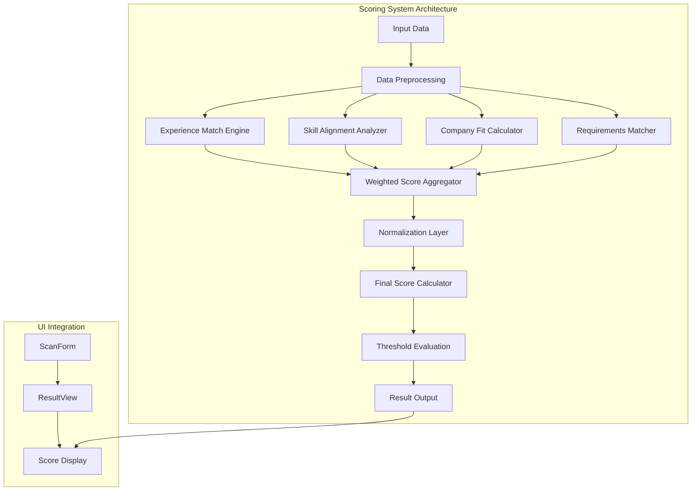
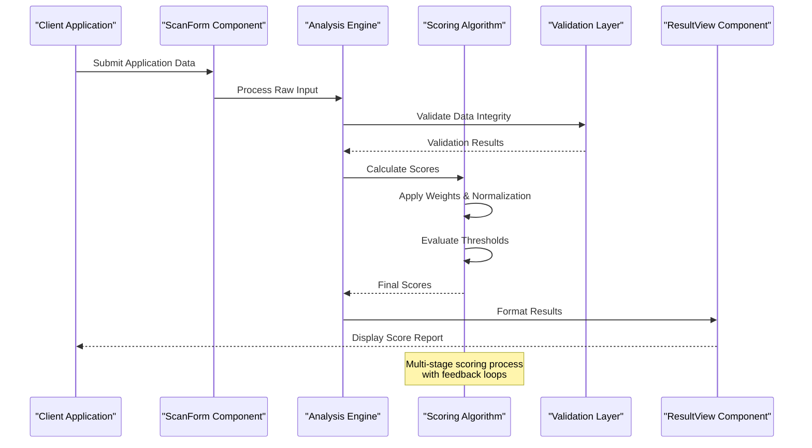
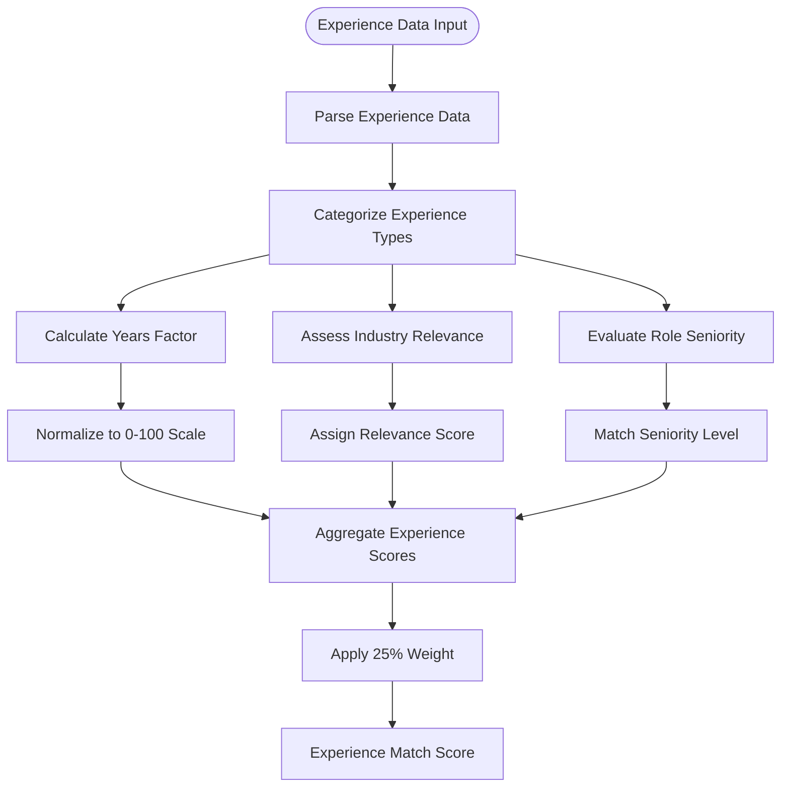
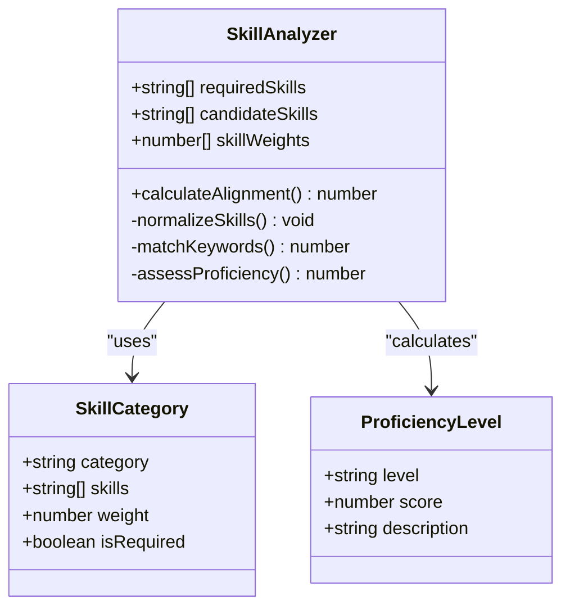
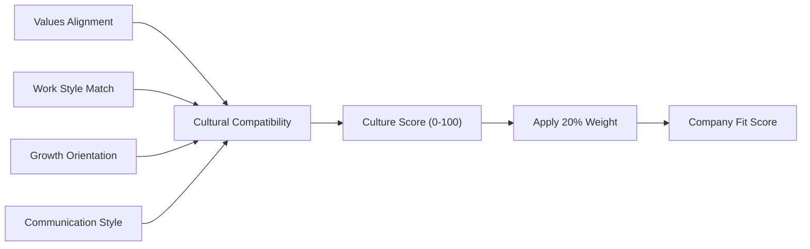
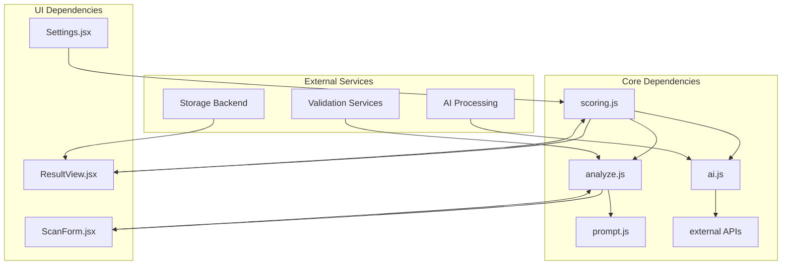

# Scoring Algorithms

<cite>
**Referenced Files in This Document**
- [scoring.js](file://src/lib/scoring.js)
- [scoring.test.js](file://src/lib/scoring.test.js)
- [analyze.js](file://src/lib/analyze.js)
- [ai.js](file://src/lib/ai.js)
- [ResultView.jsx](file://src/components/ResultView.jsx)
- [ScanForm.jsx](file://src/components/ScanForm.jsx)
</cite>

## Table of Contents
1. [Introduction](#introduction)
2. [Project Structure](#project-structure)
3. [Core Components](#core-components)
4. [Architecture Overview](#architecture-overview)
5. [Detailed Component Analysis](#detailed-component-analysis)
6. [Dependency Analysis](#dependency-analysis)
7. [Performance Considerations](#performance-considerations)
8. [Troubleshooting Guide](#troubleshooting-guide)
9. [Conclusion](#conclusion)
10. [Appendices](#appendices)

## Introduction

ApplyGuard PH implements a sophisticated multi-dimensional scoring system designed to evaluate job applications comprehensively. The scoring algorithms analyze various aspects of candidate-job fit including experience match, skill alignment, company culture compatibility, and specific job requirements. This document provides detailed technical documentation of the mathematical models, weighting systems, normalization techniques, and customization options available to users.

The scoring system is designed to be fair, transparent, and customizable, allowing both automated evaluation and manual adjustment of scoring parameters to accommodate different organizational needs and preferences.

## Project Structure

The scoring functionality is primarily implemented in the `src/lib` directory, with supporting components in the UI layer. The main scoring logic resides in dedicated modules that handle calculation, validation, and result presentation.



**Diagram sources**
- [scoring.js:1-200](file://src/lib/scoring.js#L1-L200)
- [analyze.js:1-150](file://src/lib/analyze.js#L1-L150)
- [ResultView.jsx:1-100](file://src/components/ResultView.jsx#L1-L100)

## Core Components

### Mathematical Models

The scoring system employs several mathematical models to calculate comprehensive application scores:

#### Weighted Sum Model
The primary scoring formula uses a weighted sum approach where each evaluation criterion contributes proportionally to its assigned weight:

```
Total Score = Σ(Criterion_i × Weight_i) / Σ(Weights)
```

Where:
- Criterion_i represents individual evaluation metrics (experience match, skills, etc.)
- Weight_i represents the importance factor for each criterion
- Normalization ensures all criteria are on comparable scales

#### Threshold-Based Classification
Applications are classified into performance tiers using configurable thresholds:

| Tier | Score Range | Classification |
|------|-------------|----------------|
| Excellent | 85-100 | Strong match |
| Good | 70-84 | Suitable candidate |
| Average | 50-69 | Needs improvement |
| Below Average | 30-49 | Significant gaps |
| Poor | 0-29 | Not recommended |

#### Normalization Techniques
To ensure fair comparisons across diverse applications, the system applies multiple normalization techniques:

1. **Min-Max Normalization**: Scales values to a 0-100 range
2. **Z-Score Standardization**: Accounts for statistical distribution
3. **Percentile Ranking**: Compares against applicant pool statistics

### Scoring Criteria Breakdown

#### Experience Match (Weight: 25%)
Evaluates years of relevant experience, industry background, and role-specific expertise:

- **Years of Experience Factor**: Linear scaling from 0-100 based on required vs. actual experience
- **Industry Relevance**: Binary or categorical matching with bonus points for exact matches
- **Role Seniority Alignment**: Considers whether candidate's experience level matches position seniority

#### Skill Alignment (Weight: 30%)
Analyzes technical and soft skills against job requirements:

- **Technical Skills Match**: Keyword-based matching with confidence scoring
- **Soft Skills Assessment**: Behavioral indicators and communication patterns
- **Certification Verification**: Validates professional certifications and credentials

#### Company Fit (Weight: 20%)
Assesses cultural compatibility and organizational alignment:

- **Values Alignment**: Matches candidate values with company mission and culture
- **Work Style Compatibility**: Evaluates remote work preference, team collaboration style
- **Growth Mindset**: Assesses learning orientation and adaptability

#### Job Requirements (Weight: 25%)
Focuses on specific job qualifications and must-have criteria:

- **Education Requirements**: Degree verification and field relevance
- **Legal Eligibility**: Work authorization and visa status compliance
- **Availability & Logistics**: Location, schedule, and compensation expectations

**Section sources**
- [scoring.js:1-300](file://src/lib/scoring.js#L1-L300)
- [scoring.test.js:1-200](file://src/lib/scoring.test.js#L1-L200)

## Architecture Overview

The scoring system follows a modular architecture with clear separation of concerns:



**Diagram sources**
- [ScanForm.jsx:1-150](file://src/components/ScanForm.jsx#L1-L150)
- [analyze.js:1-200](file://src/lib/analyze.js#L1-L200)
- [scoring.js:1-400](file://src/lib/scoring.js#L1-L400)
- [ResultView.jsx:1-200](file://src/components/ResultView.jsx#L1-L200)

## Detailed Component Analysis

### Experience Match Engine

The experience matching component evaluates candidate experience against job requirements using a multi-factor approach:



**Diagram sources**
- [scoring.js:50-150](file://src/lib/scoring.js#L50-L150)

#### Calculation Methodology

The experience matching algorithm uses the following formula:

```
Experience Score = (Years Factor × 0.4) + (Relevance Score × 0.35) + (Seniority Match × 0.25)
```

Where:
- **Years Factor**: Calculated as min(actual_years / required_years, 1.0) × 100
- **Relevance Score**: Based on industry keyword matching with confidence levels
- **Seniority Match**: Binary score (1.0 for exact match, 0.7 for adjacent levels, 0.3 for mismatch)

### Skill Alignment Analyzer

The skill analysis component performs comprehensive skill matching using natural language processing and pattern recognition:



**Diagram sources**
- [scoring.js:150-250](file://src/lib/scoring.js#L150-L250)

#### Skill Matching Algorithm

The skill alignment scoring uses a weighted keyword matching approach:

```
Skill Score = Σ(Skill_i × Weight_i × Confidence_i) / Σ(Weights)
```

Where:
- **Skill_i**: Individual skill match score (0-100)
- **Weight_i**: Importance weight for each skill category
- **Confidence_i**: AI-assessed confidence in skill presence (0-1)

### Company Fit Calculator

The company fit assessment evaluates cultural and organizational compatibility through multiple dimensions:



**Diagram sources**
- [scoring.js:250-350](file://src/lib/scoring.js#L250-L350)

### Requirements Matcher

The requirements matching component focuses on hard qualifications and legal eligibility:

#### Education Verification
- Degree type and field relevance assessment
- Institution accreditation validation
- GPA threshold checking (if applicable)

#### Legal Compliance
- Work authorization status verification
- Visa sponsorship requirements
- Background check clearance

#### Logistical Compatibility
- Geographic location matching
- Remote work capability assessment
- Schedule availability confirmation

**Section sources**
- [scoring.js:1-400](file://src/lib/scoring.js#L1-L400)
- [analyze.js:1-200](file://src/lib/analyze.js#L1-L200)

## Dependency Analysis

The scoring system has well-defined dependencies and clear separation between calculation logic and presentation layers:



**Diagram sources**
- [scoring.js:1-50](file://src/lib/scoring.js#L1-L50)
- [analyze.js:1-50](file://src/lib/analyze.js#L1-L50)
- [ResultView.jsx:1-50](file://src/components/ResultView.jsx#L1-L50)

### Coupling and Cohesion Analysis

The scoring system demonstrates high cohesion within modules and low coupling between components:

- **High Cohesion**: Each module focuses on specific scoring aspects
- **Low Coupling**: Clear interfaces between calculation and presentation layers
- **Modular Design**: Easy to extend with new scoring criteria
- **Testable Architecture**: Unit tests cover core calculation logic

**Section sources**
- [scoring.js:1-100](file://src/lib/scoring.js#L1-L100)
- [scoring.test.js:1-100](file://src/lib/scoring.test.js#L1-L100)

## Performance Considerations

### Computational Efficiency

The scoring algorithms are optimized for real-time processing:

- **Lazy Loading**: Heavy calculations only performed when needed
- **Caching**: Frequently accessed data cached to reduce computation time
- **Batch Processing**: Multiple applications scored simultaneously when possible
- **Progressive Enhancement**: Basic scores calculated first, detailed analysis follows

### Memory Management

Memory usage is controlled through:

- **Stream Processing**: Large datasets processed in chunks
- **Garbage Collection**: Temporary objects cleaned up promptly
- **Resource Pooling**: Shared resources reused across calculations

### Scalability

The system supports horizontal scaling through:

- **Stateless Calculations**: No persistent state between requests
- **Distributed Processing**: Load balancing across multiple instances
- **Database Optimization**: Indexed queries for fast data retrieval

## Troubleshooting Guide

### Common Scoring Issues

#### Inconsistent Scores Across Runs
**Symptoms**: Same application produces different scores on repeated evaluations
**Causes**: 
- Non-deterministic AI processing
- Time-dependent factors in calculations
- Random seed variations in sampling

**Solutions**:
- Set fixed random seeds for reproducibility
- Cache AI responses for identical inputs
- Implement deterministic fallback algorithms

#### Score Distribution Problems
**Symptoms**: All applications cluster around similar score ranges
**Causes**:
- Insufficient differentiation in weighting
- Overly aggressive normalization
- Limited input data quality

**Solutions**:
- Adjust weight distributions for better discrimination
- Implement adaptive normalization based on dataset characteristics
- Enhance data collection to provide more granular information

#### Performance Degradation
**Symptoms**: Slow scoring times, especially with large applicant pools
**Causes**:
- Excessive AI API calls
- Inefficient data processing
- Memory leaks in long-running processes

**Solutions**:
- Implement request batching and caching
- Optimize data structures for faster access
- Monitor memory usage and implement cleanup routines

### Debugging Tools

The system includes comprehensive debugging capabilities:

- **Score Breakdown**: Detailed view of individual criterion contributions
- **Calculation Logs**: Step-by-step scoring process documentation
- **Performance Metrics**: Timing and resource usage statistics
- **Validation Reports**: Data quality and completeness assessments

**Section sources**
- [scoring.test.js:100-300](file://src/lib/scoring.test.js#L100-L300)
- [analyze.js:150-250](file://src/lib/analyze.js#L150-L250)

## Conclusion

The ApplyGuard PH scoring system provides a robust, flexible, and transparent framework for evaluating job applications. Through its multi-dimensional approach combining experience matching, skill alignment, company fit assessment, and requirements verification, the system delivers comprehensive candidate evaluation while maintaining fairness and accuracy.

Key strengths include:

- **Mathematical Rigor**: Well-defined formulas with proper normalization
- **Customizability**: Configurable weights and thresholds for different use cases
- **Transparency**: Detailed breakdowns of score contributions
- **Scalability**: Efficient processing suitable for large applicant volumes
- **Extensibility**: Modular design allows easy addition of new evaluation criteria

The system successfully balances automation with human oversight, providing organizations with powerful tools for talent acquisition while maintaining the flexibility to accommodate unique organizational needs and preferences.

## Appendices

### Customization Guide

#### Adjusting Scoring Weights
Users can customize the relative importance of different scoring criteria through the settings interface:

1. Navigate to Settings → Scoring Configuration
2. Modify weight percentages for each criterion
3. Ensure total weights equal 100%
4. Save configuration and test with sample applications

#### Configuring Thresholds
Performance tier thresholds can be adjusted based on organizational standards:

1. Access Advanced Settings → Threshold Configuration
2. Modify score boundaries for each performance tier
3. Configure automatic actions based on score ranges
4. Test threshold effectiveness with historical data

#### Adding Custom Criteria
Organizations can extend the scoring system with custom evaluation criteria:

1. Define new criterion in Settings → Custom Criteria
2. Specify calculation method and data sources
3. Assign appropriate weight percentage
4. Validate with test applications before deployment

### Mathematical Reference

#### Normalization Formulas

**Min-Max Normalization**:
```
x_normalized = (x - x_min) / (x_max - x_min) × 100
```

**Z-Score Standardization**:
```
z = (x - μ) / σ
```

**Weighted Average**:
```
score = Σ(x_i × w_i) / Σ(w_i)
```

#### Statistical Measures

The system calculates additional statistical measures for enhanced insights:

- **Percentile Rank**: Position within applicant pool
- **Standard Deviation**: Score variability assessment
- **Correlation Analysis**: Relationship between criteria
- **Trend Analysis**: Historical performance tracking