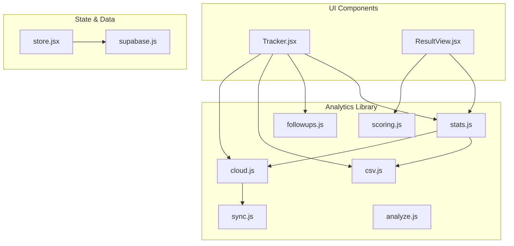
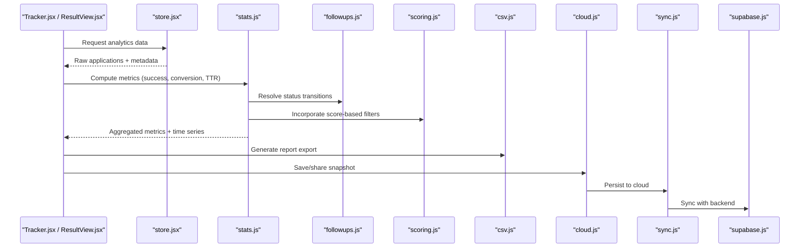
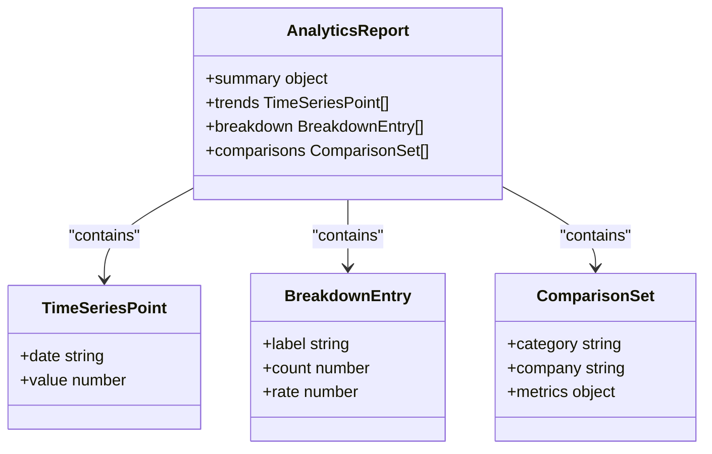
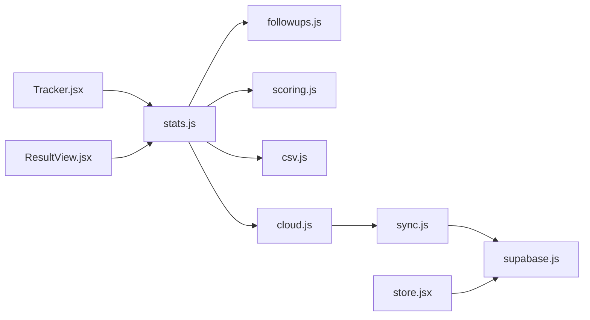

# Statistics & Analytics Engine

<cite>
**Referenced Files in This Document**
- [stats.js](file://src/lib/stats.js)
- [stats.test.js](file://src/lib/stats.test.js)
- [Tracker.jsx](file://src/components/Tracker.jsx)
- [ResultView.jsx](file://src/components/ResultView.jsx)
- [store.jsx](file://src/store.jsx)
- [supabase.js](file://src/lib/supabase.js)
- [csv.js](file://src/lib/csv.js)
- [cloud.js](file://src/lib/cloud.js)
- [sync.js](file://src/lib/sync.js)
- [followups.js](file://src/lib/followups.js)
- [scoring.js](file://src/lib/scoring.js)
- [analyze.js](file://src/lib/analyze.js)
</cite>

## Table of Contents
1. [Introduction](#introduction)
2. [Project Structure](#project-structure)
3. [Core Components](#core-components)
4. [Architecture Overview](#architecture-overview)
5. [Detailed Component Analysis](#detailed-component-analysis)
6. [Dependency Analysis](#dependency-analysis)
7. [Performance Considerations](#performance-considerations)
8. [Troubleshooting Guide](#troubleshooting-guide)
9. [Conclusion](#conclusion)
10. [Appendices](#appendices)

## Introduction
This document explains the statistics and analytics engine in ApplyGuard PH, focusing on how job search metrics are calculated, aggregated, analyzed over time, and presented to users. It covers:
- Calculation methods for key metrics (success rates, time-to-response, conversion rates)
- Data aggregation algorithms and trend analysis
- Reporting generation and export formats
- Visualization data structures and dashboard integration points
- Examples of common analytics queries and custom metric definitions

The goal is to make the analytics system understandable for both technical and non-technical readers while providing precise references to implementation files.

## Project Structure
The analytics functionality is implemented primarily in client-side JavaScript modules under src/lib and consumed by UI components under src/components. Key areas include:
- Core statistical computations and aggregations
- Time-series and trend utilities
- Export helpers for CSV and cloud sync
- Dashboard integration via store and component state

**Diagram sources**
- [stats.js](file://src/lib/stats.js)
- [csv.js](file://src/lib/csv.js)
- [cloud.js](file://src/lib/cloud.js)
- [sync.js](file://src/lib/sync.js)
- [followups.js](file://src/lib/followups.js)
- [scoring.js](file://src/lib/scoring.js)
- [analyze.js](file://src/lib/analyze.js)
- [Tracker.jsx](file://src/components/Tracker.jsx)
- [ResultView.jsx](file://src/components/ResultView.jsx)
- [store.jsx](file://src/store.jsx)
- [supabase.js](file://src/lib/supabase.js)

**Section sources**
- [stats.js](file://src/lib/stats.js)
- [Tracker.jsx](file://src/components/Tracker.jsx)
- [ResultView.jsx](file://src/components/ResultView.jsx)
- [store.jsx](file://src/store.jsx)
- [supabase.js](file://src/lib/supabase.js)
- [csv.js](file://src/lib/csv.js)
- [cloud.js](file://src/lib/cloud.js)
- [sync.js](file://src/lib/sync.js)
- [followups.js](file://src/lib/followups.js)
- [scoring.js](file://src/lib/scoring.js)
- [analyze.js](file://src/lib/analyze.js)

## Core Components
- Statistical computation module: Provides functions for success rate, conversion rate, time-to-response, and other core metrics.
- Aggregation and trend utilities: Group records by categories or companies, compute rolling windows, and derive trends.
- Export and sync helpers: Generate CSV exports and integrate with cloud storage for sharing or backup.
- Follow-ups and scoring integrations: Enrich analytics with application status transitions and scoring insights.
- UI integration: Tracker and ResultView consume analytics outputs to render dashboards and detailed views.

Key responsibilities:
- Normalize input datasets into a consistent schema for calculations
- Compute per-period and cumulative metrics
- Produce visualization-ready structures (time series, category/company breakdowns)
- Provide exportable reports and shareable snapshots

**Section sources**
- [stats.js](file://src/lib/stats.js)
- [stats.test.js](file://src/lib/stats.test.js)
- [csv.js](file://src/lib/csv.js)
- [cloud.js](file://src/lib/cloud.js)
- [followups.js](file://src/lib/followups.js)
- [scoring.js](file://src/lib/scoring.js)
- [Tracker.jsx](file://src/components/Tracker.jsx)
- [ResultView.jsx](file://src/components/ResultView.jsx)

## Architecture Overview
The analytics pipeline reads raw job applications from local storage or synced cloud, normalizes them, computes metrics, aggregates across dimensions, and renders results in the UI. Exports can be generated as CSV or shared via cloud.

**Diagram sources**
- [Tracker.jsx](file://src/components/Tracker.jsx)
- [ResultView.jsx](file://src/components/ResultView.jsx)
- [store.jsx](file://src/store.jsx)
- [stats.js](file://src/lib/stats.js)
- [followups.js](file://src/lib/followups.js)
- [scoring.js](file://src/lib/scoring.js)
- [csv.js](file://src/lib/csv.js)
- [cloud.js](file://src/lib/cloud.js)
- [sync.js](file://src/lib/sync.js)
- [supabase.js](file://src/lib/supabase.js)

## Detailed Component Analysis

### Statistical Computation Module
Responsibilities:
- Success rate calculation: ratio of successful outcomes to total attempts within a selected period or overall.
- Conversion rate calculation: progression through funnel stages (e.g., applied → interview → offer).
- Time-to-response (TTR): elapsed time between application submission and first meaningful response.
- Category/company comparative analytics: group-by metrics for cross-sectional comparisons.
- Trend analysis: rolling averages, moving windows, and growth indicators.

Common formulas:
- Success Rate = Successful Outcomes / Total Attempts
- Conversion Rate = Stage N Completions / Stage N-1 Entrances
- Time-to-Response = Timestamp(First Response) - Timestamp(Application Date)
- Comparative Metric Delta = Metric(Category A) - Metric(Category B)

Visualization data structures:
- TimeSeriesPoint: { date, value }
- BreakdownEntry: { label, count, rate }
- ComparisonSet: { category, company, metrics }

Export formats:
- CSV rows with headers for each metric dimension
- JSON snapshots for cloud sharing

Integration points:
- Consumed by Tracker.jsx and ResultView.jsx for dashboard rendering
- Uses followups.js for status transitions and scoring.js for score-based filtering

**Section sources**
- [stats.js](file://src/lib/stats.js)
- [stats.test.js](file://src/lib/stats.test.js)
- [followups.js](file://src/lib/followups.js)
- [scoring.js](file://src/lib/scoring.js)
- [Tracker.jsx](file://src/components/Tracker.jsx)
- [ResultView.jsx](file://src/components/ResultView.jsx)

#### Class-like Structure of Analytics Outputs

**Diagram sources**
- [stats.js](file://src/lib/stats.js)

### Aggregation and Trend Analysis
Aggregation algorithm highlights:
- Grouping by date ranges (daily, weekly, monthly)
- Rolling window computations for smoothing
- Cumulative sums and running rates
- Dimensional pivots by category and company

Trend analysis methods:
- Moving average over configurable windows
- Growth rate computed as percentage change between periods
- Anomaly detection flags based on deviation thresholds

Data flow:
- Input normalized applications → grouped by period/dimension → computed metrics → smoothed trends → output structures for visualization

**Section sources**
- [stats.js](file://src/lib/stats.js)
- [stats.test.js](file://src/lib/stats.test.js)

### Export and Reporting Generation
Export capabilities:
- CSV generation with standardized headers
- JSON snapshot creation for cloud sharing
- Report templates for summary, trends, and breakdowns

Reporting process:
- Aggregate metrics → format into rows/columns → write to CSV or JSON → persist via cloud if requested

Integration points:
- csv.js for formatting
- cloud.js for persistence
- sync.js for backend synchronization

**Section sources**
- [csv.js](file://src/lib/csv.js)
- [cloud.js](file://src/lib/cloud.js)
- [sync.js](file://src/lib/sync.js)

### Dashboard Integration
Components:
- Tracker.jsx: Displays overview metrics, timelines, and quick actions
- ResultView.jsx: Presents detailed analytics for specific applications or cohorts

Data consumption:
- Reads from store.jsx which coordinates local and cloud data
- Calls stats.js to compute metrics on demand or cached results
- Renders charts and tables using visualization-ready structures

**Section sources**
- [Tracker.jsx](file://src/components/Tracker.jsx)
- [ResultView.jsx](file://src/components/ResultView.jsx)
- [store.jsx](file://src/store.jsx)
- [supabase.js](file://src/lib/supabase.js)

### Follow-ups and Scoring Integrations
Follow-ups:
- Status transitions drive conversion rate and funnel analytics
- Timeline alignment ensures accurate TTR calculations

Scoring:
- Score-based filters enable cohort analytics (e.g., high-score vs low-score applicants)
- Correlation between scores and outcomes enriches comparative analytics

**Section sources**
- [followups.js](file://src/lib/followups.js)
- [scoring.js](file://src/lib/scoring.js)

## Dependency Analysis
The analytics engine depends on several modules for data normalization, status tracking, scoring, export, and cloud sync. The following diagram shows direct dependencies among core files.

**Diagram sources**
- [stats.js](file://src/lib/stats.js)
- [followups.js](file://src/lib/followups.js)
- [scoring.js](file://src/lib/scoring.js)
- [csv.js](file://src/lib/csv.js)
- [cloud.js](file://src/lib/cloud.js)
- [sync.js](file://src/lib/sync.js)
- [supabase.js](file://src/lib/supabase.js)
- [Tracker.jsx](file://src/components/Tracker.jsx)
- [ResultView.jsx](file://src/components/ResultView.jsx)
- [store.jsx](file://src/store.jsx)

**Section sources**
- [stats.js](file://src/lib/stats.js)
- [followups.js](file://src/lib/followups.js)
- [scoring.js](file://src/lib/scoring.js)
- [csv.js](file://src/lib/csv.js)
- [cloud.js](file://src/lib/cloud.js)
- [sync.js](file://src/lib/sync.js)
- [supabase.js](file://src/lib/supabase.js)
- [Tracker.jsx](file://src/components/Tracker.jsx)
- [ResultView.jsx](file://src/components/ResultView.jsx)
- [store.jsx](file://src/store.jsx)

## Performance Considerations
- Prefer batched computations: aggregate once and reuse results across components to avoid redundant recalculations.
- Use memoization for expensive operations like rolling windows and multi-dimensional pivots.
- Limit time range granularity when generating large exports; provide pagination or sampling options.
- Cache visualization-ready structures in store.jsx to reduce re-renders.
- Defer heavy exports until user explicitly triggers them; consider background tasks for large datasets.

[No sources needed since this section provides general guidance]

## Troubleshooting Guide
Common issues and resolutions:
- Missing timestamps: Ensure application dates and response dates are present; otherwise, exclude records from TTR calculations.
- Inconsistent statuses: Validate status transitions via followups.js; normalize ambiguous states before computing conversion rates.
- Empty exports: Verify CSV headers and row formatting; confirm that at least one record matches the selected filters.
- Sync failures: Check cloud.js and sync.js error paths; retry with backoff and log errors for diagnosis.

Operational checks:
- Confirm store.jsx has up-to-date data before invoking analytics.
- Validate that stats.js receives normalized inputs matching expected schemas.
- Inspect test suites in stats.test.js for edge cases and assertions.

**Section sources**
- [stats.test.js](file://src/lib/stats.test.js)
- [followups.js](file://src/lib/followups.js)
- [csv.js](file://src/lib/csv.js)
- [cloud.js](file://src/lib/cloud.js)
- [sync.js](file://src/lib/sync.js)
- [store.jsx](file://src/store.jsx)

## Conclusion
The ApplyGuard PH analytics engine combines robust statistical computations, flexible aggregation, and clear export mechanisms to deliver actionable insights into job search performance. By integrating follow-up tracking and scoring, it supports nuanced analyses across categories and companies. The modular design enables easy extension for new metrics and visualizations while maintaining clarity and performance.

[No sources needed since this section summarizes without analyzing specific files]

## Appendices

### Common Analytics Queries
- Success rate by category: Filter applications by category, compute successes divided by total attempts.
- Conversion rate by company: Track stage transitions per company and calculate completion ratios.
- Average time-to-response by month: Group responses by month and compute mean TTR.
- Trend of interviews over last 12 weeks: Build a weekly time series of interview counts and apply a moving average.

### Custom Metric Definitions
- Weighted success score: Combine outcome types with weights (e.g., offer > interview > callback).
- Funnel drop-off rate: Percentage decrease between consecutive stages.
- Cohort retention: Proportion of applicants who continue applying after a milestone.

### Visualization Data Structures
- TimeSeriesPoint: { date, value }
- BreakdownEntry: { label, count, rate }
- ComparisonSet: { category, company, metrics }

These structures are produced by the analytics module and consumed by Tracker.jsx and ResultView.jsx for rendering charts and tables.

**Section sources**
- [stats.js](file://src/lib/stats.js)
- [Tracker.jsx](file://src/components/Tracker.jsx)
- [ResultView.jsx](file://src/components/ResultView.jsx)