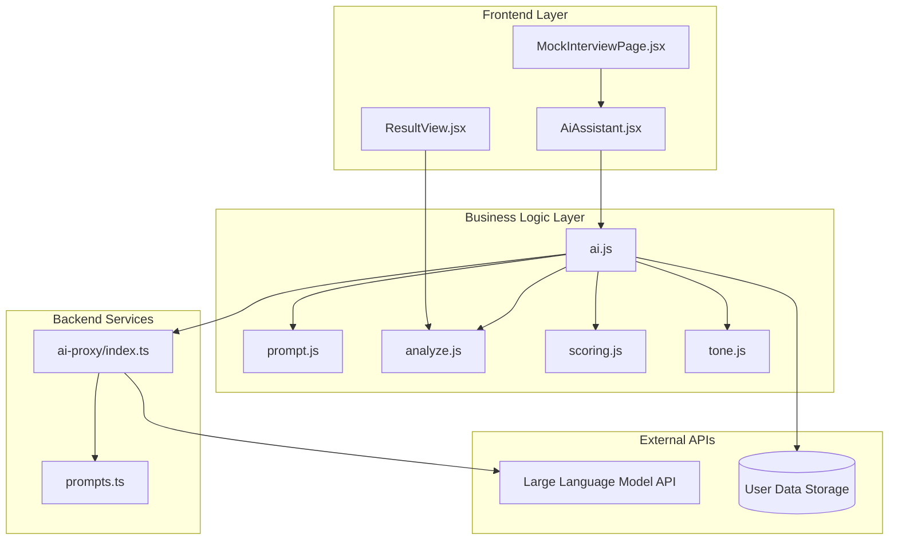
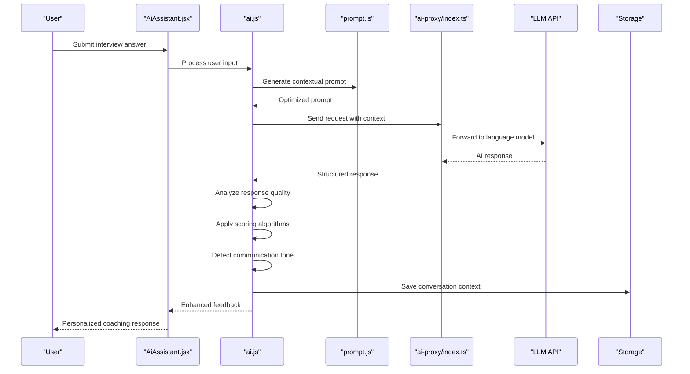
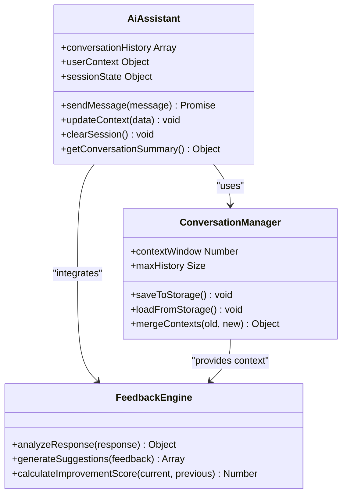
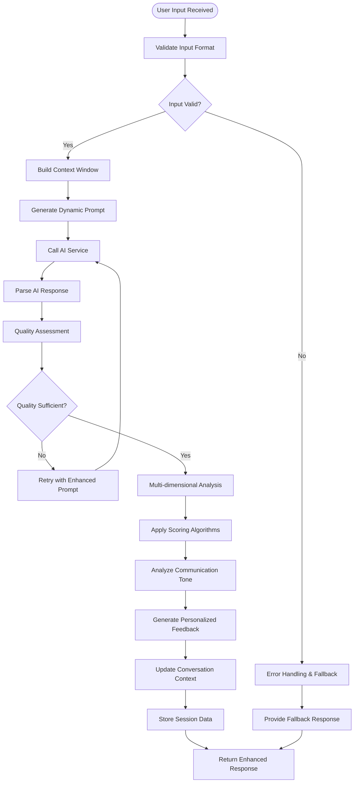
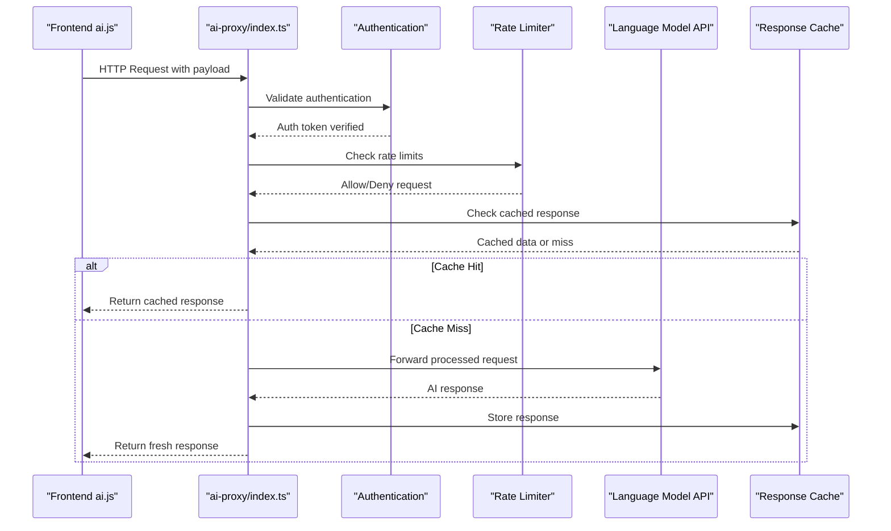
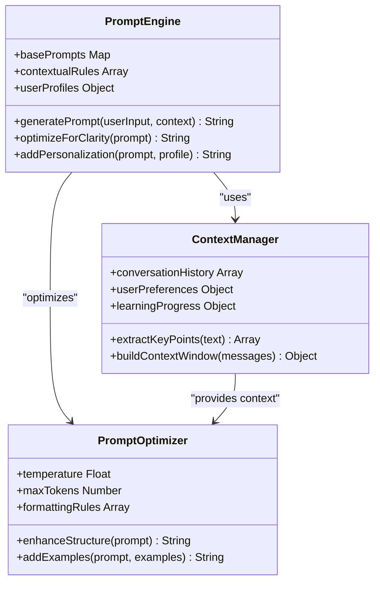
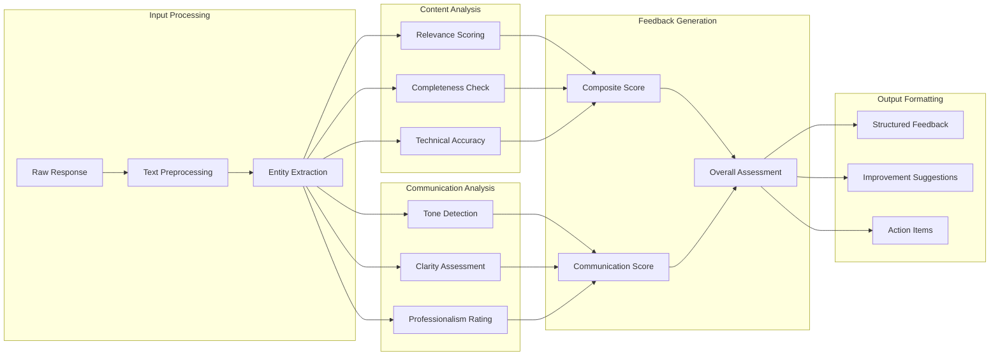
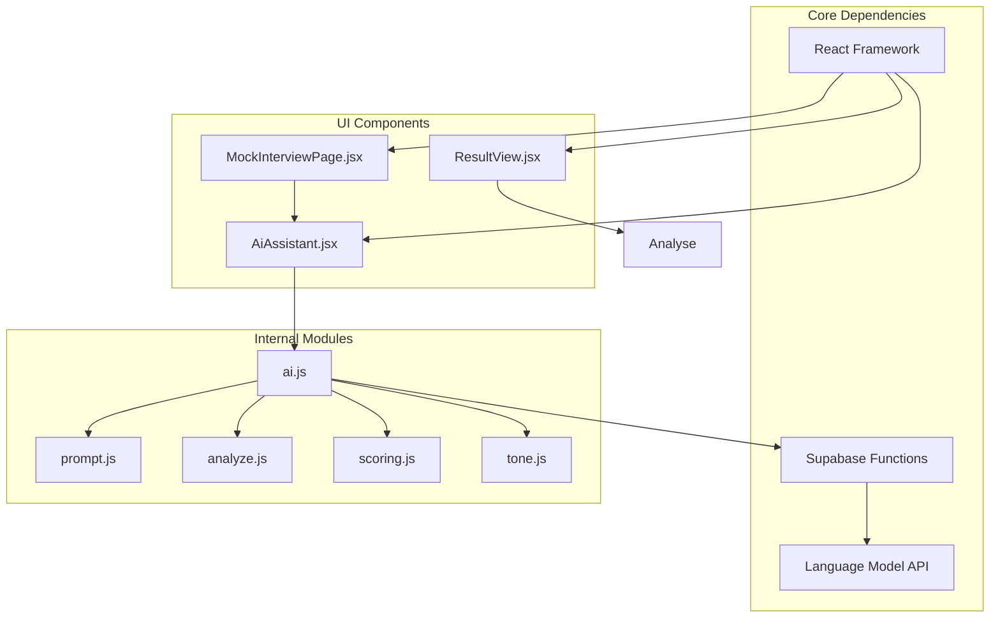

# AI Assistant & Coaching

<cite>
**Referenced Files in This Document**
- [AiAssistant.jsx](file://src/components/AiAssistant.jsx)
- [ai.js](file://src/lib/ai.js)
- [prompt.js](file://src/lib/prompt.js)
- [analyze.js](file://src/lib/analyze.js)
- [scoring.js](file://src/lib/scoring.js)
- [tone.js](file://src/lib/tone.js)
- [ai-proxy/index.ts](file://supabase/functions/ai-proxy/index.ts)
- [prompts.ts](file://supabase/functions/_shared/prompts.ts)
- [MockInterviewPage.jsx](file://src/components/MockInterviewPage.jsx)
- [ResultView.jsx](file://src/components/ResultView.jsx)
</cite>

## Table of Contents
1. [Introduction](#introduction)
2. [Project Structure](#project-structure)
3. [Core Components](#core-components)
4. [Architecture Overview](#architecture-overview)
5. [Detailed Component Analysis](#detailed-component-analysis)
6. [Dependency Analysis](#dependency-analysis)
7. [Performance Considerations](#performance-considerations)
8. [Troubleshooting Guide](#troubleshooting-guide)
9. [Conclusion](#conclusion)

## Introduction

The AI Assistant & Coaching system is a comprehensive interview preparation platform that leverages artificial intelligence to provide personalized coaching, contextual feedback, and adaptive learning experiences. The system analyzes user inputs during mock interviews, provides constructive feedback, suggests improvements, and maintains conversation context throughout sessions to deliver an immersive and effective interview preparation experience.

## Project Structure

The AI coaching system follows a modular architecture with clear separation between frontend components, business logic, and backend services:

**Diagram sources**
- [AiAssistant.jsx](file://src/components/AiAssistant.jsx)
- [ai.js](file://src/lib/ai.js)
- [ai-proxy/index.ts](file://supabase/functions/ai-proxy/index.ts)

**Section sources**
- [AiAssistant.jsx](file://src/components/AiAssistant.jsx)
- [ai.js](file://src/lib/ai.js)
- [prompt.js](file://src/lib/prompt.js)

## Core Components

### Conversational Interface (AiAssistant.jsx)
The main conversational interface component handles real-time chat interactions, manages conversation state, and coordinates with the AI processing pipeline. It provides the primary user interaction point for interview preparation sessions.

### AI Processing Engine (ai.js)
The core AI processing engine orchestrates the entire AI workflow, including prompt generation, response analysis, scoring algorithms, and tone detection. It serves as the central coordinator for all AI-related functionality.

### Prompt Engineering System (prompt.js)
This module handles dynamic prompt construction, context management, and prompt optimization strategies. It ensures prompts are tailored to individual users and maintain conversation continuity.

### Analysis Framework (analyze.js)
The analysis framework processes AI responses, extracts key insights, identifies areas for improvement, and generates structured feedback for users.

### Scoring System (scoring.js)
The scoring system evaluates user performance across multiple dimensions, providing quantitative metrics and qualitative assessments for interview readiness.

### Tone Detection (tone.js)
Tone detection analyzes communication style, emotional intelligence, and professional demeanor to provide nuanced feedback on interpersonal skills.

**Section sources**
- [AiAssistant.jsx](file://src/components/AiAssistant.jsx)
- [ai.js](file://src/lib/ai.js)
- [prompt.js](file://src/lib/prompt.js)
- [analyze.js](file://src/lib/analyze.js)
- [scoring.js](file://src/lib/scoring.js)
- [tone.js](file://src/lib/tone.js)

## Architecture Overview

The AI coaching system implements a sophisticated multi-layered architecture designed for scalability, reliability, and performance:

**Diagram sources**
- [AiAssistant.jsx](file://src/components/AiAssistant.jsx)
- [ai.js](file://src/lib/ai.js)
- [prompt.js](file://src/lib/prompt.js)
- [ai-proxy/index.ts](file://supabase/functions/ai-proxy/index.ts)

## Detailed Component Analysis

### Conversational Interface Architecture

The AiAssistant component implements a stateful conversation manager that maintains context across multiple interactions:

**Diagram sources**
- [AiAssistant.jsx](file://src/components/AiAssistant.jsx)

### AI Processing Pipeline

The AI processing pipeline implements a sophisticated multi-stage analysis system:

**Diagram sources**
- [ai.js](file://src/lib/ai.js)
- [prompt.js](file://src/lib/prompt.js)
- [analyze.js](file://src/lib/analyze.js)

### Backend Proxy Architecture

The Supabase function proxy provides secure API access and request routing:

**Diagram sources**
- [ai-proxy/index.ts](file://supabase/functions/ai-proxy/index.ts)

### Prompt Engineering System

The prompt engineering system implements dynamic prompt construction with context awareness:

**Diagram sources**
- [prompt.js](file://src/lib/prompt.js)
- [prompts.ts](file://supabase/functions/_shared/prompts.ts)

### Analysis and Scoring Framework

The analysis framework provides comprehensive evaluation capabilities:

**Diagram sources**
- [analyze.js](file://src/lib/analyze.js)
- [scoring.js](file://src/lib/scoring.js)
- [tone.js](file://src/lib/tone.js)

## Dependency Analysis

The AI coaching system exhibits a well-structured dependency hierarchy with clear separation of concerns:

**Diagram sources**
- [ai.js](file://src/lib/ai.js)
- [AiAssistant.jsx](file://src/components/AiAssistant.jsx)
- [ai-proxy/index.ts](file://supabase/functions/ai-proxy/index.ts)

**Section sources**
- [ai.js](file://src/lib/ai.js)
- [AiAssistant.jsx](file://src/components/AiAssistant.jsx)
- [ai-proxy/index.ts](file://supabase/functions/ai-proxy/index.ts)

## Performance Considerations

The AI coaching system implements several performance optimization strategies:

### Caching Strategies
- **Response Caching**: Intelligent caching of frequently accessed prompts and responses
- **Context Window Optimization**: Efficient management of conversation history to minimize memory usage
- **Lazy Loading**: Progressive loading of analysis results and detailed feedback

### Concurrency Management
- **Request Queuing**: Sequential processing of AI requests to prevent API overload
- **Connection Pooling**: Reuse of database connections for improved throughput
- **Batch Processing**: Grouping related operations to reduce network overhead

### Memory Management
- **Stream Processing**: Real-time processing of large text inputs without full memory allocation
- **Garbage Collection Optimization**: Proper cleanup of conversation contexts and temporary objects
- **Resource Cleanup**: Automatic disposal of unused resources and event listeners

### Network Optimization
- **Compression**: Request and response compression for reduced bandwidth usage
- **Timeout Handling**: Configurable timeouts with exponential backoff retry logic
- **Error Recovery**: Graceful degradation when external services are unavailable

## Troubleshooting Guide

### Common Issues and Solutions

#### AI Service Connectivity Problems
- **Symptoms**: Timeout errors, connection refused messages
- **Causes**: Network connectivity issues, API service downtime, authentication failures
- **Solutions**: Implement retry logic, provide fallback responses, monitor service health

#### Context Loss During Conversations
- **Symptoms**: AI loses track of conversation topics, forgets previous interactions
- **Causes**: Context window overflow, session expiration, storage failures
- **Solutions**: Implement context summarization, automatic session recovery, local storage backup

#### Performance Degradation
- **Symptoms**: Slow response times, high memory usage, UI freezing
- **Causes**: Large conversation histories, inefficient algorithms, memory leaks
- **Solutions**: Optimize context windows, implement lazy loading, add performance monitoring

#### Inconsistent Feedback Quality
- **Symptoms**: Varying quality of AI responses, irrelevant suggestions
- **Causes**: Poor prompt engineering, insufficient context, model limitations
- **Solutions**: Enhance prompt templates, improve context building, implement quality checks

### Monitoring and Diagnostics

#### Logging Strategy
- **Structured Logging**: JSON-formatted logs with consistent schema
- **Performance Metrics**: Response times, error rates, resource utilization
- **User Analytics**: Interaction patterns, feature usage, satisfaction metrics

#### Error Tracking
- **Exception Handling**: Comprehensive try-catch blocks with meaningful error messages
- **Stack Traces**: Detailed error information for debugging
- **User-Friendly Messages**: Clear error descriptions with suggested actions

**Section sources**
- [ai.js](file://src/lib/ai.js)
- [ai-proxy/index.ts](file://supabase/functions/ai-proxy/index.ts)

## Conclusion

The AI Assistant & Coaching system represents a sophisticated approach to interview preparation through intelligent automation and personalized feedback. The modular architecture ensures maintainability and scalability, while the comprehensive analysis framework provides actionable insights for continuous improvement.

Key strengths include the context-aware conversation management, multi-dimensional analysis capabilities, and robust error handling mechanisms. The system successfully balances advanced AI capabilities with practical usability, making it accessible to users at various skill levels.

Future enhancements could include expanded language model integration, more sophisticated personality adaptation, and enhanced analytics for tracking long-term progress. The current implementation provides a solid foundation for these future developments while delivering immediate value to users seeking to improve their interview performance.