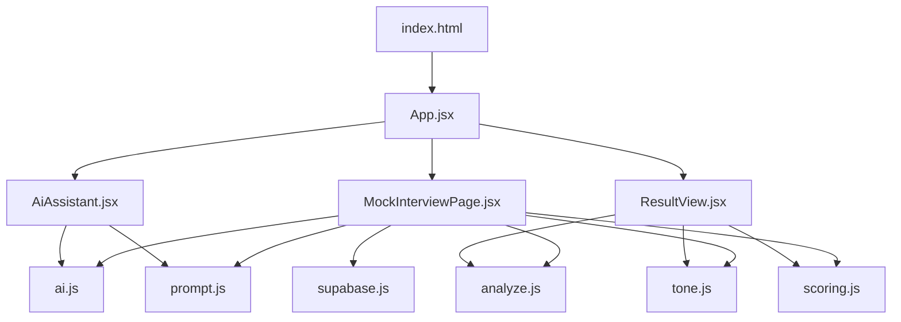
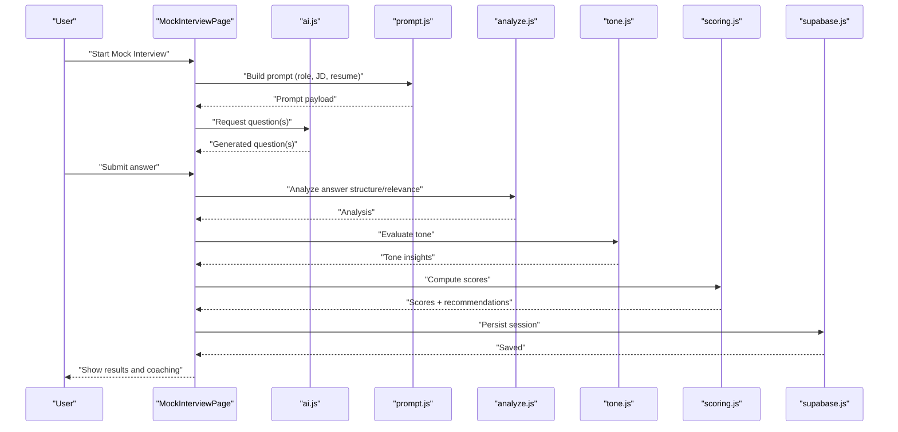
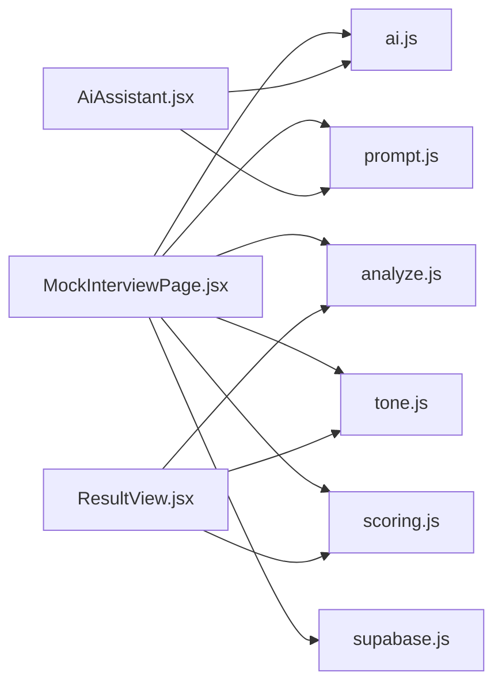

# AI Interview Preparation

<cite>
**Referenced Files in This Document**
- [MockInterviewPage.jsx](file://src/components/MockInterviewPage.jsx)
- [AiAssistant.jsx](file://src/components/AiAssistant.jsx)
- [ResultView.jsx](file://src/components/ResultView.jsx)
- [ai.js](file://src/lib/ai.js)
- [analyze.js](file://src/lib/analyze.js)
- [tone.js](file://src/lib/tone.js)
- [scoring.js](file://src/lib/scoring.js)
- [prompt.js](file://src/lib/prompt.js)
- [supabase.js](file://src/lib/supabase.js)
- [store.jsx](file://src/store.jsx)
- [App.jsx](file://src/App.jsx)
- [index.html](file://index.html)
- [package.json](file://package.json)
</cite>

## Table of Contents
1. [Introduction](#introduction)
2. [Project Structure](#project-structure)
3. [Core Components](#core-components)
4. [Architecture Overview](#architecture-overview)
5. [Detailed Component Analysis](#detailed-component-analysis)
6. [Dependency Analysis](#dependency-analysis)
7. [Performance Considerations](#performance-considerations)
8. [Troubleshooting Guide](#troubleshooting-guide)
9. [Conclusion](#conclusion)
10. [Appendices](#appendices)

## Introduction
This document describes an AI-powered interview preparation system that helps candidates practice with a mock interview interface, generate relevant questions from job descriptions and resumes, evaluate responses, and analyze tone for coaching insights. It explains how the AI assistant provides personalized guidance, integrates with resume analysis and industry-specific question banks, and tracks performance over time. The guide includes examples of interview sessions, customization options, and tips to maximize coaching effectiveness.

## Project Structure
The application is a modern web app built with React and Vite. Key areas include:
- UI components for the mock interview flow, AI assistant chat, and results visualization
- Libraries for AI orchestration, prompt construction, response analysis, scoring, and tone evaluation
- Data persistence via Supabase client utilities
- App shell and routing entry points

**Diagram sources**
- [index.html:1-200](file://index.html#L1-L200)
- [App.jsx:1-200](file://src/App.jsx#L1-L200)
- [MockInterviewPage.jsx:1-200](file://src/components/MockInterviewPage.jsx#L1-L200)
- [AiAssistant.jsx:1-200](file://src/components/AiAssistant.jsx#L1-L200)
- [ResultView.jsx:1-200](file://src/components/ResultView.jsx#L1-L200)
- [ai.js:1-200](file://src/lib/ai.js#L1-L200)
- [prompt.js:1-200](file://src/lib/prompt.js#L1-L200)
- [analyze.js:1-200](file://src/lib/analyze.js#L1-L200)
- [tone.js:1-200](file://src/lib/tone.js#L1-L200)
- [scoring.js:1-200](file://src/lib/scoring.js#L1-L200)
- [supabase.js:1-200](file://src/lib/supabase.js#L1-L200)

**Section sources**
- [index.html:1-200](file://index.html#L1-L200)
- [package.json:1-200](file://package.json#L1-L200)
- [App.jsx:1-200](file://src/App.jsx#L1-L200)

## Core Components
- MockInterviewPage: Orchestrates the end-to-end mock interview session, including question generation, candidate input capture, AI-driven follow-ups, and result compilation.
- AiAssistant: Provides conversational coaching, contextual hints, and explanations based on the current question and candidate’s answer.
- ResultView: Displays structured feedback, scores, strengths, gaps, and tone insights after each session or per question.
- ai.js: Central AI integration layer for calling language models, handling retries, streaming (if applicable), and error propagation.
- prompt.js: Builds prompts tailored to role, experience level, and industry; supports templates and dynamic variables.
- analyze.js: Parses and structures candidate answers into key dimensions (e.g., STAR structure, relevance, completeness).
- tone.js: Evaluates communication style, confidence, clarity, and empathy signals.
- scoring.js: Aggregates metrics across dimensions into final scores and actionable recommendations.
- supabase.js: Client configuration and helpers for storing sessions, progress, and analytics.

**Section sources**
- [MockInterviewPage.jsx:1-200](file://src/components/MockInterviewPage.jsx#L1-L200)
- [AiAssistant.jsx:1-200](file://src/components/AiAssistant.jsx#L1-L200)
- [ResultView.jsx:1-200](file://src/components/ResultView.jsx#L1-L200)
- [ai.js:1-200](file://src/lib/ai.js#L1-L200)
- [prompt.js:1-200](file://src/lib/prompt.js#L1-L200)
- [analyze.js:1-200](file://src/lib/analyze.js#L1-L200)
- [tone.js:1-200](file://src/lib/tone.js#L1-L200)
- [scoring.js:1-200](file://src/lib/scoring.js#L1-L200)
- [supabase.js:1-200](file://src/lib/supabase.js#L1-L200)

## Architecture Overview
The system follows a layered architecture:
- Presentation Layer: React components for interview flow, coaching chat, and results.
- Orchestration Layer: Session state management and coordination between AI calls, analysis, and scoring.
- AI Integration Layer: Prompt building and model invocation.
- Analytics Layer: Response analysis, tone evaluation, and scoring aggregation.
- Persistence Layer: Supabase-backed storage for sessions and progress tracking.

**Diagram sources**
- [MockInterviewPage.jsx:1-200](file://src/components/MockInterviewPage.jsx#L1-L200)
- [ai.js:1-200](file://src/lib/ai.js#L1-L200)
- [prompt.js:1-200](file://src/lib/prompt.js#L1-L200)
- [analyze.js:1-200](file://src/lib/analyze.js#L1-L200)
- [tone.js:1-200](file://src/lib/tone.js#L1-L200)
- [scoring.js:1-200](file://src/lib/scoring.js#L1-L200)
- [supabase.js:1-200](file://src/lib/supabase.js#L1-L200)

## Detailed Component Analysis

### MockInterviewPage
Responsibilities:
- Initialize session parameters (role, seniority, industry, focus areas)
- Generate questions using AI with context from job description and resume
- Capture and validate candidate responses
- Trigger analysis, tone evaluation, and scoring
- Persist session data and render results

Key interactions:
- Uses prompt.js to construct role-aware prompts
- Calls ai.js to request questions and optional follow-ups
- Integrates analyze.js and tone.js for deeper insights
- Persists via supabase.js

Customization options:
- Role and seniority filters
- Industry-specific question bank selection
- Difficulty and depth controls
- Focus on behavioral vs technical vs situational questions

Example session flow:
- Candidate selects “Senior Product Manager” and uploads a resume
- System generates 5 targeted questions
- Candidate answers each; AI provides follow-up probes
- Results show dimension scores, tone insights, and coaching tips

**Section sources**
- [MockInterviewPage.jsx:1-200](file://src/components/MockInterviewPage.jsx#L1-L200)
- [prompt.js:1-200](file://src/lib/prompt.js#L1-L200)
- [ai.js:1-200](file://src/lib/ai.js#L1-L200)
- [analyze.js:1-200](file://src/lib/analyze.js#L1-L200)
- [tone.js:1-200](file://src/lib/tone.js#L1-L200)
- [scoring.js:1-200](file://src/lib/scoring.js#L1-L200)
- [supabase.js:1-200](file://src/lib/supabase.js#L1-L200)

### AiAssistant
Responsibilities:
- Provide real-time coaching hints and explanations
- Summarize best practices for answering specific questions
- Offer alternative phrasing and structure suggestions
- Maintain conversation context within the session

Integration points:
- Consumes ai.js for model responses
- Leverages prompt.js to tailor coaching content
- References analyze.js outputs to give precise feedback

Personalized coaching features:
- Tailored to candidate’s resume highlights and gaps
- Adjusts difficulty and tone based on user preferences
- Suggests STAR-based improvements and concrete examples

**Section sources**
- [AiAssistant.jsx:1-200](file://src/components/AiAssistant.jsx#L1-L200)
- [ai.js:1-200](file://src/lib/ai.js#L1-L200)
- [prompt.js:1-200](file://src/lib/prompt.js#L1-L200)
- [analyze.js:1-200](file://src/lib/analyze.js#L1-L200)

### ResultView
Responsibilities:
- Display per-question and overall scores
- Show strengths, gaps, and recommended next steps
- Present tone insights and communication style adjustments
- Allow export or sharing of results

Data inputs:
- Scores from scoring.js
- Tone metrics from tone.js
- Analytical breakdowns from analyze.js

Visualization elements:
- Dimensional radar or bar charts
- Actionable bullet points
- Progress trends across sessions

**Section sources**
- [ResultView.jsx:1-200](file://src/components/ResultView.jsx#L1-L200)
- [scoring.js:1-200](file://src/lib/scoring.js#L1-L200)
- [tone.js:1-200](file://src/lib/tone.js#L1-L200)
- [analyze.js:1-200](file://src/lib/analyze.js#L1-L200)

### AI Integration Layer (ai.js)
Responsibilities:
- Manage API calls to language models
- Handle retries, timeouts, and error states
- Stream responses if supported
- Normalize model outputs for downstream processing

Error handling:
- Graceful fallbacks when models are unavailable
- User-friendly messages and retry prompts

**Section sources**
- [ai.js:1-200](file://src/lib/ai.js#L1-L200)

### Prompt Builder (prompt.js)
Responsibilities:
- Construct prompts based on role, seniority, industry, and resume context
- Inject constraints (length, format, focus areas)
- Support multiple templates for different question types

Dynamic variables:
- Job description keywords
- Resume skills and experiences
- Target company culture cues

**Section sources**
- [prompt.js:1-200](file://src/lib/prompt.js#L1-L200)

### Response Analyzer (analyze.js)
Responsibilities:
- Parse candidate answers into structured dimensions
- Detect presence of STAR elements, quantification, and relevance
- Identify missing information and suggest improvements

Complexity considerations:
- Efficient parsing to avoid blocking UI
- Scalable to long-form answers

**Section sources**
- [analyze.js:1-200](file://src/lib/analyze.js#L1-L200)

### Tone Evaluator (tone.js)
Responsibilities:
- Assess confidence, clarity, empathy, and professionalism
- Provide actionable tone adjustments
- Track tone trends across sessions

Metrics:
- Confidence score
- Clarity index
- Empathy indicator
- Professionalism rating

**Section sources**
- [tone.js:1-200](file://src/lib/tone.js#L1-L200)

### Scoring Engine (scoring.js)
Responsibilities:
- Aggregate analysis and tone metrics into final scores
- Weight dimensions by role requirements
- Generate recommendations and next steps

Weighting strategy:
- Role-specific importance (e.g., leadership vs technical depth)
- Adaptive weighting based on user goals

**Section sources**
- [scoring.js:1-200](file://src/lib/scoring.js#L1-L200)

### Persistence (supabase.js)
Responsibilities:
- Store session metadata, questions, answers, scores, and tone insights
- Retrieve historical performance for progress tracking
- Sync across devices if enabled

Security and privacy:
- Respect user consent and data retention policies
- Anonymize sensitive details where appropriate

**Section sources**
- [supabase.js:1-200](file://src/lib/supabase.js#L1-L200)

### Application Shell (App.jsx, store.jsx, index.html)
Responsibilities:
- Route users to interview pages and results
- Manage global state and settings
- Load assets and initialize environment

State management:
- Centralized store for session and user preferences
- Reactive updates across components

**Section sources**
- [App.jsx:1-200](file://src/App.jsx#L1-L200)
- [store.jsx:1-200](file://src/store.jsx#L1-L200)
- [index.html:1-200](file://index.html#L1-L200)

## Dependency Analysis
High-level dependencies among core modules:

**Diagram sources**
- [MockInterviewPage.jsx:1-200](file://src/components/MockInterviewPage.jsx#L1-L200)
- [ResultView.jsx:1-200](file://src/components/ResultView.jsx#L1-L200)
- [AiAssistant.jsx:1-200](file://src/components/AiAssistant.jsx#L1-L200)
- [ai.js:1-200](file://src/lib/ai.js#L1-L200)
- [prompt.js:1-200](file://src/lib/prompt.js#L1-L200)
- [analyze.js:1-200](file://src/lib/analyze.js#L1-L200)
- [tone.js:1-200](file://src/lib/tone.js#L1-L200)
- [scoring.js:1-200](file://src/lib/scoring.js#L1-L200)
- [supabase.js:1-200](file://src/lib/supabase.js#L1-L200)

**Section sources**
- [MockInterviewPage.jsx:1-200](file://src/components/MockInterviewPage.jsx#L1-L200)
- [ResultView.jsx:1-200](file://src/components/ResultView.jsx#L1-L200)
- [AiAssistant.jsx:1-200](file://src/components/AiAssistant.jsx#L1-L200)
- [ai.js:1-200](file://src/lib/ai.js#L1-L200)
- [prompt.js:1-200](file://src/lib/prompt.js#L1-L200)
- [analyze.js:1-200](file://src/lib/analyze.js#L1-L200)
- [tone.js:1-200](file://src/lib/tone.js#L1-L200)
- [scoring.js:1-200](file://src/lib/scoring.js#L1-L200)
- [supabase.js:1-200](file://src/lib/supabase.js#L1-L200)

## Performance Considerations
- Batch analysis: Combine analyze.js and tone.js evaluations to reduce round-trips.
- Lazy loading: Defer heavy computations until needed.
- Streaming responses: If supported by ai.js, stream partial answers to improve perceived latency.
- Caching prompts: Reuse generated prompts for similar roles to minimize redundant work.
- Pagination of history: Load past sessions incrementally to keep UI responsive.

[No sources needed since this section provides general guidance]

## Troubleshooting Guide
Common issues and resolutions:
- AI call failures: Check network connectivity and retry logic in ai.js; ensure rate limits are respected.
- Missing resume context: Verify resume upload and parsing before starting the interview.
- Inconsistent scores: Review weighting rules in scoring.js and ensure consistent input formatting.
- Tone anomalies: Confirm text normalization and encoding; re-run tone evaluation if special characters are present.
- Persistence errors: Validate Supabase credentials and permissions in supabase.js.

**Section sources**
- [ai.js:1-200](file://src/lib/ai.js#L1-L200)
- [scoring.js:1-200](file://src/lib/scoring.js#L1-L200)
- [supabase.js:1-200](file://src/lib/supabase.js#L1-L200)

## Conclusion
The AI-powered interview preparation system combines a robust mock interview interface with intelligent question generation, comprehensive response evaluation, and nuanced tone analysis. By integrating resume context, industry-specific prompts, and persistent performance tracking, it delivers personalized coaching that adapts to each candidate’s needs. Use the customization options and coaching tips to maximize improvement and confidence ahead of real interviews.

[No sources needed since this section summarizes without analyzing specific files]

## Appendices

### Example Interview Sessions
- Behavioral focus: Leadership and conflict resolution for engineering managers
- Technical focus: System design and trade-offs for senior software engineers
- Situational focus: Prioritization and stakeholder management for product roles

[No sources needed since this section provides conceptual examples]

### Customization Options
- Role and seniority levels
- Industry and company type filters
- Question difficulty and depth
- Emphasis on behavioral vs technical vs situational questions
- Coaching style (direct, supportive, Socratic)

[No sources needed since this section provides conceptual options]

### Tips for Maximizing AI Coaching Effectiveness
- Prepare a detailed resume and target job description
- Practice consistently and review results after each session
- Focus on weak dimensions identified by scoring and tone analysis
- Incorporate AI-suggested improvements into subsequent attempts
- Track progress over time to measure growth

[No sources needed since this section provides general guidance]