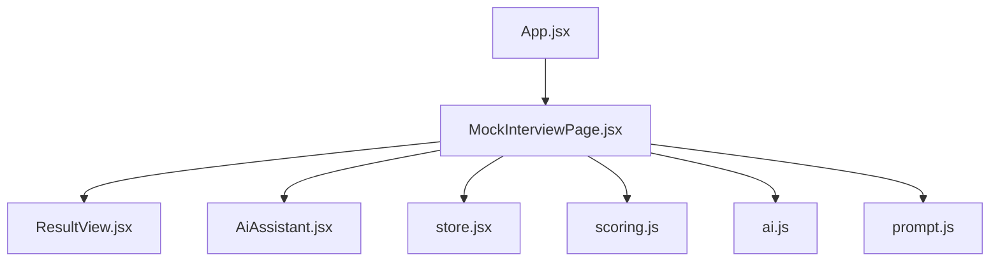
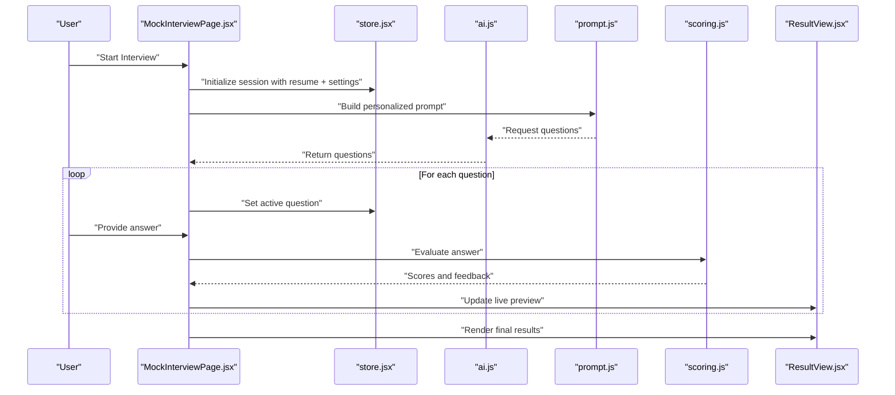
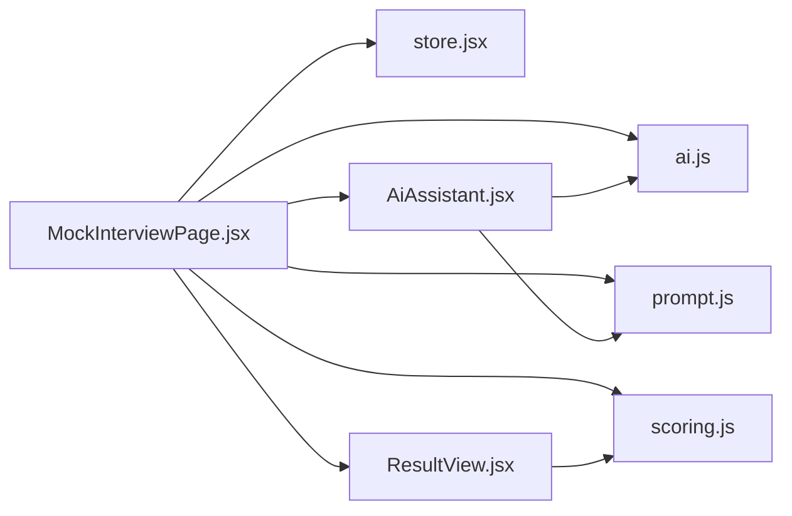

# Mock Interview Interface

<cite>
**Referenced Files in This Document**
- [MockInterviewPage.jsx](file://src/components/MockInterviewPage.jsx)
- [ResultView.jsx](file://src/components/ResultView.jsx)
- [AiAssistant.jsx](file://src/components/AiAssistant.jsx)
- [scoring.js](file://src/lib/scoring.js)
- [ai.js](file://src/lib/ai.js)
- [prompt.js](file://src/lib/prompt.js)
- [store.jsx](file://src/store.jsx)
- [App.jsx](file://src/App.jsx)
</cite>

## Table of Contents
1. [Introduction](#introduction)
2. [Project Structure](#project-structure)
3. [Core Components](#core-components)
4. [Architecture Overview](#architecture-overview)
5. [Detailed Component Analysis](#detailed-component-analysis)
6. [Dependency Analysis](#dependency-analysis)
7. [Performance Considerations](#performance-considerations)
8. [Troubleshooting Guide](#troubleshooting-guide)
9. [Conclusion](#conclusion)

## Introduction
This document explains the mock interview interface component, focusing on how users initiate sessions, navigate questions, provide answers, and review performance. It covers user interaction flows, question display mechanisms, response input handling, session management, customization options (difficulty levels and job categories), real-time feedback, integration with resume data for personalized questions, and the scoring system used to evaluate responses.

## Project Structure
The mock interview feature is implemented primarily as a React application with:
- A page-level component that orchestrates the interview flow
- A results view for post-interview review
- An AI assistant component for guidance and hints
- Libraries for AI prompting, scoring, and global state management

**Diagram sources**
- [App.jsx](file://src/App.jsx)
- [MockInterviewPage.jsx](file://src/components/MockInterviewPage.jsx)
- [ResultView.jsx](file://src/components/ResultView.jsx)
- [AiAssistant.jsx](file://src/components/AiAssistant.jsx)
- [scoring.js](file://src/lib/scoring.js)
- [ai.js](file://src/lib/ai.js)
- [prompt.js](file://src/lib/prompt.js)
- [store.jsx](file://src/store.jsx)

**Section sources**
- [App.jsx](file://src/App.jsx)
- [MockInterviewPage.jsx](file://src/components/MockInterviewPage.jsx)
- [ResultView.jsx](file://src/components/ResultView.jsx)
- [AiAssistant.jsx](file://src/components/AiAssistant.jsx)
- [scoring.js](file://src/lib/scoring.js)
- [ai.js](file://src/lib/ai.js)
- [prompt.js](file://src/lib/prompt.js)
- [store.jsx](file://src/store.jsx)

## Core Components
- MockInterviewPage: Main orchestration of the interview lifecycle, including session setup, question navigation, answer capture, and result generation.
- ResultView: Displays final scores, breakdowns, and actionable insights after an interview session.
- AiAssistant: Provides contextual help, hints, and explanations during the interview.
- scoring.js: Implements evaluation logic and scoring algorithms for responses.
- ai.js: Handles communication with AI services for generating questions and evaluating answers.
- prompt.js: Centralizes prompts used to generate personalized questions based on resume and configuration.
- store.jsx: Manages global state such as current session, active question index, answers, and settings.

Key responsibilities:
- Session initialization from resume and preferences
- Question rendering and navigation controls
- Answer input handling and validation
- Real-time feedback via AI assistant
- Post-session scoring and result visualization

**Section sources**
- [MockInterviewPage.jsx](file://src/components/MockInterviewPage.jsx)
- [ResultView.jsx](file://src/components/ResultView.jsx)
- [AiAssistant.jsx](file://src/components/AiAssistant.jsx)
- [scoring.js](file://src/lib/scoring.js)
- [ai.js](file://src/lib/ai.js)
- [prompt.js](file://src/lib/prompt.js)
- [store.jsx](file://src/store.jsx)

## Architecture Overview
The mock interview interface follows a component-driven architecture with clear separation between UI orchestration, AI interactions, and scoring logic.

**Diagram sources**
- [MockInterviewPage.jsx](file://src/components/MockInterviewPage.jsx)
- [store.jsx](file://src/store.jsx)
- [ai.js](file://src/lib/ai.js)
- [prompt.js](file://src/lib/prompt.js)
- [scoring.js](file://src/lib/scoring.js)
- [ResultView.jsx](file://src/components/ResultView.jsx)

## Detailed Component Analysis

### MockInterviewPage
Responsibilities:
- Initializes interview sessions using resume data and user preferences (job category, difficulty).
- Generates questions by composing prompts and calling AI services.
- Manages navigation through questions and captures user answers.
- Integrates real-time feedback via the AI assistant.
- Triggers scoring and transitions to results.

User interaction flow:
- Start screen collects or loads resume data and selects interview type and difficulty.
- Each question is displayed with context and optional hints.
- Users submit answers; the system evaluates and provides immediate feedback.
- After completing all questions, the user reviews detailed results.

Customization options:
- Job categories influence question domains and focus areas.
- Difficulty levels adjust question complexity and evaluation criteria.

Real-time feedback:
- The AI assistant can offer hints, clarifications, and partial evaluations while answering.

Session management:
- Stores current question index, answers, and metadata in global state.
- Persists progress to allow resuming interrupted sessions.

**Section sources**
- [MockInterviewPage.jsx](file://src/components/MockInterviewPage.jsx)
- [store.jsx](file://src/store.jsx)
- [ai.js](file://src/lib/ai.js)
- [prompt.js](file://src/lib/prompt.js)

### ResultView
Responsibilities:
- Aggregates scores per question and overall performance metrics.
- Presents strengths, weaknesses, and improvement suggestions.
- Allows exporting or sharing results.

Data presentation:
- Breakdown by category and difficulty.
- Visual indicators for trends and areas needing attention.

**Section sources**
- [ResultView.jsx](file://src/components/ResultView.jsx)
- [scoring.js](file://src/lib/scoring.js)

### AiAssistant
Responsibilities:
- Provides contextual help and hints during interviews.
- Can summarize key points or suggest structures for answers.
- Offers explanations for scoring feedback.

Integration:
- Consumes AI capabilities via shared libraries and prompts.

**Section sources**
- [AiAssistant.jsx](file://src/components/AiAssistant.jsx)
- [ai.js](file://src/lib/ai.js)
- [prompt.js](file://src/lib/prompt.js)

### Scoring System (scoring.js)
Responsibilities:
- Evaluates answers against expected criteria derived from prompts and domain knowledge.
- Produces per-question scores and aggregated metrics.
- Generates actionable feedback text.

Evaluation dimensions:
- Relevance to question and resume alignment.
- Depth and clarity of explanation.
- Use of relevant examples and terminology.

Scoring outputs:
- Numeric score per dimension.
- Composite score across dimensions.
- Feedback messages tailored to user’s profile.

**Section sources**
- [scoring.js](file://src/lib/scoring.js)

### AI Integration (ai.js and prompt.js)
Responsibilities:
- ai.js: Encapsulates calls to AI services for question generation and answer evaluation.
- prompt.js: Defines templates and strategies for building personalized prompts based on resume and settings.

Personalization:
- Resume parsing informs targeted questions and evaluation rubrics.
- Job category and difficulty adjust prompt parameters.

Error handling:
- Retries and fallbacks for AI service failures.
- Graceful degradation when AI is unavailable.

**Section sources**
- [ai.js](file://src/lib/ai.js)
- [prompt.js](file://src/lib/prompt.js)

### Global State Management (store.jsx)
Responsibilities:
- Holds session state: resume data, settings, current question index, answers, and scores.
- Provides actions to update state consistently across components.
- Ensures persistence and recovery of session data.

State shape highlights:
- Session metadata (start time, duration, settings).
- Questions array with IDs and content.
- Answers map keyed by question ID.
- Scores object with per-question and aggregate metrics.

**Section sources**
- [store.jsx](file://src/store.jsx)

## Dependency Analysis
The following diagram shows how components depend on libraries and each other:

**Diagram sources**
- [MockInterviewPage.jsx](file://src/components/MockInterviewPage.jsx)
- [store.jsx](file://src/store.jsx)
- [ai.js](file://src/lib/ai.js)
- [prompt.js](file://src/lib/prompt.js)
- [scoring.js](file://src/lib/scoring.js)
- [ResultView.jsx](file://src/components/ResultView.jsx)
- [AiAssistant.jsx](file://src/components/AiAssistant.jsx)

**Section sources**
- [MockInterviewPage.jsx](file://src/components/MockInterviewPage.jsx)
- [store.jsx](file://src/store.jsx)
- [ai.js](file://src/lib/ai.js)
- [prompt.js](file://src/lib/prompt.js)
- [scoring.js](file://src/lib/scoring.js)
- [ResultView.jsx](file://src/components/ResultView.jsx)
- [AiAssistant.jsx](file://src/components/AiAssistant.jsx)

## Performance Considerations
- Batched updates: Minimize re-renders by grouping state updates for question navigation and answer submission.
- Lazy loading: Load AI-generated questions only when needed to reduce initial load time.
- Caching: Cache frequently used prompts and common question templates to avoid redundant AI calls.
- Debounced feedback: Throttle real-time feedback requests to prevent excessive network usage.
- Efficient scoring: Precompute reusable scoring weights and avoid recalculating unchanged sections.

[No sources needed since this section provides general guidance]

## Troubleshooting Guide
Common issues and resolutions:
- AI service errors: Implement retries with exponential backoff and fallback to cached questions if available.
- Missing resume data: Validate required fields before starting the interview and prompt users to upload or complete their profile.
- Stuck sessions: Provide a “Resume last session” option and ensure state persistence across reloads.
- Inconsistent scoring: Log evaluation inputs and outputs for debugging; verify prompt parameters align with selected difficulty and job category.

**Section sources**
- [ai.js](file://src/lib/ai.js)
- [prompt.js](file://src/lib/prompt.js)
- [scoring.js](file://src/lib/scoring.js)
- [store.jsx](file://src/store.jsx)

## Conclusion
The mock interview interface integrates resume-based personalization, customizable settings, real-time AI assistance, and robust scoring to deliver a comprehensive practice experience. By separating concerns across components and libraries, the system remains maintainable and extensible, allowing future enhancements such as additional interview types, richer analytics, and improved accessibility.

[No sources needed since this section summarizes without analyzing specific files]