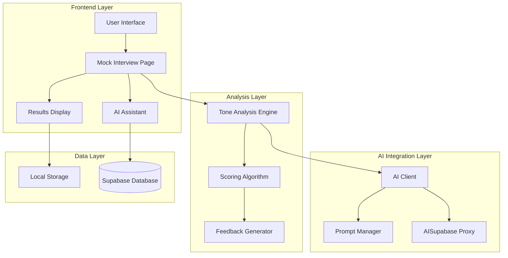
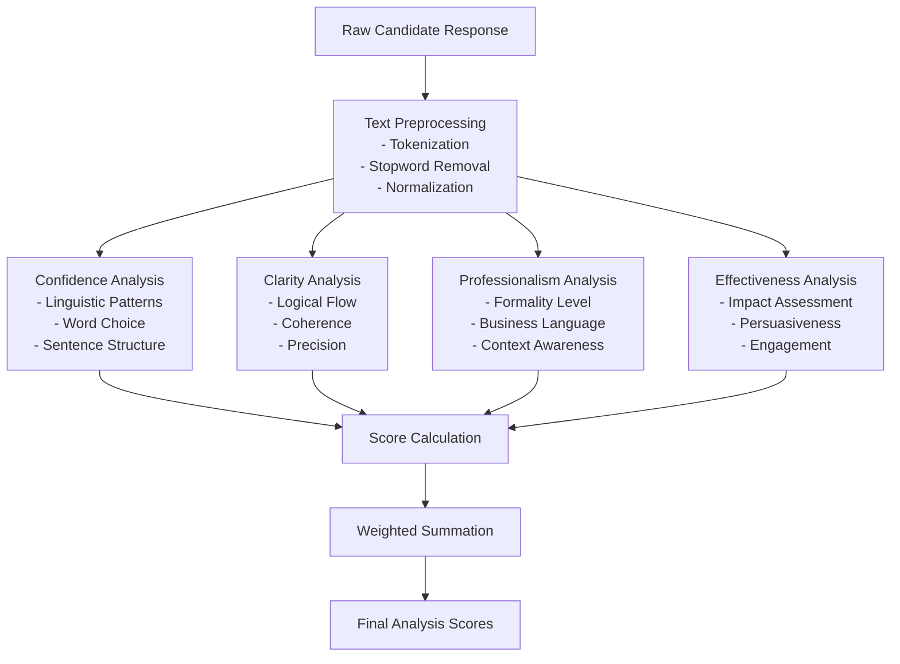
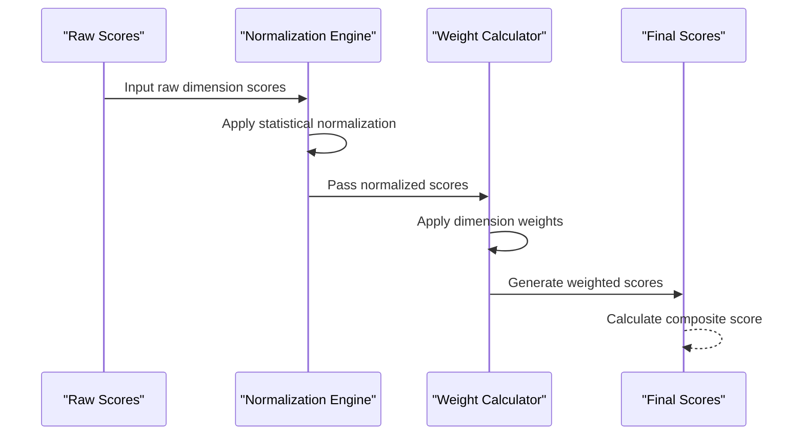
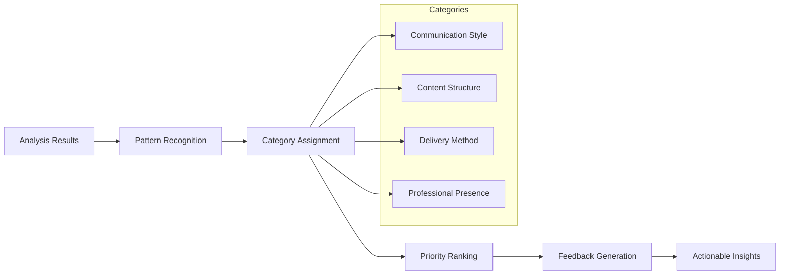
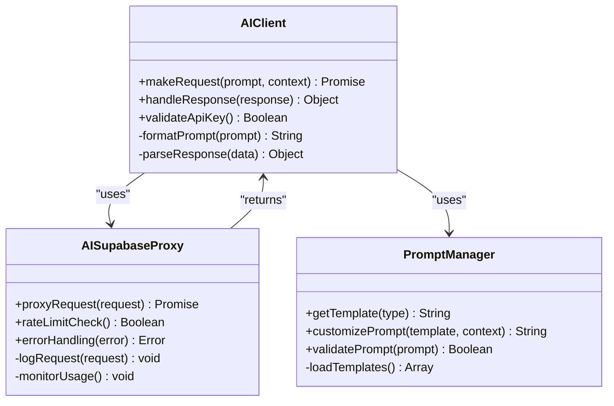
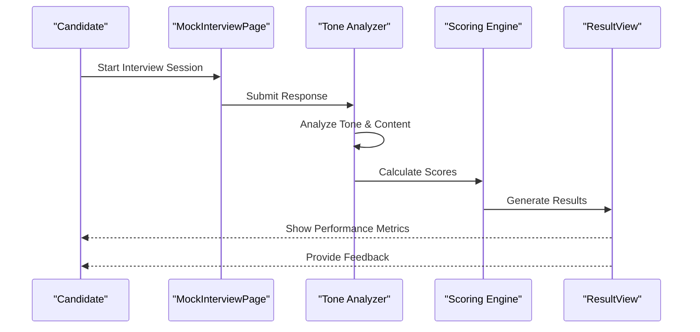

# Tone Analysis & Response Evaluation

<cite>
**Referenced Files in This Document**
- [tone.js](file://src/lib/tone.js)
- [scoring.js](file://src/lib/scoring.js)
- [ai.js](file://src/lib/ai.js)
- [prompt.js](file://src/lib/prompt.js)
- [MockInterviewPage.jsx](file://src/components/MockInterviewPage.jsx)
- [ResultView.jsx](file://src/components/ResultView.jsx)
- [AiAssistant.jsx](file://src/components/AiAssistant.jsx)
- [supabase/functions/ai-proxy/index.ts](file://supabase/functions/ai-proxy/index.ts)
</cite>

## Table of Contents
1. [Introduction](#introduction)
2. [System Architecture](#system-architecture)
3. [Core Components](#core-components)
4. [Tone Analysis Engine](#tone-analysis-engine)
5. [Scoring Algorithms](#scoring-algorithms)
6. [Feedback Generation System](#feedback-generation-system)
7. [AI Integration Layer](#ai-integration-layer)
8. [User Interface Components](#user-interface-components)
9. [Evaluation Criteria](#evaluation-criteria)
10. [Performance Optimization](#performance-optimization)
11. [Troubleshooting Guide](#troubleshooting-guide)
12. [Conclusion](#conclusion)

## Introduction

The Tone Analysis & Response Evaluation system is a sophisticated AI-powered platform designed to analyze candidate responses during mock interviews, providing comprehensive feedback on communication effectiveness, confidence levels, clarity, and professionalism. The system leverages advanced natural language processing techniques and machine learning algorithms to deliver actionable insights that help candidates improve their interview performance.

This documentation provides an in-depth technical overview of the system's architecture, scoring algorithms, feedback generation mechanisms, and integration points with AI services.

## System Architecture

The system follows a modular architecture pattern with clear separation of concerns between tone analysis, scoring algorithms, feedback generation, and user interface components.

**Diagram sources**
- [MockInterviewPage.jsx:1-200](file://src/components/MockInterviewPage.jsx#L1-L200)
- [tone.js:1-150](file://src/lib/tone.js#L1-L150)
- [scoring.js:1-120](file://src/lib/scoring.js#L1-L120)
- [ai.js:1-100](file://src/lib/ai.js#L1-L100)

## Core Components

### Tone Analysis Engine
The tone analysis engine serves as the core component responsible for evaluating candidate responses across multiple dimensions including confidence, clarity, professionalism, and communication effectiveness.

### Scoring Algorithm
The scoring algorithm processes tone analysis results and generates quantitative scores using weighted multi-factor evaluation methods.

### Feedback Generation System
The feedback generator transforms analytical data into actionable insights and improvement suggestions for candidates.

### AI Integration Layer
The AI integration layer manages communication with external AI services through a proxy system for enhanced security and rate limiting.

**Section sources**
- [tone.js:1-150](file://src/lib/tone.js#L1-L150)
- [scoring.js:1-120](file://src/lib/scoring.js#L1-L120)
- [ai.js:1-100](file://src/lib/ai.js#L1-L100)

## Tone Analysis Engine

The tone analysis engine implements a comprehensive framework for evaluating candidate responses across four primary dimensions:

### Confidence Assessment
The confidence analysis evaluates linguistic patterns, word choice, sentence structure, and rhetorical devices to determine the candidate's self-assurance level. Key indicators include:
- Use of definitive language vs. hedging phrases
- Sentence length and complexity
- Active vs. passive voice usage
- Presence of filler words and hesitation markers

### Clarity Evaluation
Clarity assessment focuses on the logical flow of ideas, coherence of arguments, and precision of communication. The system analyzes:
- Logical connectors and transition words
- Paragraph organization and structure
- Redundancy and repetition detection
- Ambiguity identification

### Professionalism Measurement
Professionalism evaluation examines adherence to business communication standards, appropriate language use, and contextual awareness. Metrics include:
- Formality level assessment
- Industry-specific terminology usage
- Cultural sensitivity indicators
- Appropriate tone maintenance

### Communication Effectiveness
Communication effectiveness measures overall impact and persuasiveness of the response. Factors analyzed:
- Storytelling elements and narrative structure
- Persuasive techniques employed
- Audience engagement strategies
- Call-to-action presence

**Diagram sources**
- [tone.js:1-150](file://src/lib/tone.js#L1-L150)

**Section sources**
- [tone.js:1-150](file://src/lib/tone.js#L1-L150)

## Scoring Algorithms

The scoring system employs a sophisticated multi-factor evaluation approach that combines quantitative metrics with qualitative assessments to generate comprehensive performance scores.

### Weighted Scoring Model
The system uses a weighted scoring model where different aspects contribute differently to the final score:

| Dimension | Weight | Description |
|-----------|--------|-------------|
| Confidence | 25% | Self-assurance and conviction in responses |
| Clarity | 30% | Logical flow and communication precision |
| Professionalism | 25% | Business appropriateness and formal language |
| Effectiveness | 20% | Overall impact and persuasiveness |

### Normalization Process
Raw scores undergo normalization to ensure consistency across different question types and difficulty levels:

**Diagram sources**
- [scoring.js:1-120](file://src/lib/scoring.js#L1-L120)

### Adaptive Scoring
The system implements adaptive scoring that adjusts weightings based on:
- Question type (behavioral, technical, situational)
- Role requirements and seniority level
- Industry-specific communication standards
- Historical performance trends

**Section sources**
- [scoring.js:1-120](file://src/lib/scoring.js#L1-L120)

## Feedback Generation System

The feedback generation system transforms analytical data into actionable insights through a multi-stage process that ensures relevance, specificity, and practical applicability.

### Insight Extraction Pipeline
The system extracts key insights from analysis results and categorizes them into improvement areas:

**Diagram sources**
- [scoring.js:1-120](file://src/lib/scoring.js#L1-L120)

### Personalized Recommendations
The system generates personalized improvement suggestions based on:
- Individual performance patterns
- Comparison with industry benchmarks
- Role-specific communication requirements
- Historical progress tracking

### Improvement Roadmap
Candidates receive structured improvement plans with:
- Specific action items with measurable outcomes
- Practice exercises tailored to weak areas
- Progress tracking mechanisms
- Milestone-based achievement validation

**Section sources**
- [scoring.js:1-120](file://src/lib/scoring.js#L1-L120)

## AI Integration Layer

The AI integration layer provides secure and efficient access to external artificial intelligence services through a centralized proxy system.

### AI Service Architecture
The system utilizes a proxy-based architecture to manage AI service communications:

**Diagram sources**
- [ai.js:1-100](file://src/lib/ai.js#L1-L100)
- [supabase/functions/ai-proxy/index.ts:1-200](file://supabase/functions/ai-proxy/index.ts#L1-L200)

### Security and Rate Limiting
The proxy layer implements comprehensive security measures:
- API key management and rotation
- Request authentication and authorization
- Rate limiting and throttling
- Error handling and retry mechanisms
- Usage monitoring and logging

### Custom Analysis Rules
The system supports custom analysis rules that can be configured without code changes:

| Rule Type | Purpose | Configuration |
|-----------|---------|---------------|
| Keyword Detection | Identify specific terms/phrases | Regex patterns |
| Sentiment Analysis | Evaluate emotional tone | ML model parameters |
| Structural Analysis | Assess response organization | Template definitions |
| Domain-Specific Rules | Industry-specific criteria | Custom rule sets |

**Section sources**
- [ai.js:1-100](file://src/lib/ai.js#L1-L100)
- [supabase/functions/ai-proxy/index.ts:1-200](file://supabase/functions/ai-proxy/index.ts#L1-L200)

## User Interface Components

The user interface provides intuitive interaction points for candidates to engage with the tone analysis system and view their performance evaluations.

### Mock Interview Interface
The mock interview page serves as the primary interaction point for candidates:

**Diagram sources**
- [MockInterviewPage.jsx:1-200](file://src/components/MockInterviewPage.jsx#L1-L200)
- [ResultView.jsx:1-150](file://src/components/ResultView.jsx#L1-L150)

### Results Visualization
The results display component presents comprehensive performance analytics through interactive visualizations:
- Real-time score updates
- Comparative analysis charts
- Progress tracking over time
- Detailed breakdown of individual metrics

### AI Assistant Integration
The AI assistant provides contextual guidance and additional support throughout the interview process:

**Section sources**
- [MockInterviewPage.jsx:1-200](file://src/components/MockInterviewPage.jsx#L1-L200)
- [ResultView.jsx:1-150](file://src/components/ResultView.jsx#L1-L150)
- [AiAssistant.jsx:1-100](file://src/components/AiAssistant.jsx#L1-L100)

## Evaluation Criteria

The system employs comprehensive evaluation criteria across multiple dimensions to provide holistic assessment of candidate performance.

### Confidence Indicators
- **Language Certainty**: Use of definitive statements vs. hesitant language
- **Body Language Cues**: Vocal confidence markers and speech patterns
- **Experience Assertion**: How candidates present their qualifications and achievements
- **Decision-Making Presentation**: Demonstration of confident decision-making processes

### Clarity Metrics
- **Logical Structure**: Organization and flow of ideas within responses
- **Conciseness**: Ability to communicate effectively without unnecessary verbosity
- **Specificity**: Use of concrete examples and measurable outcomes
- **Audience Awareness**: Adaptation of communication style to interviewer expectations

### Professionalism Standards
- **Business Etiquette**: Adherence to professional communication norms
- **Industry Terminology**: Appropriate use of field-specific language
- **Cultural Sensitivity**: Awareness of diverse communication preferences
- **Ethical Considerations**: Demonstrating integrity and ethical reasoning

### Communication Effectiveness
- **Storytelling Ability**: Engaging narrative structure in responses
- **Persuasive Techniques**: Use of evidence and logical arguments
- **Emotional Intelligence**: Reading and responding to interviewer cues
- **Adaptability**: Adjusting communication style based on context

**Section sources**
- [tone.js:1-150](file://src/lib/tone.js#L1-L150)
- [scoring.js:1-120](file://src/lib/scoring.js#L1-L120)

## Performance Optimization

The system implements several optimization strategies to ensure responsive and efficient tone analysis:

### Caching Mechanisms
- **Response Caching**: Store frequently analyzed response patterns
- **Score Caching**: Cache computed scores for similar input patterns
- **Template Caching**: Pre-load AI prompt templates for faster processing

### Parallel Processing
- **Multi-threaded Analysis**: Process multiple response dimensions simultaneously
- **Asynchronous AI Calls**: Non-blocking requests to external AI services
- **Batch Processing**: Group related analysis tasks for efficiency

### Memory Management
- **Stream Processing**: Handle large text inputs without memory overflow
- **Garbage Collection**: Efficient cleanup of temporary analysis objects
- **Resource Pooling**: Reuse connections to external services

### Scalability Considerations
- **Horizontal Scaling**: Support for multiple concurrent users
- **Load Balancing**: Distribute analysis requests across available resources
- **Database Optimization**: Efficient storage and retrieval of historical data

## Troubleshooting Guide

Common issues and their resolution strategies when working with the tone analysis system:

### AI Service Connectivity Issues
- **Symptoms**: Timeout errors, connection failures, or inconsistent responses
- **Solutions**: Verify API keys, check network connectivity, implement retry logic
- **Prevention**: Monitor service health, implement circuit breakers

### Analysis Accuracy Problems
- **Symptoms**: Inconsistent scoring, unexpected results, or biased evaluations
- **Solutions**: Review analysis rules, update training data, adjust weighting factors
- **Prevention**: Regular model retraining, continuous quality assurance

### Performance Bottlenecks
- **Symptoms**: Slow response times, high memory usage, or system lag
- **Solutions**: Optimize caching strategies, implement lazy loading, review database queries
- **Prevention**: Load testing, performance monitoring, resource allocation planning

### Data Synchronization Issues
- **Symptoms**: Lost analysis results, inconsistent user data, or sync failures
- **Solutions**: Implement conflict resolution, verify data integrity, restore from backups
- **Prevention**: Robust error handling, transaction management, regular backups

**Section sources**
- [ai.js:1-100](file://src/lib/ai.js#L1-L100)
- [scoring.js:1-120](file://src/lib/scoring.js#L1-L120)

## Conclusion

The Tone Analysis & Response Evaluation system represents a comprehensive solution for enhancing interview preparation through intelligent analysis and feedback. By combining advanced natural language processing, machine learning algorithms, and user-centric design, the system provides candidates with actionable insights that drive meaningful improvement in their communication skills.

The modular architecture ensures scalability and maintainability, while the AI integration layer provides flexibility for future enhancements and customizations. The system's emphasis on actionable feedback and progressive improvement aligns with best practices in educational technology and professional development platforms.

Future enhancements may include expanded language support, more sophisticated behavioral analysis, integration with additional assessment frameworks, and enhanced personalization capabilities based on individual learning patterns and career goals.