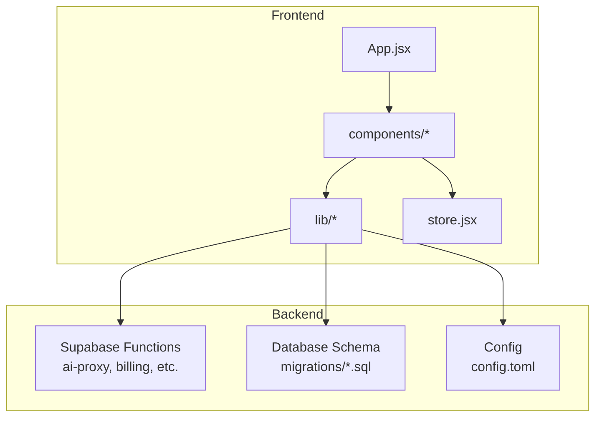
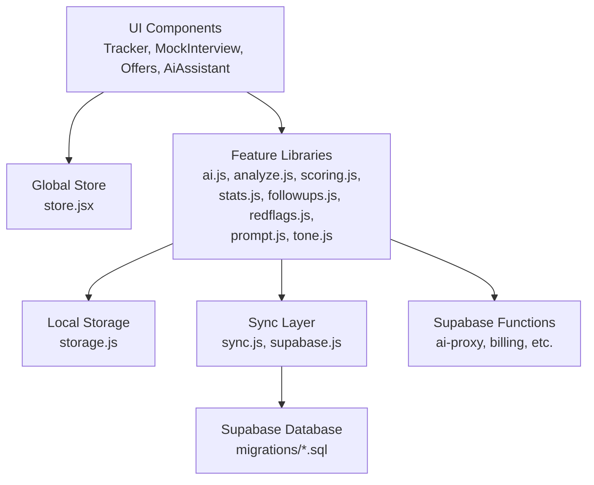
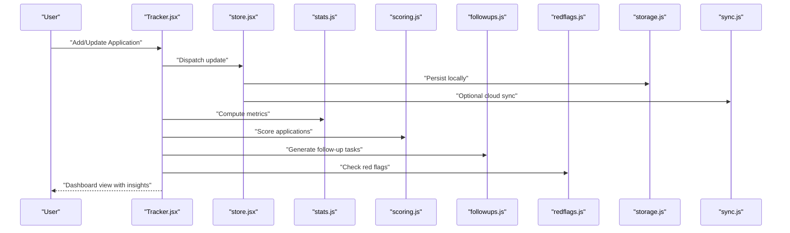
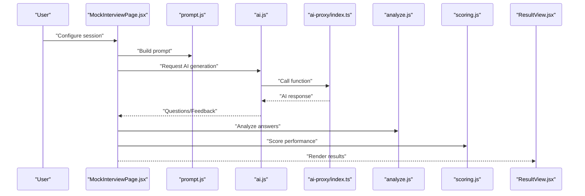
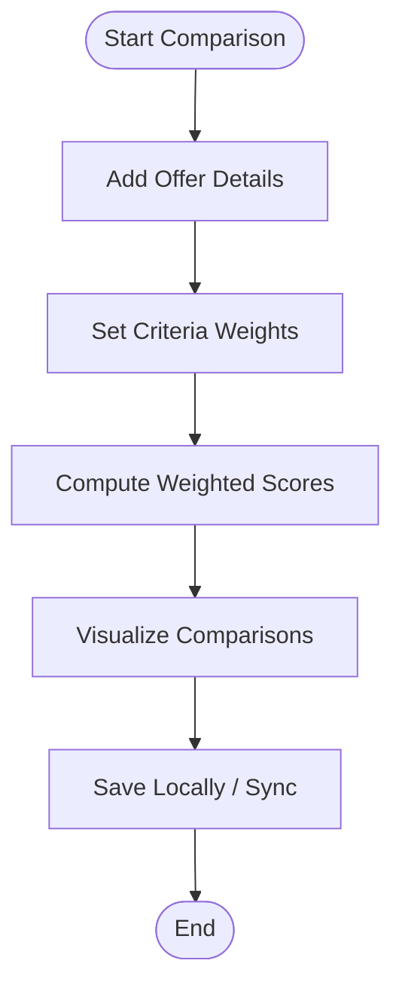
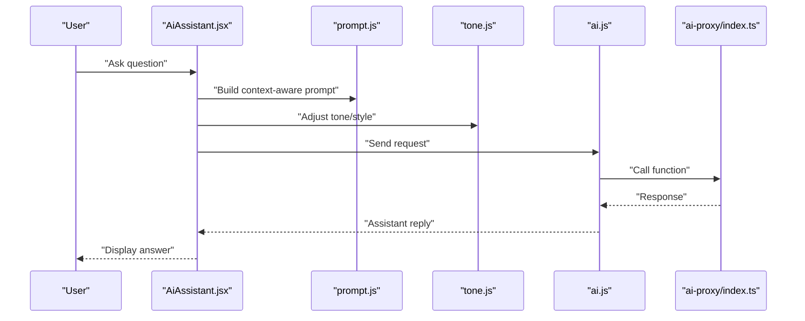
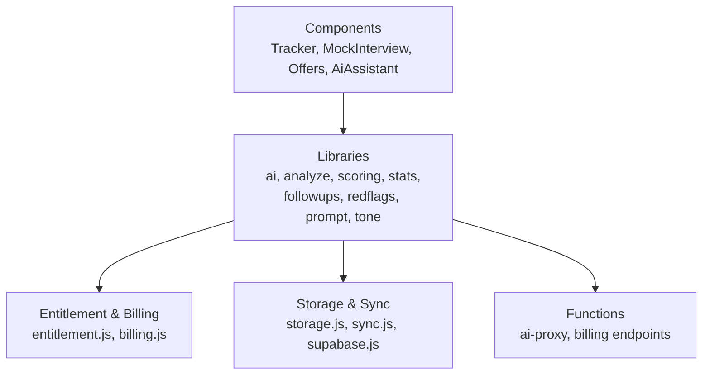

# Core Features

<cite>
**Referenced Files in This Document**
- [App.jsx](file://src/App.jsx)
- [main.jsx](file://src/main.jsx)
- [store.jsx](file://src/store.jsx)
- [Tracker.jsx](file://src/components/Tracker.jsx)
- [MockInterviewPage.jsx](file://src/components/MockInterviewPage.jsx)
- [OffersPage.jsx](file://src/components/OffersPage.jsx)
- [AiAssistant.jsx](file://src/components/AiAssistant.jsx)
- [Settings.jsx](file://src/components/Settings.jsx)
- [ResultView.jsx](file://src/components/ResultView.jsx)
- [ScanForm.jsx](file://src/components/ScanForm.jsx)
- [auth.jsx](file://src/auth.jsx)
- [ai.js](file://src/lib/ai.js)
- [analyze.js](file://src/lib/analyze.js)
- [scoring.js](file://src/lib/scoring.js)
- [stats.js](file://src/lib/stats.js)
- [followups.js](file://src/lib/followups.js)
- [redflags.js](file://src/lib/redflags.js)
- [prompt.js](file://src/lib/prompt.js)
- [tone.js](file://src/lib/tone.js)
- [storage.js](file://src/lib/storage.js)
- [supabase.js](file://src/lib/supabase.js)
- [sync.js](file://src/lib/sync.js)
- [entitlement.js](file://src/lib/entitlement.js)
- [billing.js](file://src/lib/billing.js)
- [pricing.js](file://src/lib/pricing.js)
- [share.js](file://src/lib/share.js)
- [clipboard.js](file://src/lib/clipboard.js)
- [csv.js](file://src/lib/csv.js)
- [001_schema.sql](file://supabase/migrations/001_schema.sql)
- [002_paypal_fulfillment.sql](file://supabase/migrations/002_paypal_fulfillment.sql)
- [config.toml](file://supabase/config.toml)
- [index.ts](file://supabase/functions/ai-proxy/index.ts)
- [http.ts](file://supabase/functions/_shared/http.ts)
- [entitlement.ts](file://supabase/functions/_shared/entitlement.ts)
- [prompts.ts](file://supabase/functions/_shared/prompts.ts)
</cite>

## Table of Contents
1. Introduction
2. Project Structure
3. Core Components
4. Architecture Overview
5. Detailed Component Analysis
6. Dependency Analysis
7. Performance Considerations
8. Troubleshooting Guide
9. Conclusion

## Introduction
This document explains the core features of ApplyGuard PH:
- Job Application Tracker Dashboard
- AI-Powered Interview Preparation System
- Offer Comparison Tools
- AI Assistant Functionality

It covers user workflows, feature interactions, shared data models, configuration options, and customization possibilities. The goal is to help both technical and non-technical users understand how the application works end-to-end.

## Project Structure
The application is a modern web app with React components on the frontend, Supabase for backend services (database, functions), and local storage for offline-first capabilities. Key areas:
- Frontend UI and state management under src/components and src/store.jsx
- Feature logic and utilities under src/lib
- Backend schema and serverless functions under supabase
- Configuration files at the root and under supabase

[No sources needed since this diagram shows conceptual structure]

## Core Components
- App.jsx: Top-level routing and layout orchestration
- store.jsx: Global state and cross-feature data sharing
- Tracker.jsx: Job application tracker dashboard
- MockInterviewPage.jsx: AI-powered interview preparation
- OffersPage.jsx: Offer comparison tools
- AiAssistant.jsx: Conversational AI assistant
- Settings.jsx: User preferences and feature toggles
- ResultView.jsx: Results display for analysis and scoring
- ScanForm.jsx: Input form for resume or job description scanning

These components integrate via shared libraries (ai.js, analyze.js, scoring.js, stats.js, followups.js, redflags.js, prompt.js, tone.js) and persist data through storage.js and sync.js, with optional cloud sync via supabase.js.

**Section sources**
- [App.jsx](file://src/App.jsx)
- [store.jsx](file://src/store.jsx)
- [Tracker.jsx](file://src/components/Tracker.jsx)
- [MockInterviewPage.jsx](file://src/components/MockInterviewPage.jsx)
- [OffersPage.jsx](file://src/components/OffersPage.jsx)
- [AiAssistant.jsx](file://src/components/AiAssistant.jsx)
- [Settings.jsx](file://src/components/Settings.jsx)
- [ResultView.jsx](file://src/components/ResultView.jsx)
- [ScanForm.jsx](file://src/components/ScanForm.jsx)

## Architecture Overview
ApplyGuard PH follows a layered architecture:
- Presentation layer: React components
- Domain logic: Feature-specific utilities and AI integration
- Data layer: Local storage, optional Supabase sync, and database schema
- Integration layer: Serverless functions for AI proxy and billing

**Diagram sources**
- [store.jsx](file://src/store.jsx)
- [ai.js](file://src/lib/ai.js)
- [analyze.js](file://src/lib/analyze.js)
- [scoring.js](file://src/lib/scoring.js)
- [stats.js](file://src/lib/stats.js)
- [followups.js](file://src/lib/followups.js)
- [redflags.js](file://src/lib/redflags.js)
- [prompt.js](file://src/lib/prompt.js)
- [tone.js](file://src/lib/tone.js)
- [storage.js](file://src/lib/storage.js)
- [sync.js](file://src/lib/sync.js)
- [supabase.js](file://src/lib/supabase.js)
- [001_schema.sql](file://supabase/migrations/001_schema.sql)
- [002_paypal_fulfillment.sql](file://supabase/migrations/002_paypal_fulfillment.sql)
- [index.ts](file://supabase/functions/ai-proxy/index.ts)

## Detailed Component Analysis

### Job Application Tracker Dashboard
Purpose: Track applications, statuses, notes, and next actions; visualize progress and generate insights.

User workflow:
- Add or import applications
- Update status and add notes
- View analytics and suggestions
- Export or share summaries

Key interactions:
- Tracker component orchestrates CRUD operations
- Stats and scoring libraries compute metrics
- Follow-ups and red flags provide actionable insights
- Storage persists locally; sync optionally pushes to Supabase

**Diagram sources**
- [Tracker.jsx](file://src/components/Tracker.jsx)
- [store.jsx](file://src/store.jsx)
- [stats.js](file://src/lib/stats.js)
- [scoring.js](file://src/lib/scoring.js)
- [followups.js](file://src/lib/followups.js)
- [redflags.js](file://src/lib/redflags.js)
- [storage.js](file://src/lib/storage.js)
- [sync.js](file://src/lib/sync.js)

Configuration and customization:
- Status categories and labels can be configured via settings
- Scoring weights and thresholds adjustable in scoring library
- Follow-up rules customizable in follow-ups module
- Red flag detection parameters tunable in redflags module

Data model highlights:
- Applications include identifiers, company, role, status, dates, notes, scores, and follow-up items
- Analytics aggregate counts, conversion rates, and time-in-stage metrics

**Section sources**
- [Tracker.jsx](file://src/components/Tracker.jsx)
- [store.jsx](file://src/store.jsx)
- [stats.js](file://src/lib/stats.js)
- [scoring.js](file://src/lib/scoring.js)
- [followups.js](file://src/lib/followups.js)
- [redflags.js](file://src/lib/redflags.js)
- [storage.js](file://src/lib/storage.js)
- [sync.js](file://src/lib/sync.js)

### AI-Powered Interview Preparation System
Purpose: Generate mock interviews, questions, and feedback using AI prompts and analysis.

User workflow:
- Select role or paste job description
- Configure difficulty and focus areas
- Start mock session and receive questions
- Review answers and get feedback

Key interactions:
- MockInterviewPage coordinates session flow
- ai.js handles AI calls via Supabase functions
- prompt.js builds structured prompts
- analyze.js and scoring.js evaluate responses
- ResultView displays outcomes

**Diagram sources**
- [MockInterviewPage.jsx](file://src/components/MockInterviewPage.jsx)
- [prompt.js](file://src/lib/prompt.js)
- [ai.js](file://src/lib/ai.js)
- [index.ts](file://supabase/functions/ai-proxy/index.ts)
- [analyze.js](file://src/lib/analyze.js)
- [scoring.js](file://src/lib/scoring.js)
- [ResultView.jsx](file://src/components/ResultView.jsx)

Configuration and customization:
- Prompt templates and styles configurable in prompt.js
- Tone and style adjustments in tone.js
- Difficulty levels and question categories adjustable in MockInterviewPage
- Scoring rubrics tuned in scoring.js

Data model highlights:
- Sessions include role, difficulty, generated questions, user answers, and scores
- Feedback includes strengths, weaknesses, and improvement tips

**Section sources**
- [MockInterviewPage.jsx](file://src/components/MockInterviewPage.jsx)
- [prompt.js](file://src/lib/prompt.js)
- [ai.js](file://src/lib/ai.js)
- [index.ts](file://supabase/functions/ai-proxy/index.ts)
- [analyze.js](file://src/lib/analyze.js)
- [scoring.js](file://src/lib/scoring.js)
- [ResultView.jsx](file://src/components/ResultView.jsx)

### Offer Comparison Tools
Purpose: Compare multiple offers side-by-side, score them, and visualize trade-offs.

User workflow:
- Add offers with compensation, benefits, and conditions
- Adjust weights for criteria (salary, growth, location, etc.)
- View comparative scores and recommendations

Key interactions:
- OffersPage manages offer entries and comparisons
- scoring.js computes weighted scores
- stats.js provides summary metrics
- storage.js persists offers; sync.js optionally syncs

**Diagram sources**
- [OffersPage.jsx](file://src/components/OffersPage.jsx)
- [scoring.js](file://src/lib/scoring.js)
- [stats.js](file://src/lib/stats.js)
- [storage.js](file://src/lib/storage.js)
- [sync.js](file://src/lib/sync.js)

Configuration and customization:
- Criteria list and default weights configurable in OffersPage
- Scoring formulas adjustable in scoring.js
- Visualization options controlled by UI props

Data model highlights:
- Offers include base salary, bonuses, equity, benefits, location, growth potential, and custom fields
- Scores reflect weighted aggregation across criteria

**Section sources**
- [OffersPage.jsx](file://src/components/OffersPage.jsx)
- [scoring.js](file://src/lib/scoring.js)
- [stats.js](file://src/lib/stats.js)
- [storage.js](file://src/lib/storage.js)
- [sync.js](file://src/lib/sync.js)

### AI Assistant Functionality
Purpose: Provide conversational assistance for job search strategy, resume tips, interview prep, and offer negotiation.

User workflow:
- Open AiAssistant
- Ask questions or request guidance
- Receive contextual advice based on stored applications and offers

Key interactions:
- AiAssistant composes prompts using prompt.js and tone.js
- ai.js routes requests to ai-proxy function
- Context may include recent applications, scores, and follow-ups

**Diagram sources**
- [AiAssistant.jsx](file://src/components/AiAssistant.jsx)
- [prompt.js](file://src/lib/prompt.js)
- [tone.js](file://src/lib/tone.js)
- [ai.js](file://src/lib/ai.js)
- [index.ts](file://supabase/functions/ai-proxy/index.ts)

Configuration and customization:
- Prompt templates and system instructions in prompt.js
- Tone presets and style modifiers in tone.js
- Access controls and entitlement checks via entitlement.js and billing.js

Data model highlights:
- Assistant maintains conversation history and references relevant application/offer data
- Responses are not persisted by default unless explicitly saved by the user

**Section sources**
- [AiAssistant.jsx](file://src/components/AiAssistant.jsx)
- [prompt.js](file://src/lib/prompt.js)
- [tone.js](file://src/lib/tone.js)
- [ai.js](file://src/lib/ai.js)
- [index.ts](file://supabase/functions/ai-proxy/index.ts)
- [entitlement.js](file://src/lib/entitlement.js)
- [billing.js](file://src/lib/billing.js)

### Shared Data Models and Cross-Feature Integration
Common entities:
- Application: id, company, role, status, dates, notes, scores, follow-ups
- Offer: id, compensation details, benefits, location, growth factors, scores
- Session: id, role/difficulty, questions, answers, scores, feedback
- Conversation: id, messages, context references

Integration points:
- Tracker and Offers share scoring and stats modules
- MockInterview and AiAssistant share prompt and AI integration layers
- All features use storage and sync for persistence and optional cloud backup

```mermaid
erDiagram
APPLICATION {
string id PK
string company
string role
enum status
timestamp applied_at
timestamp last_updated
text notes
float score
}
OFFER {
string id PK
string company
string role
float base_salary
float bonus
float equity
text benefits
string location
float growth_potential
float score
}
SESSION {
string id PK
string role
string difficulty
json questions
json answers
float score
text feedback
}
CONVERSATION {
string id PK
json messages
string context_ref
}
APPLICATION ||--o{ FOLLOWUP : "has"
OFFER ||--o{ SCORE_DETAIL : "includes"
SESSION ||--o{ FEEDBACK_ITEM : "produces"
CONVERSATION ||--|| USER_PREF : "uses"
```

[No sources needed since this diagram shows conceptual data models]

## Dependency Analysis
High-level dependencies:
- Components depend on lib utilities for domain logic
- AI integration depends on ai-proxy function and shared HTTP helpers
- Billing and entitlements gate advanced features
- Storage and sync manage persistence and cloud consistency

**Diagram sources**
- [Tracker.jsx](file://src/components/Tracker.jsx)
- [MockInterviewPage.jsx](file://src/components/MockInterviewPage.jsx)
- [OffersPage.jsx](file://src/components/OffersPage.jsx)
- [AiAssistant.jsx](file://src/components/AiAssistant.jsx)
- [ai.js](file://src/lib/ai.js)
- [analyze.js](file://src/lib/analyze.js)
- [scoring.js](file://src/lib/scoring.js)
- [stats.js](file://src/lib/stats.js)
- [followups.js](file://src/lib/followups.js)
- [redflags.js](file://src/lib/redflags.js)
- [prompt.js](file://src/lib/prompt.js)
- [tone.js](file://src/lib/tone.js)
- [entitlement.js](file://src/lib/entitlement.js)
- [billing.js](file://src/lib/billing.js)
- [storage.js](file://src/lib/storage.js)
- [sync.js](file://src/lib/sync.js)
- [supabase.js](file://src/lib/supabase.js)
- [index.ts](file://supabase/functions/ai-proxy/index.ts)

**Section sources**
- [entitlement.js](file://src/lib/entitlement.js)
- [billing.js](file://src/lib/billing.js)
- [ai.js](file://src/lib/ai.js)
- [index.ts](file://supabase/functions/ai-proxy/index.ts)
- [storage.js](file://src/lib/storage.js)
- [sync.js](file://src/lib/sync.js)
- [supabase.js](file://src/lib/supabase.js)

## Performance Considerations
- Prefer local storage for frequent reads/writes; batch sync operations to reduce network overhead
- Cache AI responses where appropriate to avoid redundant calls
- Optimize scoring computations by memoizing heavy calculations
- Use pagination or virtualization for large lists in Tracker and Offers views
- Keep prompt payloads concise to reduce latency and costs

[No sources needed since this section provides general guidance]

## Troubleshooting Guide
Common issues and resolutions:
- AI proxy failures: Check function availability and error logs; verify entitlements and billing status
- Sync conflicts: Ensure consistent timestamps and merge strategies; review sync logs
- Storage errors: Validate JSON serialization and size limits; clear corrupted entries if necessary
- Scoring anomalies: Inspect input data quality and weight configurations; validate scoring formulas

Operational hooks:
- Error boundaries and toast notifications for user feedback
- Logging utilities in libraries for debugging
- Share/export utilities for diagnostics

**Section sources**
- [Toast.jsx](file://src/components/Toast.jsx)
- [ai.js](file://src/lib/ai.js)
- [sync.js](file://src/lib/sync.js)
- [storage.js](file://src/lib/storage.js)
- [share.js](file://src/lib/share.js)
- [clipboard.js](file://src/lib/clipboard.js)
- [csv.js](file://src/lib/csv.js)

## Conclusion
ApplyGuard PH integrates a robust job application tracker, AI-driven interview preparation, offer comparison tools, and an AI assistant into a cohesive platform. Shared libraries ensure consistent scoring, analytics, and AI behavior across features. Users can customize prompts, tones, scoring weights, and follow-up rules to tailor the experience. With local-first storage and optional cloud sync, the app balances responsiveness and reliability.

[No sources needed since this section summarizes without analyzing specific files]