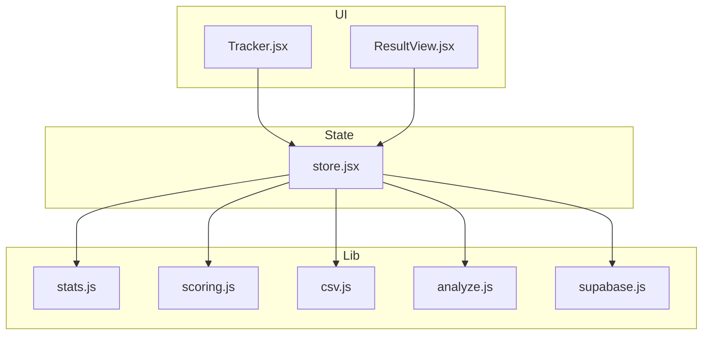
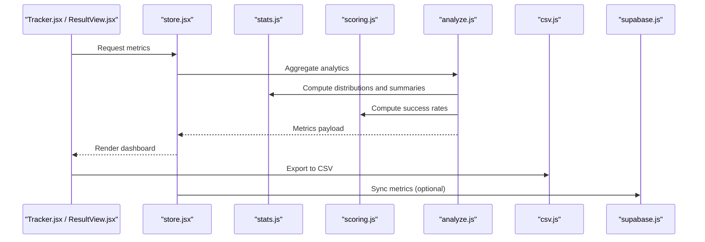
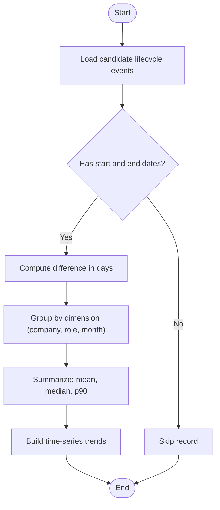
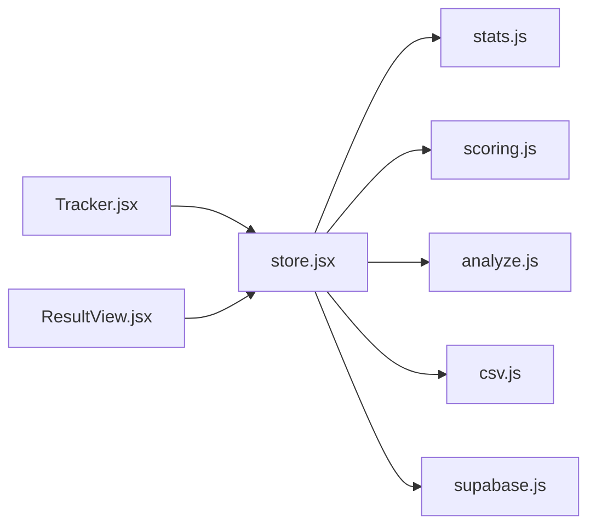

# Analytics & Statistics

<cite>
**Referenced Files in This Document**
- [stats.js](file://src/lib/stats.js)
- [stats.test.js](file://src/lib/stats.test.js)
- [scoring.js](file://src/lib/scoring.js)
- [scoring.test.js](file://src/lib/scoring.test.js)
- [csv.js](file://src/lib/csv.js)
- [csv.test.js](file://src/lib/csv.test.js)
- [analyze.js](file://src/lib/analyze.js)
- [store.jsx](file://src/store.jsx)
- [Tracker.jsx](file://src/components/Tracker.jsx)
- [ResultView.jsx](file://src/components/ResultView.jsx)
- [supabase.js](file://src/lib/supabase.js)
</cite>

## Table of Contents
1. [Introduction](#introduction)
2. [Project Structure](#project-structure)
3. [Core Components](#core-components)
4. [Architecture Overview](#architecture-overview)
5. [Detailed Component Analysis](#detailed-component-analysis)
6. [Dependency Analysis](#dependency-analysis)
7. [Performance Considerations](#performance-considerations)
8. [Troubleshooting Guide](#troubleshooting-guide)
9. [Conclusion](#conclusion)
10. [Appendices](#appendices)

## Introduction
This document explains the analytics and statistics features implemented in the application, focusing on metrics computation, success rates, time-to-hire calculations, company analysis, trend visualization, statistical methods, chart generation, export capabilities, and performance insights. It also provides guidance for common analytics queries, custom report generation, and best practices for data visualization.

The analytics layer is primarily implemented in client-side JavaScript modules that compute metrics from local data stores and optionally integrate with Supabase for persistence or synchronization. The UI components consume these metrics to render dashboards, charts, and reports.

## Project Structure
Analytics-related functionality is organized under src/lib and consumed by UI components:

- Core analytics and statistics logic:
  - stats.js: Statistical computations (means, medians, percentiles, distributions).
  - scoring.js: Scoring and success rate calculations.
  - csv.js: Export utilities for CSV-based reporting.
  - analyze.js: Aggregation and higher-level analytics functions.
- Data access:
  - supabase.js: Optional integration for remote storage and sync.
- State management and UI:
  - store.jsx: Centralized state for analytics data.
  - Tracker.jsx: Tracks events and aggregates metrics over time.
  - ResultView.jsx: Displays results and visualizations.

**Diagram sources**
- [stats.js](file://src/lib/stats.js)
- [scoring.js](file://src/lib/scoring.js)
- [csv.js](file://src/lib/csv.js)
- [analyze.js](file://src/lib/analyze.js)
- [supabase.js](file://src/lib/supabase.js)
- [store.jsx](file://src/store.jsx)
- [Tracker.jsx](file://src/components/Tracker.jsx)
- [ResultView.jsx](file://src/components/ResultView.jsx)

**Section sources**
- [stats.js](file://src/lib/stats.js)
- [scoring.js](file://src/lib/scoring.js)
- [csv.js](file://src/lib/csv.js)
- [analyze.js](file://src/lib/analyze.js)
- [supabase.js](file://src/lib/supabase.js)
- [store.jsx](file://src/store.jsx)
- [Tracker.jsx](file://src/components/Tracker.jsx)
- [ResultView.jsx](file://src/components/ResultView.jsx)

## Core Components
- Statistical engine (stats.js): Provides core math utilities such as mean, median, quartiles, percentiles, standard deviation, variance, and distribution helpers used across analytics features.
- Scoring and success rates (scoring.js): Computes success indicators, pass/fail outcomes, and derived success rates based on defined thresholds and criteria.
- CSV export (csv.js): Serializes computed metrics into CSV format for sharing and external analysis.
- Analytics aggregation (analyze.js): Orchestrates higher-level analytics like time-to-hire, company breakdowns, and trend series.
- State and UI (store.jsx, Tracker.jsx, ResultView.jsx): Maintain analytics state, track events, and render visualizations and summaries.

Key responsibilities:
- Compute robust summary statistics and distributions.
- Derive business metrics (success rates, time-to-hire).
- Aggregate and group metrics by dimensions (e.g., company).
- Generate exports and support downstream reporting.

**Section sources**
- [stats.js](file://src/lib/stats.js)
- [scoring.js](file://src/lib/scoring.js)
- [csv.js](file://src/lib/csv.js)
- [analyze.js](file://src/lib/analyze.js)
- [store.jsx](file://src/store.jsx)
- [Tracker.jsx](file://src/components/Tracker.jsx)
- [ResultView.jsx](file://src/components/ResultView.jsx)

## Architecture Overview
The analytics architecture follows a layered approach:
- Data layer: Local state and optional Supabase integration.
- Computation layer: Statistical and business metric calculators.
- Presentation layer: UI components rendering dashboards and charts.

**Diagram sources**
- [Tracker.jsx](file://src/components/Tracker.jsx)
- [ResultView.jsx](file://src/components/ResultView.jsx)
- [store.jsx](file://src/store.jsx)
- [stats.js](file://src/lib/stats.js)
- [scoring.js](file://src/lib/scoring.js)
- [analyze.js](file://src/lib/analyze.js)
- [csv.js](file://src/lib/csv.js)
- [supabase.js](file://src/lib/supabase.js)

## Detailed Component Analysis

### Statistical Engine (stats.js)
Responsibilities:
- Provide deterministic and numerically stable calculations for central tendency, dispersion, and quantiles.
- Support percentile ranking and distribution binning for trend visualization.

Common operations:
- Mean and median calculation.
- Quartile and percentile computation.
- Variance and standard deviation.
- Distribution helpers for histogram-like grouping.

Complexity considerations:
- Sorting-based quantile computations are O(n log n).
- Streaming-friendly aggregations can be designed using running sums and counts where applicable.

Best practices:
- Guard against empty inputs and NaN values.
- Use consistent rounding strategies for display vs. internal precision.

**Section sources**
- [stats.js](file://src/lib/stats.js)
- [stats.test.js](file://src/lib/stats.test.js)

### Scoring and Success Rates (scoring.js)
Responsibilities:
- Determine pass/fail outcomes based on configurable thresholds.
- Compute success rates per cohort, period, or dimension.

Key concepts:
- Thresholding rules for success classification.
- Weighted or unweighted success rate aggregation.
- Handling missing or partial data gracefully.

Edge cases:
- Zero denominators when computing rates.
- Mixed data types and null handling.

**Section sources**
- [scoring.js](file://src/lib/scoring.js)
- [scoring.test.js](file://src/lib/scoring.test.js)

### Time-to-Hire Calculations (analyze.js)
Responsibilities:
- Calculate time-to-hire metrics from event timestamps.
- Segment by role, source, or company.
- Produce trend series for monthly or weekly intervals.

Algorithm overview:

**Diagram sources**
- [analyze.js](file://src/lib/analyze.js)

**Section sources**
- [analyze.js](file://src/lib/analyze.js)

### Company Analysis (analyze.js)
Responsibilities:
- Aggregate metrics by company name or identifier.
- Compare success rates and time-to-hire across companies.
- Identify outliers and top performers.

Approach:
- Group records by company.
- Apply statistical summaries per group.
- Rank companies by selected KPIs.

**Section sources**
- [analyze.js](file://src/lib/analyze.js)

### Trend Visualization (stats.js, analyze.js)
Responsibilities:
- Prepare time-series data for charts.
- Compute rolling averages and smoothing where appropriate.
- Ensure consistent bucketing (weekly/monthly) for comparability.

Visualization tips:
- Use line charts for continuous trends.
- Overlay confidence bands or moving averages for clarity.
- Normalize axes when comparing multiple series.

**Section sources**
- [stats.js](file://src/lib/stats.js)
- [analyze.js](file://src/lib/analyze.js)

### Export Capabilities (csv.js)
Responsibilities:
- Serialize metrics and raw datasets to CSV.
- Include headers and metadata for traceability.
- Support multi-sheet or concatenated outputs if needed.

Usage patterns:
- Export filtered views (by date range or company).
- Append timestamped filenames for versioning.

**Section sources**
- [csv.js](file://src/lib/csv.js)
- [csv.test.js](file://src/lib/csv.test.js)

### State Management and UI Integration (store.jsx, Tracker.jsx, ResultView.jsx)
Responsibilities:
- Maintain analytics state and trigger recomputation on data changes.
- Track user interactions and funnel events for analytics.
- Render dashboards, tables, and charts based on computed metrics.

Integration points:
- Subscribe to store updates and recompute metrics reactively.
- Debounce heavy computations to avoid UI jank.
- Provide hooks or selectors for specific metric slices.

**Section sources**
- [store.jsx](file://src/store.jsx)
- [Tracker.jsx](file://src/components/Tracker.jsx)
- [ResultView.jsx](file://src/components/ResultView.jsx)

### Optional Persistence and Sync (supabase.js)
Responsibilities:
- Persist computed metrics or raw events to Supabase.
- Sync across devices or sessions.
- Fetch historical data for long-term trend analysis.

Considerations:
- Handle network errors and retries.
- Respect quotas and rate limits.
- Keep local cache in sync with server state.

**Section sources**
- [supabase.js](file://src/lib/supabase.js)

## Dependency Analysis
The analytics subsystem has clear separation between computation and presentation:

Observations:
- Low coupling between UI and computation via store.
- CSV export depends only on computed metrics.
- Supabase integration is optional and decoupled from core math.

**Diagram sources**
- [store.jsx](file://src/store.jsx)
- [stats.js](file://src/lib/stats.js)
- [scoring.js](file://src/lib/scoring.js)
- [analyze.js](file://src/lib/analyze.js)
- [csv.js](file://src/lib/csv.js)
- [supabase.js](file://src/lib/supabase.js)
- [Tracker.jsx](file://src/components/Tracker.jsx)
- [ResultView.jsx](file://src/components/ResultView.jsx)

**Section sources**
- [store.jsx](file://src/store.jsx)
- [stats.js](file://src/lib/stats.js)
- [scoring.js](file://src/lib/scoring.js)
- [analyze.js](file://src/lib/analyze.js)
- [csv.js](file://src/lib/csv.js)
- [supabase.js](file://src/lib/supabase.js)
- [Tracker.jsx](file://src/components/Tracker.jsx)
- [ResultView.jsx](file://src/components/ResultView.jsx)

## Performance Considerations
- Prefer memoization for expensive aggregations keyed by filters (date range, company).
- Use streaming or incremental updates for large datasets to avoid blocking the main thread.
- Batch CSV exports and compress payloads when exporting large volumes.
- Debounce user-driven filter changes before recomputing metrics.
- Cache intermediate results (e.g., grouped datasets) to reuse across multiple visualizations.

[No sources needed since this section provides general guidance]

## Troubleshooting Guide
Common issues and resolutions:
- Empty or invalid date ranges: Validate inputs before computing time-to-hire; skip malformed records.
- Division by zero in success rates: Guard against zero denominators and return safe defaults.
- Out-of-memory during exports: Stream CSV rows instead of building full strings in memory.
- Stale metrics after data changes: Ensure store subscriptions trigger recomputation and invalidate caches.
- Network failures for Supabase sync: Implement retry with exponential backoff and fallback to local-only mode.

**Section sources**
- [stats.test.js](file://src/lib/stats.test.js)
- [scoring.test.js](file://src/lib/scoring.test.js)
- [csv.test.js](file://src/lib/csv.test.js)

## Conclusion
The analytics and statistics features provide a robust foundation for measuring hiring performance, including success rates, time-to-hire, company comparisons, and trend analysis. The modular design separates computation from presentation, enabling flexible reporting and export capabilities. Following the best practices outlined here will help maintain accuracy, performance, and usability across dashboards and reports.

[No sources needed since this section summarizes without analyzing specific files]

## Appendices

### Common Analytics Queries
- Success rate by company:
  - Group records by company, compute pass/fail ratio, and rank by success rate.
- Median time-to-hire by role:
  - Filter by role, compute differences between start and end dates, then calculate median.
- Monthly trend of applications:
  - Bucket events by month, count totals, and plot as a line chart.
- Top 10 companies by throughput:
  - Count total candidates per company and sort descending.

[No sources needed since this section provides general guidance]

### Custom Report Generation
- Define report parameters (date range, dimensions, metrics).
- Build query pipeline: filter -> group -> aggregate -> summarize.
- Render tabular view and export to CSV.
- Add chart overlays (rolling average, percentiles) for deeper insight.

[No sources needed since this section provides general guidance]

### Data Visualization Best Practices
- Choose appropriate chart types:
  - Line for trends, bar for categorical comparisons, scatter for correlations.
- Normalize axes when comparing disparate scales.
- Annotate key inflection points and outliers.
- Provide tooltips and drill-downs for detailed inspection.
- Ensure accessibility: colorblind-safe palettes and sufficient contrast.

[No sources needed since this section provides general guidance]