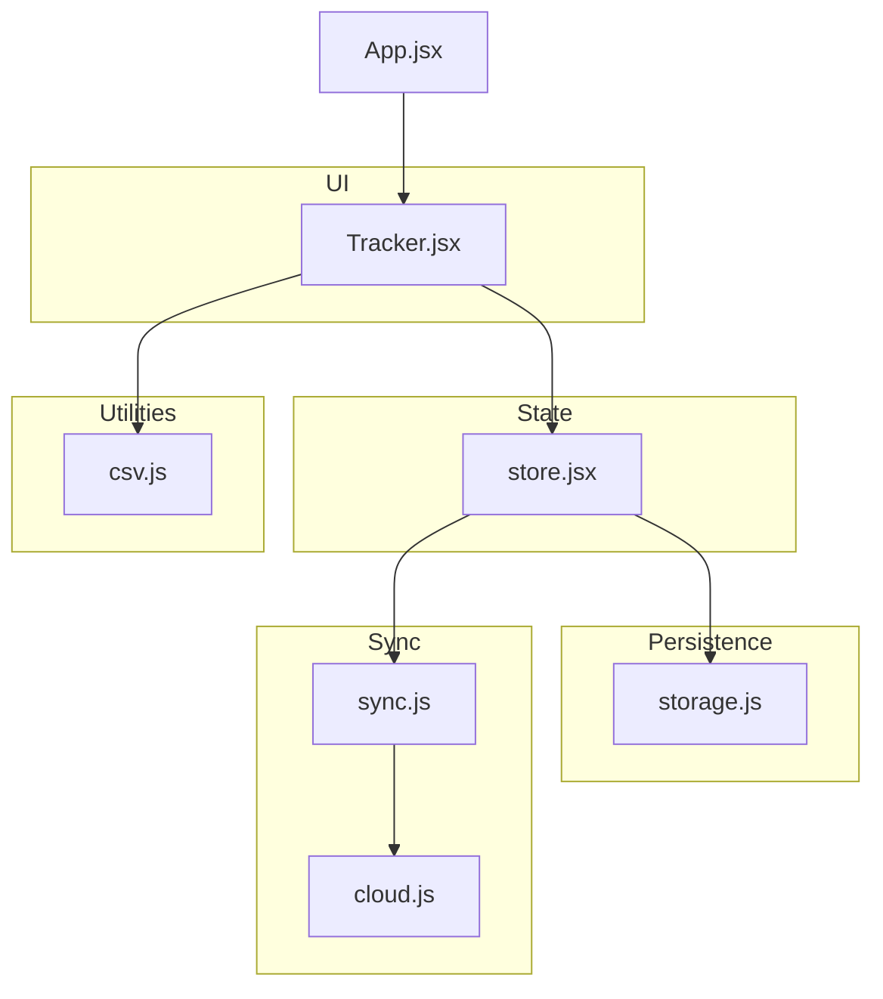
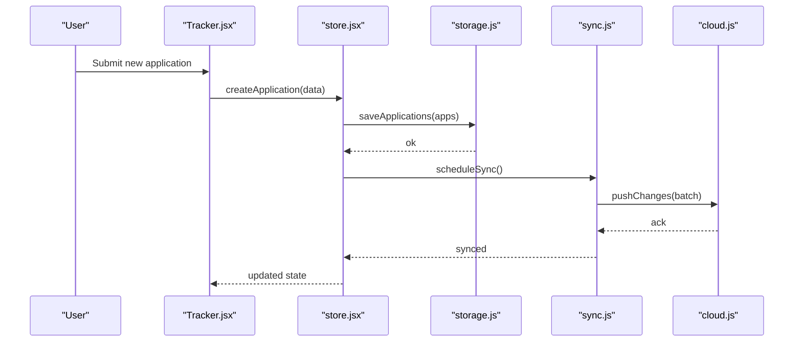
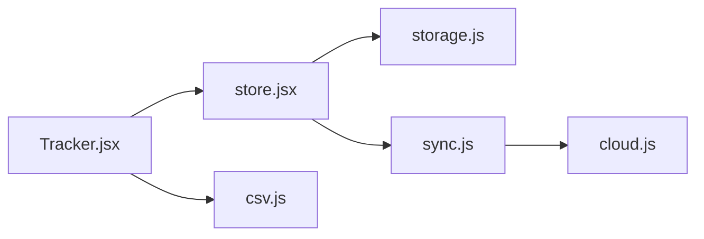

# Application CRUD Operations

<cite>
**Referenced Files in This Document**
- [Tracker.jsx](file://src/components/Tracker.jsx)
- [storage.js](file://src/lib/storage.js)
- [cloud.js](file://src/lib/cloud.js)
- [sync.js](file://src/lib/sync.js)
- [csv.js](file://src/lib/csv.js)
- [store.jsx](file://src/store.jsx)
- [App.jsx](file://src/App.jsx)
</cite>

## Table of Contents
1. [Introduction](#introduction)
2. [Project Structure](#project-structure)
3. [Core Components](#core-components)
4. [Architecture Overview](#architecture-overview)
5. [Detailed Component Analysis](#detailed-component-analysis)
6. [Dependency Analysis](#dependency-analysis)
7. [Performance Considerations](#performance-considerations)
8. [Troubleshooting Guide](#troubleshooting-guide)
9. [Conclusion](#conclusion)
10. [Appendices](#appendices)

## Introduction
This document explains how application management operations are implemented within the tracker, focusing on creating, editing, and deleting job applications. It covers managing application details such as company name, position, salary, location, and custom fields; form validation; persistence to local storage; cloud synchronization; bulk operations; import/export; and data migration between devices.

## Project Structure
The tracker’s application management spans UI components, state management, local storage, CSV utilities, and cloud sync modules:
- UI layer: Tracker component renders forms and lists for applications.
- State layer: Store provides reactive state and actions for CRUD operations.
- Persistence layer: Local storage adapter persists data offline.
- Sync layer: Cloud module and sync orchestrator handle remote synchronization.
- Import/Export: CSV utilities support bulk operations and device migration.

**Diagram sources**
- [Tracker.jsx](file://src/components/Tracker.jsx)
- [store.jsx](file://src/store.jsx)
- [storage.js](file://src/lib/storage.js)
- [cloud.js](file://src/lib/cloud.js)
- [sync.js](file://src/lib/sync.js)
- [csv.js](file://src/lib/csv.js)
- [App.jsx](file://src/App.jsx)

**Section sources**
- [Tracker.jsx](file://src/components/Tracker.jsx)
- [store.jsx](file://src/store.jsx)
- [storage.js](file://src/lib/storage.js)
- [cloud.js](file://src/lib/cloud.js)
- [sync.js](file://src/lib/sync.js)
- [csv.js](file://src/lib/csv.js)
- [App.jsx](file://src/App.jsx)

## Core Components
- Tracker (UI): Presents the application list, creation/editing forms, and action buttons for delete, import/export, and sync controls. It validates inputs before dispatching store actions.
- Store (State): Holds the applications array and exposes actions for create, update, delete, and bulk operations. It triggers persistence and sync hooks when data changes.
- Storage (Local Persistence): Serializes and deserializes application records to/from browser storage with conflict-free keys and timestamps.
- Sync (Orchestrator): Coordinates background or manual sync cycles, batching changes and handling conflicts.
- Cloud (Remote Backend): Interfaces with the backend service for user-scoped data sharing across devices.
- CSV (Import/Export): Parses CSV files into application records and exports current data to CSV for backup or migration.

Key responsibilities:
- Create: Validate required fields, generate unique IDs, persist locally, enqueue sync.
- Update: Merge changes, preserve history if needed, persist locally, enqueue sync.
- Delete: Soft-delete or remove entries, persist locally, enqueue sync.
- Bulk operations: Batch create/update/delete via CSV import or UI selection.
- Import/Export: Read/write CSV payloads for backup and cross-device migration.
- Validation: Enforce presence and format rules for company, position, salary, location, and custom fields.

**Section sources**
- [Tracker.jsx](file://src/components/Tracker.jsx)
- [store.jsx](file://src/store.jsx)
- [storage.js](file://src/lib/storage.js)
- [sync.js](file://src/lib/sync.js)
- [cloud.js](file://src/lib/cloud.js)
- [csv.js](file://src/lib/csv.js)

## Architecture Overview
The application follows a layered architecture:
- UI triggers actions in the store.
- Store updates state and invokes persistence and sync layers.
- Storage ensures offline availability.
- Sync batches and reconciles changes with the cloud backend.
- CSV utilities enable bulk operations and migration.

**Diagram sources**
- [Tracker.jsx](file://src/components/Tracker.jsx)
- [store.jsx](file://src/store.jsx)
- [storage.js](file://src/lib/storage.js)
- [sync.js](file://src/lib/sync.js)
- [cloud.js](file://src/lib/cloud.js)

## Detailed Component Analysis

### Tracker Component (UI Layer)
Responsibilities:
- Renders application list and detail forms.
- Validates inputs for company name, position, salary, location, and custom fields.
- Dispatches create, update, delete actions to the store.
- Provides import/export and sync controls.

Validation highlights:
- Required fields: company name, position.
- Optional fields: salary, location, custom fields.
- Format checks: numeric salary, non-empty strings for text fields.

Actions exposed:
- Create: Adds a new application entry.
- Edit: Updates an existing entry by ID.
- Delete: Removes an entry by ID.
- Bulk: Imports multiple entries from CSV or applies batch updates.
- Export: Downloads current applications as CSV.
- Sync: Triggers immediate synchronization with the cloud.

**Section sources**
- [Tracker.jsx](file://src/components/Tracker.jsx)

### Store (State Management)
Responsibilities:
- Maintains applications array and metadata.
- Exposes actions: create, update, delete, bulkImport, export, syncNow.
- Emits change events to UI and triggers persistence/sync.

Data model:
- Each application includes identifiers, company, position, salary, location, status, notes, and custom fields.
- Timestamps track created and updated times.

Operations:
- Create: Validates payload, assigns ID, appends to state, persists, schedules sync.
- Update: Merges fields, updates timestamp, persists, schedules sync.
- Delete: Removes by ID, persists, schedules sync.
- Bulk import: Parses CSV, validates rows, merges or creates entries, persists, schedules sync.
- Export: Serializes state to CSV.
- Sync: Invokes orchestrator to reconcile with cloud.

**Section sources**
- [store.jsx](file://src/store.jsx)

### Storage (Local Persistence)
Responsibilities:
- Reads/writes applications to browser storage.
- Ensures atomic writes and consistent schema.
- Supports versioning and migration helpers.

Behavior:
- On write: serializes applications, stores under a stable key.
- On read: loads and validates schema; migrates if version changed.
- Error handling: catches serialization errors and falls back to safe defaults.

**Section sources**
- [storage.js](file://src/lib/storage.js)

### Sync Orchestrator
Responsibilities:
- Batches pending changes since last sync.
- Manages retry logic and conflict resolution.
- Notifies store upon completion.

Flow:
- Collects local changes.
- Pushes to cloud in batches.
- Applies remote changes to local state.
- Resolves conflicts using timestamps or merge strategies.

**Section sources**
- [sync.js](file://src/lib/sync.js)

### Cloud Integration
Responsibilities:
- Authenticates user session.
- Uploads/downloads application data.
- Handles network errors and retries.

Endpoints:
- Upload: POST batch of changes.
- Download: GET latest snapshot or incremental diff.
- Status: Returns success/failure with error codes.

**Section sources**
- [cloud.js](file://src/lib/cloud.js)

### CSV Utilities (Import/Export)
Responsibilities:
- Parse CSV into structured application records.
- Export current applications to CSV.
- Map columns to fields including custom fields.

Features:
- Header mapping and validation.
- Type coercion for salary and dates.
- Error reporting per row for invalid entries.

**Section sources**
- [csv.js](file://src/lib/csv.js)

### App Entry Point
Responsibilities:
- Initializes global providers and routes.
- Mounts Tracker and other pages.
- Sets up auth and entitlements that gate features like cloud sync.

**Section sources**
- [App.jsx](file://src/App.jsx)

## Dependency Analysis
High-level dependencies among core modules:

**Diagram sources**
- [Tracker.jsx](file://src/components/Tracker.jsx)
- [store.jsx](file://src/store.jsx)
- [storage.js](file://src/lib/storage.js)
- [sync.js](file://src/lib/sync.js)
- [cloud.js](file://src/lib/cloud.js)
- [csv.js](file://src/lib/csv.js)

**Section sources**
- [Tracker.jsx](file://src/components/Tracker.jsx)
- [store.jsx](file://src/store.jsx)
- [storage.js](file://src/lib/storage.js)
- [sync.js](file://src/lib/sync.js)
- [cloud.js](file://src/lib/cloud.js)
- [csv.js](file://src/lib/csv.js)

## Performance Considerations
- Batch operations: Prefer bulk imports over individual creates to reduce storage writes and sync overhead.
- Debounced saves: Coalesce rapid edits to minimize I/O.
- Lazy loading: Render large lists with virtualization to improve UI responsiveness.
- Conflict resolution: Use timestamp-based merging to avoid expensive reconciliation.
- Network efficiency: Compress payloads and use incremental diffs where possible.

[No sources needed since this section provides general guidance]

## Troubleshooting Guide
Common issues and resolutions:
- Validation failures: Ensure required fields are present and correctly formatted. Check error messages returned by the store or UI.
- Local storage errors: Clear corrupted storage and re-import data from CSV backup.
- Sync failures: Retry after network recovery; check authentication and permissions.
- Import errors: Validate CSV headers and row formats; fix invalid rows and re-import.
- Data loss: Always export before migrations; verify schema versions during load.

**Section sources**
- [storage.js](file://src/lib/storage.js)
- [sync.js](file://src/lib/sync.js)
- [cloud.js](file://src/lib/cloud.js)
- [csv.js](file://src/lib/csv.js)

## Conclusion
The tracker implements robust application management through a clear separation of concerns: UI-driven interactions, centralized state management, reliable local persistence, and resilient cloud synchronization. CSV utilities enable powerful bulk operations and seamless data migration across devices. Following the guidelines here will help you maintain data integrity, performance, and usability.

[No sources needed since this section summarizes without analyzing specific files]

## Appendices

### Form Validation Rules
- Company name: required, non-empty string.
- Position: required, non-empty string.
- Salary: optional, numeric value.
- Location: optional, non-empty string.
- Custom fields: optional, key-value pairs validated by schema.

**Section sources**
- [Tracker.jsx](file://src/components/Tracker.jsx)
- [store.jsx](file://src/store.jsx)

### Bulk Operations Examples
- Import CSV with multiple applications: map headers to fields, validate rows, then commit in a single transaction.
- Export current applications: serialize to CSV for backup or transfer.

**Section sources**
- [csv.js](file://src/lib/csv.js)
- [store.jsx](file://src/store.jsx)

### Data Migration Between Devices
- Export from Device A using CSV export.
- Import into Device B using CSV import.
- Enable cloud sync to keep devices in sync automatically.

**Section sources**
- [csv.js](file://src/lib/csv.js)
- [sync.js](file://src/lib/sync.js)
- [cloud.js](file://src/lib/cloud.js)