# Follow-up Management System

<cite>
**Referenced Files in This Document**
- [followups.js](file://src/lib/followups.js)
- [followups.test.js](file://src/lib/followups.test.js)
- [Tracker.jsx](file://src/components/Tracker.jsx)
- [store.jsx](file://src/store.jsx)
- [supabase.js](file://src/lib/supabase.js)
- [001_schema.sql](file://supabase/migrations/001_schema.sql)
</cite>

## Table of Contents
1. [Introduction](#introduction)
2. [Project Structure](#project-structure)
3. [Core Components](#core-components)
4. [Architecture Overview](#architecture-overview)
5. [Detailed Component Analysis](#detailed-component-analysis)
6. [Dependency Analysis](#dependency-analysis)
7. [Performance Considerations](#performance-considerations)
8. [Troubleshooting Guide](#troubleshooting-guide)
9. [Conclusion](#conclusion)
10. [Appendices](#appendices)

## Introduction
This document explains the follow-up management system, focusing on how follow-ups are created automatically based on status changes, manual creation, scheduling and reminders, notifications, completion tracking, templates, recurring tasks, priority levels, and calendar integrations. It also provides common workflow examples and customization options to help you tailor the system to your needs.

## Project Structure
The follow-up feature spans UI components, business logic, and data persistence:
- UI layer: Tracker component renders follow-up lists and actions.
- Business logic: followups module implements creation rules, scheduling, reminders, and completion tracking.
- Data layer: Supabase client and schema define storage for follow-ups and related entities.

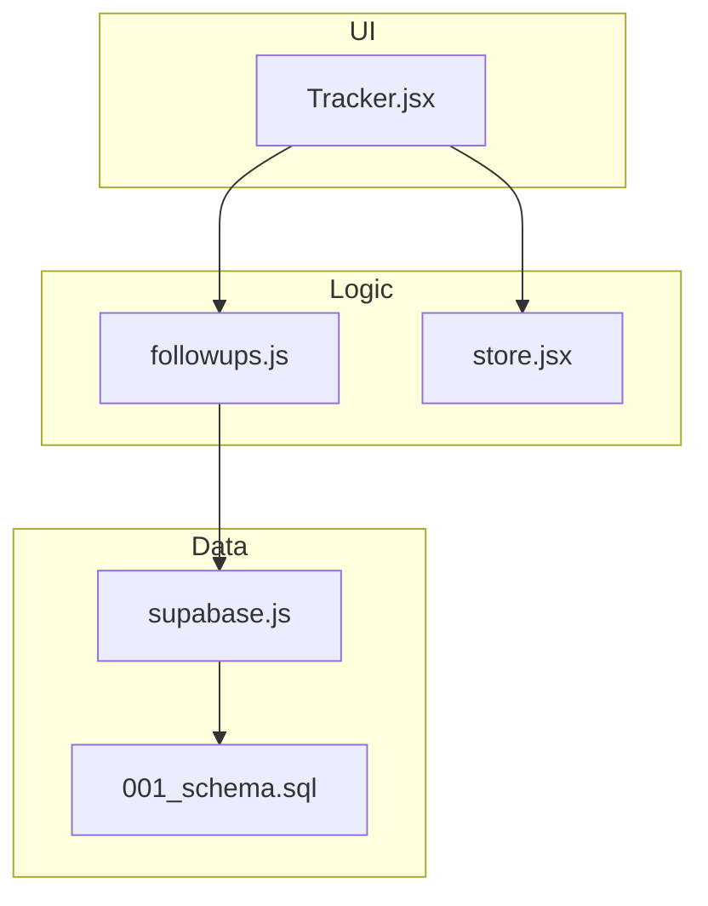

**Diagram sources**
- [Tracker.jsx](file://src/components/Tracker.jsx)
- [followups.js](file://src/lib/followups.js)
- [store.jsx](file://src/store.jsx)
- [supabase.js](file://src/lib/supabase.js)
- [001_schema.sql](file://supabase/migrations/001_schema.sql)

**Section sources**
- [Tracker.jsx](file://src/components/Tracker.jsx)
- [followups.js](file://src/lib/followups.js)
- [store.jsx](file://src/store.jsx)
- [supabase.js](file://src/lib/supabase.js)
- [001_schema.sql](file://supabase/migrations/001_schema.sql)

## Core Components
- Follow-up creation engine: Implements automatic creation based on status transitions and supports manual creation via UI or API calls.
- Scheduling and reminders: Computes next action dates, manages due windows, and triggers reminders.
- Notification system: Emits events or updates UI state when reminders are due.
- Completion tracking: Records completion timestamps and updates statuses accordingly.
- Templates and recurrence: Provides reusable follow-up definitions with optional recurrence patterns.
- Priority levels: Supports prioritization to surface urgent items first.
- Calendar integration: Exports or syncs follow-up events to external calendars.

Key responsibilities:
- Centralize follow-up lifecycle (create, schedule, remind, complete).
- Provide a stable interface for UI and background processes.
- Persist follow-up records and metadata consistently.

**Section sources**
- [followups.js](file://src/lib/followups.js)
- [Tracker.jsx](file://src/components/Tracker.jsx)
- [store.jsx](file://src/store.jsx)
- [supabase.js](file://src/lib/supabase.js)
- [001_schema.sql](file://supabase/migrations/001_schema.sql)

## Architecture Overview
The system follows a layered architecture:
- UI Layer: Tracker component orchestrates user interactions and displays follow-up states.
- Logic Layer: followups module encapsulates business rules for creation, scheduling, reminders, and completion.
- Persistence Layer: supabase client writes/read follow-up records; schema defines tables and constraints.

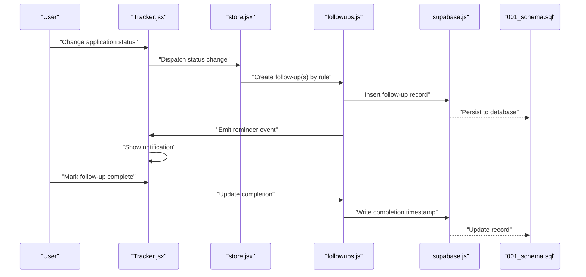

**Diagram sources**
- [Tracker.jsx](file://src/components/Tracker.jsx)
- [store.jsx](file://src/store.jsx)
- [followups.js](file://src/lib/followups.js)
- [supabase.js](file://src/lib/supabase.js)
- [001_schema.sql](file://supabase/migrations/001_schema.sql)

## Detailed Component Analysis

### Automatic Follow-up Creation Based on Status Changes
- Triggers: When an application’s status transitions (e.g., from “Interview Scheduled” to “Offer Received”), the system evaluates configured rules to create one or more follow-ups.
- Rule evaluation: The logic checks current status, previous status, and any contextual flags to determine which follow-up template(s) apply.
- Idempotency: Prevents duplicate follow-ups if a matching active follow-up already exists.

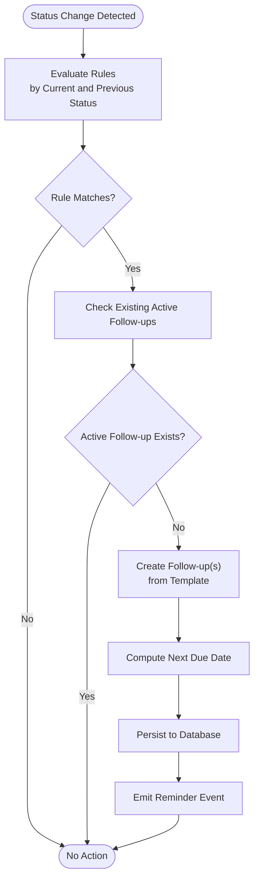

**Diagram sources**
- [followups.js](file://src/lib/followups.js)
- [001_schema.sql](file://supabase/migrations/001_schema.sql)

**Section sources**
- [followups.js](file://src/lib/followups.js)
- [001_schema.sql](file://supabase/migrations/001_schema.sql)

### Manual Follow-up Creation
- Entry points: Users can create follow-ups directly from the Tracker UI or through programmatic calls exposed by the follow-ups module.
- Inputs: Title, description, due date/time, priority, recurrence pattern, and optional tags.
- Validation: Ensures required fields are present and dates are valid before persisting.

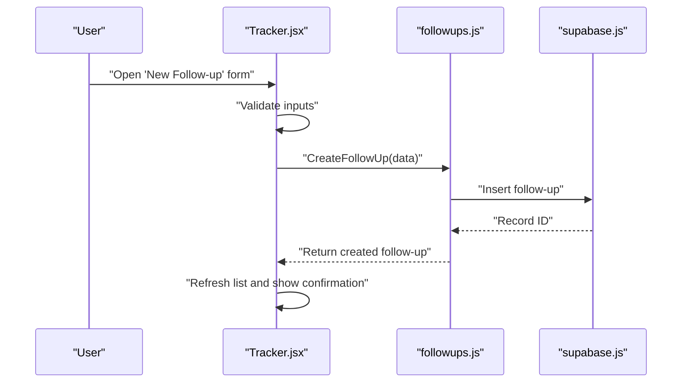

**Diagram sources**
- [Tracker.jsx](file://src/components/Tracker.jsx)
- [followups.js](file://src/lib/followups.js)
- [supabase.js](file://src/lib/supabase.js)

**Section sources**
- [Tracker.jsx](file://src/components/Tracker.jsx)
- [followups.js](file://src/lib/followups.js)
- [supabase.js](file://src/lib/supabase.js)

### Scheduling and Reminders
- Scheduling: Determines next due date based on template intervals and recurrence rules.
- Reminder windows: Supports configurable lead times (e.g., notify 24 hours before due).
- Background processing: A scheduler periodically scans upcoming due items and emits reminder events.

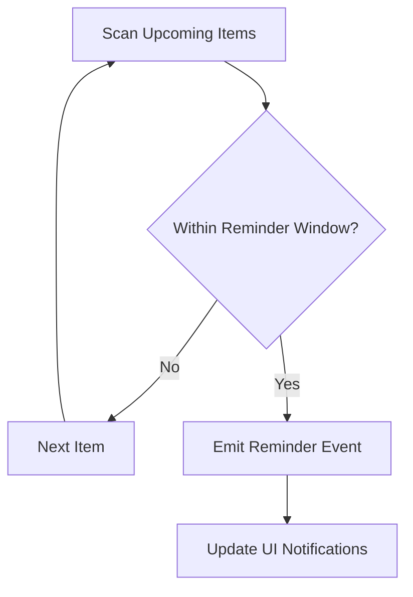

**Diagram sources**
- [followups.js](file://src/lib/followups.js)

**Section sources**
- [followups.js](file://src/lib/followups.js)

### Notification Systems
- Events: The system emits reminder events that UI components can subscribe to.
- Delivery: Notifications appear in-app; future extensions may support email or push notifications.
- State synchronization: UI reflects real-time updates when new reminders are emitted.

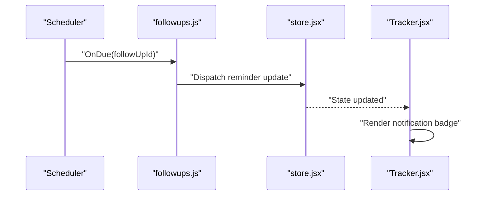

**Diagram sources**
- [followups.js](file://src/lib/followups.js)
- [store.jsx](file://src/store.jsx)
- [Tracker.jsx](file://src/components/Tracker.jsx)

**Section sources**
- [followups.js](file://src/lib/followups.js)
- [store.jsx](file://src/store.jsx)
- [Tracker.jsx](file://src/components/Tracker.jsx)

### Completion Tracking
- Actions: Users mark follow-ups as completed, optionally adding notes or outcomes.
- Timestamps: Completion time is recorded for analytics and audit trails.
- Status updates: Completed follow-ups may trigger downstream status changes or close related tasks.

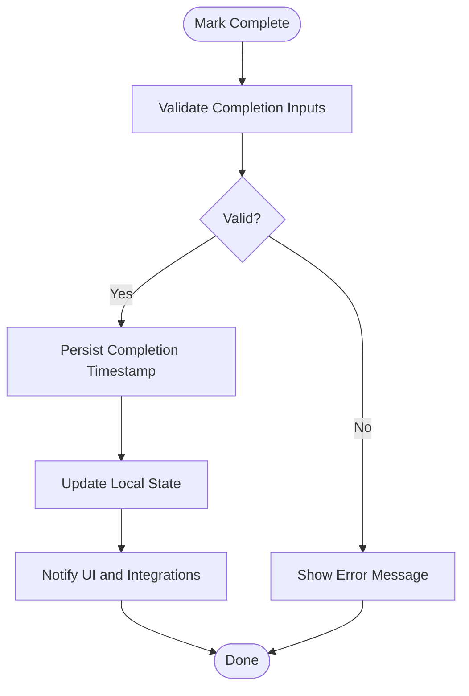

**Diagram sources**
- [followups.js](file://src/lib/followups.js)
- [Tracker.jsx](file://src/components/Tracker.jsx)

**Section sources**
- [followups.js](file://src/lib/followups.js)
- [Tracker.jsx](file://src/components/Tracker.jsx)

### Follow-up Templates
- Purpose: Reusable definitions for common follow-up types (e.g., “Post-interview thank-you,” “Offer negotiation”).
- Attributes: Default title, description, due offset, recurrence, priority, and tags.
- Customization: Users can override defaults at creation time.

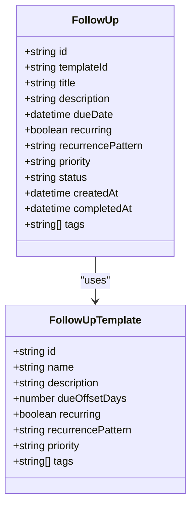

**Diagram sources**
- [followups.js](file://src/lib/followups.js)
- [001_schema.sql](file://supabase/migrations/001_schema.sql)

**Section sources**
- [followups.js](file://src/lib/followups.js)
- [001_schema.sql](file://supabase/migrations/001_schema.sql)

### Recurring Tasks
- Patterns: Support for daily, weekly, monthly, or custom intervals.
- Generation: On completion, the system schedules the next instance according to the recurrence pattern.
- Boundaries: Optional end date or occurrence count to limit recurrence.

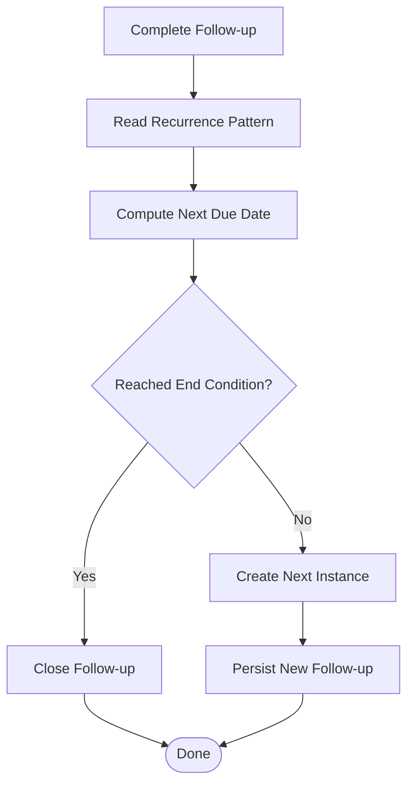

**Diagram sources**
- [followups.js](file://src/lib/followups.js)

**Section sources**
- [followups.js](file://src/lib/followups.js)

### Priority Levels
- Levels: Low, Normal, High, Urgent.
- Sorting: Higher priority items surface earlier in lists and receive earlier reminders.
- Escalation: Optionally escalate overdue high-priority items.

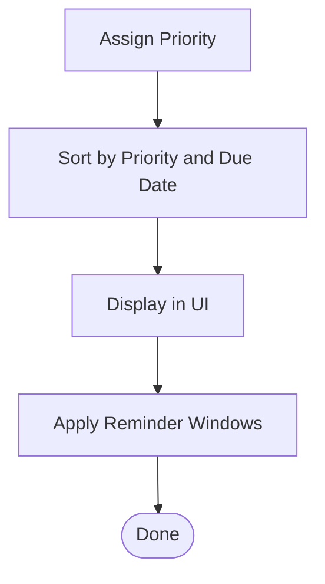

**Diagram sources**
- [followups.js](file://src/lib/followups.js)

**Section sources**
- [followups.js](file://src/lib/followups.js)

### Integration with Calendar Systems
- Export: Generate calendar entries (.ics) for follow-ups.
- Sync: Push follow-up events to external calendars (future extension).
- Two-way sync: Update follow-up status when calendar events are marked done (future extension).

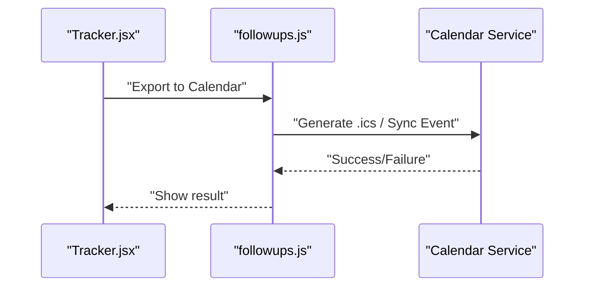

**Diagram sources**
- [Tracker.jsx](file://src/components/Tracker.jsx)
- [followups.js](file://src/lib/followups.js)

**Section sources**
- [Tracker.jsx](file://src/components/Tracker.jsx)
- [followups.js](file://src/lib/followups.js)

## Dependency Analysis
The follow-up system depends on UI state management and persistent storage:
- Tracker.jsx interacts with store.jsx to reflect follow-up state.
- followups.js coordinates creation, scheduling, and completion logic.
- supabase.js persists data using the schema defined in migrations.

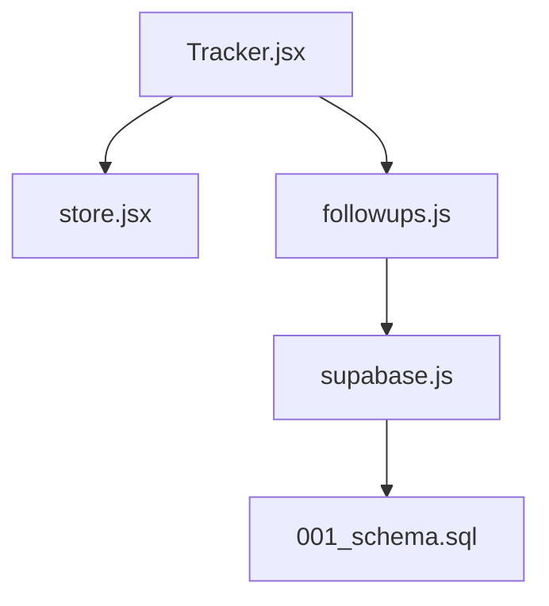

**Diagram sources**
- [Tracker.jsx](file://src/components/Tracker.jsx)
- [store.jsx](file://src/store.jsx)
- [followups.js](file://src/lib/followups.js)
- [supabase.js](file://src/lib/supabase.js)
- [001_schema.sql](file://supabase/migrations/001_schema.sql)

**Section sources**
- [Tracker.jsx](file://src/components/Tracker.jsx)
- [store.jsx](file://src/store.jsx)
- [followups.js](file://src/lib/followups.js)
- [supabase.js](file://src/lib/supabase.js)
- [001_schema.sql](file://supabase/migrations/001_schema.sql)

## Performance Considerations
- Batch operations: Group multiple follow-up creations during bulk status changes to reduce database round-trips.
- Indexing: Ensure database indexes on dueDate, status, and templateId for efficient queries.
- Debounce UI updates: Coalesce frequent reminder emissions to avoid excessive re-renders.
- Lazy loading: Load only necessary follow-up fields initially; fetch details on demand.

[No sources needed since this section provides general guidance]

## Troubleshooting Guide
Common issues and resolutions:
- Duplicate follow-ups: Verify idempotency checks prevent duplicates when creating from templates.
- Missed reminders: Confirm scheduler runs regularly and reminder windows are correctly computed.
- Incomplete persistence: Check database write operations and error handling paths.
- UI not updating: Ensure store dispatches and subscribers are wired correctly.

**Section sources**
- [followups.js](file://src/lib/followups.js)
- [followups.test.js](file://src/lib/followups.test.js)
- [Tracker.jsx](file://src/components/Tracker.jsx)
- [store.jsx](file://src/store.jsx)
- [supabase.js](file://src/lib/supabase.js)

## Conclusion
The follow-up management system provides robust automation for creating, scheduling, reminding, and completing follow-ups. With templates, recurrence, priorities, and calendar integrations, it supports diverse workflows while remaining customizable and extensible.

[No sources needed since this section summarizes without analyzing specific files]

## Appendices

### Common Workflows
- Post-interview follow-up: After marking an interview as completed, automatically create a thank-you note follow-up due within 24 hours.
- Offer negotiation: When offer received status is set, create a series of follow-ups for review, counter-offer, and acceptance steps.
- Weekly check-ins: Recurring weekly follow-ups assigned to managers for candidate progress reviews.

[No sources needed since this section doesn't analyze specific files]

### Customization Options
- Add new templates: Define new follow-up templates with default attributes and recurrence patterns.
- Adjust reminder windows: Configure lead times per template or globally.
- Extend priority levels: Introduce additional categories and escalation rules.
- Calendar providers: Implement sync adapters for Google Calendar, Outlook, or Apple Calendar.

[No sources needed since this section doesn't analyze specific files]