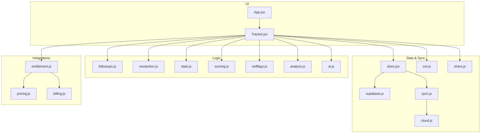
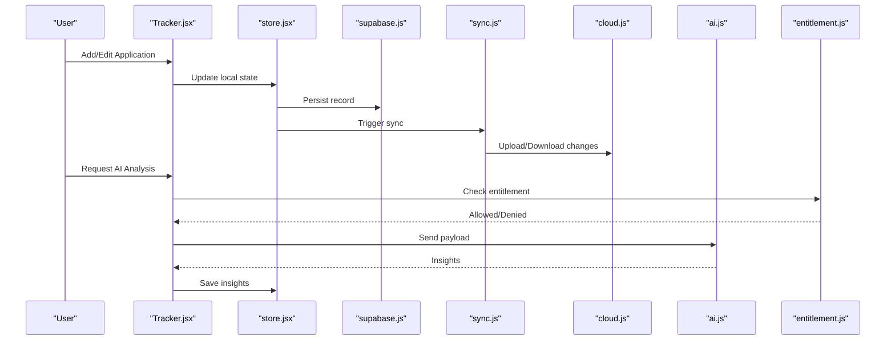
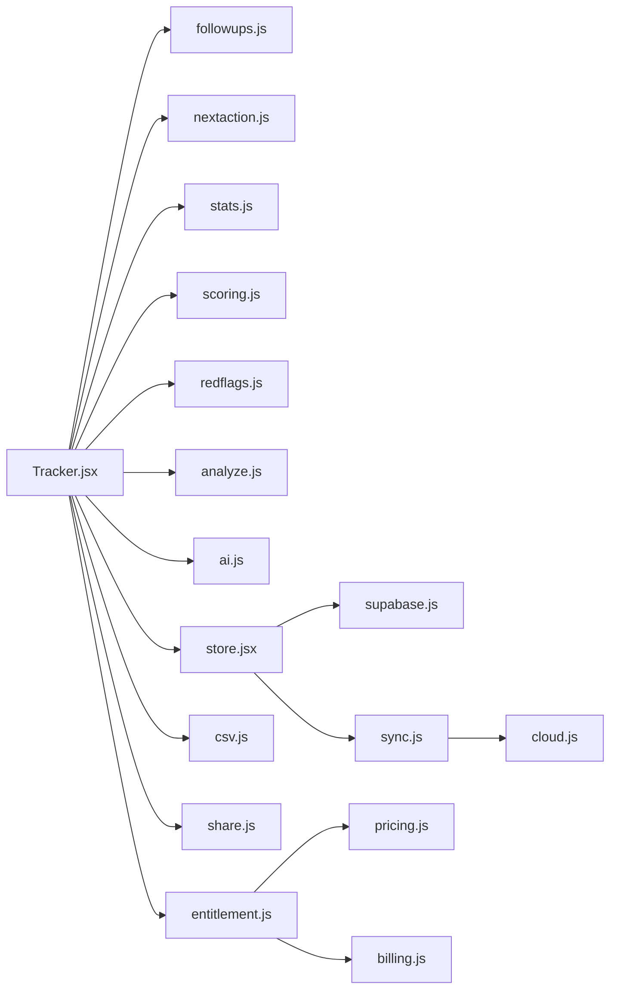

# Job Application Tracker

<cite>
**Referenced Files in This Document**
- [Tracker.jsx](file://src/components/Tracker.jsx)
- [followups.js](file://src/lib/followups.js)
- [nextaction.js](file://src/lib/nextaction.js)
- [stats.js](file://src/lib/stats.js)
- [ai.js](file://src/lib/ai.js)
- [analyze.js](file://src/lib/analyze.js)
- [scoring.js](file://src/lib/scoring.js)
- [redflags.js](file://src/lib/redflags.js)
- [store.jsx](file://src/store.jsx)
- [App.jsx](file://src/App.jsx)
- [supabase.js](file://src/lib/supabase.js)
- [sync.js](file://src/lib/sync.js)
- [cloud.js](file://src/lib/cloud.js)
- [csv.js](file://src/lib/csv.js)
- [share.js](file://src/lib/share.js)
- [entitlement.js](file://src/lib/entitlement.js)
- [pricing.js](file://src/lib/pricing.js)
- [billing.js](file://src/lib/billing.js)
</cite>

## Table of Contents
1. [Introduction](#introduction)
2. [Project Structure](#project-structure)
3. [Core Components](#core-components)
4. [Architecture Overview](#architecture-overview)
5. [Detailed Component Analysis](#detailed-component-analysis)
6. [Dependency Analysis](#dependency-analysis)
7. [Performance Considerations](#performance-considerations)
8. [Troubleshooting Guide](#troubleshooting-guide)
9. [Conclusion](#conclusion)
10. [Appendices](#appendices)

## Introduction
The Job Application Tracker provides a dashboard for managing job applications, tracking statuses, and automating follow-ups. It supports adding, editing, and organizing applications; visualizing statistics; suggesting next actions; and integrating with AI analysis and offer comparison features. Users can configure custom fields, export/import data, and share their tracker securely.

## Project Structure
The tracker is implemented as a React application with modular libraries for analytics, automation, and integrations:
- UI layer: Dashboard and forms are rendered by the Tracker component.
- Logic layer: Follow-up scheduling, next action suggestions, scoring, red flags, and statistics are provided by dedicated modules.
- Data layer: Local storage, Supabase sync, CSV import/export, and sharing utilities manage persistence and portability.
- Integrations: AI proxy and billing/entitlements enable advanced features like AI analysis and premium capabilities.

**Diagram sources**
- [Tracker.jsx](file://src/components/Tracker.jsx)
- [followups.js](file://src/lib/followups.js)
- [nextaction.js](file://src/lib/nextaction.js)
- [stats.js](file://src/lib/stats.js)
- [scoring.js](file://src/lib/scoring.js)
- [redflags.js](file://src/lib/redflags.js)
- [analyze.js](file://src/lib/analyze.js)
- [ai.js](file://src/lib/ai.js)
- [store.jsx](file://src/store.jsx)
- [supabase.js](file://src/lib/supabase.js)
- [sync.js](file://src/lib/sync.js)
- [cloud.js](file://src/lib/cloud.js)
- [csv.js](file://src/lib/csv.js)
- [share.js](file://src/lib/share.js)
- [entitlement.js](file://src/lib/entitlement.js)
- [pricing.js](file://src/lib/pricing.js)
- [billing.js](file://src/lib/billing.js)

**Section sources**
- [App.jsx](file://src/App.jsx)
- [Tracker.jsx](file://src/components/Tracker.jsx)
- [store.jsx](file://src/store.jsx)

## Core Components
- Tracker dashboard: Central interface to add, edit, filter, sort, and visualize applications.
- Follow-up automation: Schedules reminders based on last contact or status changes.
- Next action engine: Suggests actionable steps derived from application state and rules.
- Statistics and analytics: Aggregates counts, conversion rates, time-to-status, and funnel metrics.
- Scoring and red flags: Computes composite scores and highlights potential risks.
- AI analysis integration: Sends anonymized application details to an AI proxy for insights.
- Data management: Import/export via CSV, secure sharing links, and cloud sync via Supabase.
- Entitlements and billing: Gates premium features (e.g., AI analysis) behind subscription checks.

**Section sources**
- [Tracker.jsx](file://src/components/Tracker.jsx)
- [followups.js](file://src/lib/followups.js)
- [nextaction.js](file://src/lib/nextaction.js)
- [stats.js](file://src/lib/stats.js)
- [scoring.js](file://src/lib/scoring.js)
- [redflags.js](file://src/lib/redflags.js)
- [ai.js](file://src/lib/ai.js)
- [analyze.js](file://src/lib/analyze.js)
- [csv.js](file://src/lib/csv.js)
- [share.js](file://src/lib/share.js)
- [supabase.js](file://src/lib/supabase.js)
- [sync.js](file://src/lib/sync.js)
- [cloud.js](file://src/lib/cloud.js)
- [entitlement.js](file://src/lib/entitlement.js)
- [pricing.js](file://src/lib/pricing.js)
- [billing.js](file://src/lib/billing.js)

## Architecture Overview
The tracker follows a layered architecture:
- Presentation: React components render dashboards and forms.
- Domain logic: Pure functions compute follow-ups, next actions, stats, scores, and flags.
- Data access: Store coordinates local state, Supabase client, and sync routines.
- External services: AI proxy, billing endpoints, and entitlement checks.

**Diagram sources**
- [Tracker.jsx](file://src/components/Tracker.jsx)
- [store.jsx](file://src/store.jsx)
- [supabase.js](file://src/lib/supabase.js)
- [sync.js](file://src/lib/sync.js)
- [cloud.js](file://src/lib/cloud.js)
- [ai.js](file://src/lib/ai.js)
- [entitlement.js](file://src/lib/entitlement.js)

## Detailed Component Analysis

### Tracker Dashboard Interface
Responsibilities:
- Display list/grid view of applications with filters and sorting.
- Provide forms to add/edit applications and update statuses.
- Render statistics panels and charts.
- Surface next action suggestions and follow-up tasks.
- Integrate AI analysis and offer comparison entry points.

Key interactions:
- CRUD operations flow through store.jsx to persist locally and optionally sync to Supabase.
- Analytics computed by stats.js feed visualization widgets.
- Follow-ups and next actions computed by followups.js and nextaction.js respectively.

Common usage patterns:
- Bulk import via CSV, then refine entries using inline edits.
- Filter by company, role, status, or tags; sort by date or score.
- Use “Next Action” panel to prioritize daily tasks.
- Toggle custom fields to tailor the schema to your workflow.

**Section sources**
- [Tracker.jsx](file://src/components/Tracker.jsx)
- [store.jsx](file://src/store.jsx)
- [stats.js](file://src/lib/stats.js)
- [followups.js](file://src/lib/followups.js)
- [nextaction.js](file://src/lib/nextaction.js)
- [csv.js](file://src/lib/csv.js)

### Application Management Workflows
Workflows:
- Add application: Fill form fields, save to local store, optional sync.
- Edit application: Open detail view, modify fields/status, recompute dependent metrics.
- Organize: Apply tags, categories, and custom fields; use filters and views.
- Import/Export: CSV import populates records; export shares or archives data.
- Share: Generate shareable link with read-only or limited write permissions.

Data flow:
- UI updates trigger store mutations.
- Store persists to local storage and triggers sync if enabled.
- CSV and share utilities operate on normalized records.

**Section sources**
- [Tracker.jsx](file://src/components/Tracker.jsx)
- [store.jsx](file://src/store.jsx)
- [csv.js](file://src/lib/csv.js)
- [share.js](file://src/lib/share.js)
- [supabase.js](file://src/lib/supabase.js)
- [sync.js](file://src/lib/sync.js)
- [cloud.js](file://src/lib/cloud.js)

### Status Tracking System
Status lifecycle:
- Typical stages include Applied, Screening, Interview, Offer, Rejected, Archived.
- Transitions update timestamps and influence analytics (time-in-stage, conversion).
- Red flags may be raised when certain conditions are met (e.g., long idle periods).

Automation:
- Follow-ups scheduled after status changes or last contact dates.
- Next action suggestions propose concrete steps (e.g., “Send thank-you note,” “Follow up with recruiter”).

**Section sources**
- [followups.js](file://src/lib/followups.js)
- [nextaction.js](file://src/lib/nextaction.js)
- [redflags.js](file://src/lib/redflags.js)
- [stats.js](file://src/lib/stats.js)

### Follow-up Automation
Rules:
- Schedule reminders based on days since last contact or status change.
- Escalate overdue follow-ups and group by priority.
- Allow manual overrides and snoozing.

Integration:
- UI surfaces upcoming tasks and allows quick completion.
- Completion updates timestamps and recalculates next actions.

**Section sources**
- [followups.js](file://src/lib/followups.js)
- [nextaction.js](file://src/lib/nextaction.js)
- [Tracker.jsx](file://src/components/Tracker.jsx)

### Statistics and Analytics
Metrics:
- Counts by status, source, and tags.
- Conversion rates across pipeline stages.
- Time-to-status averages and percentiles.
- Funnel visualization showing drop-offs.

Computation:
- stats.js aggregates records into summary objects.
- UI renders charts and KPI cards.

**Section sources**
- [stats.js](file://src/lib/stats.js)
- [Tracker.jsx](file://src/components/Tracker.jsx)

### Next Action Suggestions
Algorithm:
- Analyzes application state, status, and history.
- Applies rule-based heuristics to recommend immediate next steps.
- Prioritizes by urgency and impact.

Output:
- Action items surfaced in the dashboard and task list.
- Actions can be marked done, which updates downstream metrics.

**Section sources**
- [nextaction.js](file://src/lib/nextaction.js)
- [Tracker.jsx](file://src/components/Tracker.jsx)

### Custom Fields Configuration
Capabilities:
- Define additional fields per application (text, number, date, select).
- Include custom fields in import/export and filtering.
- Persist custom schemas alongside records.

Usage:
- Configure once and apply across all applications.
- Use in reports and views for tailored insights.

**Section sources**
- [Tracker.jsx](file://src/components/Tracker.jsx)
- [store.jsx](file://src/store.jsx)
- [csv.js](file://src/lib/csv.js)

### Integration with AI Analysis and Offer Comparison
AI Analysis:
- Optional feature gated by entitlements.
- Sends anonymized application context to AI proxy for feedback.
- Results stored with the application for review.

Offer Comparison:
- Compare multiple offers side-by-side using standardized criteria.
- Visualize trade-offs and compute weighted scores.

**Section sources**
- [ai.js](file://src/lib/ai.js)
- [entitlement.js](file://src/lib/entitlement.js)
- [pricing.js](file://src/lib/pricing.js)
- [billing.js](file://src/lib/billing.js)
- [Tracker.jsx](file://src/components/Tracker.jsx)

### Data Visualization Features
Visualizations:
- Pipeline funnel chart.
- Status distribution pie/bar charts.
- Trend lines for weekly/monthly activity.
- Score and red flag heatmaps.

Implementation:
- Data prepared by stats.js and passed to chart components within Tracker.jsx.

**Section sources**
- [stats.js](file://src/lib/stats.js)
- [Tracker.jsx](file://src/components/Tracker.jsx)

## Dependency Analysis
High-level dependencies:
- Tracker depends on domain logic modules for computation and rendering.
- Store centralizes state and orchestrates persistence and sync.
- External integrations are isolated behind clear interfaces.

**Diagram sources**
- [Tracker.jsx](file://src/components/Tracker.jsx)
- [followups.js](file://src/lib/followups.js)
- [nextaction.js](file://src/lib/nextaction.js)
- [stats.js](file://src/lib/stats.js)
- [scoring.js](file://src/lib/scoring.js)
- [redflags.js](file://src/lib/redflags.js)
- [analyze.js](file://src/lib/analyze.js)
- [ai.js](file://src/lib/ai.js)
- [store.jsx](file://src/store.jsx)
- [supabase.js](file://src/lib/supabase.js)
- [sync.js](file://src/lib/sync.js)
- [cloud.js](file://src/lib/cloud.js)
- [csv.js](file://src/lib/csv.js)
- [share.js](file://src/lib/share.js)
- [entitlement.js](file://src/lib/entitlement.js)
- [pricing.js](file://src/lib/pricing.js)
- [billing.js](file://src/lib/billing.js)

**Section sources**
- [Tracker.jsx](file://src/components/Tracker.jsx)
- [store.jsx](file://src/store.jsx)

## Performance Considerations
- Prefer memoization and selective re-renders in the dashboard to handle large datasets.
- Batch updates when importing CSV to avoid excessive re-renders.
- Defer heavy computations (statistics, AI calls) until needed or offload to background tasks.
- Use pagination or virtualization for long lists.
- Cache frequently accessed analytics results and invalidate on data changes.

[No sources needed since this section provides general guidance]

## Troubleshooting Guide
Common issues and resolutions:
- Sync failures: Verify network connectivity and Supabase credentials; retry sync routine.
- Missing follow-ups: Ensure last contact and status timestamps are set; check rule thresholds.
- Incorrect stats: Validate data completeness and date formats; recompute summaries.
- AI analysis blocked: Confirm entitlements and subscription status; review pricing/billing integration.
- CSV import errors: Inspect column mappings and required fields; normalize values before import.

Operational tips:
- Use share links to validate read-only access without altering data.
- Export snapshots before major schema changes or bulk edits.
- Review red flags to identify stale or risky applications needing attention.

**Section sources**
- [sync.js](file://src/lib/sync.js)
- [supabase.js](file://src/lib/supabase.js)
- [followups.js](file://src/lib/followups.js)
- [stats.js](file://src/lib/stats.js)
- [entitlement.js](file://src/lib/entitlement.js)
- [pricing.js](file://src/lib/pricing.js)
- [billing.js](file://src/lib/billing.js)
- [csv.js](file://src/lib/csv.js)
- [share.js](file://src/lib/share.js)
- [redflags.js](file://src/lib/redflags.js)

## Conclusion
The Job Application Tracker combines a flexible dashboard with robust automation and analytics. It streamlines application management, keeps users proactive with follow-ups and next actions, and provides actionable insights through statistics and optional AI analysis. With customizable fields, import/export, and secure sharing, it adapts to diverse workflows while maintaining performance and reliability.

[No sources needed since this section summarizes without analyzing specific files]

## Appendices

### Example Usage Patterns
- Weekly review: Filter by “Interview” and “Offer,” mark completed follow-ups, and review next actions.
- Campaign tracking: Tag applications by source and campaign; analyze conversion by channel.
- Offer negotiation: Use offer comparison to weigh compensation, benefits, and growth opportunities.

[No sources needed since this section doesn't analyze specific files]