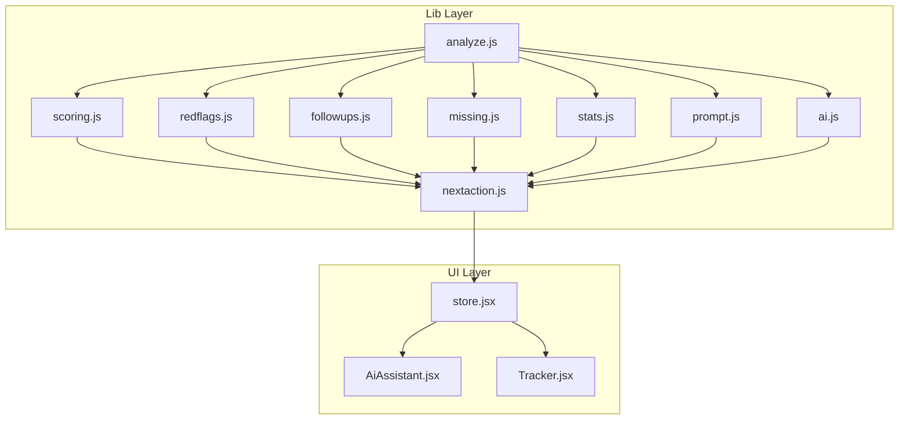
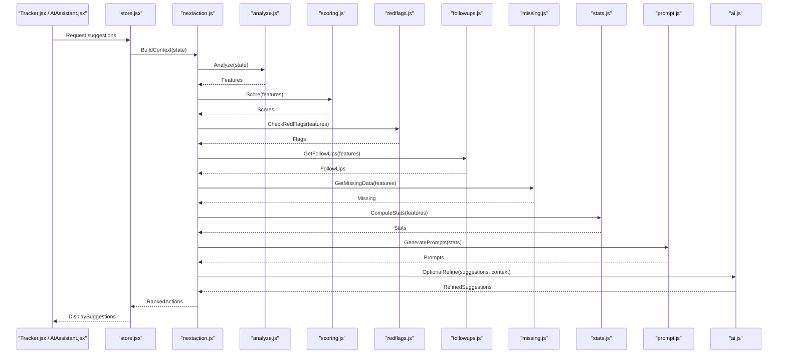
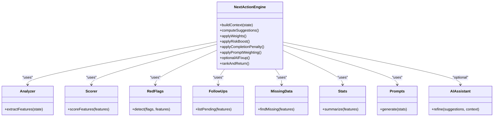
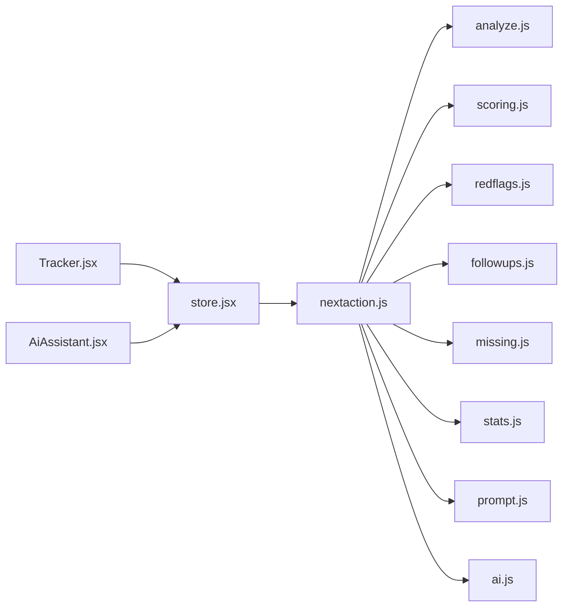

# Next Action Suggestions

<cite>
**Referenced Files in This Document**
- [nextaction.js](file://src/lib/nextaction.js)
- [analyze.js](file://src/lib/analyze.js)
- [scoring.js](file://src/lib/scoring.js)
- [redflags.js](file://src/lib/redflags.js)
- [followups.js](file://src/lib/followups.js)
- [missing.js](file://src/lib/missing.js)
- [stats.js](file://src/lib/stats.js)
- [prompt.js](file://src/lib/prompt.js)
- [ai.js](file://src/lib/ai.js)
- [store.jsx](file://src/store.jsx)
- [AiAssistant.jsx](file://src/components/AiAssistant.jsx)
- [Tracker.jsx](file://src/components/Tracker.jsx)
</cite>

## Table of Contents
1. [Introduction](#introduction)
2. [Project Structure](#project-structure)
3. [Core Components](#core-components)
4. [Architecture Overview](#architecture-overview)
5. [Detailed Component Analysis](#detailed-component-analysis)
6. [Dependency Analysis](#dependency-analysis)
7. [Performance Considerations](#performance-considerations)
8. [Troubleshooting Guide](#troubleshooting-guide)
9. [Conclusion](#conclusion)
10. [Appendices](#appendices)

## Introduction
This document explains the next action suggestion system that analyzes application states to generate intelligent recommendations, prioritizes actions based on context and risk, and provides user feedback mechanisms. It covers the rule engine behind suggestions, customization options, integration points with the UI, and examples of common scenarios where suggestions add value. The goal is to help both technical and non-technical users understand how the system works and how to refine its behavior.

## Project Structure
The next action suggestion system is implemented primarily in the lib layer as a set of focused modules:
- State analysis and scoring
- Risk detection (red flags)
- Follow-up and missing data detection
- Statistics and prompts for contextual guidance
- AI-assisted refinement when enabled
- UI integration via components and store

**Diagram sources**
- [nextaction.js](file://src/lib/nextaction.js)
- [analyze.js](file://src/lib/analyze.js)
- [scoring.js](file://src/lib/scoring.js)
- [redflags.js](file://src/lib/redflags.js)
- [followups.js](file://src/lib/followups.js)
- [missing.js](file://src/lib/missing.js)
- [stats.js](file://src/lib/stats.js)
- [prompt.js](file://src/lib/prompt.js)
- [ai.js](file://src/lib/ai.js)
- [store.jsx](file://src/store.jsx)
- [AiAssistant.jsx](file://src/components/AiAssistant.jsx)
- [Tracker.jsx](file://src/components/Tracker.jsx)

**Section sources**
- [nextaction.js](file://src/lib/nextaction.js)
- [analyze.js](file://src/lib/analyze.js)
- [scoring.js](file://src/lib/scoring.js)
- [redflags.js](file://src/lib/redflags.js)
- [followups.js](file://src/lib/followups.js)
- [missing.js](file://src/lib/missing.js)
- [stats.js](file://src/lib/stats.js)
- [prompt.js](file://src/lib/prompt.js)
- [ai.js](file://src/lib/ai.js)
- [store.jsx](file://src/store.jsx)
- [AiAssistant.jsx](file://src/components/AiAssistant.jsx)
- [Tracker.jsx](file://src/components/Tracker.jsx)

## Core Components
- Rule Engine Orchestrator: Coordinates analysis, scoring, red flag detection, follow-ups, missing data checks, statistics, prompts, and optional AI assistance to produce ranked next actions.
- Analyzer: Extracts relevant state features from the current application snapshot.
- Scorer: Computes numeric scores for candidate actions using weighted criteria.
- Red Flags Detector: Identifies high-risk conditions that should elevate priority.
- Follow-ups and Missing Data: Surfaces incomplete or overdue items requiring attention.
- Stats and Prompts: Provides contextual nudges and summary insights.
- AI Assistant: Optionally augments suggestions with AI-generated refinements.
- Store Integration: Exposes computed suggestions to UI components and persists user preferences.

Key responsibilities and interactions are detailed in the architecture and component sections below.

**Section sources**
- [nextaction.js](file://src/lib/nextaction.js)
- [analyze.js](file://src/lib/analyze.js)
- [scoring.js](file://src/lib/scoring.js)
- [redflags.js](file://src/lib/redflags.js)
- [followups.js](file://src/lib/followups.js)
- [missing.js](file://src/lib/missing.js)
- [stats.js](file://src/lib/stats.js)
- [prompt.js](file://src/lib/prompt.js)
- [ai.js](file://src/lib/ai.js)
- [store.jsx](file://src/store.jsx)

## Architecture Overview
The system follows a modular pipeline:
- Input: Current application state snapshot
- Processing: Analyze -> Score -> Detect Risks -> Identify Follow-ups/Missing -> Compute Stats/Prompts -> Optional AI Refinement
- Output: Prioritized list of next actions with metadata and rationale

**Diagram sources**
- [nextaction.js](file://src/lib/nextaction.js)
- [analyze.js](file://src/lib/analyze.js)
- [scoring.js](file://src/lib/scoring.js)
- [redflags.js](file://src/lib/redflags.js)
- [followups.js](file://src/lib/followups.js)
- [missing.js](file://src/lib/missing.js)
- [stats.js](file://src/lib/stats.js)
- [prompt.js](file://src/lib/prompt.js)
- [ai.js](file://src/lib/ai.js)
- [store.jsx](file://src/store.jsx)
- [Tracker.jsx](file://src/components/Tracker.jsx)
- [AiAssistant.jsx](file://src/components/AiAssistant.jsx)

## Detailed Component Analysis

### Rule Engine Orchestrator (nextaction.js)
Responsibilities:
- Aggregates inputs from analyzer, scorer, red flags, follow-ups, missing data, stats, prompts, and optional AI.
- Applies prioritization logic combining scores, risk flags, recency, and completeness.
- Produces a final ranked list of actionable items with explanations and metadata.

Prioritization algorithm highlights:
- Base score derived from scoring module
- Risk multiplier or additive boost for red flags
- Penalty for low completion or missing required fields
- Contextual weighting from stats and prompts
- Optional AI adjustments for personalization

Customization hooks:
- Weight tuning for score components
- Thresholds for red flag severity
- Prompt templates and stats thresholds
- AI enablement and prompt parameters

Integration:
- Consumed by store.jsx to expose suggestions to UI
- Supports re-computation on state changes

**Section sources**
- [nextaction.js](file://src/lib/nextaction.js)

#### Class Diagram (Conceptual Mapping)

**Diagram sources**
- [nextaction.js](file://src/lib/nextaction.js)
- [analyze.js](file://src/lib/analyze.js)
- [scoring.js](file://src/lib/scoring.js)
- [redflags.js](file://src/lib/redflags.js)
- [followups.js](file://src/lib/followups.js)
- [missing.js](file://src/lib/missing.js)
- [stats.js](file://src/lib/stats.js)
- [prompt.js](file://src/lib/prompt.js)
- [ai.js](file://src/lib/ai.js)

### Analyzer (analyze.js)
Responsibilities:
- Normalizes raw application state into structured features used downstream.
- Derives temporal signals (recency), completeness indicators, and categorical tags.

Complexity considerations:
- Typically O(n) over feature dimensions; ensure minimal allocations during frequent updates.

Optimization opportunities:
- Memoize expensive computations keyed by stable state snapshots.
- Incremental updates when only subsets of state change.

**Section sources**
- [analyze.js](file://src/lib/analyze.js)

### Scorer (scoring.js)
Responsibilities:
- Computes numeric scores per candidate action based on weighted criteria.
- Supports configurable weights and normalization.

Algorithmic notes:
- Linear combination of normalized features; consider robust scaling to avoid dominance by outliers.
- Tie-breaking rules based on recency or category importance.

Customization:
- Adjust weights for different workflows or user segments.
- Introduce domain-specific multipliers.

**Section sources**
- [scoring.js](file://src/lib/scoring.js)

### Red Flags (redflags.js)
Responsibilities:
- Detects high-risk conditions that should elevate action priority.
- Returns flags with severity levels and suggested mitigations.

Design patterns:
- Rule-based detection with clear condition sets.
- Extensible registry of new red flag detectors.

**Section sources**
- [redflags.js](file://src/lib/redflags.js)

### Follow-ups (followups.js)
Responsibilities:
- Identifies pending or overdue follow-up tasks.
- Incorporates deadlines and recurrence patterns.

Edge cases:
- Grace periods and snoozed items.
- Handling ambiguous due dates.

**Section sources**
- [followups.js](file://src/lib/followups.js)

### Missing Data (missing.js)
Responsibilities:
- Finds incomplete or missing required fields for an action.
- Suggests specific data collection steps.

Validation strategy:
- Schema-driven checks with clear error messages.
- Grouped suggestions to reduce cognitive load.

**Section sources**
- [missing.js](file://src/lib/missing.js)

### Stats and Prompts (stats.js, prompt.js)
Responsibilities:
- Summarizes recent activity and trends.
- Generates contextual prompts to guide user focus.

Personalization:
- Tailor prompts based on user history and preferences.
- Avoid repetition and fatigue through deduplication.

**Section sources**
- [stats.js](file://src/lib/stats.js)
- [prompt.js](file://src/lib/prompt.js)

### AI Assistance (ai.js)
Responsibilities:
- Optionally refines suggestions using AI models.
- Respects privacy and performance constraints.

Controls:
- Enable/disable toggle.
- Temperature and length controls for generated content.
- Fallback to deterministic rules if AI fails.

**Section sources**
- [ai.js](file://src/lib/ai.js)

### UI Integration (store.jsx, Tracker.jsx, AiAssistant.jsx)
Responsibilities:
- store.jsx exposes computed suggestions and user preferences.
- Tracker.jsx displays prioritized actions and handles user interactions.
- AiAssistant.jsx integrates AI-powered refinements and feedback loops.

User feedback mechanisms:
- Dismiss, snooze, mark complete, and “not helpful” feedback.
- Persist preferences to tune future suggestions.

**Section sources**
- [store.jsx](file://src/store.jsx)
- [Tracker.jsx](file://src/components/Tracker.jsx)
- [AiAssistant.jsx](file://src/components/AiAssistant.jsx)

## Dependency Analysis
The orchestrator depends on multiple specialized modules. Coupling is minimized by clear interfaces and composition.

**Diagram sources**
- [nextaction.js](file://src/lib/nextaction.js)
- [analyze.js](file://src/lib/analyze.js)
- [scoring.js](file://src/lib/scoring.js)
- [redflags.js](file://src/lib/redflags.js)
- [followups.js](file://src/lib/followups.js)
- [missing.js](file://src/lib/missing.js)
- [stats.js](file://src/lib/stats.js)
- [prompt.js](file://src/lib/prompt.js)
- [ai.js](file://src/lib/ai.js)
- [store.jsx](file://src/store.jsx)
- [Tracker.jsx](file://src/components/Tracker.jsx)
- [AiAssistant.jsx](file://src/components/AiAssistant.jsx)

**Section sources**
- [nextaction.js](file://src/lib/nextaction.js)
- [store.jsx](file://src/store.jsx)
- [Tracker.jsx](file://src/components/Tracker.jsx)
- [AiAssistant.jsx](file://src/components/AiAssistant.jsx)

## Performance Considerations
- Prefer memoization for analyzer outputs keyed by immutable snapshots.
- Batch recomputations when multiple state slices update simultaneously.
- Limit AI calls to necessary contexts; cache results when safe.
- Use incremental updates for large datasets to avoid full re-scoring.
- Debounce rapid UI interactions to prevent thrashing.

[No sources needed since this section provides general guidance]

## Troubleshooting Guide
Common issues and resolutions:
- Stale suggestions after state changes: Ensure store subscribes to relevant state slices and triggers recomputation.
- Overly aggressive red flags: Tune severity thresholds and review rule conditions.
- Repetitive prompts: Implement deduplication and decay strategies.
- AI failures: Fall back to deterministic rules and log errors for diagnostics.
- Performance regressions: Profile analyzer and scorer hot paths; introduce caching.

**Section sources**
- [nextaction.js](file://src/lib/nextaction.js)
- [redflags.js](file://src/lib/redflags.js)
- [prompt.js](file://src/lib/prompt.js)
- [ai.js](file://src/lib/ai.js)
- [store.jsx](file://src/store.jsx)

## Conclusion
The next action suggestion system combines deterministic rules with optional AI enhancements to deliver context-aware, prioritized recommendations. Its modular design enables customization, extensibility, and smooth integration with the UI. By tuning weights, thresholds, and prompts—and leveraging user feedback—the system can adapt to evolving workflows while maintaining clarity and performance.

[No sources needed since this section summarizes without analyzing specific files]

## Appendices

### Common Scenarios and Value Examples
- Onboarding flow: Suggest completing missing profile fields before proceeding.
- Risk mitigation: Elevate actions flagged by red flags to top priority.
- Deadline management: Surface overdue follow-ups with clear next steps.
- Personalization: Learn from dismiss/snooze/complete feedback to refine future suggestions.

[No sources needed since this section doesn't analyze specific source files]

### Customization Options
- Weights and thresholds in scoring and red flags.
- Prompt templates and frequency controls.
- AI enablement and generation parameters.
- Persistence of user preferences for long-term adaptation.

**Section sources**
- [scoring.js](file://src/lib/scoring.js)
- [redflags.js](file://src/lib/redflags.js)
- [prompt.js](file://src/lib/prompt.js)
- [ai.js](file://src/lib/ai.js)
- [store.jsx](file://src/store.jsx)