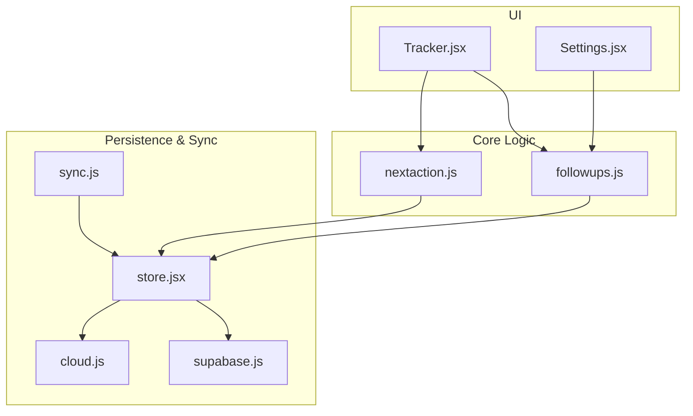
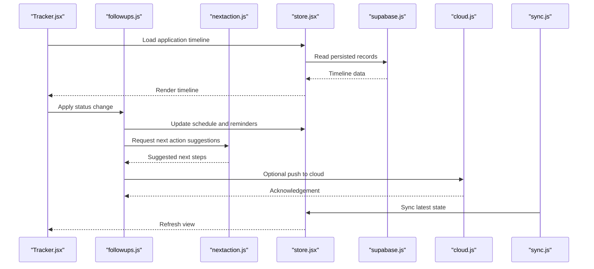
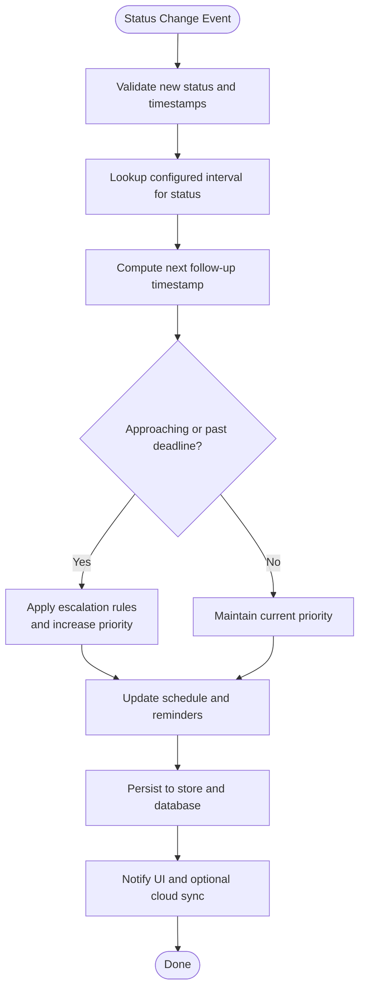
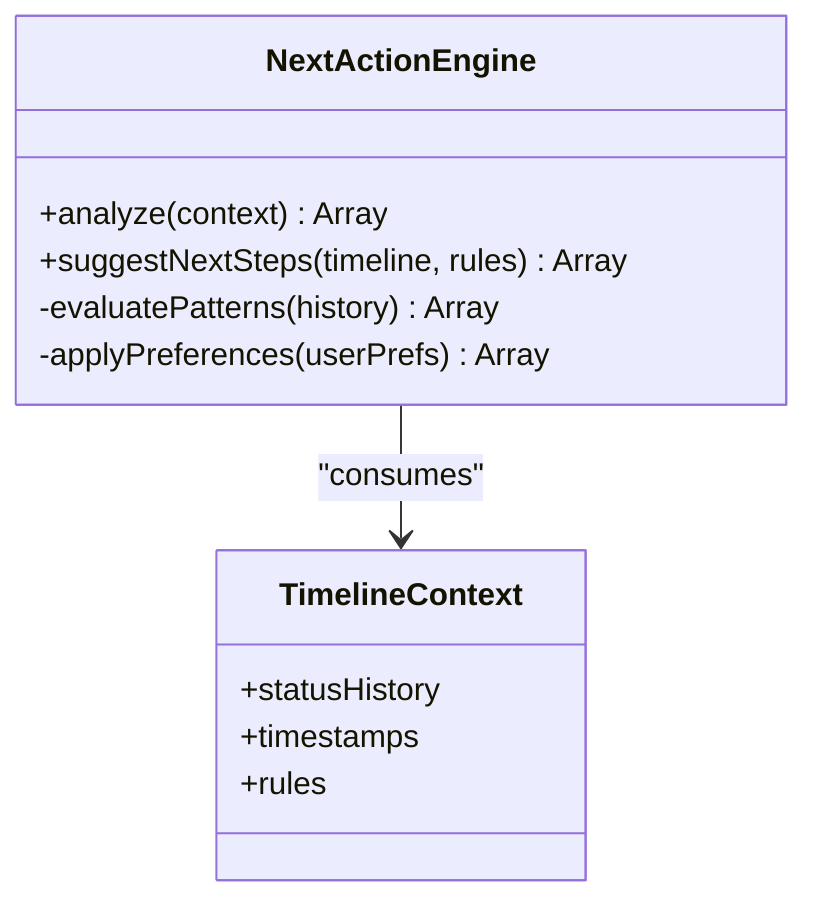
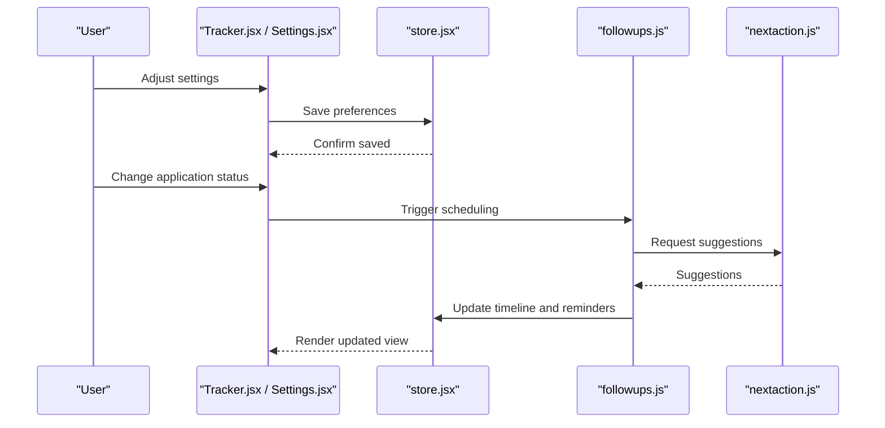
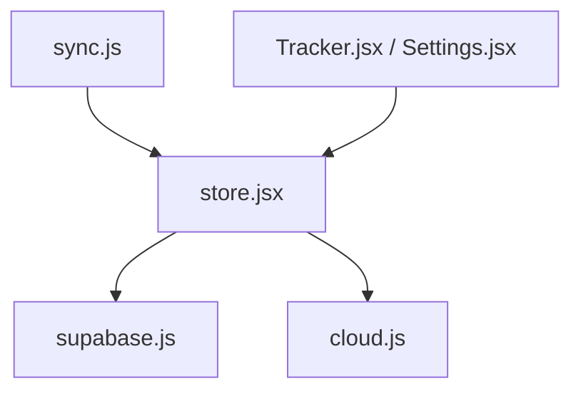
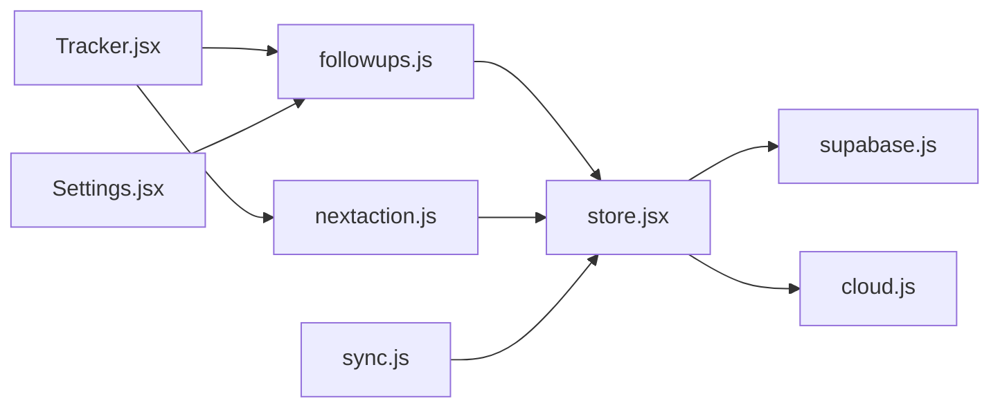

# Follow-up Automation

<cite>
**Referenced Files in This Document**
- [followups.js](file://src/lib/followups.js)
- [followups.test.js](file://src/lib/followups.test.js)
- [nextaction.js](file://src/lib/nextaction.js)
- [Tracker.jsx](file://src/components/Tracker.jsx)
- [store.jsx](file://src/store.jsx)
- [supabase.js](file://src/lib/supabase.js)
- [cloud.js](file://src/lib/cloud.js)
- [sync.js](file://src/lib/sync.js)
- [settings.jsx](file://src/components/Settings.jsx)
</cite>

## Table of Contents
1. [Introduction](#introduction)
2. [Project Structure](#project-structure)
3. [Core Components](#core-components)
4. [Architecture Overview](#architecture-overview)
5. [Detailed Component Analysis](#detailed-component-analysis)
6. [Dependency Analysis](#dependency-analysis)
7. [Performance Considerations](#performance-considerations)
8. [Troubleshooting Guide](#troubleshooting-guide)
9. [Conclusion](#conclusion)
10. [Appendices](#appendices)

## Introduction
This document explains the follow-up automation system that schedules and manages application follow-ups based on status changes, custom rules, and reminders. It covers how timelines are tracked, next actions are suggested, and notifications are managed. It also documents configuration options for intervals, escalation rules, and integration points with external calendar systems.

The system is implemented primarily as client-side logic with optional cloud synchronization and Supabase-backed persistence.

## Project Structure
The follow-up automation spans several modules:
- Core scheduling and rule engine: src/lib/followups.js
- Next action suggestion engine: src/lib/nextaction.js
- UI components for tracking and settings: src/components/Tracker.jsx, src/components/Settings.jsx
- State management and persistence: src/store.jsx, src/lib/supabase.js, src/lib/cloud.js, src/lib/sync.js

**Diagram sources**
- [Tracker.jsx](file://src/components/Tracker.jsx)
- [Settings.jsx](file://src/components/Settings.jsx)
- [followups.js](file://src/lib/followups.js)
- [nextaction.js](file://src/lib/nextaction.js)
- [store.jsx](file://src/store.jsx)
- [supabase.js](file://src/lib/supabase.js)
- [cloud.js](file://src/lib/cloud.js)
- [sync.js](file://src/lib/sync.js)

**Section sources**
- [followups.js](file://src/lib/followups.js)
- [nextaction.js](file://src/lib/nextaction.js)
- [Tracker.jsx](file://src/components/Tracker.jsx)
- [Settings.jsx](file://src/components/Settings.jsx)
- [store.jsx](file://src/store.jsx)
- [supabase.js](file://src/lib/supabase.js)
- [cloud.js](file://src/lib/cloud.js)
- [sync.js](file://src/lib/sync.js)

## Core Components
- Follow-up scheduler and rule engine (followups.js): Computes next follow-up dates from status transitions, applies custom intervals, and enforces escalation policies.
- Next action suggestion engine (nextaction.js): Derives recommended next steps based on current state, history, and configured rules.
- Tracking UI (Tracker.jsx): Displays timelines, upcoming follow-ups, and allows manual adjustments.
- Settings UI (Settings.jsx): Configures default intervals, escalation thresholds, and notification preferences.
- Persistence and sync (store.jsx, supabase.js, cloud.js, sync.js): Manages local state, persists to Supabase, and optionally syncs across devices or services.

Key responsibilities:
- Automatic scheduling triggered by status changes
- Customizable follow-up intervals per stage/status
- Escalation rules when deadlines approach or pass
- Reminder generation and delivery hooks
- Next action suggestions derived from context

**Section sources**
- [followups.js](file://src/lib/followups.js)
- [nextaction.js](file://src/lib/nextaction.js)
- [Tracker.jsx](file://src/components/Tracker.jsx)
- [Settings.jsx](file://src/components/Settings.jsx)
- [store.jsx](file://src/store.jsx)
- [supabase.js](file://src/lib/supabase.js)
- [cloud.js](file://src/lib/cloud.js)
- [sync.js](file://src/lib/sync.js)

## Architecture Overview
The follow-up automation follows a layered architecture:
- Presentation layer: Tracker and Settings render timelines, upcoming tasks, and configuration.
- Business logic layer: followups.js computes schedules; nextaction.js suggests next steps.
- Data layer: store.jsx coordinates state; supabase.js persists records; cloud.js and sync.js handle optional remote operations.

**Diagram sources**
- [Tracker.jsx](file://src/components/Tracker.jsx)
- [followups.js](file://src/lib/followups.js)
- [nextaction.js](file://src/lib/nextaction.js)
- [store.jsx](file://src/store.jsx)
- [supabase.js](file://src/lib/supabase.js)
- [cloud.js](file://src/lib/cloud.js)
- [sync.js](file://src/lib/sync.js)

## Detailed Component Analysis

### Follow-up Scheduler and Rule Engine
Responsibilities:
- Compute next follow-up date based on current status and configured intervals
- Enforce escalation rules when approaching or missing deadlines
- Generate reminder events and update timeline entries
- Support custom rules per stage/status

Operational flow:
- On status change, compute delta using configured interval
- If escalation threshold reached, mark as escalated and adjust priority
- Persist updated schedule and notify UI via store updates

**Diagram sources**
- [followups.js](file://src/lib/followups.js)
- [store.jsx](file://src/store.jsx)
- [supabase.js](file://src/lib/supabase.js)
- [cloud.js](file://src/lib/cloud.js)

**Section sources**
- [followups.js](file://src/lib/followups.js)
- [followups.test.js](file://src/lib/followups.test.js)

### Next Action Suggestion Engine
Responsibilities:
- Analyze current timeline, status history, and configured rules
- Produce actionable next steps (e.g., “Send reminder,” “Request additional info,” “Close”)
- Incorporate user-defined preferences and historical patterns

Integration:
- Called by the scheduler after updates to refine recommendations
- Exposed to UI for display and quick actions

**Diagram sources**
- [nextaction.js](file://src/lib/nextaction.js)

**Section sources**
- [nextaction.js](file://src/lib/nextaction.js)

### Tracking UI and Settings
Tracking UI:
- Displays timeline, upcoming follow-ups, and escalations
- Allows manual overrides and quick actions
- Subscribes to store updates for real-time refresh

Settings UI:
- Configures default intervals per status
- Defines escalation thresholds and priorities
- Toggles reminder channels and cloud sync

**Diagram sources**
- [Tracker.jsx](file://src/components/Tracker.jsx)
- [Settings.jsx](file://src/components/Settings.jsx)
- [followups.js](file://src/lib/followups.js)
- [nextaction.js](file://src/lib/nextaction.js)
- [store.jsx](file://src/store.jsx)

**Section sources**
- [Tracker.jsx](file://src/components/Tracker.jsx)
- [Settings.jsx](file://src/components/Settings.jsx)

### Persistence and Sync
Responsibilities:
- Local state management and reactive updates
- Persisting timeline, schedules, and settings to Supabase
- Optional cloud sync and cross-device consistency

**Diagram sources**
- [store.jsx](file://src/store.jsx)
- [supabase.js](file://src/lib/supabase.js)
- [cloud.js](file://src/lib/cloud.js)
- [sync.js](file://src/lib/sync.js)

**Section sources**
- [store.jsx](file://src/store.jsx)
- [supabase.js](file://src/lib/supabase.js)
- [cloud.js](file://src/lib/cloud.js)
- [sync.js](file://src/lib/sync.js)

## Dependency Analysis
The follow-up system exhibits clear separation between UI, business logic, and data layers. The core dependencies are:
- Tracker.jsx depends on followups.js and nextaction.js for scheduling and suggestions
- Settings.jsx depends on followups.js for applying configuration changes
- followups.js depends on store.jsx for state updates and supabase.js for persistence
- nextaction.js depends on store.jsx for reading timeline context
- sync.js orchestrates background synchronization with cloud and database

**Diagram sources**
- [Tracker.jsx](file://src/components/Tracker.jsx)
- [Settings.jsx](file://src/components/Settings.jsx)
- [followups.js](file://src/lib/followups.js)
- [nextaction.js](file://src/lib/nextaction.js)
- [store.jsx](file://src/store.jsx)
- [supabase.js](file://src/lib/supabase.js)
- [cloud.js](file://src/lib/cloud.js)
- [sync.js](file://src/lib/sync.js)

**Section sources**
- [Tracker.jsx](file://src/components/Tracker.jsx)
- [Settings.jsx](file://src/components/Settings.jsx)
- [followups.js](file://src/lib/followups.js)
- [nextaction.js](file://src/lib/nextaction.js)
- [store.jsx](file://src/store.jsx)
- [supabase.js](file://src/lib/supabase.js)
- [cloud.js](file://src/lib/cloud.js)
- [sync.js](file://src/lib/sync.js)

## Performance Considerations
- Batch updates: Group multiple status changes before recomputing schedules to reduce redundant calculations.
- Lazy evaluation: Defer next action suggestions until they are needed by the UI.
- Efficient persistence: Use minimal writes to Supabase; coalesce updates and leverage optimistic UI where appropriate.
- Caching: Cache computed intervals and escalation decisions to avoid repeated computations.
- Background sync: Throttle sync operations to prevent network contention and prioritize critical updates.

[No sources needed since this section provides general guidance]

## Troubleshooting Guide
Common issues and resolutions:
- Schedule not updating after status change: Verify that the status change triggers the scheduler and that store updates propagate to the UI.
- Missing reminders: Check escalation thresholds and configured intervals; ensure reminders are persisted and synced.
- Incorrect next action suggestions: Review input context and rule configurations; validate timeline history integrity.
- Sync conflicts: Inspect sync logs and resolve conflicts by prioritizing the most recent authoritative source.

**Section sources**
- [followups.js](file://src/lib/followups.js)
- [followups.test.js](file://src/lib/followups.test.js)
- [sync.js](file://src/lib/sync.js)

## Conclusion
The follow-up automation system provides robust scheduling, customizable rules, and intelligent next action suggestions. Its layered architecture ensures maintainability and scalability, while persistence and sync features support reliable operation across devices. Proper configuration of intervals and escalation rules enables effective timeline management and timely reminders.

[No sources needed since this section summarizes without analyzing specific files]

## Appendices

### Configuration Options
- Default intervals per status: Define time deltas for each stage to compute next follow-ups.
- Escalation thresholds: Set conditions under which items are marked escalated and priorities increased.
- Reminder channels: Toggle notifications and integrate with external calendars if supported.
- Sync preferences: Enable/disable cloud sync and conflict resolution strategies.

**Section sources**
- [Settings.jsx](file://src/components/Settings.jsx)
- [followups.js](file://src/lib/followups.js)

### Integration Points
- External calendar systems: Export scheduled follow-ups and reminders to calendar providers via available integrations.
- Notification services: Hook into platform notification APIs for reminders and escalations.
- Cloud storage: Persist timeline and settings to Supabase and synchronize across devices.

**Section sources**
- [cloud.js](file://src/lib/cloud.js)
- [supabase.js](file://src/lib/supabase.js)
- [sync.js](file://src/lib/sync.js)