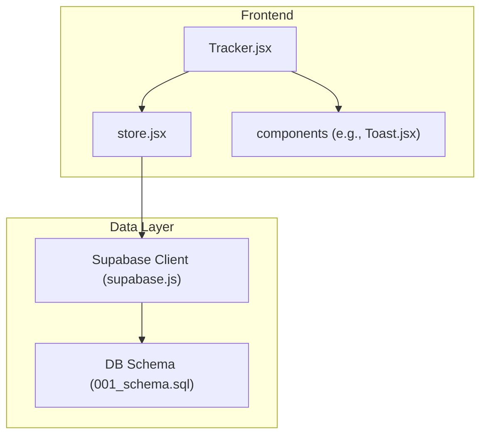
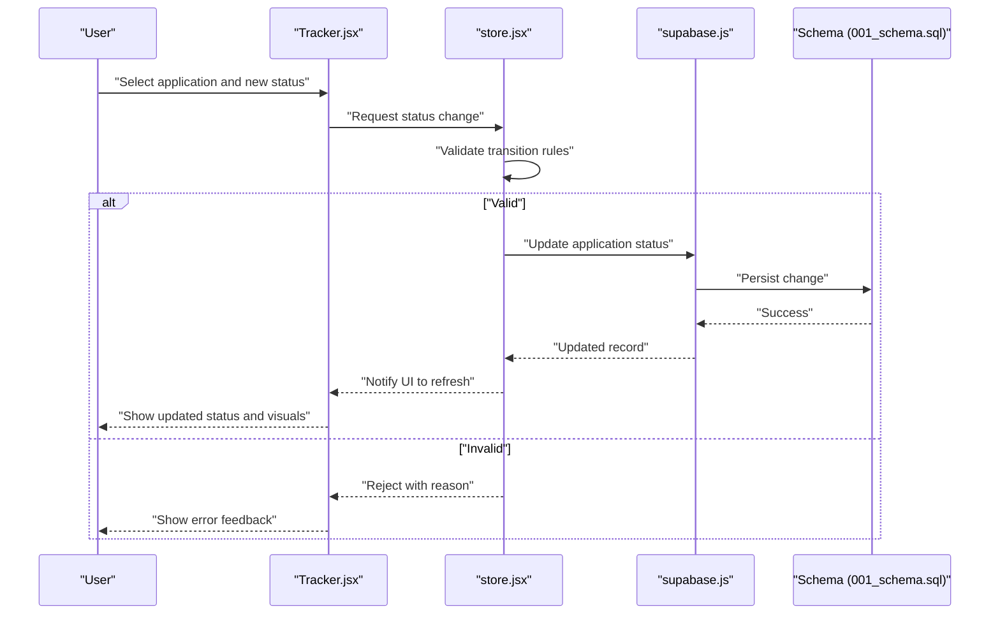
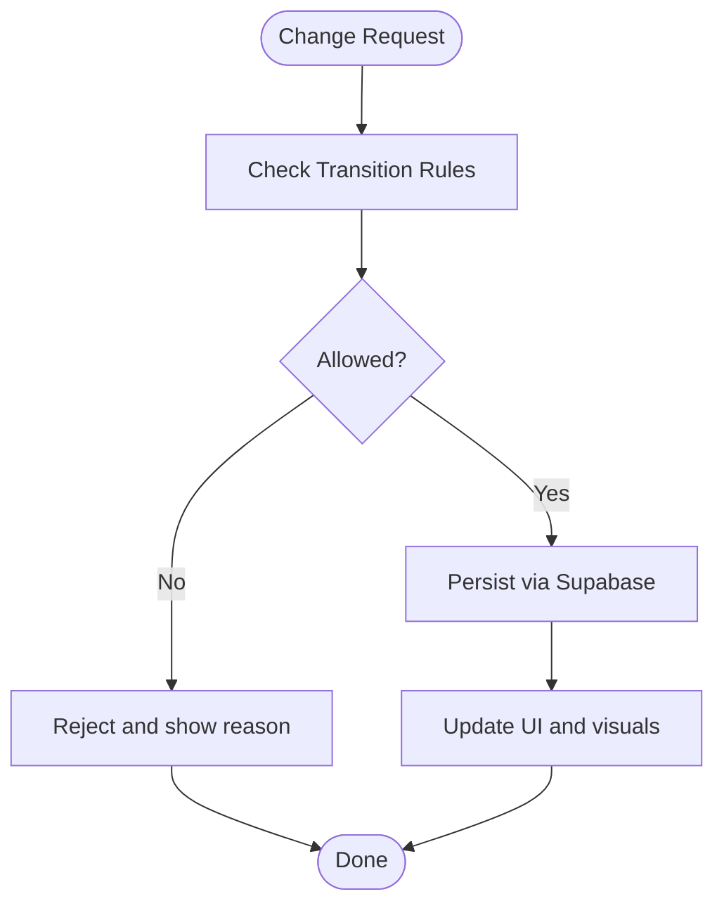
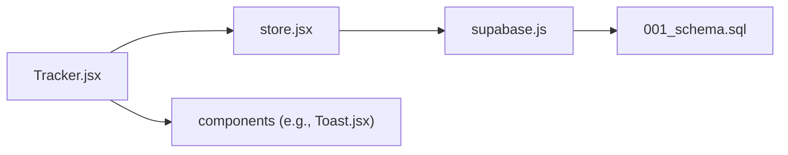

# Status Pipeline Management

<cite>
**Referenced Files in This Document**
- [Tracker.jsx](file://src/components/Tracker.jsx)
- [store.jsx](file://src/store.jsx)
- [supabase.js](file://src/lib/supabase.js)
- [001_schema.sql](file://supabase/migrations/001_schema.sql)
</cite>

## Table of Contents
1. [Introduction](#introduction)
2. [Project Structure](#project-structure)
3. [Core Components](#core-components)
4. [Architecture Overview](#architecture-overview)
5. [Detailed Component Analysis](#detailed-component-analysis)
6. [Dependency Analysis](#dependency-analysis)
7. [Performance Considerations](#performance-considerations)
8. [Troubleshooting Guide](#troubleshooting-guide)
9. [Conclusion](#conclusion)

## Introduction
This document explains the status pipeline management system used to track application lifecycle stages. It covers predefined statuses, custom status creation and configuration, transition rules and validation constraints, visual indicators (including color coding and progress tracking), and practical examples for changing statuses, performing bulk updates, and integrating with the tracker interface. The goal is to help both technical and non-technical users understand how statuses are modeled, persisted, and presented across the application.

## Project Structure
The status pipeline spans UI components, state management, and database schema:
- Tracker UI component renders the pipeline view and user interactions for status changes.
- Store module centralizes state, persistence, and operations related to applications and their statuses.
- Supabase client provides data access and synchronization.
- Database migration defines the core schema for applications and their status fields.

**Diagram sources**
- [Tracker.jsx](file://src/components/Tracker.jsx)
- [store.jsx](file://src/store.jsx)
- [supabase.js](file://src/lib/supabase.js)
- [001_schema.sql](file://supabase/migrations/001_schema.sql)

**Section sources**
- [Tracker.jsx](file://src/components/Tracker.jsx)
- [store.jsx](file://src/store.jsx)
- [supabase.js](file://src/lib/supabase.js)
- [001_schema.sql](file://supabase/migrations/001_schema.sql)

## Core Components
- Tracker UI: Presents the list or board of applications, shows current status, and exposes controls to change status. It also reflects progress and highlights based on status values.
- Store: Holds application records and status metadata, enforces transition rules, persists changes, and coordinates with the Supabase client.
- Supabase Client: Provides typed queries and mutations to read/write application records and status fields.
- Schema: Defines the table structure for applications and status-related columns, including any constraints and indexes.

Key responsibilities:
- Predefined workflow states and transitions
- Custom status creation and configuration
- Validation and constraints for transitions
- Visual indicators (colors, progress)
- Bulk update operations
- Integration points with the tracker UI

**Section sources**
- [Tracker.jsx](file://src/components/Tracker.jsx)
- [store.jsx](file://src/store.jsx)
- [supabase.js](file://src/lib/supabase.js)
- [001_schema.sql](file://supabase/migrations/001_schema.sql)

## Architecture Overview
The status pipeline follows a layered architecture:
- Presentation layer (Tracker) handles user input and displays status visuals.
- State layer (Store) encapsulates business logic for transitions and persistence.
- Data layer (Supabase + Schema) persists application records and status fields.

**Diagram sources**
- [Tracker.jsx](file://src/components/Tracker.jsx)
- [store.jsx](file://src/store.jsx)
- [supabase.js](file://src/lib/supabase.js)
- [001_schema.sql](file://supabase/migrations/001_schema.sql)

## Detailed Component Analysis

### Predefined Status Workflow
The pipeline includes standard stages such as applied, screening, interview, offer, and rejected. These represent the canonical flow from initial submission through final decision. The store should define these states and the allowed transitions between them. For example, an application typically progresses forward through these stages and may be moved back only under specific conditions defined by transition rules.

- Typical progression: applied → screening → interview → offer → accepted/rejected
- Exceptions: Rejection can occur at multiple stages; offers may be withdrawn or converted depending on policy

Implementation guidance:
- Define a canonical set of statuses in the store
- Map each status to display properties (label, color, order)
- Enforce forward-only movement unless explicitly allowed by rules

**Section sources**
- [store.jsx](file://src/store.jsx)
- [001_schema.sql](file://supabase/migrations/001_schema.sql)

### Custom Status Creation and Configuration
Custom statuses allow teams to tailor the pipeline to their process. The store should support:
- Creating new statuses with labels and colors
- Ordering custom statuses within the pipeline
- Associating custom statuses with transition rules
- Persisting custom configurations alongside predefined ones

Operational considerations:
- Prevent duplicate labels
- Ensure ordering does not break transition graph integrity
- Provide defaults for missing attributes (e.g., color)

**Section sources**
- [store.jsx](file://src/store.jsx)
- [001_schema.sql](file://supabase/migrations/001_schema.sql)

### Transition Rules and Validation Constraints
Transition rules govern which status changes are permitted. Examples include:
- Forward-only transitions for most stages
- Conditional transitions (e.g., moving to offer only after interview)
- Blocking transitions (e.g., cannot move directly from applied to offer)
- Required preconditions (e.g., certain fields must be present before transitioning)

Validation constraints:
- Disallow invalid transitions with clear error messages
- Enforce required fields before allowing certain moves
- Maintain auditability by recording previous and next statuses

**Diagram sources**
- [store.jsx](file://src/store.jsx)
- [supabase.js](file://src/lib/supabase.js)

**Section sources**
- [store.jsx](file://src/store.jsx)
- [supabase.js](file://src/lib/supabase.js)

### Visual Indicators: Color Coding and Progress Tracking
Visual indicators improve readability and quick scanning:
- Each status has a label and color for immediate recognition
- Progress tracking shows where an application sits in the overall pipeline
- Optional badges or icons indicate special conditions (e.g., pending documents)

Design recommendations:
- Use consistent color semantics (e.g., green for positive outcomes, red for rejections)
- Provide accessible contrast and tooltips for clarity
- Reflect real-time updates when status changes occur

**Section sources**
- [Tracker.jsx](file://src/components/Tracker.jsx)
- [store.jsx](file://src/store.jsx)

### Status Change Operations
Single-item status changes:
- Select an application
- Choose a target status
- Confirm if required by policy
- Observe UI feedback and updated visuals

Bulk status updates:
- Select multiple applications
- Apply a common status change
- Validate that all selected items satisfy transition rules
- Persist changes atomically where possible

Integration with tracker interface:
- Inline editing or dropdowns for quick changes
- Confirmation dialogs for destructive or irreversible moves
- Real-time sync and optimistic updates with rollback on failure

**Section sources**
- [Tracker.jsx](file://src/components/Tracker.jsx)
- [store.jsx](file://src/store.jsx)
- [supabase.js](file://src/lib/supabase.js)

### Data Model and Persistence
The database schema defines the core entities and status-related fields. Key aspects:
- Applications table with a status column or related status history table
- Constraints ensuring valid status values
- Indexes for efficient querying by status and timestamps

Recommendations:
- Normalize status definitions if they evolve frequently
- Keep a status history log for auditability
- Use foreign keys or enums to constrain values

**Section sources**
- [001_schema.sql](file://supabase/migrations/001_schema.sql)

## Dependency Analysis
The following diagram maps dependencies among key modules involved in the status pipeline:

**Diagram sources**
- [Tracker.jsx](file://src/components/Tracker.jsx)
- [store.jsx](file://src/store.jsx)
- [supabase.js](file://src/lib/supabase.js)
- [001_schema.sql](file://supabase/migrations/001_schema.sql)

**Section sources**
- [Tracker.jsx](file://src/components/Tracker.jsx)
- [store.jsx](file://src/store.jsx)
- [supabase.js](file://src/lib/supabase.js)
- [001_schema.sql](file://supabase/migrations/001_schema.sql)

## Performance Considerations
- Prefer batched updates for bulk operations to reduce network calls
- Use optimistic UI updates with rollback on failure to improve responsiveness
- Cache status metadata locally to avoid repeated lookups
- Index frequently queried fields (status, timestamps) in the database
- Debounce rapid successive changes to prevent excessive writes

[No sources needed since this section provides general guidance]

## Troubleshooting Guide
Common issues and resolutions:
- Invalid transition errors: Review transition rules and ensure preconditions are met
- Sync failures: Check Supabase connectivity and retry with exponential backoff
- UI desynchronization: Force refresh or reconcile local state with server state
- Missing status metadata: Verify default values and fallbacks for custom statuses

Operational tips:
- Log transition attempts and outcomes for diagnostics
- Provide actionable error messages to users
- Offer undo functionality where feasible

**Section sources**
- [store.jsx](file://src/store.jsx)
- [supabase.js](file://src/lib/supabase.js)

## Conclusion
The status pipeline management system combines a well-defined workflow, flexible customization, robust validation, and clear visual indicators to streamline application tracking. By adhering to transition rules, leveraging bulk operations, and integrating seamlessly with the tracker interface, teams can maintain accurate, up-to-date views of their hiring pipelines while preserving auditability and performance.

[No sources needed since this section summarizes without analyzing specific files]