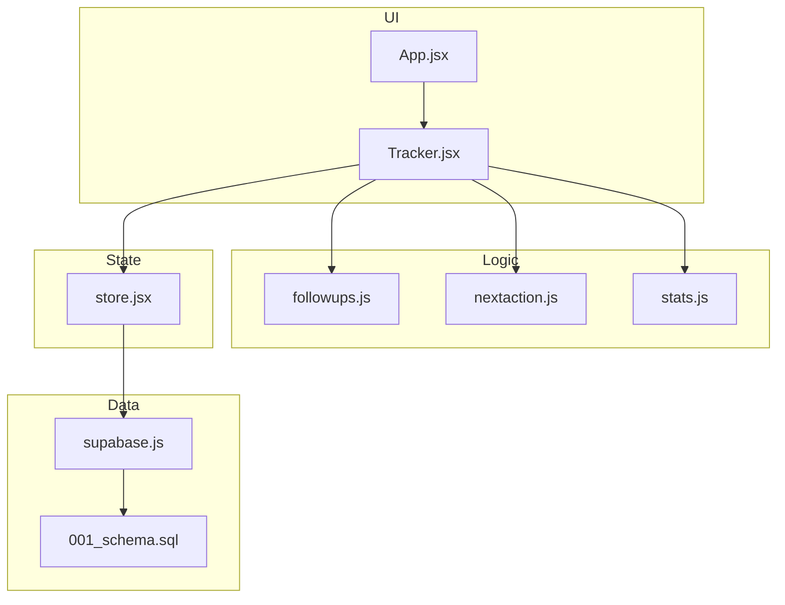
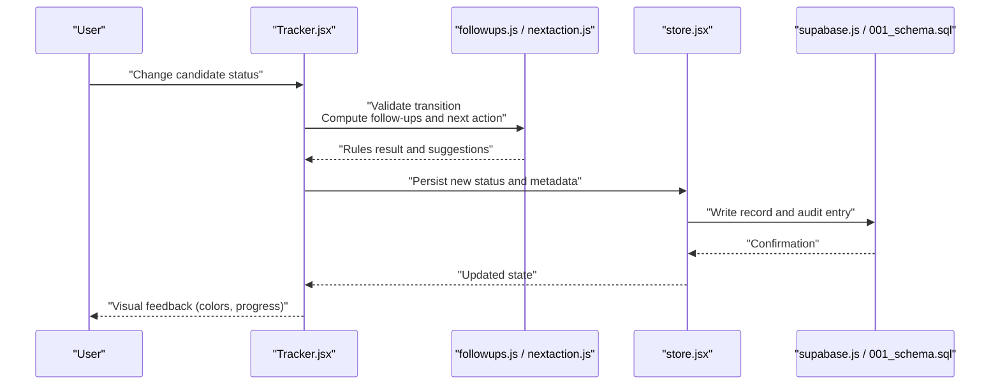
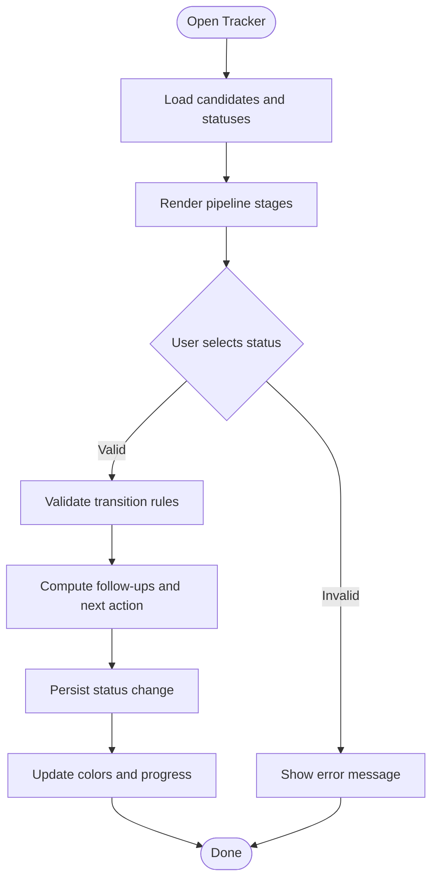
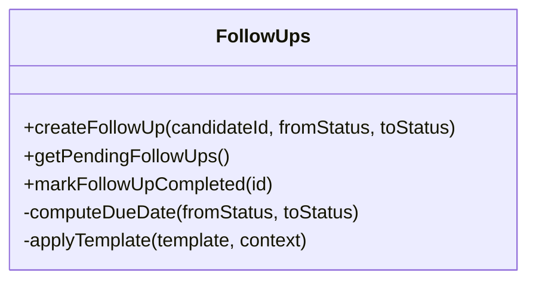
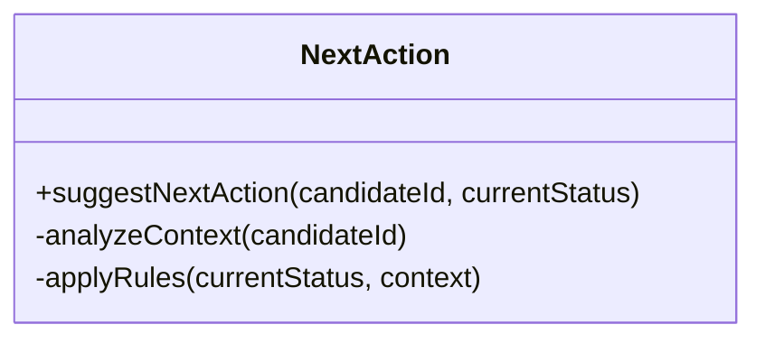
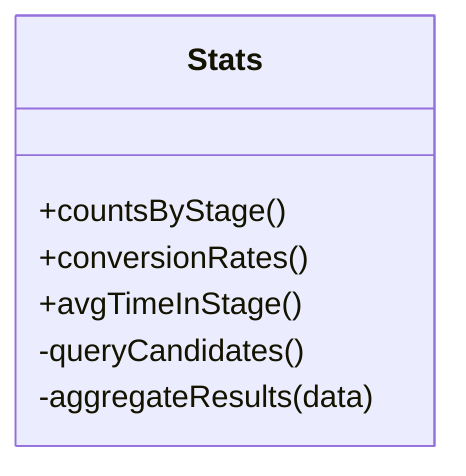
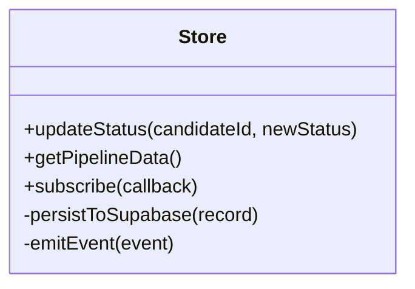
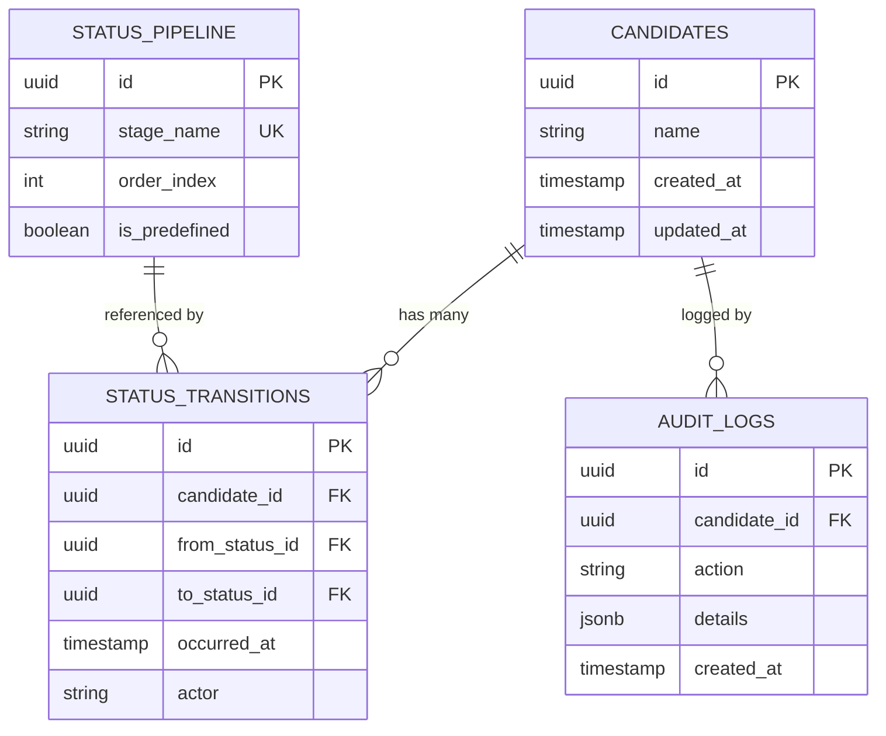
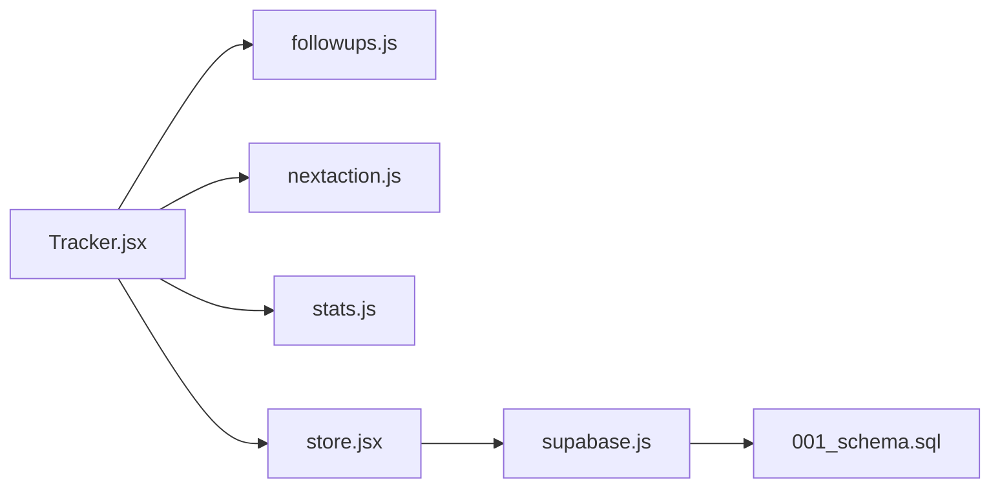

# Status Tracking & Workflows

<cite>
**Referenced Files in This Document**
- [Tracker.jsx](file://src/components/Tracker.jsx)
- [followups.js](file://src/lib/followups.js)
- [nextaction.js](file://src/lib/nextaction.js)
- [stats.js](file://src/lib/stats.js)
- [store.jsx](file://src/store.jsx)
- [App.jsx](file://src/App.jsx)
- [supabase.js](file://src/lib/supabase.js)
- [001_schema.sql](file://supabase/migrations/001_schema.sql)
</cite>

## Table of Contents
1. [Introduction](#introduction)
2. [Project Structure](#project-structure)
3. [Core Components](#core-components)
4. [Architecture Overview](#architecture-overview)
5. [Detailed Component Analysis](#detailed-component-analysis)
6. [Dependency Analysis](#dependency-analysis)
7. [Performance Considerations](#performance-considerations)
8. [Troubleshooting Guide](#troubleshooting-guide)
9. [Conclusion](#conclusion)

## Introduction
This document explains the status tracking system and workflows used to manage candidate lifecycle stages, including predefined statuses, custom status creation, automation rules, follow-up actions, visual feedback (color coding and progress indicators), transition rules, audit trails, and reporting based on status changes. It is designed for both technical and non-technical readers, with diagrams and clear explanations.

## Project Structure
The status tracking system spans UI components, business logic libraries, state management, and database schema:
- UI layer: Tracker component renders the pipeline view and user interactions.
- Logic layer: Follow-ups, next-action recommendations, and statistics are computed by dedicated modules.
- State layer: Centralized store coordinates data access and persistence.
- Data layer: Supabase client and migrations define storage and relationships.

**Diagram sources**
- [Tracker.jsx](file://src/components/Tracker.jsx)
- [followups.js](file://src/lib/followups.js)
- [nextaction.js](file://src/lib/nextaction.js)
- [stats.js](file://src/lib/stats.js)
- [store.jsx](file://src/store.jsx)
- [supabase.js](file://src/lib/supabase.js)
- [001_schema.sql](file://supabase/migrations/001_schema.sql)

**Section sources**
- [Tracker.jsx](file://src/components/Tracker.jsx)
- [followups.js](file://src/lib/followups.js)
- [nextaction.js](file://src/lib/nextaction.js)
- [stats.js](file://src/lib/stats.js)
- [store.jsx](file://src/store.jsx)
- [supabase.js](file://src/lib/supabase.js)
- [001_schema.sql](file://supabase/migrations/001_schema.sql)

## Core Components
- Tracker component: Provides the primary interface for viewing and updating candidate statuses, rendering pipeline stages, and triggering follow-ups or next actions.
- Follow-ups module: Encapsulates logic for scheduling and managing follow-up tasks tied to status transitions.
- Next-action module: Computes recommended next steps based on current status and context.
- Stats module: Aggregates metrics such as counts per stage, conversion rates, and time-in-stage for reporting.
- Store: Centralizes state, persistence, and synchronization with Supabase.
- Supabase client: Handles data operations and schema-backed queries.

Key responsibilities:
- Predefined pipeline stages and their order.
- Custom status creation and integration into the pipeline.
- Automation rules that trigger follow-ups and next actions on transitions.
- Visual feedback via color coding and progress indicators.
- Transition validation and audit logging.
- Reporting dashboards driven by status change events.

**Section sources**
- [Tracker.jsx](file://src/components/Tracker.jsx)
- [followups.js](file://src/lib/followups.js)
- [nextaction.js](file://src/lib/nextaction.js)
- [stats.js](file://src/lib/stats.js)
- [store.jsx](file://src/store.jsx)
- [supabase.js](file://src/lib/supabase.js)

## Architecture Overview
The system follows a layered architecture:
- UI triggers status updates through the Tracker component.
- Business logic validates transitions and computes follow-ups and next actions.
- State layer persists changes and synchronizes with the database.
- Database schema enforces constraints and supports audit trails and analytics.

**Diagram sources**
- [Tracker.jsx](file://src/components/Tracker.jsx)
- [followups.js](file://src/lib/followups.js)
- [nextaction.js](file://src/lib/nextaction.js)
- [store.jsx](file://src/store.jsx)
- [supabase.js](file://src/lib/supabase.js)
- [001_schema.sql](file://supabase/migrations/001_schema.sql)

## Detailed Component Analysis

### Tracker Component
Responsibilities:
- Renders the status pipeline and candidate cards.
- Handles user interactions to update statuses.
- Displays color-coded stages and progress indicators.
- Invokes follow-up and next-action computations.
- Shows real-time feedback after transitions.

**Diagram sources**
- [Tracker.jsx](file://src/components/Tracker.jsx)
- [followups.js](file://src/lib/followups.js)
- [nextaction.js](file://src/lib/nextaction.js)
- [store.jsx](file://src/store.jsx)

**Section sources**
- [Tracker.jsx](file://src/components/Tracker.jsx)

### Follow-ups Module
Responsibilities:
- Defines follow-up templates and schedules based on status transitions.
- Integrates with UI to prompt users to create reminders or tasks.
- Supports recurring or one-off follow-ups tied to specific stages.

**Diagram sources**
- [followups.js](file://src/lib/followups.js)

**Section sources**
- [followups.js](file://src/lib/followups.js)

### Next Action Module
Responsibilities:
- Recommends the next best action based on current status and context.
- Uses heuristics or rules to suggest follow-ups, interviews, offers, or rejections.
- Exposes an API for the UI to display actionable guidance.

**Diagram sources**
- [nextaction.js](file://src/lib/nextaction.js)

**Section sources**
- [nextaction.js](file://src/lib/nextaction.js)

### Stats Module
Responsibilities:
- Aggregates counts per stage, conversion rates, and average time-in-stage.
- Provides data for dashboard widgets and export features.
- Supports filtering by date ranges and cohorts.

**Diagram sources**
- [stats.js](file://src/lib/stats.js)

**Section sources**
- [stats.js](file://src/lib/stats.js)

### Store Layer
Responsibilities:
- Manages application state for candidates and statuses.
- Persists changes and syncs with Supabase.
- Emits events for UI updates and analytics.

**Diagram sources**
- [store.jsx](file://src/store.jsx)
- [supabase.js](file://src/lib/supabase.js)

**Section sources**
- [store.jsx](file://src/store.jsx)
- [supabase.js](file://src/lib/supabase.js)

### Database Schema
Responsibilities:
- Defines tables for candidates, statuses, transitions, and audit logs.
- Enforces referential integrity and indexes for performance.
- Supports reporting queries and historical analysis.

**Diagram sources**
- [001_schema.sql](file://supabase/migrations/001_schema.sql)

**Section sources**
- [001_schema.sql](file://supabase/migrations/001_schema.sql)

## Dependency Analysis
The following diagram shows how components depend on each other and external services:

**Diagram sources**
- [Tracker.jsx](file://src/components/Tracker.jsx)
- [followups.js](file://src/lib/followups.js)
- [nextaction.js](file://src/lib/nextaction.js)
- [stats.js](file://src/lib/stats.js)
- [store.jsx](file://src/store.jsx)
- [supabase.js](file://src/lib/supabase.js)
- [001_schema.sql](file://supabase/migrations/001_schema.sql)

**Section sources**
- [Tracker.jsx](file://src/components/Tracker.jsx)
- [followups.js](file://src/lib/followups.js)
- [nextaction.js](file://src/lib/nextaction.js)
- [stats.js](file://src/lib/stats.js)
- [store.jsx](file://src/store.jsx)
- [supabase.js](file://src/lib/supabase.js)
- [001_schema.sql](file://supabase/migrations/001_schema.sql)

## Performance Considerations
- Minimize re-renders by batching status updates and using memoization where appropriate.
- Defer heavy computations (e.g., stats aggregation) to background tasks or cached results.
- Use efficient queries and indexes defined in the schema for frequent filters (by stage, date range).
- Avoid excessive network calls by coalescing writes and leveraging optimistic UI updates.

[No sources needed since this section provides general guidance]

## Troubleshooting Guide
Common issues and resolutions:
- Invalid status transitions: Ensure transition rules allow the move; check validation logic and error messages in the UI.
- Missing follow-ups: Verify follow-up templates and due date calculations; confirm persistence and retrieval functions.
- Incorrect stats: Validate query filters and aggregation logic; ensure timestamps and stage mappings are correct.
- Sync failures: Inspect Supabase client errors and retry strategies; review schema constraints and permissions.

**Section sources**
- [Tracker.jsx](file://src/components/Tracker.jsx)
- [followups.js](file://src/lib/followups.js)
- [nextaction.js](file://src/lib/nextaction.js)
- [stats.js](file://src/lib/stats.js)
- [store.jsx](file://src/store.jsx)
- [supabase.js](file://src/lib/supabase.js)

## Conclusion
The status tracking system integrates UI, logic, state, and database layers to provide a robust pipeline for managing candidate stages. It supports predefined and custom statuses, automates follow-ups and next actions, and delivers visual feedback and reporting. Proper validation, audit trails, and performance optimizations ensure reliability and scalability.

[No sources needed since this section summarizes without analyzing specific files]