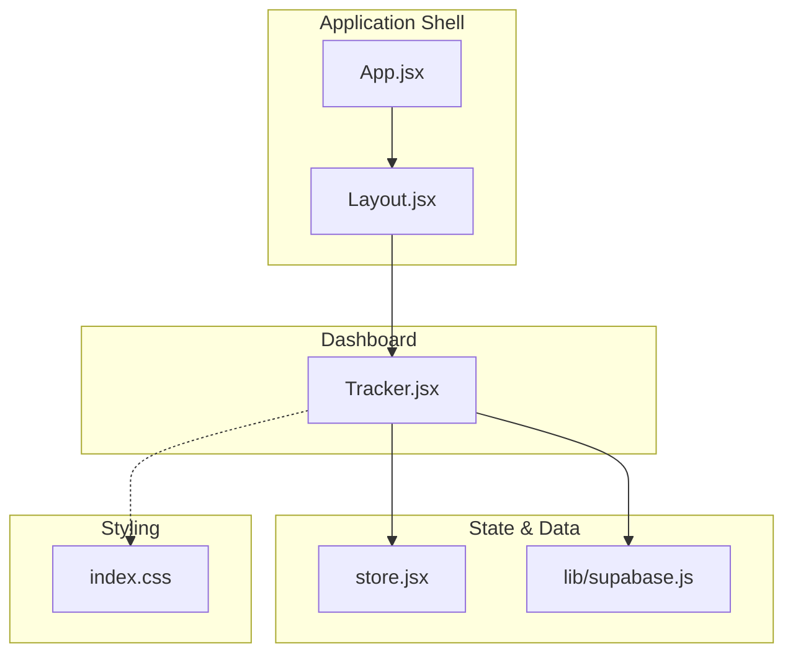
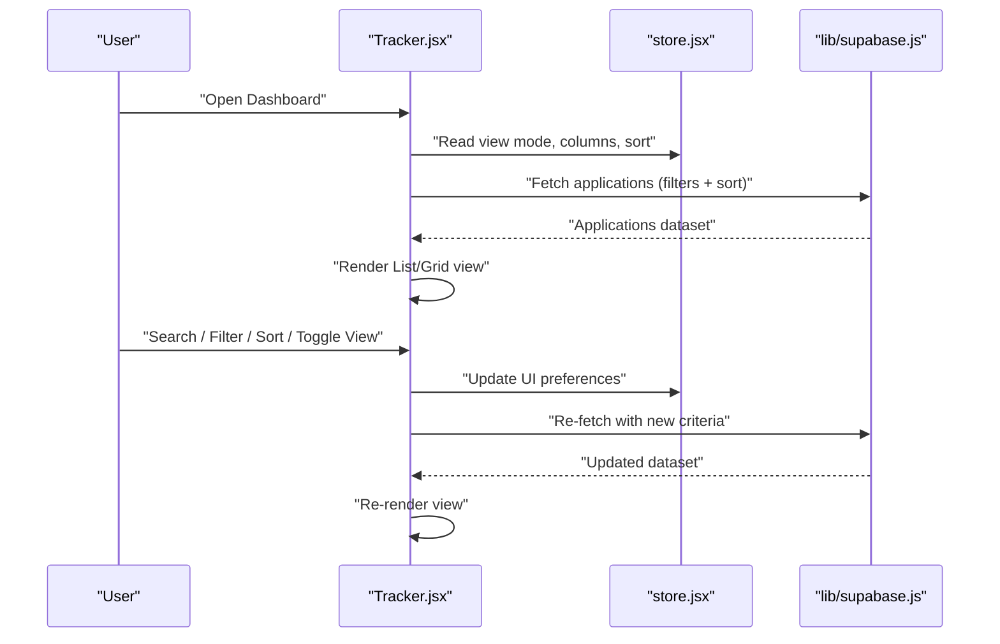
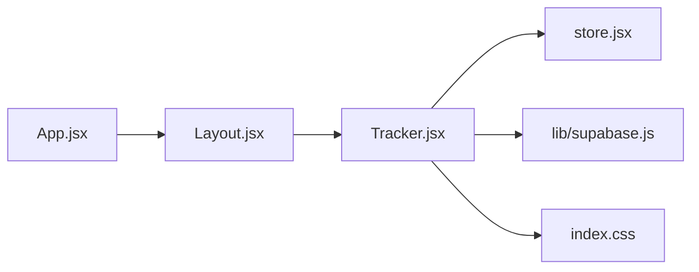

# Tracker Dashboard & Interface

<cite>
**Referenced Files in This Document**
- [Tracker.jsx](file://src/components/Tracker.jsx)
- [Layout.jsx](file://src/components/Layout.jsx)
- [store.jsx](file://src/store.jsx)
- [App.jsx](file://src/App.jsx)
- [index.css](file://src/index.css)
- [supabase.js](file://src/lib/supabase.js)
</cite>

## Table of Contents
1. [Introduction](#introduction)
2. [Project Structure](#project-structure)
3. [Core Components](#core-components)
4. [Architecture Overview](#architecture-overview)
5. [Detailed Component Analysis](#detailed-component-analysis)
6. [Dependency Analysis](#dependency-analysis)
7. [Performance Considerations](#performance-considerations)
8. [Troubleshooting Guide](#troubleshooting-guide)
9. [Conclusion](#conclusion)

## Introduction
This document explains the Tracker dashboard component, focusing on its main interface layout, navigation structure, and user interaction patterns. It covers how users view job applications in list or grid views, filter and search functionality, sorting options, responsive design considerations, customization (column configuration and display preferences), and performance optimization for large datasets with mobile responsiveness.

## Project Structure
The Tracker dashboard is implemented as a React component within the application’s components directory. The app shell and routing are provided by the root App component and a shared Layout component. Global state and UI settings are managed via a store module. Styling is centralized in a global CSS file. Data access integrates with Supabase through a dedicated client module.

**Diagram sources**
- [App.jsx](file://src/App.jsx)
- [Layout.jsx](file://src/components/Layout.jsx)
- [Tracker.jsx](file://src/components/Tracker.jsx)
- [store.jsx](file://src/store.jsx)
- [supabase.js](file://src/lib/supabase.js)
- [index.css](file://src/index.css)

**Section sources**
- [App.jsx](file://src/App.jsx)
- [Layout.jsx](file://src/components/Layout.jsx)
- [Tracker.jsx](file://src/components/Tracker.jsx)
- [store.jsx](file://src/store.jsx)
- [supabase.js](file://src/lib/supabase.js)
- [index.css](file://src/index.css)

## Core Components
- Tracker: The primary dashboard surface that renders the job applications view, including toolbar controls (search, filters, sort, view toggle), data table/grid, and pagination or infinite scroll behavior. It reads and writes to the store for UI state and uses the Supabase client for data operations.
- Layout: Provides the overall page chrome (header, sidebar, content area) and ensures consistent spacing and responsive breakpoints across pages.
- Store: Centralized state for UI preferences such as active view mode (list/grid), column visibility, sort order, and persisted settings.
- Supabase client: Encapsulates database queries and mutations used by Tracker to load and update job applications.
- index.css: Global styles including responsive rules, grid/table layouts, and utility classes used by Tracker.

Key responsibilities:
- Tracker orchestrates user interactions (search, filter, sort, view switching) and delegates data fetching to Supabase while updating local store state.
- Layout maintains consistent navigation and responsive scaffolding.
- Store persists user preferences and current dashboard state.
- Supabase client handles remote data synchronization.
- index.css ensures cross-device readability and performance-friendly rendering.

**Section sources**
- [Tracker.jsx](file://src/components/Tracker.jsx)
- [Layout.jsx](file://src/components/Layout.jsx)
- [store.jsx](file://src/store.jsx)
- [supabase.js](file://src/lib/supabase.js)
- [index.css](file://src/index.css)

## Architecture Overview
The Tracker dashboard follows a unidirectional data flow pattern:
- User actions in Tracker update local store state.
- Tracker triggers data fetches via the Supabase client based on current filters, search terms, and sort criteria.
- Results are rendered in either a list or grid view depending on the selected mode.
- UI preferences (columns, view mode, sort) are persisted in the store for subsequent sessions.

**Diagram sources**
- [Tracker.jsx](file://src/components/Tracker.jsx)
- [store.jsx](file://src/store.jsx)
- [supabase.js](file://src/lib/supabase.js)

## Detailed Component Analysis

### Tracker Dashboard Interface
The Tracker component provides:
- Main interface layout: A toolbar at the top containing search input, filter controls, sort dropdown, and view toggle (list/grid). Below the toolbar, the main content area displays applications in the selected view.
- Navigation structure: Integrated into the app shell via Layout; Tracker focuses on the dashboard content area without deep nested navigation.
- User interaction patterns:
  - Search: Real-time filtering by keywords applied to relevant fields (e.g., company, role, status).
  - Filters: Dropdowns or chips for status, source, date range, and other attributes.
  - Sorting: Column headers support ascending/descending sorts; default sort can be configured.
  - View toggle: Switch between list and grid modes; grid shows cards per application, list shows rows.
  - Column configuration: Users can show/hide columns and reorder them; changes persist in the store.
  - Display preferences: Theme toggles, density settings, and pagination/infinite scroll behavior.

Responsive design considerations:
- On small screens, the toolbar collapses into a compact control bar; filters may move to a modal or drawer.
- Grid view switches to single-column cards on narrow devices; list view adapts row wrapping and hides less critical columns.
- Touch-friendly targets and accessible labels ensure usability on mobile.

Customization examples:
- Column configuration: Enable/disable columns like “Company,” “Role,” “Status,” “Applied Date,” “Next Action.”
- Data display preferences: Choose list vs. grid, set default sort, enable auto-refresh intervals.

Performance optimization for large datasets:
- Server-side pagination or cursor-based loading to limit payload size.
- Debounced search input to reduce query frequency.
- Memoized derived lists to avoid unnecessary re-renders.
- Virtualized lists for very large datasets when using list view.
- Efficient Supabase queries with selective field projection and indexed filters.

Mobile responsiveness:
- Breakpoints adjust layout from multi-column grid to single-column cards.
- Collapsible filters and sticky header for quick access to controls.
- Optimized image sizes and lazy-loading for any media in grid cards.

**Section sources**
- [Tracker.jsx](file://src/components/Tracker.jsx)
- [store.jsx](file://src/store.jsx)
- [supabase.js](file://src/lib/supabase.js)
- [index.css](file://src/index.css)

### Layout Integration
The Layout component wraps Tracker within the application shell, providing:
- Header and sidebar navigation for other features (Account, Settings, etc.).
- Consistent spacing, typography, and responsive behavior.
- Content area where Tracker renders its dashboard.

Interaction patterns:
- Breadcrumb or active route highlighting indicates the current page.
- Keyboard shortcuts and focus management improve accessibility.

**Section sources**
- [Layout.jsx](file://src/components/Layout.jsx)
- [App.jsx](file://src/App.jsx)

### State Management and Preferences
The store manages:
- Active view mode (list/grid).
- Column visibility and order.
- Current filters, search term, and sort configuration.
- Persistence of preferences across sessions.

Data flow:
- Tracker reads initial preferences from the store.
- User actions update the store synchronously.
- Tracker reacts to store changes and triggers data refreshes via Supabase.

**Section sources**
- [store.jsx](file://src/store.jsx)
- [Tracker.jsx](file://src/components/Tracker.jsx)

### Data Access and Sync
The Supabase client encapsulates:
- Fetching applications with filters, search, and sort parameters.
- Mutations for updates (e.g., changing status or next action).
- Error handling and retry strategies.

Integration points:
- Tracker composes query parameters from store state and calls the client.
- Results are normalized before rendering to ensure stable keys and efficient updates.

**Section sources**
- [supabase.js](file://src/lib/supabase.js)
- [Tracker.jsx](file://src/components/Tracker.jsx)

### Styling and Responsive Behavior
Global styles define:
- Grid and table layouts for list and card views.
- Breakpoints for mobile-first responsiveness.
- Utility classes for spacing, alignment, and visual hierarchy.

Best practices:
- Use semantic HTML elements for better accessibility.
- Ensure sufficient color contrast and keyboard navigability.
- Avoid heavy animations on low-end devices.

**Section sources**
- [index.css](file://src/index.css)

## Dependency Analysis
The Tracker component depends on:
- Local store for UI state and preferences.
- Supabase client for data retrieval and updates.
- Global styles for layout and responsiveness.
- Layout component for integration into the app shell.

**Diagram sources**
- [Tracker.jsx](file://src/components/Tracker.jsx)
- [store.jsx](file://src/store.jsx)
- [supabase.js](file://src/lib/supabase.js)
- [index.css](file://src/index.css)
- [Layout.jsx](file://src/components/Layout.jsx)
- [App.jsx](file://src/App.jsx)

**Section sources**
- [Tracker.jsx](file://src/components/Tracker.jsx)
- [store.jsx](file://src/store.jsx)
- [supabase.js](file://src/lib/supabase.js)
- [index.css](file://src/index.css)
- [Layout.jsx](file://src/components/Layout.jsx)
- [App.jsx](file://src/App.jsx)

## Performance Considerations
- Pagination and virtualization: Prefer server-side pagination or cursor-based loading; consider virtual scrolling for long lists.
- Debouncing and throttling: Apply debounced search and throttled resize handlers to minimize re-renders and network requests.
- Selective field projection: Request only necessary fields from Supabase to reduce payload size.
- Memoization: Cache computed lists and derived state to prevent redundant calculations.
- Efficient updates: Use unique identifiers and batched updates to keep React reconciliation fast.
- Mobile optimizations: Lazy-load images, avoid heavy CSS transforms, and prefer simple transitions.

[No sources needed since this section provides general guidance]

## Troubleshooting Guide
Common issues and resolutions:
- Data not loading: Verify Supabase client initialization and permissions; check network errors and retry logic.
- Filters not applying: Ensure store state updates trigger re-fetches; confirm query parameter composition.
- Slow rendering: Inspect list length and consider virtualization; review memoization and key stability.
- Mobile layout breaks: Check breakpoint definitions and container widths; validate touch target sizes.
- Preferences not persisting: Confirm store persistence mechanism and storage availability.

**Section sources**
- [supabase.js](file://src/lib/supabase.js)
- [store.jsx](file://src/store.jsx)
- [index.css](file://src/index.css)

## Conclusion
The Tracker dashboard delivers a flexible, responsive interface for managing job applications. With configurable views, robust filtering and sorting, and persistent preferences, it supports both desktop and mobile workflows. By leveraging server-side pagination, memoization, and efficient queries, the dashboard remains performant even with large datasets. The modular architecture—separating UI state, data access, and styling—facilitates maintainability and future enhancements.