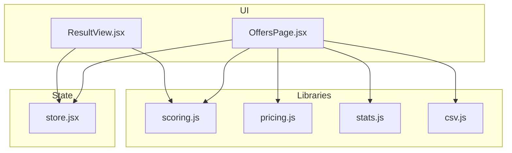
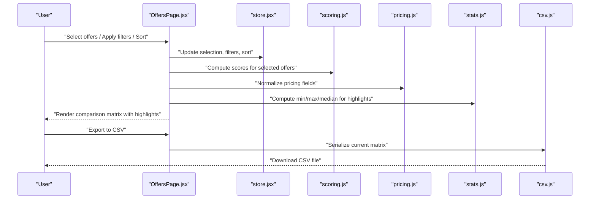
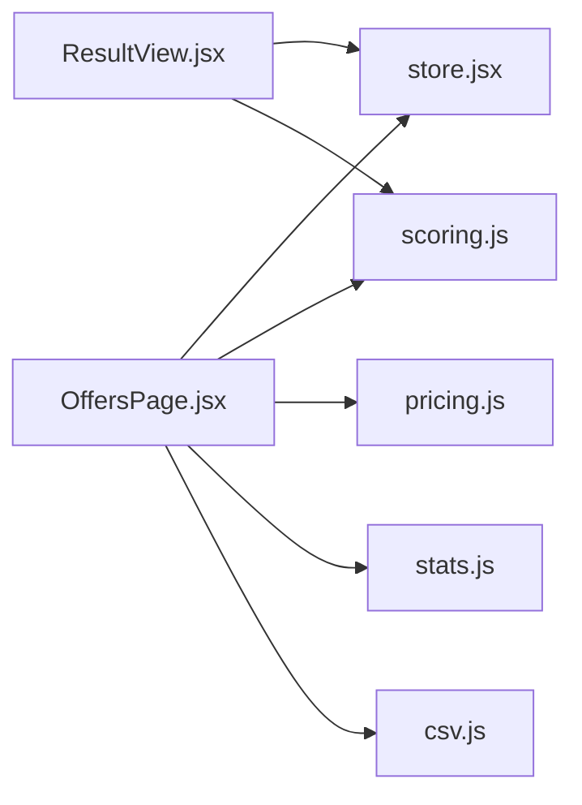

# Comparison Tools & Matrix

<cite>
**Referenced Files in This Document**
- [OffersPage.jsx](file://src/components/OffersPage.jsx)
- [ResultView.jsx](file://src/components/ResultView.jsx)
- [store.jsx](file://src/store.jsx)
- [scoring.js](file://src/lib/scoring.js)
- [csv.js](file://src/lib/csv.js)
- [pricing.js](file://src/lib/pricing.js)
- [stats.js](file://src/lib/stats.js)
</cite>

## Table of Contents
1. [Introduction](#introduction)
2. [Project Structure](#project-structure)
3. [Core Components](#core-components)
4. [Architecture Overview](#architecture-overview)
5. [Detailed Component Analysis](#detailed-component-analysis)
6. [Dependency Analysis](#dependency-analysis)
7. [Performance Considerations](#performance-considerations)
8. [Troubleshooting Guide](#troubleshooting-guide)
9. [Conclusion](#conclusion)
10. [Appendices](#appendices)

## Introduction
This document explains the offer comparison tools and matrix interface that allow users to view multiple offers side-by-side, compare key attributes, filter and sort data, and export results for further analysis. It covers the comparison matrix layout, filtering options, sorting capabilities, visual indicators that highlight differences between offers, example comparison scenarios, custom view configurations, and export functionality.

## Project Structure
The comparison features are implemented primarily in the Offers page component and supporting libraries:
- The Offers page orchestrates the comparison UI, including the matrix, filters, and actions.
- The Result View supports detailed per-offer insights and can be integrated into the comparison workflow.
- The global store manages selected offers, comparison state, and user preferences.
- Libraries provide scoring, pricing normalization, statistics, and CSV export utilities used by the comparison matrix.

**Diagram sources**
- [OffersPage.jsx](file://src/components/OffersPage.jsx)
- [ResultView.jsx](file://src/components/ResultView.jsx)
- [store.jsx](file://src/store.jsx)
- [scoring.js](file://src/lib/scoring.js)
- [pricing.js](file://src/lib/pricing.js)
- [stats.js](file://src/lib/stats.js)
- [csv.js](file://src/lib/csv.js)

**Section sources**
- [OffersPage.jsx](file://src/components/OffersPage.jsx)
- [ResultView.jsx](file://src/components/ResultView.jsx)
- [store.jsx](file://src/store.jsx)
- [scoring.js](file://src/lib/scoring.js)
- [pricing.js](file://src/lib/pricing.js)
- [stats.js](file://src/lib/stats.js)
- [csv.js](file://src/lib/csv.js)

## Core Components
- Offers Page: Central entry point for comparing multiple offers. It renders the comparison matrix, provides filters and sorting controls, and exposes export actions.
- Result View: Displays detailed analysis for a single offer; can be opened from the matrix for deeper inspection.
- Store: Holds the list of offers, selected subset for comparison, active filters/sort keys, and view configuration (columns, grouping).
- Scoring Library: Computes normalized scores and highlights relative strengths across offers.
- Pricing Library: Normalizes compensation components (base, bonus, equity, benefits) for consistent comparison.
- Stats Library: Calculates summary metrics (min/max/median/mean) to support highlighting and ranking.
- CSV Export: Serializes the current comparison matrix to CSV for offline analysis.

Key responsibilities:
- Rendering a grid where each column represents an offer and each row represents a comparison attribute.
- Applying filters to narrow down which offers appear in the matrix.
- Sorting columns or rows based on selected criteria.
- Highlighting differences using color or badges when values diverge across offers.
- Allowing users to customize visible columns and persist preferences.
- Exporting the current matrix to CSV.

**Section sources**
- [OffersPage.jsx](file://src/components/OffersPage.jsx)
- [ResultView.jsx](file://src/components/ResultView.jsx)
- [store.jsx](file://src/store.jsx)
- [scoring.js](file://src/lib/scoring.js)
- [pricing.js](file://src/lib/pricing.js)
- [stats.js](file://src/lib/stats.js)
- [csv.js](file://src/lib/csv.js)

## Architecture Overview
The comparison system follows a unidirectional data flow:
- User interactions (filters, sort, selection) update the store.
- Offers Page reads from the store and computes derived views (filtered, sorted, highlighted).
- Libraries transform raw offer data into comparable units (scores, normalized prices, stats).
- Export action serializes the current view to CSV.

**Diagram sources**
- [OffersPage.jsx](file://src/components/OffersPage.jsx)
- [store.jsx](file://src/store.jsx)
- [scoring.js](file://src/lib/scoring.js)
- [pricing.js](file://src/lib/pricing.js)
- [stats.js](file://src/lib/stats.js)
- [csv.js](file://src/lib/csv.js)

## Detailed Component Analysis

### Comparison Matrix Layout
- Columns represent individual offers; rows represent comparison attributes such as base salary, bonus, equity, benefits, location, role level, and computed score.
- Cells display normalized values or human-readable summaries. When values differ significantly across offers, cells are visually highlighted (e.g., color-coded or badge-based) to draw attention.
- Sticky headers and optional sticky first column improve readability for wide matrices.
- Column ordering can be customized via drag-and-drop or menu reordering.

Visual indicators:
- Best/worst highlighting per row based on computed stats.
- Difference badges when values deviate beyond thresholds.
- Score bars or mini sparklines for quick trend visualization within a cell.

Customization:
- Toggle visibility of specific columns (attributes).
- Group offers by team, location, or seniority if available.
- Persist preferred column order and visibility in local storage.

**Section sources**
- [OffersPage.jsx](file://src/components/OffersPage.jsx)
- [store.jsx](file://src/store.jsx)
- [stats.js](file://src/lib/stats.js)

### Filtering Options
Filters enable narrowing the set of offers displayed in the matrix:
- Role type, company, location, compensation band, and other metadata.
- Numeric range filters for base salary, bonus, equity value, and total comp.
- Boolean toggles for benefits (e.g., remote eligibility, signing bonus presence).
- Combined filters apply logical AND semantics unless otherwise specified.

Filter behavior:
- Filters update the store and trigger a re-render of the matrix.
- Active filters are shown as chips with clear/reset actions.
- Filter suggestions may be provided based on current dataset distribution.

**Section sources**
- [OffersPage.jsx](file://src/components/OffersPage.jsx)
- [store.jsx](file://src/store.jsx)

### Sorting Capabilities
Sorting supports both ascending and descending orders:
- Sort by any column header to rank offers by that attribute.
- Multi-column sort is supported by holding modifier keys while clicking additional headers.
- Default sort can be configured (e.g., by overall score or total compensation).

Sorting behavior:
- Stable sort preserves original order for equal keys.
- Numeric and string sorts are handled appropriately; dates and enums have locale-aware ordering.
- Sorting persists in the store and applies to the exported CSV.

**Section sources**
- [OffersPage.jsx](file://src/components/OffersPage.jsx)
- [store.jsx](file://src/store.jsx)

### Visual Indicators That Highlight Differences
- Row-level best/worst markers identify top and bottom performers per attribute.
- Threshold-based difference badges indicate significant deviations across offers.
- Color coding uses accessible palettes to ensure clarity for all users.
- Optional “diff-only” mode hides identical cells to focus on disparities.

Implementation notes:
- Stats library computes min/max/median to determine thresholds.
- Scoring library normalizes heterogeneous inputs for fair comparisons.
- Pricing library ensures consistent currency and unit handling.

**Section sources**
- [stats.js](file://src/lib/stats.js)
- [scoring.js](file://src/lib/scoring.js)
- [pricing.js](file://src/lib/pricing.js)
- [OffersPage.jsx](file://src/components/OffersPage.jsx)

### Example Comparison Scenarios
- Side-by-side compensation review: Compare base, bonus, equity, and benefits across three offers to decide the highest total compensation.
- Role fit assessment: Compare role level, responsibilities, and growth opportunities alongside compensation.
- Location and flexibility trade-offs: Evaluate remote policies, relocation packages, and cost-of-living adjustments.
- Time-sensitive decisions: Use diff-only mode to quickly spot unique perks or constraints.

These scenarios are facilitated by the matrix’s flexible column set, robust filtering, and clear visual indicators.

[No sources needed since this section doesn't analyze specific files]

### Custom View Configurations
Users can tailor the matrix to their needs:
- Choose which attributes to display.
- Reorder columns to prioritize important factors.
- Save presets for common comparisons (e.g., “Engineering vs Product,” “Remote vs On-site”).
- Persist preferences locally for seamless return visits.

Configuration persistence:
- Preferences are stored in the store and synced to local storage.
- Presets can be shared via links or imported/exported as JSON.

**Section sources**
- [store.jsx](file://src/store.jsx)
- [OffersPage.jsx](file://src/components/OffersPage.jsx)

### Export Functionality
Export allows saving the current comparison matrix for offline analysis:
- CSV includes selected columns, filtered and sorted rows.
- Headers reflect user-visible labels; numeric fields use normalized units.
- Optional inclusion of computed scores and highlights metadata.

Export workflow:
- User triggers export from the Offers page.
- CSV library serializes the current view.
- Browser downloads the generated file.

**Section sources**
- [csv.js](file://src/lib/csv.js)
- [OffersPage.jsx](file://src/components/OffersPage.jsx)

## Dependency Analysis
The comparison matrix depends on several modules:
- Offers Page composes UI and delegates computations to libraries.
- Store centralizes state and provides reactive updates.
- Scoring and Pricing libraries normalize and compute comparative metrics.
- Stats library supplies aggregate measures for highlighting.
- CSV library handles serialization.

**Diagram sources**
- [OffersPage.jsx](file://src/components/OffersPage.jsx)
- [ResultView.jsx](file://src/components/ResultView.jsx)
- [store.jsx](file://src/store.jsx)
- [scoring.js](file://src/lib/scoring.js)
- [pricing.js](file://src/lib/pricing.js)
- [stats.js](file://src/lib/stats.js)
- [csv.js](file://src/lib/csv.js)

**Section sources**
- [OffersPage.jsx](file://src/components/OffersPage.jsx)
- [ResultView.jsx](file://src/components/ResultView.jsx)
- [store.jsx](file://src/store.jsx)
- [scoring.js](file://src/lib/scoring.js)
- [pricing.js](file://src/lib/pricing.js)
- [stats.js](file://src/lib/stats.js)
- [csv.js](file://src/lib/csv.js)

## Performance Considerations
- Memoize derived views (filtered, sorted, highlighted) to avoid recomputation on every render.
- Debounce filter input changes to reduce frequent re-renders.
- Virtualize large matrices if many offers or columns are present.
- Normalize pricing and scores once per offer and cache results.
- Limit highlight calculations to visible rows/columns when possible.

[No sources needed since this section provides general guidance]

## Troubleshooting Guide
Common issues and resolutions:
- Missing or inconsistent data: Ensure required fields exist before computing scores or highlights; fallback to neutral values when missing.
- Incorrect sorting: Verify locale-aware collation for strings and correct numeric parsing.
- Export anomalies: Confirm CSV encoding and delimiter choices; validate headers match visible columns.
- Performance lag: Check for unnecessary re-renders; add memoization and debouncing as needed.

**Section sources**
- [scoring.js](file://src/lib/scoring.js)
- [pricing.js](file://src/lib/pricing.js)
- [stats.js](file://src/lib/stats.js)
- [csv.js](file://src/lib/csv.js)
- [OffersPage.jsx](file://src/components/OffersPage.jsx)

## Conclusion
The comparison tools and matrix interface provide a powerful, customizable way to evaluate multiple offers side-by-side. With robust filtering, sorting, visual indicators, and export capabilities, users can make informed decisions efficiently. The modular architecture separates concerns between UI, state, computation, and export, enabling maintainability and extensibility.

[No sources needed since this section summarizes without analyzing specific files]

## Appendices

### API Reference Summary
- Offers Page: Renders matrix, manages filters/sort, triggers export.
- Store: Manages selection, filters, sort, and view config.
- Scoring: Computes normalized scores across offers.
- Pricing: Normalizes compensation components for fair comparison.
- Stats: Provides min/max/median for highlighting logic.
- CSV: Serializes current matrix to downloadable file.

**Section sources**
- [OffersPage.jsx](file://src/components/OffersPage.jsx)
- [store.jsx](file://src/store.jsx)
- [scoring.js](file://src/lib/scoring.js)
- [pricing.js](file://src/lib/pricing.js)
- [stats.js](file://src/lib/stats.js)
- [csv.js](file://src/lib/csv.js)