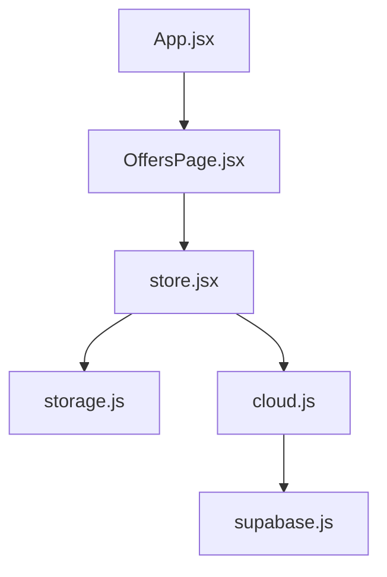
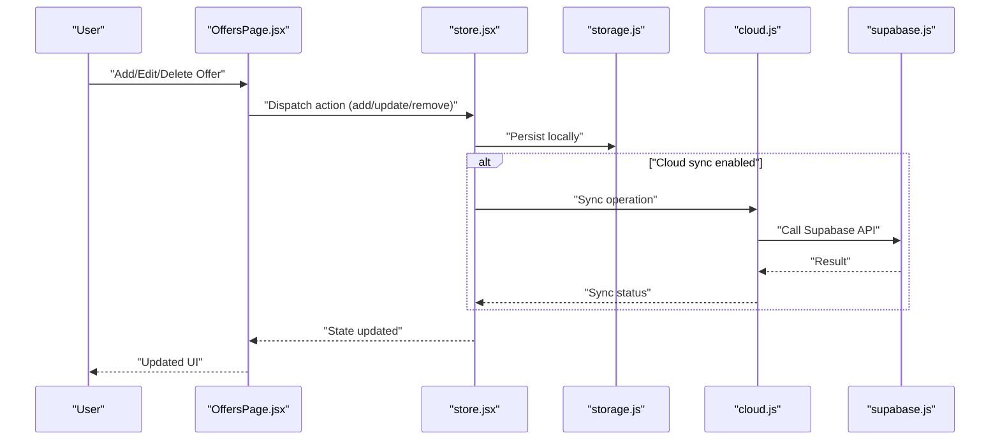
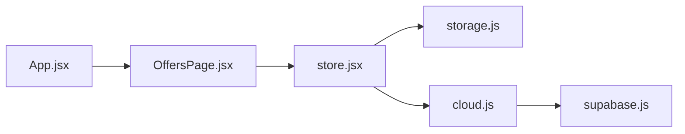
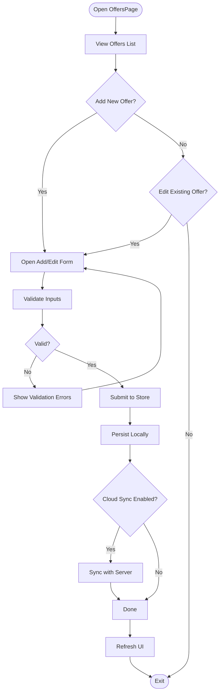

# Offer Input & Management

<cite>
**Referenced Files in This Document**
- [OffersPage.jsx](file://src/components/OffersPage.jsx)
- [store.jsx](file://src/store.jsx)
- [storage.js](file://src/lib/storage.js)
- [supabase.js](file://src/lib/supabase.js)
- [cloud.js](file://src/lib/cloud.js)
- [App.jsx](file://src/App.jsx)
</cite>

## Table of Contents
1. [Introduction](#introduction)
2. [Project Structure](#project-structure)
3. [Core Components](#core-components)
4. [Architecture Overview](#architecture-overview)
5. [Detailed Component Analysis](#detailed-component-analysis)
6. [Dependency Analysis](#dependency-analysis)
7. [Performance Considerations](#performance-considerations)
8. [Troubleshooting Guide](#troubleshooting-guide)
9. [Conclusion](#conclusion)
10. [Appendices](#appendices)

## Introduction
This document explains the offer input and management system centered around the OffersPage component. It covers how users add new job offers, edit existing ones, and manage offer data end-to-end. You will find:
- The form fields for compensation details, benefits, requirements, and other offer attributes
- Examples of the offer data structure and validation rules
- User interaction patterns for creating, editing, and deleting offers
- How CRUD operations are implemented and where data is stored and retrieved (local storage and optional cloud sync)

## Project Structure
The offer feature spans a small set of components and libraries:
- UI layer: OffersPage renders the list, forms, and actions
- State layer: store.jsx provides global state and actions for offers
- Persistence layer: storage.js handles local persistence; supabase.js and cloud.js handle optional cloud sync

**Diagram sources**
- [App.jsx](file://src/App.jsx)
- [OffersPage.jsx](file://src/components/OffersPage.jsx)
- [store.jsx](file://src/store.jsx)
- [storage.js](file://src/lib/storage.js)
- [cloud.js](file://src/lib/cloud.js)
- [supabase.js](file://src/lib/supabase.js)

**Section sources**
- [App.jsx](file://src/App.jsx)
- [OffersPage.jsx](file://src/components/OffersPage.jsx)
- [store.jsx](file://src/store.jsx)
- [storage.js](file://src/lib/storage.js)
- [cloud.js](file://src/lib/cloud.js)
- [supabase.js](file://src/lib/supabase.js)

## Core Components
- OffersPage: Provides the user interface to view, create, edit, and delete offers. It renders lists, detail views, and forms for compensation, benefits, requirements, and additional attributes.
- Store (store.jsx): Centralized state for offers with actions to add, update, remove, and persist offers. It may also coordinate syncing with cloud storage.
- Storage (storage.js): Local persistence utilities for reading/writing offers to the browser’s storage.
- Cloud (cloud.js): Optional synchronization helpers that use Supabase client to persist offers remotely.
- Supabase client (supabase.js): Configuration and client instance used by cloud.js.

Key responsibilities:
- Rendering and validating offer forms
- Managing offer lifecycle (create, read, update, delete)
- Persisting changes locally and optionally to the cloud
- Exposing actions to the UI via the store

**Section sources**
- [OffersPage.jsx](file://src/components/OffersPage.jsx)
- [store.jsx](file://src/store.jsx)
- [storage.js](file://src/lib/storage.js)
- [cloud.js](file://src/lib/cloud.js)
- [supabase.js](file://src/lib/supabase.js)

## Architecture Overview
The offer system follows a unidirectional data flow:
- User interactions in OffersPage trigger store actions
- Store updates local state and persists to storage.js
- Optionally, store triggers cloud sync via cloud.js using supabase.js
- UI re-renders based on updated store state

**Diagram sources**
- [OffersPage.jsx](file://src/components/OffersPage.jsx)
- [store.jsx](file://src/store.jsx)
- [storage.js](file://src/lib/storage.js)
- [cloud.js](file://src/lib/cloud.js)
- [supabase.js](file://src/lib/supabase.js)

## Detailed Component Analysis

### OffersPage Component
Responsibilities:
- Display the current list of offers
- Open forms to add or edit an offer
- Validate inputs before submission
- Trigger store actions for create, update, and delete
- Show feedback (e.g., success/error states)

Form fields typically include:
- Compensation details: base salary, currency, pay frequency, bonuses, equity, sign-on bonus
- Benefits: health insurance, retirement plans, PTO, remote/hybrid options, relocation
- Requirements: skills, experience level, education, certifications, work authorization
- Other attributes: company name, role title, location, start date, offer status, notes

Validation rules:
- Required fields such as company, role, and compensation amount
- Numeric ranges and currency formatting for monetary values
- Date parsing and future-date checks for start dates
- List-based fields (benefits, requirements) support adding/removing items

User interaction patterns:
- Add new offer: open a blank form, fill fields, submit to create
- Edit existing offer: select an offer, populate form, modify fields, submit to update
- Delete offer: confirm deletion, then remove from list and storage

CRUD operations:
- Create: dispatch add action, persist locally, optionally sync
- Read: load offers from storage into store, render in UI
- Update: dispatch update action with modified fields, persist and sync
- Delete: dispatch remove action, persist and sync

**Section sources**
- [OffersPage.jsx](file://src/components/OffersPage.jsx)

### Store (store.jsx)
Responsibilities:
- Maintain offers state (list, selected item, loading flags)
- Provide actions for add, update, remove, and bulk operations
- Coordinate persistence with storage.js
- Trigger cloud sync via cloud.js when configured

Data flow:
- Actions receive normalized offer payloads
- Store merges changes and writes to storage
- On successful local write, store calls cloud sync if enabled
- UI subscribes to store updates and re-renders

Error handling:
- Catches storage errors and surfaces them to UI
- Handles network failures during cloud sync and retries or queues operations

**Section sources**
- [store.jsx](file://src/store.jsx)

### Storage (storage.js)
Responsibilities:
- Read/write offers to local storage
- Ensure schema compatibility across versions
- Provide atomic updates and safe defaults

Operations:
- getOffers(): returns current list
- saveOffers(offers): persists the full list
- appendOffer(offer): adds a single offer
- updateOffer(id, changes): partial update by id
- removeOffer(id): deletes an offer by id

**Section sources**
- [storage.js](file://src/lib/storage.js)

### Cloud Sync (cloud.js and supabase.js)
Responsibilities:
- cloud.js: wraps Supabase calls for offers (CRUD), manages conflict resolution and retry logic
- supabase.js: initializes and exports the Supabase client

Flow:
- After local persistence, store invokes cloud sync
- cloud.js performs upserts/deletes on the server
- Errors are logged and surfaced to store for UI feedback

**Section sources**
- [cloud.js](file://src/lib/cloud.js)
- [supabase.js](file://src/lib/supabase.js)

### App Integration (App.jsx)
Responsibilities:
- Mounts OffersPage within the application layout
- Ensures store is available globally for OffersPage to consume

**Section sources**
- [App.jsx](file://src/App.jsx)

## Dependency Analysis
The following diagram shows how modules depend on each other for offer management:

**Diagram sources**
- [OffersPage.jsx](file://src/components/OffersPage.jsx)
- [store.jsx](file://src/store.jsx)
- [storage.js](file://src/lib/storage.js)
- [cloud.js](file://src/lib/cloud.js)
- [supabase.js](file://src/lib/supabase.js)
- [App.jsx](file://src/App.jsx)

**Section sources**
- [OffersPage.jsx](file://src/components/OffersPage.jsx)
- [store.jsx](file://src/store.jsx)
- [storage.js](file://src/lib/storage.js)
- [cloud.js](file://src/lib/cloud.js)
- [supabase.js](file://src/lib/supabase.js)
- [App.jsx](file://src/App.jsx)

## Performance Considerations
- Batch updates: group multiple changes to minimize storage writes
- Debounced saves: avoid excessive writes while typing in long forms
- Lazy rendering: paginate or virtualize large offer lists
- Selective sync: only sync changed fields to reduce network overhead
- Error backoff: exponential backoff for failed cloud sync attempts

[No sources needed since this section provides general guidance]

## Troubleshooting Guide
Common issues and resolutions:
- Form validation errors: ensure required fields are filled and numeric/date formats are correct
- Local storage quota exceeded: clear unused offers or migrate to cloud-only mode
- Cloud sync failures: check network connectivity, credentials, and server availability; retry after transient errors
- Data inconsistency: verify that local storage and cloud records match; consider a reconciliation step

Operational tips:
- Inspect store state to confirm actions were dispatched
- Check storage logs for write/read errors
- Review cloud sync logs for HTTP status codes and error messages

**Section sources**
- [OffersPage.jsx](file://src/components/OffersPage.jsx)
- [store.jsx](file://src/store.jsx)
- [storage.js](file://src/lib/storage.js)
- [cloud.js](file://src/lib/cloud.js)
- [supabase.js](file://src/lib/supabase.js)

## Conclusion
The offer input and management system provides a cohesive workflow for creating, editing, and deleting job offers. OffersPage drives user interactions, store.jsx orchestrates state and persistence, storage.js ensures reliable local saving, and cloud.js with supabase.js enables optional cloud synchronization. By following the documented data structures, validation rules, and interaction patterns, users can confidently manage their offers both offline and online.

[No sources needed since this section summarizes without analyzing specific files]

## Appendices

### Offer Data Model
A typical offer record includes:
- Identification: id, createdAt, updatedAt
- Role info: company, roleTitle, location, startDate, status
- Compensation: baseSalary, currency, payFrequency, bonus, equity, signOnBonus
- Benefits: healthInsurance, retirementPlan, ptoDays, remoteOption, relocation
- Requirements: skills[], experienceLevel, education, certifications, workAuthorization
- Notes: description, attachments[]

Example payload shape (illustrative):
{
  "id": "string",
  "company": "string",
  "roleTitle": "string",
  "location": "string",
  "startDate": "YYYY-MM-DD",
  "status": "string",
  "compensation": {
    "baseSalary": "number",
    "currency": "string",
    "payFrequency": "string",
    "bonus": "number",
    "equity": "object",
    "signOnBonus": "number"
  },
  "benefits": ["string"],
  "requirements": ["string"],
  "notes": "string",
  "createdAt": "ISO timestamp",
  "updatedAt": "ISO timestamp"
}

[No sources needed since this section provides conceptual model examples]

### Validation Rules Summary
- Required fields: company, roleTitle, compensation.baseSalary
- Monetary fields: non-negative numbers with valid currency codes
- Dates: ISO format, startDate must be valid and not in the past unless explicitly allowed
- Lists: benefits and requirements accept zero or more strings
- Status: one of predefined enum values (e.g., received, negotiating, accepted, declined)

[No sources needed since this section provides conceptual rules]

### User Interaction Flow

[No sources needed since this diagram shows conceptual workflow, not actual code structure]