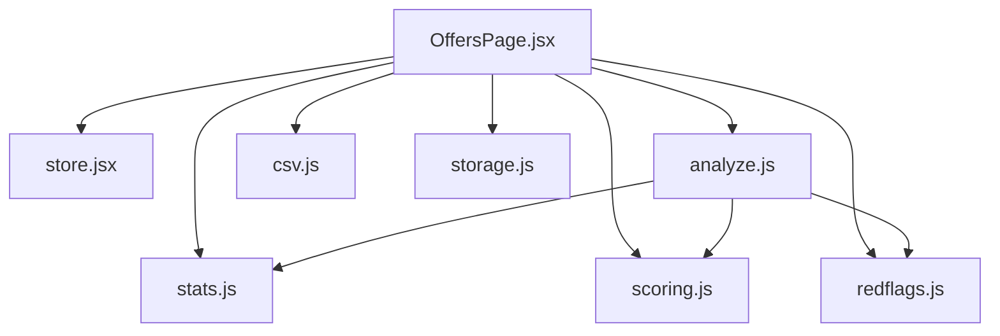
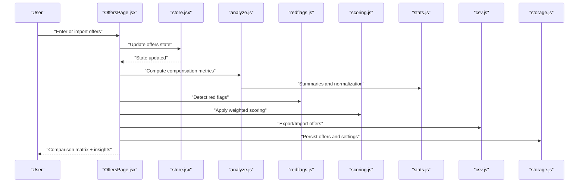
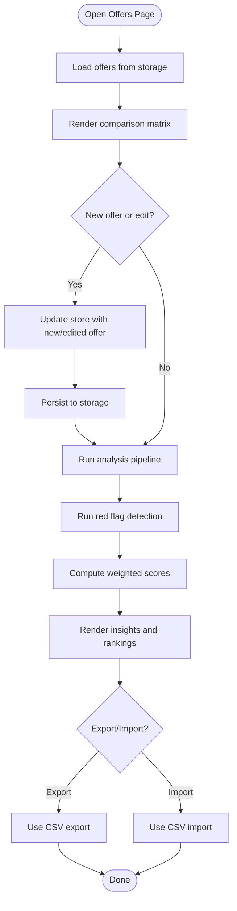
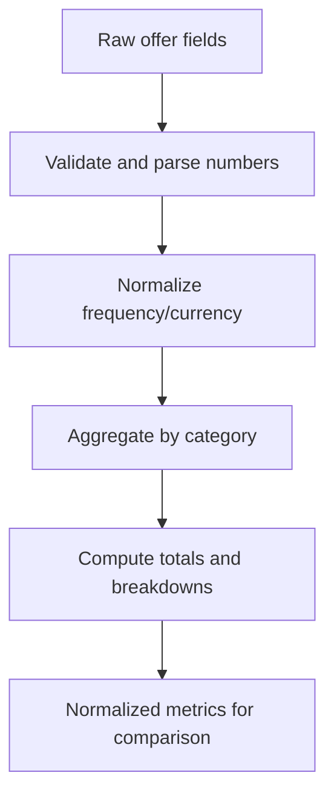
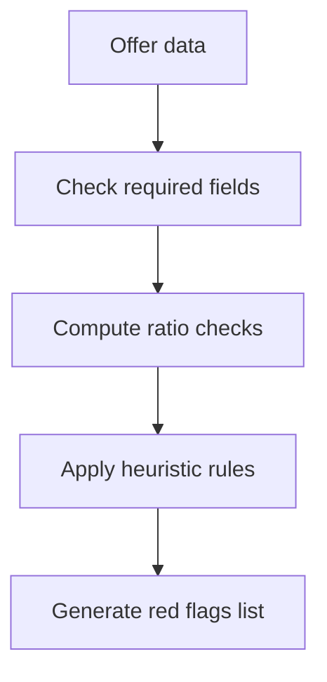
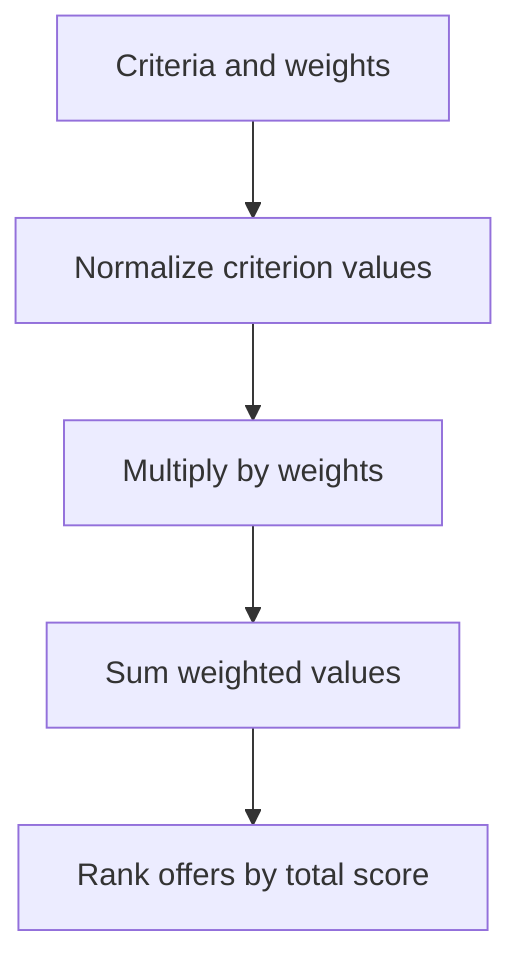
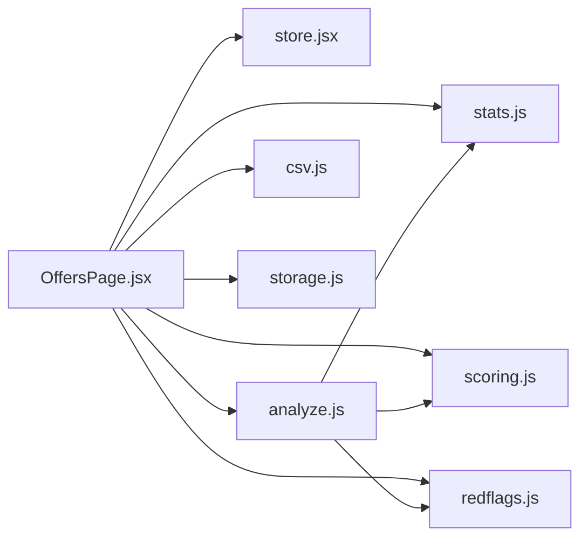

# Offer Management & Comparison

<cite>
**Referenced Files in This Document**
- [OffersPage.jsx](file://src/components/OffersPage.jsx)
- [analyze.js](file://src/lib/analyze.js)
- [redflags.js](file://src/lib/redflags.js)
- [scoring.js](file://src/lib/scoring.js)
- [stats.js](file://src/lib/stats.js)
- [csv.js](file://src/lib/csv.js)
- [storage.js](file://src/lib/storage.js)
- [store.jsx](file://src/store.jsx)
</cite>

## Table of Contents
1. [Introduction](#introduction)
2. [Project Structure](#project-structure)
3. [Core Components](#core-components)
4. [Architecture Overview](#architecture-overview)
5. [Detailed Component Analysis](#detailed-component-analysis)
6. [Dependency Analysis](#dependency-analysis)
7. [Performance Considerations](#performance-considerations)
8. [Troubleshooting Guide](#troubleshooting-guide)
9. [Conclusion](#conclusion)
10. [Appendices](#appendices)

## Introduction
This document explains the offer management and comparison system that helps users input, compare, and analyze multiple job offers side-by-side. It covers compensation analysis tools, red flag detection, scoring algorithms, decision support features, the comparison matrix, weighted scoring, and visualization aids. Examples are provided for offer entry, comparison scenarios, and interpreting results to guide informed decisions.

## Project Structure
The feature is implemented primarily through a React component for the user interface and several library modules for analysis, scoring, red flags, statistics, CSV import/export, and storage. The store coordinates state across the application.

**Diagram sources**
- [OffersPage.jsx](file://src/components/OffersPage.jsx)
- [store.jsx](file://src/store.jsx)
- [analyze.js](file://src/lib/analyze.js)
- [redflags.js](file://src/lib/redflags.js)
- [scoring.js](file://src/lib/scoring.js)
- [stats.js](file://src/lib/stats.js)
- [csv.js](file://src/lib/csv.js)
- [storage.js](file://src/lib/storage.js)

**Section sources**
- [OffersPage.jsx](file://src/components/OffersPage.jsx)
- [store.jsx](file://src/store.jsx)
- [analyze.js](file://src/lib/analyze.js)
- [redflags.js](file://src/lib/redflags.js)
- [scoring.js](file://src/lib/scoring.js)
- [stats.js](file://src/lib/stats.js)
- [csv.js](file://src/lib/csv.js)
- [storage.js](file://src/lib/storage.js)

## Core Components
- Offers page: Provides the primary UI for entering offers, viewing them side-by-side, running analyses, exporting/importing data, and persisting progress.
- Analysis engine: Aggregates compensation metrics, computes totals, and prepares normalized values for comparison.
- Red flag detector: Identifies potential risks or inconsistencies in offer terms (e.g., missing components, unusual ratios).
- Scoring system: Applies configurable weights to criteria and produces composite scores for ranking offers.
- Statistics helpers: Computes summary metrics useful for comparisons and visualizations.
- CSV utilities: Import and export offers for sharing and backup.
- Storage: Persists offers locally so users can continue work across sessions.
- Store: Centralized state for offers, settings, and computed results.

**Section sources**
- [OffersPage.jsx](file://src/components/OffersPage.jsx)
- [analyze.js](file://src/lib/analyze.js)
- [redflags.js](file://src/lib/redflags.js)
- [scoring.js](file://src/lib/scoring.js)
- [stats.js](file://src/lib/stats.js)
- [csv.js](file://src/lib/csv.js)
- [storage.js](file://src/lib/storage.js)
- [store.jsx](file://src/store.jsx)

## Architecture Overview
The system follows a clear separation between UI and logic:
- The UI layer renders the comparison matrix and controls.
- The analysis pipeline transforms raw inputs into structured metrics.
- The red flag module inspects inputs for warnings.
- The scoring module applies weights to produce ranked outcomes.
- Utilities handle persistence and CSV operations.

**Diagram sources**
- [OffersPage.jsx](file://src/components/OffersPage.jsx)
- [store.jsx](file://src/store.jsx)
- [analyze.js](file://src/lib/analyze.js)
- [redflags.js](file://src/lib/redflags.js)
- [scoring.js](file://src/lib/scoring.js)
- [stats.js](file://src/lib/stats.js)
- [csv.js](file://src/lib/csv.js)
- [storage.js](file://src/lib/storage.js)

## Detailed Component Analysis

### Offers Page (UI and Orchestration)
Responsibilities:
- Collects offer entries via forms and CSV import.
- Displays a side-by-side comparison matrix with key fields and computed insights.
- Triggers analysis, red flag checks, and scoring.
- Exports results and persists data.

Key interactions:
- Reads/writes offers from/to the store.
- Invokes analysis, red flags, and scoring modules.
- Uses CSV utilities for import/export.
- Persists changes using storage utilities.

**Diagram sources**
- [OffersPage.jsx](file://src/components/OffersPage.jsx)
- [storage.js](file://src/lib/storage.js)
- [csv.js](file://src/lib/csv.js)
- [analyze.js](file://src/lib/analyze.js)
- [redflags.js](file://src/lib/redflags.js)
- [scoring.js](file://src/lib/scoring.js)

**Section sources**
- [OffersPage.jsx](file://src/components/OffersPage.jsx)
- [storage.js](file://src/lib/storage.js)
- [csv.js](file://src/lib/csv.js)

### Compensation Analysis Engine
Purpose:
- Normalizes and aggregates compensation components (base salary, bonuses, equity, benefits, allowances).
- Produces comparable totals and breakdowns across offers.
- Prepares normalized values for fair comparison when currencies or frequencies differ.

Processing logic:
- Parse and validate numeric fields.
- Normalize recurring vs one-time payments.
- Aggregate subtotals by category.
- Provide per-offer summaries for visualization.

**Diagram sources**
- [analyze.js](file://src/lib/analyze.js)
- [stats.js](file://src/lib/stats.js)

**Section sources**
- [analyze.js](file://src/lib/analyze.js)
- [stats.js](file://src/lib/stats.js)

### Red Flag Detection System
Purpose:
- Highlights potential risks or inconsistencies in offer terms.
- Surfaces missing components, unusual ratios, or policy concerns.

Detection approach:
- Inspect presence of expected fields.
- Compute ratios (e.g., bonus-to-base, equity vesting gaps).
- Apply rule-based heuristics to generate warnings.

**Diagram sources**
- [redflags.js](file://src/lib/redflags.js)

**Section sources**
- [redflags.js](file://src/lib/redflags.js)

### Weighted Scoring and Ranking
Purpose:
- Converts multi-criteria offer attributes into a single score for ranking.
- Allows users to adjust weights to reflect personal priorities.

Scoring workflow:
- Select criteria (e.g., base pay, bonus, equity, benefits, location, growth).
- Assign weights per criterion.
- Normalize each criterion across offers.
- Compute weighted sum to derive final scores.
- Rank offers by score.

**Diagram sources**
- [scoring.js](file://src/lib/scoring.js)
- [stats.js](file://src/lib/stats.js)

**Section sources**
- [scoring.js](file://src/lib/scoring.js)
- [stats.js](file://src/lib/stats.js)

### Visualization and Decision Support
Features:
- Side-by-side comparison matrix showing key metrics and computed insights.
- Summary charts and highlights derived from analysis and scoring.
- Ranked list of offers based on weighted scoring.
- Exportable reports for sharing or archiving.

Integration points:
- Pulls normalized metrics from the analysis engine.
- Incorporates red flags into the view for quick risk awareness.
- Reflects current weights and resulting rankings.

**Section sources**
- [OffersPage.jsx](file://src/components/OffersPage.jsx)
- [analyze.js](file://src/lib/analyze.js)
- [redflags.js](file://src/lib/redflags.js)
- [scoring.js](file://src/lib/scoring.js)

### Data Persistence and Sharing
- Local storage ensures offers survive refreshes and device restarts.
- CSV import/export enables sharing offers across devices or collaborators.

Operations:
- Save offers and settings automatically after edits.
- Import CSV to bulk-add offers.
- Export current set for backup or review.

**Section sources**
- [storage.js](file://src/lib/storage.js)
- [csv.js](file://src/lib/csv.js)

## Dependency Analysis
High-level dependencies among modules:

**Diagram sources**
- [OffersPage.jsx](file://src/components/OffersPage.jsx)
- [store.jsx](file://src/store.jsx)
- [analyze.js](file://src/lib/analyze.js)
- [redflags.js](file://src/lib/redflags.js)
- [scoring.js](file://src/lib/scoring.js)
- [stats.js](file://src/lib/stats.js)
- [csv.js](file://src/lib/csv.js)
- [storage.js](file://src/lib/storage.js)

**Section sources**
- [OffersPage.jsx](file://src/components/OffersPage.jsx)
- [store.jsx](file://src/store.jsx)
- [analyze.js](file://src/lib/analyze.js)
- [redflags.js](file://src/lib/redflags.js)
- [scoring.js](file://src/lib/scoring.js)
- [stats.js](file://src/lib/stats.js)
- [csv.js](file://src/lib/csv.js)
- [storage.js](file://src/lib/storage.js)

## Performance Considerations
- Keep the number of offers reasonable for smooth rendering; consider pagination or filtering if the dataset grows large.
- Debounce heavy computations (analysis, scoring) during rapid edits.
- Cache normalized metrics and red flags to avoid recomputation unless inputs change.
- Use efficient CSV parsing and streaming for large imports.
- Avoid unnecessary re-renders by memoizing derived data where possible.

[No sources needed since this section provides general guidance]

## Troubleshooting Guide
Common issues and resolutions:
- Missing or invalid numeric fields: Ensure all monetary and percentage fields are valid numbers before analysis.
- Currency/frequency mismatches: Normalize inputs consistently to avoid skewed totals.
- Unexpected red flags: Review flagged items and correct underlying data or adjust thresholds if appropriate.
- Scores not updating: Verify weights and normalization steps; ensure inputs changed and triggered recomputation.
- Data loss: Confirm local storage availability and permissions; use CSV export regularly as a backup.

**Section sources**
- [redflags.js](file://src/lib/redflags.js)
- [scoring.js](file://src/lib/scoring.js)
- [analyze.js](file://src/lib/analyze.js)
- [storage.js](file://src/lib/storage.js)
- [csv.js](file://src/lib/csv.js)

## Conclusion
The offer management and comparison system provides a cohesive workflow for entering offers, analyzing compensation, detecting red flags, and ranking options with a transparent, weighted scoring model. The side-by-side matrix and derived insights help users make confident, data-driven decisions. Robust persistence and CSV sharing further enhance usability and collaboration.

[No sources needed since this section summarizes without analyzing specific files]

## Appendices

### Example: Offer Entry and Comparison Scenario
- Enter two offers with different structures (e.g., higher base vs higher bonus/equity).
- Run analysis to see normalized totals and breakdowns.
- Review red flags for any missing components or unusual ratios.
- Adjust weights to prioritize base pay, bonus, or equity.
- Compare rankings and choose the best fit for your goals.

[No sources needed since this section provides conceptual examples]