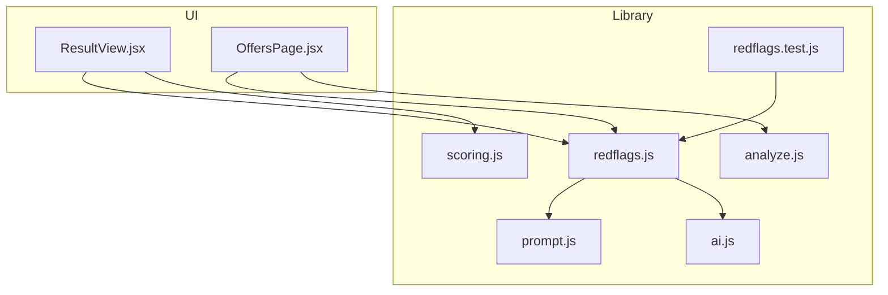
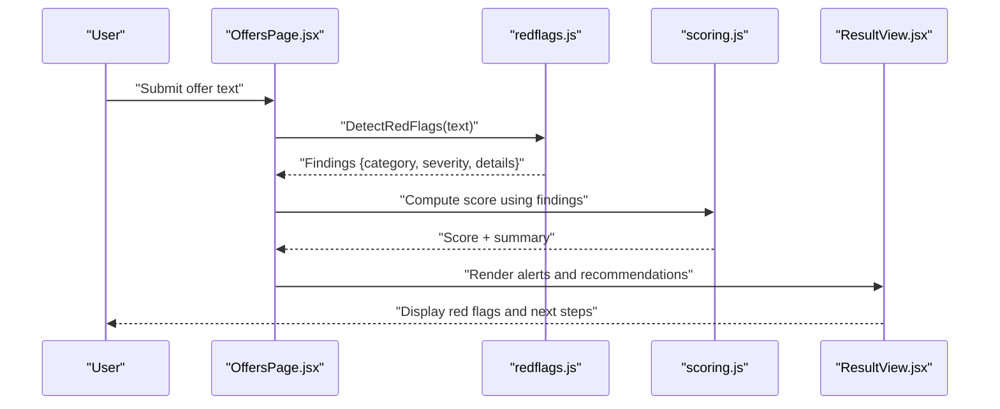
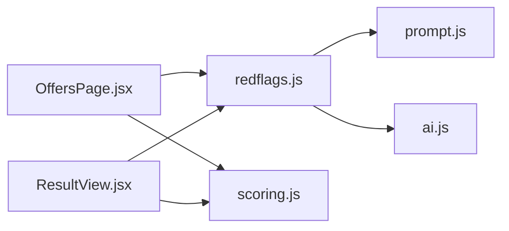

# Red Flag Detection System

<cite>
**Referenced Files in This Document**
- [redflags.js](file://src/lib/redflags.js)
- [redflags.test.js](file://src/lib/redflags.test.js)
- [analyze.js](file://src/lib/analyze.js)
- [scoring.js](file://src/lib/scoring.js)
- [prompt.js](file://src/lib/prompt.js)
- [ai.js](file://src/lib/ai.js)
- [ResultsView.jsx](file://src/components/ResultView.jsx)
- [OffersPage.jsx](file://src/components/OffersPage.jsx)
</cite>

## Table of Contents
1. [Introduction](#introduction)
2. [Project Structure](#project-structure)
3. [Core Components](#core-components)
4. [Architecture Overview](#architecture-overview)
5. [Detailed Component Analysis](#detailed-component-analysis)
6. [Dependency Analysis](#dependency-analysis)
7. [Performance Considerations](#performance-considerations)
8. [Troubleshooting Guide](#troubleshooting-guide)
9. [Conclusion](#conclusion)
10. [Appendices](#appendices)

## Introduction
This document explains the red flag detection system that identifies potential issues in job offers. It covers categories of red flags, detection rules, severity levels, alert mechanisms, and how common problematic patterns are recognized (for example, unrealistic expectations, compensation issues, or contract concerns). It also includes examples of detected red flags, guidance for customizing detection rules, interpreting flagged issues, and an overview of test coverage and rule validation processes.

## Project Structure
The red flag detection logic is implemented as a library module with dedicated tests. The UI integrates with this library to present results and alerts to users.

**Diagram sources**
- [redflags.js](file://src/lib/redflags.js)
- [redflags.test.js](file://src/lib/redflags.test.js)
- [analyze.js](file://src/lib/analyze.js)
- [scoring.js](file://src/lib/scoring.js)
- [prompt.js](file://src/lib/prompt.js)
- [ai.js](file://src/lib/ai.js)
- [ResultView.jsx](file://src/components/ResultView.jsx)
- [OffersPage.jsx](file://src/components/OffersPage.jsx)

**Section sources**
- [redflags.js](file://src/lib/redflags.js)
- [redflags.test.js](file://src/lib/redflags.test.js)
- [analyze.js](file://src/lib/analyze.js)
- [scoring.js](file://src/lib/scoring.js)
- [prompt.js](file://src/lib/prompt.js)
- [ai.js](file://src/lib/ai.js)
- [ResultView.jsx](file://src/components/ResultView.jsx)
- [OffersPage.jsx](file://src/components/OffersPage.jsx)

## Core Components
- Red flag engine: Centralized detection rules and categorization of issues found in job offer text.
- Severity model: Each red flag has a severity level used to prioritize alerts.
- Alerting integration: UI components consume red flag results to display warnings and recommendations.
- Scoring linkage: Red flags may influence overall offer scoring and summary generation.
- Prompt/AI assistance: Optional prompts or AI-based analysis can augment rule-based detection.

Key responsibilities:
- Parse and normalize input text from job offers.
- Apply rule sets across multiple categories (expectations, compensation, contract terms, etc.).
- Produce structured findings with category, severity, and suggested actions.
- Expose APIs for UI rendering and analytics.

**Section sources**
- [redflags.js](file://src/lib/redflags.js)
- [scoring.js](file://src/lib/scoring.js)
- [ResultView.jsx](file://src/components/ResultView.jsx)
- [OffersPage.jsx](file://src/components/OffersPage.jsx)

## Architecture Overview
The red flag detection system follows a layered architecture:
- Input layer: Accepts raw offer text or structured fields.
- Rule engine: Applies deterministic checks and heuristics.
- Aggregation layer: Combines findings into a unified result set.
- Output layer: Emits alerts, summaries, and optional AI-enhanced insights.

**Diagram sources**
- [OffersPage.jsx](file://src/components/OffersPage.jsx)
- [redflags.js](file://src/lib/redflags.js)
- [scoring.js](file://src/lib/scoring.js)
- [ResultView.jsx](file://src/components/ResultView.jsx)

## Detailed Component Analysis

### Red Flag Categories and Rules
Categories typically include:
- Unrealistic expectations: Overly aggressive timelines, vague deliverables, or scope creep indicators.
- Compensation issues: Missing salary ranges, ambiguous bonus structures, or non-standard pay terms.
- Contract concerns: Non-compete clauses, IP assignment, termination conditions, or equity ambiguities.
- Role clarity: Unclear responsibilities, reporting lines, or performance metrics.
- Compliance and benefits: Missing statutory benefits, unclear leave policies, or remote work constraints.

Detection approach:
- Keyword and phrase matching with contextual normalization.
- Numeric thresholds and range validations (e.g., missing or out-of-range values).
- Structural checks for required sections or clauses.
- Cross-field consistency checks (e.g., role vs. responsibilities alignment).

Severity levels:
- Critical: Immediate risk requiring attention before acceptance.
- High: Significant concern that should be clarified or mitigated.
- Medium: Moderate risk; consider negotiation or documentation.
- Low: Minor issue; informational or best-practice recommendation.

Alert mechanisms:
- In-app notifications and banners.
- Highlighted sections within the offer view.
- Exportable summary for sharing with advisors.

Examples of detected red flags:
- “Unrealistic expectations” flagged when deadlines are extremely short without justification.
- “Compensation ambiguity” flagged when total compensation components are not itemized.
- “Contract risk” flagged when restrictive clauses are present without clear exceptions.

Customization:
- Toggle categories on/off via configuration.
- Adjust keyword lists and thresholds per region or industry.
- Add custom rules by extending the rule registry.

Guidance for interpretation:
- Review each finding’s category and severity.
- Use suggested actions to negotiate or request clarifications.
- Prioritize critical and high-severity items first.

**Section sources**
- [redflags.js](file://src/lib/redflags.js)
- [redflags.test.js](file://src/lib/redflags.test.js)

### Rule Validation and Test Coverage
Testing strategy:
- Unit tests validate individual rules against positive and negative cases.
- Integration tests verify end-to-end detection flows and output structure.
- Edge case coverage ensures robustness against malformed inputs.

Validation process:
- Run the test suite to confirm all rules pass expected outcomes.
- Add new tests when introducing or modifying rules.
- Maintain regression guards for existing detections.

Coverage highlights:
- Category-specific assertions ensure balanced detection across domains.
- Severity mapping verified through explicit expectations.
- Output schema validated to guarantee consistent consumption by UI.

**Section sources**
- [redflags.test.js](file://src/lib/redflags.test.js)

### Integration with Scoring and Summaries
Scoring linkage:
- Red flags contribute to an overall offer score by penalizing risky areas.
- Weighting can vary by category severity.

Summaries and prompts:
- Summaries aggregate top findings and recommended next steps.
- Prompts may guide users on what to clarify during negotiations.

AI augmentation:
- Optional AI-based analysis can provide additional context or suggestions based on detected patterns.

**Section sources**
- [scoring.js](file://src/lib/scoring.js)
- [prompt.js](file://src/lib/prompt.js)
- [ai.js](file://src/lib/ai.js)

### UI Presentation and Alerts
Presentation:
- Offers page triggers detection and displays initial alerts.
- Results view renders detailed findings, severity badges, and actionable tips.

Accessibility and UX:
- Clear labeling of severity levels.
- Expandable details for each red flag.
- Option to export or share findings.

**Section sources**
- [OffersPage.jsx](file://src/components/OffersPage.jsx)
- [ResultView.jsx](file://src/components/ResultView.jsx)

## Dependency Analysis
The red flag engine depends on utility modules for prompting and optional AI assistance. UI components depend on the engine and scoring module to render results and compute scores.

**Diagram sources**
- [redflags.js](file://src/lib/redflags.js)
- [prompt.js](file://src/lib/prompt.js)
- [ai.js](file://src/lib/ai.js)
- [OffersPage.jsx](file://src/components/OffersPage.jsx)
- [ResultView.jsx](file://src/components/ResultView.jsx)
- [scoring.js](file://src/lib/scoring.js)

**Section sources**
- [redflags.js](file://src/lib/redflags.js)
- [prompt.js](file://src/lib/prompt.js)
- [ai.js](file://src/lib/ai.js)
- [OffersPage.jsx](file://src/components/OffersPage.jsx)
- [ResultView.jsx](file://src/components/ResultView.jsx)
- [scoring.js](file://src/lib/scoring.js)

## Performance Considerations
- Keep rule sets efficient by avoiding expensive regex operations where possible.
- Cache normalized text to prevent repeated preprocessing.
- Defer heavy computations (like AI calls) until necessary.
- Batch UI updates to reduce re-renders when presenting many findings.

[No sources needed since this section provides general guidance]

## Troubleshooting Guide
Common issues and resolutions:
- No red flags detected: Ensure input text is complete and uncorrupted; check normalization steps.
- False positives: Adjust keyword lists or thresholds; add negative test cases.
- UI not showing alerts: Verify data shape returned by the engine matches UI expectations.
- Performance degradation: Profile rule execution and optimize hot paths.

Debugging aids:
- Enable verbose logging in development mode.
- Inspect intermediate findings before aggregation.
- Validate outputs against the expected schema.

**Section sources**
- [redflags.test.js](file://src/lib/redflags.test.js)
- [redflags.js](file://src/lib/redflags.js)

## Conclusion
The red flag detection system provides a robust, customizable framework for identifying risks in job offers. By combining rule-based detection with optional AI assistance and clear UI presentation, it helps users make informed decisions and take actionable next steps. Maintaining comprehensive tests and clear customization points ensures reliability and adaptability over time.

[No sources needed since this section summarizes without analyzing specific files]

## Appendices

### API Reference Summary
- DetectRedFlags(input): Returns structured findings with category, severity, and details.
- ComputeOfferScore(findings): Computes an overall score influenced by red flag severities.
- RenderAlerts(findings): Presents findings in the UI with severity badges and recommendations.

**Section sources**
- [redflags.js](file://src/lib/redflags.js)
- [scoring.js](file://src/lib/scoring.js)
- [ResultView.jsx](file://src/components/ResultView.jsx)