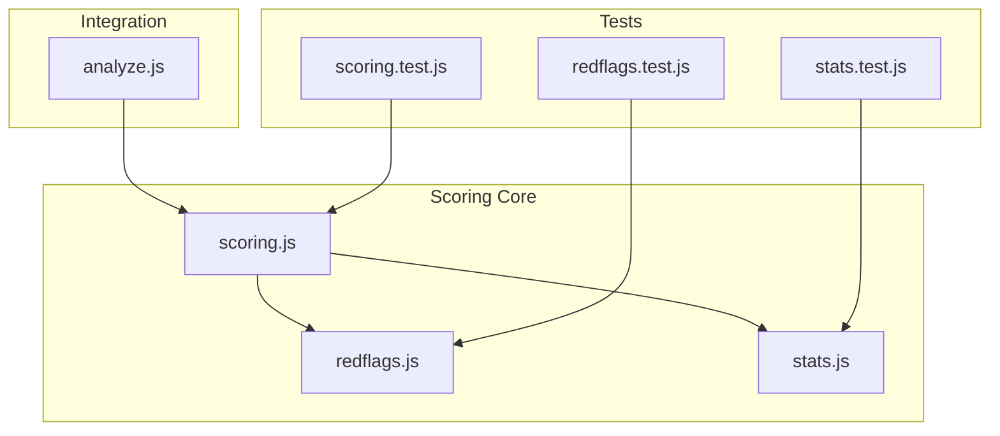
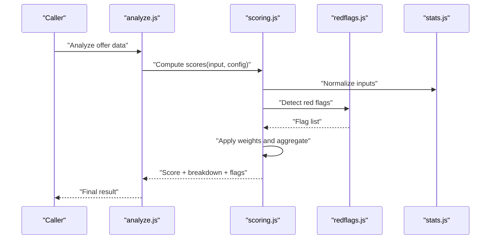
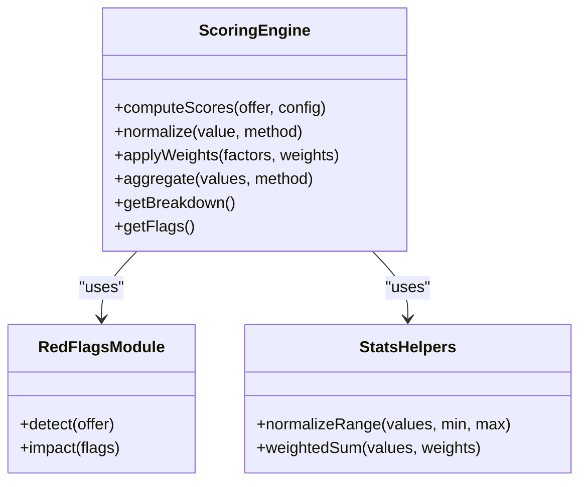
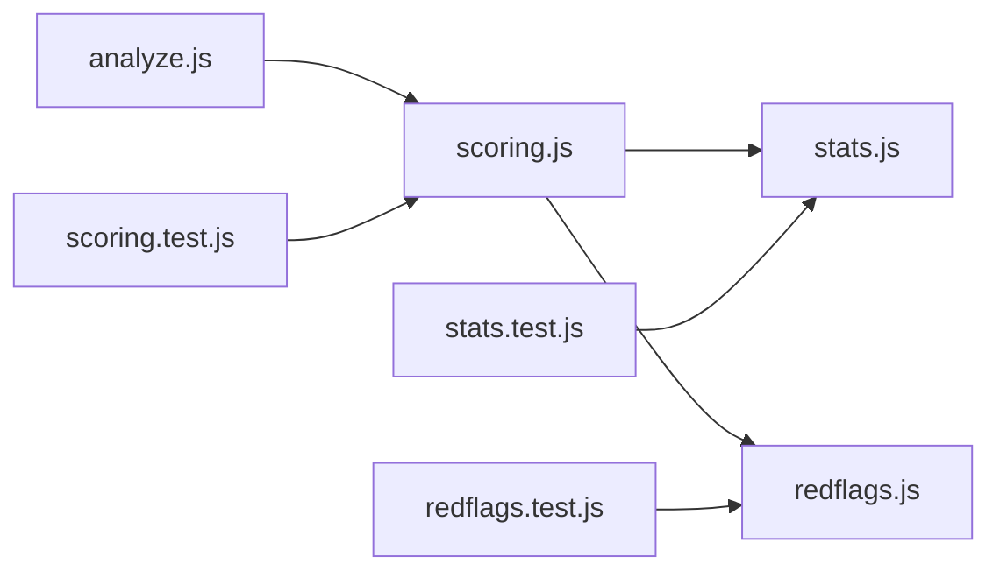

# Scoring Algorithms & Weighted Analysis

<cite>
**Referenced Files in This Document**
- [scoring.js](file://src/lib/scoring.js)
- [scoring.test.js](file://src/lib/scoring.test.js)
- [analyze.js](file://src/lib/analyze.js)
- [redflags.js](file://src/lib/redflags.js)
- [redflags.test.js](file://src/lib/redflags.test.js)
- [stats.js](file://src/lib/stats.js)
- [stats.test.js](file://src/lib/stats.test.js)
</cite>

## Table of Contents
1. [Introduction](#introduction)
2. [Project Structure](#project-structure)
3. [Core Components](#core-components)
4. [Architecture Overview](#architecture-overview)
5. [Detailed Component Analysis](#detailed-component-analysis)
6. [Dependency Analysis](#dependency-analysis)
7. [Performance Considerations](#performance-considerations)
8. [Troubleshooting Guide](#troubleshooting-guide)
9. [Conclusion](#conclusion)
10. [Appendices](#appendices)

## Introduction
This document explains the scoring algorithms and weighted analysis system used to evaluate job offers. It covers how offer factors are identified, normalized, weighted, and combined into an overall score. It also documents configuration options for weights, normalization methods, calculation formulas, example calculations across different offer types, customization guidance, interpretation of final scores, and the test cases that validate accuracy.

## Project Structure
The scoring logic is implemented as a set of focused modules:
- A dedicated scoring engine that computes factor scores, applies weights, normalizes inputs, and aggregates results.
- Supporting utilities for red flag detection, statistical helpers, and integration points with higher-level analysis flows.

**Diagram sources**
- [scoring.js](file://src/lib/scoring.js)
- [redflags.js](file://src/lib/redflags.js)
- [stats.js](file://src/lib/stats.js)
- [analyze.js](file://src/lib/analyze.js)
- [scoring.test.js](file://src/lib/scoring.test.js)
- [redflags.test.js](file://src/lib/redflags.test.js)
- [stats.test.js](file://src/lib/stats.test.js)

**Section sources**
- [scoring.js](file://src/lib/scoring.js)
- [analyze.js](file://src/lib/analyze.js)
- [redflags.js](file://src/lib/redflags.js)
- [stats.js](file://src/lib/stats.js)
- [scoring.test.js](file://src/lib/scoring.test.js)
- [redflags.test.js](file://src/lib/redflags.test.js)
- [stats.test.js](file://src/lib/stats.test.js)

## Core Components
- Scoring Engine: Computes per-factor scores, applies configurable weights, normalizes values, and aggregates into an overall score. It exposes functions to compute raw factor contributions, apply weights, normalize inputs, and produce final outputs including breakdowns and flags.
- Red Flags Module: Detects negative signals (e.g., missing benefits, risky clauses) and contributes to penalty or flagging logic within the scoring pipeline.
- Stats Helpers: Provide utility functions for normalization, aggregation, and statistical operations used by the scoring engine.
- Integration Layer: The analysis module orchestrates data preparation, invokes scoring, and returns structured results for UI or downstream processing.

Key responsibilities:
- Factor extraction from offer data
- Normalization of heterogeneous inputs
- Weight application and aggregation
- Red flag detection and impact on score
- Testable, deterministic computation with clear inputs/outputs

**Section sources**
- [scoring.js](file://src/lib/scoring.js)
- [redflags.js](file://src/lib/redflags.js)
- [stats.js](file://src/lib/stats.js)
- [analyze.js](file://src/lib/analyze.js)

## Architecture Overview
The scoring workflow transforms raw offer attributes into a normalized, weighted score with detailed breakdowns and flags.

**Diagram sources**
- [analyze.js](file://src/lib/analyze.js)
- [scoring.js](file://src/lib/scoring.js)
- [redflags.js](file://src/lib/redflags.js)
- [stats.js](file://src/lib/stats.js)

## Detailed Component Analysis

### Scoring Engine
Responsibilities:
- Accepts offer attributes and weight configuration
- Normalizes each factor to a common scale
- Applies weights to normalized factors
- Aggregates into an overall score
- Produces a detailed breakdown and red flags

Inputs:
- Offer attributes (e.g., compensation components, benefits, role characteristics)
- Weight configuration object defining factor importance and optional thresholds

Outputs:
- Overall score
- Per-factor scores
- Normalized factor values
- Red flags and their impacts

Normalization:
- Uses helper utilities to map diverse inputs to a consistent range suitable for weighting and aggregation.

Weighting and Aggregation:
- Multiplies normalized factor values by corresponding weights
- Aggregates using a configured method (e.g., weighted sum) to produce the final score

Red Flags:
- Integrates with the red flags module to detect issues that may reduce the score or add warnings

Customization:
- Weights can be adjusted per factor to reflect user priorities or company policies
- Optional parameters allow tuning normalization behavior and threshold-based penalties

Example Calculation Flow:
- Normalize each factor
- Multiply by weights
- Sum weighted values
- Apply any red flag adjustments
- Return final score and breakdown

**Section sources**
- [scoring.js](file://src/lib/scoring.js)
- [stats.js](file://src/lib/stats.js)
- [redflags.js](file://src/lib/redflags.js)

#### Class Diagram

**Diagram sources**
- [scoring.js](file://src/lib/scoring.js)
- [redflags.js](file://src/lib/redflags.js)
- [stats.js](file://src/lib/stats.js)

### Red Flags Module
Responsibilities:
- Identify risk indicators in offer data
- Quantify potential negative impact on the score
- Provide actionable insights for users

Common checks include:
- Missing or below-market compensation elements
- Absence of key benefits
- Contractual risks or unfavorable terms

Impact:
- Adjusts final score or adds warning flags based on severity and frequency

**Section sources**
- [redflags.js](file://src/lib/redflags.js)
- [redflags.test.js](file://src/lib/redflags.test.js)

### Stats Helpers
Responsibilities:
- Provide normalization functions to bring disparate inputs onto a common scale
- Implement aggregation utilities such as weighted sums
- Ensure numerical stability and edge-case handling

Usage:
- Called by the scoring engine during normalization and aggregation phases

**Section sources**
- [stats.js](file://src/lib/stats.js)
- [stats.test.js](file://src/lib/stats.test.js)

### Integration Layer (Analysis)
Responsibilities:
- Prepare input data for scoring
- Invoke the scoring engine with appropriate configuration
- Format results for consumption by UI or other systems

Flow:
- Receives raw offer data
- Calls scoring functions
- Returns structured output including score, breakdown, and flags

**Section sources**
- [analyze.js](file://src/lib/analyze.js)

## Dependency Analysis
The scoring system has clear separation of concerns:
- Scoring depends on stats helpers for normalization/aggregation and red flags for risk detection.
- The analysis layer orchestrates calls to scoring and returns final results.
- Tests validate each component independently and in combination.

**Diagram sources**
- [analyze.js](file://src/lib/analyze.js)
- [scoring.js](file://src/lib/scoring.js)
- [stats.js](file://src/lib/stats.js)
- [redflags.js](file://src/lib/redflags.js)
- [scoring.test.js](file://src/lib/scoring.test.js)
- [redflags.test.js](file://src/lib/redflags.test.js)
- [stats.test.js](file://src/lib/stats.test.js)

**Section sources**
- [analyze.js](file://src/lib/analyze.js)
- [scoring.js](file://src/lib/scoring.js)
- [stats.js](file://src/lib/stats.js)
- [redflags.js](file://src/lib/redflags.js)
- [scoring.test.js](file://src/lib/scoring.test.js)
- [redflags.test.js](file://src/lib/redflags.test.js)
- [stats.test.js](file://src/lib/stats.test.js)

## Performance Considerations
- Keep normalization and aggregation operations efficient; avoid unnecessary recomputation when inputs do not change.
- Cache intermediate normalized values if multiple aggregations are performed.
- Limit the number of red flag checks to only those relevant to the current offer type.
- Use vectorized operations where possible for batch scoring scenarios.

[No sources needed since this section provides general guidance]

## Troubleshooting Guide
Common issues and resolutions:
- Unexpected low scores: Verify normalization ranges and ensure all required factors are present. Check red flags for negative impacts.
- Inconsistent results across runs: Confirm deterministic inputs and stable weight configurations. Validate that random or time-dependent inputs are not influencing scoring.
- Edge cases with zero or null values: Ensure normalization handles missing data gracefully and that weights for absent factors do not distort the final score.

Validation approach:
- Unit tests assert expected outputs for representative inputs
- Boundary conditions are covered to ensure robustness
- Red flag detection is validated against known risky patterns

**Section sources**
- [scoring.test.js](file://src/lib/scoring.test.js)
- [redflags.test.js](file://src/lib/redflags.test.js)
- [stats.test.js](file://src/lib/stats.test.js)

## Conclusion
The scoring system provides a flexible, configurable framework for evaluating job offers. By normalizing diverse inputs, applying customizable weights, and integrating red flag detection, it produces transparent, interpretable scores with detailed breakdowns. The modular design supports easy extension and maintenance, while comprehensive tests ensure reliability.

[No sources needed since this section summarizes without analyzing specific files]

## Appendices

### Scoring Criteria and Weight Configuration
- Factors: Compensation, benefits, role fit, growth opportunities, work-life balance, risk indicators
- Weights: Configurable per factor to reflect user preferences or organizational policies
- Normalization: Maps each factor to a common scale before weighting
- Aggregation: Combines weighted factors into an overall score

**Section sources**
- [scoring.js](file://src/lib/scoring.js)
- [stats.js](file://src/lib/stats.js)

### Example Score Calculations
- Base salary-focused offer: Higher weight on compensation yields a strong overall score if normalized value is high
- Benefits-heavy offer: Elevated benefit weights improve the score even if base compensation is moderate
- Risky contract offer: Red flags reduce the score despite favorable compensation/benefits

Note: Refer to test cases for concrete input/output examples and boundary conditions.

**Section sources**
- [scoring.test.js](file://src/lib/scoring.test.js)
- [redflags.test.js](file://src/lib/redflags.test.js)

### Interpretation of Final Scores
- Higher scores indicate more favorable offers based on configured weights and criteria
- Breakdown reveals which factors contributed positively or negatively
- Red flags highlight areas requiring attention or negotiation

**Section sources**
- [scoring.js](file://src/lib/scoring.js)
- [redflags.js](file://src/lib/redflags.js)

### Customization Guidance
- Adjust weights to prioritize personal or company-specific criteria
- Modify normalization methods if domain knowledge suggests alternative scaling
- Extend red flag rules to capture additional risk indicators

**Section sources**
- [scoring.js](file://src/lib/scoring.js)
- [redflags.js](file://src/lib/redflags.js)