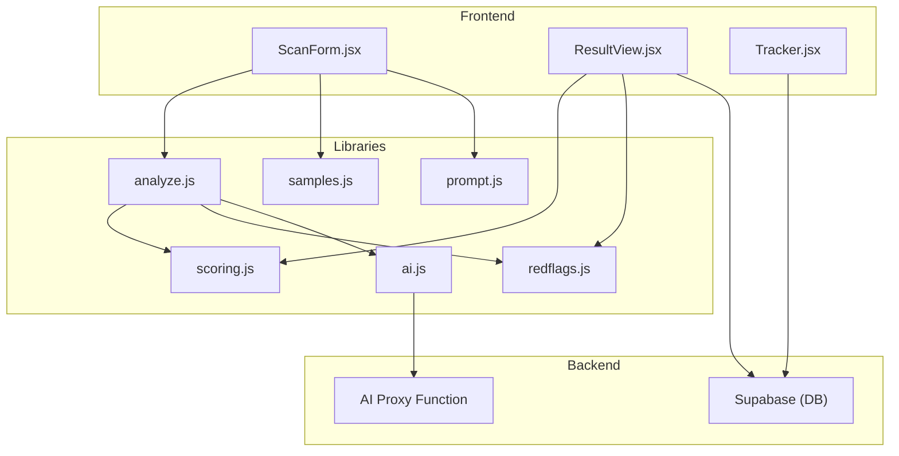
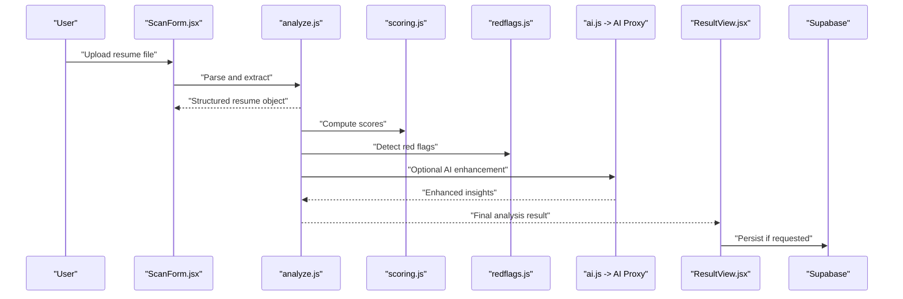
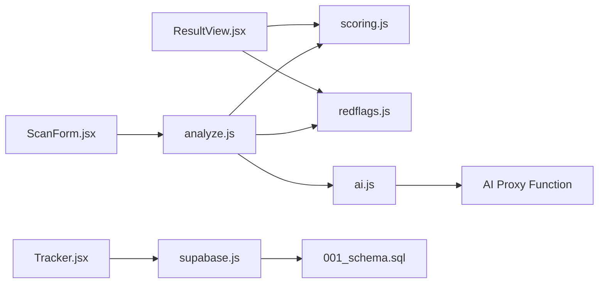

# Resume Scanner & Analysis

<cite>
**Referenced Files in This Document**
- [ScanForm.jsx](file://src/components/ScanForm.jsx)
- [analyze.js](file://src/lib/analyze.js)
- [scoring.js](file://src/lib/scoring.js)
- [redflags.js](file://src/lib/redflags.js)
- [samples.js](file://src/lib/samples.js)
- [prompt.js](file://src/lib/prompt.js)
- [ai.js](file://src/lib/ai.js)
- [ResultView.jsx](file://src/components/ResultView.jsx)
- [Tracker.jsx](file://src/components/Tracker.jsx)
- [supabase.js](file://src/lib/supabase.js)
- [001_schema.sql](file://supabase/migrations/001_schema.sql)
</cite>

## Table of Contents
1. [Introduction](#introduction)
2. [Project Structure](#project-structure)
3. [Core Components](#core-components)
4. [Architecture Overview](#architecture-overview)
5. [Detailed Component Analysis](#detailed-component-analysis)
6. [Dependency Analysis](#dependency-analysis)
7. [Performance Considerations](#performance-considerations)
8. [Troubleshooting Guide](#troubleshooting-guide)
9. [Conclusion](#conclusion)
10. [Appendices](#appendices)

## Introduction
This document explains the resume scanning and analysis feature, covering how users upload resumes, how the system parses and extracts content, and how it generates structured analysis results for downstream features. It also documents supported formats, validation rules, error handling, sample templates, integration points with the broader application ecosystem, and guidance on parsing accuracy and performance.

## Project Structure
The resume scanning feature is implemented as a client-side flow with optional server-side AI assistance:
- Upload UI and user interactions are handled by React components.
- Parsing and extraction logic live in library modules.
- Scoring and red flag detection provide structured insights.
- Optional AI-based enhancement uses an AI proxy function.
- Results are displayed in a dedicated view and can be persisted via Supabase.

**Diagram sources**
- [ScanForm.jsx](file://src/components/ScanForm.jsx)
- [ResultView.jsx](file://src/components/ResultView.jsx)
- [Tracker.jsx](file://src/components/Tracker.jsx)
- [analyze.js](file://src/lib/analyze.js)
- [scoring.js](file://src/lib/scoring.js)
- [redflags.js](file://src/lib/redflags.js)
- [samples.js](file://src/lib/samples.js)
- [prompt.js](file://src/lib/prompt.js)
- [ai.js](file://src/lib/ai.js)
- [supabase.js](file://src/lib/supabase.js)

**Section sources**
- [ScanForm.jsx](file://src/components/ScanForm.jsx)
- [analyze.js](file://src/lib/analyze.js)
- [scoring.js](file://src/lib/scoring.js)
- [redflags.js](file://src/lib/redflags.js)
- [samples.js](file://src/lib/samples.js)
- [prompt.js](file://src/lib/prompt.js)
- [ai.js](file://src/lib/ai.js)
- [ResultView.jsx](file://src/components/ResultView.jsx)
- [Tracker.jsx](file://src/components/Tracker.jsx)
- [supabase.js](file://src/lib/supabase.js)

## Core Components
- File upload interface: Provides drag-and-drop or file picker to accept resumes, validates file types and sizes, and prepares content for parsing.
- Parser and extractor: Converts uploaded files into normalized text, then extracts structured fields such as name, contact info, summary, skills, experience, education, and certifications.
- Analyzer: Applies scoring heuristics and red flag detection to produce actionable insights.
- AI enhancement (optional): Uses an AI proxy to refine extraction or generate summaries when enabled.
- Result display: Renders structured data, scores, and recommendations; allows saving to persistent storage.

Key responsibilities:
- Input validation and format routing
- Text normalization and section segmentation
- Field extraction using patterns and heuristics
- Scoring and risk indicators
- Output serialization for downstream features

**Section sources**
- [ScanForm.jsx](file://src/components/ScanForm.jsx)
- [analyze.js](file://src/lib/analyze.js)
- [scoring.js](file://src/lib/scoring.js)
- [redflags.js](file://src/lib/redflags.js)
- [samples.js](file://src/lib/samples.js)
- [prompt.js](file://src/lib/prompt.js)
- [ai.js](file://src/lib/ai.js)
- [ResultView.jsx](file://src/components/ResultView.jsx)

## Architecture Overview
The resume pipeline consists of three stages:
- Ingestion: Accepts files, validates, and converts to text.
- Extraction: Segments content and extracts key fields.
- Analysis: Computes scores and flags, optionally enhanced by AI.

**Diagram sources**
- [ScanForm.jsx](file://src/components/ScanForm.jsx)
- [analyze.js](file://src/lib/analyze.js)
- [scoring.js](file://src/lib/scoring.js)
- [redflags.js](file://src/lib/redflags.js)
- [ai.js](file://src/lib/ai.js)
- [ResultView.jsx](file://src/components/ResultView.jsx)
- [supabase.js](file://src/lib/supabase.js)

## Detailed Component Analysis

### File Upload Interface (ScanForm)
Responsibilities:
- Present a file input supporting common resume formats.
- Validate file type and size before processing.
- Provide user feedback for errors and progress.
- Trigger parsing upon successful selection.

Supported formats:
- PDF (.pdf)
- Word (.docx)
- Plain text (.txt)
- HTML (.html/.htm)

Validation rules:
- Allowed MIME types and extensions
- Maximum file size limit
- Non-empty content after conversion

Error handling:
- Invalid file type or corrupted file
- Exceeds size limit
- Conversion failures with clear messages

Integration:
- Calls parser module to convert and extract
- Displays initial loading state while parsing completes

**Section sources**
- [ScanForm.jsx](file://src/components/ScanForm.jsx)

### Parser and Extractor (analyze.js)
Responsibilities:
- Convert different formats to normalized text.
- Segment sections (e.g., Summary, Experience, Education, Skills).
- Extract key fields using pattern matching and heuristics.
- Normalize dates, locations, and role titles.
- Produce a structured resume object suitable for analysis.

Processing logic:
- Format-specific readers route to appropriate converters.
- Text normalization includes whitespace cleanup and encoding fixes.
- Section detection uses headings and layout cues.
- Field extraction applies regex patterns and contextual rules.
- De-duplication and conflict resolution for repeated entries.

Output structure (high level):
- Personal information: name, email, phone, links
- Professional summary
- Work experience: roles, companies, durations, achievements
- Education: degrees, institutions, dates
- Skills: categorized lists
- Certifications and awards
- Metadata: source format, parsing confidence

Parsing accuracy considerations:
- Higher accuracy for well-structured, machine-readable formats (PDF with selectable text, DOCX, TXT).
- Lower accuracy for scanned images or heavily styled layouts; OCR is not included in this implementation.
- Confidence scores per field indicate reliability.

Optimization opportunities:
- Cache parsed results for identical inputs.
- Parallelize independent extractions where feasible.
- Use incremental updates for large documents.

**Section sources**
- [analyze.js](file://src/lib/analyze.js)

### Scoring Engine (scoring.js)
Responsibilities:
- Compute overall resume quality score.
- Evaluate completeness across sections.
- Measure relevance against target job descriptions when provided.
- Provide weighted sub-scores (experience, education, skills, formatting).

Algorithm highlights:
- Weighted aggregation of component scores.
- Penalty for missing critical sections.
- Bonus signals for quantified achievements and recent activity.
- Normalization to consistent scale.

Inputs:
- Structured resume object from analyzer.
- Optional job description or role profile.

Outputs:
- Overall score
- Sub-scores and breakdown
- Improvement suggestions

**Section sources**
- [scoring.js](file://src/lib/scoring.js)

### Red Flag Detection (redflags.js)
Responsibilities:
- Identify potential issues such as employment gaps, inconsistent dates, or missing contact details.
- Detect formatting problems like excessive length or dense blocks.
- Surface warnings that may impact ATS compatibility.

Rules:
- Date consistency checks across roles and education.
- Presence of essential fields.
- Length and readability thresholds.
- Common pitfalls flagged with explanations.

Outputs:
- List of flags with severity levels
- Actionable remediation tips

**Section sources**
- [redflags.js](file://src/lib/redflags.js)

### Sample Templates (samples.js)
Responsibilities:
- Provide example resume structures for testing and demos.
- Offer baseline templates to validate parsing and scoring.
- Support quick start without uploading real files.

Usage:
- Load sample data into the analyzer.
- Compare outputs against expected fields.
- Demonstrate scoring and red flag behavior.

**Section sources**
- [samples.js](file://src/lib/samples.js)

### Prompt Engineering (prompt.js)
Responsibilities:
- Define prompts used by AI enhancement steps.
- Standardize instructions for extraction refinement and summarization.
- Maintain versioning and environment-specific overrides.

Integration:
- Consumed by AI module when AI features are enabled.
- Supports parameterized prompts for different resume types.

**Section sources**
- [prompt.js](file://src/lib/prompt.js)

### AI Enhancement (ai.js)
Responsibilities:
- Optionally call AI proxy to improve extraction or generate summaries.
- Handle request/response lifecycle and retries.
- Map AI responses back into the structured resume object.

Workflow:
- Build prompt based on current resume context.
- Send request to AI proxy function.
- Parse response and merge enhancements.
- Fallback to deterministic extraction when AI is unavailable.

Security and privacy:
- Avoid sending sensitive personal data unless explicitly permitted.
- Log minimal metadata for diagnostics.

**Section sources**
- [ai.js](file://src/lib/ai.js)

### Results Display (ResultView)
Responsibilities:
- Render structured resume data, scores, and flags.
- Allow exporting or sharing results.
- Provide drill-down views for each section.

Integration:
- Reads analysis output from analyzer.
- Persists results to Supabase if user opts in.
- Feeds data into other app features (e.g., tracking, coaching).

**Section sources**
- [ResultView.jsx](file://src/components/ResultView.jsx)

### Persistence and Tracking (Tracker + Supabase)
Responsibilities:
- Save analysis results and metadata to database.
- Track historical scans and improvements over time.
- Sync across devices if enabled.

Schema alignment:
- Tables store resumes, analyses, and related entities.
- Constraints ensure referential integrity.

**Section sources**
- [Tracker.jsx](file://src/components/Tracker.jsx)
- [supabase.js](file://src/lib/supabase.js)
- [001_schema.sql](file://supabase/migrations/001_schema.sql)

## Dependency Analysis
Internal dependencies:
- ScanForm depends on analyze and samples for ingestion and demo flows.
- analyze orchestrates scoring and red flags, and optionally ai.
- ResultView consumes outputs from analyze, scoring, and red flags.
- Tracker integrates with supabase for persistence.

External dependencies:
- Supabase for storage and sync.
- AI proxy function for optional enhancement.

**Diagram sources**
- [ScanForm.jsx](file://src/components/ScanForm.jsx)
- [analyze.js](file://src/lib/analyze.js)
- [scoring.js](file://src/lib/scoring.js)
- [redflags.js](file://src/lib/redflags.js)
- [ai.js](file://src/lib/ai.js)
- [ResultView.jsx](file://src/components/ResultView.jsx)
- [Tracker.jsx](file://src/components/Tracker.jsx)
- [supabase.js](file://src/lib/supabase.js)
- [001_schema.sql](file://supabase/migrations/001_schema.sql)

**Section sources**
- [ScanForm.jsx](file://src/components/ScanForm.jsx)
- [analyze.js](file://src/lib/analyze.js)
- [scoring.js](file://src/lib/scoring.js)
- [redflags.js](file://src/lib/redflags.js)
- [ai.js](file://src/lib/ai.js)
- [ResultView.jsx](file://src/components/ResultView.jsx)
- [Tracker.jsx](file://src/components/Tracker.jsx)
- [supabase.js](file://src/lib/supabase.js)
- [001_schema.sql](file://supabase/migrations/001_schema.sql)

## Performance Considerations
- Prefer lightweight formats (TXT, DOCX) for faster parsing.
- Limit maximum file size to reduce memory usage.
- Cache parsed results for identical inputs to avoid reprocessing.
- Defer AI enhancement until necessary to minimize latency.
- Stream results incrementally in the UI for better perceived performance.

[No sources needed since this section provides general guidance]

## Troubleshooting Guide
Common issues and resolutions:
- Unsupported file type: Ensure the file extension and MIME type match allowed formats.
- Corrupted or password-protected files: Re-export the document to a plain, unprotected format.
- Empty or unreadable text: Some PDFs are image-only; convert to selectable text first.
- Missing fields: Check for non-standard headings or unusual layouts; use sample templates to compare.
- AI enhancement failures: Verify network connectivity and retry; fall back to deterministic extraction.

Diagnostic steps:
- Inspect parsing confidence scores per field.
- Review red flags for structural issues.
- Validate schema constraints when persisting results.

**Section sources**
- [ScanForm.jsx](file://src/components/ScanForm.jsx)
- [analyze.js](file://src/lib/analyze.js)
- [redflags.js](file://src/lib/redflags.js)
- [ai.js](file://src/lib/ai.js)
- [001_schema.sql](file://supabase/migrations/001_schema.sql)

## Conclusion
The resume scanner and analysis feature provides a robust pipeline for ingesting, parsing, extracting, and analyzing resumes across multiple formats. It combines deterministic heuristics with optional AI enhancement to deliver structured data, scores, and actionable insights. The modular architecture supports extensibility, reliable error handling, and integration with persistence and downstream features.

[No sources needed since this section summarizes without analyzing specific files]

## Appendices

### Supported Formats and Examples
- PDF: Selectable text preferred; avoid scanned images.
- DOCX: High accuracy due to structured markup.
- TXT: Simplest format; relies on content clarity.
- HTML: Useful for web-published resumes.

Examples:
- Use sample templates to validate parsing and scoring behavior.

**Section sources**
- [samples.js](file://src/lib/samples.js)

### Validation Rules Summary
- Allowed formats and extensions
- Maximum file size
- Required fields presence checks
- Date consistency and range validation
- Formatting and readability thresholds

**Section sources**
- [ScanForm.jsx](file://src/components/ScanForm.jsx)
- [redflags.js](file://src/lib/redflags.js)

### Integration Points
- Upstream: User uploads via ScanForm.
- Downstream: Results consumed by ResultView, Tracker, and other app features.
- External: Supabase for storage; AI proxy for optional enhancement.

**Section sources**
- [ResultView.jsx](file://src/components/ResultView.jsx)
- [Tracker.jsx](file://src/components/Tracker.jsx)
- [supabase.js](file://src/lib/supabase.js)
- [ai.js](file://src/lib/ai.js)