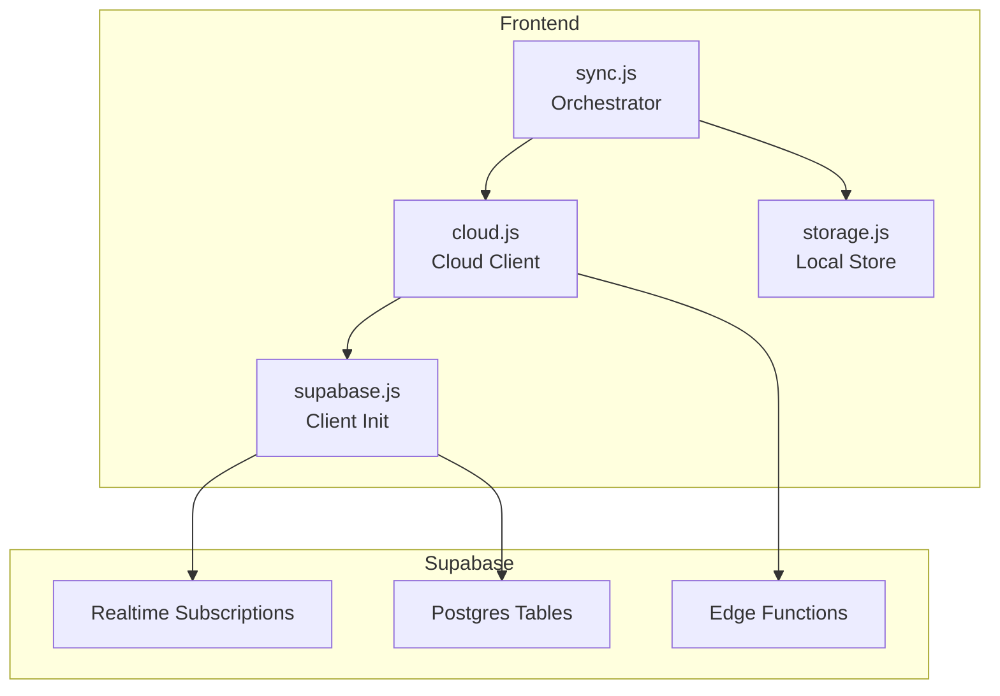
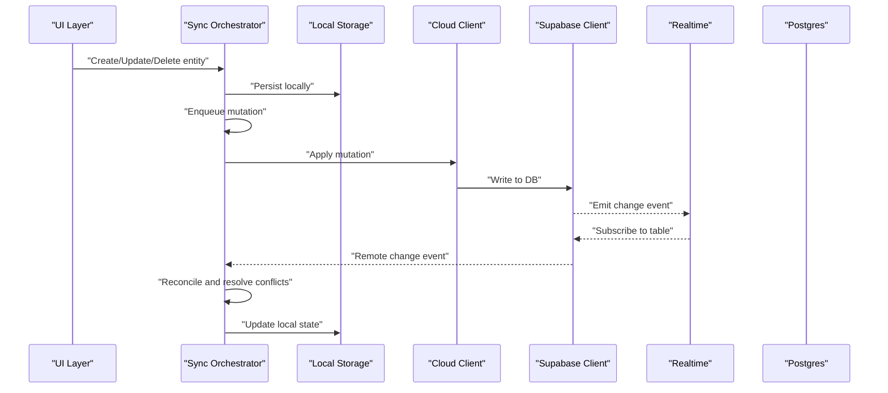
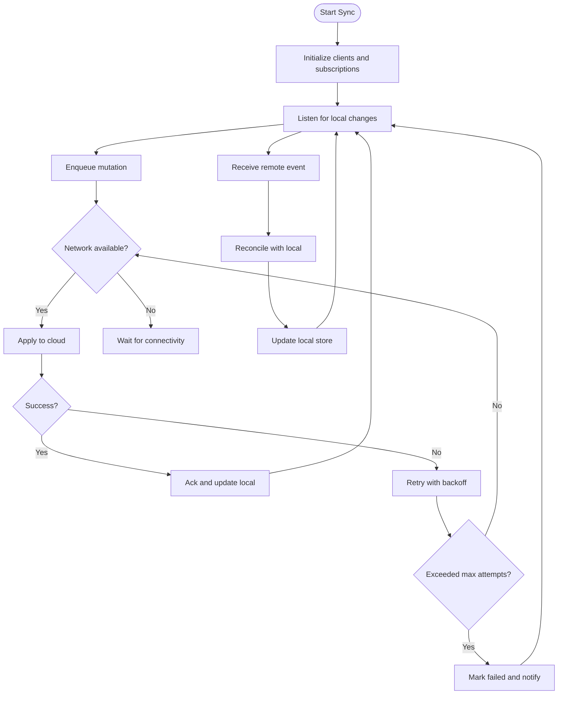
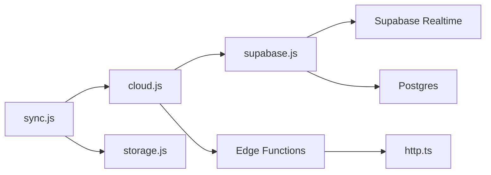

# Cloud Synchronization

<cite>
**Referenced Files in This Document**
- [src/lib/sync.js](file://src/lib/sync.js)
- [src/lib/cloud.js](file://src/lib/cloud.js)
- [src/lib/supabase.js](file://src/lib/supabase.js)
- [src/lib/storage.js](file://src/lib/storage.js)
- [supabase/migrations/001_schema.sql](file://supabase/migrations/001_schema.sql)
- [supabase/functions/_shared/http.ts](file://supabase/functions/_shared/http.ts)
</cite>

## Table of Contents
1. [Introduction](#introduction)
2. [Project Structure](#project-structure)
3. [Core Components](#core-components)
4. [Architecture Overview](#architecture-overview)
5. [Detailed Component Analysis](#detailed-component-analysis)
6. [Dependency Analysis](#dependency-analysis)
7. [Performance Considerations](#performance-considerations)
8. [Troubleshooting Guide](#troubleshooting-guide)
9. [Conclusion](#conclusion)

## Introduction
This document explains the cloud synchronization features in ApplyGuard PH with a focus on real-time sync using Supabase subscriptions, conflict resolution strategies, and data consistency guarantees. It covers sync triggers, batch operations, incremental updates, offline-first behavior, queue management for failed operations, automatic retry logic, data transformation pipelines between local and cloud formats, field mappings, validation rules, troubleshooting techniques, and performance optimization strategies for large datasets.

## Project Structure
The synchronization layer is implemented primarily under src/lib with supporting Supabase configuration and schema definitions:
- Sync orchestration and state machine: src/lib/sync.js
- Cloud API client and helpers: src/lib/cloud.js
- Supabase client initialization and utilities: src/lib/supabase.js
- Local storage abstraction (offline-first): src/lib/storage.js
- Database schema and RLS policies: supabase/migrations/001_schema.sql
- Shared HTTP helper for serverless functions: supabase/functions/_shared/http.ts

**Diagram sources**
- [src/lib/sync.js](file://src/lib/sync.js)
- [src/lib/cloud.js](file://src/lib/cloud.js)
- [src/lib/supabase.js](file://src/lib/supabase.js)
- [src/lib/storage.js](file://src/lib/storage.js)
- [supabase/migrations/001_schema.sql](file://supabase/migrations/001_schema.sql)
- [supabase/functions/_shared/http.ts](file://supabase/functions/_shared/http.ts)

**Section sources**
- [src/lib/sync.js](file://src/lib/sync.js)
- [src/lib/cloud.js](file://src/lib/cloud.js)
- [src/lib/supabase.js](file://src/lib/supabase.js)
- [src/lib/storage.js](file://src/lib/storage.js)
- [supabase/migrations/001_schema.sql](file://supabase/migrations/001_schema.sql)
- [supabase/functions/_shared/http.ts](file://supabase/functions/_shared/http.ts)

## Core Components
- Sync Orchestrator: Coordinates lifecycle, manages queues, handles retries, and applies conflict resolution.
- Cloud Client: Encapsulates Supabase calls, batching, and error handling.
- Supabase Client: Initializes connection, configures realtime subscriptions, and exposes typed queries.
- Storage Abstraction: Provides an offline-first key-value store with change tracking and persistence.
- Schema and Policies: Defines tables, constraints, indexes, and row-level security to ensure consistency and access control.
- Shared HTTP Helper: Utility used by serverless functions for outbound requests.

Key responsibilities:
- Real-time event ingestion and reconciliation
- Incremental updates via timestamps or version fields
- Batched writes to reduce network overhead
- Queueing and retry with backoff for transient failures
- Conflict detection and deterministic resolution

**Section sources**
- [src/lib/sync.js](file://src/lib/sync.js)
- [src/lib/cloud.js](file://src/lib/cloud.js)
- [src/lib/supabase.js](file://src/lib/supabase.js)
- [src/lib/storage.js](file://src/lib/storage.js)
- [supabase/migrations/001_schema.sql](file://supabase/migrations/001_schema.sql)
- [supabase/functions/_shared/http.ts](file://supabase/functions/_shared/http.ts)

## Architecture Overview
The system follows an offline-first architecture with bidirectional sync over Supabase Realtime. The orchestrator maintains a local queue of pending mutations and reconciles changes from both local edits and remote events.

**Diagram sources**
- [src/lib/sync.js](file://src/lib/sync.js)
- [src/lib/cloud.js](file://src/lib/cloud.js)
- [src/lib/supabase.js](file://src/lib/supabase.js)
- [src/lib/storage.js](file://src/lib/storage.js)
- [supabase/migrations/001_schema.sql](file://supabase/migrations/001_schema.sql)

## Detailed Component Analysis

### Sync Orchestrator
Responsibilities:
- Manage sync lifecycle (start, stop, pause/resume)
- Maintain a queue of pending operations with metadata (id, type, payload, timestamp, attempts)
- Process queue items with exponential backoff and jitter
- Subscribe to Supabase Realtime channels per table/entity
- Reconcile incoming remote changes against local state
- Enforce idempotency and deduplicate operations
- Expose hooks/events for UI feedback

Key behaviors:
- Trigger mechanisms:
  - User actions trigger enqueue and immediate apply attempt
  - Network recovery triggers queue drain
  - Periodic reconciliation ensures drift correction
- Batch operations:
  - Coalesce multiple mutations within a time window into a single batch write
  - Preserve ordering within batches
- Incremental updates:
  - Use server-side timestamps or version fields to detect changes
  - Fetch only deltas when possible
- Conflict resolution:
  - Strategy selection based on entity type (e.g., last-writer-wins, merge-by-field, server-authoritative)
  - Deterministic tie-breakers (e.g., lexicographic ID comparison)
- Data consistency guarantees:
  - At-least-once delivery with idempotent keys
  - Transaction-like semantics via ordered processing and rollback on failure
  - Eventual consistency across devices

**Diagram sources**
- [src/lib/sync.js](file://src/lib/sync.js)

**Section sources**
- [src/lib/sync.js](file://src/lib/sync.js)

### Cloud Client
Responsibilities:
- Wrap Supabase client methods for reads/writes
- Implement batching for create/update/delete operations
- Normalize payloads and map to cloud schema
- Handle errors and translate to user-friendly messages
- Provide utilities for pagination and cursor-based fetching

Key behaviors:
- Batch writes:
  - Group mutations by table and operation type
  - Respect size limits and timeouts
- Error handling:
  - Distinguish transient vs permanent errors
  - Surface actionable diagnostics
- Field mapping:
  - Transform local model fields to cloud schema fields
  - Validate required fields before sending

**Section sources**
- [src/lib/cloud.js](file://src/lib/cloud.js)
- [src/lib/supabase.js](file://src/lib/supabase.js)

### Supabase Client
Responsibilities:
- Initialize Supabase instance with environment configuration
- Configure realtime subscriptions per table
- Provide typed query helpers
- Manage auth context and session handling

Key behaviors:
- Realtime subscriptions:
  - Filter by user or tenant scope
  - Handle reconnection and channel lifecycle
- Query helpers:
  - Support filtering, sorting, and pagination
  - Optimize for incremental fetches

**Section sources**
- [src/lib/supabase.js](file://src/lib/supabase.js)

### Storage Abstraction
Responsibilities:
- Provide a persistent key-value store for offline-first behavior
- Track change history and versions
- Support atomic transactions for multi-key updates
- Export/import snapshots for migration or backup

Key behaviors:
- Offline-first reads:
  - Serve from local store immediately
  - Optionally mark entries as stale until refreshed
- Change tracking:
  - Record timestamps and operation types
  - Enable delta computation for sync

**Section sources**
- [src/lib/storage.js](file://src/lib/storage.js)

### Schema and Policies
Responsibilities:
- Define tables, columns, constraints, and indexes
- Enforce row-level security policies for multi-user isolation
- Ensure referential integrity and data quality

Key considerations:
- Include server-side timestamps and version fields
- Add unique constraints to support idempotent upserts
- Index frequently queried fields for performance

**Section sources**
- [supabase/migrations/001_schema.sql](file://supabase/migrations/001_schema.sql)

### Shared HTTP Helper
Responsibilities:
- Provide common HTTP request utilities for serverless functions
- Standardize headers, error formatting, and logging

Usage:
- Used by edge functions that interact with external services during sync workflows

**Section sources**
- [supabase/functions/_shared/http.ts](file://supabase/functions/_shared/http.ts)

## Dependency Analysis
The following diagram shows how components depend on each other and on Supabase services.

**Diagram sources**
- [src/lib/sync.js](file://src/lib/sync.js)
- [src/lib/cloud.js](file://src/lib/cloud.js)
- [src/lib/supabase.js](file://src/lib/supabase.js)
- [src/lib/storage.js](file://src/lib/storage.js)
- [supabase/functions/_shared/http.ts](file://supabase/functions/_shared/http.ts)

**Section sources**
- [src/lib/sync.js](file://src/lib/sync.js)
- [src/lib/cloud.js](file://src/lib/cloud.js)
- [src/lib/supabase.js](file://src/lib/supabase.js)
- [src/lib/storage.js](file://src/lib/storage.js)
- [supabase/functions/_shared/http.ts](file://supabase/functions/_shared/http.ts)

## Performance Considerations
- Batch writes:
  - Coalesce mutations within short windows to reduce round trips
  - Limit batch sizes to avoid timeouts and memory pressure
- Incremental updates:
  - Use server timestamps/version fields to fetch only changed rows
  - Prefer cursor-based pagination for large result sets
- Indexing:
  - Add indexes on foreign keys, filters, and sort fields
  - Avoid over-indexing; monitor query plans
- Connection resilience:
  - Implement exponential backoff with jitter for retries
  - Use circuit breaker patterns for repeated failures
- Memory usage:
  - Stream large datasets instead of loading all at once
  - Clear processed queue entries promptly
- Realtime efficiency:
  - Subscribe only to relevant channels and filter by user/tenant
  - Debounce high-frequency events if necessary

[No sources needed since this section provides general guidance]

## Troubleshooting Guide
Common issues and resolutions:
- Realtime not receiving events:
  - Verify subscription channels and filters
  - Check network connectivity and firewall rules
  - Confirm RLS policies allow read access
- Conflicts not resolving:
  - Inspect conflict strategy and tie-breaker logic
  - Validate server timestamps and version fields
- Queue backlog:
  - Monitor queue length and retry counts
  - Increase batch size cautiously and tune backoff parameters
- Slow initial sync:
  - Use incremental fetch with cursors
  - Preload critical entities and lazy-load others
- Data inconsistencies:
  - Run reconciliation jobs periodically
  - Audit logs for out-of-order events

Debugging techniques:
- Enable detailed logging around enqueue, apply, and reconcile phases
- Snapshot local store state before and after reconciliation
- Instrument metrics for queue depth, retry rates, and latency
- Use Supabase dashboard to inspect realtime events and query performance

**Section sources**
- [src/lib/sync.js](file://src/lib/sync.js)
- [src/lib/cloud.js](file://src/lib/cloud.js)
- [src/lib/supabase.js](file://src/lib/supabase.js)
- [src/lib/storage.js](file://src/lib/storage.js)
- [supabase/migrations/001_schema.sql](file://supabase/migrations/001_schema.sql)

## Conclusion
ApplyGuard PH’s cloud synchronization leverages an offline-first design with robust queueing, batching, and incremental updates. Supabase Realtime enables near-real-time collaboration while maintaining data consistency through careful conflict resolution and idempotent operations. By tuning batch sizes, indexing strategically, and monitoring queue health, the system scales effectively even with large datasets.