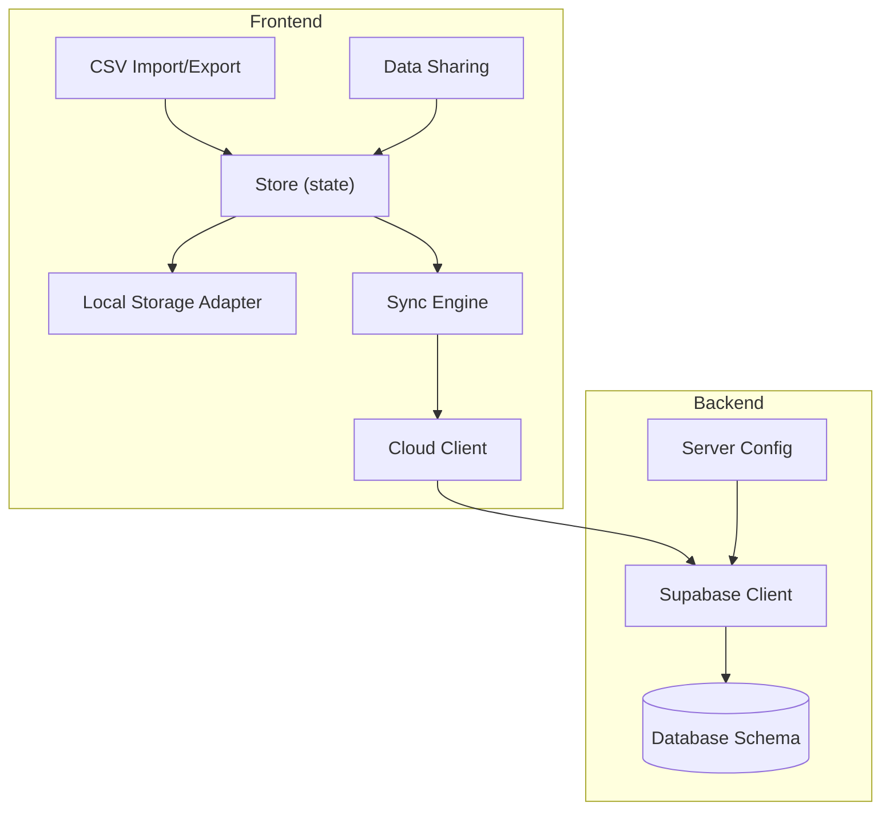
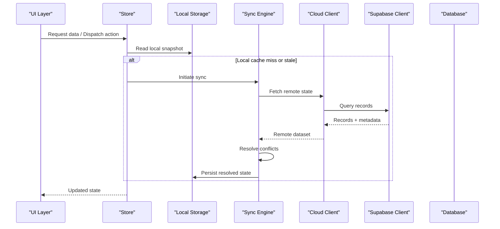
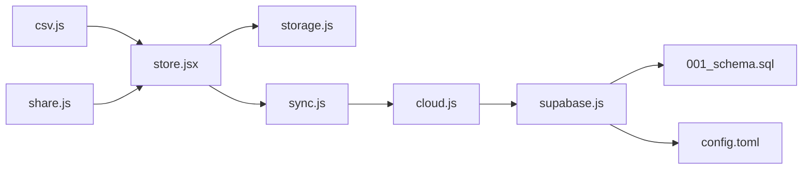
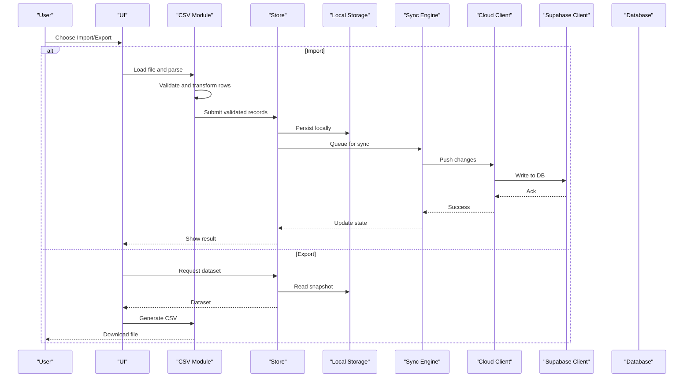

# Data Management

<cite>
**Referenced Files in This Document**
- [storage.js](file://src/lib/storage.js)
- [cloud.js](file://src/lib/cloud.js)
- [sync.js](file://src/lib/sync.js)
- [csv.js](file://src/lib/csv.js)
- [share.js](file://src/lib/share.js)
- [supabase.js](file://src/lib/supabase.js)
- [store.jsx](file://src/store.jsx)
- [001_schema.sql](file://supabase/migrations/001_schema.sql)
- [config.toml](file://supabase/config.toml)
</cite>

## Table of Contents
1. [Introduction](#introduction)
2. [Project Structure](#project-structure)
3. [Core Components](#core-components)
4. [Architecture Overview](#architecture-overview)
5. [Detailed Component Analysis](#detailed-component-analysis)
6. [Dependency Analysis](#dependency-analysis)
7. [Performance Considerations](#performance-considerations)
8. [Troubleshooting Guide](#troubleshooting-guide)
9. [Conclusion](#conclusion)
10. [Appendices](#appendices)

## Introduction
This document describes the data management system for ApplyGuard PH, focusing on local storage, cloud synchronization, conflict resolution, CSV import/export, data sharing, backup and restore, data models, validation rules, transformation pipelines, migration handling, version compatibility, integrity checks, and performance considerations for large datasets. It is intended for both technical and non-technical readers to understand how data flows through the application and how consistency and reliability are maintained across devices and sessions.

## Project Structure
The data management layer is implemented primarily under src/lib with supporting configuration and schema definitions under supabase. The key modules include:
- Local persistence and state orchestration
- Cloud client and sync engine
- CSV I/O utilities
- Sharing mechanisms
- Supabase client configuration
- Database schema and server-side configuration

**Diagram sources**
- [store.jsx](file://src/store.jsx)
- [storage.js](file://src/lib/storage.js)
- [sync.js](file://src/lib/sync.js)
- [cloud.js](file://src/lib/cloud.js)
- [csv.js](file://src/lib/csv.js)
- [share.js](file://src/lib/share.js)
- [supabase.js](file://src/lib/supabase.js)
- [001_schema.sql](file://supabase/migrations/001_schema.sql)
- [config.toml](file://supabase/config.toml)

**Section sources**
- [store.jsx](file://src/store.jsx)
- [storage.js](file://src/lib/storage.js)
- [sync.js](file://src/lib/sync.js)
- [cloud.js](file://src/lib/cloud.js)
- [csv.js](file://src/lib/csv.js)
- [share.js](file://src/lib/share.js)
- [supabase.js](file://src/lib/supabase.js)
- [001_schema.sql](file://supabase/migrations/001_schema.sql)
- [config.toml](file://supabase/config.toml)

## Core Components
- Local storage adapter: Provides a consistent interface for reading/writing application data to persistent storage, including serialization, deserialization, and error handling.
- Sync engine: Coordinates bidirectional synchronization between local state and remote cloud state, managing change detection, batching, and conflict resolution.
- Cloud client: Encapsulates communication with the backend via the Supabase client, handling authentication context, retries, and error mapping.
- CSV utilities: Implement parsing and generation of CSV files for import/export, including header normalization, type coercion, and validation.
- Sharing module: Enables exporting/importing subsets or full snapshots of data for collaboration or archival purposes.
- Supabase client: Centralized configuration for database access, including environment-based settings and connection options.
- Store: Application-level state container that orchestrates interactions among storage, sync, and UI updates.

**Section sources**
- [storage.js](file://src/lib/storage.js)
- [sync.js](file://src/lib/sync.js)
- [cloud.js](file://src/lib/cloud.js)
- [csv.js](file://src/lib/csv.js)
- [share.js](file://src/lib/share.js)
- [supabase.js](file://src/lib/supabase.js)
- [store.jsx](file://src/store.jsx)

## Architecture Overview
The data architecture follows a layered approach:
- Presentation layer consumes state from the store.
- Store coordinates operations across storage, sync, and external services.
- Sync engine mediates between local changes and remote state using the cloud client.
- Cloud client uses the Supabase client to interact with the database defined by migrations.

**Diagram sources**
- [store.jsx](file://src/store.jsx)
- [storage.js](file://src/lib/storage.js)
- [sync.js](file://src/lib/sync.js)
- [cloud.js](file://src/lib/cloud.js)
- [supabase.js](file://src/lib/supabase.js)
- [001_schema.sql](file://supabase/migrations/001_schema.sql)

## Detailed Component Analysis

### Local Storage Implementation
Responsibilities:
- Provide typed read/write operations for application entities.
- Serialize/deserialize data safely, handling versioning and schema evolution.
- Offer transaction-like semantics where possible to maintain consistency.
- Surface errors consistently for upstream handling.

Key behaviors:
- Version-aware storage keys and migration hooks.
- Defensive parsing with fallbacks to defaults on corruption.
- Optional compression or chunking strategies for large payloads.

Validation and integrity:
- Pre-write validation against expected schemas.
- Post-read verification with checksums or structural checks when applicable.

Optimization:
- Batched writes to reduce I/O overhead.
- Lazy loading of heavy datasets.

**Section sources**
- [storage.js](file://src/lib/storage.js)

### Cloud Synchronization Architecture
Responsibilities:
- Maintain eventual consistency between local and remote datasets.
- Detect and merge changes while preserving user intent.
- Handle network failures, partial responses, and rate limits.

Conflict resolution strategy:
- Field-level merging based on timestamps or explicit version vectors.
- Last-writer-wins for non-collaborative fields; manual resolution prompts for conflicting edits.
- De-duplication by stable identifiers.

Operational flow:
- Change tracking at the store level.
- Incremental sync with delta uploads.
- Conflict detection and resolution pipeline before persisting merged results.

**Section sources**
- [sync.js](file://src/lib/sync.js)
- [cloud.js](file://src/lib/cloud.js)

### CSV Import/Export Functionality
Import pipeline:
- Parse raw CSV into structured rows.
- Normalize headers and map to internal data model.
- Validate each row and collect errors without aborting the entire batch.
- Transform values (e.g., dates, booleans) according to schema.
- Upsert into local store and optionally push to cloud.

Export pipeline:
- Select subset or full dataset.
- Serialize to CSV with deterministic ordering and consistent formatting.
- Provide download triggers and progress feedback.

Error handling:
- Row-level error reporting with line numbers and field names.
- Partial success semantics with rollback or quarantine for invalid rows.

**Section sources**
- [csv.js](file://src/lib/csv.js)

### Data Sharing Mechanisms
Capabilities:
- Export a shareable snapshot (CSV or compact format).
- Import shared data into another instance with conflict checks.
- Support selective sharing of specific entities or filtered views.

Security and privacy:
- Optional encryption for exported artifacts.
- Clear guidance on sensitive data exposure during sharing.

**Section sources**
- [share.js](file://src/lib/share.js)

### Backup and Restore Procedures
Backup:
- Full export of local state to a portable artifact.
- Incremental backups keyed by timestamps or version IDs.

Restore:
- Validate artifact integrity before applying.
- Merge or replace existing data based on policy.
- Rollback plan if restore fails mid-way.

**Section sources**
- [share.js](file://src/lib/share.js)
- [csv.js](file://src/lib/csv.js)

### Data Models, Validation Rules, and Transformation Pipelines
Data models:
- Entities defined by the database schema and mirrored in the frontend store.
- Stable identifiers used for cross-device reconciliation.

Validation rules:
- Required fields, types, ranges, and referential constraints enforced locally and on the server.
- Custom business rules applied during import and sync merges.

Transformation pipelines:
- Normalize inputs (e.g., trimming, casing).
- Coerce types and compute derived fields.
- Enrich data with computed attributes prior to persistence.

**Section sources**
- [001_schema.sql](file://supabase/migrations/001_schema.sql)
- [csv.js](file://src/lib/csv.js)
- [store.jsx](file://src/store.jsx)

### Data Migration Handling, Version Compatibility, and Integrity Checks
Migration handling:
- Versioned storage keys and migration functions executed on startup.
- Backward-compatible reads with graceful degradation.

Version compatibility:
- Feature flags and schema versions gate new behavior.
- Safe rollouts with opt-out paths for corrupted states.

Integrity checks:
- Structural validation after load.
- Cross-entity consistency checks (e.g., foreign key references).
- Checksums for critical artifacts.

**Section sources**
- [storage.js](file://src/lib/storage.js)
- [001_schema.sql](file://supabase/migrations/001_schema.sql)

### Supabase Integration
Responsibilities:
- Centralized client configuration and environment setup.
- Authentication context propagation and session management.
- Typed queries and mutations aligned with the database schema.

Configuration:
- Endpoint URLs, project identifiers, and feature toggles managed via configuration.

**Section sources**
- [supabase.js](file://src/lib/supabase.js)
- [config.toml](file://supabase/config.toml)

## Dependency Analysis
The following diagram shows core dependencies among data management modules:

**Diagram sources**
- [store.jsx](file://src/store.jsx)
- [storage.js](file://src/lib/storage.js)
- [sync.js](file://src/lib/sync.js)
- [cloud.js](file://src/lib/cloud.js)
- [supabase.js](file://src/lib/supabase.js)
- [csv.js](file://src/lib/csv.js)
- [share.js](file://src/lib/share.js)
- [001_schema.sql](file://supabase/migrations/001_schema.sql)
- [config.toml](file://supabase/config.toml)

**Section sources**
- [store.jsx](file://src/store.jsx)
- [storage.js](file://src/lib/storage.js)
- [sync.js](file://src/lib/sync.js)
- [cloud.js](file://src/lib/cloud.js)
- [supabase.js](file://src/lib/supabase.js)
- [csv.js](file://src/lib/csv.js)
- [share.js](file://src/lib/share.js)
- [001_schema.sql](file://supabase/migrations/001_schema.sql)
- [config.toml](file://supabase/config.toml)

## Performance Considerations
- Local storage:
  - Use batched writes and avoid frequent small updates.
  - Employ lazy loading and pagination for large lists.
  - Compress or partition large datasets if supported by the storage adapter.
- Sync:
  - Prefer incremental deltas over full resyncs.
  - Debounce rapid successive changes to coalesce sync requests.
  - Implement retry with exponential backoff and circuit breakers for unstable networks.
- CSV:
  - Stream processing for very large imports/exports to minimize memory usage.
  - Pre-validate and normalize headers to reduce reprocessing.
- Database:
  - Leverage indexes defined in the schema for common query patterns.
  - Use server-side filtering and projection to reduce payload sizes.

[No sources needed since this section provides general guidance]

## Troubleshooting Guide
Common issues and resolutions:
- Corrupted local state:
  - Trigger integrity checks and rebuild from last known good snapshot.
  - Reset to defaults for specific entities if necessary.
- Sync conflicts:
  - Review conflict logs and apply recommended resolution policies.
  - Force refresh from remote when local state is unreliable.
- CSV import failures:
  - Inspect row-level error reports and correct malformed entries.
  - Ensure header mappings match the current schema version.
- Network errors:
  - Verify Supabase configuration and credentials.
  - Retry failed operations with backoff and monitor rate limits.

**Section sources**
- [storage.js](file://src/lib/storage.js)
- [sync.js](file://src/lib/sync.js)
- [csv.js](file://src/lib/csv.js)
- [supabase.js](file://src/lib/supabase.js)

## Conclusion
ApplyGuard PH’s data management system combines robust local persistence, reliable cloud synchronization, and flexible import/export capabilities. By enforcing clear validation rules, implementing thoughtful conflict resolution, and providing migration and integrity safeguards, the system ensures data consistency and resilience across devices and sessions. Performance-oriented practices such as batching, streaming, and indexing further support scalability for large datasets.

[No sources needed since this section summarizes without analyzing specific files]

## Appendices

### Data Flow Sequence for Import/Export

**Diagram sources**
- [csv.js](file://src/lib/csv.js)
- [store.jsx](file://src/store.jsx)
- [storage.js](file://src/lib/storage.js)
- [sync.js](file://src/lib/sync.js)
- [cloud.js](file://src/lib/cloud.js)
- [supabase.js](file://src/lib/supabase.js)
- [001_schema.sql](file://supabase/migrations/001_schema.sql)