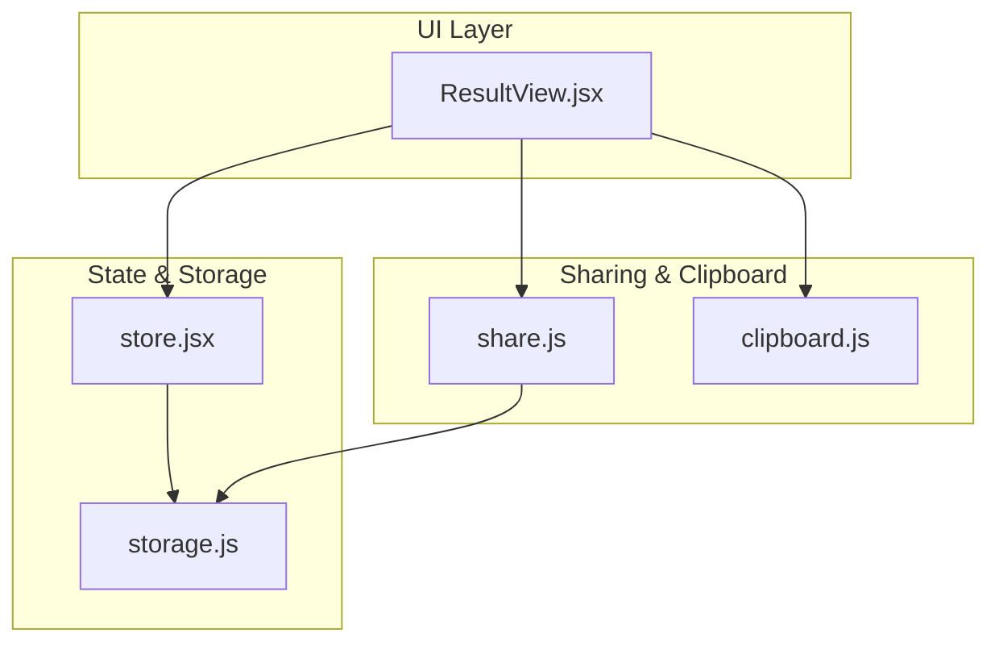
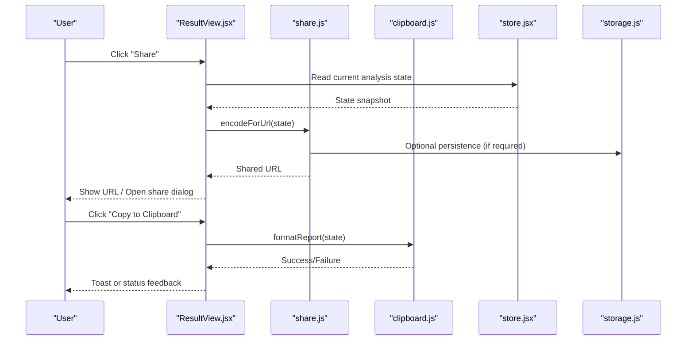
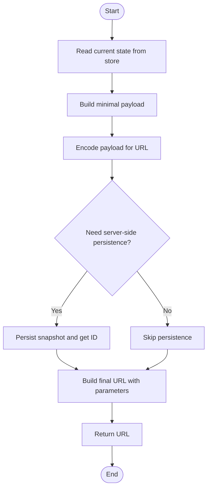
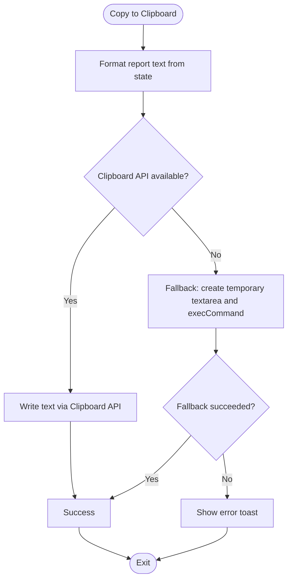
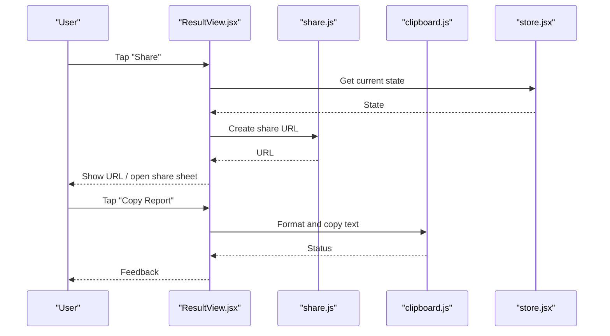
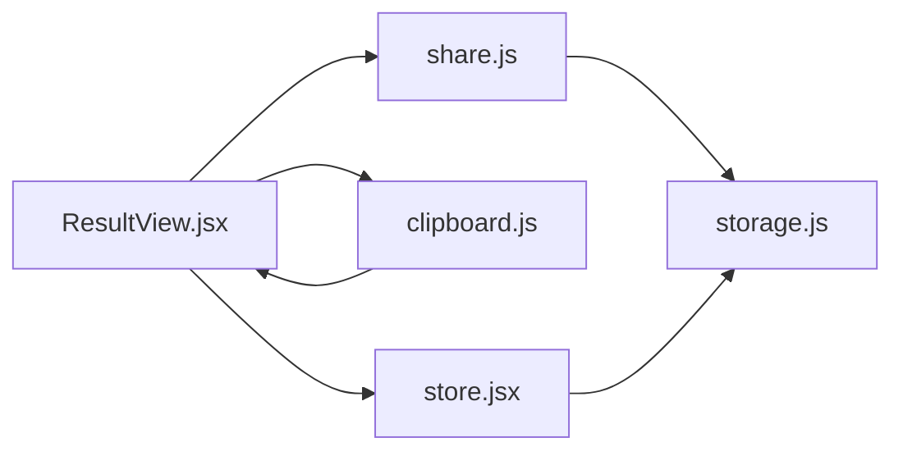

# Data Sharing & Clipboard

<cite>
**Referenced Files in This Document**
- [share.js](file://src/lib/share.js)
- [share.test.js](file://src/lib/share.test.js)
- [clipboard.js](file://src/lib/clipboard.js)
- [ResultView.jsx](file://src/components/ResultView.jsx)
- [store.jsx](file://src/store.jsx)
- [storage.js](file://src/lib/storage.js)
</cite>

## Table of Contents
1. [Introduction](#introduction)
2. [Project Structure](#project-structure)
3. [Core Components](#core-components)
4. [Architecture Overview](#architecture-overview)
5. [Detailed Component Analysis](#detailed-component-analysis)
6. [Dependency Analysis](#dependency-analysis)
7. [Performance Considerations](#performance-considerations)
8. [Troubleshooting Guide](#troubleshooting-guide)
9. [Conclusion](#conclusion)
10. [Appendices](#appendices)

## Introduction
This document explains how ApplyGuard PH shares application data and integrates with the system clipboard. It covers:
- How to share a view via URL
- How to copy results to the clipboard
- How to generate shareable reports
- URL structure for shared views
- Data encoding/decoding processes
- Access controls and security considerations
- Expiration policies and privacy controls
- Cross-platform compatibility patterns
- Examples of sharing workflows and integration with external applications

## Project Structure
The sharing and clipboard features are implemented as small, focused modules under src/lib and integrated into the UI through components and state management.

**Diagram sources**
- [ResultView.jsx](file://src/components/ResultView.jsx)
- [store.jsx](file://src/store.jsx)
- [storage.js](file://src/lib/storage.js)
- [share.js](file://src/lib/share.js)
- [clipboard.js](file://src/lib/clipboard.js)

**Section sources**
- [ResultView.jsx](file://src/components/ResultView.jsx)
- [store.jsx](file://src/store.jsx)
- [storage.js](file://src/lib/storage.js)
- [share.js](file://src/lib/share.js)
- [clipboard.js](file://src/lib/clipboard.js)

## Core Components
- Share module (URL-based sharing): Encodes current analysis/view state into a compact representation suitable for URLs and decodes incoming shared links to restore the view.
- Clipboard module: Provides cross-platform helpers to write formatted text to the system clipboard and read from it when needed.
- ResultView component: Orchestrates user actions such as “Share” and “Copy to Clipboard,” invoking the appropriate modules.
- Store and storage utilities: Provide access to the current analysis state and persistence mechanisms used by sharing flows.

Key responsibilities:
- share.js: URL generation, decoding, validation, and optional expiration handling.
- clipboard.js: Clipboard API usage, fallbacks, and formatting for human-readable outputs.
- ResultView.jsx: UI triggers and feedback for sharing/copying actions.
- store.jsx and storage.js: State access and persistence that feed into share payloads.

**Section sources**
- [share.js](file://src/lib/share.js)
- [clipboard.js](file://src/lib/clipboard.js)
- [ResultView.jsx](file://src/components/ResultView.jsx)
- [store.jsx](file://src/store.jsx)
- [storage.js](file://src/lib/storage.js)

## Architecture Overview
The sharing architecture separates concerns between UI interactions, state serialization, and platform integrations.

**Diagram sources**
- [ResultView.jsx](file://src/components/ResultView.jsx)
- [share.js](file://src/lib/share.js)
- [clipboard.js](file://src/lib/clipboard.js)
- [store.jsx](file://src/store.jsx)
- [storage.js](file://src/lib/storage.js)

## Detailed Component Analysis

### Share Module (URL-Based Sharing)
Responsibilities:
- Encode the current view/state into a URL-safe payload
- Decode incoming shared URLs to reconstruct the view
- Validate inputs and handle malformed or expired links
- Optionally persist shared snapshots for longer-lived sharing

**Diagram sources**
- [share.js](file://src/lib/share.js)
- [store.jsx](file://src/store.jsx)
- [storage.js](file://src/lib/storage.js)

Security and privacy considerations:
- Avoid including sensitive fields in URL payloads; sanitize or omit PII before encoding.
- If using server-side persistence, enforce access controls and short expiration windows.
- Validate and normalize decoded payloads to prevent injection or unexpected behavior.

Expiration policy guidance:
- Prefer short TTL for shared snapshots stored on the server.
- For client-only sharing (no persistence), rely on URL length limits and browser behavior.

**Section sources**
- [share.js](file://src/lib/share.js)
- [share.test.js](file://src/lib/share.test.js)
- [store.jsx](file://src/store.jsx)
- [storage.js](file://src/lib/storage.js)

### Clipboard Integration
Responsibilities:
- Generate formatted text for sharing (e.g., summary report)
- Write to the system clipboard using modern APIs with graceful fallbacks
- Handle errors and provide user feedback

Cross-platform notes:
- Use the modern Clipboard API where available.
- Provide a fallback path for older browsers or restricted contexts.
- Ensure text is plain or minimally formatted to maximize compatibility across apps.

**Diagram sources**
- [clipboard.js](file://src/lib/clipboard.js)
- [ResultView.jsx](file://src/components/ResultView.jsx)

**Section sources**
- [clipboard.js](file://src/lib/clipboard.js)
- [ResultView.jsx](file://src/components/ResultView.jsx)

### ResultView Integration
Responsibilities:
- Trigger share and copy actions based on user input
- Display success/error feedback via toasts or inline messages
- Coordinate with store to obtain the latest state for encoding/formatting

**Diagram sources**
- [ResultView.jsx](file://src/components/ResultView.jsx)
- [share.js](file://src/lib/share.js)
- [clipboard.js](file://src/lib/clipboard.js)
- [store.jsx](file://src/store.jsx)

**Section sources**
- [ResultView.jsx](file://src/components/ResultView.jsx)
- [store.jsx](file://src/store.jsx)

## Dependency Analysis
High-level dependencies among sharing-related modules:

Observations:
- Low coupling: share.js and clipboard.js are independent utilities invoked by the UI layer.
- State access is centralized via store.jsx, reducing duplication.
- Persistence is abstracted behind storage.js, enabling future changes without touching UI.

**Diagram sources**
- [ResultView.jsx](file://src/components/ResultView.jsx)
- [share.js](file://src/lib/share.js)
- [clipboard.js](file://src/lib/clipboard.js)
- [store.jsx](file://src/store.jsx)
- [storage.js](file://src/lib/storage.js)

**Section sources**
- [ResultView.jsx](file://src/components/ResultView.jsx)
- [share.js](file://src/lib/share.js)
- [clipboard.js](file://src/lib/clipboard.js)
- [store.jsx](file://src/store.jsx)
- [storage.js](file://src/lib/storage.js)

## Performance Considerations
- Keep URL payloads minimal to avoid truncation and improve load times.
- Defer heavy formatting until the user explicitly requests a copy action.
- Cache encoded payloads briefly if the same share operation is repeated frequently.
- Avoid synchronous clipboard operations on main thread in constrained environments; use async APIs where available.

[No sources needed since this section provides general guidance]

## Troubleshooting Guide
Common issues and resolutions:
- Clipboard permission denied:
  - Ensure the action is triggered by a user gesture.
  - Fall back to a temporary element approach if the Clipboard API is unavailable.
- Shared link not restoring state:
  - Verify payload schema and versioning; ensure backward-compatible decoding.
  - Check for missing or invalid parameters and log diagnostic details.
- Long URLs truncated:
  - Reduce payload size by excluding non-essential fields.
  - Consider server-side persistence with short-lived IDs for large datasets.
- Mobile-specific behaviors:
  - Some platforms restrict direct URL pasting; prefer native share sheets when available.

**Section sources**
- [share.test.js](file://src/lib/share.test.js)
- [clipboard.js](file://src/lib/clipboard.js)

## Conclusion
ApplyGuard PH’s sharing and clipboard features are modular and user-centric. The share module focuses on robust URL encoding/decoding and optional persistence with clear security boundaries, while the clipboard module ensures broad compatibility and reliable user feedback. Together with the UI orchestration in ResultView and state management in store.jsx and storage.js, these components enable safe, efficient, and cross-platform data sharing experiences.

[No sources needed since this section summarizes without analyzing specific files]

## Appendices

### URL Structure for Shared Views
- Base domain/path: Provided by the hosting environment.
- Query parameters:
  - v: Version of the payload schema
  - d: Encoded data payload (compact, URL-safe)
  - e: Optional expiration timestamp (server-side persisted only)
- Example pattern: https://app.example.com/share?v=1&d=<encoded>&e=<optional-expiry>

Notes:
- Do not include sensitive identifiers in the URL.
- Validate and sanitize all parameters on decode.

[No sources needed since this section provides general guidance]

### Security and Privacy Controls
- Minimize data in URLs; prefer server-side snapshots with short TTL for larger payloads.
- Enforce access controls on any persisted snapshots.
- Redact or hash sensitive fields before encoding.
- Log and monitor failed decode attempts for abuse detection.

[No sources needed since this section provides general guidance]

### Expiration Policies
- Client-only sharing: No server expiry; rely on URL length and browser behavior.
- Server-backed sharing: Set short TTL (e.g., minutes to hours) and auto-cleanup jobs.

[No sources needed since this section provides general guidance]

### External Application Integration
- Paste shared URL into another device’s browser to restore the view.
- Copy formatted report to clipboard and paste into email, chat, or documentation tools.
- On mobile, use the native share sheet to distribute the URL directly to messaging apps.

[No sources needed since this section provides general guidance]