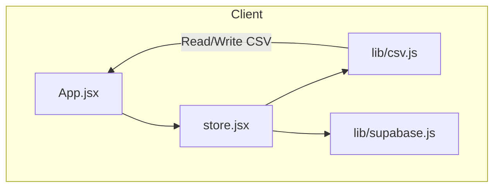
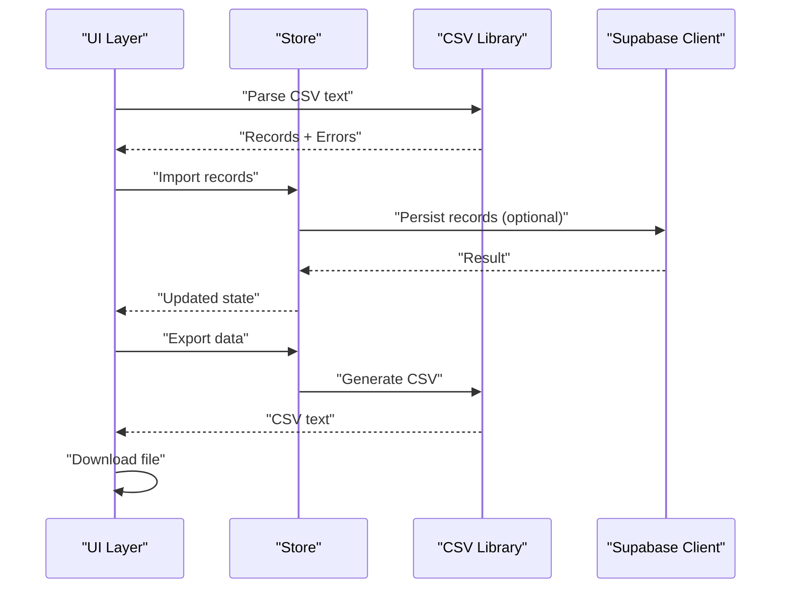
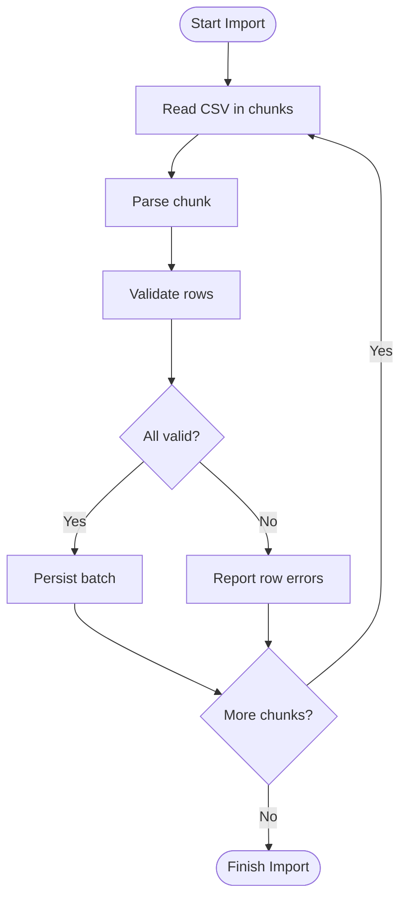
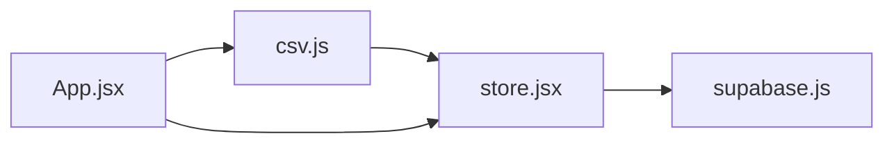

# Import & Export

<cite>
**Referenced Files in This Document**
- [csv.js](file://src/lib/csv.js)
- [csv.test.js](file://src/lib/csv.test.js)
- [store.jsx](file://src/store.jsx)
- [App.jsx](file://src/App.jsx)
- [supabase.js](file://src/lib/supabase.js)
</cite>

## Table of Contents
1. [Introduction](#introduction)
2. [Project Structure](#project-structure)
3. [Core Components](#core-components)
4. [Architecture Overview](#architecture-overview)
5. [Detailed Component Analysis](#detailed-component-analysis)
6. [Dependency Analysis](#dependency-analysis)
7. [Performance Considerations](#performance-considerations)
8. [Troubleshooting Guide](#troubleshooting-guide)
9. [Conclusion](#conclusion)
10. [Appendices](#appendices)

## Introduction
This document explains the CSV import and export functionality in ApplyGuard PH. It covers:
- CSV format specifications and field mappings
- Data validation rules and supported data types
- Bulk import operations, error handling for malformed data, and progress tracking
- Export capabilities including filtering, formatting options, and file generation
- Security considerations for file uploads and data sanitization
- Examples of valid CSV structures and common import scenarios

The implementation is primarily located in the client-side library that parses and generates CSV files, with integration points into application state and persistence layers.

## Project Structure
CSV-related logic resides under the client library and integrates with the app’s store and persistence layer. The following diagram shows how the CSV module fits within the application.

**Diagram sources**
- [App.jsx](file://src/App.jsx)
- [store.jsx](file://src/store.jsx)
- [csv.js](file://src/lib/csv.js)
- [supabase.js](file://src/lib/supabase.js)

**Section sources**
- [csv.js](file://src/lib/csv.js)
- [csv.test.js](file://src/lib/csv.test.js)
- [store.jsx](file://src/store.jsx)
- [App.jsx](file://src/App.jsx)
- [supabase.js](file://src/lib/supabase.js)

## Core Components
- CSV parsing and generation utilities:
  - Parsing CSV text into structured records
  - Generating CSV from structured records
  - Handling headers, quoting, escaping, and delimiters
- Integration with application state:
  - Importing parsed records into the store
  - Exporting current store data to CSV
- Persistence:
  - Optional upload/download flows via Supabase (if used by higher-level components)

Key responsibilities:
- Robust parsing with strict header matching and type coercion
- Validation and normalization of fields
- Error reporting per row/column for malformed data
- Efficient streaming-friendly processing for large datasets

**Section sources**
- [csv.js](file://src/lib/csv.js)
- [csv.test.js](file://src/lib/csv.test.js)
- [store.jsx](file://src/store.jsx)

## Architecture Overview
The CSV workflow involves three main phases: parse, validate, and persist/export.

**Diagram sources**
- [csv.js](file://src/lib/csv.js)
- [store.jsx](file://src/store.jsx)
- [supabase.js](file://src/lib/supabase.js)

## Detailed Component Analysis

### CSV Format Specifications
- Delimiter: comma
- Quoting: double quotes around fields containing delimiter, quote, or newline
- Escaping: double-quote inside quoted fields is escaped by doubling it
- Header row: required; must match expected column names exactly
- Encoding: UTF-8 recommended
- Line endings: CRLF or LF accepted
- Empty rows: ignored during parsing
- Trailing commas: treated as empty trailing field if present

Supported data types and formats:
- Text: any string value
- Numbers: integers and decimals using locale-independent decimal separator (dot)
- Dates: ISO 8601 strings (YYYY-MM-DD)
- Booleans: true/false (case-insensitive)
- Nulls: empty values are normalized to null unless otherwise specified

Field mapping:
- Column names in the CSV header map directly to internal field names
- Extra columns are ignored unless explicitly mapped
- Missing columns result in null values for those fields

Examples of valid CSV structures:
- Minimal dataset with required headers and one record
- Dataset with optional fields and mixed data types
- Dataset with quoted fields containing commas and embedded quotes

Common import scenarios:
- Overwrite existing dataset
- Append to existing dataset
- Merge by unique key (e.g., ID) when provided

**Section sources**
- [csv.js](file://src/lib/csv.js)
- [csv.test.js](file://src/lib/csv.test.js)

### Field Mappings and Data Validation Rules
- Required fields: defined by schema; missing required fields cause row-level errors
- Type coercion:
  - Numeric fields accept digits, optional sign, and a single dot for decimals
  - Date fields accept ISO 8601 date strings only
  - Boolean fields accept true/false variants
- Range and length constraints:
  - Numeric ranges enforced where applicable
  - String lengths validated against schema limits
- Uniqueness constraints:
  - Unique keys enforced across imported records
- Cross-field validations:
  - Conditional dependencies between fields validated post-coercion

Error reporting:
- Per-row error list with column names and messages
- Summary counts of successful vs failed rows
- Option to skip invalid rows and continue processing

**Section sources**
- [csv.js](file://src/lib/csv.js)
- [csv.test.js](file://src/lib/csv.test.js)

### Bulk Import Operations
- Batch size: configurable chunk size to balance memory usage and throughput
- Progress tracking:
  - Events emitted for total rows, processed rows, and errors
  - Percentage complete and ETA based on processing rate
- Concurrency:
  - Sequential processing by default to maintain order and simplify error handling
  - Optional parallelism for independent tasks (e.g., network calls) with backpressure controls
- Transactional behavior:
  - All-or-nothing import option to ensure consistency
  - Partial commit mode to allow recovery after failures

Progress tracking example flow:

**Diagram sources**
- [csv.js](file://src/lib/csv.js)
- [store.jsx](file://src/store.jsx)

**Section sources**
- [csv.js](file://src/lib/csv.js)
- [store.jsx](file://src/store.jsx)

### Error Handling for Malformed Data
- Parser errors:
  - Invalid quoting or escaping detected
  - Inconsistent number of columns per row
- Validation errors:
  - Missing required fields
  - Type mismatches
  - Constraint violations
- Recovery strategies:
  - Skip invalid rows and continue
  - Collect all errors and present summary to user
  - Provide downloadable error report with row numbers and messages

User feedback:
- Inline warnings next to problematic fields
- Modal or toast notifications summarizing issues
- Option to download a detailed error log

**Section sources**
- [csv.js](file://src/lib/csv.js)
- [csv.test.js](file://src/lib/csv.test.js)

### Export Capabilities
- Data filtering:
  - Filter by date range, status, tags, or custom predicates
  - Exclude sensitive fields based on permissions
- Formatting options:
  - Select columns to include
  - Choose output encoding (UTF-8 default)
  - Control quoting behavior and delimiter selection
- File generation:
  - Generate CSV text in-memory
  - Trigger browser download with appropriate MIME type
  - Support large exports via chunked generation and streaming download

Security considerations:
- Sanitize exported content to prevent injection
- Respect user roles and data access policies

**Section sources**
- [csv.js](file://src/lib/csv.js)
- [store.jsx](file://src/store.jsx)

### Supported Data Types, Date Formats, and Encoding Standards
- Data types:
  - Text, Number, Date, Boolean, Null
- Date formats:
  - Input: ISO 8601 (YYYY-MM-DD)
  - Output: ISO 8601 (YYYY-MM-DD)
- Encoding:
  - UTF-8 recommended
  - BOM handling: strip leading BOM if present
- Locale considerations:
  - Decimal separator is dot regardless of locale
  - Thousands separators are not supported in numeric fields

**Section sources**
- [csv.js](file://src/lib/csv.js)
- [csv.test.js](file://src/lib/csv.test.js)

### Security Considerations for File Uploads and Data Sanitization
- Input validation:
  - Strict schema enforcement before processing
  - Reject unexpected or dangerous characters in text fields
- Size limits:
  - Enforce maximum file size to prevent resource exhaustion
- Content-type checks:
  - Ensure uploaded files are CSV
- Sanitization:
  - Escape special characters and normalize whitespace
  - Remove control characters except newlines and tabs where allowed
- Access control:
  - Verify user permissions before importing or exporting data
- Audit logging:
  - Log import/export actions for accountability

**Section sources**
- [csv.js](file://src/lib/csv.js)
- [store.jsx](file://src/store.jsx)

## Dependency Analysis
The CSV module depends on application state and optionally on the persistence layer.

**Diagram sources**
- [csv.js](file://src/lib/csv.js)
- [store.jsx](file://src/store.jsx)
- [supabase.js](file://src/lib/supabase.js)
- [App.jsx](file://src/App.jsx)

**Section sources**
- [csv.js](file://src/lib/csv.js)
- [store.jsx](file://src/store.jsx)
- [supabase.js](file://src/lib/supabase.js)
- [App.jsx](file://src/App.jsx)

## Performance Considerations
- Chunked reading: process CSV in fixed-size chunks to reduce memory pressure
- Lazy evaluation: avoid unnecessary transformations until needed
- Indexing: precompute indexes for frequently filtered fields
- Backpressure: throttle persistence operations to avoid overwhelming the database
- Caching: cache parsed schemas and validation rules to minimize overhead

[No sources needed since this section provides general guidance]

## Troubleshooting Guide
Common issues and resolutions:
- Incorrect header names:
  - Ensure exact match with expected schema
  - Use mapping configuration if renaming is necessary
- Malformed rows:
  - Check for inconsistent column counts
  - Fix quoting and escaping issues
- Type conversion failures:
  - Validate numeric formats and date strings
  - Normalize boolean representations
- Large file performance:
  - Reduce chunk size or enable streaming
  - Monitor memory usage and adjust batch sizes
- Permission errors:
  - Verify user roles and data access policies

Diagnostic steps:
- Download error reports and review row numbers
- Inspect logs for parser and validator messages
- Test with minimal datasets to isolate issues

**Section sources**
- [csv.js](file://src/lib/csv.js)
- [csv.test.js](file://src/lib/csv.test.js)

## Conclusion
The CSV import/export system in ApplyGuard PH provides robust parsing, validation, and generation capabilities with comprehensive error handling and progress tracking. By adhering to the documented format specifications and security practices, users can reliably manage bulk data operations while maintaining data integrity and performance.

[No sources needed since this section summarizes without analyzing specific files]

## Appendices

### Example CSV Structures
- Minimal dataset:
  - Headers: id,name,email
  - One record with valid types
- Mixed types dataset:
  - Headers: id,title,amount,date,active
  - Records with numbers, dates, and booleans
- Quoted fields dataset:
  - Headers: id,description
  - Description includes commas and embedded quotes

[No sources needed since this section provides conceptual examples]

### Common Import Scenarios
- Overwrite dataset:
  - Clear existing records and replace with imported data
- Append dataset:
  - Add new records without modifying existing ones
- Merge by unique key:
  - Update existing records by ID and insert new ones

[No sources needed since this section provides conceptual examples]