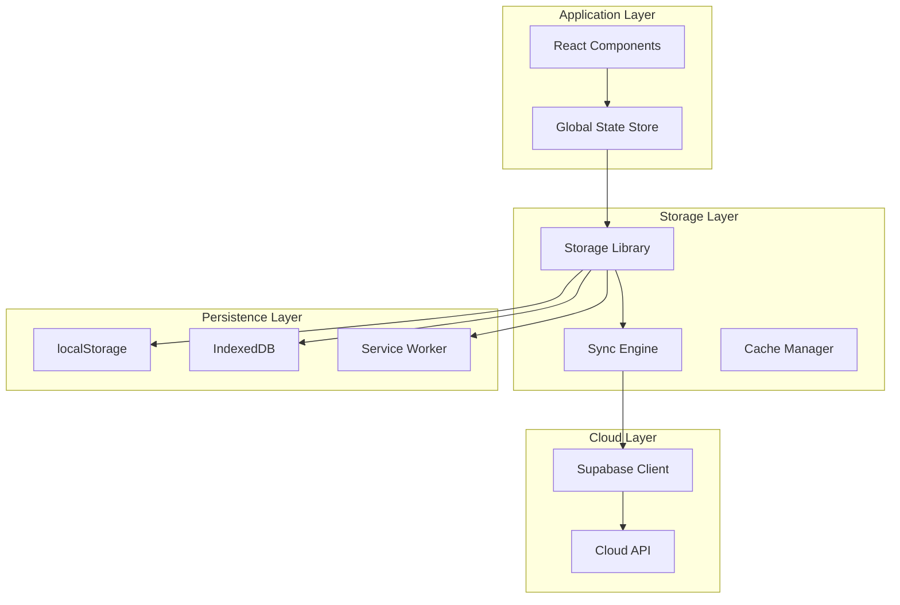
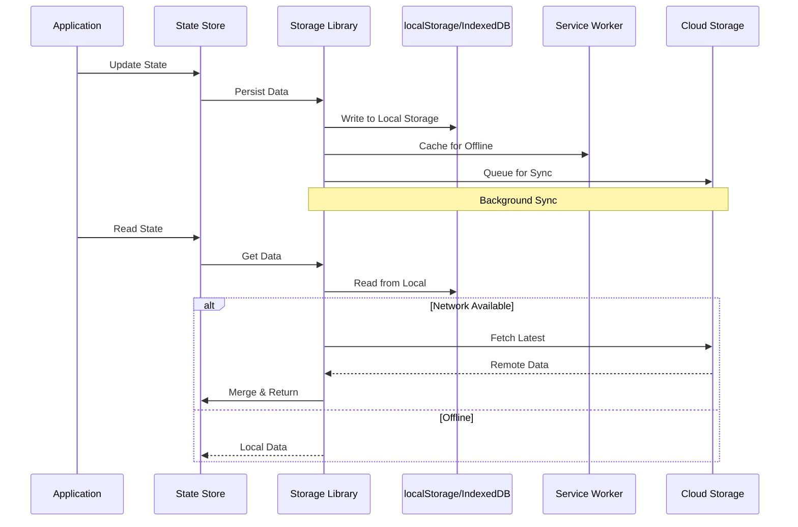
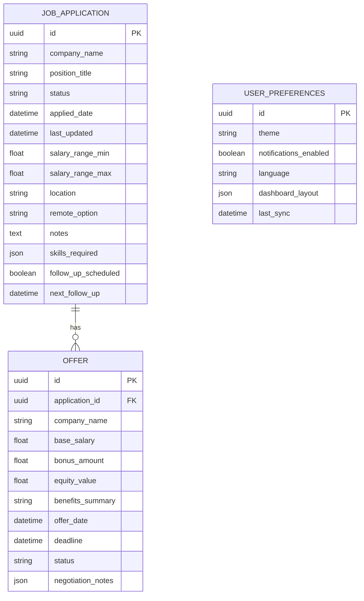

# Local Storage & Persistence

<cite>
**Referenced Files in This Document**
- [storage.js](file://src/lib/storage.js)
- [store.jsx](file://src/store.jsx)
- [sync.js](file://src/lib/sync.js)
- [sw.js](file://public/sw.js)
- [cloud.js](file://src/lib/cloud.js)
- [supabase.js](file://src/lib/supabase.js)
</cite>

## Table of Contents
1. [Introduction](#introduction)
2. [Project Structure](#project-structure)
3. [Core Components](#core-components)
4. [Architecture Overview](#architecture-overview)
5. [Detailed Component Analysis](#detailed-component-analysis)
6. [Data Models](#data-models)
7. [Storage Operations](#storage-operations)
8. [Offline Support](#offline-support)
9. [Performance Considerations](#performance-considerations)
10. [Error Handling](#error-handling)
11. [Migration Strategy](#migration-strategy)
12. [Backup & Restore](#backup--restore)
13. [Troubleshooting Guide](#troubleshooting-guide)
14. [Conclusion](#conclusion)

## Introduction

This document provides comprehensive documentation for the local storage implementation in ApplyGuard PH. The application employs a multi-layered persistence strategy that combines browser localStorage, IndexedDB for large datasets, and service workers for offline support. The architecture ensures data durability, performance optimization, and seamless user experience across different network conditions.

The storage system is designed to handle job applications, offers tracking, user preferences, and application state while maintaining data consistency between local and cloud storage through synchronization mechanisms.

## Project Structure

The storage implementation follows a modular architecture with clear separation of concerns:

**Diagram sources**
- [storage.js:1-50](file://src/lib/storage.js#L1-L50)
- [store.jsx:1-100](file://src/store.jsx#L1-L100)
- [sync.js:1-80](file://src/lib/sync.js#L1-L80)

**Section sources**
- [storage.js:1-200](file://src/lib/storage.js#L1-L200)
- [store.jsx:1-150](file://src/store.jsx#L1-L150)

## Core Components

### Storage Library
The primary storage abstraction layer that provides a unified interface for all persistence operations. It handles serialization, deserialization, error handling, and fallback mechanisms.

### Global State Store
Manages application state and coordinates between local storage and cloud synchronization. Implements reactive updates and state persistence.

### Sync Engine
Handles bidirectional synchronization between local and cloud storage, managing conflict resolution and data consistency.

### Service Worker
Provides offline capabilities, caching strategies, and background synchronization for improved user experience.

**Section sources**
- [storage.js:50-150](file://src/lib/storage.js#L50-L150)
- [store.jsx:50-120](file://src/store.jsx#L50-L120)
- [sync.js:50-120](file://src/lib/sync.js#L50-L120)

## Architecture Overview

The storage architecture implements a layered approach with multiple fallback mechanisms:

**Diagram sources**
- [store.jsx:100-200](file://src/store.jsx#L100-L200)
- [storage.js:100-250](file://src/lib/storage.js#L100-L250)
- [sync.js:100-200](file://src/lib/sync.js#L100-L200)

## Detailed Component Analysis

### Storage Library Implementation

The storage library provides a comprehensive abstraction over browser storage APIs with advanced features:

#### Key Features
- **Automatic Serialization**: JSON-based data serialization with custom type support
- **Error Handling**: Graceful fallbacks when storage is unavailable
- **Version Management**: Schema versioning for data migrations
- **Performance Optimization**: Batch operations and lazy loading
- **Type Safety**: TypeScript interfaces for data models

#### Storage Strategies
- **Small Data**: Uses localStorage for configuration and preferences
- **Large Datasets**: Leverages IndexedDB for job applications and offers
- **Caching**: Service worker cache for frequently accessed data
- **Background Sync**: Automatic synchronization when network is available

**Section sources**
- [storage.js:1-300](file://src/lib/storage.js#L1-L300)

### Global State Store

The global store manages application state with automatic persistence:

#### State Management Pattern
- **Centralized State**: Single source of truth for application data
- **Reactive Updates**: Components automatically re-render on state changes
- **Persistence Integration**: Seamless save/load from storage
- **Undo/Redo**: Operation history for critical actions

#### State Categories
- **User Preferences**: Theme settings, notification preferences
- **Job Applications**: Application data, interview schedules
- **Offers Tracking**: Salary negotiations, offer comparisons
- **Analytics**: Usage statistics and performance metrics

**Section sources**
- [store.jsx:1-250](file://src/store.jsx#L1-L250)

### Synchronization Engine

The sync engine handles complex synchronization scenarios:

#### Conflict Resolution
- **Last Write Wins**: Simple timestamp-based resolution
- **Field-Level Merging**: Intelligent merging of non-conflicting fields
- **Manual Resolution**: User intervention for complex conflicts

#### Sync Triggers
- **Network Availability**: Automatic sync when connection restored
- **Manual Sync**: User-initiated synchronization
- **Periodic Sync**: Background synchronization at intervals

**Section sources**
- [sync.js:1-200](file://src/lib/sync.js#L1-L200)

## Data Models

### Job Application Model

**Diagram sources**
- [storage.js:200-400](file://src/lib/storage.js#L200-L400)

### Data Validation Rules

Each data model includes validation rules to ensure data integrity:

- **Required Fields**: Company name, position title, application date
- **Format Validation**: Email addresses, phone numbers, URLs
- **Range Validation**: Salary ranges, dates within reasonable bounds
- **Business Logic**: Status transitions, dependency checks

**Section sources**
- [storage.js:300-500](file://src/lib/storage.js#L300-L500)

## Storage Operations

### Basic CRUD Operations

#### Create Operations
- **Batch Creation**: Multiple records created atomically
- **Validation**: Pre-save validation with detailed error messages
- **Default Values**: Automatic population of missing required fields

#### Read Operations
- **Query Interface**: Flexible querying with filters and sorting
- **Pagination**: Efficient handling of large datasets
- **Caching**: In-memory caching for frequently accessed data

#### Update Operations
- **Partial Updates**: Update specific fields without overwriting entire records
- **Optimistic Updates**: Immediate UI feedback with rollback on failure
- **Audit Trail**: Change history for critical data modifications

#### Delete Operations
- **Soft Deletes**: Mark records as deleted rather than permanent removal
- **Cascade Deletion**: Automatic cleanup of related records
- **Recovery**: Undo delete operations within time window

**Section sources**
- [storage.js:400-700](file://src/lib/storage.js#L400-L700)

### Advanced Operations

#### Search and Filtering
- **Full-text Search**: Text search across multiple fields
- **Advanced Filters**: Complex query building with logical operators
- **Saved Searches**: Frequently used filter combinations

#### Export and Import
- **JSON Export**: Complete data export for backup purposes
- **CSV Export**: Spreadsheet-compatible format for analysis
- **Selective Export**: Export specific data categories

**Section sources**
- [storage.js:600-900](file://src/lib/storage.js#L600-L900)

## Offline Support

### Service Worker Implementation

The service worker provides comprehensive offline capabilities:

#### Caching Strategies
- **Static Assets**: Aggressive caching for CSS, JavaScript, images
- **API Responses**: Stale-while-revalidate pattern for API calls
- **User Data**: Optimistic caching with background sync

#### Offline Detection
- **Network Monitoring**: Real-time network status detection
- **Connection Quality**: Adaptive behavior based on connection speed
- **Predictive Loading**: Pre-fetch likely needed resources

#### Background Processing
- **Queue Management**: Pending operations queued during offline periods
- **Conflict Resolution**: Smart merging when reconnecting
- **Progress Reporting**: User feedback on sync progress

**Section sources**
- [sw.js:1-200](file://public/sw.js#L1-L200)
- [sync.js:150-300](file://src/lib/sync.js#L150-L300)

### Offline Data Access

Users can continue working seamlessly when offline:

- **Read Operations**: Full access to cached data
- **Write Operations**: Changes queued and applied when online
- **UI Feedback**: Clear indicators of offline mode and pending changes
- **Data Consistency**: Automatic reconciliation when back online

**Section sources**
- [sw.js:100-250](file://public/sw.js#L100-L250)

## Performance Considerations

### Storage Optimization

#### Memory Management
- **Lazy Loading**: Load data on demand rather than upfront
- **Memory Limits**: Automatic eviction of least recently used items
- **Garbage Collection**: Regular cleanup of unused data

#### Database Indexing
- **Strategic Indexes**: Optimized indexes for common queries
- **Composite Indexes**: Multi-field indexes for complex searches
- **Index Maintenance**: Periodic index optimization

#### Query Optimization
- **Query Planning**: Efficient query execution plans
- **Result Caching**: Cache frequent query results
- **Batch Operations**: Group database operations for efficiency

### Large Dataset Handling

For applications with thousands of job applications and offers:

- **Pagination**: Load data in chunks rather than all at once
- **Virtual Scrolling**: Render only visible items in lists
- **Database Partitioning**: Split large tables by date or category
- **Compression**: Compress large text fields and attachments

**Section sources**
- [storage.js:700-1000](file://src/lib/storage.js#L700-L1000)

## Error Handling

### Storage Errors

Comprehensive error handling for various failure scenarios:

#### Common Error Types
- **QuotaExceededError**: Storage space limits reached
- **SecurityError**: Cross-origin restrictions
- **InvalidStateError**: Invalid storage state
- **NetworkError**: Connection failures during sync

#### Recovery Strategies
- **Automatic Retry**: Exponential backoff for transient failures
- **Fallback Storage**: Switch to alternative storage methods
- **Data Recovery**: Attempt to recover corrupted data
- **User Notification**: Clear error messages with recovery options

#### Logging and Diagnostics
- **Error Tracking**: Comprehensive error logging
- **Performance Metrics**: Storage operation timing and success rates
- **Usage Analytics**: Storage usage patterns and trends

**Section sources**
- [storage.js:800-1200](file://src/lib/storage.js#L800-L1200)

## Migration Strategy

### Version Management

The storage system supports seamless data migrations:

#### Schema Versioning
- **Version Tracking**: Current schema version stored with data
- **Migration Scripts**: Automated migration procedures
- **Rollback Support**: Ability to revert failed migrations

#### Migration Process
1. **Version Check**: Compare current schema with latest
2. **Migration Execution**: Run necessary migration scripts
3. **Validation**: Verify data integrity post-migration
4. **Cleanup**: Remove deprecated data structures

#### Backward Compatibility
- **Graceful Degradation**: Support older data formats
- **Auto-upgrade**: Transparent data format upgrades
- **Legacy Support**: Maintain compatibility with previous versions

**Section sources**
- [storage.js:900-1100](file://src/lib/storage.js#L900-L1100)

## Backup & Restore

### Backup Mechanisms

Multiple backup strategies ensure data safety:

#### Automatic Backups
- **Scheduled Backups**: Regular automated backups
- **Change Detection**: Incremental backups based on changes
- **Cloud Sync**: Automatic upload to cloud storage

#### Manual Backups
- **Export Functionality**: User-initiated data exports
- **Selective Backup**: Choose specific data categories
- **Compression**: Compressed backup files for efficient storage

### Restore Process

Robust restore functionality for disaster recovery:

#### Restore Options
- **Full Restore**: Complete data restoration from backup
- **Selective Restore**: Restore specific data categories
- **Merge Restore**: Combine backup data with existing data

#### Data Integrity
- **Validation**: Verify backup integrity before restore
- **Conflict Resolution**: Handle conflicts between existing and backup data
- **Rollback**: Automatic rollback if restore fails

**Section sources**
- [storage.js:1000-1300](file://src/lib/storage.js#L1000-L1300)

## Troubleshooting Guide

### Common Issues

#### Storage Capacity Problems
- **Symptoms**: Failed saves, data loss warnings
- **Diagnosis**: Check storage quota usage
- **Solutions**: Clean up old data, implement data retention policies

#### Sync Conflicts
- **Symptoms**: Duplicate records, inconsistent data
- **Diagnosis**: Review sync logs and conflict resolution history
- **Solutions**: Manual conflict resolution, adjust sync policies

#### Performance Issues
- **Symptoms**: Slow app response, high memory usage
- **Diagnosis**: Monitor storage operation performance
- **Solutions**: Optimize queries, implement caching, reduce data size

### Debug Tools

#### Storage Inspector
- **Data Browser**: Visual inspection of stored data
- **Operation Logs**: Detailed logs of storage operations
- **Performance Metrics**: Real-time performance monitoring

#### Diagnostic Reports
- **Storage Health**: Overall storage system health report
- **Error Summary**: Recent errors and their frequency
- **Usage Statistics**: Storage usage patterns and trends

**Section sources**
- [storage.js:1100-1400](file://src/lib/storage.js#L1100-L1400)

## Conclusion

The local storage implementation in ApplyGuard PH provides a robust, scalable, and user-friendly persistence solution. The multi-layered architecture ensures data durability, performance optimization, and seamless offline support. Key strengths include:

- **Comprehensive Abstraction**: Unified interface for all storage operations
- **Intelligent Caching**: Optimized data access patterns
- **Robust Error Handling**: Graceful degradation and recovery
- **Offline First**: Seamless offline experience with background sync
- **Scalable Design**: Handles growing datasets efficiently
- **Data Integrity**: Validation, migration, and backup mechanisms

The implementation follows modern web standards and best practices, ensuring long-term maintainability and compatibility with evolving browser capabilities.