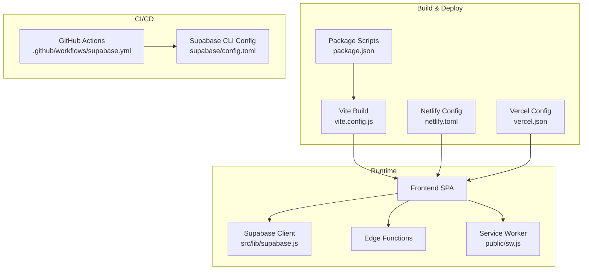
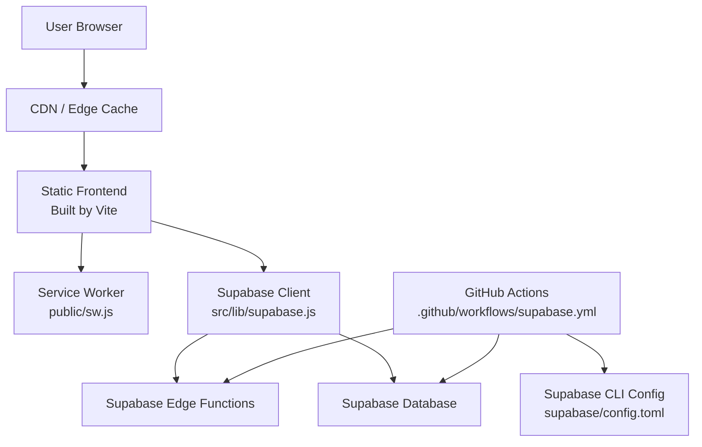
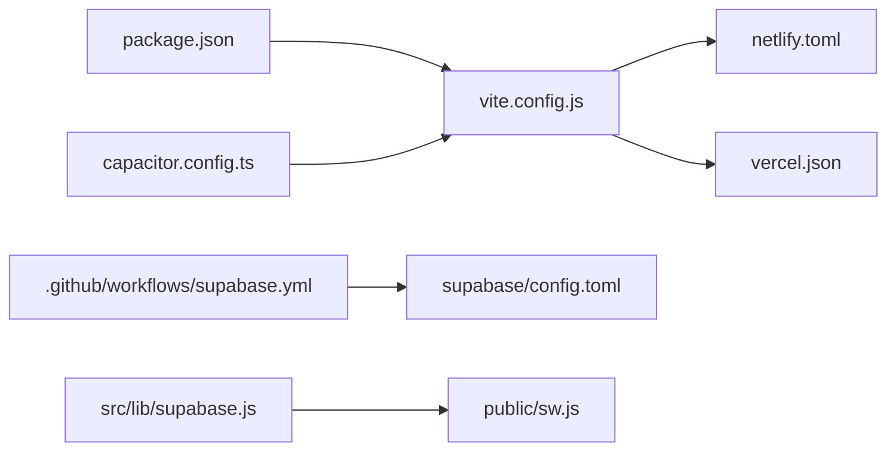

# Deployment & DevOps

<cite>
**Referenced Files in This Document**
- [netlify.toml](file://netlify.toml)
- [vercel.json](file://vercel.json)
- [vite.config.js](file://vite.config.js)
- [package.json](file://package.json)
- [.github/workflows/supabase.yml](file://.github/workflows/supabase.yml)
- [supabase/config.toml](file://supabase/config.toml)
- [src/lib/supabase.js](file://src/lib/supabase.js)
- [public/sw.js](file://public/sw.js)
- [capacitor.config.ts](file://capacitor.config.ts)
</cite>

## Table of Contents
1. [Introduction](#introduction)
2. [Project Structure](#project-structure)
3. [Core Components](#core-components)
4. [Architecture Overview](#architecture-overview)
5. [Detailed Component Analysis](#detailed-component-analysis)
6. [Dependency Analysis](#dependency-analysis)
7. [Performance Considerations](#performance-considerations)
8. [Troubleshooting Guide](#troubleshooting-guide)
9. [Conclusion](#conclusion)
10. [Appendices](#appendices)

## Introduction
This document provides comprehensive deployment and DevOps guidance for ApplyGuard PH across Netlify and Vercel, including CI/CD configuration, environment variable management, secrets handling, monitoring, logging, error tracking, rollback procedures, backup strategies, disaster recovery, performance monitoring, alerting thresholds, and maintenance procedures. It is intended for engineers, SREs, and operators who need to deploy, operate, and maintain the application reliably.

## Project Structure
The project is a client-side web application with Supabase Edge Functions and migrations. The build toolchain uses Vite, and mobile packaging is configured via Capacitor. Key deployment-related files include:
- Build and runtime configuration: netlify.toml, vercel.json, vite.config.js, package.json
- CI/CD: .github/workflows/supabase.yml
- Backend configuration: supabase/config.toml
- Client-side Supabase integration: src/lib/supabase.js
- Service worker: public/sw.js
- Mobile packaging: capacitor.config.ts

**Diagram sources**
- [netlify.toml](file://netlify.toml)
- [vercel.json](file://vercel.json)
- [vite.config.js](file://vite.config.js)
- [package.json](file://package.json)
- [.github/workflows/supabase.yml](file://.github/workflows/supabase.yml)
- [supabase/config.toml](file://supabase/config.toml)
- [src/lib/supabase.js](file://src/lib/supabase.js)
- [public/sw.js](file://public/sw.js)

**Section sources**
- [netlify.toml](file://netlify.toml)
- [vercel.json](file://vercel.json)
- [vite.config.js](file://vite.config.js)
- [package.json](file://package.json)
- [.github/workflows/supabase.yml](file://.github/workflows/supabase.yml)
- [supabase/config.toml](file://supabase/config.toml)
- [src/lib/supabase.js](file://src/lib/supabase.js)
- [public/sw.js](file://public/sw.js)
- [capacitor.config.ts](file://capacitor.config.ts)

## Core Components
- Build system: Vite-based frontend build with configurable base path and output directory.
- Hosting targets: Netlify and Vercel, each with their own configuration file.
- CI/CD: GitHub Actions workflow focused on Supabase operations (migrations/functions).
- Runtime integrations: Supabase client initialization and service worker registration.
- Mobile packaging: Capacitor configuration for building native apps from the same codebase.

Key responsibilities:
- netlify.toml: Defines build command, publish directory, redirects, headers, and environment variables for Netlify.
- vercel.json: Defines build command, output directory, rewrites, headers, and environment variables for Vercel.
- vite.config.js: Controls build behavior such as base path and asset handling.
- package.json: Contains scripts for build, test, lint, and other tasks used by CI/CD and local development.
- .github/workflows/supabase.yml: Automates Supabase migrations and function deployments.
- supabase/config.toml: Declares functions and migrations paths for Supabase CLI.
- src/lib/supabase.js: Initializes Supabase client using environment variables.
- public/sw.js: Registers and manages the service worker for caching and offline behaviors.
- capacitor.config.ts: Configures Capacitor for mobile builds.

**Section sources**
- [netlify.toml](file://netlify.toml)
- [vercel.json](file://vercel.json)
- [vite.config.js](file://vite.config.js)
- [package.json](file://package.json)
- [.github/workflows/supabase.yml](file://.github/workflows/supabase.yml)
- [supabase/config.toml](file://supabase/config.toml)
- [src/lib/supabase.js](file://src/lib/supabase.js)
- [public/sw.js](file://public/sw.js)
- [capacitor.config.ts](file://capacitor.config.ts)

## Architecture Overview
The application follows a static-site architecture with serverless backend capabilities via Supabase Edge Functions. Frontend assets are built by Vite and deployed to Netlify or Vercel. Supabase client calls are made at runtime from the browser. CI/CD automates database migrations and function deployments through GitHub Actions and the Supabase CLI.

**Diagram sources**
- [vite.config.js](file://vite.config.js)
- [public/sw.js](file://public/sw.js)
- [src/lib/supabase.js](file://src/lib/supabase.js)
- [.github/workflows/supabase.yml](file://.github/workflows/supabase.yml)
- [supabase/config.toml](file://supabase/config.toml)

## Detailed Component Analysis

### Multi-Platform Deployment Strategies

#### Netlify Deployment
- Build command and publish directory are defined in the Netlify configuration file.
- Environment variables can be set per branch or globally within the Netlify UI or via CI.
- Redirects and headers should be configured to support SPA routing and security policies.
- Ensure that any required Supabase client variables are provided in Netlify’s environment settings.

Operational notes:
- Use branch-specific environments for preview deployments.
- Pin dependency versions in the lockfile to ensure reproducible builds.
- Validate that the base path aligns with your hosting URL structure.

**Section sources**
- [netlify.toml](file://netlify.toml)
- [package.json](file://package.json)

#### Vercel Deployment
- Build command and output directory are specified in the Vercel configuration file.
- Environment variables can be managed per environment (development, preview, production).
- Rewrites and headers should be configured to support SPA routing and security requirements.
- Align base path and asset URLs with Vercel’s deployment domains.

Operational notes:
- Use Vercel’s Preview Deployments for pull request previews.
- Keep environment variables consistent between platforms to avoid drift.
- Confirm that edge functions (if used) are compatible with Vercel’s runtime if you migrate them.

**Section sources**
- [vercel.json](file://vercel.json)
- [package.json](file://package.json)

#### Shared Build Configuration (Vite)
- Configure base path and output directory to match platform expectations.
- Ensure asset handling and caching headers are appropriate for long-term caching.
- Avoid hardcoding environment-specific values; use build-time env variables where necessary.

**Section sources**
- [vite.config.js](file://vite.config.js)

### CI/CD Pipeline Configuration

#### GitHub Actions Workflow for Supabase
- The workflow automates Supabase operations such as migrations and function deployments.
- It uses the Supabase CLI and requires authentication tokens configured as repository secrets.
- The workflow references the Supabase CLI configuration to locate functions and migrations.

Recommended practices:
- Separate workflows for migrations and function deployments if needed.
- Add matrix testing for multiple Node versions if applicable.
- Include artifact uploads for build outputs when debugging failures.

**Section sources**
- [.github/workflows/supabase.yml](file://.github/workflows/supabase.yml)
- [supabase/config.toml](file://supabase/config.toml)

### Automated Testing Workflows
- Unit tests are present for several libraries under src/lib/*.test.js.
- Integrate test execution into CI to fail builds on test regressions.
- Consider adding coverage reporting and threshold enforcement.

Suggested steps:
- Add a CI job that installs dependencies and runs the test script defined in package.json.
- Cache node_modules to speed up CI runs.
- Publish test results as artifacts for review.

**Section sources**
- [package.json](file://package.json)

### Environment Variable Management and Secrets Handling

#### Client-Side Variables
- The Supabase client initializes using environment variables. Ensure these are injected at build time or runtime depending on platform capabilities.
- For Netlify/Vercel, define variables in the platform’s environment settings.
- Avoid committing secrets to version control; use platform secret managers.

Best practices:
- Prefix client variables clearly (e.g., VITE_SUPABASE_URL) if using Vite’s build-time injection.
- Validate presence of required variables during startup and surface clear errors.
- Rotate secrets regularly and audit access.

**Section sources**
- [src/lib/supabase.js](file://src/lib/supabase.js)
- [netlify.toml](file://netlify.toml)
- [vercel.json](file://vercel.json)

#### Server-Side and Edge Function Secrets
- Store secrets for Edge Functions in Supabase project settings or platform secret managers.
- Access secrets securely within functions without exposing them to the client.
- Use separate keys per environment (dev, staging, prod).

**Section sources**
- [supabase/config.toml](file://supabase/config.toml)

### Monitoring Setup, Logging, and Error Tracking

#### Logging Strategy
- Centralize logs from Edge Functions and Supabase operations.
- Capture structured logs with correlation IDs for request tracing.
- Implement log sampling for high-volume endpoints.

#### Error Tracking
- Integrate an error tracking service (e.g., Sentry) in the frontend to capture unhandled exceptions and user context.
- Track network errors and failed API calls with meaningful messages.
- Set up alerts for critical error spikes.

#### Observability
- Enable metrics for frontend performance (LCP, FID, CLS) and backend latency.
- Use distributed tracing across client, Edge Functions, and database queries.

[No sources needed since this section provides general guidance]

### Rollback Procedures, Backup Strategies, and Disaster Recovery

#### Rollback Procedures
- Maintain previous stable releases on Netlify/Vercel for quick rollbacks.
- Use Git tags and environment-specific branches to pin deployments.
- For Supabase, keep migration history and consider snapshotting schema state before major changes.

#### Backup Strategies
- Schedule regular backups of Supabase databases and storage buckets.
- Export critical data periodically and store backups off-platform.
- Test restore procedures regularly.

#### Disaster Recovery
- Define RTO/RPO targets and document recovery steps.
- Maintain runbooks for common failure scenarios (database corruption, misconfiguration, supply chain issues).
- Conduct periodic drills to validate recovery processes.

[No sources needed since this section provides general guidance]

### Performance Monitoring, Alerting Thresholds, and Maintenance Procedures

#### Performance Monitoring
- Monitor core web vitals and backend response times.
- Track cache hit ratios and service worker effectiveness.
- Profile large assets and optimize bundle size.

#### Alerting Thresholds
- Set alerts for error rates exceeding acceptable levels.
- Alert on latency p95/p99 spikes and resource exhaustion.
- Notify on failed CI/CD jobs and deployment rollbacks.

#### Maintenance Procedures
- Regularly update dependencies and apply security patches.
- Review and prune unused features and configurations.
- Periodically audit environment variables and permissions.

[No sources needed since this section provides general guidance]

## Dependency Analysis

**Diagram sources**
- [package.json](file://package.json)
- [vite.config.js](file://vite.config.js)
- [netlify.toml](file://netlify.toml)
- [vercel.json](file://vercel.json)
- [.github/workflows/supabase.yml](file://.github/workflows/supabase.yml)
- [supabase/config.toml](file://supabase/config.toml)
- [src/lib/supabase.js](file://src/lib/supabase.js)
- [public/sw.js](file://public/sw.js)
- [capacitor.config.ts](file://capacitor.config.ts)

**Section sources**
- [package.json](file://package.json)
- [vite.config.js](file://vite.config.js)
- [netlify.toml](file://netlify.toml)
- [vercel.json](file://vercel.json)
- [.github/workflows/supabase.yml](file://.github/workflows/supabase.yml)
- [supabase/config.toml](file://supabase/config.toml)
- [src/lib/supabase.js](file://src/lib/supabase.js)
- [public/sw.js](file://public/sw.js)
- [capacitor.config.ts](file://capacitor.config.ts)

## Performance Considerations
- Optimize bundle size and enable code splitting to reduce initial load time.
- Leverage caching headers and service worker strategies for static assets.
- Minimize third-party dependencies and prefer lightweight alternatives.
- Use CDN and edge caching to serve assets closer to users.
- Profile and monitor performance continuously to catch regressions early.

[No sources needed since this section provides general guidance]

## Troubleshooting Guide
Common issues and resolutions:
- Build failures due to missing environment variables: Verify platform environment settings and CI secrets.
- Routing issues on SPA deployments: Ensure redirects/rewrites are configured correctly in netlify.toml and vercel.json.
- Supabase client initialization errors: Check that client variables are correctly injected and accessible at runtime.
- Service worker not updating: Clear caches and verify cache-busting strategies.
- CI/CD pipeline failures: Inspect workflow logs and ensure Supabase CLI configuration paths are correct.

**Section sources**
- [netlify.toml](file://netlify.toml)
- [vercel.json](file://vercel.json)
- [src/lib/supabase.js](file://src/lib/supabase.js)
- [public/sw.js](file://public/sw.js)
- [.github/workflows/supabase.yml](file://.github/workflows/supabase.yml)
- [supabase/config.toml](file://supabase/config.toml)

## Conclusion
ApplyGuard PH is designed for straightforward multi-platform deployment with robust CI/CD automation for Supabase operations. By following the environment management, monitoring, and operational procedures outlined here, teams can achieve reliable deployments, rapid rollbacks, and strong observability across Netlify and Vercel.

[No sources needed since this section summarizes without analyzing specific files]

## Appendices

### Appendix A: Environment Variables Checklist
- Supabase client URL and anonymous/public key
- Feature flags and analytics identifiers
- Third-party service credentials (stored securely)
- Build-time vs runtime variables distinction

[No sources needed since this section provides general guidance]

### Appendix B: CI/CD Job Templates
- Lint and test job
- Build job with artifact upload
- Deploy job with environment promotion
- Supabase migration and function deployment job

[No sources needed since this section provides general guidance]