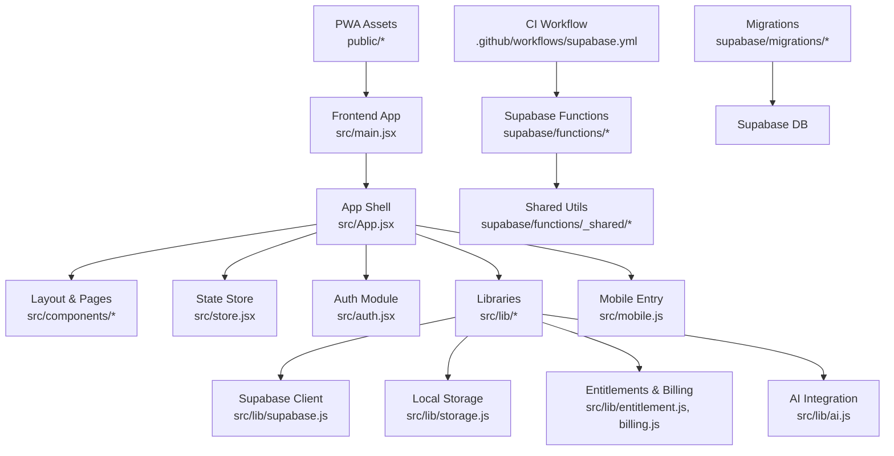
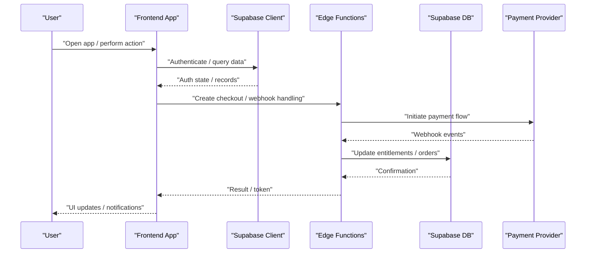
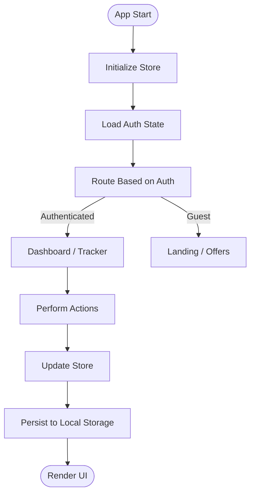
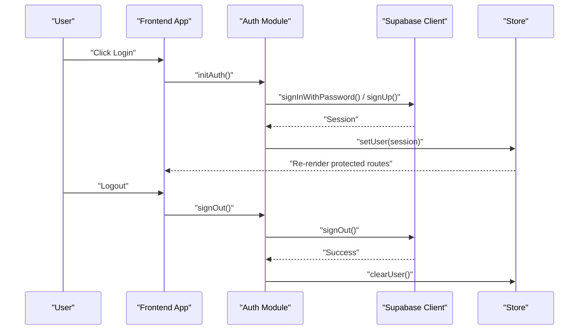
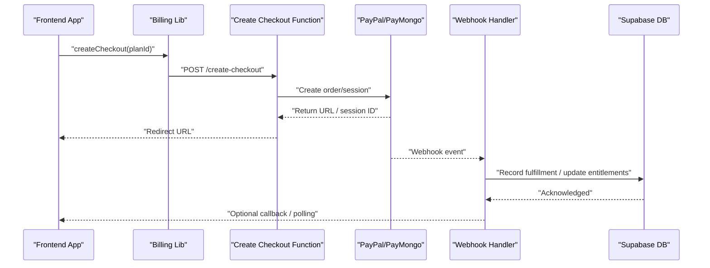
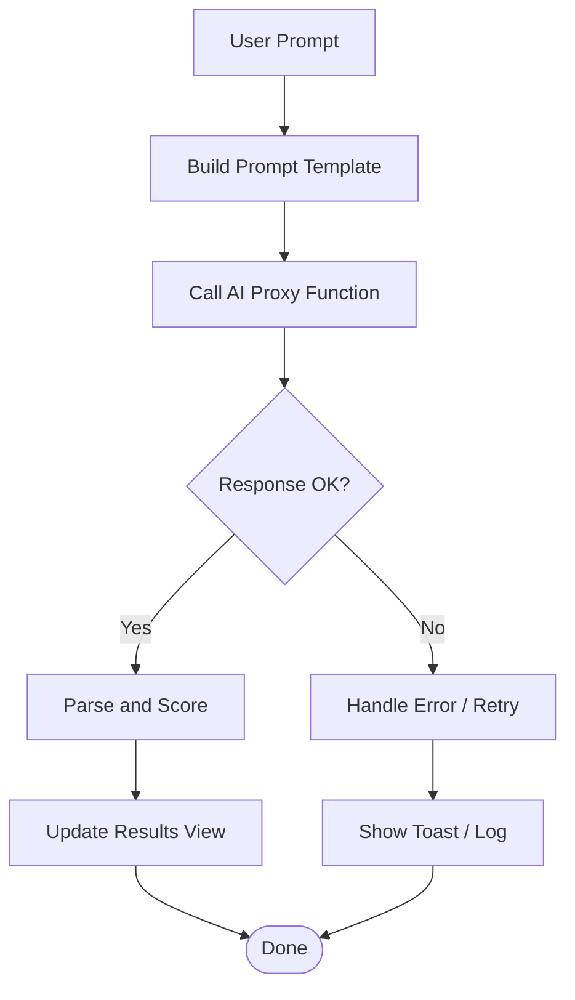
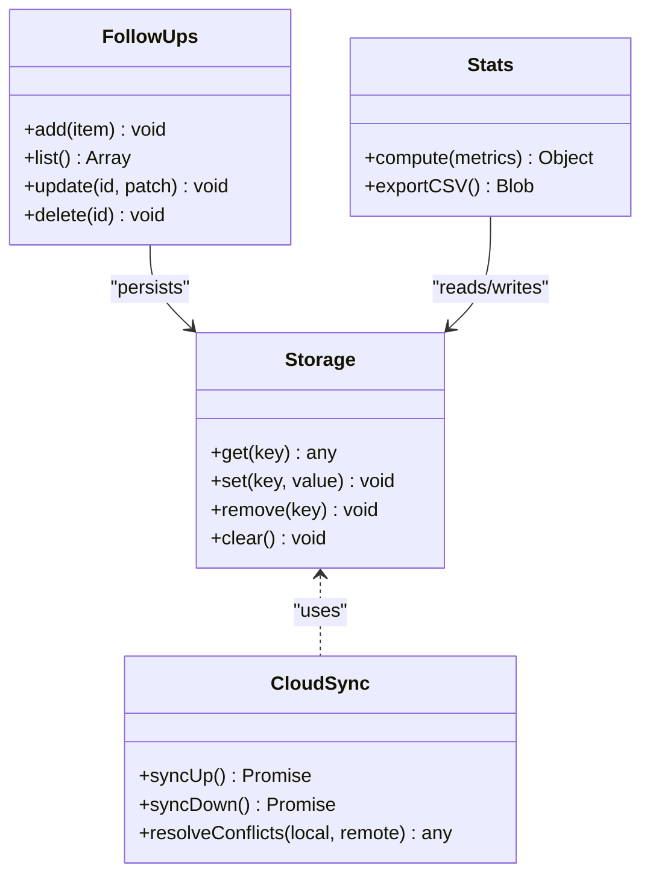
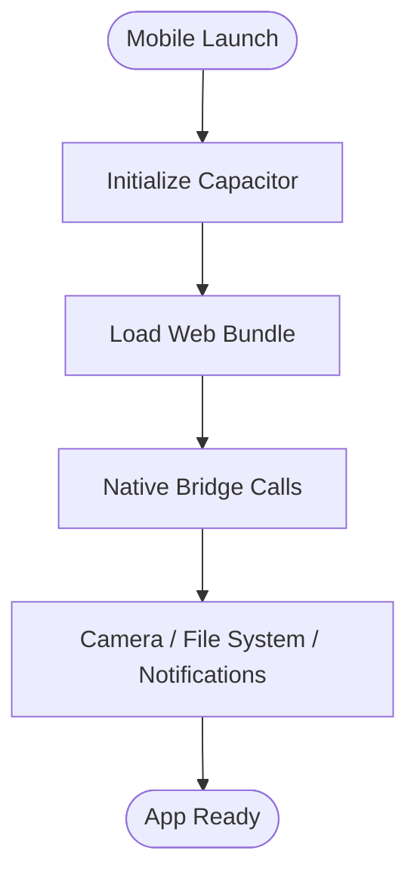
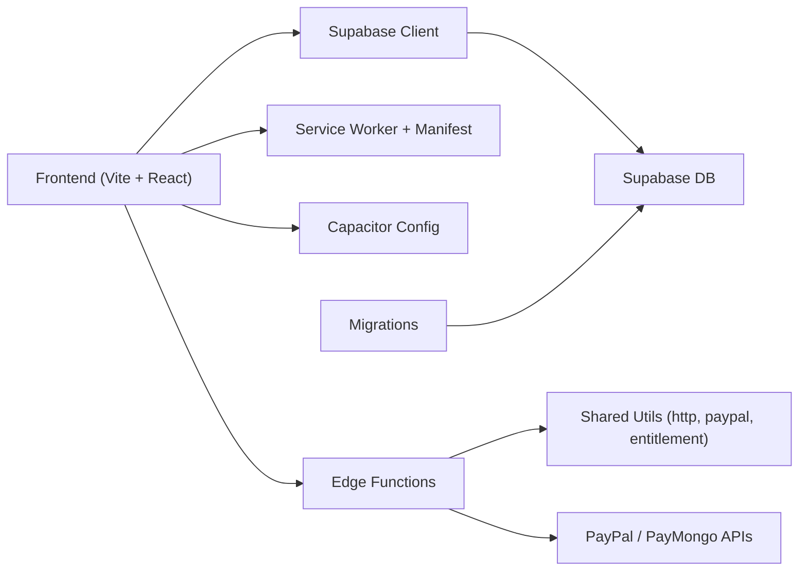

# Developer Guidelines

<cite>
**Referenced Files in This Document**
- [README.md](file://README.md)
- [package.json](file://package.json)
- [vite.config.js](file://vite.config.js)
- [netlify.toml](file://netlify.toml)
- [vercel.json](file://vercel.json)
- [capacitor.config.ts](file://capacitor.config.ts)
- [src/main.jsx](file://src/main.jsx)
- [src/App.jsx](file://src/App.jsx)
- [src/store.jsx](file://src/store.jsx)
- [src/auth.jsx](file://src/auth.jsx)
- [src/mobile.js](file://src/mobile.js)
- [src/index.css](file://src/index.css)
- [src/components/Layout.jsx](file://src/components/Layout.jsx)
- [src/components/ScanForm.jsx](file://src/components/ScanForm.jsx)
- [src/components/AiAssistant.jsx](file://src/components/AiAssistant.jsx)
- [src/components/ResultView.jsx](file://src/components/ResultView.jsx)
- [src/components/Tracker.jsx](file://src/components/Tracker.jsx)
- [src/components/Settings.jsx](file://src/components/Settings.jsx)
- [src/components/MockInterviewPage.jsx](file://src/components/MockInterviewPage.jsx)
- [src/components/OffersPage.jsx](file://src/components/OffersPage.jsx)
- [src/components/AccountPage.jsx](file://src/components/AccountPage.jsx)
- [src/hooks/useCountUp.js](file://src/hooks/useCountUp.js)
- [src/lib/supabase.js](file://src/lib/supabase.js)
- [src/lib/storage.js](file://src/lib/storage.js)
- [src/lib/entitlement.js](file://src/lib/entitlement.js)
- [src/lib/billing.js](file://src/lib/billing.js)
- [src/lib/cloud.js](file://src/lib/cloud.js)
- [src/lib/ai.js](file://src/lib/ai.js)
- [src/lib/scoring.js](file://src/lib/scoring.js)
- [src/lib/redflags.js](file://src/lib/redflags.js)
- [src/lib/stats.js](file://src/lib/stats.js)
- [src/lib/share.js](file://src/lib/share.js)
- [src/lib/csv.js](file://src/lib/csv.js)
- [src/lib/followups.js](file://src/lib/followups.js)
- [src/lib/prompt.js](file://src/lib/prompt.js)
- [src/lib/tone.js](file://src/lib/tone.js)
- [supabase/functions/_shared/http.ts](file://supabase/functions/_shared/http.ts)
- [supabase/functions/_shared/paypal.ts](file://supabase/functions/_shared/paypal.ts)
- [supabase/functions/_shared/entitlement.ts](file://supabase/functions/_shared/entitlement.ts)
- [supabase/functions/create-checkout/index.ts](file://supabase/functions/create-checkout/index.ts)
- [supabase/functions/capture-paypal-order/index.ts](file://supabase/functions/capture-paypal-order/index.ts)
- [supabase/functions/create-paypal-order/index.ts](file://supabase/functions/create-paypal-order/index.ts)
- [supabase/functions/paymongo-webhook/index.ts](file://supabase/functions/paymongo-webhook/index.ts)
- [supabase/functions/paypal-webhook/index.ts](file://supabase/functions/paypal-webhook/index.ts)
- [supabase/functions/ai-proxy/index.ts](file://supabase/functions/ai-proxy/index.ts)
- [supabase/migrations/001_schema.sql](file://supabase/migrations/001_schema.sql)
- [supabase/migrations/002_paypal_fulfillment.sql](file://supabase/migrations/002_paypal_fulfillment.sql)
- [supabase/config.toml](file://supabase/config.toml)
- [.github/workflows/supabase.yml](file:.github/workflows/supabase.yml)
- [public/sw.js](file://public/sw.js)
- [public/manifest.webmanifest](file://public/manifest.webmanifest)
</cite>

## Table of Contents
1. Introduction
2. Project Structure
3. Core Components
4. Architecture Overview
5. Detailed Component Analysis
6. Dependency Analysis
7. Performance Considerations
8. Troubleshooting Guide
9. Conclusion
10. Appendices

## Introduction
This document provides comprehensive developer guidelines for contributing to and developing ApplyGuard PH. It covers code standards, tooling configuration, Git workflow, pull request and review practices, issue reporting, debugging and profiling techniques, performance optimization strategies, common troubleshooting scenarios, known limitations, extension points, environment setup, dependency management, and release procedures. The goal is to help contributors work efficiently and consistently across the frontend web app, Supabase backend functions, and mobile packaging.

## Project Structure
ApplyGuard PH is a Vite-based React application with Supabase Edge Functions for server-side logic, migrations for database schema, and Capacitor for optional mobile packaging. Key directories:
- src: Frontend source (React components, hooks, libraries)
- supabase: Edge Functions, migrations, and Supabase config
- public: Static assets including PWA manifest and service worker
- scripts: Utility scripts
- docs: Planning and handoff documents
- .github/workflows: CI workflows for Supabase deployment

**Diagram sources**
- [src/main.jsx:1-50](file://src/main.jsx#L1-L50)
- [src/App.jsx:1-120](file://src/App.jsx#L1-L120)
- [src/store.jsx:1-120](file://src/store.jsx#L1-L120)
- [src/auth.jsx:1-120](file://src/auth.jsx#L1-L120)
- [src/mobile.js:1-60](file://src/mobile.js#L1-L60)
- [src/lib/supabase.js:1-120](file://src/lib/supabase.js#L1-L120)
- [src/lib/storage.js:1-120](file://src/lib/storage.js#L1-L120)
- [src/lib/entitlement.js:1-120](file://src/lib/entitlement.js#L1-L120)
- [src/lib/billing.js:1-120](file://src/lib/billing.js#L1-L120)
- [src/lib/ai.js:1-120](file://src/lib/ai.js#L1-L120)
- [public/sw.js:1-120](file://public/sw.js#L1-L120)
- [public/manifest.webmanifest:1-60](file://public/manifest.webmanifest#L1-L60)
- [supabase/functions/_shared/http.ts:1-120](file://supabase/functions/_shared/http.ts#L1-L120)
- [supabase/functions/_shared/paypal.ts:1-120](file://supabase/functions/_shared/paypal.ts#L1-L120)
- [supabase/functions/_shared/entitlement.ts:1-120](file://supabase/functions/_shared/entitlement.ts#L1-L120)
- [supabase/functions/create-checkout/index.ts:1-120](file://supabase/functions/create-checkout/index.ts#L1-L120)
- [supabase/functions/capture-paypal-order/index.ts:1-120](file://supabase/functions/capture-paypal-order/index.ts#L1-L120)
- [supabase/functions/create-paypal-order/index.ts:1-120](file://supabase/functions/create-paypal-order/index.ts#L1-L120)
- [supabase/functions/paymongo-webhook/index.ts:1-120](file://supabase/functions/paymongo-webhook/index.ts#L1-L120)
- [supabase/functions/paypal-webhook/index.ts:1-120](file://supabase/functions/paypal-webhook/index.ts#L1-L120)
- [supabase/functions/ai-proxy/index.ts:1-120](file://supabase/functions/ai-proxy/index.ts#L1-L120)
- [supabase/migrations/001_schema.sql:1-200](file://supabase/migrations/001_schema.sql#L1-L200)
- [supabase/migrations/002_paypal_fulfillment.sql:1-200](file://supabase/migrations/002_paypal_fulfillment.sql#L1-L200)
- [.github/workflows/supabase.yml:1-120](file:.github/workflows/supabase.yml#L1-L120)

**Section sources**
- [README.md:1-120](file://README.md#L1-L120)
- [package.json:1-120](file://package.json#L1-L120)
- [vite.config.js:1-120](file://vite.config.js#L1-L120)
- [capacitor.config.ts:1-120](file://capacitor.config.ts#L1-L120)

## Core Components
- Application entry and shell:
  - Entry point initializes the React app and integrates PWA assets.
  - App shell manages routing, layout, and global state initialization.
- State and persistence:
  - Centralized store coordinates UI state and integrates with local storage and cloud sync.
- Authentication:
  - Auth module handles user sessions and integrates with Supabase auth.
- Feature modules:
  - AI assistant integration for prompt generation and responses.
  - Scoring, red flags, stats, follow-ups, CSV export/import, sharing utilities.
  - Entitlements and billing orchestrate subscription checks and checkout flows.
- Mobile packaging:
  - Capacitor configuration and mobile entry bridge.

Key responsibilities and interactions are implemented across src/components, src/lib, and supabase/functions.

**Section sources**
- [src/main.jsx:1-80](file://src/main.jsx#L1-L80)
- [src/App.jsx:1-150](file://src/App.jsx#L1-L150)
- [src/store.jsx:1-150](file://src/store.jsx#L1-L150)
- [src/auth.jsx:1-150](file://src/auth.jsx#L1-L150)
- [src/lib/ai.js:1-120](file://src/lib/ai.js#L1-L120)
- [src/lib/scoring.js:1-120](file://src/lib/scoring.js#L1-L120)
- [src/lib/redflags.js:1-120](file://src/lib/redflags.js#L1-L120)
- [src/lib/stats.js:1-120](file://src/lib/stats.js#L1-L120)
- [src/lib/followups.js:1-120](file://src/lib/followups.js#L1-L120)
- [src/lib/csv.js:1-120](file://src/lib/csv.js#L1-L120)
- [src/lib/share.js:1-120](file://src/lib/share.js#L1-L120)
- [src/lib/entitlement.js:1-120](file://src/lib/entitlement.js#L1-L120)
- [src/lib/billing.js:1-120](file://src/lib/billing.js#L1-L120)
- [capacitor.config.ts:1-120](file://capacitor.config.ts#L1-L120)

## Architecture Overview
The system comprises:
- Frontend React app built with Vite, using React Router and a centralized store.
- Supabase client for authentication and data operations.
- Supabase Edge Functions for secure server-side logic (billing, AI proxy).
- Database schema managed via migrations.
- Optional mobile packaging via Capacitor.
- PWA support through service worker and manifest.

**Diagram sources**
- [src/lib/supabase.js:1-120](file://src/lib/supabase.js#L1-L120)
- [src/lib/billing.js:1-120](file://src/lib/billing.js#L1-L120)
- [src/lib/entitlement.js:1-120](file://src/lib/entitlement.js#L1-L120)
- [supabase/functions/create-checkout/index.ts:1-120](file://supabase/functions/create-checkout/index.ts#L1-L120)
- [supabase/functions/paymongo-webhook/index.ts:1-120](file://supabase/functions/paymongo-webhook/index.ts#L1-L120)
- [supabase/functions/paypal-webhook/index.ts:1-120](file://supabase/functions/paypal-webhook/index.ts#L1-L120)
- [supabase/migrations/001_schema.sql:1-200](file://supabase/migrations/001_schema.sql#L1-L200)
- [supabase/migrations/002_paypal_fulfillment.sql:1-200](file://supabase/migrations/002_paypal_fulfillment.sql#L1-L200)

## Detailed Component Analysis

### Frontend App Shell and Routing
- Entry point bootstraps React and integrates PWA assets.
- App shell sets up routes, layout, and global state initialization.
- Layout component wraps pages and provides consistent navigation and header/footer.

**Diagram sources**
- [src/main.jsx:1-80](file://src/main.jsx#L1-L80)
- [src/App.jsx:1-150](file://src/App.jsx#L1-L150)
- [src/store.jsx:1-150](file://src/store.jsx#L1-L150)
- [src/components/Layout.jsx:1-120](file://src/components/Layout.jsx#L1-L120)

**Section sources**
- [src/main.jsx:1-80](file://src/main.jsx#L1-L80)
- [src/App.jsx:1-150](file://src/App.jsx#L1-L150)
- [src/components/Layout.jsx:1-120](file://src/components/Layout.jsx#L1-L120)

### Authentication Flow
- Handles login, logout, and session persistence.
- Integrates with Supabase auth and updates store state.
- Protects routes based on authentication status.

**Diagram sources**
- [src/auth.jsx:1-150](file://src/auth.jsx#L1-L150)
- [src/lib/supabase.js:1-120](file://src/lib/supabase.js#L1-L120)
- [src/store.jsx:1-150](file://src/store.jsx#L1-L150)

**Section sources**
- [src/auth.jsx:1-150](file://src/auth.jsx#L1-L150)
- [src/lib/supabase.js:1-120](file://src/lib/supabase.js#L1-L120)
- [src/store.jsx:1-150](file://src/store.jsx#L1-L150)

### Billing and Entitlements
- Orchestrates checkout creation and webhook fulfillment.
- Checks entitlements before enabling premium features.
- Integrates with PayPal and PayMongo providers via Edge Functions.

**Diagram sources**
- [src/lib/billing.js:1-120](file://src/lib/billing.js#L1-L120)
- [src/lib/entitlement.js:1-120](file://src/lib/entitlement.js#L1-L120)
- [supabase/functions/create-checkout/index.ts:1-120](file://supabase/functions/create-checkout/index.ts#L1-L120)
- [supabase/functions/paypal-webhook/index.ts:1-120](file://supabase/functions/paypal-webhook/index.ts#L1-L120)
- [supabase/functions/paymongo-webhook/index.ts:1-120](file://supabase/functions/paymongo-webhook/index.ts#L1-L120)
- [supabase/migrations/002_paypal_fulfillment.sql:1-200](file://supabase/migrations/002_paypal_fulfillment.sql#L1-L200)

**Section sources**
- [src/lib/billing.js:1-120](file://src/lib/billing.js#L1-L120)
- [src/lib/entitlement.js:1-120](file://src/lib/entitlement.js#L1-L120)
- [supabase/functions/_shared/paypal.ts:1-120](file://supabase/functions/_shared/paypal.ts#L1-L120)
- [supabase/functions/_shared/http.ts:1-120](file://supabase/functions/_shared/http.ts#L1-L120)

### AI Assistant Integration
- Generates prompts and calls AI proxy function.
- Handles streaming or non-streaming responses and error states.
- Integrates with scoring and analysis modules.

**Diagram sources**
- [src/lib/ai.js:1-120](file://src/lib/ai.js#L1-L120)
- [src/lib/prompt.js:1-120](file://src/lib/prompt.js#L1-L120)
- [src/lib/scoring.js:1-120](file://src/lib/scoring.js#L1-L120)
- [supabase/functions/ai-proxy/index.ts:1-120](file://supabase/functions/ai-proxy/index.ts#L1-L120)

**Section sources**
- [src/lib/ai.js:1-120](file://src/lib/ai.js#L1-L120)
- [src/lib/prompt.js:1-120](file://src/lib/prompt.js#L1-L120)
- [src/lib/scoring.js:1-120](file://src/lib/scoring.js#L1-L120)
- [supabase/functions/ai-proxy/index.ts:1-120](file://supabase/functions/ai-proxy/index.ts#L1-L120)

### Data Persistence and Sync
- Local storage wrapper for offline-first behavior.
- Cloud sync layer for cross-device consistency.
- Follow-ups and stats modules rely on persistent data.

**Diagram sources**
- [src/lib/storage.js:1-120](file://src/lib/storage.js#L1-L120)
- [src/lib/cloud.js:1-120](file://src/lib/cloud.js#L1-L120)
- [src/lib/followups.js:1-120](file://src/lib/followups.js#L1-L120)
- [src/lib/stats.js:1-120](file://src/lib/stats.js#L1-L120)

**Section sources**
- [src/lib/storage.js:1-120](file://src/lib/storage.js#L1-L120)
- [src/lib/cloud.js:1-120](file://src/lib/cloud.js#L1-L120)
- [src/lib/followups.js:1-120](file://src/lib/followups.js#L1-L120)
- [src/lib/stats.js:1-120](file://src/lib/stats.js#L1-L120)

### Mobile Packaging
- Capacitor configuration bridges web app to native capabilities.
- Mobile entry file initializes Capacitor runtime and routes.

**Diagram sources**
- [capacitor.config.ts:1-120](file://capacitor.config.ts#L1-L120)
- [src/mobile.js:1-60](file://src/mobile.js#L1-L60)

**Section sources**
- [capacitor.config.ts:1-120](file://capacitor.config.ts#L1-L120)
- [src/mobile.js:1-60](file://src/mobile.js#L1-L60)

## Dependency Analysis
- Frontend dependencies include React, Vite, and Supabase client.
- Supabase functions use Deno runtime and external HTTP clients for payments.
- Migrations define relational schema and fulfillments.

**Diagram sources**
- [package.json:1-120](file://package.json#L1-L120)
- [vite.config.js:1-120](file://vite.config.js#L1-L120)
- [src/lib/supabase.js:1-120](file://src/lib/supabase.js#L1-L120)
- [public/sw.js:1-120](file://public/sw.js#L1-L120)
- [public/manifest.webmanifest:1-60](file://public/manifest.webmanifest#L1-L60)
- [capacitor.config.ts:1-120](file://capacitor.config.ts#L1-L120)
- [supabase/functions/_shared/http.ts:1-120](file://supabase/functions/_shared/http.ts#L1-L120)
- [supabase/functions/_shared/paypal.ts:1-120](file://supabase/functions/_shared/paypal.ts#L1-L120)
- [supabase/migrations/001_schema.sql:1-200](file://supabase/migrations/001_schema.sql#L1-L200)
- [supabase/migrations/002_paypal_fulfillment.sql:1-200](file://supabase/migrations/002_paypal_fulfillment.sql#L1-L200)

**Section sources**
- [package.json:1-120](file://package.json#L1-L120)
- [vite.config.js:1-120](file://vite.config.js#L1-L120)
- [supabase/config.toml:1-120](file://supabase/config.toml#L1-L120)

## Performance Considerations
- Use lazy loading for heavy components and routes to reduce initial bundle size.
- Debounce expensive computations (scoring, stats) and memoize derived values.
- Cache API responses and leverage Supabase client caching where appropriate.
- Optimize images and static assets; enable compression in build config.
- Profile with browser DevTools (Performance panel) and React Profiler to identify bottlenecks.
- For AI calls, implement retry with exponential backoff and timeout guards.
- Minimize re-renders by splitting state and using context selectively.

[No sources needed since this section provides general guidance]

## Troubleshooting Guide
Common issues and resolutions:
- Authentication failures:
  - Verify Supabase project URLs and keys; check network policies and CORS.
  - Inspect session state and ensure store updates after sign-in/sign-out.
- Billing errors:
  - Validate webhook signatures and payload shapes; log provider responses.
  - Ensure idempotency in webhook handlers to prevent duplicate fulfillments.
- AI proxy timeouts:
  - Implement retries and fallback messages; monitor latency metrics.
- Data sync conflicts:
  - Review conflict resolution strategy; add versioning or timestamps.
- PWA not installing:
  - Check service worker registration and manifest validity; clear cache and reload.

**Section sources**
- [src/auth.jsx:1-150](file://src/auth.jsx#L1-L150)
- [src/lib/billing.js:1-120](file://src/lib/billing.js#L1-L120)
- [supabase/functions/paypal-webhook/index.ts:1-120](file://supabase/functions/paypal-webhook/index.ts#L1-L120)
- [supabase/functions/paymongo-webhook/index.ts:1-120](file://supabase/functions/paymongo-webhook/index.ts#L1-L120)
- [src/lib/ai.js:1-120](file://src/lib/ai.js#L1-L120)
- [public/sw.js:1-120](file://public/sw.js#L1-L120)
- [public/manifest.webmanifest:1-60](file://public/manifest.webmanifest#L1-L60)

## Conclusion
This guide outlines the structure, core components, architecture, and development practices for ApplyGuard PH. By following the outlined standards, workflows, and troubleshooting steps, contributors can maintain high quality, reliability, and performance across the web and mobile experiences.

[No sources needed since this section summarizes without analyzing specific files]

## Appendices

### Development Environment Setup
- Install Node.js and npm/yarn as per package manager requirements.
- Clone repository and install dependencies.
- Configure environment variables for Supabase and third-party services.
- Run dev server with hot reload.
- For mobile, set up Android/iOS SDKs and run Capacitor commands.

**Section sources**
- [package.json:1-120](file://package.json#L1-L120)
- [capacitor.config.ts:1-120](file://capacitor.config.ts#L1-L120)

### Code Standards and Tooling
- ESLint:
  - Configure rules for React best practices, import ordering, and error prevention.
  - Use shared configs if available; enforce consistent patterns.
- Prettier:
  - Define formatting rules for JSX, CSS, and TypeScript/JavaScript.
  - Integrate with editor and pre-commit hooks.
- Commit conventions:
  - Use conventional commits for clarity and automation.
- Testing:
  - Write unit tests for lib modules; integrate with Vitest/Jest.
  - Mock Supabase client and external APIs.

**Section sources**
- [package.json:1-120](file://package.json#L1-L120)
- [vite.config.js:1-120](file://vite.config.js#L1-L120)

### Git Workflow and Pull Requests
- Branching model:
  - Feature branches from main; descriptive names.
- Pull request process:
  - Open PR with description, linked issues, and screenshots if UI changes.
  - Require reviews and passing CI checks.
- Code review standards:
  - Focus on correctness, readability, performance, and security.
  - Request changes when necessary; approve only after concerns addressed.
- Issue reporting:
  - Provide reproduction steps, environment details, and logs.
  - Label appropriately and assign owners.

**Section sources**
- [.github/workflows/supabase.yml:1-120](file:.github/workflows/supabase.yml#L1-L120)

### Debugging Techniques and Profiling Tools
- Browser DevTools:
  - Network tab for API calls; Performance tab for rendering and JS execution.
  - React Profiler for component render costs.
- Logging:
  - Structured logging in Edge Functions; correlate requests with IDs.
- Supabase CLI:
  - Local development of functions and migrations; inspect logs.

**Section sources**
- [supabase/config.toml:1-120](file://supabase/config.toml#L1-L120)
- [supabase/functions/_shared/http.ts:1-120](file://supabase/functions/_shared/http.ts#L1-L120)

### Release Procedures
- Staging:
  - Deploy to Netlify/Vercel preview environments; validate integrations.
- Production:
  - Tag releases; run full test suite; deploy via CI pipeline.
- Supabase:
  - Apply migrations; deploy Edge Functions; verify webhooks.
- Rollback plan:
  - Maintain previous versions; revert migrations cautiously.

**Section sources**
- [netlify.toml:1-120](file://netlify.toml#L1-L120)
- [vercel.json:1-120](file://vercel.json#L1-L120)
- [.github/workflows/supabase.yml:1-120](file:.github/workflows/supabase.yml#L1-L120)
- [supabase/migrations/001_schema.sql:1-200](file://supabase/migrations/001_schema.sql#L1-L200)
- [supabase/migrations/002_paypal_fulfillment.sql:1-200](file://supabase/migrations/002_paypal_fulfillment.sql#L1-L200)

### Known Limitations and Extension Points
- Limitations:
  - AI provider rate limits and availability; consider fallbacks.
  - Payment provider constraints and region restrictions.
  - Offline sync complexity for large datasets.
- Extension points:
  - Add new payment providers via shared utils and webhook handlers.
  - Extend AI prompts and scoring rules.
  - Introduce new analytics or telemetry modules.

**Section sources**
- [supabase/functions/_shared/paypal.ts:1-120](file://supabase/functions/_shared/paypal.ts#L1-L120)
- [src/lib/ai.js:1-120](file://src/lib/ai.js#L1-L120)
- [src/lib/scoring.js:1-120](file://src/lib/scoring.js#L1-L120)
- [src/lib/stats.js:1-120](file://src/lib/stats.js#L1-L120)