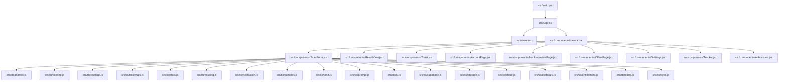
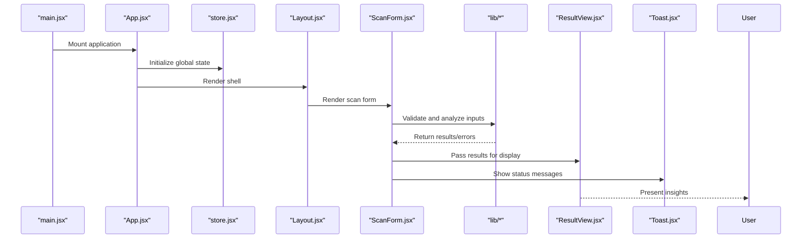
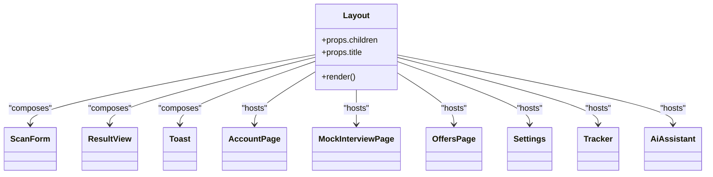
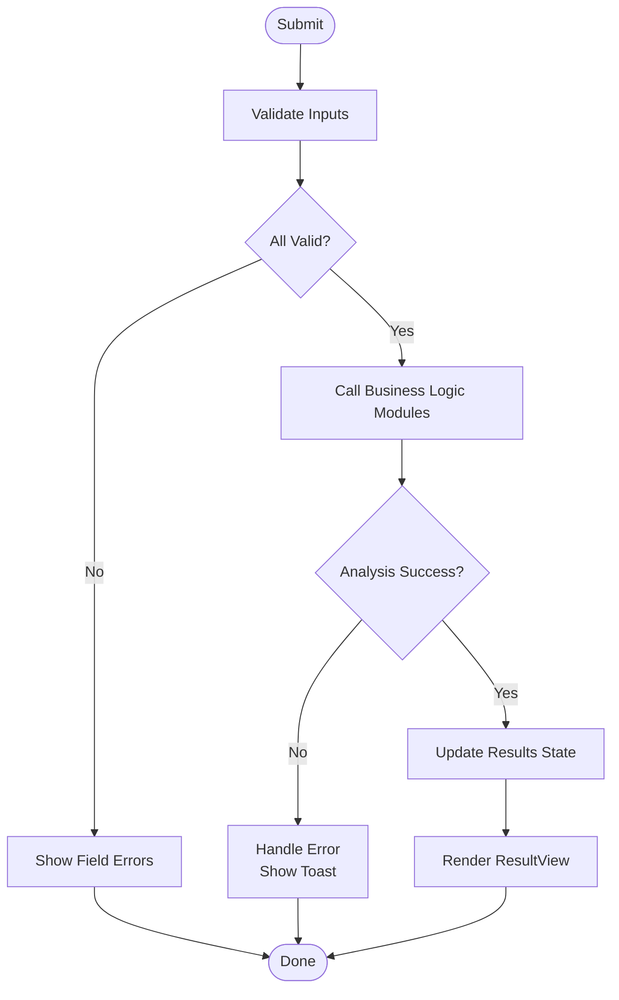
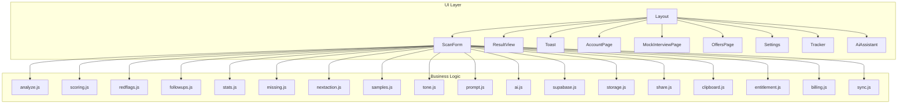

# Component System

<cite>
**Referenced Files in This Document**
- [App.jsx](file://src/App.jsx)
- [main.jsx](file://src/main.jsx)
- [store.jsx](file://src/store.jsx)
- [Layout.jsx](file://src/components/Layout.jsx)
- [ScanForm.jsx](file://src/components/ScanForm.jsx)
- [ResultView.jsx](file://src/components/ResultView.jsx)
- [Toast.jsx](file://src/components/Toast.jsx)
- [AccountPage.jsx](file://src/components/AccountPage.jsx)
- [MockInterviewPage.jsx](file://src/components/MockInterviewPage.jsx)
- [OffersPage.jsx](file://src/components/OffersPage.jsx)
- [Settings.jsx](file://src/components/Settings.jsx)
- [Tracker.jsx](file://src/components/Tracker.jsx)
- [AiAssistant.jsx](file://src/components/AiAssistant.jsx)
- [useCountUp.js](file://src/hooks/useCountUp.js)
- [analyze.js](file://src/lib/analyze.js)
- [scoring.js](file://src/lib/scoring.js)
- [redflags.js](file://src/lib/redflags.js)
- [followups.js](file://src/lib/followups.js)
- [stats.js](file://src/lib/stats.js)
- [missing.js](file://src/lib/missing.js)
- [nextaction.js](file://src/lib/nextaction.js)
- [samples.js](file://src/lib/samples.js)
- [tone.js](file://src/lib/tone.js)
- [prompt.js](file://src/lib/prompt.js)
- [ai.js](file://src/lib/ai.js)
- [supabase.js](file://src/lib/supabase.js)
- [storage.js](file://src/lib/storage.js)
- [share.js](file://src/lib/share.js)
- [clipboard.js](file://src/lib/clipboard.js)
- [entitlement.js](file://src/lib/entitlement.js)
- [billing.js](file://src/lib/billing.js)
- [sync.js](file://src/lib/sync.js)
</cite>

## Table of Contents
1. [Introduction](#introduction)
2. [Project Structure](#project-structure)
3. [Core Components](#core-components)
4. [Architecture Overview](#architecture-overview)
5. [Detailed Component Analysis](#detailed-component-analysis)
6. [Dependency Analysis](#dependency-analysis)
7. [Performance Considerations](#performance-considerations)
8. [Troubleshooting Guide](#troubleshooting-guide)
9. [Conclusion](#conclusion)

## Introduction
This document explains the React component system used in ApplyGuard PH. It focuses on:
- The component hierarchy and naming conventions
- Architectural patterns for composition, state management, and event handling
- The base Layout wrapper and its role across pages
- Form components (e.g., ScanForm) with validation and state strategies
- Display and feedback components (e.g., ResultView, Toast)
- How components interact with business logic modules and external services

The goal is to provide a clear mental model for both new contributors and experienced developers working on the UI layer.

## Project Structure
At a high level, the application follows a feature-oriented layout under src/components, with shared utilities and business logic under src/lib, hooks under src/hooks, and app wiring at the root of src.



**Diagram sources**
- [main.jsx:1-200](file://src/main.jsx#L1-L200)
- [App.jsx:1-200](file://src/App.jsx#L1-L200)
- [store.jsx:1-200](file://src/store.jsx#L1-L200)
- [Layout.jsx:1-200](file://src/components/Layout.jsx#L1-L200)
- [ScanForm.jsx:1-200](file://src/components/ScanForm.jsx#L1-L200)
- [ResultView.jsx:1-200](file://src/components/ResultView.jsx#L1-L200)
- [Toast.jsx:1-200](file://src/components/Toast.jsx#L1-L200)
- [AccountPage.jsx:1-200](file://src/components/AccountPage.jsx#L1-L200)
- [MockInterviewPage.jsx:1-200](file://src/components/MockInterviewPage.jsx#L1-L200)
- [OffersPage.jsx:1-200](file://src/components/OffersPage.jsx#L1-L200)
- [Settings.jsx:1-200](file://src/components/Settings.jsx#L1-L200)
- [Tracker.jsx:1-200](file://src/components/Tracker.jsx#L1-L200)
- [AiAssistant.jsx:1-200](file://src/components/AiAssistant.jsx#L1-L200)
- [analyze.js:1-200](file://src/lib/analyze.js#L1-L200)
- [scoring.js:1-200](file://src/lib/scoring.js#L1-L200)
- [redflags.js:1-200](file://src/lib/redflags.js#L1-L200)
- [followups.js:1-200](file://src/lib/followups.js#L1-L200)
- [stats.js:1-200](file://src/lib/stats.js#L1-L200)
- [missing.js:1-200](file://src/lib/missing.js#L1-L200)
- [nextaction.js:1-200](file://src/lib/nextaction.js#L1-L200)
- [samples.js:1-200](file://src/lib/samples.js#L1-L200)
- [tone.js:1-200](file://src/lib/tone.js#L1-L200)
- [prompt.js:1-200](file://src/lib/prompt.js#L1-L200)
- [ai.js:1-200](file://src/lib/ai.js#L1-L200)
- [supabase.js:1-200](file://src/lib/supabase.js#L1-L200)
- [storage.js:1-200](file://src/lib/storage.js#L1-L200)
- [share.js:1-200](file://src/lib/share.js#L1-L200)
- [clipboard.js:1-200](file://src/lib/clipboard.js#L1-L200)
- [entitlement.js:1-200](file://src/lib/entitlement.js#L1-L200)
- [billing.js:1-200](file://src/lib/billing.js#L1-L200)
- [sync.js:1-200](file://src/lib/sync.js#L1-L200)

**Section sources**
- [main.jsx:1-200](file://src/main.jsx#L1-L200)
- [App.jsx:1-200](file://src/App.jsx#L1-L200)
- [store.jsx:1-200](file://src/store.jsx#L1-L200)

## Core Components
This section outlines the primary UI building blocks and their responsibilities.

- Layout
  - Role: Global page wrapper providing consistent chrome, navigation, and content area.
  - Responsibilities: Renders header/footer or shell, manages global UI state (e.g., theme, notifications), and composes page-level components.
  - Composition: Wraps all page components; may accept props like title, actions, or children.

- ScanForm
  - Role: Primary input form for scanning and analyzing data.
  - Responsibilities: Collects user inputs, validates fields, orchestrates analysis via business logic modules, and emits results or errors.
  - State Management: Uses local state for form values and validation; integrates with store or context for cross-cutting concerns if needed.
  - Event Handling: Submits data, handles async operations, and updates UI accordingly.

- ResultView
  - Role: Displays analysis outcomes and insights.
  - Responsibilities: Renders structured results, highlights key metrics, and provides actions (e.g., share, export).
  - Reusability: Accepts result objects as props; can be embedded within Layout or other containers.

- Toast
  - Role: Lightweight feedback component for transient messages.
  - Responsibilities: Shows success, warning, or error notifications; supports auto-dismiss and manual dismissal.
  - Integration: Consumed by various components to surface user feedback.

- Page Components (AccountPage, MockInterviewPage, OffersPage, Settings, Tracker, AiAssistant)
  - Role: Feature-specific screens composed inside Layout.
  - Responsibilities: Orchestrate domain flows, delegate to business logic, and render specialized views.

Naming Conventions
- PascalCase for component files and identifiers.
- Descriptive names reflecting purpose (e.g., ScanForm, ResultView, AccountPage).
- Hooks follow useXxx pattern (e.g., useCountUp).

Architectural Patterns
- Container/Presentational split: Pages orchestrate logic; display components focus on rendering.
- Composition over inheritance: Components are combined via props and children.
- Single source of truth: Shared state resides in store/context where necessary; local state for ephemeral UI.

**Section sources**
- [Layout.jsx:1-200](file://src/components/Layout.jsx#L1-L200)
- [ScanForm.jsx:1-200](file://src/components/ScanForm.jsx#L1-L200)
- [ResultView.jsx:1-200](file://src/components/ResultView.jsx#L1-L200)
- [Toast.jsx:1-200](file://src/components/Toast.jsx#L1-L200)
- [AccountPage.jsx:1-200](file://src/components/AccountPage.jsx#L1-L200)
- [MockInterviewPage.jsx:1-200](file://src/components/MockInterviewPage.jsx#L1-L200)
- [OffersPage.jsx:1-200](file://src/components/OffersPage.jsx#L1-L200)
- [Settings.jsx:1-200](file://src/components/Settings.jsx#L1-L200)
- [Tracker.jsx:1-200](file://src/components/Tracker.jsx#L1-L200)
- [AiAssistant.jsx:1-200](file://src/components/AiAssistant.jsx#L1-L200)

## Architecture Overview
The application bootstraps from main.jsx, which mounts App.jsx. App.jsx wires up global state (store.jsx) and renders Layout.jsx. Layout.jsx hosts page components and composes reusable UI elements such as ScanForm, ResultView, and Toast. Business logic is encapsulated in src/lib modules, keeping components focused on presentation and interaction.



**Diagram sources**
- [main.jsx:1-200](file://src/main.jsx#L1-L200)
- [App.jsx:1-200](file://src/App.jsx#L1-L200)
- [store.jsx:1-200](file://src/store.jsx#L1-L200)
- [Layout.jsx:1-200](file://src/components/Layout.jsx#L1-L200)
- [ScanForm.jsx:1-200](file://src/components/ScanForm.jsx#L1-L200)
- [ResultView.jsx:1-200](file://src/components/ResultView.jsx#L1-L200)
- [Toast.jsx:1-200](file://src/components/Toast.jsx#L1-L200)

## Detailed Component Analysis

### Layout Component
- Purpose: Provides a consistent wrapper around all pages, including navigation, headers, footers, and global UI controls.
- Composition: Accepts children (page content) and optional props for dynamic behavior (e.g., title, actions).
- State: May manage global UI state such as active route, theme, or notification visibility.
- Interaction: Delegates routing or page selection to parent (App.jsx) or internal navigation helpers.



**Diagram sources**
- [Layout.jsx:1-200](file://src/components/Layout.jsx#L1-L200)
- [ScanForm.jsx:1-200](file://src/components/ScanForm.jsx#L1-L200)
- [ResultView.jsx:1-200](file://src/components/ResultView.jsx#L1-L200)
- [Toast.jsx:1-200](file://src/components/Toast.jsx#L1-L200)
- [AccountPage.jsx:1-200](file://src/components/AccountPage.jsx#L1-L200)
- [MockInterviewPage.jsx:1-200](file://src/components/MockInterviewPage.jsx#L1-L200)
- [OffersPage.jsx:1-200](file://src/components/OffersPage.jsx#L1-L200)
- [Settings.jsx:1-200](file://src/components/Settings.jsx#L1-L200)
- [Tracker.jsx:1-200](file://src/components/Tracker.jsx#L1-L200)
- [AiAssistant.jsx:1-200](file://src/components/AiAssistant.jsx#L1-L200)

**Section sources**
- [Layout.jsx:1-200](file://src/components/Layout.jsx#L1-L200)

### ScanForm Component
- Purpose: Captures user input, validates it, triggers analysis, and surfaces results and feedback.
- Validation Patterns: Field-level checks (required, format), aggregated validation before submission.
- State Management: Local state for inputs and validation errors; may integrate with store for persistence or sharing.
- Event Handling: Submit handler orchestrates validation, calls business logic, updates UI, and shows toast feedback.
- Business Logic Integration: Delegates analysis to modules such as analyze, scoring, redflags, followups, stats, missing, nextaction, samples, tone, prompt, ai, supabase, storage, share, clipboard, entitlement, billing, sync.



**Diagram sources**
- [ScanForm.jsx:1-200](file://src/components/ScanForm.jsx#L1-L200)
- [analyze.js:1-200](file://src/lib/analyze.js#L1-L200)
- [scoring.js:1-200](file://src/lib/scoring.js#L1-L200)
- [redflags.js:1-200](file://src/lib/redflags.js#L1-L200)
- [followups.js:1-200](file://src/lib/followups.js#L1-L200)
- [stats.js:1-200](file://src/lib/stats.js#L1-L200)
- [missing.js:1-200](file://src/lib/missing.js#L1-L200)
- [nextaction.js:1-200](file://src/lib/nextaction.js#L1-L200)
- [samples.js:1-200](file://src/lib/samples.js#L1-L200)
- [tone.js:1-200](file://src/lib/tone.js#L1-L200)
- [prompt.js:1-200](file://src/lib/prompt.js#L1-L200)
- [ai.js:1-200](file://src/lib/ai.js#L1-L200)
- [supabase.js:1-200](file://src/lib/supabase.js#L1-L200)
- [storage.js:1-200](file://src/lib/storage.js#L1-L200)
- [share.js:1-200](file://src/lib/share.js#L1-L200)
- [clipboard.js:1-200](file://src/lib/clipboard.js#L1-L200)
- [entitlement.js:1-200](file://src/lib/entitlement.js#L1-L200)
- [billing.js:1-200](file://src/lib/billing.js#L1-L200)
- [sync.js:1-200](file://src/lib/sync.js#L1-L200)

**Section sources**
- [ScanForm.jsx:1-200](file://src/components/ScanForm.jsx#L1-L200)

### ResultView Component
- Purpose: Presents analysis outputs in a readable, actionable format.
- Props Interface: Accepts structured result objects, labels, and optional action handlers.
- Interactions: Supports copy-to-clipboard, sharing, exporting, or navigating to related features.
- Reusability: Designed to be embedded in multiple contexts (e.g., after scan, in history view).

**Section sources**
- [ResultView.jsx:1-200](file://src/components/ResultView.jsx#L1-L200)

### Toast Component
- Purpose: Displays transient feedback to users.
- Props Interface: Message text, type (success/warning/error), duration, onClose callback.
- Behavior: Auto-dismiss after timeout; manual dismiss via close button or swipe.
- Integration: Used by forms and pages to communicate outcomes.

**Section sources**
- [Toast.jsx:1-200](file://src/components/Toast.jsx#L1-L200)

### Page Components
- AccountPage: Manages account-related flows and settings.
- MockInterviewPage: Orchestrates mock interview interactions.
- OffersPage: Displays and manages offers.
- Settings: Configures application preferences.
- Tracker: Tracks progress or metrics.
- AiAssistant: Integrates AI assistant capabilities.

Each page composes relevant subcomponents and delegates to business logic modules as needed.

**Section sources**
- [AccountPage.jsx:1-200](file://src/components/AccountPage.jsx#L1-L200)
- [MockInterviewPage.jsx:1-200](file://src/components/MockInterviewPage.jsx#L1-L200)
- [OffersPage.jsx:1-200](file://src/components/OffersPage.jsx#L1-L200)
- [Settings.jsx:1-200](file://src/components/Settings.jsx#L1-L200)
- [Tracker.jsx:1-200](file://src/components/Tracker.jsx#L1-L200)
- [AiAssistant.jsx:1-200](file://src/components/AiAssistant.jsx#L1-L200)

### Conceptual Overview
The component system emphasizes:
- Clear separation between UI and logic
- Composable primitives (Layout, Toast, ResultView)
- Consistent prop interfaces and event contracts
- Centralized state where appropriate (store.jsx) and localized state for ephemeral UI



[No sources needed since this diagram shows conceptual workflow, not actual code structure]

## Dependency Analysis
Components depend on business logic modules through well-defined interfaces. ScanForm is the most integrated component, calling into multiple analysis and utility modules. ResultView and Toast remain largely decoupled, focusing on presentation and feedback respectively.

```mermaid
graph LR
ScanForm["ScanForm.jsx"] --> Analyze["analyze.js"]
ScanForm --> Scoring["scoring.js"]
ScanForm --> Redflags["redflags.js"]
ScanForm --> Followups["followups.js"]
ScanForm --> Stats["stats.js"]
ScanForm --> Missing["missing.js"]
ScanForm --> NextAction["nextaction.js"]
ScanForm --> Samples["samples.js"]
ScanForm --> Tone["tone.js"]
ScanForm --> Prompt["prompt.js"]
ScanForm --> AI["ai.js"]
ScanForm --> Supabase["supabase.js"]
ScanForm --> Storage["storage.js"]
ScanForm --> Share["share.js"]
ScanForm --> Clipboard["clipboard.js"]
ScanForm --> Entitlement["entitlement.js"]
ScanForm --> Billing["billing.js"]
ScanForm --> Sync["sync.js"]
ResultView["ResultView.jsx"] --> Share
ResultView --> Clipboard
Toast["Toast.jsx"] --> []
```

**Diagram sources**
- [ScanForm.jsx:1-200](file://src/components/ScanForm.jsx#L1-L200)
- [ResultView.jsx:1-200](file://src/components/ResultView.jsx#L1-L200)
- [Toast.jsx:1-200](file://src/components/Toast.jsx#L1-L200)
- [analyze.js:1-200](file://src/lib/analyze.js#L1-L200)
- [scoring.js:1-200](file://src/lib/scoring.js#L1-L200)
- [redflags.js:1-200](file://src/lib/redflags.js#L1-L200)
- [followups.js:1-200](file://src/lib/followups.js#L1-L200)
- [stats.js:1-200](file://src/lib/stats.js#L1-L200)
- [missing.js:1-200](file://src/lib/missing.js#L1-L200)
- [nextaction.js:1-200](file://src/lib/nextaction.js#L1-L200)
- [samples.js:1-200](file://src/lib/samples.js#L1-L200)
- [tone.js:1-200](file://src/lib/tone.js#L1-L200)
- [prompt.js:1-200](file://src/lib/prompt.js#L1-L200)
- [ai.js:1-200](file://src/lib/ai.js#L1-L200)
- [supabase.js:1-200](file://src/lib/supabase.js#L1-L200)
- [storage.js:1-200](file://src/lib/storage.js#L1-L200)
- [share.js:1-200](file://src/lib/share.js#L1-L200)
- [clipboard.js:1-200](file://src/lib/clipboard.js#L1-L200)
- [entitlement.js:1-200](file://src/lib/entitlement.js#L1-L200)
- [billing.js:1-200](file://src/lib/billing.js#L1-L200)
- [sync.js:1-200](file://src/lib/sync.js#L1-L200)

**Section sources**
- [ScanForm.jsx:1-200](file://src/components/ScanForm.jsx#L1-L200)
- [ResultView.jsx:1-200](file://src/components/ResultView.jsx#L1-L200)
- [Toast.jsx:1-200](file://src/components/Toast.jsx#L1-L200)

## Performance Considerations
- Memoization: Use memoization for expensive computations in business logic modules and avoid unnecessary re-renders in components.
- Lazy Loading: Consider lazy-loading heavy modules or routes to reduce initial bundle size.
- Debouncing: Debounce input changes in forms to limit frequent validations or API calls.
- Efficient Rendering: Keep ResultView and Toast lightweight; pass only necessary props and avoid deep object cloning.
- State Coalescing: Consolidate related state in store.jsx to minimize redundant updates.

[No sources needed since this section provides general guidance]

## Troubleshooting Guide
Common issues and resolutions:
- Validation Failures: Ensure field-level rules match expected formats; check that aggregated validation runs before submission.
- Async Errors: Wrap async calls in try/catch and show meaningful Toast messages; log errors for debugging.
- State Inconsistencies: Verify that state updates are deterministic and derived from a single source of truth when using store.jsx.
- External Service Failures: Handle network errors gracefully; retry with backoff where appropriate; inform users via Toast.

**Section sources**
- [ScanForm.jsx:1-200](file://src/components/ScanForm.jsx#L1-L200)
- [Toast.jsx:1-200](file://src/components/Toast.jsx#L1-L200)

## Conclusion
The ApplyGuard PH component system is built around a clear hierarchy and strong separation of concerns. Layout serves as the universal wrapper, while ScanForm orchestrates complex workflows by composing business logic modules. ResultView and Toast provide focused presentation and feedback. By adhering to consistent naming, prop interfaces, and event handling patterns, the system remains maintainable, testable, and extensible.