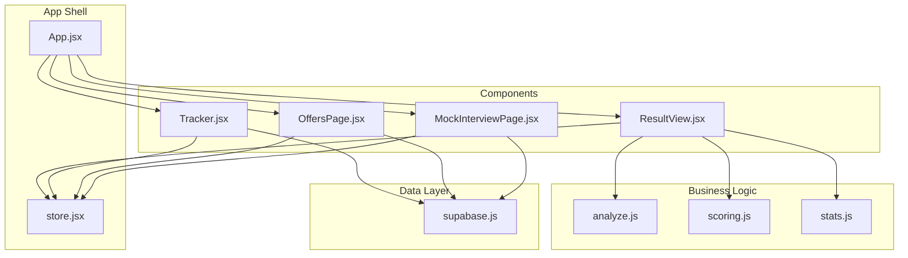
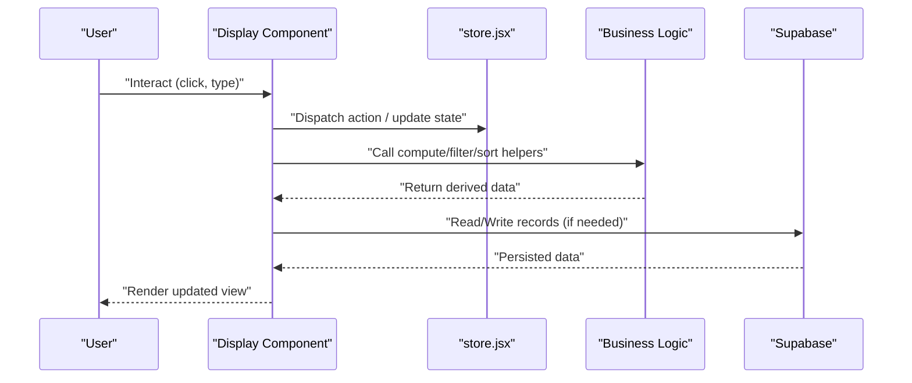
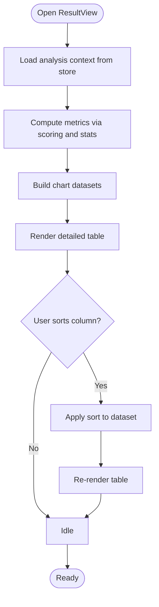
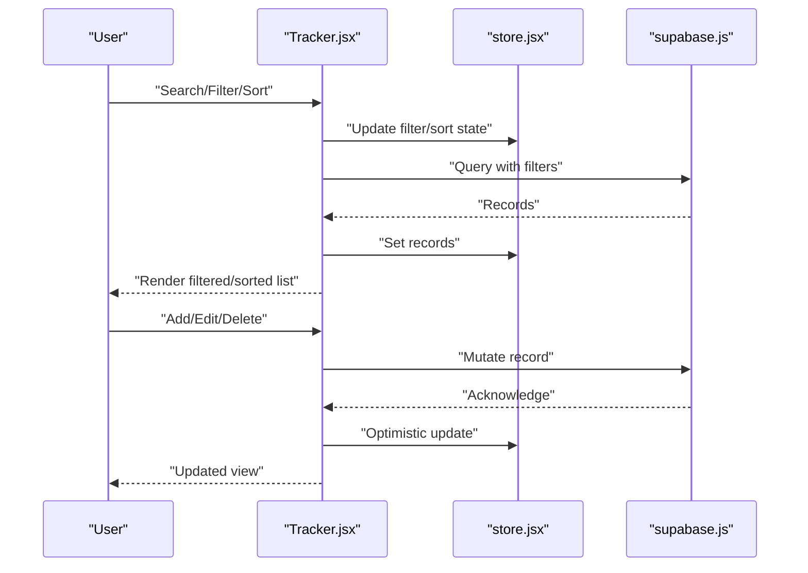
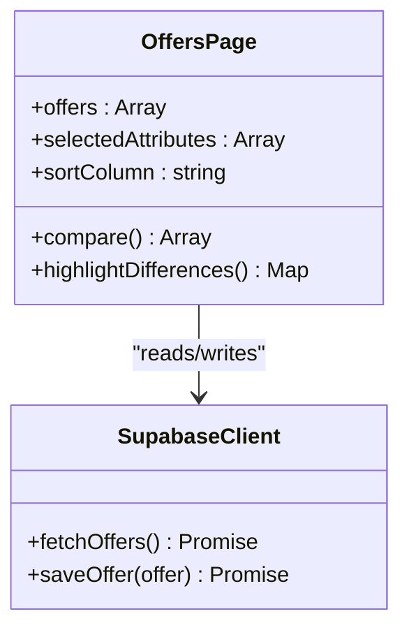
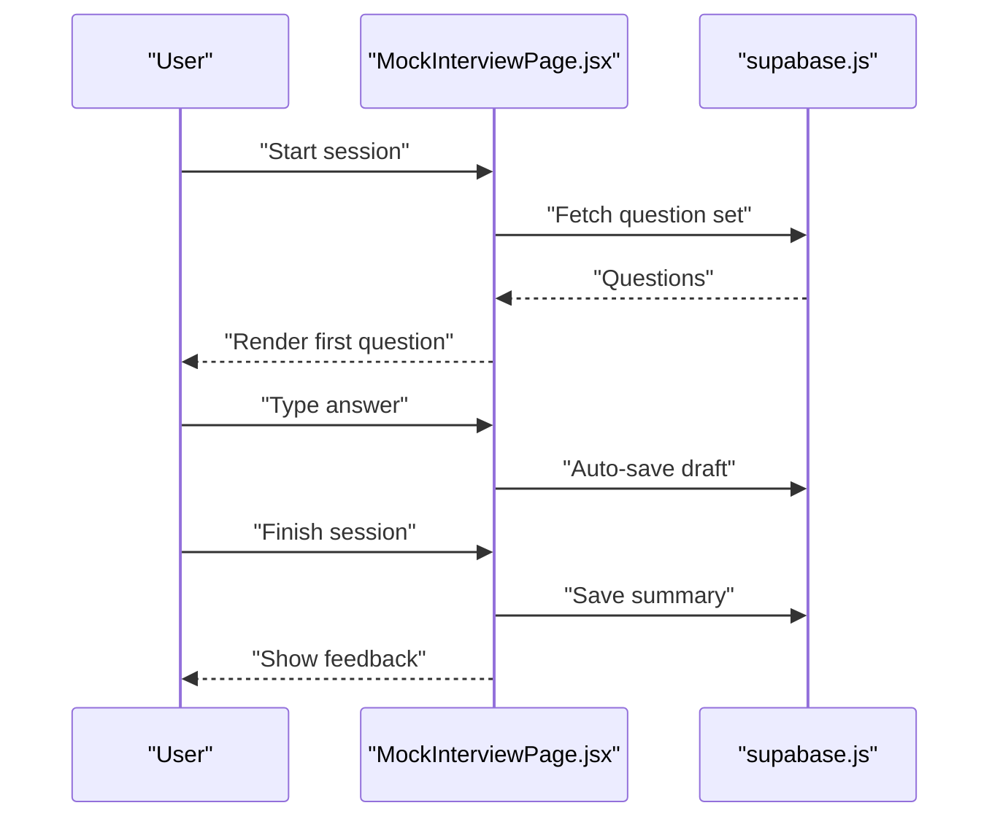
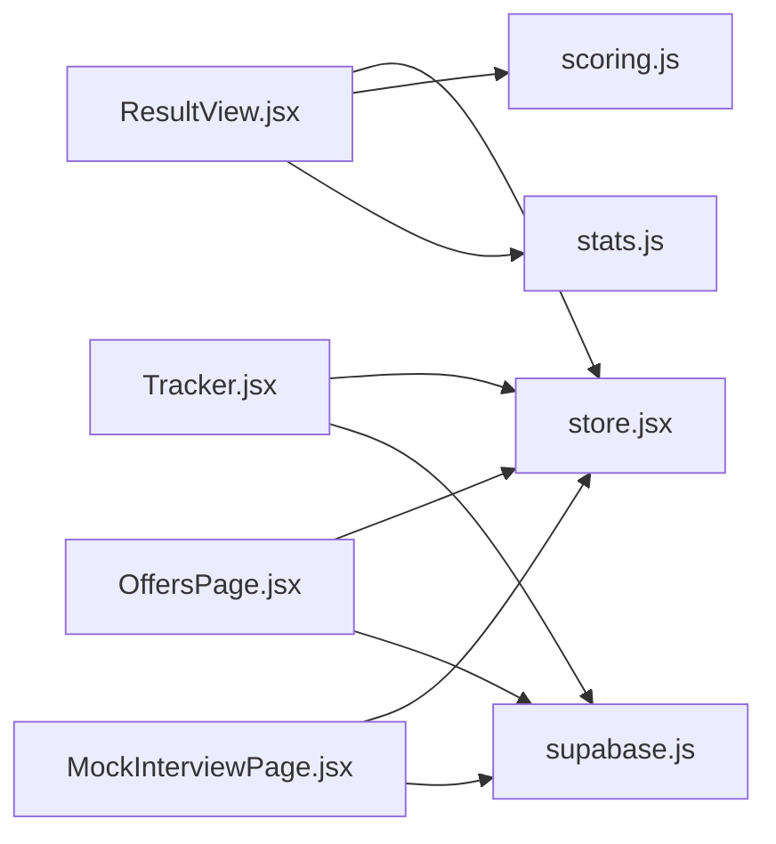

# Display Components

<cite>
**Referenced Files in This Document**
- [ResultView.jsx](file://src/components/ResultView.jsx)
- [Tracker.jsx](file://src/components/Tracker.jsx)
- [OffersPage.jsx](file://src/components/OffersPage.jsx)
- [MockInterviewPage.jsx](file://src/components/MockInterviewPage.jsx)
- [App.jsx](file://src/App.jsx)
- [store.jsx](file://src/store.jsx)
- [analyze.js](file://src/lib/analyze.js)
- [scoring.js](file://src/lib/scoring.js)
- [stats.js](file://src/lib/stats.js)
- [supabase.js](file://src/lib/supabase.js)
</cite>

## Table of Contents
1. [Introduction](#introduction)
2. [Project Structure](#project-structure)
3. [Core Components](#core-components)
4. [Architecture Overview](#architecture-overview)
5. [Detailed Component Analysis](#detailed-component-analysis)
6. [Dependency Analysis](#dependency-analysis)
7. [Performance Considerations](#performance-considerations)
8. [Troubleshooting Guide](#troubleshooting-guide)
9. [Conclusion](#conclusion)

## Introduction
This document explains the display components that render data and provide interactive interfaces in ApplyGuard PH. It focuses on:
- ResultView for displaying analysis results
- Tracker for job application management
- OffersPage for offer comparison
- MockInterviewPage for interview preparation

It covers data presentation patterns, chart visualization, table rendering, interactivity (filtering, sorting), responsive layouts, performance optimization for large datasets, and how these components consume data from business logic layers and handle user interactions.

## Project Structure
The display components live under src/components and are wired into the application via the root App component. Data and utilities used by these components are primarily in src/lib. State is managed centrally using a store pattern.

**Diagram sources**
- [App.jsx](file://src/App.jsx)
- [store.jsx](file://src/store.jsx)
- [ResultView.jsx](file://src/components/ResultView.jsx)
- [Tracker.jsx](file://src/components/Tracker.jsx)
- [OffersPage.jsx](file://src/components/OffersPage.jsx)
- [MockInterviewPage.jsx](file://src/components/MockInterviewPage.jsx)
- [analyze.js](file://src/lib/analyze.js)
- [scoring.js](file://src/lib/scoring.js)
- [stats.js](file://src/lib/stats.js)
- [supabase.js](file://src/lib/supabase.js)

**Section sources**
- [App.jsx](file://src/App.jsx)
- [store.jsx](file://src/store.jsx)

## Core Components
- ResultView: Renders analysis outcomes with charts and summary tables. It consumes scoring and stats utilities to compute visualizations and aggregates.
- Tracker: Manages job applications with list/table views, filtering, sorting, and persistence via Supabase.
- OffersPage: Compares multiple offers side-by-side, supports column-based sorting and filtering, and highlights differences.
- MockInterviewPage: Provides an interview practice interface with question sets, timers, and feedback summaries.

Key responsibilities:
- Present data clearly with responsive layouts
- Enable filtering and sorting for large lists
- Render charts and tables efficiently
- Bind UI state to central store or local state
- Interact with business logic modules for computations and data access

**Section sources**
- [ResultView.jsx](file://src/components/ResultView.jsx)
- [Tracker.jsx](file://src/components/Tracker.jsx)
- [OffersPage.jsx](file://src/components/OffersPage.jsx)
- [MockInterviewPage.jsx](file://src/components/MockInterviewPage.jsx)

## Architecture Overview
Display components follow a layered approach:
- Presentation layer: React components for UI and interactivity
- Business logic layer: Pure functions and helpers for analysis, scoring, and statistics
- Data layer: Supabase client for persistence and synchronization
- State layer: Centralized store for cross-component state sharing

**Diagram sources**
- [store.jsx](file://src/store.jsx)
- [analyze.js](file://src/lib/analyze.js)
- [scoring.js](file://src/lib/scoring.js)
- [stats.js](file://src/lib/stats.js)
- [supabase.js](file://src/lib/supabase.js)

## Detailed Component Analysis

### ResultView
Purpose:
- Display analysis results including scores, insights, and recommendations
- Visualize metrics with charts and present tabular breakdowns

Data presentation patterns:
- Chart visualization: Uses computed metrics from scoring and stats modules to render bar/pie/radar charts
- Summary cards: Key metrics at a glance
- Tables: Detailed line items with sortable columns

Interactivity:
- Toggle between metric views
- Sort table columns
- Filter by categories or date ranges

Data binding:
- Reads from central store for current analysis context
- Calls analyze and scoring utilities to derive values before rendering

Responsive layout:
- Grid-based layout adapts to screen size
- Charts resize based on container width

Performance considerations:
- Memoization of expensive computations
- Virtualized tables for large result sets
- Debounced filters to reduce re-renders

**Diagram sources**
- [ResultView.jsx](file://src/components/ResultView.jsx)
- [scoring.js](file://src/lib/scoring.js)
- [stats.js](file://src/lib/stats.js)
- [store.jsx](file://src/store.jsx)

**Section sources**
- [ResultView.jsx](file://src/components/ResultView.jsx)
- [scoring.js](file://src/lib/scoring.js)
- [stats.js](file://src/lib/stats.js)
- [store.jsx](file://src/store.jsx)

### Tracker
Purpose:
- Manage job applications with CRUD operations
- Provide list/table view with filtering and sorting
- Persist changes to Supabase

Data presentation patterns:
- Table with columns such as company, role, status, dates
- Status badges and quick actions
- Search input and filter chips

Interactivity:
- Add/edit/delete applications
- Filter by status, date range, keyword search
- Sort by any column

Data binding:
- Subscribes to Supabase for real-time updates
- Updates local store for optimistic UI where appropriate

Responsive layout:
- Collapsible rows on small screens
- Horizontal scroll for wide tables

Performance considerations:
- Pagination or infinite scrolling for large datasets
- Debounced search input
- Selective field fetching to minimize payload

**Diagram sources**
- [Tracker.jsx](file://src/components/Tracker.jsx)
- [supabase.js](file://src/lib/supabase.js)
- [store.jsx](file://src/store.jsx)

**Section sources**
- [Tracker.jsx](file://src/components/Tracker.jsx)
- [supabase.js](file://src/lib/supabase.js)
- [store.jsx](file://src/store.jsx)

### OffersPage
Purpose:
- Compare multiple offers side-by-side
- Highlight differences and summarize key terms

Data presentation patterns:
- Comparison table with row-wise attributes (salary, benefits, equity, etc.)
- Conditional highlighting for best/worst values per attribute
- Summary cards for top-level comparisons

Interactivity:
- Add/remove offers
- Sort columns to prioritize certain attributes
- Filter out irrelevant rows or attributes

Data binding:
- Loads offers from Supabase
- Computes normalized metrics for fair comparison

Responsive layout:
- Stacked cards on mobile
- Scrollable comparison grid on desktop

Performance considerations:
- Memoized normalization and diff calculations
- Lazy load additional details on demand

**Diagram sources**
- [OffersPage.jsx](file://src/components/OffersPage.jsx)
- [supabase.js](file://src/lib/supabase.js)

**Section sources**
- [OffersPage.jsx](file://src/components/OffersPage.jsx)
- [supabase.js](file://src/lib/supabase.js)

### MockInterviewPage
Purpose:
- Provide an interview practice environment
- Present questions, track time, and capture answers
- Summarize performance and suggestions

Data presentation patterns:
- Question list with progress indicators
- Timer display and answer text area
- Post-session summary with tips

Interactivity:
- Start/pause timer
- Navigate between questions
- Save session notes and results

Data binding:
- Loads question sets and templates
- Persists session data to Supabase

Responsive layout:
- Full-screen focus mode on mobile
- Sidebar navigation on larger screens

Performance considerations:
- Preload next question set
- Debounce auto-save of notes

**Diagram sources**
- [MockInterviewPage.jsx](file://src/components/MockInterviewPage.jsx)
- [supabase.js](file://src/lib/supabase.js)

**Section sources**
- [MockInterviewPage.jsx](file://src/components/MockInterviewPage.jsx)
- [supabase.js](file://src/lib/supabase.js)

## Dependency Analysis
Display components depend on:
- Central store for shared state
- Business logic modules for computation
- Supabase client for persistence

**Diagram sources**
- [ResultView.jsx](file://src/components/ResultView.jsx)
- [Tracker.jsx](file://src/components/Tracker.jsx)
- [OffersPage.jsx](file://src/components/OffersPage.jsx)
- [MockInterviewPage.jsx](file://src/components/MockInterviewPage.jsx)
- [store.jsx](file://src/store.jsx)
- [scoring.js](file://src/lib/scoring.js)
- [stats.js](file://src/lib/stats.js)
- [supabase.js](file://src/lib/supabase.js)

**Section sources**
- [ResultView.jsx](file://src/components/ResultView.jsx)
- [Tracker.jsx](file://src/components/Tracker.jsx)
- [OffersPage.jsx](file://src/components/OffersPage.jsx)
- [MockInterviewPage.jsx](file://src/components/MockInterviewPage.jsx)
- [store.jsx](file://src/store.jsx)
- [scoring.js](file://src/lib/scoring.js)
- [stats.js](file://src/lib/stats.js)
- [supabase.js](file://src/lib/supabase.js)

## Performance Considerations
- Use memoization for heavy computations (e.g., chart datasets, diffs)
- Implement virtualization for large tables
- Debounce inputs (search, filters) and auto-saves
- Paginate or lazy-load data when lists grow
- Prefer selective field queries to reduce payloads
- Batch updates to avoid excessive re-renders

[No sources needed since this section provides general guidance]

## Troubleshooting Guide
Common issues and resolutions:
- Charts not updating: Ensure derived metrics are recomputed after state changes; verify dependencies in memoization
- Filters not applying: Confirm filter state is persisted in store and passed down correctly
- Sorting errors: Validate comparator functions and stable keys for rows
- Persistence failures: Check Supabase client configuration and error handling paths
- Large dataset lag: Enable pagination/virtualization and debounce interactions

**Section sources**
- [ResultView.jsx](file://src/components/ResultView.jsx)
- [Tracker.jsx](file://src/components/Tracker.jsx)
- [OffersPage.jsx](file://src/components/OffersPage.jsx)
- [MockInterviewPage.jsx](file://src/components/MockInterviewPage.jsx)
- [supabase.js](file://src/lib/supabase.js)

## Conclusion
These display components implement clear separation between presentation, business logic, and data layers. They leverage centralized state, pure computation modules, and Supabase for persistence. With careful attention to memoization, virtualization, and debouncing, they remain performant even with large datasets while providing rich interactivity and responsive layouts.

[No sources needed since this section summarizes without analyzing specific files]