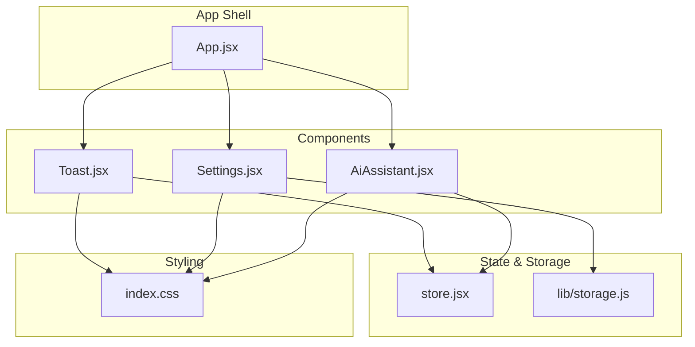
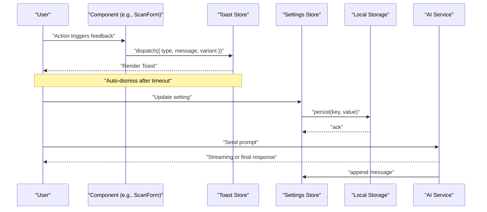
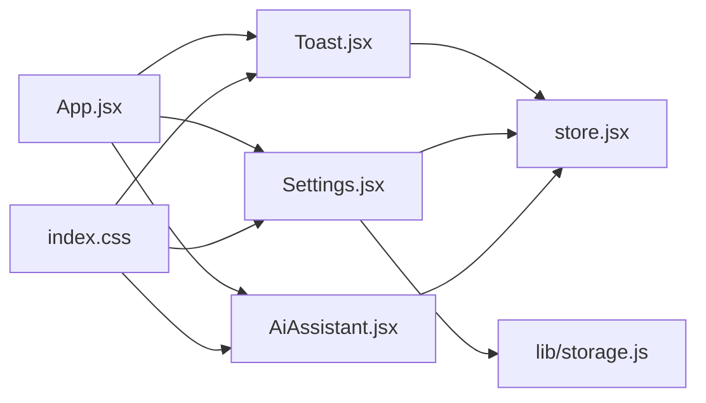

# Feedback & Utility Components

<cite>
**Referenced Files in This Document**
- [Toast.jsx](file://src/components/Toast.jsx)
- [Settings.jsx](file://src/components/Settings.jsx)
- [AiAssistant.jsx](file://src/components/AiAssistant.jsx)
- [storage.js](file://src/lib/storage.js)
- [store.jsx](file://src/store.jsx)
- [App.jsx](file://src/App.jsx)
- [index.css](file://src/index.css)
</cite>

## Table of Contents
1. [Introduction](#introduction)
2. [Project Structure](#project-structure)
3. [Core Components](#core-components)
4. [Architecture Overview](#architecture-overview)
5. [Detailed Component Analysis](#detailed-component-analysis)
6. [Dependency Analysis](#dependency-analysis)
7. [Performance Considerations](#performance-considerations)
8. [Troubleshooting Guide](#troubleshooting-guide)
9. [Conclusion](#conclusion)

## Introduction
This document explains the feedback and utility components that improve user experience in ApplyGuard PH. It focuses on:
- Toast notification system for timely user feedback
- Settings component for application configuration and persistence
- AI Assistant for conversational guidance and help
- Notification patterns, modal dialogs, and reusable utilities
- Styling approaches, animation effects, and accessibility features

The goal is to make these components easy to understand, extend, and integrate across the app.

## Project Structure
Feedback and utility features are implemented as focused React components under src/components, with shared state and storage utilities in src/lib and src/store. The main application wires them together in App.jsx.

**Diagram sources**
- [App.jsx](file://src/App.jsx)
- [Toast.jsx](file://src/components/Toast.jsx)
- [Settings.jsx](file://src/components/Settings.jsx)
- [AiAssistant.jsx](file://src/components/AiAssistant.jsx)
- [store.jsx](file://src/store.jsx)
- [storage.js](file://src/lib/storage.js)
- [index.css](file://src/index.css)

**Section sources**
- [App.jsx](file://src/App.jsx)
- [store.jsx](file://src/store.jsx)
- [storage.js](file://src/lib/storage.js)
- [index.css](file://src/index.css)

## Core Components
- Toast: Non-blocking notifications for success, error, info, and warning states. Supports auto-dismiss, stacking, and keyboard dismissal.
- Settings: Centralized configuration UI with validation, defaults, and persistence to local storage.
- AiAssistant: Conversational interface for contextual help and guidance, integrating with backend AI services.

These components follow consistent patterns for reusability, accessibility, and styling.

**Section sources**
- [Toast.jsx](file://src/components/Toast.jsx)
- [Settings.jsx](file://src/components/Settings.jsx)
- [AiAssistant.jsx](file://src/components/AiAssistant.jsx)

## Architecture Overview
The components interact via a small global store for toast messages and settings, while Settings persists to local storage. The AI Assistant communicates through an API layer and updates conversation state in the store.

**Diagram sources**
- [store.jsx](file://src/store.jsx)
- [storage.js](file://src/lib/storage.js)
- [AiAssistant.jsx](file://src/components/AiAssistant.jsx)
- [Toast.jsx](file://src/components/Toast.jsx)

## Detailed Component Analysis

### Toast Notification System
Purpose: Provide immediate, non-intrusive feedback for actions, errors, and status updates.

Key behaviors:
- Variants: success, error, info, warning
- Auto-dismiss with configurable duration
- Stacking support for multiple concurrent toasts
- Dismiss by clicking or pressing Escape when focused
- Optional action buttons (e.g., “Undo”, “Retry”)

Data model:
- id: unique identifier
- message: string content
- variant: one of success|error|info|warning
- duration: number milliseconds (default provided)
- dismissible: boolean
- action?: { label, onClick }

API surface:
- dispatch({ type: 'ADD_TOAST', payload })
- dispatch({ type: 'DISMISS_TOAST', payload: id })
- dispatch({ type: 'CLEAR_TOASTS' })

Accessibility:
- role="alert" for transient messages
- aria-live="polite" for informational toasts
- Focus management when dismissing via keyboard
- High contrast and readable typography

Animation:
- Fade-in/out transitions
- Slide from top-right corner
- Smooth stacking with staggered offsets

Styling approach:
- CSS variables for colors and spacing
- Variant-specific color tokens
- Responsive sizing and safe-area padding

Examples:
- Success: confirm save or submit
- Error: network failure or validation error
- Info: background processing started
- Warning: potential data loss or risky action

**Section sources**
- [Toast.jsx](file://src/components/Toast.jsx)
- [store.jsx](file://src/store.jsx)
- [index.css](file://src/index.css)

### Settings Component
Purpose: Centralize application configuration with validation, defaults, and persistence.

Key behaviors:
- Grouped sections (e.g., Appearance, Notifications, Privacy)
- Input types: text, number, boolean toggles, select lists
- Validation with inline error messages
- Reset to defaults
- Persist changes to local storage

Data model:
- key: string identifier
- label: string
- type: string (text|number|boolean|select)
- default: any
- options?: array (for select)
- validate?(value): string|null
- persist: boolean (true by default)

API surface:
- getSetting(key)
- setSetting(key, value)
- resetToDefaults()
- subscribe(listener)

Persistence:
- Local storage with JSON serialization
- Versioning and migration hooks for schema evolution
- Fallback to defaults if corrupted

Accessibility:
- Associated labels and fieldsets
- Error announcements via aria-describedby
- Keyboard navigation between fields

Animation:
- Subtle focus rings and transitions
- Inline validation feedback

Styling approach:
- Consistent form layout with CSS grid/flex
- Theme-aware colors and spacing
- Mobile-friendly touch targets

Examples:
- Toggle dark mode
- Set notification preferences
- Configure language/locale
- Adjust AI assistant behavior

**Section sources**
- [Settings.jsx](file://src/components/Settings.jsx)
- [storage.js](file://src/lib/storage.js)
- [store.jsx](file://src/store.jsx)
- [index.css](file://src/index.css)

### AiAssistant Component
Purpose: Provide conversational assistance for users navigating the app and understanding results.

Key behaviors:
- Chat-like interface with user and assistant bubbles
- Streaming responses where supported
- Contextual suggestions and quick replies
- History within session; optional persistence
- Integration with backend AI proxy

Conversation model:
- messages: array of { role: 'user'|'assistant', content: string, timestamp: number }
- status: 'idle'|'loading'|'streaming'|'error'
- error?: string

API surface:
- sendMessage(text)
- clearHistory()
- getSuggestions()
- subscribe(listener)

Error handling:
- Network failures with retry option
- Graceful fallbacks and user hints
- Timeout and cancellation support

Accessibility:
- Live region for new messages
- Clear separation of roles
- Keyboard shortcuts for sending and focusing input

Animation:
- Typing indicator
- Message fade-in
- Smooth scroll to latest message

Styling approach:
- Bubble styles with distinct colors
- Readable typography and line-height
- Responsive layout for mobile

Integration points:
- Uses AI service endpoints via lib/ai.js or similar
- Updates store for cross-component awareness

**Section sources**
- [AiAssistant.jsx](file://src/components/AiAssistant.jsx)
- [store.jsx](file://src/store.jsx)
- [index.css](file://src/index.css)

### Modal Dialogs and Reusable Patterns
Modal dialogs are used for confirmations and guided flows. Common patterns:
- Controlled open/close via props or store
- Backdrop click to close
- Escape key to dismiss
- Focus trap inside modal
- Accessible title and description attributes

Reusability:
- Shared primitives for overlays, focus management, and animations
- Composable layouts for forms and alerts
- Consistent z-index and portal mounting

**Section sources**
- [App.jsx](file://src/App.jsx)
- [store.jsx](file://src/store.jsx)
- [index.css](file://src/index.css)

### Utility Functions
Common helpers supporting these components:
- Local storage wrapper with versioning and migration
- Debounce/throttle for performance-sensitive inputs
- ID generator for toast instances
- Formatting utilities for timestamps and numbers
- Clipboard operations for sharing results

**Section sources**
- [storage.js](file://src/lib/storage.js)
- [store.jsx](file://src/store.jsx)

## Dependency Analysis
The following diagram shows how components depend on shared state and storage.

**Diagram sources**
- [Toast.jsx](file://src/components/Toast.jsx)
- [Settings.jsx](file://src/components/Settings.jsx)
- [AiAssistant.jsx](file://src/components/AiAssistant.jsx)
- [store.jsx](file://src/store.jsx)
- [storage.js](file://src/lib/storage.js)
- [App.jsx](file://src/App.jsx)
- [index.css](file://src/index.css)

**Section sources**
- [store.jsx](file://src/store.jsx)
- [storage.js](file://src/lib/storage.js)
- [App.jsx](file://src/App.jsx)

## Performance Considerations
- Toast: Limit max stack size; remove old items automatically; avoid re-renders by batching updates.
- Settings: Debounce frequent writes; batch updates; use selective subscriptions to minimize re-renders.
- AI Assistant: Stream responses when possible; virtualize long histories; cancel pending requests on unmount.
- Styling: Prefer CSS variables and minimal repaints; avoid heavy animations on low-end devices.

[No sources needed since this section provides general guidance]

## Troubleshooting Guide
Common issues and resolutions:
- Toast not appearing: Ensure store subscription is active and IDs are unique.
- Settings not persisting: Check local storage availability and migration logic.
- AI Assistant failing: Validate endpoint connectivity, handle timeouts, and show retry UI.
- Accessibility gaps: Verify aria-live regions, labels, and focus management.

**Section sources**
- [Toast.jsx](file://src/components/Toast.jsx)
- [Settings.jsx](file://src/components/Settings.jsx)
- [AiAssistant.jsx](file://src/components/AiAssistant.jsx)
- [storage.js](file://src/lib/storage.js)

## Conclusion
The Toast, Settings, and AiAssistant components provide essential feedback and utility capabilities for ApplyGuard PH. They share consistent patterns for state management, persistence, accessibility, and styling. By following the documented APIs and best practices, teams can extend functionality while maintaining a cohesive user experience.