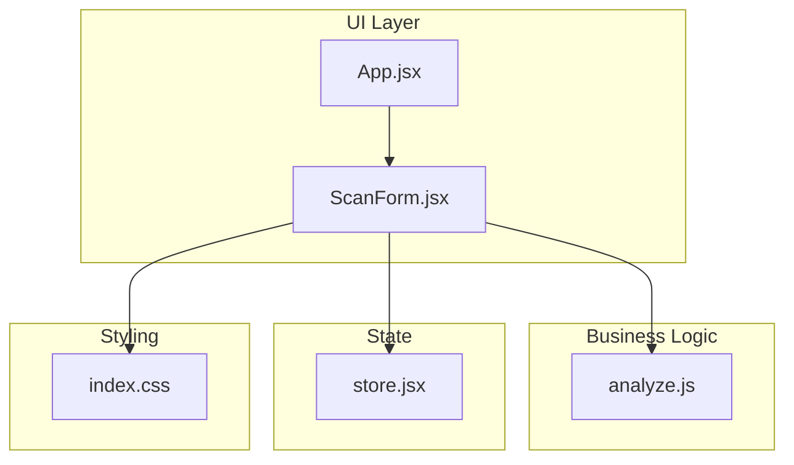
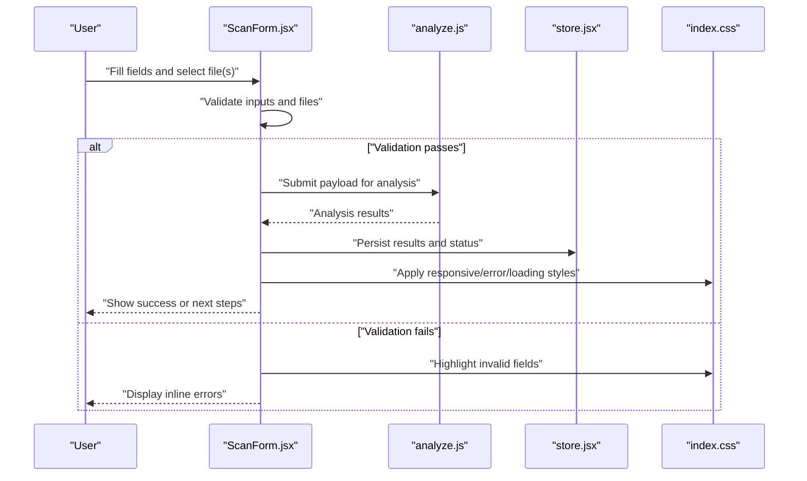
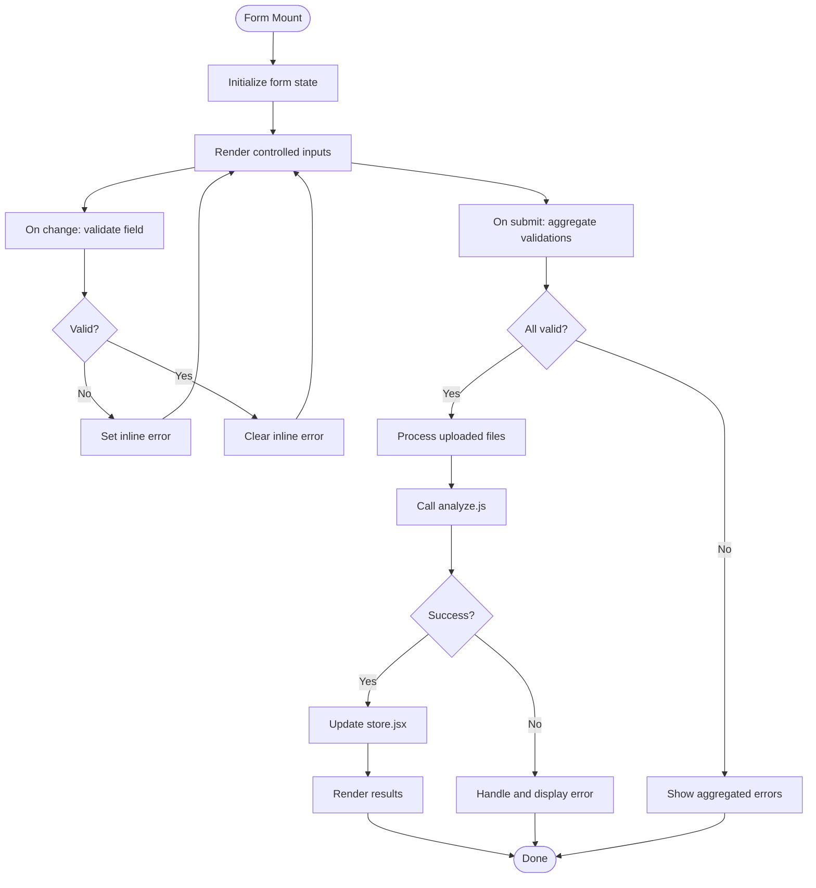
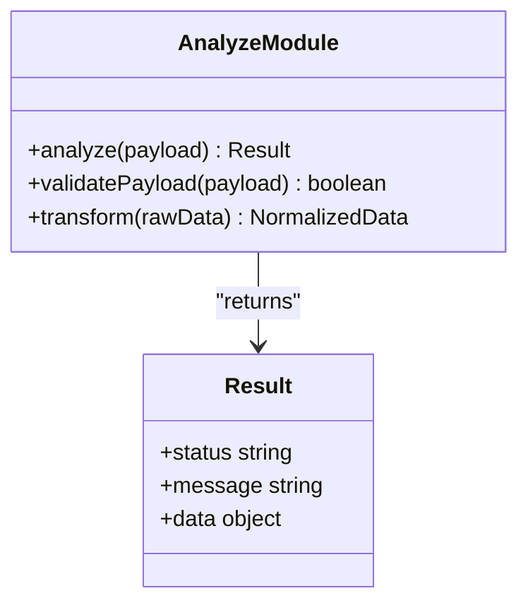
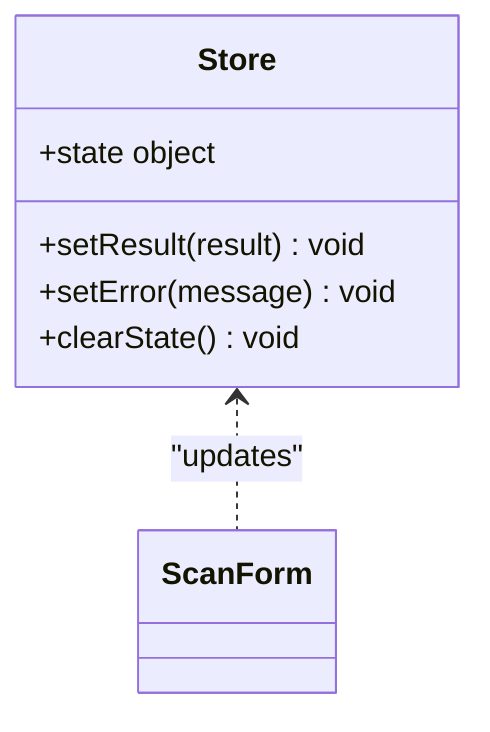
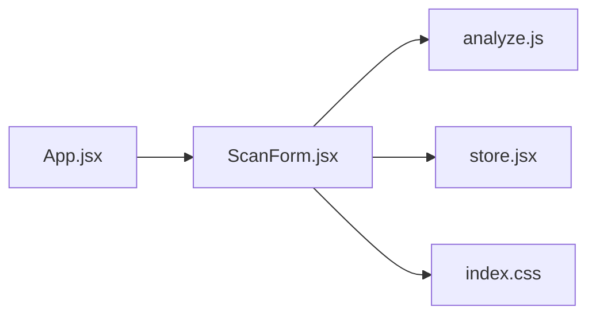

# Form Components

<cite>
**Referenced Files in This Document**
- [ScanForm.jsx](file://src/components/ScanForm.jsx)
- [analyze.js](file://src/lib/analyze.js)
- [store.jsx](file://src/store.jsx)
- [App.jsx](file://src/App.jsx)
- [index.css](file://src/index.css)
</cite>

## Table of Contents
1. [Introduction](#introduction)
2. [Project Structure](#project-structure)
3. [Core Components](#core-components)
4. [Architecture Overview](#architecture-overview)
5. [Detailed Component Analysis](#detailed-component-analysis)
6. [Dependency Analysis](#dependency-analysis)
7. [Performance Considerations](#performance-considerations)
8. [Troubleshooting Guide](#troubleshooting-guide)
9. [Conclusion](#conclusion)

## Introduction
This document explains the form components in ApplyGuard PH with a focus on the ScanForm component and general form handling patterns. It covers validation strategies, input handling, file upload processing, error management, integration with business logic modules (notably analyze.js), and how user data is submitted and processed. It also includes guidance on form state management, accessibility considerations, responsive design, custom controls, file processing utilities, and integration points for resume scanning functionality.

## Project Structure
The form-related code is primarily located under src/components and src/lib:
- ScanForm.jsx implements the resume scan form UI and orchestration.
- analyze.js contains business logic for analyzing resumes or related content.
- store.jsx provides shared application state used by forms and other components.
- App.jsx wires up routes/pages and may include global providers or layout context.
- index.css holds global styles that influence form responsiveness and appearance.

**Diagram sources**
- [App.jsx](file://src/App.jsx)
- [ScanForm.jsx](file://src/components/ScanForm.jsx)
- [analyze.js](file://src/lib/analyze.js)
- [store.jsx](file://src/store.jsx)
- [index.css](file://src/index.css)

**Section sources**
- [ScanForm.jsx](file://src/components/ScanForm.jsx)
- [analyze.js](file://src/lib/analyze.js)
- [store.jsx](file://src/store.jsx)
- [App.jsx](file://src/App.jsx)
- [index.css](file://src/index.css)

## Core Components
- ScanForm.jsx
  - Purpose: Provides the primary interface for uploading and submitting resume data for analysis.
  - Responsibilities:
    - Manages local form state (inputs, files, errors).
    - Validates inputs and files before submission.
    - Calls business logic in analyze.js to process data.
    - Updates shared state via store.jsx when needed.
    - Displays feedback and errors to users.
    - Ensures accessible labels, keyboard navigation, and screen reader support.
    - Adapts layout for mobile and desktop using CSS classes from index.css.

- analyze.js
  - Purpose: Encapsulates resume analysis logic invoked by ScanForm.
  - Responsibilities:
    - Accepts structured input derived from form submissions.
    - Performs transformations, scoring, or AI-assisted analysis.
    - Returns results suitable for rendering in result views.

- store.jsx
  - Purpose: Centralized state container for app-wide data including form results and status flags.
  - Responsibilities:
    - Holds current analysis results, loading states, and error messages.
    - Exposes actions/setters used by ScanForm to update UI state.

- App.jsx
  - Purpose: Application shell and routing/layout provider.
  - Responsibilities:
    - Renders ScanForm within appropriate layouts.
    - May provide global context or theme settings affecting form behavior.

- index.css
  - Purpose: Global styles including responsive breakpoints and form control styling.
  - Responsibilities:
    - Defines spacing, typography, and layout rules for forms.
    - Implements responsive behaviors for small screens.

**Section sources**
- [ScanForm.jsx](file://src/components/ScanForm.jsx)
- [analyze.js](file://src/lib/analyze.js)
- [store.jsx](file://src/store.jsx)
- [App.jsx](file://src/App.jsx)
- [index.css](file://src/index.css)

## Architecture Overview
The form architecture follows a clear separation between UI, business logic, and state:
- ScanForm orchestrates user interactions and delegates analysis to analyze.js.
- Results are persisted into store.jsx for consumption by other components.
- Styling is applied through index.css, ensuring consistent and responsive form experiences.

**Diagram sources**
- [ScanForm.jsx](file://src/components/ScanForm.jsx)
- [analyze.js](file://src/lib/analyze.js)
- [store.jsx](file://src/store.jsx)
- [index.css](file://src/index.css)

## Detailed Component Analysis

### ScanForm Component
ScanForm manages the complete lifecycle of resume scanning:
- State Management
  - Tracks input values, selected files, validation errors, and submission status.
  - Uses controlled inputs to keep UI synchronized with state.
  - Integrates with store.jsx to persist results and share across the app.

- Validation Strategy
  - Field-level validation for required inputs and format checks.
  - File validation for type, size, and readability constraints.
  - Aggregates errors and surfaces them near relevant fields.

- Input Handling
  - Controlled onChange handlers update state incrementally.
  - Debounced updates for performance where applicable.
  - Keyboard-friendly navigation and ARIA attributes for accessibility.

- File Upload Processing
  - Accepts supported resume formats and enforces size limits.
  - Pre-processes files (e.g., text extraction) before sending to analyzer.
  - Handles large files gracefully with progress indicators and error messaging.

- Integration with Business Logic
  - Invokes analyze.js functions with validated payloads.
  - Maps analyzer outputs to UI state and result views.
  - Retries failed operations with user-visible feedback.

- Error Management
  - Network and parsing errors are caught and normalized.
  - User-friendly messages guide corrective actions.
  - Global error boundaries may wrap form to prevent crashes.

- Accessibility and Responsiveness
  - Labels, aria-describedby, and role attributes improve screen reader experience.
  - Focus management ensures logical tab order.
  - Responsive CSS adapts form layout for mobile devices.

**Diagram sources**
- [ScanForm.jsx](file://src/components/ScanForm.jsx)
- [analyze.js](file://src/lib/analyze.js)
- [store.jsx](file://src/store.jsx)

**Section sources**
- [ScanForm.jsx](file://src/components/ScanForm.jsx)
- [analyze.js](file://src/lib/analyze.js)
- [store.jsx](file://src/store.jsx)

### analyze.js Business Logic Module
- Input Contract
  - Receives structured data from ScanForm, including extracted resume text and metadata.
  - Enforces expected schema; returns standardized result objects.

- Processing Pipeline
  - Normalizes input, applies scoring or classification rules.
  - Optionally integrates external APIs or AI services for enhanced insights.

- Output Contract
  - Produces results consumable by UI components and stored in store.jsx.
  - Includes status codes, messages, and actionable recommendations.

**Diagram sources**
- [analyze.js](file://src/lib/analyze.js)

**Section sources**
- [analyze.js](file://src/lib/analyze.js)

### store.jsx Shared State
- State Shape
  - Holds current analysis results, loading flags, and error messages.
  - Provides setters/actions for components to update state safely.

- Usage Patterns
  - ScanForm dispatches actions after successful analysis.
  - Other components subscribe to state changes to render updated UI.

**Diagram sources**
- [store.jsx](file://src/store.jsx)
- [ScanForm.jsx](file://src/components/ScanForm.jsx)

**Section sources**
- [store.jsx](file://src/store.jsx)
- [ScanForm.jsx](file://src/components/ScanForm.jsx)

### App.jsx Integration
- Layout and Routing
  - Renders ScanForm within the application shell.
  - May provide global context or theme settings influencing form behavior.

- Provider Setup
  - Ensures store and any necessary contexts are available to ScanForm.

**Section sources**
- [App.jsx](file://src/App.jsx)
- [ScanForm.jsx](file://src/components/ScanForm.jsx)

### index.css Styling and Responsiveness
- Form Control Styles
  - Consistent spacing, typography, and focus states.
  - Error and success visual cues aligned with brand guidelines.

- Responsive Design
  - Breakpoints adjust layout for mobile and tablet devices.
  - Touch-friendly targets and readable font sizes.

**Section sources**
- [index.css](file://src/index.css)
- [ScanForm.jsx](file://src/components/ScanForm.jsx)

## Dependency Analysis
ScanForm depends on:
- analyze.js for core analysis logic.
- store.jsx for state persistence and sharing.
- index.css for styling and responsive behavior.
- App.jsx for layout and context provisioning.

**Diagram sources**
- [ScanForm.jsx](file://src/components/ScanForm.jsx)
- [analyze.js](file://src/lib/analyze.js)
- [store.jsx](file://src/store.jsx)
- [index.css](file://src/index.css)
- [App.jsx](file://src/App.jsx)

**Section sources**
- [ScanForm.jsx](file://src/components/ScanForm.jsx)
- [analyze.js](file://src/lib/analyze.js)
- [store.jsx](file://src/store.jsx)
- [index.css](file://src/index.css)
- [App.jsx](file://src/App.jsx)

## Performance Considerations
- Debounce input updates to reduce re-renders during typing.
- Limit file size and pre-validate types to avoid heavy processing.
- Use lazy evaluation for expensive analysis tasks; show loading states.
- Memoize derived data in store.jsx to minimize recomputation.
- Optimize CSS selectors and avoid layout thrashing on form interactions.

[No sources needed since this section provides general guidance]

## Troubleshooting Guide
Common issues and resolutions:
- Validation Errors
  - Ensure all required fields are filled and formatted correctly.
  - Check inline error messages and aria-describedby associations.

- File Upload Failures
  - Verify supported file types and size limits.
  - Inspect network logs for upload errors and retry policies.

- Analysis Errors
  - Confirm payload structure matches analyze.js contract.
  - Review error messages returned by analyzer and handle gracefully.

- State Sync Problems
  - Verify store.jsx actions are dispatched after successful analysis.
  - Check for race conditions when multiple components update state concurrently.

- Accessibility Issues
  - Confirm labels and roles are present for all interactive elements.
  - Test keyboard navigation and screen reader announcements.

**Section sources**
- [ScanForm.jsx](file://src/components/ScanForm.jsx)
- [analyze.js](file://src/lib/analyze.js)
- [store.jsx](file://src/store.jsx)
- [index.css](file://src/index.css)

## Conclusion
The ScanForm component exemplifies robust form handling in ApplyGuard PH by combining controlled inputs, comprehensive validation, file processing, and seamless integration with analyze.js and store.jsx. With attention to accessibility and responsive design, it delivers a reliable user experience for resume scanning workflows. Following the patterns outlined here will help maintain consistency, performance, and usability across future form features.

[No sources needed since this section summarizes without analyzing specific files]